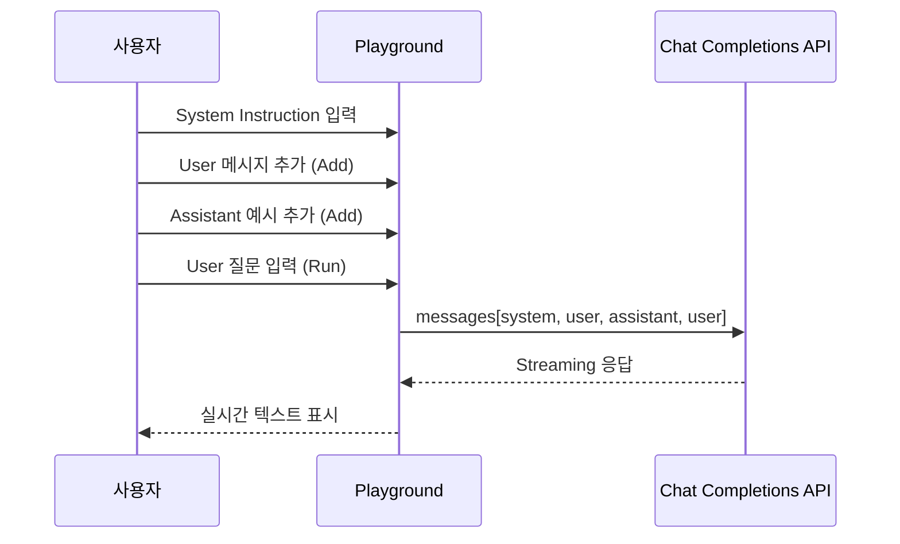

플레이그라운드(Playground)는 **관리자 전용** 실험 환경으로, 대화 기록 없이 LLM 모델을 빠르게 테스트할 수 있습니다.
프롬프트 엔지니어링, 모델 비교, System Instruction 검증 등에 활용합니다.

`/playground` URL로 직접 접근합니다. 사이드바 메뉴에는 별도 링크가 없습니다.

<Frame caption="플레이그라운드 Chat 모드 전체 화면">
  
</Frame>

<Warning>
  관리자(admin) 역할만 접근 가능합니다. 일반 사용자는 `/playground` 접근 시 홈으로 리디렉션됩니다.
</Warning>

<Note>
  플레이그라운드의 모든 대화는 **임시(ephemeral)**입니다. 페이지를 떠나면 내용이 사라지며, 채팅 이력이나 감사 로그에 기록되지 않습니다.
</Note>

---

## 모드 전환

플레이그라운드는 상단 탭으로 두 가지 모드를 제공합니다.

| 모드 | 경로 | 용도 |
|------|------|------|
| **Chat** | `/playground` | 멀티턴 대화 테스트 (System Instruction + 역할별 메시지) |
| **Completions** | `/playground/completions` | 단일 텍스트 완성 테스트 |

---

## Chat 모드

멀티턴 대화를 구성하여 모델 응답을 테스트합니다. System Instruction 설정, 메시지 역할 전환, 대화 이력 편집이 가능합니다.

### 기본 사용법

<Steps>
  <Step title="모델 선택">
    우측 Settings 사이드바(톱니바퀴 아이콘 클릭)의 모델 선택 드롭다운에서 테스트할 모델을 선택합니다. 사용자 설정의 기본 모델이 자동 선택됩니다. 설정된 기본 모델이 없으면 수동 선택이 필요합니다.
  </Step>
  <Step title="System Instruction 설정 (선택)">
    상단의 **System Instructions** 섹션을 펼쳐 시스템 프롬프트를 입력합니다.
    모델의 역할, 제약조건, 응답 스타일 등을 지정합니다.

    
  </Step>
  <Step title="메시지 입력 및 실행">
    하단 입력창에 메시지를 작성하고 **Run** 버튼을 클릭합니다.
    모델이 실시간 스트리밍으로 응답을 생성합니다.
  </Step>
</Steps>

### 메시지 역할 관리

Chat 모드에서는 각 메시지의 역할(User/Assistant)을 자유롭게 구성할 수 있습니다.

<Frame caption="메시지 역할 관리">
  
</Frame>

| 기능 | 설명 |
|------|------|
| **역할 전환** | 입력창 좌측 버튼으로 User ↔ Assistant 역할 토글 |
| **Add** | 현재 메시지를 대화에 추가 (모델 호출 없이). 클릭 시 역할(User/Assistant)이 자동 토글됩니다 |
| **Run** | 현재 메시지를 추가하고 모델 응답 생성 |
| **메시지 편집** | 기존 메시지 텍스트를 직접 수정 |
| **메시지 삭제** | 마우스 호버 시 나타나는 삭제 버튼으로 제거 |

<Tip>
  **Few-shot 프롬프팅** 테스트에 유용합니다. User 메시지와 Assistant 메시지를 번갈아 추가하여 예시 대화를 구성한 뒤, 마지막 User 메시지에서 Run을 실행하세요.
</Tip>

### System Instruction

- 접이식 헤더로 화면 공간을 효율적으로 사용
- 접힌 상태에서 첫 줄 미리보기 표시
- 수정 시 다음 Run부터 반영 (이전 응답에는 영향 없음)

---

## Completions 모드

단일 텍스트 입력에 대한 모델 완성(continuation)을 테스트합니다. 대화 구조 없이 순수 텍스트 생성에 집중합니다.

<Frame caption="Completions 모드">
  
</Frame>

<Steps>
  <Step title="모델 선택">
    상단 드롭다운에서 모델을 선택합니다.
  </Step>
  <Step title="시작 텍스트 입력">
    텍스트 영역에 완성할 시작 문구를 입력합니다.
  </Step>
  <Step title="Run 실행">
    **Run** 버튼을 클릭하면 모델이 이어지는 텍스트를 실시간으로 생성합니다.
    생성된 텍스트는 입력 텍스트 뒤에 이어서 표시됩니다.
  </Step>
</Steps>

<Note>
  Completions 모드는 System Instruction을 사용하지 않습니다. 입력 텍스트가 그대로 모델에 전달됩니다.
</Note>

---

## 공통 기능

### 스트리밍 응답

두 모드 모두 Server-Sent Events(SSE) 기반 실시간 스트리밍을 지원합니다.

- 응답이 토큰 단위로 실시간 표시
- 생성 중 **Cancel** 버튼으로 즉시 중단 가능
- 텍스트 영역이 내용에 맞춰 자동 확장

### 모델 선택

- 관리자 설정에서 활성화된 모든 모델 사용 가능
- 사용자 설정의 기본 모델 자동 선택
- 모델 이름이 드롭다운에, 모델 ID가 입력창 상단에 각각 표시됩니다

---

## 활용 시나리오

<Accordion title="프롬프트 엔지니어링">
  System Instruction과 few-shot 예시를 조합하여 최적의 프롬프트를 반복 테스트합니다.
  결과가 만족스러우면 해당 프롬프트를 [에이전트](/ko/workspace/agents)나 [프롬프트](/ko/workspace/prompts)에 적용합니다.
</Accordion>

<Accordion title="모델 성능 비교">
  동일한 프롬프트로 여러 모델을 순차 테스트하여 응답 품질, 속도, 비용을 비교합니다.
  Chat 모드의 모델 전환이 간편하여 빠른 비교가 가능합니다.
</Accordion>

<Accordion title="System Instruction 검증">
  에이전트에 적용할 System Instruction을 미리 테스트합니다.
  다양한 사용자 입력에 대해 일관된 응답을 생성하는지 확인합니다.
</Accordion>

<Accordion title="텍스트 완성 테스트">
  Completions 모드에서 문서 초안, 코드 스니펫, 번역 등의 텍스트 생성 품질을 확인합니다.
</Accordion>

---

## Chat vs Completions 비교

| 항목 | Chat | Completions |
|------|------|-------------|
| System Instruction | O | X |
| 멀티턴 대화 | O | X |
| 역할 지정 | User / Assistant | 없음 |
| 메시지 편집/삭제 | O | X (전체 텍스트 편집) |
| 용도 | 대화형 프롬프트 테스트 | 텍스트 완성/생성 테스트 |
