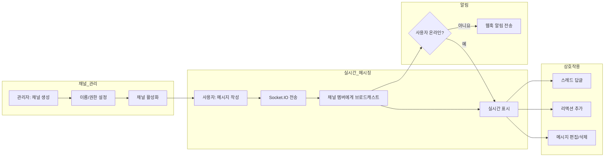
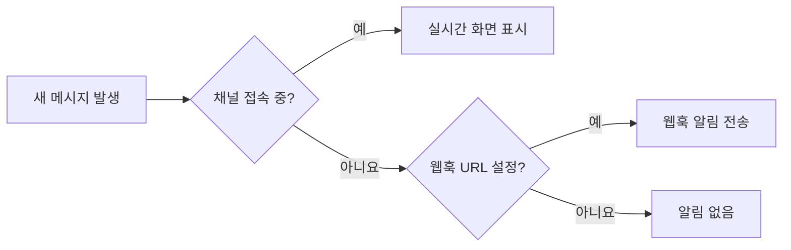

채널은 팀원 간 **실시간 메시징 공간**입니다. Slack과 유사한 방식으로 메시지를 주고받고, 스레드로 주제별 토론을 진행하며, 리액션으로 간편하게 의사를 표현할 수 있습니다. Socket.IO 기반의 실시간 통신으로 메시지가 즉시 전달됩니다.

<Frame caption="채널에서 팀원과 실시간으로 메시지를 주고받습니다">
  
</Frame>

---

## 채널 동작 흐름

---

## 채널 생성

채널은 **관리자만** 생성할 수 있습니다.

<Note>
  채널 기능은 관리자 설정에서 `enable_channels` 기능 플래그가 활성화되어 있어야 사이드바에 표시됩니다.
</Note>

<Steps>
  <Step title="채널 생성 메뉴 접근">
    사이드바의 **채널** 섹션에서 **"+"** 버튼을 클릭합니다.
  </Step>

  <Step title="채널 정보 입력">
    | 필드 | 설명 | 예시 |
    |------|------|------|
    | **이름** | 채널 이름 (공백이 하이픈(-)으로 변환되고, 소문자로 자동 변환) | "dev-team" |
    | **공개 범위** | 채널 참여 가능한 그룹/조직 설정 | 개발팀 그룹 |

    

    <Note>
      채널 이름은 생성 시 공백이 하이픈으로, 대문자가 소문자로 자동 변환됩니다. 예: "Dev Team" -> "dev-team"
    </Note>
  </Step>

  <Step title="생성 완료">
    **"생성"** 버튼을 클릭하면 채널이 생성되고 사이드바에 표시됩니다.
  </Step>
</Steps>

---

## 채널 편집 및 삭제

채널 수정과 삭제는 **관리자만** 가능합니다. 사이드바에서 채널명에 마우스를 올리고 톱니바퀴 아이콘을 클릭하여 설정에 접근합니다.

| 작업 | 방법 | 비고 |
|------|------|------|
| **이름 변경** | 채널 설정에서 이름 수정 | 공백→하이픈, 소문자 자동 변환 |
| **공개 범위 변경** | 채널 설정에서 공개 범위 수정 | 그룹/조직 단위 |
| **삭제** | 채널 설정에서 삭제 버튼 클릭 | 채널만 삭제됨 |

<Warning>
  채널을 삭제하면 채널만 삭제되며, 메시지 데이터는 별도 처리될 수 있습니다. 삭제 후 복구할 수 없으므로 신중하게 진행하세요.
</Warning>

---

## 메시지 보내기

### 기본 메시지

채널 하단의 입력창에 메시지를 작성하고 전송합니다.

<Frame caption="텍스트, 파일 첨부, 화면 캡처를 지원하는 입력창">
  
</Frame>

| 기능 | 설명 |
|------|------|
| **텍스트 메시지** | Rich Text 입력 지원 (서식, 링크 등) |
| **파일 첨부** | 이미지, 문서 등 파일 업로드 |
| **화면 캡처** | 브라우저 내장 화면 캡처 기능 |
| **음성 녹음** | 음성을 녹음하여 텍스트로 변환 후 전송 |

### 실시간 타이핑 표시

다른 사용자가 메시지를 입력 중이면 입력창 상단에 타이핑 인디케이터가 표시됩니다. 5초간 입력이 없으면 자동으로 사라집니다.

---

## 스레드

메시지에 대한 답글을 스레드로 묶어서 관리합니다. 채널의 메인 흐름을 방해하지 않고 특정 주제에 대해 심층 토론할 수 있습니다.

<Steps>
  <Step title="스레드 시작">
    메시지에 마우스를 올리고 **스레드에 답글** 아이콘 버튼을 클릭합니다.
  </Step>
  <Step title="답글 작성">
    화면 우측에 스레드 패널이 열립니다. 답글을 작성하고 전송합니다.
  </Step>
  <Step title="스레드 확인">
    원본 메시지 하단에 답글 수와 마지막 답글 시간이 표시됩니다.
  </Step>
</Steps>

### 스레드 표시 방식

| 화면 크기 | 동작 |
|-----------|------|
| **데스크톱 (1024px+)** | 좌우 분할 패널로 채널과 스레드를 동시에 표시. 패널 크기 조절 가능 |
| **모바일/태블릿** | Drawer로 스레드 패널이 오버레이 표시 |

<Tip>
  데스크톱에서는 채널 메시지와 스레드를 좌우 분할 화면으로 동시에 볼 수 있어 컨텍스트를 유지하면서 토론이 가능합니다.
</Tip>

---

## 리액션

메시지에 이모지 리액션을 추가하여 간편하게 의사를 표현합니다.

| 기능 | 설명 |
|------|------|
| **리액션 추가** | 메시지 hover 시 이모지 선택기에서 리액션 추가 |
| **리액션 제거** | 자신이 추가한 리액션 클릭 시 제거 |
| **카운트 표시** | 각 리액션의 사용자 수가 표시됨 |
| **실시간 동기화** | 리액션 추가/제거가 즉시 모든 참여자에게 반영 |

---

## 메시지 편집 및 삭제

### 편집

자신이 작성한 메시지만 편집할 수 있습니다.

<Note>
  메시지 편집은 작성자 본인만 가능합니다. 관리자도 다른 사용자의 메시지를 편집할 수 없습니다.
</Note>

### 삭제

| 역할 | 삭제 범위 |
|------|-----------|
| **일반 사용자** | 자신이 작성한 메시지만 삭제 가능 |
| **관리자** | 모든 사용자의 메시지 삭제 가능 (채널 모더레이션) |

메시지를 삭제하면 해당 메시지의 모든 리액션도 함께 삭제됩니다. 부모 메시지를 삭제해도 스레드 답글은 유지됩니다.

---

## 채널 멤버 관리

채널 접근은 `access_control` 필드로 제어하며, **읽기(read)**와 **쓰기(write)** 권한을 별도로 설정할 수 있습니다.

| 공개 범위 | 설명 |
|-----------|------|
| **공개 (`null`)** | 모든 인증된 사용자가 채널에 참여 가능 |
| **그룹 지정** | 지정된 그룹의 멤버만 참여 가능 |
| **조직 지정** | 지정된 조직 단위의 멤버만 참여 가능 |

각 그룹/조직에 대해 읽기 전용 또는 읽기+쓰기 권한을 구분하여 부여할 수 있습니다. 예를 들어, 특정 그룹에는 읽기만 허용하고 다른 그룹에는 읽기+쓰기를 허용하는 설정이 가능합니다.

<Note>
  공개 범위가 `null`(미설정)이면 모든 인증된 사용자가 채널 메시지를 읽고 쓸 수 있습니다. 제한이 필요한 경우 관리자가 공개 범위를 명시적으로 설정해야 합니다.
</Note>

---

## 알림

채널에 접속하지 않은 사용자에게는 웹훅을 통해 알림이 전송됩니다.

| 항목 | 설명 |
|------|------|
| **알림 대상** | 채널 접근 권한이 있지만 현재 접속하지 않은 사용자 |
| **알림 내용** | 채널명, 메시지 내용, 채널 URL |
| **설정 위치** | 사용자 개인 설정 > 알림 > 웹훅 URL |

<Tip>
  웹훅 URL로 Slack, Teams, Discord 등의 Incoming Webhook을 설정하면 채널 메시지를 외부 도구로 전달받을 수 있습니다.
</Tip>

---

## 채널 접근 경로

| 방법 | 설명 |
|------|------|
| **사이드바** | 채널 섹션에서 채널명 클릭 |
| **URL 직접 접근** | `/channels/{channel_id}` 형식의 URL |

채널 페이지에 접근하면 채팅 세션(`chatId`)이 초기화되어 채널 전용 화면으로 전환됩니다.

---

## FAQ

<Accordion title="일반 사용자도 채널을 만들 수 있나요?">
  아니요, 채널 생성/수정/삭제는 관리자만 가능합니다. 필요한 채널이 있으면 관리자에게 요청하세요.
</Accordion>

<Accordion title="채널에서 AI와 대화할 수 있나요?">
  현재 채널은 사용자 간 메시징 전용입니다. AI와의 대화는 채팅 기능을 사용해주세요.
</Accordion>

<Accordion title="채널 메시지에 파일을 첨부할 수 있나요?">
  네, 이미지와 문서 파일을 메시지에 첨부할 수 있습니다. 입력창의 첨부 버튼 또는 드래그 앤 드롭으로 파일을 추가하세요.
</Accordion>

<Accordion title="스레드 답글 수에 제한이 있나요?">
  기본적으로 스레드당 답글 수 제한은 없습니다. 한 번에 50개씩 페이지네이션으로 로드됩니다.
</Accordion>

<Accordion title="채널에서 나가거나 음소거할 수 있나요?">
  접근 권한이 설정된 채널에서는 관리자가 멤버를 관리합니다. 개인 설정에서 웹훅 알림을 비활성화하여 알림을 차단할 수 있습니다.
</Accordion>

<Accordion title="@멘션 기능이 있나요?">
  현재 @멘션 전용 기능은 제공되지 않습니다. 메시지 본문에 사용자 이름을 직접 언급하여 소통할 수 있습니다.
</Accordion>
