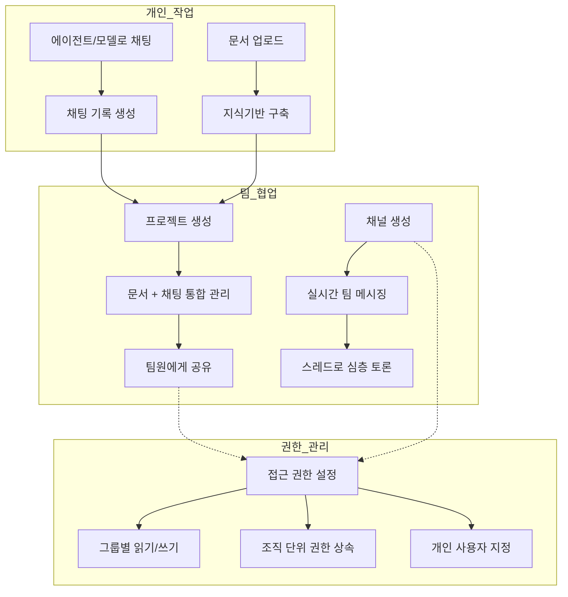
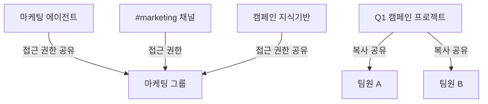

Cloosphere는 AI 활용을 개인 업무에 한정하지 않고, 팀 단위의 협업으로 확장하는 기능을 제공합니다. 프로젝트로 문서와 채팅을 묶어 관리하고, 채널에서 팀원과 실시간 소통하며, 세밀한 접근 권한으로 리소스를 안전하게 공유하세요.

<Frame caption="사이드바에서 프로젝트와 채널에 바로 접근할 수 있습니다">
  
</Frame>

---

## 협업 기능

<Columns cols={3}>
  <Card title="프로젝트" icon="folder-open" href="/ko/collaboration/projects">
    지식기반 + 채팅을 하나의 공간으로 묶어 팀원과 공유합니다. 프로젝트 컨텍스트 내에서 AI가 문서를 참조하여 답변합니다.
  </Card>
  <Card title="채널" icon="hashtag" href="/ko/collaboration/channels">
    팀 메시징 공간입니다. 스레드, 리액션, 실시간 타이핑 표시 등 Slack 스타일의 소통이 가능합니다.
  </Card>
  <Card title="공유 및 권한" icon="shield-halved" href="/ko/collaboration/sharing-permissions">
    리소스별 읽기/쓰기 권한을 그룹, 조직, 개인 단위로 세밀하게 제어합니다.
  </Card>
</Columns>

---

## 협업 흐름 개요

개인 작업에서 생성된 문서와 채팅을 프로젝트로 묶고, 채널에서 팀과 소통하며, 접근 권한으로 안전하게 공유하는 흐름입니다.

---

## 기능 비교

| 기능 | 프로젝트 | 채널 | 공유 및 권한 |
|------|---------|------|-------------|
| **목적** | 문서 + 채팅 통합 관리 | 실시간 팀 소통 | 리소스 접근 제어 |
| **대상** | 개인/소규모 팀 | 팀/부서 전체 | 모든 워크스페이스 리소스 |
| **AI 연동** | 프로젝트 문서 기반 RAG 채팅 | - | - |
| **실시간** | - | Socket.IO 실시간 메시징 | - |
| **공유 방식** | 복사 기반 공유 | 접근 권한 기반 | 그룹/조직/사용자 지정 |
| **생성 권한** | 모든 사용자 | 관리자만 | 관리자가 그룹별 설정 |

---

## 공유 방식 비교

Cloosphere는 리소스 유형에 따라 두 가지 공유 방식을 제공합니다.

<Tabs>
  <Tab title="접근 권한 기반">
    원본 리소스에 그룹/조직/사용자를 추가하는 방식입니다. 원본이 수정되면 모든 공유 대상에게 즉시 반영됩니다.

    **적용 대상:** 에이전트, 지식기반, 채널, 도구, 가드레일, 프롬프트, 용어 사전

    | 장점 | 단점 |
    |------|------|
    | 실시간 동기화 | 개인화 불가 |
    | 저장 공간 효율적 | 원본 변경이 전체에 영향 |
  </Tab>
  <Tab title="복사 기반">
    공유 시 독립적인 복사본이 생성됩니다. 각 사용자가 자유롭게 수정할 수 있습니다.

    **적용 대상:** 프로젝트, 예약 작업

    | 장점 | 단점 |
    |------|------|
    | 각자 자유롭게 수정 | 원본 변경 반영 안 됨 |
    | 개인화 가능 | 저장 공간 추가 사용 |
  </Tab>
</Tabs>

---

## 구성 예시: 마케팅팀 협업 환경

| 리소스 | 공유 방식 | 대상 |
|--------|-----------|------|
| **마케팅 에이전트** | 접근 권한 (읽기) | 마케팅 그룹 전체 |
| **캠페인 지식기반** | 접근 권한 (읽기) | 마케팅 그룹 전체 |
| **Q1 프로젝트** | 복사 공유 | 담당 팀원에게 개별 복사 |
| **#marketing 채널** | 접근 권한 | 마케팅 그룹 |

---

## 시작하기

<Steps>
  <Step title="프로젝트 만들기">
    사이드바에서 프로젝트를 생성하고 문서를 업로드합니다. AI와 프로젝트 컨텍스트에서 대화하세요.
  </Step>
  <Step title="채널 참여하기">
    사이드바의 채널 목록에서 팀 채널에 참여합니다. 메시지를 보내고 스레드로 토론하세요.
  </Step>
  <Step title="권한 설정하기">
    워크스페이스 리소스(에이전트, 지식기반 등)의 접근 권한을 그룹별로 설정하여 팀에 맞게 공유하세요.
  </Step>
</Steps>

<Tip>
  프로젝트는 개인 문서 공간으로 **복사 기반 공유** 방식을 사용하고, 채널과 워크스페이스 리소스는 **접근 권한 기반 공유** 방식을 사용합니다. 사용 목적에 따라 적절한 방식을 선택하세요.
</Tip>

---

## 역할별 가이드

| 역할 | 주요 활동 | 참고 페이지 |
|------|-----------|-------------|
| **일반 사용자** | 프로젝트 생성, 채널 참여, 메시지 보내기 | [프로젝트](/ko/collaboration/projects), [채널](/ko/collaboration/channels) |
| **팀 리더** | 프로젝트 공유, 리소스 권한 관리 | [공유 및 권한](/ko/collaboration/sharing-permissions) |
| **관리자** | 채널 생성/관리, 그룹/조직 설정 | [사용자 관리](/ko/admin/users), [조직 관리](/ko/admin/organizations) |
