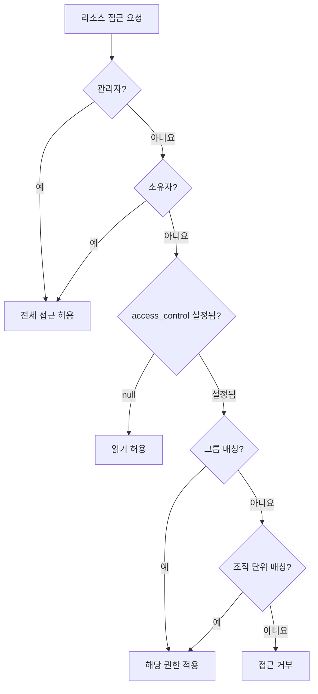
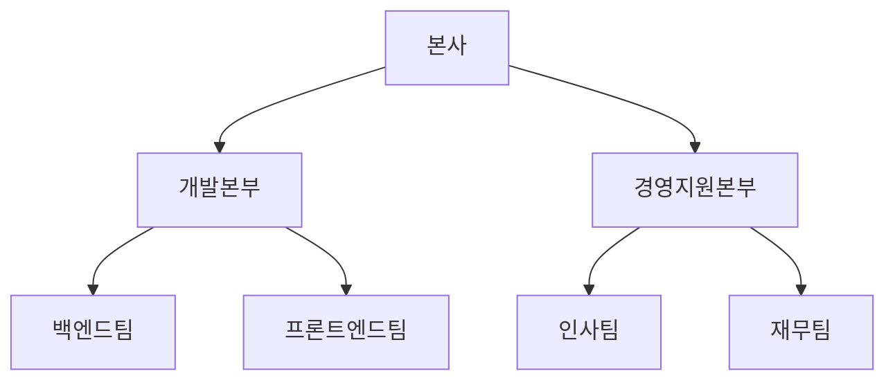
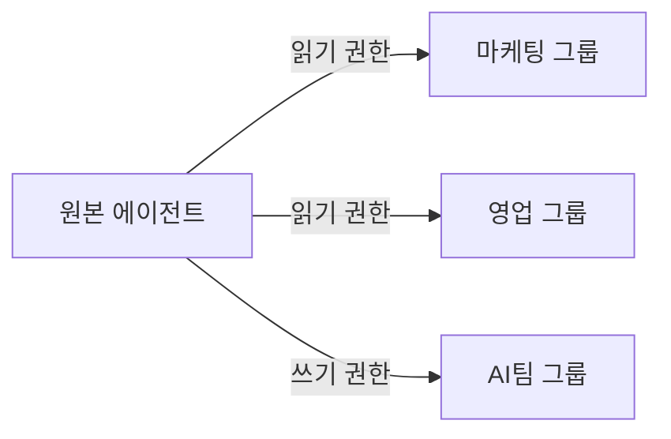
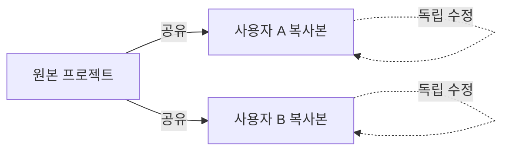

Cloosphere의 모든 워크스페이스 리소스는 통일된 접근 제어 모델(`access_control`)로 관리됩니다. 그룹과 조직 단위에 읽기/쓰기 권한을 부여하여 리소스를 안전하게 공유할 수 있습니다.

<Frame caption="리소스마다 Visibility와 그룹/조직 단위 접근 권한을 설정합니다">
  
</Frame>

---

## 접근 제어 모델

### 리소스 접근 권한 (access_control)

리소스에 대한 접근 제어는 **읽기(read)** / **쓰기(write)** 2단계로 관리됩니다.

| 레벨 | 설명 |
|------|------|
| **읽기** (`read`) | 리소스 조회 및 사용 가능 |
| **쓰기** (`write`) | 리소스 수정 및 관리 가능 |

### 워크스페이스 생성 권한

그룹별 워크스페이스 기능 생성 권한은 4단계 레벨로 관리됩니다. 이 권한은 **리소스를 새로 만들 수 있는지**를 제어하며, 개별 리소스의 접근 제어(access_control)와는 별개입니다.

| 레벨 | 값 | 숫자 레벨 | 설명 |
|------|-----|-----------|------|
| **없음** | `none` | 0 | 기능 사용 불가 |
| **접근** | `access` | 1 | 기본 접근 가능 |
| **읽기** | `read` | 2 | 조회 가능 |
| **쓰기** | `write` | 3 | 생성 및 수정 가능 |

<Note>
  권한은 하위 호환성을 유지합니다. `true`는 `write`, `false`는 `none`으로 처리됩니다.
</Note>

### 권한 적용 우선순위

권한은 다음 순서로 평가됩니다.



| 순서 | 체크 대상 | 설명 |
|------|-----------|------|
| 1 | **관리자** | `admin` 역할이면 모든 접근 허용 |
| 2 | **소유자** | `resource.user_id == user.id`이면 접근 허용 |
| 3 | **그룹** | 사용자가 속한 그룹이 `access_control.{type}.group_ids`에 포함 여부 |
| 4 | **조직 단위** | 사용자가 속한 조직이 `access_control.{type}.org_unit_ids`에 포함 여부 |

---

## access_control 구조

모든 리소스의 접근 권한은 `access_control` JSON 필드로 관리됩니다.

<Tabs>
  <Tab title="공개 (기본)">
    `access_control`이 `null`이면 **모든 인증된 사용자에게 읽기 권한**이 부여됩니다.

    ```json
    {
      "access_control": null
    }
    ```
  </Tab>
  <Tab title="그룹 지정">
    특정 그룹에 읽기/쓰기 권한을 개별적으로 부여합니다.

    ```json
    {
      "access_control": {
        "read": {
          "group_ids": ["marketing-group-id", "sales-group-id"],
          "org_unit_ids": []
        },
        "write": {
          "group_ids": ["marketing-group-id"],
          "org_unit_ids": []
        }
      }
    }
    ```

    이 예시에서 마케팅 그룹은 읽기 + 쓰기, 영업 그룹은 읽기만 가능합니다.
  </Tab>
  <Tab title="조직 단위 지정">
    조직 계층 구조에 따라 권한을 부여합니다.

    ```json
    {
      "access_control": {
        "read": {
          "group_ids": [],
          "org_unit_ids": ["engineering-dept-id"]
        },
        "write": {
          "group_ids": [],
          "org_unit_ids": []
        }
      }
    }
    ```
  </Tab>
  <Tab title="혼합 설정">
    그룹과 조직 단위를 조합하여 권한을 설정합니다.

    ```json
    {
      "access_control": {
        "read": {
          "group_ids": ["all-staff-group-id"],
          "org_unit_ids": ["partner-org-id"]
        },
        "write": {
          "group_ids": ["admin-group-id"],
          "org_unit_ids": []
        }
      }
    }
    ```
  </Tab>
</Tabs>

---

## 리소스별 접근 권한

### 권한 적용 대상

`access_control` 모델은 다음 리소스에 공통으로 적용됩니다.

| 리소스 | 읽기 권한 | 쓰기 권한 |
|--------|-----------|-----------|
| **에이전트** | 에이전트 사용 (채팅에서 선택) | 에이전트 설정 수정 |
| **지식기반** | 지식기반 조회, 문서 열람 | 문서 추가/삭제, 설정 변경 |
| **데이터베이스** | DB 조회 사용 | DB 연결 설정 변경 |
| **에이전트 플로우** | 플로우 실행 | 플로우 편집 |
| **가드레일** | 가드레일 적용 | 가드레일 규칙 수정 |
| **도구** | 도구 사용 | 도구 설정 변경 |
| **프롬프트** | 프롬프트 사용 | 프롬프트 수정 |
| **용어 사전** | 용어 참조 | 용어 추가/수정 |
| **채널** | 메시지 읽기/쓰기 | 관리자만 채널 관리 |
| **프로젝트** | 프로젝트 조회, 채팅 | 파일 추가/삭제, 설정 변경 |
| **예약 작업** | 스케줄 조회, 이력 확인 | 스케줄 수정 |

### 읽기/쓰기 권한에 따른 UI 동작

**쓰기 권한이 있으면 읽기도 자동 포함**됩니다. 별도로 read를 추가하지 않아도 됩니다.

읽기 전용(write 없음) 사용자에게는 다음과 같은 UI 제한이 적용됩니다:

| UI 요소 | 읽기 전용 | 쓰기 권한 |
|---------|----------|----------|
| **Save & Update 버튼** | 비활성화 (disabled) | 정상 |
| **항목 추가/삭제 버튼** | 비활성화 | 정상 |
| **권한 설정 (자물쇠) 버튼** | 숨김 | 소유자/관리자만 표시 |
| **워크스페이스 목록 [...] 메뉴** | 소유자만 표시 | 표시 |

<Tip>
  읽기 전용 사용자는 리소스의 내용을 **조회하고 사용**할 수 있지만, 설정을 변경하거나 삭제할 수 없습니다. 예를 들어 읽기 전용 에이전트로 채팅은 가능하지만, 에이전트의 프롬프트나 모델을 수정할 수는 없습니다.
</Tip>

### 권한 설정 방법

<Steps>
  <Step title="리소스 설정 열기">
    워크스페이스에서 해당 리소스의 설정 화면을 엽니다.
  </Step>
  <Step title="Visibility 설정">
    설정 화면에서 **"Visibility"** 섹션을 찾습니다. **Private** / **Public** 드롭다운으로 공개 범위를 선택합니다.
  </Step>
  <Step title="권한 유형 선택">
    | 유형 | 설정 방법 |
    |------|-----------|
    | **공개** | Visibility 드롭다운에서 **Public** 선택 (`null`) |
    | **비공개** | Visibility 드롭다운에서 **Private** 선택 후 그룹/조직을 추가하지 않음 |
    | **그룹 지정** | Private 상태에서 그룹을 추가하고, Read/Write 배지를 클릭하여 권한 전환 |
    | **조직 지정** | Private 상태에서 조직 단위를 추가하고, Read/Write 배지를 클릭하여 권한 전환 |
  </Step>
  <Step title="저장">
    변경사항을 저장합니다. 권한은 즉시 적용됩니다.
  </Step>
</Steps>

<Note>
  그룹이나 조직 단위를 추가하면 기본적으로 **Read** 배지가 표시됩니다. 해당 배지를 클릭하면 **Write**로 전환됩니다.
</Note>

---

## 그룹 기반 권한

그룹은 사용자를 묶어 관리하는 기본 단위입니다. 관리자가 **관리자 > 사용자 > 그룹**에서 그룹을 생성하고 멤버를 관리합니다.

### 그룹 권한 병합 규칙

사용자가 여러 그룹에 소속되어 있으면 **가장 높은 권한이 적용**됩니다 (Most Permissive).

```
그룹 A: 읽기 권한
그룹 B: 쓰기 권한
→ 최종: 쓰기 권한 (가장 높은 레벨)
```

| 시나리오 | 그룹 A 권한 | 그룹 B 권한 | 최종 결과 |
|----------|-------------|-------------|-----------|
| 읽기 + 쓰기 | `read` | `write` | `write` |
| 없음 + 읽기 | `none` | `read` | `read` |
| 접근 + 쓰기 | `access` | `write` | `write` |

### 그룹별 워크스페이스 권한

그룹에는 워크스페이스 기능 생성 권한도 설정할 수 있습니다. 관리자가 그룹 설정에서 각 기능별 권한을 제어합니다.

| 권한 키 | 대상 기능 |
|---------|-----------|
| `workspace.knowledge` | 지식기반 생성 |
| `workspace.agents` | 에이전트 생성 |
| `workspace.tools` | 도구 생성 |
| `workspace.prompts` | 프롬프트 생성 |
| `workspace.guardrails` | 가드레일 생성 |
| `workspace.glossaries` | 용어 사전 생성 |
| `workspace.databases` | 데이터베이스 생성 |
| `workspace.agent_flows` | 에이전트 플로우 생성 |
| `features.scheduled_tasks` | 예약 작업 생성 |

### 공개 공유 권한 (`sharing.public_*`)

그룹별로 리소스를 **Public**(전체 공개)으로 설정할 수 있는 권한을 별도로 제어합니다. 이 권한이 꺼져 있으면 해당 그룹의 사용자는 리소스의 Visibility를 Public으로 변경할 수 없습니다.

| 권한 키 | 대상 기능 |
|---------|-----------|
| `sharing.public_agents` | 에이전트 공개 공유 |
| `sharing.public_knowledge` | 지식기반 공개 공유 |
| `sharing.public_prompts` | 프롬프트 공개 공유 |
| `sharing.public_tools` | 도구 공개 공유 |
| `sharing.public_databases` | 데이터베이스 공개 공유 |
| `sharing.public_glossaries` | 용어 사전 공개 공유 |

<Note>
  **에이전트 플로우**는 공개 공유(Public) 권한이 **관리자만** 설정 가능합니다. 일반 사용자는 그룹 `sharing.public_*` 권한과 무관하게 플로우를 Public으로 변경할 수 없습니다.
</Note>

<Tip>
  관리자가 **관리자 > 설정 > 일반**에서 기본 사용자 권한을 설정하면, 그룹에 명시적으로 권한이 지정되지 않은 사용자에게 해당 기본값이 적용됩니다.
</Tip>

---

## 조직 기반 권한

조직 단위(Organizational Unit)는 부서, 팀 등 조직 계층 구조를 반영합니다. Azure AD(Entra ID)와 연동하여 조직 구성원을 자동으로 관리할 수 있습니다.

### 조직 계층 권한 상속

조직 단위는 계층 구조를 가지며, 하위 조직의 사용자는 **상위 조직의 권한을 상속**받습니다.



예를 들어 리소스에 "개발본부" 조직 단위 권한을 부여하면, 백엔드팀과 프론트엔드팀 소속 사용자도 접근할 수 있습니다.

### 조직 멤버 매칭 방식

| 매칭 방법 | 설명 |
|-----------|------|
| **OAuth Subject ID** | Azure AD의 `sub` 값으로 `member_ids` 필드 매칭 |
| **이메일** | 조직 단위 `meta.members` 의 이메일 주소로 매칭 |

<Note>
  조직 단위는 관리자가 **관리자 > 조직**에서 설정합니다. Azure AD 연동 시 조직 구조가 자동으로 동기화됩니다.
</Note>

---

## 공유 방식 비교

Cloosphere는 리소스 유형에 따라 두 가지 공유 방식을 제공합니다.

| 방식 | 적용 대상 | 특성 |
|------|-----------|------|
| **접근 권한 기반** | 에이전트, 지식기반, 채널, 도구, 프로젝트, 예약 작업 등 | 원본을 그룹/조직에 공유. 실시간 동기화 |
| **복사 기반** | 프로젝트, 예약 작업 | 독립 복사본 생성. 각자 자유롭게 수정 |

<Note>
  **프로젝트**와 **예약 작업**은 두 가지 방식을 모두 지원합니다. `access_control`로 접근 권한을 설정하는 것과 별도로, 복사 기반 공유를 통해 독립 복사본을 생성할 수도 있습니다.
</Note>

### 접근 권한 기반 공유

원본 리소스에 그룹/조직 단위를 추가하는 방식입니다. 원본이 수정되면 모든 공유 대상에게 즉시 반영됩니다.



### 복사 기반 공유

프로젝트와 예약 작업은 추가로 복사 기반 공유도 지원합니다. 각 사용자에게 독립적인 복사본이 생성됩니다.



| 항목 | 접근 권한 기반 | 복사 기반 |
|------|---------------|-----------|
| **동기화** | 실시간 반영 | 공유 후 독립 |
| **수정 영향** | 원본 변경 시 모든 대상 반영 | 각자 독립적으로 수정 |
| **저장 공간** | 원본 1개만 존재 | 복사본만큼 추가 사용 |
| **용도** | 공용 리소스 | 개인화 필요한 리소스 |

---

## 실전 구성 예시

### 부서별 에이전트 접근 제어

| 에이전트 | 읽기 권한 | 쓰기 권한 |
|----------|-----------|-----------|
| **공용 어시스턴트** | 공개 (`null`) | AI팀 그룹 |
| **인사 어시스턴트** | 인사팀 그룹 | 인사팀 관리자 |
| **매출 분석** | 경영진 그룹, 영업팀 그룹 | 데이터팀 그룹 |
| **개발 도우미** | 개발본부 조직 | 백엔드팀 그룹 |

### 다단계 권한 설정

복잡한 조직 구조에서는 그룹과 조직 단위를 조합하여 세밀한 권한을 설정할 수 있습니다.

<Accordion title="예시: 프로젝트 보고서 에이전트">
  ```json
  {
    "access_control": {
      "read": {
        "group_ids": ["all-staff"],
        "org_unit_ids": ["partner-org-id"]
      },
      "write": {
        "group_ids": ["finance-team"],
        "org_unit_ids": []
      }
    }
  }
  ```

  - **읽기**: 전체 직원 그룹 + 파트너 조직
  - **쓰기**: 재무팀 그룹만 설정 변경 가능
</Accordion>

---

## 관리자 권한 관리

### 기본 사용자 권한 설정

관리자는 **관리자 > 설정 > 일반**에서 신규 사용자/그룹 미지정 사용자의 기본 권한을 설정합니다.

### 권한 확인 흐름

```
1. 그룹 권한 확인 → 그룹에 명시적 권한이 있으면 적용
2. 기본 권한 확인 → 그룹에 없으면 관리자가 설정한 기본값 적용
3. 두 경로의 결과 중 최대 권한 적용
```

---

## FAQ

<Accordion title="접근 권한이 null이면 어떻게 되나요?">
  `access_control`이 `null`이면 모든 인증된 사용자에게 **읽기 권한**이 부여됩니다. 쓰기는 소유자와 관리자만 가능합니다. 비공개로 만들려면 빈 `access_control` 객체를 설정하세요.
</Accordion>

<Accordion title="그룹과 조직 단위의 차이는 무엇인가요?">
  **그룹**은 Cloosphere 내에서 관리하는 단위로, 관리자가 자유롭게 생성하고 멤버를 추가합니다. **조직 단위**는 Azure AD(Entra ID)의 부서/팀 구조를 반영하며, 계층적 권한 상속을 지원합니다.
</Accordion>

<Accordion title="여러 그룹에 속한 사용자의 권한은 어떻게 결정되나요?">
  가장 높은 권한이 적용됩니다 (Most Permissive). 예를 들어 그룹 A에서 `read`, 그룹 B에서 `write` 권한이 있으면 최종적으로 `write` 권한이 적용됩니다.
</Accordion>

<Accordion title="조직 단위의 상위 권한이 하위에 자동 적용되나요?">
  아니요, 방향이 반대입니다. 리소스에 "개발본부" 권한을 설정하면, 개발본부의 **하위 조직**(백엔드팀, 프론트엔드팀)의 멤버도 접근할 수 있습니다. 사용자의 소속 조직에서 상위로 올라가며 매칭합니다.
</Accordion>

<Accordion title="특정 사용자에게만 리소스를 공유하려면?">
  개별 사용자를 직접 지정하는 UI는 제공되지 않습니다. 해당 사용자만 포함된 그룹을 생성한 후, 그 그룹에 권한을 부여하세요.
</Accordion>

<Accordion title="권한 변경은 즉시 적용되나요?">
  네, 접근 권한 변경은 저장 즉시 적용됩니다. 별도의 배포나 재시작이 필요하지 않습니다.
</Accordion>
