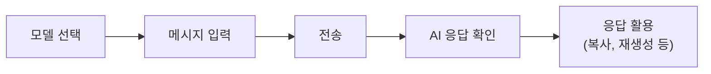

Cloosphere에 로그인했다면, 이제 AI와 첫 번째 대화를 시작해 봅시다. 모델 선택부터 응답 활용까지 기본적인 흐름을 안내합니다.



---

## 대화 시작하기

<Steps>
  <Step title="새 채팅 열기">
    사이드바 상단의 **New Chat** 버튼을 클릭하거나, 키보드 단축키 `Ctrl + Shift + O`를 사용합니다.

    메인 화면 중앙에 모델 선택 드롭다운과 입력창이 표시됩니다.
  </Step>

  <Step title="AI 모델 선택">
    화면 상단의 **모델 선택 드롭다운**을 클릭하여 사용할 AI 모델을 선택합니다. "Select a model" 텍스트를 클릭하면 사용 가능한 모델 목록이 표시됩니다.

    

    <Tip>
      자주 사용하는 모델을 **기본 모델**로 설정할 수 있습니다. 모델 선택 드롭다운에서 모델을 선택한 뒤, 하단에 표시되는 **"Set as default"** 버튼을 클릭하면 다음 대화부터 자동으로 해당 모델이 선택됩니다.
    </Tip>
  </Step>

  <Step title="메시지 입력">
    화면 하단의 입력창에 질문이나 요청을 입력합니다.
  </Step>

  <Step title="메시지 전송">
    `Enter` 키를 누르거나 입력창 우측의 **전송 버튼**(화살표 아이콘)을 클릭합니다.

    <Note>
      줄바꿈이 필요한 경우 `Shift + Enter`를 사용하세요. `Enter`만 누르면 메시지가 전송됩니다.
    </Note>
  </Step>

  <Step title="AI 응답 확인">
    AI가 실시간으로 응답을 생성합니다. 텍스트가 토큰 단위로 스트리밍되며, 응답이 완료될 때까지 화면에 순차적으로 표시됩니다.

    응답 생성 중에 **중지 버튼**(정사각형 아이콘)을 클릭하면 응답 생성을 중단할 수 있습니다.
  </Step>
</Steps>

---

## 모델 선택 가이드

관리자가 등록한 모델 목록에서 업무 목적에 맞는 모델을 선택할 수 있습니다. 아래는 일반적인 모델 특성입니다.

| 모델 유형 | 특징 | 추천 용도 |
|----------|------|----------|
| **GPT-4o** | 고성능 멀티모달 모델 | 복잡한 분석, 이미지 이해, 코드 작성 |
| **GPT-4o-mini** | 빠르고 경제적 | 일반 대화, 간단한 질문, 번역 |
| **Claude** | 긴 문맥 처리 우수 | 문서 요약, 보고서 작성, 분석 |
| **Ollama 모델** | 온프레미스 실행 | 보안이 중요한 내부 데이터 처리 |

<Note>
  사용 가능한 모델 목록은 관리자 설정에 따라 다릅니다. 필요한 모델이 보이지 않으면 관리자에게 문의하세요.
</Note>

---

## 입력 옵션

메시지 입력 시 텍스트 외에도 다양한 방식으로 AI에게 정보를 전달할 수 있습니다.

### 파일 첨부

입력창 좌측의 **+** 버튼을 클릭하거나, 파일을 입력창으로 **드래그 앤 드롭**하여 첨부합니다.

| 파일 유형 | 지원 확장자 | 활용 예시 |
|----------|-----------|----------|
| **문서** | PDF, DOCX, TXT, MD | 문서 요약, 내용 분석, 번역 |
| **스프레드시트** | XLSX, CSV | 데이터 분석, 인사이트 도출 |
| **이미지** | PNG, JPG, GIF, WebP | 이미지 분석, OCR (멀티모달 모델 필요) |
| **코드** | PY, JS, TS 등 | 코드 리뷰, 버그 분석, 리팩토링 |

<Tip>
  파일 첨부와 함께 구체적인 질문을 작성하면 더 정확한 답변을 받을 수 있습니다.

  예: "첨부한 PDF의 3장 내용을 요약하고, 주요 결론을 표로 정리해줘"
</Tip>

### 클라우드 스토리지 연결

관리자가 설정한 경우, **SharePoint**에서 직접 파일을 가져올 수 있습니다. + 버튼 메뉴에서 클라우드 스토리지 옵션을 선택하세요.

### 프롬프트 명령어

입력창에 `/`를 입력하면 등록된 **프롬프트 템플릿** 목록이 나타납니다. 자주 사용하는 질문 패턴을 빠르게 호출할 수 있습니다.

<Frame caption="슬래시 명령어 프롬프트 목록">
  
</Frame>

---

## 응답 활용하기

AI 응답 아래에 표시되는 액션 버튼으로 다양한 후속 작업을 수행할 수 있습니다.

<Frame caption="AI 응답 액션 버튼">
  
</Frame>

| 액션 | 설명 |
|------|------|
| **복사** | 응답 전체를 클립보드에 복사합니다 |
| **재생성** | 동일한 질문으로 새로운 응답을 생성합니다. 여러 번 재생성하면 응답 간 전환이 가능합니다 |
| **음성 듣기** | TTS(Text-to-Speech)로 응답을 음성으로 재생합니다 |
| **좋아요/싫어요** | 응답 품질에 대한 피드백을 제공합니다 |

코드 블록이 포함된 응답의 경우, 코드 블록 우측 상단의 **Copy** 버튼으로 코드만 별도로 복사할 수 있습니다.

---

## 대화 이어가기

Cloosphere는 대화 컨텍스트를 유지합니다. 이전 질문과 응답을 기억하므로, 후속 질문을 자연스럽게 이어갈 수 있습니다.

```
[첫 번째 질문] Python으로 REST API를 호출하는 코드를 작성해줘
[이어서] 여기에 에러 처리를 추가해줘
[이어서] async 버전으로 변환해줘
```

<Note>
  대화가 길어지면 초기 메시지의 영향이 줄어들 수 있습니다. 주제가 바뀌면 **New Chat**으로 새 대화를 시작하는 것이 더 정확한 답변을 받는 데 도움이 됩니다.
</Note>

---

## 효과적인 프롬프트 작성 팁

<Accordion title="구체적으로 요청하세요">
  막연한 요청보다 구체적인 조건을 명시하면 원하는 결과를 더 정확하게 얻을 수 있습니다.

  | 비효과적 | 효과적 |
  |---------|--------|
  | "보고서 써줘" | "2024년 1분기 마케팅 성과 보고서를 작성해줘. A4 2페이지 분량으로, 주요 KPI와 개선점을 포함해줘" |
  | "코드 고쳐줘" | "이 Python 코드에서 TypeError가 발생해. 에러 원인을 찾고 수정된 코드를 제시해줘" |
</Accordion>

<Accordion title="출력 형식을 지정하세요">
  원하는 결과물의 형식을 명시하면 후가공 시간을 줄일 수 있습니다.

  - "**표 형식**으로 정리해줘"
  - "**마크다운** 형식으로 작성해줘"
  - "**JSON** 형식으로 출력해줘"
  - "**순서대로 번호를 매겨서** 설명해줘"
</Accordion>

<Accordion title="역할을 부여하세요">
  AI에게 특정 역할을 부여하면 전문성 있는 답변을 받을 수 있습니다.

  - "너는 시니어 Python 개발자야. 이 코드를 리뷰해줘."
  - "마케팅 전문가 관점에서 이 캠페인 전략을 분석해줘."

  <Tip>
    반복적으로 같은 역할을 사용한다면, [에이전트](/ko/workspace/agents)로 등록하면 매번 역할을 지정할 필요가 없습니다.
  </Tip>
</Accordion>

<Accordion title="단계별로 요청하세요">
  복잡한 작업은 한 번에 모든 것을 요청하기보다, 단계별로 나누어 요청하면 결과 품질이 향상됩니다.

  ```
  1단계: 첨부한 데이터에서 주요 트렌드 3가지를 찾아줘
  2단계: 각 트렌드에 대한 원인을 분석해줘
  3단계: 분석 결과를 경영진 보고용 슬라이드 구조로 정리해줘
  ```
</Accordion>

---

## 키보드 단축키

| 단축키 | 기능 |
|--------|------|
| `Enter` | 메시지 전송 |
| `Shift + Enter` | 줄바꿈 |
| `Ctrl + Shift + O` | 새 채팅 |
| `Ctrl + Shift + S` | 사이드바 토글 |
| `Ctrl + /` | 키보드 단축키 표시 |
| `Shift + Esc` | 채팅 입력창 포커스 |

---

## 다음 단계

첫 대화를 완료했다면, 더 강력한 기능을 활용해 보세요.

<Columns cols={3}>
  <Card title="화면 구성 이해" icon="desktop" href="/ko/getting-started/ui-overview">
    사이드바, 검색, 폴더 등 전체 UI를 파악합니다
  </Card>
  <Card title="대화 관리" icon="folder" href="/ko/chat/conversations">
    폴더, 핀 고정, 태그로 대화를 체계적으로 관리합니다
  </Card>
  <Card title="에이전트 활용" icon="robot" href="/ko/workspace/agents">
    업무별 맞춤 AI 어시스턴트를 만들어 생산성을 높입니다
  </Card>
</Columns>
