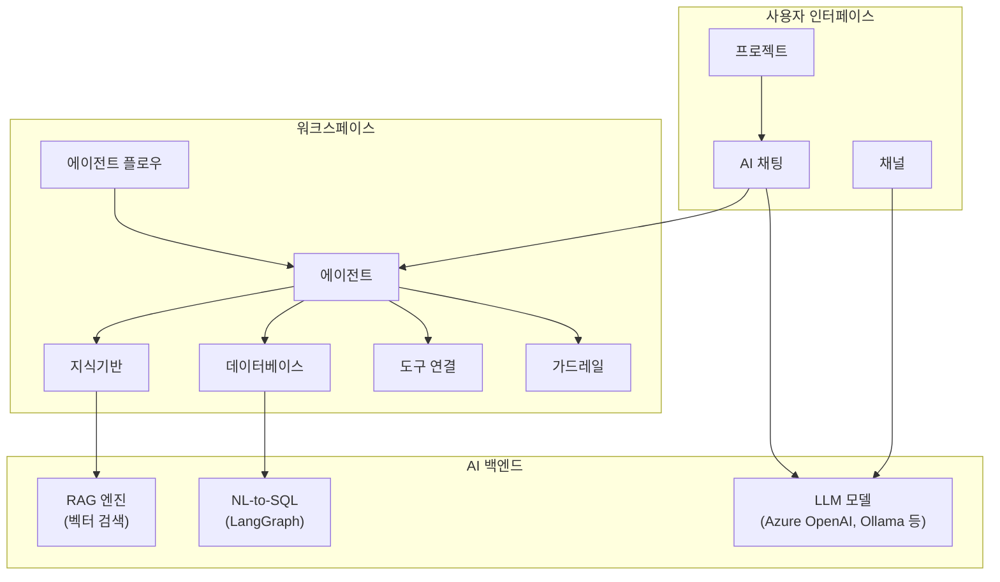

Cloosphere는 기업 환경에 최적화된 **엔터프라이즈 AI 채팅 플랫폼**입니다. 다양한 LLM 모델을 안전하고 효율적으로 활용하며, RAG, 에이전트, 워크플로우를 하나의 플랫폼에서 통합 관리할 수 있습니다.

<video autoPlay muted loop playsInline style={{width: '100%', borderRadius: '8px'}}>
  <source src="/videos/getting-started/landing-scroll.mp4" type="video/mp4" />
</video>

---

## 왜 Cloosphere인가요?

<Columns cols={3}>
  <Card title="기업 수준의 보안" icon="lock">
    사설 네트워크 환경에서 운영되며, 역할 기반 접근 제어(RBAC)와 완전한 감사 로그로 기업 보안 정책을 충족합니다.
  </Card>
  <Card title="생산성 극대화" icon="bolt">
    맞춤형 AI 에이전트, 지식기반 연동, 도구 통합으로 부서별 업무에 최적화된 AI 경험을 제공합니다.
  </Card>
  <Card title="비용 효율성" icon="chart-pie">
    부서별/사용자별 사용량 추적, 멀티 모델 지원으로 업무에 맞는 최적의 모델을 선택할 수 있습니다.
  </Card>
</Columns>

---

## 주요 기능

### AI 채팅 및 모델 관리

<Columns cols={2}>
  <Card title="AI 채팅" icon="comments" href="/ko/chat/overview">
    Azure OpenAI, Ollama 등 다양한 LLM과 자연스러운 대화. 파일 첨부, 웹검색, 코드 실행 등 확장 기능을 지원합니다.
  </Card>
  <Card title="모델 선택" icon="robot" href="/ko/chat/models">
    GPT-4o, Claude, Ollama 로컬 모델 등 업무 목적에 맞는 최적의 모델을 선택하여 사용할 수 있습니다.
  </Card>
</Columns>

### 워크스페이스

<Columns cols={2}>
  <Card title="에이전트" icon="robot" href="/ko/workspace/agents">
    시스템 프롬프트, 지식기반, 도구, 가드레일을 결합한 맞춤형 AI 어시스턴트를 구성합니다.
  </Card>
  <Card title="지식기반 (RAG)" icon="book" href="/ko/workspace/knowledge">
    사내 문서를 업로드하면 AI가 문서 내용을 근거로 답변합니다. 벡터 검색 기반 Retrieval-Augmented Generation을 지원합니다.
  </Card>
  <Card title="데이터베이스 (NL-to-SQL)" icon="database" href="/ko/workspace/database">
    자연어로 데이터베이스를 질의합니다. PostgreSQL, MySQL, MSSQL 등 8종 DB를 지원합니다.
  </Card>
  <Card title="에이전트 플로우" icon="diagram-project" href="/ko/workspace/flows">
    멀티 에이전트 워크플로우를 시각적 빌더로 설계하고 실행합니다.
  </Card>
  <Card title="도구 연결" icon="wrench" href="/ko/workspace/tools">
    외부 API와 MCP 서버를 연결하여 AI 에이전트의 기능을 확장합니다.
  </Card>
  <Card title="프롬프트 관리" icon="file-lines" href="/ko/workspace/prompts">
    팀 공용 프롬프트 템플릿을 생성하고 공유합니다. `/` 명령어로 빠르게 호출할 수 있습니다.
  </Card>
  <Card title="가드레일" icon="shield" href="/ko/workspace/guardrails">
    PII 감지, 콘텐츠 필터링으로 AI 입출력을 안전하게 관리합니다.
  </Card>
  <Card title="용어 사전" icon="spell-check" href="/ko/workspace/glossary">
    사내 전문 용어를 등록하면 AI가 정확한 용어를 사용하여 답변합니다.
  </Card>
</Columns>

### 협업 및 관리

<Columns cols={2}>
  <Card title="프로젝트" icon="folder-open" href="/ko/collaboration/projects">
    팀 단위로 채팅을 묶어 관리하고, 공통 설정(모델, 지식기반 등)을 프로젝트 단위로 적용합니다.
  </Card>
  <Card title="채널" icon="hashtag" href="/ko/collaboration/channels">
    실시간 팀 메시징으로 AI 응답을 공유하고, 스레드와 리액션으로 협업합니다.
  </Card>
  <Card title="관리자 패널" icon="gear" href="/ko/admin/overview">
    사용자/조직 관리, 모델 설정, 문서 처리, 브랜딩 등 다양한 시스템 설정 탭을 제공합니다.
  </Card>
  <Card title="모니터링" icon="chart-line" href="/ko/monitoring/overview">
    사용량 추적, 감사 로그, LLM 트레이싱, 가드레일 로그로 운영 현황을 파악합니다. (관리자 &gt; 모니터링)
  </Card>
  <Card title="평가" icon="clipboard-check" href="/ko/monitoring/evaluations">
    LLM 응답 품질을 자동/수동으로 평가하고 성능을 추적합니다. (관리자 &gt; 평가)
  </Card>
</Columns>

---

## 플랫폼 아키텍처

---

## 빠른 시작

<Steps>
  <Step title="로그인">
    SSO(Microsoft Entra ID) 또는 이메일/비밀번호로 [로그인](/ko/getting-started/login)합니다.
  </Step>
  <Step title="화면 살펴보기">
    [메인 화면 구성](/ko/getting-started/ui-overview)을 파악합니다 — 사이드바, 모델 선택기, 채팅 영역, 입력창.
  </Step>
  <Step title="첫 대화 시작">
    모델을 선택하고 [첫 번째 AI 대화](/ko/getting-started/first-chat)를 시작합니다.
  </Step>
</Steps>

---

## 지원 브라우저

| 브라우저 | 최소 버전 | 권장 |
|----------|-----------|------|
| **Chrome** | 90+ | 최신 버전 |
| **Edge** | 90+ | 최신 버전 |
| **Firefox** | 88+ | 최신 버전 |
| **Safari** | 14+ | 최신 버전 |

<Warning>
  Internet Explorer는 지원하지 않습니다. 최적의 경험을 위해 Chrome 또는 Edge 최신 버전을 사용하세요.
</Warning>

---

## 다음 단계

<Columns cols={2}>
  <Card title="로그인하기" icon="right-to-bracket" href="/ko/getting-started/login">
    SSO 또는 이메일로 플랫폼에 접속
  </Card>
  <Card title="첫 대화 시작" icon="message" href="/ko/getting-started/first-chat">
    AI와 첫 번째 대화를 나눠보세요
  </Card>
</Columns>
