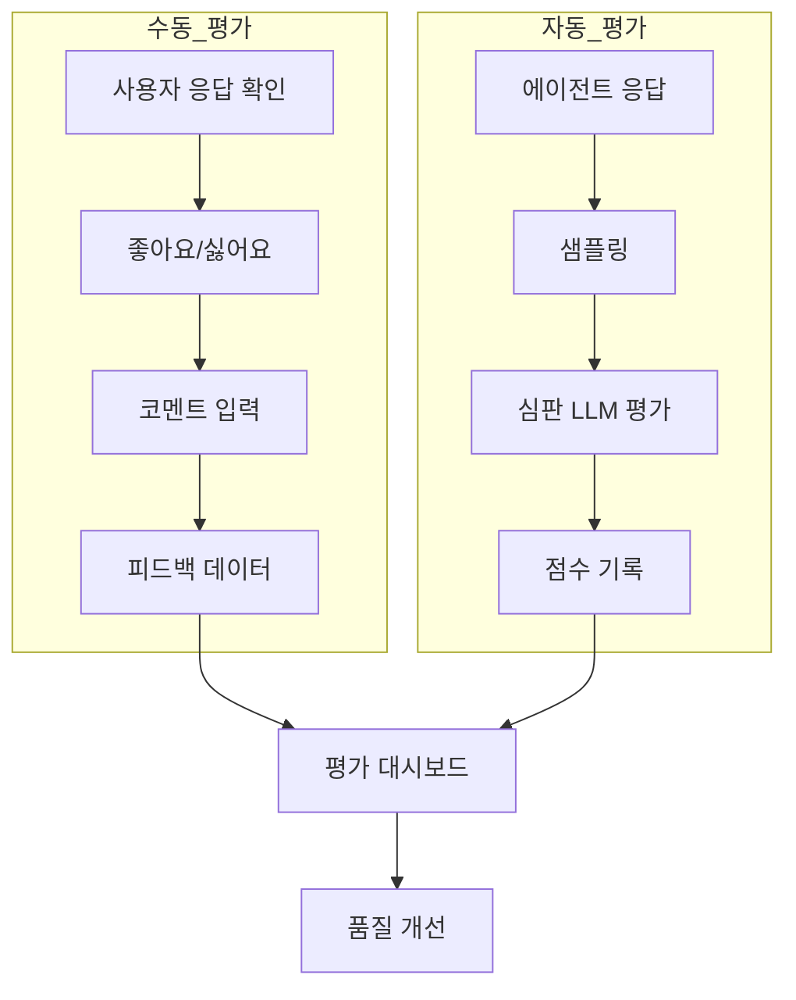
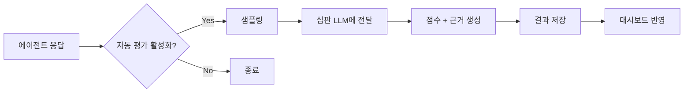

평가 기능은 AI 응답의 품질을 **수동 피드백과 자동 평가** 두 가지 방식으로 측정합니다.
사용자의 직접 평가와 LLM 기반 자동 품질 측정을 결합하여 체계적인 품질 관리 체계를 구축할 수 있습니다.

---

## 수동 평가 (Feedbacks 탭)

사용자가 AI 응답에 대해 직접 평가하는 기능입니다.

**관리자 > 평가 > Feedbacks** 탭에서 전체 피드백을 조회합니다.

<Frame caption="평가 탭 메인 — 피드백 목록 테이블">
  
</Frame>

### 피드백 수집 방식

채팅 화면에서 AI 응답 아래의 피드백 버튼으로 수집됩니다.

| 피드백 유형 | 설명 |
|------------|------|
| **좋아요** | 응답이 유용하고 정확한 경우 |
| **싫어요** | 응답이 부정확하거나 도움이 되지 않는 경우 |
| **코멘트** | 추가적인 텍스트 피드백 |

### 피드백 데이터

| 필드 | 설명 |
|------|------|
| **사용자** | 피드백을 남긴 사용자 |
| **유형** | 좋아요/싫어요 |
| **모델 ID** | 응답을 생성한 모델 |
| **이유** | 피드백 사유 |
| **코멘트** | 상세 의견 |
| **생성일** | 피드백 생성 시간 |

### 피드백 관리

| 기능 | 설명 | 권한 |
|------|------|------|
| **전체 조회** | 모든 사용자의 피드백 조회 | 관리자 |
| **내보내기** | 전체 피드백 JSON 내보내기 | 관리자 |
| **전체 삭제** | 모든 피드백 일괄 삭제 | 관리자 |
| **개별 삭제** | 자신의 피드백 삭제 | 일반 사용자 |

<Frame caption="피드백 상세 — 사용자 정보, 모델, 평가 내용, 코멘트">
  
</Frame>

---

## Arena 평가

두 모델의 응답을 나란히 비교하여 블라인드 평가하는 기능입니다.

### 설정

**관리자 > 설정(톱니바퀴) > Evaluations** 탭에서 구성합니다.

| 설정 | 설명 |
|------|------|
| **Arena 활성화** | Arena 모드 사용 여부 토글 |
| **Arena 모델** | 비교 대상 모델 쌍 구성 |

Arena가 활성화되면, 사용자가 채팅할 때 두 모델의 응답이 익명으로 나란히 표시되고, 사용자가 더 나은 응답을 선택합니다.

---

## Leaderboard (Leaderboard 탭)

**관리자 > 평가 > Leaderboard** 탭에서 모델 간 순위를 확인합니다.

Arena 블라인드 비교 결과를 기반으로 **Elo rating** 방식의 모델 순위를 산출합니다. 사용자가 Arena에서 더 나은 응답을 선택할 때마다 해당 모델의 Elo 점수가 갱신되어, 실사용 기반의 모델 품질 순위를 객관적으로 파악할 수 있습니다.

<Frame caption="Leaderboard 탭 — Elo rating 기반 모델 순위 테이블">
  
</Frame>

| 필드 | 설명 |
|------|------|
| **모델** | 평가 대상 모델 |
| **Elo Rating** | Arena 비교 결과 기반 산출 점수 |
| **대전 수** | Arena에서 비교된 횟수 |
| **승률** | 선택된 비율 |

---

## 자동 평가 (Auto Evaluations 탭)

에이전트에서 자동 평가를 활성화하면, 응답 후 비동기로 **심판 LLM**이 품질을 평가하고 결과를 기록합니다.

**관리자 > 평가 > Auto Evaluations** 탭에서 결과를 확인합니다.

<Frame caption="자동 평가 결과 화면 — Score Trend 차트, 필터, 결과 테이블">
  
</Frame>

<Note>
  자동 평가는 라이선스 기능입니다. `evaluation` 피처가 활성화된 라이선스가 필요합니다.
</Note>

### 평가 유형

| 유형 | 설명 |
|------|------|
| **검색 품질 (Retrieval Quality)** | 검색된 문서가 질문과 관련성이 있는지 평가 |
| **충실성 (Faithfulness)** | 검색 내용에 기반한 답변인지 평가 (환각 감지) |
| **응답 품질 (Response Quality)** | 전반적인 유용성과 정확성 평가 |

### 평가 프로세스

### 평가 결과 필드

| 필드 | 설명 |
|------|------|
| **채팅/메시지 ID** | 평가 대상 메시지 |
| **모델 ID** | 응답을 생성한 모델 |
| **심판 모델 ID** | 평가에 사용된 LLM |
| **평가 유형** | retrieval, faithfulness, quality |
| **점수** | 0.0 ~ 1.0 (1.0이 최고) |
| **근거** | 점수에 대한 LLM의 설명 |
| **상태** | pending, completed, failed |
| **에러 메시지** | 평가 실패 시 오류 내용 |

---

## Score Trend 차트

날짜별 평균 점수 추이를 시각화합니다.

| 모드 | 설명 |
|------|------|
| **모든 유형** | 모델별 평균 점수 라인 |
| **특정 유형 선택** | 모델 + 유형별 세분화 라인 |

### 필터 옵션

| 필터 | 설명 |
|------|------|
| **날짜 범위** | 평가 기간 선택 |
| **모델** | 특정 모델로 필터 |
| **평가 유형** | 검색 품질, 충실성, 응답 품질 |
| **상태** | pending, completed, failed |
| **점수 범위** | 최소/최대 점수 (0.0 ~ 1.0) |

---

## 자동 평가 통계

전체 자동 평가의 요약 통계를 제공합니다.

| 지표 | 설명 |
|------|------|
| **전체 건수** | 총 자동 평가 수 |
| **완료** | 성공적으로 완료된 평가 수 |
| **대기** | 아직 처리 중인 평가 수 |
| **실패** | 오류로 실패한 평가 수 |
| **평균 점수** | 전체 평균 점수 |
| **모델별 통계** | 모델별 건수 및 평균 점수 |
| **유형별 통계** | 평가 유형별 건수 및 평균 점수 |

---

## 내보내기

자동 평가 데이터를 내보낼 수 있습니다.

| 형식 | 설명 |
|------|------|
| **CSV** | 스프레드시트 분석용 (id, chat_id, message_id, model_id, score, reasoning 등) |
| **JSON** | 프로그래밍 연동용 전체 데이터 |

---

## 에이전트에서 자동 평가 설정

자동 평가는 에이전트 단위로 활성화합니다.

<Steps>
  <Step title="에이전트 편집">
    **워크스페이스 > 에이전트**에서 대상 에이전트의 편집 화면을 엽니다.
  </Step>
  <Step title="자동 평가 활성화">
    에이전트 설정의 **자동 평가** 섹션에서 활성화합니다.

    | 설정 | 설명 |
    |------|------|
    | **활성화** | 자동 평가 사용 여부 |
    | **샘플링 비율** | 평가할 응답 비율 (1%~100%, 기본 10%) |
    | **심판 모델** | 평가에 사용할 LLM 모델 |
    | **평가 유형** | 활성화할 평가 유형 선택 |

    **샘플링 비율 권장:**

    | 상황 | 권장 | 이유 |
    |------|:----:|------|
    | 신규 에이전트 | 50~100% | 초기 품질 빠르게 파악 |
    | 안정화 후 | 5~10% | 비용 절감 + 모니터링 |
    | 핵심 업무 | 20~30% | 품질 보증 |
  </Step>
  <Step title="저장">
    에이전트를 저장하면, 이후 해당 에이전트의 응답에 대해 자동 평가가 실행됩니다.
  </Step>
</Steps>

<Tip>
  심판 모델은 평가 대상 모델보다 동등하거나 더 높은 수준의 모델을 사용하세요. 예를 들어 GPT-4o 응답을 GPT-4o-mini로 평가하면 정확도가 낮을 수 있습니다.
</Tip>

---

## 활용 사례

<AccordionGroup>
  <Accordion title="응답 품질 모니터링" icon="chart-line">
    1. Score Trend 차트에서 일간/주간 점수 추이를 확인합니다
    2. 특정 모델의 점수가 하락하면 해당 기간의 트레이스를 확인합니다
    3. 낮은 점수의 개별 평가를 클릭하여 reasoning(근거)을 확인합니다
    4. 프롬프트, 지식기반, 도구 설정을 조정합니다
  </Accordion>

  <Accordion title="모델 간 품질 비교" icon="scale-balanced">
    1. Arena 평가를 활성화하여 블라인드 비교 데이터를 수집합니다
    2. 자동 평가의 모델별 통계에서 평균 점수를 비교합니다
    3. 비용 대비 품질 효율이 높은 모델을 기본 모델로 설정합니다
  </Accordion>

  <Accordion title="피드백 기반 개선" icon="comments">
    1. 수동 피드백에서 "싫어요" 비율이 높은 모델/에이전트를 식별합니다
    2. 코멘트를 분석하여 공통적인 불만 패턴을 파악합니다
    3. 해당 에이전트의 시스템 프롬프트나 지식기반을 개선합니다
    4. 개선 후 자동 평가 점수 변화를 추적합니다
  </Accordion>

  <Accordion title="자동 평가가 실패(failed)하면?" icon="triangle-exclamation">
    자동 평가가 failed 상태인 경우:
    - **에러 메시지 확인**: 결과 테이블에서 해당 항목의 에러 내용 확인
    - **일반적인 원인**: 심판 모델의 API 오류, 타임아웃, 토큰 한도 초과
    - **재실행**: 현재 자동 재실행은 지원되지 않습니다. 에이전트 설정에서 자동 평가를 재활성화하면 이후 응답부터 다시 평가됩니다.
  </Accordion>
</AccordionGroup>

---

## 다음 단계

<Columns cols={3}>
  <Card title="트레이싱" icon="route" href="/ko/monitoring/tracing">
    낮은 평가 점수의 원인을 트레이스에서 추적
  </Card>
  <Card title="에이전트 설정" icon="robot" href="/ko/workspace/agents">
    자동 평가를 에이전트에 설정
  </Card>
  <Card title="사용량" icon="coins" href="/ko/monitoring/usage">
    평가 비용 포함 토큰 사용량 확인
  </Card>
</Columns>
