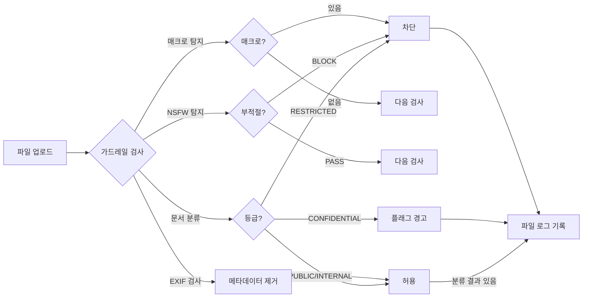

파일 로그(File Logs)는 **가드레일 분석 결과가 있는 파일**의 보안 모니터링 기능입니다.
업로드된 파일의 민감도 분류, 차단 여부, 보안 검사 결과를 관리자가 한눈에 확인할 수 있습니다.

**관리자 > 모니터링 > 파일 로그** 탭에서 접근합니다.

<Frame caption="파일 로그 메인 화면 — 필터 바, 테이블, 소스/분류 뱃지">
  
</Frame>

<Note>
  모든 업로드 파일이 표시되는 것이 아닙니다. **민감도 분류(classification) 또는 가드레일 차단(guardrail_blocked)** 결과가 있는 파일만 로그에 나타납니다.
</Note>

---

## 문서 민감도 분류

파일 업로드 시 LLM 기반 분류기가 문서의 민감도를 자동 판별합니다.

| 분류 | 설명 | 처리 |
|------|------|------|
| **PUBLIC** | 공개 가능한 일반 문서 | 허용 |
| **INTERNAL** | 내부 업무용 문서 | 허용 |
| **CONFIDENTIAL** | 개인정보, 재무정보 등 민감 문서 | 플래그 (경고) |
| **RESTRICTED** | 극비 문서, 규제 대상 | 차단 (업로드 거부) |

각 분류 결과에는 **신뢰도(confidence)** 점수(0~100%)와 분류 사유가 함께 기록됩니다.

---

## 가드레일 검사 유형

파일 유형에 따라 여러 보안 검사가 자동 적용됩니다.

<Tabs>
  <Tab title="문서 분류">
    LLM 기반 민감도 분류입니다. 문서 텍스트를 분석하여 PUBLIC ~ RESTRICTED 등급을 판정합니다.

    - **대상**: 텍스트 추출 가능한 모든 파일 (PDF, DOCX, TXT 등)
    - **결과**: 분류 등급 + 신뢰도 + 사유
    - **처리**: CONFIDENTIAL은 플래그, RESTRICTED는 차단
  </Tab>
  <Tab title="매크로 탐지">
    Office 파일의 VBA 매크로를 탐지합니다.

    - **대상**: `.doc`, `.docm`, `.xls`, `.xlsm`, `.ppt`, `.pptm`
    - **결과**: 매크로 수, 매크로 코드 미리보기
    - **처리**: 매크로 발견 시 차단
  </Tab>
  <Tab title="EXIF 메타데이터 제거">
    이미지 파일의 EXIF 메타데이터(위치, 장치 정보 등)를 자동 제거합니다.

    - **대상**: `.jpg`, `.jpeg`, `.tiff`, `.tif`, `.webp`
    - **결과**: EXIF 존재 여부 + 제거 완료 여부
    - **처리**: 제거 후 허용 (차단 없음)
  </Tab>
  <Tab title="NSFW 탐지">
    LLM 기반 이미지 부적절 콘텐츠 검사입니다.

    - **대상**: 모든 이미지 파일
    - **결과**: PASS 또는 BLOCK
    - **처리**: 부적절 콘텐츠 발견 시 차단
  </Tab>
</Tabs>

---

## 로그 조회

### 필터 옵션

| 필터 | 옵션 | 설명 |
|------|------|------|
| **검색** | 텍스트 입력 | 파일명, 업로더 이름/이메일로 검색 |
| **소스** | Chat / Knowledge / Project | 파일 업로드 경로별 필터 |
| **분류** | PUBLIC / INTERNAL / CONFIDENTIAL / RESTRICTED | 민감도 등급별 필터 |
| **상태** | Flagged / Blocked | 처리 결과별 필터 |

### 테이블 컬럼

| 컬럼 | 설명 |
|------|------|
| **파일명** | 원본 파일명 + 콘텐츠 타입 |
| **업로더** | 사용자 이름 (이메일 서브타이틀) |
| **소스** | 업로드 경로 (색상 뱃지: Chat=파랑, Knowledge=보라, Project=초록) |
| **분류** | 민감도 등급 (색상 뱃지: PUBLIC=초록, INTERNAL=파랑, CONFIDENTIAL=노랑, RESTRICTED=빨강) |
| **업로드 시간** | 업로드 타임스탬프 |
| **상태** | Blocked(빨강) 또는 Flagged(노랑) 뱃지 |

### 페이지네이션

- 페이지당 20건 표시
- 상단에 총 파일 수 표시
- 20건 초과 시 페이지 이동 컨트롤 표시

---

## 상세 보기

테이블 행을 클릭하면 파일의 가드레일 분석 결과를 모달로 확인합니다.

**표시 항목:**

- **파일 정보**: 파일명, 콘텐츠 타입, 크기(KB)
- **업로더 정보**: 이름, 이메일, 업로드 일시
- **소스**: 업로드 경로 뱃지
- **분류 결과**:
  - 민감도 등급 + 신뢰도(%)
  - 분류 사유
  - 사용된 분류 모델
  - 오류 발생 시 에러 메시지
- **가드레일 상세** (해당 시):
  - 차단 사유 및 상세 JSON
  - EXIF 제거 결과
  - NSFW 탐지 결과

---

## 파일 처리 흐름

---

## 활용 사례

<Accordion title="민감 문서 모니터링">
  1. **분류** 필터를 `CONFIDENTIAL`로 설정
  2. 플래그된 파일 목록을 검토
  3. 상세 모달에서 분류 사유와 신뢰도 확인
  4. 필요 시 [가드레일 설정](/ko/workspace/guardrails)에서 정책 조정
</Accordion>

<Accordion title="소스별 업로드 패턴 분석">
  1. **소스** 필터로 Chat / Knowledge / Project별 업로드 현황 확인
  2. 특정 소스에서 차단이 많은 경우 해당 워크플로우 점검
  3. Knowledge 업로드의 분류 결과를 검토하여 RAG 데이터 품질 관리
</Accordion>

<Accordion title="차단 파일 조사">
  1. **상태** 필터를 `Blocked`로 설정
  2. 차단된 파일의 업로더와 사유 확인
  3. 상세 모달에서 가드레일 상세 JSON 검토
  4. 오탐(false positive)인 경우 가드레일 규칙 수정 검토
</Accordion>

---

## 모범 사례

- **정기 모니터링**: 주 1회 이상 파일 로그를 검토하여 이상 패턴을 탐지하세요
- **가드레일 연동**: 차단/플래그가 빈번한 경우 [가드레일 설정](/ko/workspace/guardrails)을 검토하세요
- **오탐 관리**: CONFIDENTIAL/RESTRICTED 분류의 신뢰도가 낮은 경우 분류 모델 변경을 고려하세요
- **소스 분석**: 특정 소스에서 민감 파일이 집중되는 패턴을 주시하세요
