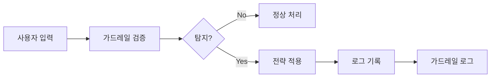

가드레일 로그는 에이전트에 설정된 가드레일이 **탐지하고 처리한 모든 이벤트**를 기록합니다.
어떤 사용자가 어떤 민감 정보를 입력했고, 어떤 가드레일이 어떻게 처리했는지 투명하게 추적할 수 있습니다.

**관리자 > 모니터링 > 가드레일 로그** 탭에서 접근합니다.

<Note>
  **관리자 > Code Gateway > 가드레일 로그** 경로에서도 동일한 가드레일 로그를 조회할 수 있습니다.
</Note>

<Frame caption="가드레일 로그 메인 화면 — 필터 영역, 로그 테이블">
  
</Frame>

---

## 가드레일 로그란?

사용자가 AI와 대화할 때, 가드레일은 입력과 출력을 검증합니다. 민감 정보가 탐지되면 설정된 전략(차단, 삭제, 마스킹 등)에 따라 처리하고, 그 결과를 로그로 기록합니다.

---

## 로그 항목 구조

각 가드레일 로그 항목은 다음 정보를 포함합니다.

| 필드 | 설명 |
|------|------|
| **타임스탬프** | 탐지 이벤트 발생 시간 |
| **사용자** | 입력한 사용자 (이름, 이메일) |
| **채팅 ID** | 해당 대화 세션 |
| **메시지 ID** | 해당 메시지 식별자 |
| **가드레일 이름** | 적용된 가드레일 |
| **액션** | 처리 전략 (차단, 삭제, 마스킹 등) |
| **Detection Pattern** | 탐지 방식 (Rule-based / LLM-based) |
| **Detection Detail** | 탐지된 구체적 내용 |
| **원본 내용** | 원본 입력 텍스트 |
| **Processed Content** | 전략 적용 후 텍스트 |

---

## 액션 유형

| 액션 | 설명 |
|------|------|
| **block** | 메시지 전체 차단 |
| **redact** | 민감 정보를 라벨로 대체 (예: `[REDACTED_EMAIL]`) |
| **mask** | 일부 문자만 표시 (예: `j***@***.com`) |
| **hash** | 해시값으로 변환 |
| **log** | 차단 없이 로그만 기록 (UI에서 "Warning"으로 표시) |

## Detection Pattern

탐지 방식은 두 가지 그룹으로 분류됩니다.

| 그룹 | 포함 소스 | 설명 |
|------|----------|------|
| **Rule-based** | pii, custom_pattern, blocked_word | 정규식·패턴 매칭 기반 탐지 |
| **LLM-based** | llm_judge | LLM 기반 콘텐츠 위험도 판정 |

각 개별 소스의 의미는 다음과 같습니다.

| 소스 | 설명 |
|------|------|
| **pii** | 이메일, 신용카드, IP 주소 등 개인정보 패턴 탐지 |
| **custom_pattern** | 사용자 정의 정규식 패턴 탐지 |
| **blocked_word** | 금지 단어/문구 감지 |
| **llm_judge** | LLM 기반 콘텐츠 위험도 판정 |

---

## 필터 옵션

| 필터 | 설명 |
|------|------|
| **기간** | 시작/종료 날짜 범위 |
| **액션** | block, redact, mask, hash, log (복수 선택 가능) |
| **Detection Pattern** | Rule-based / LLM-based 그룹 선택 |
| **사용자 검색** | 사용자 ID, 이메일 또는 이름으로 검색 |
| **채팅 ID** | 특정 채팅 세션의 로그만 조회 |
| **소스** | 요청 출처 필터 (예: `code_gateway`) |

---

## 로그 상세 보기

로그 항목을 클릭하면 상세 정보를 확인할 수 있습니다.

<Tabs>
  <Tab title="탐지 상세">
    | 항목 | 설명 |
    |------|------|
    | **가드레일** | 적용된 가드레일 이름 및 ID |
    | **Detection Pattern** | Rule-based (PII, 커스텀 패턴, 금지 단어) 또는 LLM-based (LLM Judge) |
    | **Detection Detail** | 탐지된 구체적 패턴 또는 항목 |
    | **원본 내용** | 사용자가 입력한 원문 |
    | **Processed Content** | 전략 적용 후 결과 |
  </Tab>
  <Tab title="컨텍스트">
    | 항목 | 설명 |
    |------|------|
    | **사용자** | 이름, 이메일 |
    | **채팅 ID** | 대화 세션 식별자 |
    | **메시지 ID** | 메시지 식별자 |
    | **메타데이터** | 추가 컨텍스트 정보 (소스 등) |
  </Tab>
</Tabs>

---

## 트레이싱 연동

가드레일 로그 상세에서 **Trace** 버튼을 통해 해당 메시지의 전체 처리 과정을 확인할 수 있습니다.

<Steps>
  <Step title="가드레일 로그에서 항목 선택">
    조사하려는 가드레일 이벤트의 로그 항목을 클릭합니다.
  </Step>
  <Step title="Trace 클릭">
    상세 모달에서 **Trace** 버튼을 클릭합니다.
  </Step>
  <Step title="전체 처리 과정 확인">
    **평가 > 트레이싱** 화면에서 해당 메시지의 가드레일 체크를 포함한 전체 Run 트리를 확인합니다. 가드레일 Run은 빨간색 **GD** 배지로 표시됩니다.
  </Step>
</Steps>

---

## 활용 사례

<Accordion title="가드레일 정책 튜닝">
  1. 기간을 설정하고 **Detection Pattern** 별로 로그를 조회합니다
  2. `log` 액션의 이벤트를 검토하여 오탐(false positive) 비율을 파악합니다
  3. 오탐이 많은 패턴은 정규식을 조정하거나 제외합니다
  4. 미탐지 사례를 발견하면 새로운 패턴이나 금지 단어를 추가합니다
</Accordion>

<Accordion title="보안 인시던트 대응">
  1. 특정 사용자의 가드레일 이벤트를 사용자 검색으로 조회합니다
  2. `block` 액션이 반복되는 패턴을 확인합니다
  3. 원본 내용을 검토하여 의도적 민감 정보 유출 시도 여부를 판단합니다
  4. 관련 감사 로그와 교차 분석하여 전체 맥락을 파악합니다
</Accordion>

<Accordion title="LLM Judge 효과 분석">
  1. **Detection Pattern**을 `LLM-based`로 필터링합니다
  2. 차단된 메시지의 원본 내용을 검토합니다
  3. 과도한 차단이 있다면 Judge 프롬프트의 허용 예시를 보강합니다
  4. 누락된 차단이 있다면 차단 예시를 추가합니다
</Accordion>

---

## 가드레일 설정 연동

가드레일 로그에서 발견한 패턴을 바탕으로 가드레일 설정을 개선할 수 있습니다.

| 로그 분석 결과 | 권장 조치 |
|---------------|----------|
| 특정 PII 유형 탐지가 빈번 | 해당 유형의 처리 전략을 `log` → `redact`로 강화 |
| 오탐(false positive) 빈발 | 커스텀 패턴 정규식 범위 축소 |
| LLM Judge 차단율 과다 | Judge 프롬프트에 허용 예시 추가 |
| 새로운 민감 정보 패턴 발견 | 커스텀 패턴으로 정규식 추가 |

<Note>
  가드레일 설정 방법은 [가드레일](/ko/workspace/guardrails) 문서를 참고하세요.
</Note>
