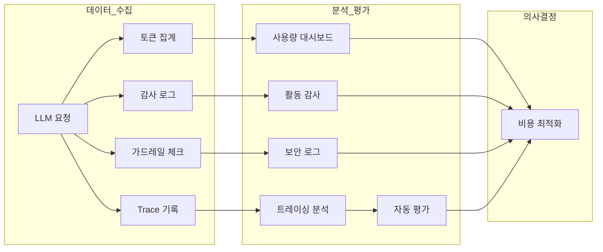

모니터링은 Cloosphere 플랫폼의 **운영 가시성**을 제공하는 핵심 기능입니다.
AI 사용 현황을 실시간으로 추적하고, 모든 사용자 활동을 투명하게 기록하며, 응답 품질을 체계적으로 평가합니다.

---

## 모니터링 대상

| 영역 | 목적 | 대상 사용자 |
|------|------|------------|
| **BI 대시보드** | 운영 데이터 시각화, AI 자동 차트 생성, 공유 | 관리자, 경영진 |
| **사용량** | 토큰 소비, 비용, 사용 패턴 분석 | 관리자, 팀 리더 |
| **감사 로그** | 사용자 활동 기록, 컴플라이언스 | 관리자, 보안 담당자 |
| **가드레일 로그** | 민감 정보 탐지/차단 이벤트 추적 | 관리자, 보안 담당자 |
| **트레이싱** | LLM 요청 처리 과정 단계별 추적 | 관리자, 개발자 |
| **평가** | 응답 품질 측정 (수동 피드백 + 자동 평가 + Leaderboard) | 관리자, 품질 관리자 |

---

## 접근 방법

모니터링 기능은 두 곳에서 접근합니다.

<Tabs>
  <Tab title="관리자 > 모니터링">
    사이드바 **관리자 > 모니터링**에서 접근합니다. 진입 시 **감사 로그(Audit Logs)** 탭이 기본으로 표시됩니다.

    

    | 탭 | 기능 |
    |------|------|
    | **대시보드** | BI 대시보드 — AI 기반 패널 차트, 공유, HTML 내보내기 |
    | **감사 로그** | 사용자 활동 기록 조회 |
    | **가드레일 로그** | 가드레일 탐지/차단 이벤트 조회 |
    | **Conversation Logs** | 대화 기록 조회 |
    | **파일 로그** | 파일 업로드 보안 모니터링 (가드레일 분류 결과, 차단/플래그 파일 추적) |
    | **사용량** | 토큰 사용량, 비용, 통계 대시보드 |

    <Note>
      **Conversation Logs** 탭은 대화 기록을 조회하는 기능입니다. 별도 가이드 페이지는 추후 제공 예정입니다.
    </Note>

    <Note>
      **파일 로그** 탭은 feature flag에 의해 조건부로 표시됩니다. 환경 설정에 따라 메뉴에 표시되지 않을 수 있습니다.
    </Note>
  </Tab>
  <Tab title="관리자 > 평가">
    사이드바 **관리자 > 평가**에서 접근합니다.

    

    | 탭 | 기능 |
    |------|------|
    | **평가** | 사용자 피드백(좋아요/싫어요) 조회 |
    | **자동 평가** | LLM 기반 응답 품질 자동 측정 결과 |
    | **Leaderboard** | 모델 간 평가 점수 비교 및 순위 대시보드 |
    | **트레이싱** | LLM 요청 처리 과정 추적 |
  </Tab>
</Tabs>

---

## 활용 시나리오

<Columns cols={2}>
  <Card title="월별 AI 비용 분석" icon="chart-pie">
    사용량 대시보드에서 조직/모델별 토큰 소비를 확인하고 CSV로 내보내 비용 보고서를 작성합니다.
  </Card>
  <Card title="보안 사고 조사" icon="shield">
    감사 로그에서 의심스러운 활동을 기간/사용자별로 필터링하여 사고 경위를 추적합니다.
  </Card>
  <Card title="응답 품질 디버깅" icon="magnifying-glass">
    트레이싱에서 특정 메시지의 처리 과정을 단계별로 확인하고, LLM 분석 리포트를 생성합니다.
  </Card>
  <Card title="가드레일 정책 개선" icon="lock">
    가드레일 로그에서 탐지 패턴을 분석하여 오탐률을 줄이고 보안 정책을 강화합니다.
  </Card>
</Columns>

---

## 정기 점검 권장 주기

| 주기 | 점검 항목 |
|------|----------|
| **일간** | 이상 사용 패턴, 가드레일 차단 이벤트 확인 |
| **주간** | 사용량 추이, 자동 평가 점수 트렌드 검토 |
| **월간** | 비용 분석 보고서, 감사 로그 요약, 가드레일 정책 리뷰 |
| **분기** | 전체 활용도 평가, 모델 비용 효율성 분석 |

---

## 세부 기능

<Columns cols={2}>
  <Card title="BI 대시보드" icon="chart-column" href="/ko/monitoring/dashboard">
    AI 기반 패널 대시보드 — 자연어로 SQL 차트를 자동 생성하고 공유
  </Card>
  <Card title="사용량" icon="gauge" href="/ko/monitoring/usage">
    토큰 사용량, 비용, 모델/사용자/조직별 분석
  </Card>
  <Card title="감사 로그" icon="clipboard-list" href="/ko/monitoring/audit-logs">
    사용자 활동 기록 및 컴플라이언스 감사
  </Card>
  <Card title="가드레일 로그" icon="shield-check" href="/ko/monitoring/guardrail-logs">
    민감 정보 탐지/차단 이벤트 로그
  </Card>
  <Card title="트레이싱" icon="route" href="/ko/monitoring/tracing">
    LLM 요청 처리 과정 단계별 추적
  </Card>
  <Card title="평가" icon="star" href="/ko/monitoring/evaluations">
    수동 피드백 및 자동 품질 평가
  </Card>
</Columns>
