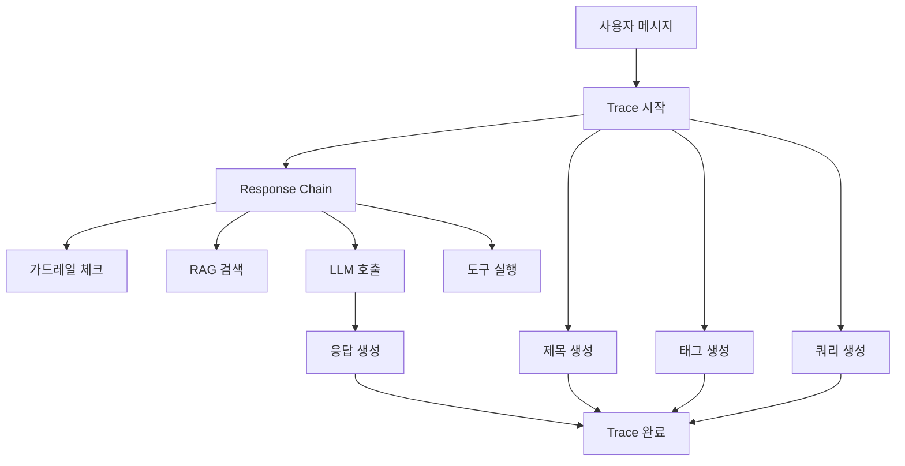
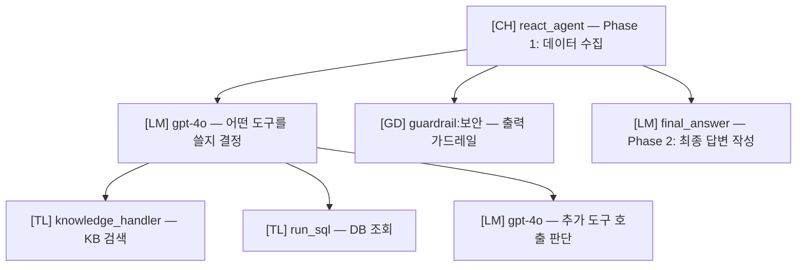

에이전트가 엉뚱한 답변을 했을 때, "왜 이렇게 답했는지" 알 수 없어 답답한 경험이 있으신가요?

트레이싱은 AI 요청이 처리되는 **전 과정을 단계별로 추적**합니다. 어떤 문서를 검색했는지, 어떤 도구를 호출했는지, LLM에 어떤 프롬프트가 전달됐는지 — 모든 단계를 투명하게 확인할 수 있습니다.

### 예시

> 에이전트가 "해당 정보를 찾을 수 없습니다"라고 답변함

| 상태 | 할 수 있는 것 | 결과 |
|------|-------------|------|
| 트레이싱 없음 | 추측만 가능 | 원인 파악 불가 |
| 트레이싱 활용 | Run tree에서 RAG 검색 → 0건 반환 확인 | KB 문서 누락이 원인 → 문서 추가로 해결 |

**관리자 > 평가 > 트레이싱** 탭에서 접근합니다.

{/* SCREENSHOT: tracing-main
     화면: 관리자 > 평가 > 트레이싱 탭
     영역: 검색 필터 + 메시지 카드 목록
     상태: 여러 메시지 카드가 있는 상태 (다양한 배지)
     하이라이트: 없음 */}
<Frame caption="관리자 > 평가 > 트레이싱에서 모든 AI 요청의 처리 과정을 추적합니다">
  
</Frame>

<Note>
  트레이싱은 라이선스 기능입니다. `trace` 피처가 활성화된 라이선스가 필요합니다.
</Note>

---

## 트레이싱 개념

사용자 메시지 하나가 처리되는 과정에는 여러 단계가 포함됩니다. 트레이싱은 이 모든 단계를 **Trace > Run** 계층 구조로 기록합니다.



| 개념 | 설명 |
|------|------|
| **Trace** | 하나의 메시지에 대한 전체 처리 과정 |
| **Run** | Trace 내의 개별 처리 단계 |
| **Run 트리** | 부모-자식 관계로 구성된 Run 계층 구조 |

---

## 트레이스 검색

### 검색 방법

| 검색 타입 | 설명 |
|----------|------|
| **Chat ID** | 특정 채팅의 모든 트레이스 조회 |
| **Message ID** | 특정 메시지의 트레이스만 조회 |

### 필터 옵션

| 필터 | 옵션 |
|------|------|
| **기간** | 최근 1일, 7일, 30일, 전체 |
| **상태** | Success, Error, Running, Pending |
| **유형** | Chain, LLM, Tool, Retrieval, Web Search, Guardrail, Embedding |
| **사용자** | 특정 사용자별 필터링 (관리자 전용) |

<Note>
  Chat ID 또는 Message ID로 검색할 때는 날짜 필터가 적용되지 않습니다. 해당 ID에 대한 모든 트레이스가 기간과 관계없이 조회됩니다.
</Note>

<Tip>
  채팅 화면에서 메시지 옵션 메뉴의 **"트레이싱 보기"**를 클릭하면 해당 메시지의 트레이스 화면으로 바로 이동할 수 있습니다.
</Tip>

---

## 메시지 카드

검색 결과는 메시지 카드 목록으로 표시됩니다.

| 항목 | 설명 |
|------|------|
| **사용자 메시지** | 원본 입력 메시지 (최대 2줄) |
| **Message ID** | 메시지 식별자 (축약 표시) |
| **시간** | 요청 시간 |
| **총 지연시간** | 전체 처리 시간 (ms) |
| **총 토큰** | 전체 토큰 사용량 (prompt + completion) |
| **트레이스 배지** | 각 Run 유형별 상태 표시 |

---

## 트레이스 상세 조회

메시지 카드를 클릭하면 상세 트레이스 모달이 열립니다. 좌측에 Run 트리, 우측에 선택된 Run의 상세 정보가 표시됩니다.

{/* SCREENSHOT: tracing-detail-modal
     화면: 트레이스 상세 모달
     영역: 좌측 Run 트리 + 우측 Run 상세 패널 (Inputs/Outputs)
     상태: Run 하나 선택되어 상세 정보 표시 중
     하이라이트: 없음 */}
<Frame caption="좌측 Run 트리에서 단계를 선택하면 우측에서 해당 단계의 입출력을 확인합니다">
  
</Frame>

### Run 트리 구조

좌측 패널에서 처리 단계가 트리 구조로 표시됩니다.

```
[CH] Response               2.34s
  ├─ [GD] guardrail:보안    0.05s
  ├─ [RG] KnowledgeBase     0.32s
  ├─ [LM] GPT-4             1.89s
  └─ [TL] web_search        0.13s
```

### Run 타입

| 약어 | 타입 | 색상 | 설명 |
|:----:|------|:----:|------|
| **CH** | Chain | 보라 | 복합 작업 (메시지 처리 전체) |
| **LM** | LLM | 파랑 | LLM API 호출 |
| **TL** | Tool | 초록 | 도구 실행 |
| **RG** | Retrieval | 주황 | RAG 문서 검색 |
| **WB** | Web Search | 시안 | 웹 검색 |
| **GD** | Guardrail | 빨강 | 가드레일 체크 |
| **EM** | Embedding | 노랑 | 임베딩 생성 |
| **IM** | Image | 남색 | 이미지 생성 |
| **ACT** | Action | 보라 | 도구 + 하위 작업 그룹 (펼치기 가능) |
| **TK** | Task | 회색 | 백그라운드 태스크 |

### 상태 표시

| 상태 | 기호 | 색상 |
|------|:----:|:----:|
| **Success** | ● | 초록 |
| **Error** | ● | 빨강 |
| **Running** | ◐ | 노랑 |
| **Pending** | ○ | 회색 |

<Note>
  트레이스 전체 상태는 포함된 Run 중 **하나라도 Error가 있으면 Error**, Error가 없고 Running이 있으면 Running으로 표시됩니다.
</Note>

---

## Run 상세 정보

우측 패널에서 선택한 Run의 상세 정보를 확인합니다.

| 섹션 | 설명 |
|------|------|
| **Status** | 상태, 지연시간, 모델 ID |
| **Inputs** | 입력 데이터 (시스템 프롬프트, 사용자 메시지 등) |
| **Outputs** | 출력 데이터 (AI 응답, 검색 결과 등) |
| **Error** | 오류 메시지 (오류 발생 시) |
| **Token Usage** | prompt_tokens, completion_tokens, total_tokens (LLM 타입) |

### 뷰 모드

Inputs/Outputs는 세 가지 형식으로 볼 수 있습니다.

| 모드 | 설명 |
|------|------|
| **Tree** | 계층적 트리 구조 (기본) |
| **JSON** | 원본 JSON 형식 |
| **Text** | 평문 텍스트 |

### 텍스트 검색

Outputs 영역에서 텍스트를 검색할 수 있습니다.

| 동작 | 방법 |
|------|------|
| **검색** | 검색어 입력 시 노란색 하이라이트 |
| **다음 매치** | Enter |
| **이전 매치** | Shift + Enter |
| **매치 수** | 검색창 옆 `1/5` 형식으로 표시 |

---

## 트레이스 유형

### 메인 응답

사용자 메시지에 대한 AI 응답 생성 과정입니다.

| 유형 | 설명 |
|------|------|
| **Response** | 전체 응답 생성 (최상위 Chain) |
| **LLM** | LLM API 호출 |
| **RAG** | 지식기반 검색 |
| **Tool** | 도구 실행 |
| **Search** | 웹 검색 |
| **Guard** | 가드레일 체크 |

### 백그라운드 작업

채팅 보조 기능을 위한 백그라운드 작업입니다.

| 유형 | 설명 |
|------|------|
| **Title** | 채팅 제목 자동 생성 |
| **Tag** | 채팅 태그 자동 생성 |
| **Query** | RAG 검색 쿼리 생성 |
| **Emoji** | 채팅 이모지 생성 |
| **Autocomplete** | 자동완성 제안 |
| **Function** | 함수 호출 판단 |

---

## Run 트리 읽는 법

에이전트의 Run 트리는 **2단계(Phase)로 구성**됩니다. 이 구조를 이해하면 문제의 원인을 빠르게 찾을 수 있습니다.



| Phase | Run 이름 | 하는 일 |
|:-----:|---------|---------|
| **Phase 1** | `react_agent` (CH) | LLM이 도구를 호출하며 데이터를 수집하는 단계. KB 검색, DB 조회, 웹 검색 등이 여기서 실행됨 |
| **Phase 2** | `final_answer` (LM) | 수집된 데이터를 종합하여 최종 답변을 작성하는 단계 |

### 디버깅 포인트

<AccordionGroup>
  <Accordion title="에이전트가 지식기반을 검색하지 않았다면?" icon="magnifying-glass">
    Phase 1의 첫 번째 **LM Run**의 Inputs를 확인하세요. `tool_descriptions`에 지식기반 도구가 포함되어 있는지 확인합니다.

    - **도구가 목록에 없음** → 에이전트에 지식기반이 연결되지 않았거나 도구 설명이 비어 있음
    - **도구가 있는데 호출 안 함** → LLM이 질문과 도구의 관련성을 낮게 판단. 도구 설명(Tool Description)을 더 구체적으로 수정
  </Accordion>

  <Accordion title="검색은 했는데 답변이 부정확하다면?" icon="file-circle-question">
    **RG (Retrieval) Run**의 Outputs에서 검색된 문서 내용을 확인하세요.

    - **검색 결과가 관련 없음** → KB 문서 품질 문제 또는 검색 설정(Top K, Reranker) 조정 필요
    - **검색 결과는 좋은데 답변이 엉뚱함** → Phase 2 `final_answer` LM Run의 Inputs에서 전달된 context를 확인. 답변 포맷 프롬프트 조정 필요
  </Accordion>

  <Accordion title="도구 실행이 실패했다면?" icon="circle-exclamation">
    빨간색 ● 표시된 **TL (Tool) Run**을 클릭하여 Error 섹션을 확인하세요. Inputs에서 전달된 파라미터도 함께 검증합니다.
  </Accordion>

  <Accordion title="응답이 너무 느리다면?" icon="clock">
    Run 트리에서 각 단계 옆의 **지연시간(ms)**을 비교하세요. 가장 오래 걸린 단계가 병목입니다.

    - LM Run이 느림 → 더 빠른 모델로 변경 고려
    - RG/TL Run이 느림 → 검색 설정 또는 외부 서비스 확인
    - GD Run이 느림 → LLM Judge 비활성화 또는 빠른 모델로 변경
  </Accordion>
</AccordionGroup>

---

## 트레이스 분석 리포트

트레이스 데이터를 LLM으로 분석하여 **문제의 근본 원인을 자동으로 파악**하는 기능입니다.

<Steps>
  <Step title="분석 시작">
    트레이스 상세 모달 상단의 **"트레이스 분석"** 버튼을 클릭합니다.

    | 입력 항목 | 설명 | 필수 |
    |----------|------|------|
    | **분석 모델** | 분석에 사용할 LLM 모델 | 필수 |
    | **문제 설명** | 관찰된 문제 상황 기술 | 선택 |

    <Note>
      분석 모델 목록에는 base_model_id가 설정된 모델(커스텀 모델), 프리셋 모델, 아레나 모델은 표시되지 않습니다. 기본(base) 모델만 선택할 수 있습니다.
    </Note>
  </Step>
  <Step title="분석 결과 확인">
    LLM이 트레이스 데이터를 분석하여 구조화된 리포트를 생성합니다.

    LLM이 트레이스 데이터 + 에이전트 설정 + 대화 이력 + KB/DB/가드레일 설정을 종합 분석하여 리포트를 생성합니다.

    | 리포트 섹션 | 내용 |
    |-----------|------|
    | **요약** | 분석 결과 2~3문장 핵심 요약 |
    | **트레이스 개요** | ID, 상태, 지연시간, 토큰, Run 수, 오류 수 |
    | **근본 원인 분석** | 주요 원인 + 기여 요인 |
    | **Phase 1 분석** | 도구 선택이 적절했는지, 사용 가능한 도구 vs 실제 호출 비교 |
    | **Phase 2 분석** | 수집된 데이터 대비 최종 답변의 적절성 |
    | **프롬프트/설정 이슈** | 시스템 프롬프트, 모델 선택 문제 |
    | **KB/RAG 이슈** | 검색 설정, 문서 품질, 필터 문제 |
    | **DB/SQL 이슈** | NL-to-SQL 변환, 스키마 문제 |
    | **가드레일 이슈** | 과도한 차단, 오탐 |
    | **오류 분석** | Error Run 상세 진단 |
    | **개선 권장사항** | 즉시 조치, 설정 변경, 데이터 개선 |

    <Tip>
      문제 설명을 입력하면 해당 맥락에 집중한 분석이 가능합니다. 예: "KB에서 문서를 찾았는데 답변에 반영되지 않음"
    </Tip>
  </Step>
  <Step title="리포트 저장/공유">
    | 기능 | 설명 |
    |------|------|
    | **복사** | 클립보드에 전체 텍스트 복사 |
    | **다운로드** | 마크다운 파일(.md)로 다운로드 |
  </Step>
</Steps>

<Note>
  이전에 분석한 리포트가 있는 경우, **"리포트 보기"** 버튼으로 재분석 없이 바로 확인할 수 있습니다.
</Note>

---

## 트레이스 관리

### 권한

| 역할 | 권한 |
|------|------|
| **일반 사용자** | 자신의 트레이스만 조회 가능 |
| **관리자** | 모든 사용자의 트레이스 조회 및 관리 |

### 데이터 정리

오래된 트레이스는 관리자가 `/api/traces/cleanup` API를 통해 정리할 수 있습니다.
타임스탬프(밀리초, ms 단위)로 특정 시점 이전의 트레이스를 일괄 삭제합니다.

<Warning>
  트레이스 삭제는 복구할 수 없습니다. 삭제 전 필요한 분석 리포트를 먼저 다운로드하세요.
</Warning>

---

## 활용 사례

<AccordionGroup>
  <Accordion title="응답 품질 디버깅" icon="magnifying-glass-chart">
    1. 채팅 메시지의 **"트레이싱 보기"** 버튼을 클릭합니다
    2. 문제 메시지의 Run 트리를 펼칩니다
    3. **RG (Retrieval) Run** → Outputs에서 검색된 문서를 확인합니다
    4. **LM (final_answer) Run** → Inputs에서 전달된 context를 확인합니다
    5. **트레이스 분석 리포트**를 생성하여 근본 원인을 자동 파악합니다
  </Accordion>

  <Accordion title="지연 시간 분석" icon="clock">
    1. 느린 응답의 트레이스를 조회합니다
    2. Run 트리에서 각 단계 옆의 **지연시간(ms)**을 비교합니다
    3. 가장 오래 걸린 단계를 식별합니다 (예: RAG 0.8s, LLM 3.2s)
    4. 해당 단계를 최적화합니다 (검색 설정 조정, 모델 변경 등)
  </Accordion>

  <Accordion title="도구 실행 오류 추적" icon="circle-exclamation">
    1. **Error** 상태로 필터링합니다
    2. 빨간색 ● 표시된 실패 Run을 선택합니다
    3. **Error** 섹션에서 오류 메시지를 확인합니다
    4. **Inputs**에서 전달된 파라미터를 검증합니다
  </Accordion>

  <Accordion title="토큰 사용량 분석" icon="coins">
    1. 메시지 카드의 **총 토큰** 수를 확인합니다
    2. Run 트리에서 LM Run별 `prompt_tokens` / `completion_tokens`를 비교합니다
    3. Phase 1(react_agent)과 Phase 2(final_answer)의 토큰 비율을 확인합니다
    4. 불필요하게 큰 프롬프트나 반복 호출이 있는지 식별합니다
  </Accordion>
</AccordionGroup>

---

## 채팅에서 트레이싱 접근

채팅 화면에서 메시지 옵션 메뉴의 **"트레이싱 보기"** 버튼을 클릭하면 해당 메시지의 트레이스 화면으로 바로 이동합니다.

| 권한 | 표시되는 버튼 |
|------|-------------|
| 관리자 또는 평가 읽기/쓰기 권한 | **트레이싱 보기** → 트레이스 화면으로 이동 |
| 그 외 사용자 | **Message ID 복사** → 관리자에게 전달하여 조사 요청 |

<Tip>
  일반 사용자가 응답에 문제를 발견하면 **Message ID를 복사**하여 관리자에게 전달하세요. 관리자가 해당 ID로 트레이스를 조회하여 원인을 파악할 수 있습니다.
</Tip>

---

## FAQ

<AccordionGroup>
  <Accordion title="트레이싱은 자동으로 기록되나요?" icon="circle-question">
    네, 메시지 트레이싱이 활성화되어 있으면 (기본값: 활성) 모든 AI 요청이 자동으로 기록됩니다. 별도 설정이 필요 없습니다.
  </Accordion>

  <Accordion title="트레이스 데이터는 얼마나 보존되나요?" icon="circle-question">
    기본 보존 기간은 **30일**입니다. 관리자가 설정을 변경하거나 수동으로 정리할 수 있습니다.
  </Accordion>

  <Accordion title="트레이싱이 응답 속도에 영향을 주나요?" icon="circle-question">
    트레이스 기록은 백그라운드로 비동기 처리되므로 응답 속도에 거의 영향을 주지 않습니다.
  </Accordion>

  <Accordion title="분석 리포트도 토큰을 소비하나요?" icon="circle-question">
    네, 트레이스 분석은 별도의 LLM 호출이며 사용량이 `trace_analysis`로 별도 추적됩니다. 분석은 수동으로 트리거할 때만 실행됩니다.
  </Accordion>
</AccordionGroup>

---

## 관련 페이지

<Columns cols={3}>
  <Card title="가드레일 로그" icon="shield-check" href="/ko/monitoring/guardrail-logs">
    가드레일 탐지 이벤트 전용 로그
  </Card>
  <Card title="자동 평가" icon="chart-line" href="/ko/monitoring/evaluations">
    에이전트 응답 품질 자동 평가 결과
  </Card>
  <Card title="사용량" icon="coins" href="/ko/monitoring/usage">
    토큰 사용량 및 비용 분석
  </Card>
</Columns>
