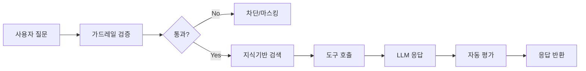

기본 AI 모델에게 매번 같은 맥락을 설명하고, 사내 문서를 수동으로 복붙하고, 답변 형식을 지시하는 것이 번거롭지 않으셨나요?

에이전트는 **지식기반 + 도구 + 가드레일 + 시스템 프롬프트**를 하나로 묶어, 부서별로 최적화된 AI 어시스턴트를 만드는 기능입니다.

<Note>
한 줄로 — **시스템 프롬프트 + 지식기반 + 도구 + 가드레일**을 묶어 부서별로 최적화된 AI를 만드는 기능입니다.

- **언제 쓰나요?** 같은 맥락이 매번 반복되거나, 답변 형식과 사내 자료 인용을 일관되게 유지해야 할 때
- **얼마나 걸리나요?** 시스템 프롬프트만 있는 최소형은 5분 · KB·도구·가드레일까지 풀세팅은 30분쯤
- **비용은요?** 매 응답마다 KB 검색·도구 라우팅이 더해져 기본 모델보다 토큰을 더 씁니다 — 가벼운 질문엔 기본 모델이 낫습니다
- **이게 맞는 도구일까요?** 분기·반복이 핵심이면 [플로우](/ko/workspace/flows), 도구 한두 개만 필요하면 [도구](/ko/workspace/tools)를 먼저 살펴보세요
</Note>

### 예시

> "이번 달 매출 현황 알려줘"

| 상태 | 동작 | 결과 |
|------|------|------|
| 기본 모델 | AI의 일반 지식으로 추측 | "매출 데이터에 접근할 수 없습니다" |
| 에이전트 (DB + KB 연결) | 매출 DB 조회 + 보고서 양식 적용 | 정확한 매출 데이터 + 표 형식 응답 |

{/* SCREENSHOT: agents-list
     화면: 워크스페이스 > 에이전트 목록
     영역: 전체 목록 (에이전트 카드들 + 활성/비활성 토글)
     상태: 3~4개 에이전트 있는 상태
     하이라이트: 없음 */}
<Frame caption="워크스페이스 > 에이전트에서 생성된 에이전트 목록을 확인합니다">
  
</Frame>

---

## 에이전트 처리 파이프라인

에이전트는 사용자 질문을 받아 다음 파이프라인을 거쳐 응답을 생성합니다.



가드레일이 입력을 검증하고, 지식기반에서 관련 문서를 검색한 뒤, 필요 시 도구(API, DB)를 호출하여 LLM이 최종 응답을 생성합니다.

---

## 어떤 걸 써야 할까?

에이전트·기본 모델·플로우는 비슷해 보이지만 쓰는 상황이 다릅니다.

<Columns cols={3}>
  <Card title="기본 모델" icon="comments">
    **언제** — 1회성 질문, 자유로운 답변 형식, 일반 지식 기반.

    "이 코드 무슨 의미야?", "환율 알려줘" 같은 가벼운 대화에 가장 빠르고 저렴합니다. KB 검색이나 도구 라우팅이 없어 토큰 소비가 적습니다.
  </Card>

  <Card title="에이전트" icon="robot">
    **언제** — 같은 KB를 반복 인용하거나, 답변 톤·형식을 고정하거나, 가드레일을 적용해야 할 때.

    HR 정책 Q&A, 코드 리뷰어, 데이터 분석가처럼 **"어떤 KB를 인용할지·어떤 도구를 부를지"를 LLM에게 맡기는** 패턴에 적합합니다.
  </Card>

  <Card title="플로우" icon="diagram-project">
    **언제** — 분기·반복·외부 API 체인이 핵심일 때.

    폼 입력 → 자동 처리 → 알림 전송, 다단계 승인 같은 자동화에 적합합니다. **의사결정 흐름을 사람이 노드로 명시**하므로 동작이 예측 가능합니다.
  </Card>
</Columns>

<Tip>
  헷갈릴 때는 **에이전트부터** 시작하세요. 단순 질문에 과하다 싶으면 기본 모델로 내리고, "이건 if/else 분기 같다" 싶으면 [플로우](/ko/workspace/flows)로 옮기면 됩니다. 한 번에 정답을 고를 필요 없습니다.
</Tip>

---

## 에이전트 생성

<Steps>
  <Step title="기본 정보 입력">
    **워크스페이스 > 에이전트 > "+ 새 에이전트"** 클릭 후 기본 정보를 입력합니다.

    {/* SCREENSHOT: agents-create-basic
         화면: 에이전트 생성 폼 > 기본 정보 영역
         영역: 이름, 설명, 프로필 이미지, 태그
         상태: 빈 폼 상태
         하이라이트: 없음 */}
    <Frame caption="에이전트 이름, 설명, 프로필 이미지를 설정합니다">
      
    </Frame>

    | 필드 | 설명 | 예시 |
    |------|------|------|
    | **이름** | 에이전트 표시 이름 | "마케팅 어시스턴트" |
    | **설명** | 에이전트 용도 설명 | "마케팅 콘텐츠 작성 및 분석 지원" |
    | **프로필 이미지** | 에이전트 아이콘 | 마케팅 관련 이미지 |
    | **태그** | 분류 태그 | 마케팅, 콘텐츠 |
  </Step>

  <Step title="기반 모델 선택">
    에이전트가 사용할 AI 모델을 선택합니다. 관리자가 등록한 모델 목록에서 선택할 수 있습니다.
  </Step>

  <Step title="프롬프트 작성">
    에이전트의 역할, 성격, 응답 규칙을 정의합니다.

    | 필드 | 설명 |
    |------|------|
    | **작업 프롬프트 (Task Prompt)** | 에이전트의 역할, 성격, 제한사항 및 구체적인 작업 지시를 정의합니다. 일반적인 시스템 프롬프트 역할을 합니다. |
    | **답변 포맷 프롬프트 (Response Format Prompt)** | 응답 형식과 구조를 지정합니다 (마크다운, 테이블 등). 작업 프롬프트와 분리하여 응답 형식만 별도로 관리합니다. |

    각 프롬프트 입력란 옆의 **AI 자동 생성 버튼**을 클릭하면, 에이전트의 이름, 설명, 연결된 리소스 정보를 분석하여 프롬프트를 자동으로 작성합니다.

    <Note>
      AI 자동 생성 시, 도구 사용법이나 SQL 작성 규칙 같은 기술적 지침은 **자동으로 제외**됩니다. 플랫폼이 이를 자동 처리하므로, 프롬프트에는 역할·성격·제한사항만 포함됩니다.
    </Note>

    {/* SCREENSHOT: agents-task-prompt
         화면: 에이전트 편집 > 프롬프트 영역
         영역: Task Prompt textarea + AI 생성 버튼 + Response Format Prompt textarea
         상태: 프롬프트가 입력된 상태
         하이라이트: 없음 */}
    <Frame caption="작업 프롬프트(역할 정의)와 답변 포맷 프롬프트(출력 형식)를 분리하여 작성합니다">
      
    </Frame>

    <Accordion title="좋은 작업 프롬프트 예시">
      ```markdown
      당신은 Cloocus의 마케팅 어시스턴트입니다.

      ## 역할
      - 마케팅 콘텐츠 작성 지원
      - SNS 게시물 초안 작성
      - 마케팅 데이터 분석

      ## 응답 규칙
      - 항상 한국어로 응답
      - 전문적이지만 친근한 톤 유지
      - 데이터 기반 인사이트 제공
      - 브랜드 가이드라인 준수

      ## 제한사항
      - 경쟁사 비방 금지
      - 검증되지 않은 통계 사용 금지
      ```
    </Accordion>

    <Accordion title="작업 프롬프트와 답변 포맷 프롬프트는 왜 분리되어 있나요?">
      두 프롬프트는 에이전트 실행의 **서로 다른 단계**에서 사용됩니다.

      ```mermaid
      flowchart TD
          A["① 작업 프롬프트 적용"] --> B[에이전트가 도구 호출하며 데이터 수집]
          B --> C[KB 검색, DB 조회, 웹 검색 등]
          C --> D["② 답변 포맷 프롬프트 적용"]
          D --> E[수집된 데이터로 최종 답변 작성]
      ```

      | | 작업 프롬프트 | 답변 포맷 프롬프트 |
      |---|---|---|
      | **적용 시점** | 에이전트가 도구를 사용하는 동안 | 최종 답변을 작성할 때 |
      | **역할** | "무엇을 해야 하는가" (역할, 제한사항) | "어떻게 답해야 하는가" (마크다운, 표, 길이) |
      | **포함할 내용** | 역할 정의, 행동 규칙, 제한사항 | 출력 형식, 어조, 구조 |
      | **포함하면 안 되는 것** | 출력 형식 지정 | 역할 정의, 행동 규칙 |

      분리하면 **역할은 유지하면서 출력 형식만 바꾸거나**, 반대로 출력 형식은 유지하면서 역할만 변경할 수 있습니다.
    </Accordion>
  </Step>

  <Step title="프롬프트 제안 설정 (선택)">
    채팅 화면에서 에이전트를 선택했을 때 표시되는 대화 시작 제안 문구를 설정합니다.

    | 옵션 | 설명 |
    |------|------|
    | **Default** | 시스템 기본 제안 문구 사용 |
    | **Custom** | 에이전트 용도에 맞는 제안 문구 직접 설정 |

    <Tip>
      에이전트 용도에 맞는 질문 예시를 제공하면 사용자가 빠르게 대화를 시작할 수 있습니다.
      예: "이번 달 매출 현황 요약해줘", "SNS 게시물 초안 작성해줘"
    </Tip>
  </Step>

  <Step title="지식기반 연결">
    에이전트가 참조할 문서를 연결합니다.

    1. "지식기반" 섹션에서 **"+ 추가"** 클릭
    2. 연결할 지식기반 선택 (여러 개 선택 가능)

    연결된 지식기반의 문서를 RAG로 검색하여 답변에 활용하며, 출처를 인용할 수 있습니다.

    {/* SCREENSHOT: agents-knowledge
         화면: 에이전트 편집 > 지식기반 섹션
         영역: 연결된 지식기반 목록 + 추가 버튼
         상태: 1~2개 연결된 상태
         하이라이트: 없음 */}
    <Frame caption="여러 지식기반을 연결하면 에이전트가 질문에 따라 적절한 KB를 자동 선택합니다">
      
    </Frame>
  </Step>

  <Step title="데이터베이스 연결 (선택)">
    NL-to-SQL 기반 자연어 데이터 조회를 위해 [데이터베이스(DbSphere)](/ko/workspace/database)를 연결합니다.

    1. "데이터베이스" 섹션에서 **"+ 추가"** 클릭
    2. 연결할 데이터베이스 선택 (여러 개 선택 가능)

    연결된 데이터베이스에 대해 자연어로 질문하면 AI가 SQL을 생성하고 실행하여 결과를 반환합니다.
  </Step>

  <Step title="용어집 연결 (선택)">
    에이전트가 조직의 비즈니스 용어를 이해할 수 있도록 [용어집](/ko/workspace/glossary)을 연결합니다.

    1. "용어집" 섹션에서 **"+ 추가"** 클릭
    2. 연결할 용어집 선택 (여러 개 선택 가능)

    용어집에 등록된 용어의 정의, 동의어, 컨텍스트가 에이전트 응답에 반영됩니다.
  </Step>

  <Step title="도구 연결 (선택)">
    외부 시스템과 연동할 도구를 연결합니다. "도구 연결" 섹션에서 MCP 서버 또는 OpenAPI 서버를 선택합니다.

    | 도구 유형 | 설명 |
    |-----------|------|
    | **OpenAPI 서버** | REST API를 통해 외부 서비스와 상호작용 |
    | **MCP 서버** | Model Context Protocol 기반 도구 연동 |

    <Warning>
      연결한 도구의 **설명(description)이 비어있으면 편집기 상단에 경고 배너**가 표시됩니다. 도구 설명은 LLM이 "언제 이 도구를 호출할지" 판단하는 핵심 근거이므로, 미작성 도구가 있으면 잘못된 호출 또는 미사용으로 이어질 수 있습니다. 배너가 보이면 해당 도구의 [도구 정의](/ko/workspace/tools)에서 설명을 보강하세요.
    </Warning>
  </Step>

  <Step title="기능 설정 (선택)">
    에이전트가 사용할 수 있는 고급 기능을 설정합니다. 각 기능은 **3가지 상태**로 제어합니다.

    | 상태 | 설명 |
    |------|------|
    | **Disabled** | 채팅에서 기능을 완전히 숨김 (기본값) |
    | **Default On** | 채팅 시작 시 기능이 자동 활성화, 사용자가 끌 수 있음 |
    | **Default Off** | 채팅에서 기능이 표시되지만 사용자가 직접 켜야 동작 |

    | 기능 | 설명 |
    |------|------|
    | **웹 검색** | 실시간 웹 검색으로 최신 정보 조회. 결과 수와 도메인 필터 설정 가능 |
    | **이미지 생성** | AI 이미지 생성 엔진 연동. 사용할 연결을 선택 가능 |
    | **코드 인터프리터** | Python 코드 실행으로 계산 및 데이터 분석 수행 |

    {/* SCREENSHOT: agents-capabilities
         화면: 에이전트 편집 > 기능 설정 (Capabilities) 섹션
         영역: 웹 검색 / 이미지 생성 / 코드 인터프리터 3개 토글
         상태: 하나는 Default On, 하나는 Default Off, 하나는 Disabled
         하이라이트: 없음 */}
    <Frame caption="각 기능을 Disabled / Default On / Default Off 3가지 상태로 설정합니다">
      
    </Frame>
  </Step>

  <Step title="응답 형식 설정 (선택)">
    에이전트의 응답을 **구조화된 JSON 형식**으로 제한할 수 있습니다.

    | 모드 | 설명 |
    |------|------|
    | **Chat** | 기본 자유형 텍스트 응답 |
    | **Structured** | JSON Schema에 따른 구조화 응답 (Structured Output) |

    Structured 모드에서는 비주얼 필드 빌더 또는 Raw JSON 에디터로 응답 스키마를 정의할 수 있습니다.

    {/* SCREENSHOT: agents-response-format
         화면: 에이전트 편집 > 응답 형식 설정
         영역: Chat / Structured 모드 선택 + JSON Schema 에디터
         상태: Structured 모드 선택, 스키마 정의된 상태
         하이라이트: 없음 */}
    <Frame caption="Structured 모드에서 JSON Schema로 응답 구조를 정의합니다">
      
    </Frame>
  </Step>

  <Step title="가드레일 설정 (선택)">
    에이전트에 보안 가드레일을 연결하여 입출력을 검증합니다.

    - 개인정보(PII) 자동 탐지 및 마스킹
    - 커스텀 패턴 필터링
    - 금지 단어 차단
    - LLM 기반 콘텐츠 검증
  </Step>

  <Step title="자동 평가 설정 (선택)">
    에이전트 응답 품질을 자동으로 모니터링합니다.

    | 설정 | 설명 |
    |------|------|
    | **샘플링 비율** | 평가할 응답 비율 (1%~100%) |
    | **평가 유형** | 검색 품질, 충실성, 응답 품질 중 선택 |
    | **심판 모델** | 평가에 사용할 LLM 선택 |

    <Accordion title="평가 유형 상세">
      | 유형 | 설명 |
      |------|------|
      | **검색 품질 (Retrieval Quality)** | 지식기반에서 검색된 문서의 관련성 평가 |
      | **충실성 (Faithfulness)** | 응답이 검색된 내용에 충실한지, 환각이 없는지 평가 |
      | **응답 품질 (Response Quality)** | 응답의 전반적인 품질, 유용성, 정확성 평가 |
    </Accordion>

    **샘플링 비율 권장:**

    | 상황 | 권장 비율 | 이유 |
    |------|:--------:|------|
    | 신규 에이전트 (검증 단계) | 50~100% | 초기 품질 파악 필요 |
    | 안정화된 에이전트 | 5~10% | 비용 절감하면서 모니터링 |
    | 핵심 업무 에이전트 | 20~30% | 지속적 품질 보증 필요 |

    <Note>
      **검색 품질**과 **충실성** 평가는 지식기반(KB) 검색 결과가 있을 때만 실행됩니다. KB가 연결되지 않은 에이전트에서는 **응답 품질**만 선택하세요.
    </Note>

    {/* SCREENSHOT: agents-auto-eval
         화면: 에이전트 편집 > 자동 평가 설정
         영역: 활성화 토글 + 샘플링 슬라이더 + 평가 유형 선택 + 심판 모델
         상태: 활성화 + 10% + 3개 유형 선택
         하이라이트: 없음 */}
    <Frame caption="자동 평가를 활성화하면 응답 품질을 지속적으로 모니터링할 수 있습니다">
      
    </Frame>
  </Step>

  <Step title="접근 권한 설정">
    에이전트 사용 권한을 설정합니다.

    | 옵션 | 설명 |
    |------|------|
    | **공개** | 모든 사용자가 사용 가능 |
    | **비공개** | 본인만 사용 가능 |
    | **그룹/조직 지정** | 특정 그룹 또는 조직만 사용 가능 |

    {/* SCREENSHOT: agents-access-control
         화면: 에이전트 편집 > 접근 권한 모달
         영역: 공개/비공개 + 그룹/사용자 선택
         상태: 그룹 1개 선택된 상태
         하이라이트: 없음 */}
    <Frame caption="그룹 또는 조직 단위로 에이전트 사용 권한을 세분화합니다">
      
    </Frame>
  </Step>

  <Step title="저장">
    **"저장"** 버튼을 클릭하여 에이전트를 생성합니다.
  </Step>
</Steps>

---

## 에이전트 사용

### 채팅에서 선택

채팅 화면 상단의 모델 선택 드롭다운에서 에이전트를 선택합니다. 에이전트는 일반 모델과 함께 목록에 표시됩니다.

### @ 명령어로 호출

채팅 중 `@에이전트이름`으로 특정 에이전트를 호출할 수 있습니다.

```
@마케팅어시스턴트 이번 달 프로모션 SNS 게시물 5개 작성해줘
```

---

## 에이전트 관리

| 작업 | 설명 |
|------|------|
| **활성/비활성** | 에이전트 카드의 토글 스위치로 활성화/비활성화. 비활성 에이전트는 채팅에서 선택할 수 없습니다 |
| **편집** | 에이전트 카드의 편집 버튼 또는 더보기 메뉴에서 설정 수정 |
| **복제** | 기존 에이전트를 복사하여 새 에이전트 빠르게 생성 |
| **내보내기/가져오기** | JSON 파일로 에이전트 설정 백업 및 환경 간 이동 |
| **삭제** | 에이전트 영구 삭제 (복구 불가) |

<Note>
  내보내기/가져오기를 활용하면 개발 환경에서 생성한 에이전트를 운영 환경으로 이동할 수 있습니다.
</Note>

---

## 활용 시나리오

추상적인 기능 설명이 아니라 **실제 운영에서 나오는 상황 → 어떻게 구성하는지**의 패턴을 모았습니다. 비슷한 상황이 있다면 그대로 시작점으로 쓰세요.

<AccordionGroup>
  <Accordion title="HR 어시스턴트 — 인사규정 Q&A" icon="user-tie">
    **상황**: 연차·복리후생·취업규칙 같은 반복 문의가 HR팀에 몰린다. 답변 출처(규정 몇 조)도 같이 줘야 신뢰가 생긴다.

    **구성**:
    | 항목 | 값 |
    |------|----|
    | 기반 모델 | GPT-4o-mini (저비용, 사실 위주 응답에 충분) |
    | 지식기반 | 인사규정, 복리후생 안내 PDF |
    | 시스템 프롬프트 | "HR 전문가. 답변 끝에 항상 출처 조항 표기. 추측 금지" |
    | 가드레일 | 출력 PII 마스킹 (직원 식별 정보 차단) |
    | 권한 | 비공개 / 전사 그룹에 Read |

    **만드는 순서**: 지식기반 생성 → PDF 업로드 → 에이전트 생성 → KB 연결 → 시스템 프롬프트 작성 → 가드레일 연결 → 전사 공개

    **흔한 함정**:
    - KB에 너무 많은 문서를 넣으면 검색 정확도 ↓ → HR 도메인만 분리
    - "출처 표기" 지시가 없으면 LLM이 임의 답변 → 시스템 프롬프트에 명시 필요
  </Accordion>

  <Accordion title="코드 리뷰어 — 사내 컨벤션 기반" icon="code">
    **상황**: 팀마다 코딩 규칙(네이밍, 에러 처리, 린트)이 다른데 신입이 매번 슬랙으로 묻는다.

    **구성**:
    | 항목 | 값 |
    |------|----|
    | 기반 모델 | Claude Sonnet 4.x (코드 컨텍스트 이해 강함) |
    | 지식기반 | 코딩 가이드라인 wiki, API 레퍼런스 |
    | 시스템 프롬프트 | "리뷰는 [개선]/[양호]/[질문] 3태그로. 가이드라인 절 번호 인용" |
    | 도구 | 없음 (사내망 코드 직접 접근은 별도 MCP 서버로 분리 권장) |

    **만드는 순서**: 가이드라인을 KB로 정리 → 에이전트 생성 → "@code-reviewer" 핸들 부여 → 채팅에서 `@code-reviewer 이 함수 리뷰해줘` 호출

    **흔한 함정**:
    - 가이드라인이 outdated면 잘못된 리뷰 → KB sync 주기 설정 필수
    - 코드 전체를 채팅에 붙여넣으면 토큰 폭증 → 함수 단위 리뷰로 유도
  </Accordion>

  <Accordion title="데이터 분석가 — DB 연결 + 데이터 딕셔너리" icon="chart-line">
    **상황**: "이번 달 매출 TOP 5" 같은 질문에 BI 팀이 매번 SQL을 짜준다. 비기술자도 자연어로 물을 수 있게.

    **구성**:
    | 항목 | 값 |
    |------|----|
    | 기반 모델 | GPT-4o (SQL 생성·표 렌더링 안정) |
    | 데이터베이스 | DbSphere에서 매출 DB 연결 |
    | 지식기반 | 데이터 딕셔너리 (테이블/컬럼 의미 사전) |
    | 시스템 프롬프트 | "쿼리 결과는 표로. 데이터 소스 테이블명 표기" |
    | 가드레일 | 입력 SQL injection 패턴 차단 |

    **만드는 순서**: DbSphere에서 DB 등록 + 스키마 추출 → 데이터 딕셔너리 KB 작성 → 에이전트 생성 → DB + KB 연결

    **흔한 함정**:
    - 스키마 추출 안 하면 LLM이 컬럼명 추측 → 잘못된 SQL → DbSphere에서 추출 우선
    - 큰 테이블 전체 SELECT는 비용 폭증 → 시스템 프롬프트에 LIMIT 강제
    - 민감 컬럼(salary 등)은 DB 연결 시 컬럼 단위 차단 설정 활용
  </Accordion>

  <Accordion title="고객 지원 임베드 — 외부 사이트에 노출" icon="headset">
    **상황**: 제품 사이트에 챗봇을 임베드해 비로그인 방문자도 FAQ를 묻게 하고 싶다. 단, 회사 내부 정보는 절대 노출되면 안 된다.

    **구성**:
    | 항목 | 값 |
    |------|----|
    | 기반 모델 | GPT-4o-mini (저비용, 외부 트래픽 대응) |
    | 지식기반 | 공개 FAQ, 제품 매뉴얼만 (내부 문서 제외) |
    | 시스템 프롬프트 | "회사 내부 정보·가격 정책 추측 금지. 모르면 '담당자 문의' 안내" |
    | 가드레일 | 출력 PII / 내부 코드명 / 미공개 가격 차단 |
    | 임베드 위젯 | 게스트 모드 ON, side-bottom 배치 |

    **만드는 순서**: 공개 KB 분리 → 가드레일 정책 작성 → 에이전트 생성 (공개 권한) → [임베드 위젯](/ko/admin/settings/embed-widgets)에서 이 에이전트 선택 → 게스트 모드 활성화

    **흔한 함정**:
    - 내부 KB와 공개 KB를 분리 안 하면 답변에 내부 정보 노출 → KB 자체를 분리해야 안전
    - 가드레일은 출력 검증, KB 분리는 정보 격리 — 둘 다 필요
  </Accordion>

  <Accordion title="회의록 요약기 — 최소 구성" icon="file-lines">
    **상황**: 매주 회의록을 요약해 슬랙으로 공유. KB나 도구 없이 단순 가공만.

    **구성**:
    | 항목 | 값 |
    |------|----|
    | 기반 모델 | Claude Sonnet 4.x |
    | 지식기반 | 없음 |
    | 시스템 프롬프트 | "회의록을 받으면 1) 결정사항 2) 액션 아이템(담당자/마감) 3) 다음 안건으로 정리" |
    | 도구 | 없음 |

    **만드는 순서**: 에이전트 생성 → 시스템 프롬프트만 작성 → 채팅에 회의록 붙여넣기

    **언제 이걸로 충분한가**: KB·도구·가드레일 없는 "프롬프트 + 모델"만 묶고 싶을 때. 5분 안에 만든다. 더 단순하면 [프롬프트](/ko/workspace/prompts) 기능으로 충분할 수도 있음.
  </Accordion>
</AccordionGroup>

---

## 베스트 프랙티스

### 프롬프트 작성

1. **역할을 명확히 정의하세요** — "당신은 Cloocus 마케팅팀의 콘텐츠 전문가입니다"
2. **구체적인 지침을 제공하세요** — 응답 언어, 길이, 인용 규칙 등
3. **제한사항을 설정하세요** — 경쟁사 비방 금지, 개인정보 노출 금지 등

### 지식기반 연결

- **관련 문서만 연결**: 너무 많은 문서는 오히려 검색 정확도를 저하시킵니다
- **최신 문서 유지**: 오래된 정보는 정기적으로 업데이트하세요
- **도구 설명 작성**: 지식기반의 도구 설명을 구체적으로 작성하면 에이전트가 적절한 KB를 선택하는 정확도가 높아집니다

### 접근 권한

- **최소 권한 원칙**: 필요한 사람에게만 접근 권한을 부여하세요
- **그룹/조직 단위 관리**: 개별 사용자보다 그룹 단위로 관리하면 효율적입니다
- **정기 검토**: 권한 설정을 주기적으로 점검하세요

---

## FAQ

<AccordionGroup>
  <Accordion title="에이전트와 기본 모델의 차이점은?" icon="circle-question">
    에이전트는 기본 모델에 지식기반, 도구, 시스템 프롬프트, 가드레일을 추가하여 특정 업무에 최적화한 것입니다. 기본 모델은 범용 대화에, 에이전트는 업무 특화 대화에 적합합니다.
  </Accordion>

  <Accordion title="한 에이전트에 여러 지식기반을 연결할 수 있나요?" icon="circle-question">
    네, 여러 지식기반과 데이터베이스를 동시에 연결할 수 있습니다. 에이전트는 질문에 따라 적절한 리소스를 자동으로 선택합니다. 지식기반마다 **도구 설명(Tool Description)**을 구체적으로 작성하면 선택 정확도가 높아집니다.
  </Accordion>

  <Accordion title="웹 검색/이미지 생성/코드 인터프리터가 동작하지 않습니다." icon="triangle-exclamation">
    에이전트 기능 설정의 상태를 확인하세요:
    - **Disabled**: 채팅에서 기능이 완전히 숨겨집니다
    - **Default Off**: 채팅 입력창에서 사용자가 직접 켜야 합니다
    - **Default On**: 자동 활성화되며, 이 상태에서도 동작하지 않으면 관리자 설정(웹 검색/이미지 생성 연결)을 확인하세요

    코드 인터프리터는 에이전트 설정 **과** 채팅에서 사용자가 켜야 **양쪽 모두** 활성화되어야 동작합니다.
  </Accordion>

  <Accordion title="에이전트 사용량도 추적되나요?" icon="circle-question">
    네, 모니터링 대시보드에서 에이전트별 사용량, 토큰 소비량, 자동 평가 결과를 확인할 수 있습니다.
  </Accordion>

  <Accordion title="에이전트를 다른 환경으로 옮길 수 있나요?" icon="circle-question">
    네, **내보내기**(Export) 기능으로 JSON 파일을 다운로드한 뒤 다른 환경에서 **가져오기**(Import)하면 됩니다. 단, 연결된 지식기반·도구·가드레일은 대상 환경에 별도로 설정해야 합니다.
  </Accordion>

  <Accordion title="에이전트를 숨길 수 있나요?" icon="circle-question">
    네, 에이전트 카드의 **더보기 메뉴 > 숨기기**를 클릭하면 채팅 모델 선택 목록에서 숨겨집니다. 에이전트가 삭제되는 것이 아니며, 다시 표시할 수 있습니다.
  </Accordion>
</AccordionGroup>

---

## 관련 페이지

<Columns cols={3}>
  <Card title="지식기반" icon="database" href="/ko/workspace/knowledge">
    에이전트에 연결할 문서 기반 지식 저장소
  </Card>
  <Card title="가드레일" icon="shield-check" href="/ko/workspace/guardrails">
    에이전트 입출력 보안 검증
  </Card>
  <Card title="도구" icon="wrench" href="/ko/workspace/tools">
    OpenAPI / MCP 외부 서비스 연동
  </Card>
</Columns>
