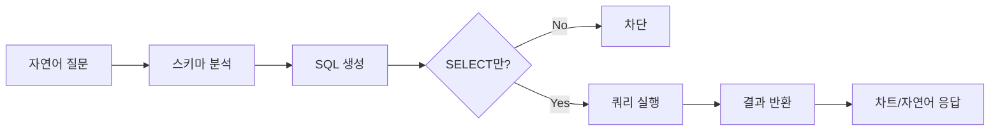
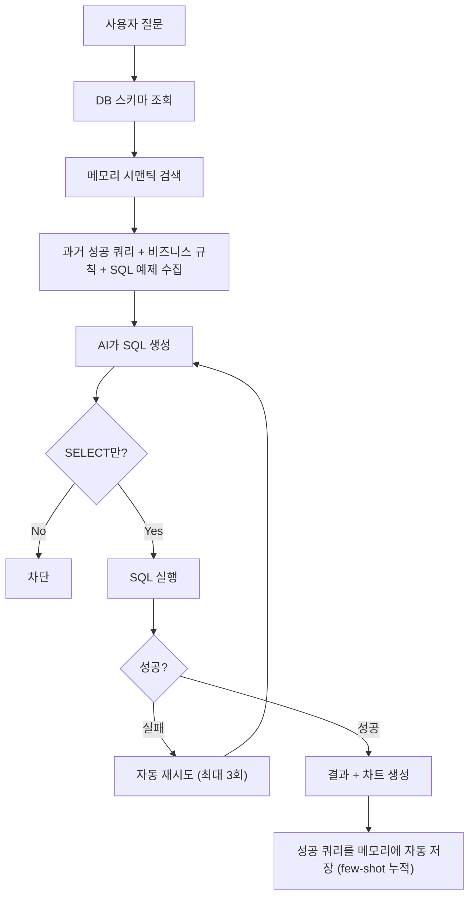

사내 데이터를 분석하고 싶을 때마다 SQL을 작성하거나 데이터 팀에 요청해야 했던 경험이 있으신가요?

DbSphere는 **자연어를 SQL로 자동 변환**하여 데이터베이스를 조회합니다. "이번 달 매출 알려줘"라고 질문하면 AI가 SQL을 생성하고 실행하여 결과를 자연어와 차트로 응답합니다.

### 예시

> "부서별 이번 분기 매출 비교해줘"

| 방법 | 과정 | 소요 시간 |
|------|------|:---------:|
| 직접 SQL 작성 | SQL 작성 → 실행 → 결과 해석 | 10~30분 |
| 데이터 팀 요청 | 요청 → 대기 → 결과 수령 | 수시간~수일 |
| DbSphere | 자연어 질문 → 즉시 답변 + 차트 | **10초** |

{/* SCREENSHOT: database-list
     화면: 워크스페이스 > 데이터베이스 목록
     영역: 전체 목록 (DB 카드들)
     상태: 2~3개 연결된 상태
     하이라이트: 없음 */}
<Frame caption="워크스페이스 > 데이터베이스에서 연결된 DB 목록을 확인합니다">
  
</Frame>

---

## NL-to-SQL 파이프라인



| 단계 | 설명 |
|------|------|
| **스키마 분석** | AI가 연결된 테이블 구조와 컬럼 설명을 분석합니다 |
| **SQL 생성** | 자연어 질문을 해당 DB 방언에 맞는 SQL로 변환합니다 |
| **안전 검증** | SELECT 쿼리만 허용하고 INSERT, UPDATE, DELETE 등은 차단합니다 |
| **쿼리 실행** | 검증된 SQL을 데이터베이스에서 실행합니다 |
| **자연어 응답** | 쿼리 결과를 자연어 텍스트 또는 차트로 변환합니다 |

---

## 지원 데이터베이스

기본적으로 10종의 데이터베이스를 지원합니다.

| 데이터베이스 | 유형 | 특징 |
|-------------|------|------|
| **PostgreSQL** | RDBMS | 고급 기능, JSON 지원, 오픈소스 |
| **MySQL** | RDBMS | 가장 널리 사용되는 RDBMS |
| **Microsoft SQL Server** | RDBMS | 엔터프라이즈 환경 |
| **Oracle** | RDBMS | 대규모 엔터프라이즈 |
| **SQLite** | RDBMS | 경량 임베디드 데이터베이스 |
| **Snowflake** | Cloud DW | 클라우드 데이터 웨어하우스 |
| **BigQuery** | Cloud DW | Google Cloud 데이터 웨어하우스, 서비스 계정 키 인증 |
| **Databricks** | Lakehouse | Databricks SQL Warehouse, Delta Lake 통합 |
| **Azure Synapse** | Cloud DW | Azure 통합 분석 플랫폼 |
| **Microsoft Fabric** | Lakehouse / DW | Power BI 통합 분석 환경 |

<Note>
  10종은 **기본 활성화** 상태입니다. 관리자가 `DBSPHERE_TYPES` 환경 변수로 노출 목록을 좁히거나 넓힐 수 있습니다.
</Note>

---

## 데이터베이스 연결

<Steps>
  <Step title="새 연결 생성">
    **워크스페이스 > 데이터베이스 > "+ 새 연결"** 클릭 후 기본 정보를 입력합니다.

    {/* SCREENSHOT: database-create
         화면: 데이터베이스 생성 폼
         영역: 이름, 설명, DB 유형 선택
         상태: 빈 폼 상태
         하이라이트: 없음 */}
    <Frame caption="이름, 설명, DB 유형을 입력합니다">
      
    </Frame>

    | 필드 | 설명 | 예시 |
    |------|------|------|
    | **이름** | 연결 표시 이름 | "매출 분석 DB" |
    | **설명** | 데이터베이스 용도 | "영업팀 매출 데이터" |
    | **DB 유형** | 데이터베이스 종류 | PostgreSQL |
  </Step>

  <Step title="접속 정보 입력">
    데이터베이스 접속에 필요한 정보를 입력합니다.

    **공통 필드:**

    | 필드 | 설명 |
    |------|------|
    | **호스트** | DB 서버 주소 |
    | **포트** | 접속 포트 |
    | **데이터베이스명** | 접속할 DB 이름 |
    | **사용자명** | DB 계정 |
    | **비밀번호** | DB 비밀번호 |

    <Accordion title="DB 유형별 추가 필드">
      | DB 유형 | 추가 필드 | 설명 |
      |---------|----------|------|
      | **Snowflake** | Account, Warehouse, Role, Schema | Snowflake 계정 식별자, 사용 웨어하우스, 역할, 스키마 |
      | **PostgreSQL** | Schema | 스키마 이름 (기본: `public`) |
      | **MSSQL** | Schema | 스키마 이름 (기본: `dbo`) |
      | **SQLite** | Database (파일 경로) | 호스트/포트/인증 불필요, DB 파일 경로만 입력 |
      | **BigQuery** | Project ID, Dataset, Service Account JSON | GCP 프로젝트 ID, 기본 데이터셋, 서비스 계정 키(JSON 붙여넣기). 호스트/포트/사용자명·비밀번호 불필요 |
    </Accordion>
  </Step>

  <Step title="연결 테스트">
    **"연결 테스트"** 버튼을 클릭하여 접속을 확인합니다.
  </Step>

  <Step title="테이블 선택">
    연결 성공 후 AI가 참조할 테이블을 선택합니다.

    {/* SCREENSHOT: database-tables
         화면: DB 상세 > DB All 탭 (테이블 목록)
         영역: 테이블 체크박스 목록 + 컬럼 수 표시
         상태: 일부 테이블 선택된 상태
         하이라이트: 없음 */}
    <Frame caption="AI가 참조할 테이블만 선택합니다 — 민감 데이터 테이블은 반드시 제외하세요">
      
    </Frame>

    <Warning>
      민감한 정보(개인정보, 비밀번호 등)가 포함된 테이블은 반드시 제외하세요. 선택된 테이블은 AI가 조회할 수 있습니다.
    </Warning>
  </Step>

  <Step title="스키마 설명 추가 (선택)">
    테이블과 컬럼에 대한 한국어 설명을 추가합니다. 설명이 상세할수록 AI가 더 정확한 SQL을 생성합니다.

    {/* SCREENSHOT: database-schema-desc
         화면: DB 상세 > Extracted 탭 (추출된 테이블)
         영역: 테이블별 컬럼 설명 편집 화면
         상태: 설명이 입력된 상태
         하이라이트: 없음 */}
    <Frame caption="테이블과 컬럼에 비즈니스 설명을 추가하면 SQL 생성 정확도가 크게 향상됩니다">
      
    </Frame>

    <Tip>
      **AI 자동 추출** 기능을 사용하면 테이블 구조, 컬럼 설명, 샘플 Q&A를 LLM이 자동 생성합니다. 수동으로 작성하지 않아도 되지만, 자동 생성 결과를 검토하고 보정하면 정확도가 더 높아집니다.
    </Tip>

    <Accordion title="스키마 설명 예시">
      ```
      테이블: orders
      설명: 주문 내역 테이블
      컬럼:
      - order_id: 주문 고유 번호
      - customer_id: 고객 ID (customers 테이블 참조)
      - order_date: 주문 일시
      - total_amount: 총 주문 금액 (원)
      - status: 주문 상태 (pending/confirmed/shipped/delivered)
      ```
    </Accordion>
  </Step>

  <Step title="도구 설명 설정 (선택)">
    에이전트가 이 데이터베이스를 언제, 어떻게 활용할지 안내하는 도구 설명을 작성합니다.

    **AI 자동 생성:** 도구 설명 입력란 옆의 자동 생성 버튼을 클릭하면, 연결된 테이블 구조와 컬럼 정보를 분석하여 AI가 도구 설명을 자동 작성합니다.

    <Accordion title="도구 설명 예시">
      ```
      이 데이터베이스는 영업팀의 주문, 고객, 재고 정보를 담고 있습니다.
      매출 분석, 고객 조회, 재고 현황 확인 등의 질문에 활용하세요.
      주문 테이블(orders)과 고객 테이블(customers)을 JOIN하여
      고객별 구매 내역을 조회할 수 있습니다.
      ```
    </Accordion>

    <Tip>
      도구 설명이 정확할수록 에이전트가 여러 데이터베이스 중 적절한 것을 선택하는 정확도가 높아집니다.
    </Tip>
  </Step>

  <Step title="접근 권한 설정">
    데이터베이스 사용 권한을 설정합니다.

    | 옵션 | 설명 |
    |------|------|
    | **공개** | 모든 사용자가 사용 가능 |
    | **비공개** | 본인만 사용 가능 |
    | **그룹/조직 지정** | 특정 그룹 또는 조직만 사용 가능 |
  </Step>
</Steps>

---

## AI가 SQL을 생성하는 흐름

에이전트에 DB를 연결하면, 사용자 질문이 다음 과정을 거쳐 SQL로 변환됩니다.



<Note>
  성공한 쿼리가 자동으로 메모리에 누적됩니다. 사용할수록 AI가 비슷한 질문에 더 정확한 SQL을 생성하게 됩니다.
</Note>

---

## 메모리 시스템

DbSphere는 4종류의 메모리를 활용하여 SQL 생성 정확도를 높입니다. 메모리가 많을수록 AI가 더 정확한 쿼리를 작성합니다.

| 메모리 | 뱃지 | 내용 | 생성 방식 |
|--------|:----:|------|----------|
| **DDL Schema** | DDL | 테이블 구조 + 컬럼 설명 | 스키마 추출 시 자동 |
| **SQL Memory** | SQL | 질문-SQL 쌍 (과거 성공 쿼리) | 쿼리 성공 시 **자동 누적** |
| **Documentation** | DOC | 비즈니스 용어, 규칙, 컨텍스트 | 수동 입력 |
| **SQL Example** | EX | 참조용 SQL 예제 (use case, 태그) | 수동 입력 또는 추출 시 자동 |

{/* SCREENSHOT: database-memory
     화면: DB 상세 > Memory 탭
     영역: 타입 필터 칩 + 메모리 목록 (DDL/SQL/DOC/EX 뱃지)
     상태: 여러 메모리가 있는 상태 (다양한 뱃지)
     하이라이트: 없음 */}
<Frame caption="Memory 탭에서 4종 메모리를 확인하고 관리할 수 있습니다">
  
</Frame>

### SQL Memory가 핵심

SQL Memory는 **성공한 쿼리가 자동으로 저장**되는 few-shot learning 메모리입니다.

| 사용 횟수 | SQL Memory | AI 동작 |
|:---------:|:----------:|---------|
| 처음 | 0건 | 스키마만 보고 SQL 추측 |
| 5회 | 5건 | 유사한 과거 쿼리 참고하여 생성 |
| 50회+ | 50건+ | 검증된 패턴으로 정확한 SQL 생성 |

### Documentation 활용

AI가 모르는 비즈니스 규칙을 Documentation으로 알려줄 수 있습니다.

| 유형 | 예시 |
|------|------|
| **용어 (term)** | "MRR은 Monthly Recurring Revenue의 약자로 monthly_revenue 컬럼에 저장됨" |
| **규칙 (rule)** | "매출 집계 시 status='cancelled'인 주문은 반드시 제외해야 함" |
| **컨텍스트 (context)** | "고객 등급은 S/A/B/C 4단계이며 S가 가장 높음" |

<Tip>
  AI가 틀린 SQL을 생성하는 패턴이 반복되면, **Documentation에 해당 규칙을 추가**하세요. AI가 다음 질문부터 해당 규칙을 참고합니다.
</Tip>

---

## 데이터 시각화

SQL 실행 결과에 따라 AI가 자동으로 적절한 차트를 생성합니다.

| 차트 타입 | 적합한 데이터 |
|----------|-------------|
| **막대 (Bar)** | 카테고리별 비교 |
| **선 (Line)** | 시계열 추이 |
| **파이 (Pie)** | 비율/구성 |
| **산점도 (Scatter)** | 상관관계 |
| **히트맵 (Heatmap)** | 교차 분석 |
| **히스토그램** | 분포 |
| **그룹 막대** | 다차원 비교 |
| **표 (Table)** | 상세 데이터 |

차트 타입을 지정하지 않으면 **Auto 모드**로 데이터 구조에 맞는 최적 차트를 자동 선택합니다.

---

## 데이터베이스 조회

### 에이전트에 연결

1. 에이전트 편집 화면에서 "데이터베이스" 섹션의 **"+ 추가"** 클릭
2. 연결할 데이터베이스 선택
3. 저장

### 채팅에서 사용

데이터베이스가 연결된 에이전트와 대화하면, AI가 질문을 분석하여 자동으로 SQL을 생성하고 실행합니다.

```
사용자: 지난 분기 대비 이번 분기 매출 성장률은?

AI: 분기별 매출을 분석했습니다:

| 분기 | 매출액 | 전분기 대비 |
|------|--------|------------|
| Q4 2024 | ₩12.5억 | - |
| Q1 2025 | ₩14.2억 | +13.6% |

이번 분기 매출은 전분기 대비 13.6% 성장했습니다.
주요 성장 요인: 신규 고객 유치(+23%), 기존 고객 재구매율 상승(+8%)
```

### 질문 예시

<Tabs>
  <Tab title="매출 분석">
    ```
    - 이번 달 매출 얼마야?
    - 지난주 일별 매출 추이 보여줘
    - 매출 TOP 10 고객 알려줘
    - 제품 카테고리별 매출 비중은?
    ```
  </Tab>
  <Tab title="고객 분석">
    ```
    - 이번 달 신규 가입 고객 수는?
    - VIP 고객 목록 보여줘
    - 최근 3개월간 구매하지 않은 고객은?
    - 고객 지역별 분포 알려줘
    ```
  </Tab>
  <Tab title="재고 관리">
    ```
    - 재고가 10개 미만인 상품 알려줘
    - 이번 주 입고 예정 상품은?
    - 재고 회전율이 낮은 상품 TOP 5는?
    ```
  </Tab>
  <Tab title="인사 관리">
    ```
    - 부서별 인원 현황 보여줘
    - 이번 달 입사/퇴사자 수는?
    - 평균 근속연수는?
    ```
  </Tab>
</Tabs>

### SQL 실행 결과 확인

AI 응답 하단에 **"SQL Query" 버튼**이 표시됩니다. 클릭하면 실제 실행된 SQL과 결과를 상세하게 확인할 수 있습니다.

| 기능 | 설명 |
|------|------|
| **SQL 보기** | 실행된 SQL을 포맷팅된 형태로 표시 (키워드 대문자, 들여쓰기 적용) |
| **SQL 복사** | 클립보드에 SQL 복사 — 별도 쿼리 도구에서 재실행할 때 유용 |
| **결과 테이블** | 쿼리 결과를 표 형태로 확인 |
| **CSV 다운로드** | 결과 데이터를 CSV 파일로 저장 |

<Note>
  결과 데이터는 **최대 100행**까지 표시됩니다. 전체 행 수가 100행을 초과하면 "Showing 100 of N rows" 안내가 표시됩니다. 전체 데이터가 필요하면 CSV 다운로드 후 확인하세요.
</Note>

---

## DB 방언 차이

각 DB는 SQL 문법이 조금씩 다릅니다. Cloosphere는 자연어 → SQL 변환 시 **DB별 dialect 규칙을 시스템 프롬프트에 동적으로 주입**해 AI가 올바른 SQL을 생성하도록 유도합니다. 다만 다음 항목은 **사용자가 의도를 명확히 표현하면 더 정확한 SQL이 생성**됩니다.

### 핵심 차이 비교

| 항목 | PostgreSQL | MySQL | Oracle | MSSQL/Synapse/Fabric | SQLite | Snowflake | BigQuery | Databricks |
|------|:----------:|:-----:|:------:|:--------------------:|:------:|:---------:|:--------:|:----------:|
| **식별자 인용** | `"name"` | `` `name` `` | `"NAME"` | `[name]` | `"name"` | `"NAME"` | `` `name` `` | `` `name` `` |
| **LIMIT 표현** | `LIMIT n` | `LIMIT n` | `FETCH FIRST n ROWS ONLY` | `TOP n` | `LIMIT n` | `LIMIT n` | `LIMIT n` | `LIMIT n` |
| **날짜 리터럴** | `'2026-04-26'` | `'2026-04-26'` | `TO_DATE('2026-04-26', 'YYYY-MM-DD')` | `'2026-04-26'` | `'2026-04-26'` | `'2026-04-26'` | `DATE '2026-04-26'` | `'2026-04-26'` |
| **날짜 포맷 함수** | `TO_CHAR()` | `DATE_FORMAT()` | `TO_CHAR()` | `FORMAT()` | `strftime()` | `TO_CHAR()` | `FORMAT_DATE()` | `date_format()` |
| **날짜 산술** | `+ INTERVAL '1 day'` | `DATE_ADD(d, INTERVAL 1 DAY)` | `+ 1` (직접) | `DATEADD(day, 1, d)` | `date(d, '+1 day')` | `DATEADD(day, 1, d)` | `DATE_ADD(d, INTERVAL 1 DAY)` | `date_add(d, 1)` |
| **문자열 연결** | `\|\|` | `CONCAT()` | `\|\|` | `+` | `\|\|` | `\|\|` | `CONCAT()` | `\|\|` |
| **빈 문자열 = NULL** | ✗ | ✗ | **✓ ⚠️** | ✗ | ✗ | ✗ | ✗ | ✗ |
| **대소문자 민감 (식별자)** | 따옴표 시 ✓ | 기본 ✗ | 대문자 기본 | 기본 ✗ | 따옴표 시 ✓ | 따옴표 시 ✓ | 기본 ✗ | 따옴표 시 ✓ |

### 시스템 자동 보정 vs 사용자 책임

**자동으로 처리되는 것:**
- 대시보드 기간 필터(`$st`/`$ed` 플레이스홀더): DB별 날짜 리터럴로 자동 변환
- 지식 그래프 값 추출 시 식별자 인용: DB별 따옴표 자동 선택
- AI에 전달되는 시스템 프롬프트에 DB별 dialect 규칙 동적 주입 (LIMIT, 날짜, 식별자 등)

**사용자/AI가 신경 써야 하는 것:**
- 자연어 쿼리에 한글·특수문자 컬럼명을 직접 적을 때 — AI가 따옴표를 누락하면 실패할 수 있음
- Oracle 빈 문자열 비교 (아래 Oracle 특이점 섹션 참조)
- 복잡한 윈도우 함수·CTE 같은 고급 SQL은 DB별 지원 차이가 있어 AI 생성 결과 검증 필요

---

## Oracle DB 특이점

Oracle은 ANSI SQL과 일부 동작이 달라 사용자가 알아둘 만한 항목이 있습니다.

<AccordionGroup>
  <Accordion title="빈 문자열은 NULL로 처리됩니다 ⚠️" icon="circle-exclamation">
    Oracle은 `''`(빈 문자열)을 `NULL`과 동일하게 취급합니다. 따라서 다음 같은 조건은 **항상 0행을 반환**합니다:

    ```sql
    -- ❌ 모두 잘못된 패턴 (Oracle)
    WHERE col <> ''
    WHERE col = ''
    WHERE TRIM(col) <> ''
    ```

    **올바른 사용:**

    ```sql
    -- ✅ NULL 검사로 대체
    WHERE col IS NOT NULL
    WHERE TRIM(col) IS NOT NULL
    ```

    Cloosphere의 시스템 프롬프트에 이 규칙이 포함되어 있어 AI가 자동으로 회피하지만, 자연어 쿼리에서 **"비어있지 않은 항목"** 같은 모호한 표현 사용 시 0행이 반환되면 이 패턴을 의심하세요.
  </Accordion>

  <Accordion title="날짜 리터럴은 TO_DATE() 사용" icon="calendar">
    다른 DB와 달리 Oracle은 문자열을 자동으로 날짜로 캐스팅하지 않습니다.

    ```sql
    -- ❌ Oracle에서 실패
    WHERE created_at >= '2026-04-01'

    -- ✅ Oracle 권장
    WHERE created_at >= TO_DATE('2026-04-01', 'YYYY-MM-DD')
    ```

    BI 대시보드의 기간 필터(`$st`/`$ed`)는 Oracle 사용 시 자동으로 `TO_DATE(...)` 형태로 치환됩니다. 그러나 SQL 결과 화면에서 직접 SQL을 작성할 때는 사용자가 명시해야 합니다.
  </Accordion>

  <Accordion title="날짜 산술은 INTERVAL 대신 직접 가감" icon="plus-minus">
    ```sql
    -- ❌ Oracle은 INTERVAL '1 day' 미지원
    WHERE created_at >= SYSDATE - INTERVAL '1 day'

    -- ✅ Oracle 권장
    WHERE created_at >= SYSDATE - 1
    ```

    `DATE_TRUNC()` 대신 `TRUNC(col, 'DD')`, 요일 추출은 `EXTRACT(DOW FROM col)` 대신 `TO_CHAR(col, 'D')`를 사용합니다.
  </Accordion>

  <Accordion title="한글·특수문자 컬럼명 인용" icon="quote-left">
    Oracle에서 한글 컬럼 별칭(`AS 공장코드`)을 그대로 쓰면 `ORA-00936: missing expression` 오류가 발생합니다.

    ```sql
    -- ❌ Oracle 실패
    SELECT plant_code AS 공장코드 FROM plants

    -- ✅ Oracle 권장
    SELECT plant_code AS "공장코드" FROM plants
    ```

    이 규칙은 시스템 프롬프트에 포함되어 AI가 따옴표를 자동으로 적용하지만, 한글 컬럼이 많은 환경에서는 결과를 확인하고 누락 시 직접 수정하세요.
  </Accordion>

  <Accordion title="LIMIT 대신 FETCH FIRST" icon="arrow-down-1-9">
    ```sql
    -- ❌ Oracle 12c 미만 또는 잘못된 사용
    SELECT * FROM users LIMIT 10

    -- ✅ Oracle 12c+
    SELECT * FROM users FETCH FIRST 10 ROWS ONLY

    -- ✅ Oracle 11g 호환 (서브쿼리)
    SELECT * FROM (SELECT * FROM users) WHERE ROWNUM <= 10
    ```
  </Accordion>
</AccordionGroup>

---

## 보안

### 읽기 전용

DbSphere는 **SELECT 쿼리만** 실행합니다. 데이터 변경은 불가능합니다.

| 허용 | 차단 |
|------|------|
| SELECT | INSERT, UPDATE, DELETE |
| 집계 함수 (COUNT, SUM, AVG) | DROP, ALTER, TRUNCATE |
| JOIN, 서브쿼리 | CREATE, GRANT |

### 자격 증명 보호

- 데이터베이스 비밀번호는 암호화하여 저장합니다
- 연결 정보는 접근 권한이 있는 사용자만 확인할 수 있습니다

---

## 베스트 프랙티스

### 데이터베이스 계정 설정

1. **전용 계정 생성**: AI 전용 읽기 전용 계정을 만드세요
2. **최소 권한 부여**: 필요한 테이블에 대해서만 SELECT 권한을 부여하세요
3. **쿼리 제한**: 타임아웃과 결과 행 수 제한을 설정하세요

### 테이블 선택

1. **필요한 것만 선택**: 모든 테이블을 연결하면 AI가 혼란스러워질 수 있습니다
2. **민감 데이터 제외**: 개인정보, 비밀번호가 포함된 테이블은 반드시 제외하세요
3. **관련 테이블 함께 선택**: JOIN이 필요한 테이블은 함께 선택하세요

### 스키마 설명 작성

1. **한국어 설명 권장**: 업무 용어를 사용하여 테이블과 컬럼을 설명하세요
2. **비즈니스 컨텍스트 추가**: "status" 컬럼의 가능한 값과 의미를 기술하세요
3. **테이블 관계 명시**: 외래 키 관계와 JOIN 조건을 설명하세요

---

## 트러블슈팅

<AccordionGroup>
  <Accordion title="연결 테스트가 실패합니다" icon="triangle-exclamation">
    | 원인 | 해결 방법 |
    |------|----------|
    | 네트워크 문제 | 방화벽 규칙, VPN 연결 상태 확인 |
    | 인증 실패 | 계정, 비밀번호, 권한 재확인 |
    | 포트 차단 | DB 포트가 열려 있는지 확인 |
    | SSL 설정 | SSL 인증서 요구 여부 확인 |
  </Accordion>

  <Accordion title="AI가 잘못된 SQL을 생성합니다" icon="triangle-exclamation">
    | 원인 | 해결 방법 |
    |------|----------|
    | 스키마 설명 부족 | 테이블, 컬럼에 상세 설명 추가 |
    | 비즈니스 규칙 미반영 | **Documentation 메모리**에 규칙 추가 |
    | 관련 테이블 누락 | JOIN이 필요한 테이블을 함께 선택 |
    | 질문이 모호함 | 구체적인 조건(날짜 범위, 필터)을 포함하여 질문 |
    | 과거 참고 쿼리 없음 | **SQL Example 메모리**에 올바른 쿼리 예제 추가 |
  </Accordion>

  <Accordion title="응답이 느립니다" icon="triangle-exclamation">
    | 원인 | 해결 방법 |
    |------|----------|
    | 대용량 데이터 | 날짜 범위 등 조건을 추가하여 질문 |
    | 복잡한 쿼리 | 질문을 단순화하거나 여러 질문으로 분리 |
    | DB 성능 문제 | 인덱스 최적화, DB 리소스 확인 |
  </Accordion>
</AccordionGroup>

---

## FAQ

<AccordionGroup>
  <Accordion title="데이터가 변경될 수 있나요?" icon="circle-question">
    아니요, DbSphere는 읽기 전용입니다. SELECT 쿼리만 실행하며, 데이터를 수정하거나 삭제할 수 없습니다. SQL 첫 단어가 `SELECT`가 아니면 즉시 차단됩니다.
  </Accordion>

  <Accordion title="실행된 SQL을 볼 수 있나요?" icon="circle-question">
    네, AI 응답에서 생성된 SQL을 확인할 수 있습니다. 트레이싱에서도 실행된 SQL과 결과를 상세하게 확인할 수 있습니다.
  </Accordion>

  <Accordion title="여러 테이블을 JOIN할 수 있나요?" icon="circle-question">
    네, 관련 테이블을 모두 선택하고 테이블 간 관계를 스키마 설명에 기술하면 AI가 적절한 JOIN 쿼리를 생성합니다.
  </Accordion>

  <Accordion title="한 에이전트에 여러 데이터베이스를 연결할 수 있나요?" icon="circle-question">
    네, 에이전트에 여러 데이터베이스를 연결하면 AI가 질문에 따라 적절한 데이터베이스를 자동으로 선택합니다. 이때 각 DB의 **도구 설명**을 구체적으로 작성하면 선택 정확도가 높아집니다.
  </Accordion>

  <Accordion title="스키마 추출 시 모델을 선택하면 뭐가 달라지나요?" icon="circle-question">
    모델을 선택하면 LLM이 테이블/컬럼에 **비즈니스 설명을 자동 생성**하고, **샘플 Q&A 쌍**도 만들어줍니다. 모델 없이 추출하면 DDL 구조만 저장됩니다. 모델 선택을 권장합니다.
  </Accordion>
</AccordionGroup>

---

## 관련 페이지

<Columns cols={3}>
  <Card title="에이전트" icon="robot" href="/ko/workspace/agents">
    DB를 에이전트에 연결하여 자연어 질의 활성화
  </Card>
  <Card title="용어집" icon="book" href="/ko/workspace/glossary">
    DB 비즈니스 용어를 AI에게 알려주어 정확도 향상
  </Card>
  <Card title="트레이싱" icon="chart-line" href="/ko/monitoring/tracing">
    SQL 생성·실행 과정을 단계별로 추적
  </Card>
</Columns>
