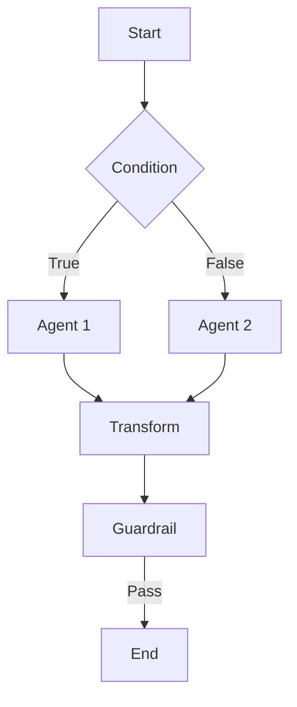
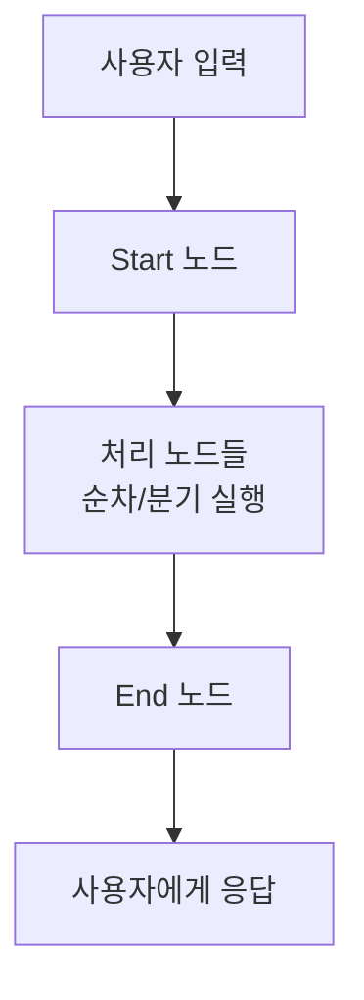

에이전트 플로우는 여러 에이전트, 모델, 도구, 지식기반을 시각적으로 연결하여 복잡한 AI 파이프라인을 구축하는 기능입니다.
n8n이나 Dify와 유사한 **비주얼 워크플로우 빌더**로, 드래그 앤 드롭만으로 멀티 에이전트 오케스트레이션을 구성할 수 있습니다.



<Warning>
  에이전트 플로우는 **개발자 모드(`developer_mode`)** 가 활성화되어 있고, **`agent_flow` 라이선스**가 부여된 환경에서만 사용할 수 있습니다.
  관리자 설정에서 개발자 모드를 켜고, 라이선스 조건을 확인하세요.
</Warning>

---

## 플로우 vs 단일 에이전트

| 구분 | 단일 에이전트 | 에이전트 플로우 |
|------|-------------|----------------|
| **복잡도** | 단순 질의응답 | 멀티스텝 파이프라인 |
| **에이전트 연결** | 독립 실행 | 에이전트 간 데이터 전달 |
| **조건 분기** | 불가 | Condition / Router 노드로 분기 |
| **데이터 변환** | 불가 | Extract Field / Format Text 변환 |
| **안전 검증** | 에이전트 단위 | Guardrail 노드로 플로우 내 검증 |
| **재사용** | 개별 호출 | Subflow로 파이프라인 중첩 |

<Tip>
  단순한 Q&A나 RAG 검색은 에이전트 하나로 충분합니다.
  여러 에이전트를 순차 또는 조건부로 연결해야 할 때 플로우를 사용하세요.
</Tip>

---

## 플로우 목록

**워크스페이스 > 플로우**에서 생성된 모든 플로우를 확인할 수 있습니다.

<Frame caption="플로우 목록">
  
</Frame>

각 플로우 카드에는 다음 정보가 표시됩니다.

| 요소 | 설명 |
|------|------|
| **이름** | 플로우 식별 이름 |
| **설명** | 플로우 용도 설명 |
| **Active / Inactive 배지** | 플로우 활성/비활성 상태 |
| **노드 수** | 플로우에 포함된 노드 개수 |
| **작성자** | "By {{name}}" 형태로 표시 |
| **수정일** | 마지막 수정 시점 (상대 시간) |

---

## 플로우 생성

<Steps>
  <Step title="새 플로우 만들기">
    **워크스페이스 > 플로우**에서 우측 상단의 **"+"** 버튼(aria-label: "Create Flow")을 클릭합니다.

    

    | 필드 | 설명 | 예시 |
    |------|------|------|
    | **Flow ID** | 영문 소문자, 숫자, 하이픈, 언더스코어 (2~50자) | `doc-analysis`, `3step-review` |
    | **이름** | 플로우 표시 이름 | "문서 분석 플로우" |
    | **설명** | 플로우 용도 | "문서를 요약하고 핵심 내용을 추출합니다" |

    <Warning>
      Flow ID는 생성 후 변경할 수 없습니다. 영문 소문자 또는 숫자로 시작하며, 소문자/숫자/하이픈/언더스코어만 사용 가능합니다 (정규식: `^[a-z0-9][a-z0-9_-]*$`).
    </Warning>
  </Step>

  <Step title="노드 배치">
    왼쪽 **Nodes** 패널에서 원하는 노드를 캔버스로 드래그합니다.
    모든 플로우는 반드시 **Start** 노드와 **End** 노드를 포함해야 합니다.

    
  </Step>

  <Step title="노드 연결">
    노드의 **출력 핸들**(하단 점)을 드래그하여 다음 노드의 **입력 핸들**(상단 점)에 연결합니다.
    데이터는 위에서 아래(Top → Bottom) 방향으로 흐릅니다.

    <Note>
      핸들 위치: **상단(Top)** = 입력, **하단(Bottom)** = 출력입니다.
      Guardrail, Condition 등 분기 노드는 하단에 여러 출력 핸들을 가집니다.
    </Note>
  </Step>

  <Step title="노드 설정">
    노드를 클릭하면 오른쪽에 **설정 패널**이 나타납니다.
    Agent 노드라면 실행할 에이전트를 선택하고, Model 노드라면 LLM 모델과 시스템/유저 프롬프트를 설정합니다.

    
  </Step>

  <Step title="유효성 검증 및 저장">
    상단 툴바에서 **Validate** 버튼과 **Save** 버튼은 별도로 존재합니다.

    - **Validate**: Start/End 노드 누락, 연결되지 않은 노드, 순환 참조 등 문제를 검증합니다.
    - **Save**: 현재 플로우를 저장합니다. 저장은 별도 동작이며, 자동으로 유효성 검증이 수행되지 않습니다.

  </Step>
</Steps>

---

## AI로 플로우 생성

플로우 에디터 하단의 **"AI Assistant" 버튼**(보라색 번개 아이콘)을 클릭하면, 대화형 AI 빌더가 열립니다. 자연어로 원하는 플로우를 설명하면 AI가 노드와 연결을 자동으로 생성합니다.

{/* TODO: 스크린샷 필요 — AI Assistant 패널 열린 상태 */}

### 대화형 빌드 흐름

AI 빌더는 즉시 생성하지 않고, **주요 결정 사항을 먼저 질문**합니다:

<Steps>
  <Step title="의도 입력">
    "고객 문의를 부서별로 분류하는 플로우 만들어줘"와 같이 원하는 플로우를 설명합니다.
  </Step>
  <Step title="AI 질문에 답변">
    AI가 가드레일 사용 여부, 라우팅 방식, 세부 옵션 등을 **버튼 형태**로 질문합니다. 원하는 옵션을 클릭하세요.

    예시:
    - "가드레일을 사용할까요?" → **[개인정보보호]** **[금칙어 차단]** **[사용 안함]**
    - "어떤 라우팅 방식을 사용할까요?" → **[Router]** **[Condition]** **[Direct]**
  </Step>
  <Step title="자동 생성">
    충분한 정보가 모이면 AI가 노드와 엣지를 자동으로 생성하여 캔버스에 배치합니다.
  </Step>
</Steps>

<Tip>
  처음부터 구체적으로 요청하면 질문 없이 바로 생성됩니다. 예: "PII 가드레일 → 감정 분석 라우터 → 긍정/부정별 에이전트로 분기하는 플로우 만들어줘"
</Tip>

### AI 빌더 특징

- **대화 히스토리 유지**: 플로우에 대화 기록이 저장되어, 나중에 다시 열면 이어서 수정 가능
- **기존 플로우 편집**: 이미 만들어진 플로우에서 AI를 열면 현재 구조를 인식하고 수정 제안
- **실시간 캔버스 반영**: AI가 생성한 노드가 즉시 캔버스에 표시됨
- **패널 높이 조절**: 상단 드래그 핸들로 패널 크기를 자유롭게 조절

---

## 노드 타입

에이전트 플로우는 총 **14종의 노드**를 5개 카테고리로 제공합니다.

| 카테고리 | 노드 | 설명 |
|----------|------|------|
| **Basic** | Start, End, Agent, Model | 플로우 시작/종료, 에이전트/모델 실행 |
| **Control Flow** | Condition, Router, Aggregator | 조건 분기, 다중 라우팅, 병렬 결합 |
| **Advanced** | Human Input, Subflow, Transform | 사용자 입력 대기, 하위 플로우, 데이터 변환 |
| **Safety** | Guardrail, Error Handler | 가드레일 검증, 오류 처리 |
| **Integration** | Notification | Email, Slack, Teams, Discord 알림 |

<Tip>
  각 노드의 상세 설정은 [노드 레퍼런스](/ko/workspace/flows-nodes)에서 확인하세요.
</Tip>

---

## 플로우 실행

### 채팅에서 실행

1. 새 채팅을 시작합니다
2. 모델 선택기에서 연결 타입 필터에 **Flow**가 표시됩니다. 이를 선택합니다
3. 원하는 플로우를 선택한 후 메시지를 입력합니다

<Note>
  플로우는 모델 선택기에서 별도의 탭이 아닌, **연결 타입(connection type) 필터**로 노출됩니다.
</Note>

### 실행 흐름



실행 중에는 각 노드의 상태가 실시간으로 표시됩니다.

| 상태 | 설명 |
|------|------|
| **실행 중** | 현재 처리 중인 노드 |
| **완료** | 처리 완료된 노드 |
| **출처** | KBSphere 사용 시 검색된 문서 출처 |

---

## 유효성 검증

상단 툴바의 **Validate** 버튼으로 수행할 수 있는 검증 항목입니다.

| 검증 항목 | 유형 | 설명 |
|----------|------|------|
| Start 노드 누락 | Error | 최소 1개의 Start 노드 필요 |
| End 노드 누락 | Error | 최소 1개의 End 노드 필요 |
| 리소스 미선택 | Error | Agent/Model/Guardrail/Subflow 노드에 리소스 미지정 |
| 순환 참조 | Error | 노드 간 순환 연결 감지 (무한 루프 위험) |
| 연결 안 된 노드 | Warning | 어떤 노드와도 연결되지 않은 노드 존재 |

---

## AI 자동생성 빌더

플로우 편집기 화면 하단의 **AI 채팅 패널**에서 자연어로 대화하며 플로우를 자동 구성할 수 있습니다. 노드를 하나하나 배치하는 대신, AI에게 원하는 워크플로우를 설명하면 됩니다.

{/* SCREENSHOT: AI 채팅 패널
<Frame caption="AI 플로우 빌더 채팅">
  
</Frame>
*/}

### 사용 방법

<Steps>
  <Step title="채팅 패널 열기">
    플로우 편집기 하단의 AI 채팅 영역에서 **모델을 선택**합니다.
  </Step>
  <Step title="자연어로 워크플로우 설명">
    원하는 플로우를 자연어로 입력합니다.

    예시:
    - "고객 문의를 분류한 뒤, 기술 질문은 기술팀 에이전트로, 일반 문의는 CS 에이전트로 분기해줘"
    - "입력을 가드레일로 검증하고 통과하면 Agent A → Agent B 순서로 처리해줘"
    - "3개 에이전트를 병렬로 실행한 뒤 결과를 합쳐줘"
  </Step>
  <Step title="AI 응답 확인">
    AI가 플로우 구조를 생성하고 편집기에 자동으로 반영합니다. AI가 추가 질문을 할 수도 있으며, 버튼 형태의 선택지가 나타나면 클릭으로 응답합니다.
  </Step>
  <Step title="반복 수정">
    대화를 이어가며 노드 추가, 변경, 삭제를 요청할 수 있습니다.
    - "Router 노드를 Condition으로 바꿔줘"
    - "에이전트 C를 중간에 추가해줘"
    - "가드레일 노드를 제거해줘"
  </Step>
</Steps>

<Info>
  AI 빌더는 **플로우 쓰기 권한**이 있는 사용자만 사용할 수 있습니다. 대화 이력은 플로우에 저장되어 다음 편집 시 이어서 대화할 수 있습니다.
</Info>

### 원클릭 생성 vs 대화형 수정

| 모드 | 설명 | 사용 시점 |
|------|------|----------|
| **원클릭 생성** | 목적을 한 문장으로 설명하면 플로우 전체를 한 번에 생성 | 새 플로우를 처음 만들 때 |
| **대화형 수정** | 여러 차례 대화로 점진적으로 패널 추가·수정·삭제 | 기존 플로우를 개선할 때 |

<Tip>
  AI가 생성한 플로우는 수동으로 자유롭게 수정할 수 있습니다. AI 빌더로 뼈대를 잡고, 세부 설정은 노드별로 직접 조정하는 것이 효과적입니다.
</Tip>

---

## 내보내기 / 가져오기

내보내기와 가져오기는 **플로우 편집기(FlowEditor) 상단 툴바**에서 수행합니다.

<Tabs>
  <Tab title="내보내기">
    플로우 편집기 상단 툴바의 **Export** 버튼을 클릭하면 JSON 파일로 다운로드됩니다.
    내보내기 파일에는 플로우 이름, 설명, 노드 구성, 연결 정보가 포함됩니다.
  </Tab>
  <Tab title="가져오기">
    플로우 편집기 상단 툴바의 **Import** 버튼을 클릭하고 내보낸 JSON 파일을 업로드합니다.
    가져오기 시 `type: "agent_flow"` 형식의 JSON 파일만 허용됩니다.

    <Note>가져온 플로우에서 참조하는 에이전트, 모델, 가드레일이 현재 환경에 존재해야 정상 실행됩니다.</Note>
  </Tab>
</Tabs>

---

## 활용 사례

<Accordion title="예시 1: 문서 분석 플로우">
  ```
  [Start] → [Agent: 문서 요약] → [Agent: 핵심 추출] → [End]
  ```
  사용자 입력을 문서 요약 에이전트가 처리한 후, 핵심 추출 에이전트가 요약 결과에서 주요 포인트를 정리합니다.
</Accordion>

<Accordion title="예시 2: 조건 분기 고객 지원">
  ```
                      ┌─ True ─→ [Agent: 기술지원] ─┐
  [Start] → [Condition] ──────────────────────────→ [End]
                      └─ False → [Agent: 일반문의] ─┘

  State Key: input
  Condition Type: Contains
  Value: "오류"
  ```
  사용자 입력에 "오류" 키워드가 포함되면 기술지원 에이전트로, 아니면 일반문의 에이전트로 분기합니다.
</Accordion>

<Accordion title="예시 3: 데이터 리포트 플로우">
  ```
  [Start] → [Agent: DBSphere] → [Transform: Format Text] → [Model: 리포트 생성] → [End]
  ```
  DBSphere 에이전트가 데이터를 조회하고, Transform 노드에서 Format Text 모드로 결과를 정리한 후, Model 노드가 최종 리포트를 작성합니다.
</Accordion>

<Accordion title="예시 4: 가드레일 적용 플로우">
  ```
                                         ┌─ Pass → [Agent: 질의응답] → [End]
  [Start] → [Guardrail: PII 검사] ─┤
                                         └─ Block → [Transform: 에러 메시지] → [End (Error)]
  ```
  사용자 입력에 개인정보가 포함되면 차단하고, 안전한 입력만 에이전트로 전달합니다.
  Block Action을 `Continue`로 설정하면 차단 정보를 Transform 노드에서 가공하여 사용자에게 안내할 수 있습니다.
</Accordion>

---

## 접근 권한

플로우에도 다른 워크스페이스 리소스와 동일한 접근 제어가 적용됩니다.

| 옵션 | 설명 |
|------|------|
| **공개 (Public)** | 모든 사용자가 사용 가능 |
| **비공개 (Private)** | 생성자만 사용 가능 |
| **그룹 지정** | 특정 그룹에만 읽기/쓰기 권한 부여 |

---

## FAQ

<Accordion title="플로우 메뉴가 보이지 않습니다">
  에이전트 플로우는 두 가지 조건이 모두 충족되어야 워크스페이스에 표시됩니다:
  1. **개발자 모드**(`developer_mode`)가 활성화되어 있어야 합니다
  2. **`agent_flow` 라이선스**가 부여되어 있어야 합니다

  관리자에게 설정 확인을 요청하세요.
</Accordion>

<Accordion title="플로우에서 사용할 수 있는 에이전트는?">
  워크스페이스에 등록된 모든 에이전트를 사용할 수 있습니다.
  일반 모드, KBSphere(향상된 RAG), DBSphere(데이터베이스) 모드 모두 지원됩니다.
</Accordion>

<Accordion title="플로우 실행 중 오류가 발생하면?">
  오류가 발생한 노드에서 실행이 멈추고 에러 메시지가 표시됩니다.
  Error Handler 노드를 사용하면 오류 시 대체 경로를 설정할 수 있습니다.
  노드 설정(리소스 선택, 파라미터)을 확인하고 다시 시도하세요.
</Accordion>

<Accordion title="하나의 플로우에 여러 에이전트를 연결할 수 있나요?">
  네, 여러 에이전트를 순차적으로 연결하거나 Condition/Router 노드로 분기할 수 있습니다.
  각 에이전트의 출력이 다음 에이전트의 입력으로 자동 전달됩니다.
</Accordion>

<Accordion title="플로우의 실행 순서는?">
  Start 노드에서 시작하여 연결된 노드를 순서대로 따라갑니다.
  Condition 노드에서는 조건 평가 결과에 따라 True 또는 False 경로로 분기하고,
  Router 노드에서는 매칭되는 Route 경로로 분기합니다.
  Aggregator 노드에서는 여러 병렬 경로가 합류합니다.
</Accordion>

<Accordion title="플로우를 다른 환경으로 이동하려면?">
  플로우 편집기 상단 툴바의 Export 버튼으로 JSON 파일을 내보내고, 대상 환경의 편집기에서 Import 버튼으로 가져옵니다.
  참조하는 에이전트, 모델, 가드레일이 대상 환경에도 존재해야 합니다.
</Accordion>

---

## 다음 단계

<Columns cols={2}>
  <Card title="에이전트 생성" icon="robot" href="/ko/workspace/agents">
    플로우에서 사용할 에이전트를 구성합니다
  </Card>
  <Card title="가드레일 설정" icon="shield" href="/ko/workspace/guardrails">
    플로우 내에서 안전한 응답을 위한 필터를 구성합니다
  </Card>
</Columns>
