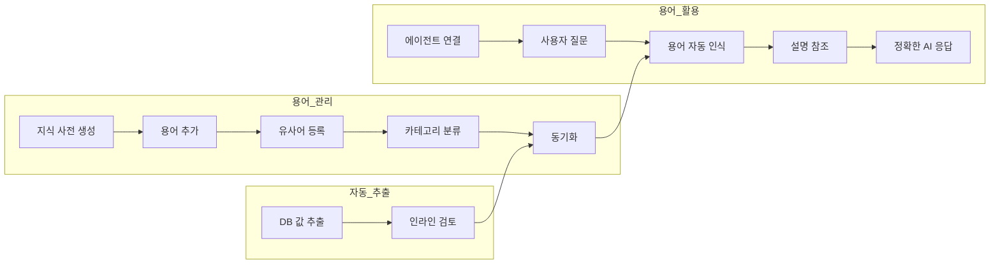
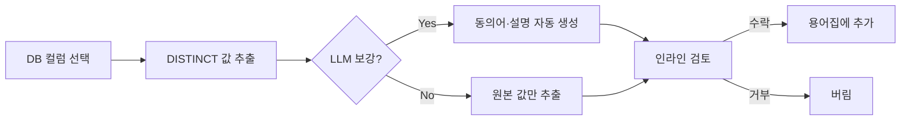

용어집은 조직 내에서 사용하는 **전문 용어, 약어, 업무 규칙**을 체계적으로 관리하는 기능입니다.
AI가 회사 고유의 용어를 정확히 이해하고, 일관된 답변을 제공할 수 있도록 합니다.



---

## 지식 사전이란?

지식 사전은 조직 내 전문 용어와 그 설명을 관리하고, AI 대화에서 자동으로 참조되는 시스템입니다.

{/* SCREENSHOT: glossary-detail
     화면: 용어집 상세 (좌측 용어 입력 + 우측 용어 목록)
     영역: 전체 화면
     상태: 용어 여러 개 있는 상태
     하이라이트: 없음 */}
<Frame caption="좌측에서 용어를 추가하고 우측에서 등록된 용어를 관리합니다">
  
</Frame>

### 왜 지식 사전이 필요한가요?

| 문제 | 지식 사전 활용 후 |
|------|------------------|
| "MRR이 뭐야?" → AI가 모름 | "MRR은 월간 반복 매출(Monthly Recurring Revenue)입니다" |
| 부서마다 다른 용어 사용 | 표준화된 용어와 설명 제공 |
| 신입사원 온보딩 어려움 | 용어 즉시 검색 가능 |
| AI 답변의 일관성 부족 | 정의된 용어로 일관된 답변 |

### 주요 특징

| 특징 | 설명 |
|------|------|
| **용어 설명** | 명확한 설명과 사용 예문 |
| **유사어 지원** | 여러 표현을 하나의 용어로 연결 |
| **카테고리 분류** | 용어를 도메인별로 그룹핑하여 체계적 관리 |
| **DB 값 추출** | 데이터베이스 컬럼 값을 자동으로 용어로 변환 |
| **자동 검색** | AI가 질문 시 관련 용어를 자동 참조 |
| **검색 엔진 동기화** | 용어를 검색 엔진에 색인하여 빠른 조회 |

---

## 지식 사전 목록

**워크스페이스 > 용어집**에서 모든 지식 사전을 확인합니다. 목록에는 이름, 설명, 작성자, 수정일이 표시됩니다.

<Frame caption="워크스페이스 > 용어집에서 모든 지식 사전을 확인합니다">
  
</Frame>

---

## 지식 사전 생성

<Steps>
  <Step title="새 지식 사전 만들기">
    **워크스페이스 > 용어집**에서 우측 상단의 **+** 버튼을 클릭합니다.

    <Frame caption="이름과 설명을 입력합니다">
      
    </Frame>

    | 필드 | 설명 | 예시 |
    |------|------|------|
    | **이름** | 지식 사전 이름 | "마케팅 용어집" |
    | **설명** | 지식 사전 설명 | "마케팅팀 전문 용어 및 KPI 정의" |
  </Step>

  <Step title="접근 권한 설정">
    지식 사전을 공유할 범위를 설정합니다.

    | 옵션 | 설명 |
    |------|------|
    | **공개 (Public)** | 모든 사용자가 사용 가능 |
    | **비공개 (Private)** | 선택한 그룹 또는 조직 단위의 구성원만 사용 가능. 그룹/조직을 지정하지 않으면 생성자만 접근 |
  </Step>

  <Step title="저장">
    **저장** 버튼을 클릭하여 지식 사전을 생성합니다.
  </Step>
</Steps>

---

## 용어 추가

### 단일 용어 추가

지식 사전 상세 페이지 왼쪽 패널에서 용어 정보를 입력하고 **"추가"** 버튼을 클릭합니다.

| 필드 | 설명 | 예시 |
|------|------|------|
| **용어** | 정의할 용어 | MRR |
| **유사어** | 다른 표현들 (쉼표로 구분) | 월간반복매출, Monthly Recurring Revenue |
| **설명** | 용어 설명 | 매월 반복적으로 발생하는 구독 수익 |
| **예문** | 실제 사용 예시 | "이번 달 MRR은 10억원입니다" |
| **카테고리** | 용어를 분류할 그룹 (선택) | 매출 지표 |

<Tip>
카테고리 입력 시 기존 카테고리가 태그 칩으로 표시됩니다. 클릭하면 바로 선택되고, 새 카테고리명을 직접 입력할 수도 있습니다.
</Tip>

### 좋은 설명 작성 예시

```markdown
## MRR (Monthly Recurring Revenue)

### 설명
매월 반복적으로 발생하는 구독 기반 수익을 의미합니다.
신규 계약, 업그레이드, 다운그레이드, 해지를 반영한 순수 반복 매출입니다.

### 계산 방법
MRR = 월 구독료 x 활성 구독자 수

### 관련 지표
- ARR (연간 반복 매출) = MRR x 12
- Net MRR = 신규 MRR + 확장 MRR - 축소 MRR - 해지 MRR

### 예시
- "이번 달 MRR은 전월 대비 5% 성장했습니다"
- "신규 고객 유치로 MRR이 2억 증가했습니다"
```

<Tip>
  설명은 1-2문장으로 핵심을 설명하고, 예문과 관련 용어를 함께 작성하면 AI가 더 정확하게 참조할 수 있습니다.
</Tip>

### 대량 가져오기

JSON 파일로 여러 용어를 한 번에 가져올 수 있습니다.

<Frame caption="JSON 파일로 여러 용어를 한 번에 가져올 수 있습니다">
  
</Frame>

```json
[
  {
    "term": "MRR",
    "synonyms": ["월간반복매출", "Monthly Recurring Revenue"],
    "description": "매월 반복적으로 발생하는 구독 수익",
    "example": "이번 달 MRR은 10억원입니다"
  },
  {
    "term": "CAC",
    "synonyms": ["고객획득비용", "Customer Acquisition Cost"],
    "description": "신규 고객 한 명을 획득하는 데 드는 비용",
    "example": "마케팅 최적화로 CAC를 20% 절감했습니다"
  }
]
```

<Note>
  이미 존재하는 용어(이름 기준, 대소문자 무시)를 가져오면 기존 용어가 업데이트됩니다. 중복 생성되지 않습니다.
</Note>

---

## 용어 관리

### 검색 및 필터링

- **검색**: 검색창에서 용어명, 유사어, 설명 내용으로 검색
- **카테고리 필터**: 상단 카테고리 칩을 클릭하여 특정 카테고리만 표시. "All" / "Uncategorized" / 각 카테고리별 필터
- **정렬**: 이름순(기본), 최신순, 오래된순으로 정렬 가능
- 용어 목록은 **무한 스크롤**로 자동 로드됩니다 (50건 단위)

### 편집 및 삭제

용어를 클릭하여 내용을 수정하거나 삭제할 수 있습니다. 수정/삭제 시 스크롤 위치가 유지되며, 검색 인덱스에 자동 반영됩니다.

### 내보내기

전체 용어를 JSON 파일로 내보낼 수 있습니다. 백업, 팀 공유, 다른 환경으로의 이전에 활용합니다.

### 동기화 및 인덱스 재생성

용어 추가/수정/삭제 시 검색 인덱스에 **자동 동기화**됩니다.

검색 인덱스가 깨진 경우 **수동 재생성**이 가능합니다:
- 용어집 목록에서 해당 카드의 **케밥 메뉴(⋮) → Reindex** 클릭
- 모든 용어를 검색 엔진에 다시 push합니다

<Note>
  동기화는 검색 엔진이 설정된 경우에만 동작합니다. 검색 엔진이 설정되지 않으면 동기화가 무시됩니다.
</Note>

---

## 카테고리 관리

카테고리를 사용하면 용어를 도메인별로 체계적으로 분류할 수 있습니다.

### 카테고리 관리 화면

상세 페이지의 카테고리 필터 우측 **톱니바퀴 아이콘**을 클릭하면 카테고리 관리 모달이 열립니다.

{/* TODO: 스크린샷 — 카테고리 관리 모달 */}


| 작업 | 방법 |
|:-----|:-----|
| **이름 변경** | 카테고리 hover → 연필 아이콘 → 인라인 편집 → Enter 또는 Save |
| **삭제** | 카테고리 hover → 삭제 아이콘 |

<Warning>
카테고리를 삭제하면 해당 카테고리에 속한 **모든 용어가 함께 삭제**됩니다. 삭제 전 신중히 확인하세요.
</Warning>

### 카테고리와 지식 그래프

카테고리에 **추출 출처(extraction sources)**가 설정되어 있으면, 지식 그래프 동기화 시 카테고리 → DB 컬럼 간 `maps_to` 엣지가 자동 생성됩니다. 이를 통해 에이전트가 비즈니스 용어를 실제 데이터 컬럼으로 매핑할 수 있습니다.

---

## DB 값 추출

데이터베이스 컬럼의 고유 값(DISTINCT)을 자동으로 용어로 변환하는 기능입니다. 수백~수천 개의 데이터 값을 일일이 입력할 필요 없이, DB에서 직접 추출하여 용어집을 빠르게 구축할 수 있습니다.

### 추출 흐름



### 추출 실행

<Steps>
  <Step title="추출 시작">
    용어집 상세 페이지 우측 상단의 **"Extract from database"** 클릭
  </Step>
  <Step title="추출 설정">
    | 필드 | 설명 | 필수 |
    |:-----|:-----|:----:|
    | **Database** | 값을 추출할 DbSphere 연결 | O |
    | **Table** | 대상 테이블 | O |
    | **Term column** | DISTINCT 값을 추출할 컬럼 | O |
    | **Category** | 추출 용어에 할당할 카테고리 | O |
    | **Synonym column** | 동의어로 읽어올 컬럼 | X |
    | **Description column** | 설명으로 읽어올 컬럼 | X |
    | **Reference columns** | LLM context로 전달할 추가 컬럼 | X |

    <Info>
    카테고리는 **필수 입력**입니다. 추출 출처를 추적하고, 지식 그래프에서 매핑 엣지를 자동 생성하기 위해 반드시 지정해야 합니다.
    </Info>
  </Step>
  <Step title="LLM 보강 설정 (선택)">
    **LLM enrichment** 토글을 켜면 각 값에 대해 동의어, 설명, 예문을 자동 생성합니다.

    | 옵션 | 설명 |
    |:-----|:-----|
    | Synonyms | 유사어 자동 생성 |
    | Description | 설명 자동 생성 |
    | Example | 예문 자동 생성 |
    | Model | 사용할 LLM 모델 |
    | Batch size | 한 번에 처리할 건수 (기본 10) |

    각 항목(Synonyms / Description / Example)을 체크하면 **개별 지시사항 입력 필드**가 펼쳐집니다. 도메인·톤·길이 가이드를 항목마다 다르게 줄 수 있습니다.

    <Tip>
      예시:
      - **Synonyms 지시**: "사내에서 통용되는 줄임말과 영문 약어를 우선 포함"
      - **Description 지시**: "1문장, 비기술자도 이해할 수 있게"
      - **Example 지시**: "재무팀 보고서에서 인용 가능한 형식으로 작성"

      미입력 시 기존 동작과 동일하게 시스템 기본 프롬프트만 사용됩니다.
    </Tip>

    <Note>
      DB에서 이미 동의어/설명 컬럼을 지정했다면 해당 항목의 LLM 생성은 자동으로 비활성화됩니다.
    </Note>
  </Step>
  <Step title="추출 실행">
    **"Extract"** 클릭 → 발견된 값 개수 확인 → **확인** 클릭

    추출은 백그라운드에서 실행되며, 상단에 진행 상태 배너가 표시됩니다. 이미 용어집에 있는 동일 용어는 자동으로 건너뜁니다.
  </Step>
</Steps>

### 인라인 검토

추출이 완료되면 새 용어 후보가 목록 상단에 **초록 배경 + "NEW" 뱃지**로 표시됩니다.

{/* TODO: 스크린샷 — 인라인 검토 화면 */}


**검토 방법:**

| 방법 | 설명 |
|:-----|:-----|
| **단건 검토** | 각 용어를 클릭 → Accept(수락) / Edit(수정) / Reject(거부) |
| **일괄 수락** | 상단 배너의 **"Add all"** 클릭 → 전체 수락 |
| **일괄 거부** | 상단 배너의 **"Exclude all"** 클릭 → 전체 버림 |

<Tip>
"New" 탭 필터를 사용하면 추출된 후보만 모아서 볼 수 있습니다.
</Tip>

---

## 지식 사전 활용

### 에이전트에 연결

<Steps>
  <Step title="에이전트 편집 화면 열기">
    **워크스페이스 > 에이전트**에서 대상 에이전트의 편집 화면을 엽니다.
  </Step>
  <Step title="지식 사전 선택">
    **지식 사전** 섹션에서 연결할 사전을 선택합니다.
    하나의 에이전트에 여러 지식 사전을 연결할 수 있습니다.
  </Step>
  <Step title="저장">
    에이전트 설정을 저장합니다.
  </Step>
</Steps>

### 채팅에서 자동 참조

지식 사전이 연결된 에이전트와 대화하면, AI가 자동으로 관련 용어를 인식하고 설명을 참조합니다.

```
사용자: MRR이 뭐야?

AI: MRR(Monthly Recurring Revenue)은 월간 반복 매출을 의미합니다.

설명:
매월 반복적으로 발생하는 구독 기반 수익입니다.
신규 계약, 업그레이드, 다운그레이드, 해지를 반영한 순수 반복 매출입니다.

계산 방법:
MRR = 월 구독료 x 활성 구독자 수

관련 지표:
- ARR (연간 반복 매출) = MRR x 12
- Net MRR Growth: MRR 순성장률

[출처: 마케팅 용어집]
```

AI는 직접 질문하지 않아도 대화 중 용어를 자동으로 인식합니다.

```
사용자: CAC 대비 LTV 비율이 어느 정도여야 건강한 거야?

AI: 일반적으로 LTV/CAC 비율은 3:1 이상이 건강한 수준으로 간주됩니다.

용어 설명:
- CAC (Customer Acquisition Cost): 고객 획득 비용
- LTV (Customer Lifetime Value): 고객 생애 가치
```

---

## 지식 사전 예시

<Tabs>
  <Tab title="마케팅">
    | 용어 | 유사어 | 설명 |
    |------|--------|------|
    | MRR | 월간반복매출 | 월간 반복 수익 |
    | CAC | 고객획득비용 | 신규 고객 획득 비용 |
    | LTV | 고객생애가치, CLV | 고객이 평생 가져다주는 가치 |
    | ARPU | 인당매출 | 유저당 평균 매출 |
    | Churn Rate | 이탈률 | 고객 이탈 비율 |
    | NPS | 순추천지수 | 고객 추천 의향 지표 |
  </Tab>

  <Tab title="IT">
    | 용어 | 유사어 | 설명 |
    |------|--------|------|
    | API | 에이피아이 | 애플리케이션 프로그래밍 인터페이스 |
    | CI/CD | 시아이시디 | 지속적 통합/배포 |
    | SLA | 서비스수준협약 | 서비스 품질 보장 계약 |
    | MSA | 마이크로서비스 | 마이크로서비스 아키텍처 |
    | K8s | 쿠버네티스 | 컨테이너 오케스트레이션 플랫폼 |
  </Tab>

  <Tab title="재무">
    | 용어 | 유사어 | 설명 |
    |------|--------|------|
    | EBITDA | 에비타 | 이자, 세금, 감가상각 전 이익 |
    | ROI | 투자수익률 | 투자 대비 수익 비율 |
    | P&L | 손익계산서 | 수익과 비용 명세서 |
    | CAPEX | 자본지출 | 자본적 지출 |
    | OPEX | 운영비용 | 운영 비용 |
  </Tab>

  <Tab title="인사">
    | 용어 | 유사어 | 설명 |
    |------|--------|------|
    | OKR | 오케이알 | 목표 및 핵심 결과 지표 |
    | KPI | 케이피아이 | 핵심 성과 지표 |
    | 1:1 | 원온원 | 상사와의 정기 면담 |
    | PIP | 피아이피 | 성과 개선 프로그램 |
  </Tab>
</Tabs>

---

## 모범 사례

<Accordion title="용어 설명 작성">
  1. **간결하게**: 1-2문장으로 핵심 설명
  2. **예문 포함**: 실제 사용 예문 추가
  3. **관련 용어 연결**: 연관 개념 함께 설명
  4. **최신 유지**: 설명이 바뀌면 즉시 업데이트
</Accordion>

<Accordion title="유사어 관리">
  - 자주 사용되는 다양한 표현 등록
  - 영어/한글 표기 모두 포함
  - 약어와 전체 명칭 모두 등록
  - 예: MRR, 월간반복매출, Monthly Recurring Revenue
</Accordion>

<Accordion title="지식 사전 구성">
  - **도메인별 분리**: 마케팅, IT, 재무, 인사 등 별도 사전 운영
  - **접근 권한 설정**: 부서별 필요한 사전만 공개
  - **정기 검토**: 분기별 용어 업데이트 및 불필요한 용어 정리
</Accordion>

---

## FAQ

<AccordionGroup>
  <Accordion title="지식 사전 없이 AI가 용어를 이해할 수 있나요?" icon="circle-question">
    일반적인 용어는 AI가 이해하지만, 회사 고유의 용어(사내 프로젝트 코드, 내부 지표명 등)나 특정 도메인의 최신 용어는 정확히 모를 수 있습니다.
    지식 사전을 통해 AI에게 정확한 설명을 제공하세요.
  </Accordion>

  <Accordion title="여러 지식 사전을 하나의 에이전트에 연결할 수 있나요?" icon="circle-question">
    네, 하나의 에이전트에 여러 지식 사전을 연결할 수 있습니다.
    마케팅 + 재무 지식 사전을 동시에 연결하면 두 도메인의 용어를 모두 참조합니다.
  </Accordion>

  <Accordion title="지식기반과 지식 사전의 차이는?" icon="circle-question">
    - **지식기반**: 문서 전체 내용을 저장하고 벡터 검색으로 관련 내용을 찾습니다 (RAG)
    - **지식 사전**: 개별 용어와 설명만 저장하며, 빠른 참조용으로 사용됩니다

    문서 기반 Q&A는 지식기반, 용어 설명 참조는 지식 사전을 사용하세요.
  </Accordion>

  <Accordion title="유사어는 몇 개까지 등록할 수 있나요?" icon="circle-question">
    제한이 없습니다. 다양한 표현을 등록할수록 AI가 용어를 더 잘 인식합니다.
  </Accordion>

  <Accordion title="DB 값 추출의 LLM 비용이 걱정돼요" icon="coins">
    LLM enrichment 토글을 끄면 DB 값만 그대로 추출합니다 (비용 없음). 동의어나 설명이 DB 컬럼에 이미 있다면 해당 컬럼을 지정하는 것이 가장 경제적입니다.
  </Accordion>

  <Accordion title="용어집과 지식 그래프는 어떤 관계인가요?" icon="share-nodes">
    용어집은 **용어 정의**를 관리하고, 지식 그래프는 용어를 **DB 컬럼·문서와 연결**합니다. 카테고리에 추출 출처가 설정되어 있으면 KG에서 자동으로 용어 → 컬럼 매핑 엣지가 생성됩니다.
  </Accordion>
</AccordionGroup>

---

## 다음 단계

<Columns cols={3}>
  <Card title="에이전트에 연결" icon="robot" href="/ko/workspace/agents">
    지식 사전을 에이전트에 연결하여 AI 답변 품질을 높입니다
  </Card>
  <Card title="지식 그래프" icon="share-nodes" href="/ko/workspace/knowledge-graph">
    용어집 + DB + 문서를 하나의 그래프로 통합 연결합니다
  </Card>
  <Card title="데이터베이스" icon="database" href="/ko/workspace/database">
    DB 값 추출의 소스가 되는 데이터베이스를 연결합니다
  </Card>
</Columns>
