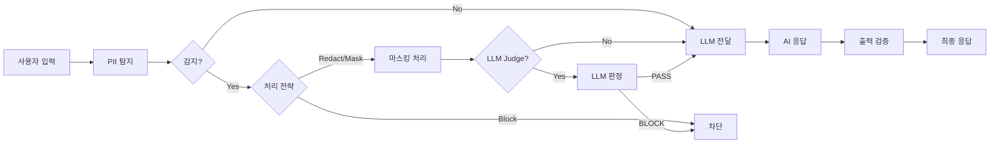
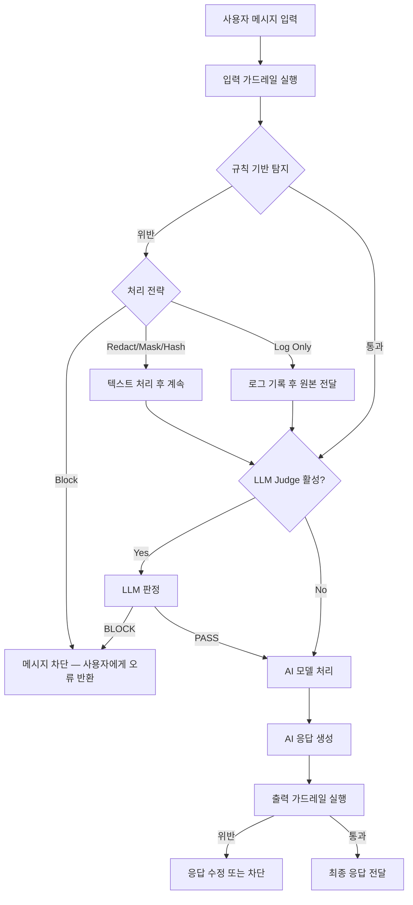
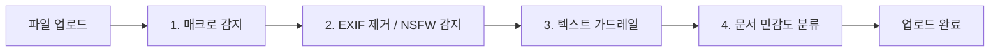

AI에게 "고객 이메일 목록을 정리해줘"라고 요청했을 때, 개인정보가 그대로 노출되거나 외부로 유출될 위험이 있습니다. 가드레일은 AI 대화의 **입력과 출력을 자동으로 검증**하여 이런 위험을 방지합니다.

### 예시

> "고객 문의 이메일은 hong@company.com이고, 카드번호는 1234-5678-9012-3456입니다"

| 상태 | 동작 | 결과 |
|------|------|------|
| 가드레일 없음 | AI가 그대로 처리 | 개인정보가 응답에 포함될 수 있음 |
| 가드레일 적용 (마스킹) | 민감 정보 자동 마스킹 | `h***@***.com`, `****-****-****-3456`으로 처리 |



---

## 가드레일이란?

가드레일은 규칙 기반 탐지와 LLM 기반 판정을 결합하여 대화의 안전성을 보장합니다.

{/* SCREENSHOT: guardrails-detail
     화면: 가드레일 편집 화면
     영역: 전체 편집 화면 (PII 토글, 처리 전략, 커스텀 패턴, 금지 단어)
     상태: PII 몇 개 선택 + 처리 전략 선택된 상태
     하이라이트: 없음 */}
<Frame caption="가드레일은 규칙 기반 탐지와 LLM 판정을 결합하여 AI 대화의 안전성을 보장합니다">
  
</Frame>

### 주요 기능

| 기능 | 설명 |
|------|------|
| **PII 탐지** | 이메일, 신용카드, IP 주소, MAC 주소, URL, API 키 등 개인정보 감지 |
| **커스텀 패턴** | 정규식으로 사용자 정의 패턴 탐지 (사번, 문서번호 등) |
| **금지 단어** | 특정 단어/문구 포함 시 필터링 |
| **LLM 기반 판정** | AI를 활용한 의미 기반 콘텐츠 검증 (LLM-as-a-Judge) |

### 활용 사례

- **개인정보 보호**: 고객 이메일, 전화번호, 신용카드 정보가 AI에 노출되지 않도록 방지
- **보안 강화**: API 키, 비밀번호, 인증 토큰 등 민감한 자격 증명 탐지
- **콘텐츠 필터링**: 부적절한 표현이나 금지된 주제 차단
- **규정 준수**: GDPR, PIPA 등 산업별 규정에 따른 데이터 처리

---

## 가드레일 목록

**워크스페이스 > 가드레일**에서 모든 가드레일을 확인할 수 있습니다.

{/* SCREENSHOT: guardrails-list
     화면: 워크스페이스 > 가드레일 목록
     영역: 전체 목록 (가드레일 카드들)
     상태: 2~3개 이상 있는 상태 (LLM 배지 포함 항목 있으면 좋음)
     하이라이트: 없음 */}
<Frame caption="워크스페이스 > 가드레일에서 생성된 가드레일 목록을 확인합니다">
  
</Frame>

| 요소 | 설명 |
|------|------|
| **이름** | 가드레일 식별 이름 |
| **설명** | 가드레일 용도 설명 |
| **LLM 배지** | LLM 기반 탐지 활성화 여부 표시 |
| **작성자** | 가드레일을 생성한 사용자 |
| **수정일** | 마지막 수정 시점 |

---

## 가드레일 생성

<Steps>
  <Step title="기본 정보 입력">
    **워크스페이스 > 가드레일**에서 우측 상단의 **+** 버튼을 클릭합니다.

    {/* SCREENSHOT: guardrails-create
         화면: 가드레일 생성 폼
         영역: 이름, 설명, 공개 범위 필드
         상태: 빈 폼 상태
         하이라이트: 없음 */}
    <Frame caption="이름과 설명을 입력하고 접근 권한을 설정합니다">
      
    </Frame>

    | 필드 | 설명 | 예시 |
    |------|------|------|
    | **이름** | 가드레일 이름 | "고객정보 보호" |
    | **설명** | 용도 설명 | "고객 개인정보 유출 방지" |
    | **공개 범위** | 접근 권한 설정 | 비공개 / 팀 공유 |

    저장하면 가드레일 편집 화면으로 이동합니다.
  </Step>

  <Step title="PII 탐지 유형 선택">
    편집 화면에서 미리 정의된 개인정보 유형을 선택합니다.

    | PII 유형 | 설명 | 예시 |
    |----------|------|------|
    | **이메일** | 이메일 주소 탐지 | `user@example.com` |
    | **신용카드** | 신용카드 번호 (Luhn 검증 포함) | `1234-5678-9012-3456` |
    | **IP 주소** | IPv4 주소 탐지 | `192.168.1.1` |
    | **MAC 주소** | MAC 주소 탐지 | `00:1A:2B:3C:4D:5E` |
    | **URL** | 웹 주소 탐지 | `https://example.com` |
    | **API 키** | API 키 패턴 탐지 | `sk-xxxxxxxx` |
  </Step>

  <Step title="처리 전략 설정">
    민감한 정보가 탐지되었을 때 처리 방식을 선택합니다.

    | 전략 | 설명 | 결과 예시 |
    |------|------|----------|
    | **차단 (Block)** | 메시지 전체 차단 | "민감한 정보가 감지되어 처리할 수 없습니다" |
    | **삭제 (Redact)** | 민감 정보를 라벨로 대체 | "연락처: `[REDACTED_EMAIL]`" |
    | **마스킹 (Mask)** | 일부 문자만 표시 | "`j***@***.com`", "`****-****-****-1234`" |
    | **해시 (Hash)** | 해시값으로 변환 | "연락처: `<email_hash:a1b2c3d4e5f6>`" |
    | **로그만 기록 (Log Only)** | 차단 없이 로그만 기록 | 원본 그대로 전달 |

    **상황별 권장 전략:**

    | 상황 | 권장 전략 | 이유 |
    |------|----------|------|
    | 도입 초기 / 테스트 | 로그만 기록 | 오탐 패턴 파악 후 조정 |
    | 고객 대면 서비스 | 마스킹 또는 차단 | 개인정보 노출 원천 방지 |
    | 내부 분석 도구 | 해시 | 원본 없이 식별자 유지 (통계 가능) |
    | 규정 준수 필수 | 차단 | 민감 정보 처리 자체를 방지 |
    | 일반 업무 | 삭제 (Redact) | 대화 흐름 유지 + 정보 보호 |
  </Step>

  <Step title="커스텀 패턴 추가 (선택)">
    정규식으로 사용자 정의 패턴을 추가합니다.

    | 이름 | 패턴 | 용도 |
    |------|------|------|
    | 사번 | `EMP-\d{6}` | 사원번호 탐지 |
    | 내부 문서번호 | `DOC-[A-Z]{2}-\d{4}` | 문서번호 탐지 |
    | 프로젝트 코드 | `PRJ-\d{4}` | 프로젝트 코드 탐지 |
  </Step>

  <Step title="금지 단어 등록 (선택)">
    특정 단어나 문구가 포함된 메시지를 필터링합니다.
    예: 경쟁사 이름, 비밀 프로젝트명, 내부 코드명 등을 등록합니다.
  </Step>

  <Step title="적용 범위 설정">
    가드레일이 적용되는 시점을 선택합니다.

    | 옵션 | 설명 |
    |------|------|
    | **입력 검증** | 사용자 메시지에 적용 |
    | **출력 검증** | AI 응답에 적용 |

    <Note>
      보안 중심: 입력 + 출력 모두 검증 권장. 성능 중심: 입력만 검증 (응답 지연 최소화).
    </Note>
  </Step>

  <Step title="저장">
    **저장** 버튼을 클릭하여 설정을 저장합니다.
  </Step>
</Steps>

---

## 가드레일이 실행되는 흐름

에이전트에 가드레일을 연결하면, 대화 시 다음 순서로 자동 실행됩니다.



### 알아두면 좋은 내부 동작

<AccordionGroup>
  <Accordion title="LLM Judge의 안전 우선 원칙" icon="shield-check">
    LLM Judge가 판정에 실패하거나 응답이 불명확하면 **기본적으로 PASS 처리**됩니다. 과도한 차단으로 정상 대화가 방해받는 것을 방지하기 위한 설계입니다.
  </Accordion>

  <Accordion title="출력 가드레일의 동작 방식" icon="arrow-right-from-bracket">
    AI 응답이 스트리밍으로 완료된 **후에** 전체 응답을 재검사합니다. 위반이 감지되면 프론트엔드의 메시지가 처리된 내용으로 **자동 교체**됩니다.
  </Accordion>

  <Accordion title="여러 가드레일을 적용하면?" icon="layer-group">
    에이전트에 여러 가드레일을 연결하면 **모든 가드레일을 순차적으로 통과**해야 합니다. 하나라도 Block 처리하면 메시지가 차단됩니다.
  </Accordion>

  <Accordion title="도구 실행 결과는 스캔하나요?" icon="wrench">
    아니요. SQL 쿼리 결과, 지식기반 검색 결과 등 **도구 실행 결과는 가드레일 스캔 대상에서 제외**됩니다. 내부 데이터의 IP 주소나 숫자 패턴이 오탐되는 것을 방지하기 위한 설계입니다.
  </Accordion>
</AccordionGroup>

---

## LLM 기반 탐지

규칙으로 감지하기 어려운 복잡한 패턴을 AI가 판단합니다. **LLM-as-a-Judge** 방식으로, 별도의 LLM 모델이 메시지의 적합성을 판정합니다.

### 설정 항목

| 항목 | 설명 |
|------|------|
| **활성화** | LLM 기반 탐지 사용 여부 토글 |
| **모델** | 판정에 사용할 LLM 모델 선택 |
| **프롬프트** | 판단 기준을 정의하는 프롬프트 |
| **허용 예시** | PASS로 판정되어야 하는 메시지 예시 |
| **차단 예시** | BLOCK으로 판정되어야 하는 메시지 예시 |
| **입력 적용** | 사용자 입력에 LLM Judge 적용 여부 |
| **출력 적용** | AI 응답에 LLM Judge 적용 여부 |

### 프롬프트 작성 예시

```markdown
당신은 콘텐츠 검토 담당자입니다. 다음 메시지가 기업 보안 정책에 적합한지 판단하세요.

## 차단해야 하는 경우
- 기밀 정보 요청 (재무 데이터, 인사 정보 등)
- 시스템 해킹이나 보안 우회 방법 질문
- 불법적이거나 비윤리적인 행동 요청

## 허용하는 경우
- 일반적인 업무 질문
- 공개된 정보에 대한 문의
- 제품/서비스 관련 질문

메시지가 적합하면 "PASS", 부적합하면 "BLOCK"을 반환하세요.
```

<Warning>
  LLM Judge는 추가 LLM 호출이 발생하므로 응답 시간이 증가합니다. 성능이 중요한 경우 규칙 기반 탐지만 사용하거나, 빠른 모델을 Judge로 선택하세요.
</Warning>

---

## 가드레일 테스트

가드레일 설정 화면에서 실제 텍스트로 바로 테스트할 수 있습니다.

{/* SCREENSHOT: guardrails-test
     화면: 가드레일 편집 화면 > 테스트 영역
     영역: 텍스트 입력 + 테스트 버튼 + 결과 (초록/빨간 배경)
     상태: 테스트 결과가 표시된 상태 (PII 탐지 결과 + 처리된 텍스트)
     하이라이트: 없음 */}
<Frame caption="테스트 텍스트를 입력하면 탐지 결과와 처리된 텍스트를 바로 확인할 수 있습니다">
  
</Frame>

1. 테스트할 텍스트를 입력합니다
2. **테스트** 버튼을 클릭합니다
3. 결과를 확인합니다: 탐지된 항목, 처리된 텍스트, 차단 여부

| 입력 | 전략 | 결과 |
|------|------|------|
| "제 이메일은 test@example.com입니다" | 삭제 | "제 이메일은 `[REDACTED_EMAIL]`입니다" |
| "카드번호: 1234-5678-9012-3456" | 마스킹 | "카드번호: `****-****-****-3456`" |
| "API 키: sk-abc123def456" | 해시 | "API 키: `a1b2c3d4...`" |
| "경쟁사X 내부 자료 분석해줘" | 차단 | "민감한 정보가 감지되어 처리할 수 없습니다" |

---

## 가드레일 적용 방법

가드레일은 **에이전트 레벨**과 **그룹 레벨** 두 경로로 적용할 수 있습니다. 두 경로 모두 적용된 경우 모든 가드레일이 병합되어 순차적으로 실행됩니다.

### 에이전트에 가드레일 연결

<Steps>
  <Step title="에이전트 편집 화면 열기">
    **워크스페이스 > 에이전트**에서 대상 에이전트의 편집 화면을 엽니다.
  </Step>
  <Step title="가드레일 선택">
    **가드레일** 섹션에서 적용할 가드레일을 선택합니다.
    하나의 에이전트에 여러 가드레일을 적용할 수 있으며, 모든 가드레일을 순차적으로 통과해야 메시지가 처리됩니다.

  </Step>
  <Step title="저장">
    에이전트 설정을 저장합니다. 이후 해당 에이전트와의 모든 대화에 가드레일이 적용됩니다.
  </Step>
</Steps>

### 그룹에 가드레일 연결

<Info>
  **신규 기능** — 그룹 단위로 가드레일을 설정하면, 해당 그룹 소속 사용자의 **모든 대화**에 가드레일이 자동 적용됩니다. 에이전트에 가드레일이 없어도 적용됩니다.
</Info>

**관리자 > 사용자 > 그룹** 탭에서 그룹 편집 모달을 열고, **Chat Guardrail** 항목에서 가드레일을 선택합니다.

{/* 📸 SCREENSHOT NEEDED: group-guardrail-select
     화면: 관리자 > 사용자 > 그룹 > 편집 모달 > General 탭
     영역: Chat Guardrail 선택 드롭다운
     상태: 가드레일 목록이 표시된 상태
     하이라이트: Chat Guardrail 영역 */}

| 항목 | 설명 |
|------|------|
| **적용 대상** | 그룹에 속한 모든 사용자 |
| **적용 범위** | 해당 사용자의 모든 대화 (에이전트 무관) |
| **가드레일 수** | 그룹당 1개 |

### 조직 단위에 가드레일 연결

**관리자 > 조직** 화면에서 조직 단위(OU)에 가드레일을 할당할 수 있습니다. 해당 OU에 속한 사용자(IdP 동기화로 자동 결정)에게 가드레일이 자동 적용됩니다.

| 항목 | 설명 |
|------|------|
| **적용 대상** | OU에 속한 모든 사용자 (IdP 동기화 결과 기준) |
| **적용 범위** | 그룹 가드레일과 동일 — 해당 사용자의 모든 대화 |
| **권한보기 모달** | 해당 OU에 할당된 가드레일이 사용자의 [권한보기]에 표시됨 |

<Tip>
  부서 단위로 다른 안전 정책이 필요할 때 유용합니다 — 예: HR 부서에는 PII 강화 가드레일, 개발 부서에는 코드 노출 방지 가드레일을 OU 기준으로 자동 부여.
</Tip>

### 가드레일 적용 우선순위

사용자가 대화할 때 아래 4가지 경로의 가드레일이 **모두 병합**되어 적용됩니다.

```
1. 에이전트 레벨   — 에이전트에 직접 연결된 가드레일
2. 그룹 레벨       — 사용자가 속한 그룹의 가드레일
3. 조직 단위 레벨   — 사용자가 속한 OU의 가드레일
4. 전역 레벨       — 관리자 설정의 전역 가드레일
```

<Note>
  동일한 가드레일이 여러 경로에서 지정되어도 **중복 실행되지 않습니다** (자동 dedup). 그룹/OU에서 선택한 가드레일은 전역 가드레일 선택 목록에서 제거되어 중복 설정을 방지합니다.
</Note>

<Warning>
  **LLM 기반 가드레일의 탐지 모델 선택지에는 에이전트와 플로우가 포함되지 않습니다** — 가드레일은 일반 LLM 모델만 사용 가능. 에이전트로 가드레일 탐지를 만들려면 별도의 가드레일 패턴(키워드/정규식/LLM 프롬프트)으로 구현하세요.
</Warning>

---

## 파일 업로드 가드레일

업로드되는 파일에 대한 보안 검사 기능입니다. 채팅 가드레일과는 **별도로 동작**하며, 파일이 업로드될 때 자동으로 4단계 검사를 수행합니다.

**관리자 > 설정 > File Guardrails** 탭에서 구성합니다.



| 단계 | 기능 | 대상 파일 | 위반 시 |
|:----:|------|----------|---------|
| 1 | **매크로 감지** | .doc, .docm, .xls, .xlsm, .ppt, .pptm | 차단 또는 경고 |
| 2 | **EXIF 메타데이터 제거** | .jpg, .jpeg, .tiff, .webp | 자동 제거 (차단 아님) |
| 2 | **NSFW 이미지 감지** | 모든 이미지 | Vision LLM 판정 후 차단 |
| 3 | **텍스트 가드레일** | 문서 전체 | 지정한 가드레일의 규칙 적용 (항상 Block 전략) |
| 4 | **문서 민감도 분류** | 문서 전체 | 분류 결과에 따라 허용/경고/차단 |

### 문서 민감도 분류

LLM이 문서 내용을 분석하여 민감도를 자동 분류합니다. 기본 분류 카테고리:

| 분류 | 기본 동작 | 설명 |
|------|:--------:|------|
| **PUBLIC** | 허용 | 공개 가능한 문서 |
| **INTERNAL** | 허용 | 사내용 문서 |
| **CONFIDENTIAL** | 경고 (Flag) | 기밀 문서 — 업로드 허용하되 로그 기록 |
| **RESTRICTED** | 차단 (Block) | 극비 문서 — 업로드 차단 |

<Note>
  대용량 문서는 앞/중간/뒤 부분을 샘플링(최대 8,000자)하여 LLM에 전달합니다. 문서 전체를 분석하지 않으므로, 핵심 민감 정보가 문서 특정 부분에만 있으면 분류가 부정확할 수 있습니다.
</Note>

---

## 모니터링 연동

### 트레이싱 자동 기록

가드레일이 민감 정보를 탐지하면 해당 이벤트가 **메시지 트레이스**에 자동으로 기록됩니다.

| 기록 항목 | 설명 |
|----------|------|
| **Run 타입** | `guardrail` |
| **Run 이름** | `guardrail:가드레일이름` |
| **Inputs** | 탐지 유형, 원본 내용 (일부) |
| **Outputs** | 처리 전략, 탐지 상세, 가드레일 이름 |

### 가드레일 로그

**관리자 > 모니터링 > 가드레일 로그**에서 모든 탐지 이벤트를 전용 로그로 조회할 수 있습니다.

| 필터 | 설명 |
|------|------|
| **기간** | 1시간 ~ 30일, 사용자 지정 |
| **처리 전략** | 차단, 삭제, 마스킹, 해시 |
| **탐지 유형** | PII, 금지 단어, LLM Judge |
| **사용자** | 특정 사용자 필터 |

로그 항목을 클릭하면 상세 정보(원본 내용, 처리 후 내용, 탐지 시각 등)를 확인할 수 있으며, **트레이스** 버튼으로 해당 메시지의 전체 처리 맥락을 볼 수 있습니다.

<Note>
  가드레일 로그에 대한 상세 내용은 [가드레일 로그](/ko/monitoring/guardrail-logs) 문서를 참고하세요.
</Note>

---

## 모범 사례

<Tabs>
  <Tab title="단계적 적용">
    1. **로그만 기록**으로 시작하여 탐지 현황 파악
    2. 오탐(false positive) 패턴 확인 및 조정
    3. **삭제(Redact)** 전략으로 전환
    4. 안정화 후 필요한 항목에 **차단(Block)** 적용
  </Tab>
  <Tab title="역할별 가드레일">
    | 역할 | 권장 설정 |
    |------|----------|
    | 고객 지원 봇 | PII 전체 + 마스킹 |
    | 내부 분석 도구 | API 키만 + 해시 |
    | HR 어시스턴트 | PII 전체 + LLM Judge + 차단 |
    | 일반 업무 봇 | 기본 PII + 삭제 |
  </Tab>
  <Tab title="정기 검토">
    - 새로운 민감 정보 패턴 추가
    - 오탐(false positive) 패턴 제외 또는 정규식 범위 축소
    - LLM Judge 허용/차단 예시 업데이트
    - 가드레일 로그 기반 정책 개선
  </Tab>
</Tabs>

---

## 문제 해결

<AccordionGroup>
  <Accordion title="오탐(False Positive)이 많은 경우" icon="triangle-exclamation">
    1. 커스텀 패턴의 정규식 범위를 축소합니다
    2. 금지 단어 목록을 정제합니다 (대소문자 무시 완전 일치로 동작)
    3. LLM Judge에 **허용 케이스 예시**를 추가합니다
    4. 가드레일 로그에서 오탐 패턴을 확인하고 규칙을 조정합니다
  </Accordion>

  <Accordion title="탐지 누락이 있는 경우" icon="triangle-exclamation">
    1. 누락된 PII 유형을 추가합니다
    2. 커스텀 패턴으로 새 정규식을 등록합니다
    3. LLM Judge를 활성화하고 **차단 예시**를 추가합니다
    4. 규칙으로 잡기 어려운 의미 기반 패턴은 LLM Judge 프롬프트에 명시합니다
  </Accordion>

  <Accordion title="응답이 느린 경우" icon="triangle-exclamation">
    1. LLM Judge를 비활성화하고 규칙 기반만 사용합니다 (규칙 기반은 거의 지연 없음)
    2. 출력 검증을 비활성화합니다 (입력만 검증)
    3. 더 빠른 모델을 Judge 모델로 선택합니다
  </Accordion>

  <Accordion title="가드레일을 삭제할 수 없는 경우" icon="triangle-exclamation">
    에이전트에 연결된 가드레일은 삭제할 수 없습니다. 먼저 해당 가드레일을 사용하는 에이전트에서 연결을 해제한 후 삭제하세요.
  </Accordion>
</AccordionGroup>

---

## 다음 단계

<Columns cols={3}>
  <Card title="에이전트에 가드레일 적용" icon="robot" href="/ko/workspace/agents">
    생성한 가드레일을 에이전트에 연결합니다
  </Card>
  <Card title="가드레일 로그" icon="shield-check" href="/ko/monitoring/guardrail-logs">
    탐지 이벤트 로그를 조회하고 분석합니다
  </Card>
  <Card title="트레이싱" icon="chart-line" href="/ko/monitoring/tracing">
    가드레일 실행 내역을 전체 대화 맥락에서 확인합니다
  </Card>
</Columns>
