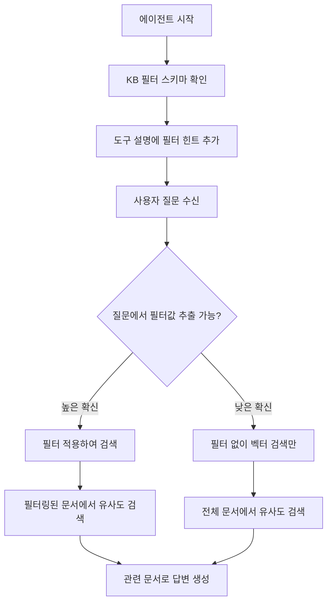

일반적인 RAG 검색은 **질문 → 벡터 유사도 검색**만 수행합니다.
동적 필터를 설정하면 **메타데이터로 먼저 범위를 좁힌 뒤** 벡터 검색을 수행하여 정확도를 높입니다.

### 예시

> 질문: "재무팀의 2024년 보고서에서 매출 추이 알려줘"

| 방식 | 동작 | 결과 |
|------|------|------|
| 필터 없이 | 전체 문서에서 벡터 유사도 검색 | 다른 팀 문서가 섞일 수 있음 |
| 필터 있으면 | `부서=재무팀, 연도=2024`로 먼저 좁히고 벡터 검색 | 정확한 문서만 검색 |

---

## 필터 설정 방법

<Steps titleSize="h3">
  <Step title="필터 필드 정의">
    지식기반 편집 화면에서 **필터 추가** 버튼을 클릭하여 필터 필드를 정의합니다.

    | 항목 | 설명 | 예시 |
    |------|------|------|
    | **이름 (Label)** | 사용자가 보는 필터 이름 | "부서", "연도" |
    | **타입** | 데이터 유형 | Enum, Collection, Number, Date |
    | **옵션** | 선택 가능한 값 목록 (Enum/Collection만) | "재무팀, 인사팀, 개발팀" |
    | **설명 (Description)** | AI가 필터 용도를 이해하기 위한 설명 | "문서가 속한 부서를 나타냅니다" |
    | **추출 프롬프트** | AI 자동 추출 시 사용할 지시문 | "파일 제목에서 부서명을 추출하세요" |
    | **필수 여부** | 체크 시 미입력 파일에 주황색 경고 표시 | 필수 체크 |
  </Step>

  <Step title="추출 모드 선택">
    필터 스키마 상단의 **Manual / AI** 토글을 선택합니다.

    | | Manual 모드 | AI 모드 |
    |---|---|---|
    | **입력 방식** | 사용자가 파일마다 직접 입력 | LLM이 파일 내용에서 자동 추출 |
    | **정확도** | 100% (사람이 입력) | LLM 성능에 의존 |
    | **소요 시간** | 파일 수에 비례 | 버튼 한 번으로 전체 추출 |
    | **비용** | 없음 | LLM 호출 비용 발생 |
    | **권장 상황** | 파일 수 적거나 정확도 중요 | 파일 수 많고 빠른 분류 필요 |

    <Tip>
      AI 모드에서도 추출 결과를 수동으로 수정할 수 있습니다. 먼저 AI로 일괄 추출 후 오류만 수정하는 방식이 가장 효율적입니다.
    </Tip>
  </Step>

  <Step title="저장">
    **Save** 버튼을 클릭하여 필터 스키마를 저장합니다.
    AI 모드인 경우, 이후 파일 업로드 시 자동으로 메타데이터가 추출됩니다.
  </Step>
</Steps>

---

## 필터 타입 상세

| 타입 | 슬롯 | 최대 개수 | 검색 방식 | 사용 예시 |
|------|------|:--------:|----------|----------|
| **선택값 (Enum)** | f_str_1 ~ f_str_4 | 4개 | 정확히 일치 | 부서, 카테고리, 상태 |
| **컬렉션 (Collection)** | f_col_1 ~ f_col_4 | 4개 | 다중 값 중 하나라도 일치 | 태그, 관련 팀 |
| **숫자 (Number)** | f_int_1 ~ f_int_2 | 2개 | 정확히 일치 | 연도, 버전 |
| **날짜 (Date)** | f_date_1 ~ f_date_2 | 2개 | 범위 검색 | 작성일, 만료일 |

### 날짜 필터 입력 형식

날짜 필터는 다양한 정밀도로 입력할 수 있습니다:

| 입력 | 의미 | 검색 범위 |
|------|------|----------|
| `2024` | 2024년 전체 | 2024-01-01 ~ 2024-12-31 |
| `2024-03` | 2024년 3월 | 2024-03-01 ~ 2024-03-31 |
| `2024-03-15` | 특정 날짜 | 해당 일자만 |

---

## 메타데이터 상태 표시

파일 목록에서 각 파일의 메타데이터 설정 상태가 **색상 dot**으로 표시됩니다.

| 색상 | 상태 | 의미 |
|:----:|------|------|
| 🟢 **초록** | Complete | 모든 필터 필드에 값이 설정됨 |
| 🟡 **노랑** | Partial | 일부 필드만 설정됨 |
| 🟠 **주황** | Missing Required | 필수 필드가 비어 있음 |
| ⚪ **회색 테두리** | Empty | 메타데이터 미설정 |
| 🟣 **보라 스피너** | Extracting | AI 추출 진행 중 |

<Warning>
  **주황색(Missing Required)** 상태의 파일이 있으면 필터 검색 시 해당 파일이 누락될 수 있습니다. 필수 필드는 반드시 채워주세요.
</Warning>

---

## AI 자동 추출

### 추출 프롬프트 작성

추출 프롬프트는 AI가 파일 내용에서 메타데이터 값을 추출할 때 사용하는 지시문입니다.

**좋은 추출 프롬프트 예시:**

| 필터 | 추출 프롬프트 |
|------|-------------|
| 부서 | "문서 내용이나 파일 제목에서 소속 부서를 추출하세요. 옵션: 재무팀, 인사팀, 개발팀" |
| 연도 | "문서에서 작성 연도를 추출하세요. 파일 제목에 연도가 있으면 그것을 사용하세요" |
| 문서 유형 | "이 문서의 유형을 판단하세요. 옵션: 규정, 가이드, 보고서, 양식" |

<Note>
  AI는 파일 내용의 **앞부분 약 4,000자**를 분석합니다. 핵심 정보가 문서 앞부분에 있을수록 추출 정확도가 높아집니다.
</Note>

### 추출 실행 방법

| 방법 | 설명 | 사용 시기 |
|------|------|----------|
| **자동 추출** | 파일 업로드 시 자동 실행 | AI 모드 활성화 상태에서 새 파일 추가 |
| **단일 파일 추출** | 파일 메타데이터 편집 > 추출 버튼 | 특정 파일만 재추출 |
| **전체 일괄 추출** | 지식기반 상단의 전체 추출 버튼 | 필터 스키마 변경 후 전체 재적용 |

---

## 에이전트가 필터를 사용하는 흐름

동적 필터가 설정된 지식기반을 에이전트에 연결하면, 다음 흐름으로 자동 필터링이 이루어집니다.



### 각 단계 상세

<Steps titleSize="h4">
  <Step title="필터 정보를 AI에게 알려줌">
    에이전트가 시작될 때, 지식기반의 필터 스키마를 읽어서 도구 설명(Tool Description)에 **필터 힌트를 자동으로 추가**합니다.

    예를 들어 "부서" 필터가 있으면, AI는 "이 지식기반에서 `부서` 필드로 필터링할 수 있다"는 것을 인지합니다.
  </Step>

  <Step title="사용자 질문에서 필터값 추출">
    사용자가 질문하면, AI가 질문 내용에서 필터에 해당하는 값을 **자동으로 추출**합니다.

    ```
    질문: "재무팀의 2024년 보고서에서 매출 추이를 알려줘"

    AI 추출 결과:
      부서 → "재무팀" (높은 확신)
      연도 → 2024 (높은 확신)
    ```

    <Note>
      AI는 **높은 확신이 있을 때만** 필터를 적용합니다. 질문에서 필터값을 특정할 수 없으면 필터 없이 일반 벡터 검색을 수행합니다.
    </Note>
  </Step>

  <Step title="검색 필터 생성">
    추출된 필터값이 내부적으로 검색 엔진이 이해할 수 있는 필터 쿼리로 변환됩니다.

    ```
    사용자 입력: 부서=재무팀, 연도=2024
         ↓
    내부 변환: f_str_1='재무팀' AND f_int_1=2024
         ↓
    검색 엔진 쿼리로 전달
    ```
  </Step>

  <Step title="필터링된 검색 수행">
    검색 엔진이 **필터 조건에 맞는 문서만** 대상으로 벡터 유사도 검색을 수행합니다. 다른 팀이나 다른 연도의 문서는 검색 대상에서 제외됩니다.
  </Step>

  <Step title="답변 생성">
    필터링된 관련 문서를 AI에게 전달하여 정확한 답변을 생성합니다.
  </Step>
</Steps>

---

## 도구 설명(Tool Description)과 필터의 관계

도구 설명은 AI 에이전트가 지식기반을 **언제 사용할지, 어떤 필터를 적용할지** 판단하는 핵심 정보입니다.

| | 도구 설명 없음 | 도구 설명 있음 |
|---|---|---|
| **KB 선택** | 지식기반 일반 설명으로 판단 (부정확할 수 있음) | 명확한 용도 안내로 정확한 선택 |
| **필터 활용** | 필터 존재를 모를 수 있음 | 어떤 상황에서 어떤 필터를 쓸지 인지 |

**AI 자동 생성 권장**: 도구 설명 입력란 옆의 자동 생성 버튼을 클릭하면, 지식기반 이름 + 설명 + 파일 목록 + 필터 정보를 종합하여 AI가 도구 설명을 자동 작성합니다.

<Tip>
  필터 스키마를 변경한 뒤에는 **도구 설명을 다시 자동 생성**하세요. 새로운 필터 정보가 도구 설명에 반영되어야 AI가 정확하게 필터를 활용할 수 있습니다.
</Tip>

---

## 주의사항

<AccordionGroup>
  <Accordion title="필수 필드가 비어 있는 파일은 검색에서 누락될 수 있나요?" icon="triangle-exclamation">
    네. 필수(Required)로 설정한 필터 필드에 값이 없는 파일은 해당 필터 조건으로 검색할 때 결과에 포함되지 않습니다. 주황색 dot이 표시된 파일을 확인하고 값을 채워주세요.
  </Accordion>

  <Accordion title="AI 추출이 틀릴 수 있나요?" icon="triangle-exclamation">
    AI 추출은 문서 앞부분 약 4,000자를 분석하므로, 핵심 정보가 뒷부분에 있으면 추출이 부정확할 수 있습니다. 추출 결과를 확인하고 필요하면 수동으로 수정하세요.
  </Accordion>

  <Accordion title="필터 스키마를 변경하면 기존 메타데이터는 어떻게 되나요?" icon="triangle-exclamation">
    필터 필드를 추가하면 기존 파일의 해당 필드는 비어 있습니다. AI 모드에서 전체 일괄 추출을 실행하여 새 필드의 값을 채울 수 있습니다. 필드를 삭제하면 해당 메타데이터도 함께 제거됩니다.
  </Accordion>

  <Accordion title="필터 슬롯 수 제한은 왜 있나요?" icon="circle-question">
    검색 엔진의 인덱스 구조 최적화를 위해 타입별 슬롯 수가 제한됩니다:
    - 선택값(Enum): 최대 4개
    - 컬렉션(Collection): 최대 4개
    - 숫자(Number): 최대 2개
    - 날짜(Date): 최대 2개

    대부분의 문서 분류에 충분한 수입니다. 더 세밀한 분류가 필요하면 지식기반을 분리하는 것을 고려하세요.
  </Accordion>
</AccordionGroup>
