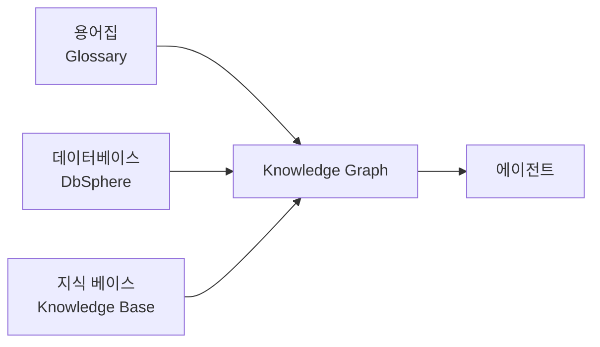
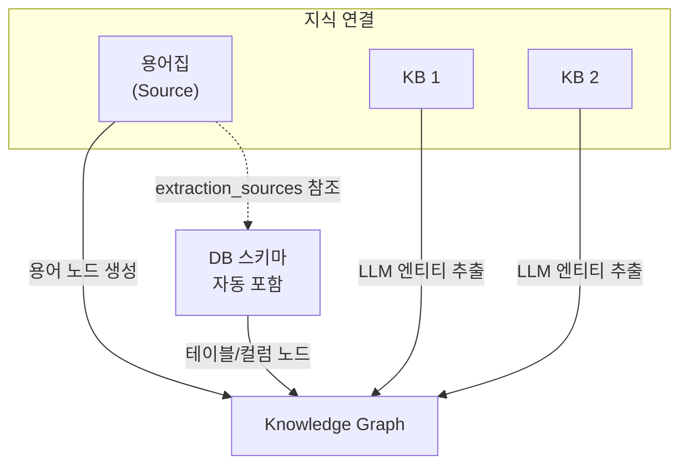
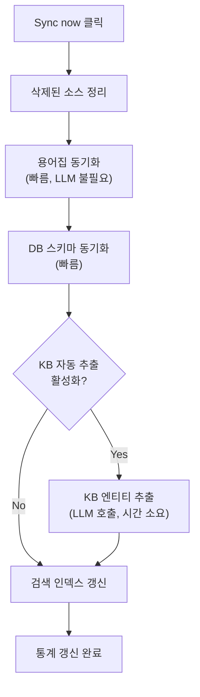

## 개요

지식 그래프(Knowledge Graph, KG)는 **용어집·데이터베이스·지식 베이스**를 하나의 그래프로 연결한 통합 지식 구조입니다.

AI 에이전트가 비즈니스 용어가 어떤 테이블 컬럼에 대응되는지, 어떤 문서 맥락과 관련 있는지를 자동으로 이해할 수 있게 해줍니다.

### KG가 해결하는 문제

용어집·데이터베이스·지식 베이스를 각각 따로 쓰면 에이전트가 **의미를 연결하지 못합니다.**

| 구성만 사용했을 때 | 한계 |
|:------------------|:------|
| 용어집만 | "VIP 고객"이 뭔지는 알지만 어느 테이블에 있는지 모름 |
| 데이터베이스만 | 테이블 구조는 알지만 "VIP"가 `tier='VIP'` 필터임을 모름 |
| 지식 베이스만 | 문서 내용은 찾지만 실제 데이터로 연결 못 함 |
| **KG 사용** | **용어 → 컬럼/필터 → 관련 문서까지 한 번에 연결** |

### 활용 예시

```
사용자: 강남지점 VIP 고객이 가장 많이 산 제품 TOP 3는?

에이전트 동작:
  1. kg_resolve_term("VIP 고객")
     → users.tier = 'VIP' 매핑 발견
  2. kg_resolve_term("강남지점")
     → stores.region = '강남' 매핑 발견
  3. kg_find_related_tables("users")
     → orders, products 테이블 연결 발견
  4. SQL 자동 생성 후 실행

응답: 강남지점 VIP 고객 매출 TOP 3입니다:
  1. 무선 이어폰 Pro — 1,523건
  2. 스마트워치 X — 1,287건
  3. 노이즈캔슬링 헤드폰 — 892건
```

### 세 가지 정보원



| 정보원 | 담는 내용 | KG에서의 역할 |
|:-------|:----------|:-------------|
| **용어집** | 비즈니스 용어 정의 (VIP, MRR, 강남지점 등) | Term / Concept 노드 + 동의어·카테고리 엣지 |
| **데이터베이스** | 테이블/컬럼 스키마 + FK 관계 | Table / Column 노드 + 구조 엣지 |
| **지식 베이스** | 규정, 전략, 매뉴얼 등 문서 | Doc Entity 노드 + LLM 추출 관계 엣지 |

---

## 지식 그래프 생성

<Steps>
  <Step title="새 KG 만들기">
    **워크스페이스 → 지식 그래프** 목록에서 **"+ New Knowledge Graph"** 클릭

    {/* TODO: 스크린샷 — KG 목록 페이지 */}
    
  </Step>
  <Step title="이름과 설명 입력">
    | 필드 | 설명 | 예시 |
    |:-----|:-----|:-----|
    | **이름** | KG 식별 이름 (최대 200자) | "전사 지식 그래프" |
    | **설명** | 용도 설명 | "매출/고객/상품 통합 분석용" |

    접근 제어(Access Control)로 읽기/쓰기 권한을 그룹·사용자 단위로 설정할 수 있습니다.
  </Step>
  <Step title="상세 페이지 진입">
    생성 완료 후 자동으로 KG 상세 페이지로 이동합니다. 이제 정보원을 연결할 차례입니다.
  </Step>
</Steps>

---

## KG 상세 페이지

{/* TODO: 스크린샷 — KG 상세 페이지 전체 */}


KG 상세 페이지는 **왼쪽 노드 목록**과 **오른쪽 설정/탐색 영역**으로 구성됩니다.

### 통계 카드

상단에 3개의 통계 카드가 표시됩니다.

| 항목 | 의미 |
|:-----|:-----|
| **Nodes** | 그래프 내 총 노드 수 |
| **Edges** | 그래프 내 총 엣지 수 |
| **Last synced** | 마지막 동기화 시점 |

### LLM 모델 설정

KG에서 사용할 LLM 모델을 선택합니다. 카테고리 정의 생성, KB 문서 매칭, AI 도구 설명 자동 생성 등에 사용됩니다.

<Warning>
LLM 모델을 변경한 후 반드시 **저장** 버튼을 눌러야 적용됩니다.
</Warning>

---

## 지식 연결 (Knowledge Link)

지식 연결은 KG의 핵심 구조입니다. **용어집 1개 + 지식 베이스 N개**를 하나의 링크로 묶어, 용어와 문서 간 의미를 자동으로 연결합니다.

### 연결 구조



<Tip>
용어집에 카테고리의 **추출 출처(extraction sources)**가 설정되어 있으면, 해당 DB 스키마가 지식 연결에 자동으로 포함됩니다. 별도로 DB를 추가할 필요가 없습니다.
</Tip>

### 연결 추가

<Steps>
  <Step title="지식 연결 추가 클릭">
    KG 상세 페이지의 **Knowledge Links** 섹션에서 **"Add knowledge link"** 클릭
  </Step>
  <Step title="용어집 선택">
    연결할 용어집을 선택합니다. 이미 연결된 용어집은 목록에서 제외됩니다.
  </Step>
  <Step title="DbSphere / 지식 베이스 선택">
    체크박스로 **이 지식 연결에 실제로 동기화할 소스**를 선택합니다. 자동 감지된 후보 중 일부만 선택하거나 추가로 연결할 수 있습니다.

    | 소스 | 효과 |
    |------|------|
    | **DbSphere** | 선택한 DB의 테이블·컬럼·외래키가 그래프 노드로 추출됩니다 |
    | **지식 베이스** | 선택한 KB의 문서 청크에서 LLM이 엔티티·관계를 추출합니다 |

    <Info>
      체크하지 않은 소스는 자동 감지되어도 **이번 지식 연결에 포함되지 않습니다**. 이전 버전과 달리 자동 강제 연결되지 않으므로, 필요한 소스만 명시적으로 선택해 동기화 비용·시간을 제어할 수 있습니다.
    </Info>
  </Step>
  <Step title="추출할 KB 필터 슬롯 선택 (선택)">
    KB를 선택했다면 **그 KB의 동적 필터(부서/연도/문서 유형 등) 중 어떤 슬롯을 KG 노드로 승격할지** 체크박스로 지정합니다.

    선택한 슬롯은 `DOC_ATTR` 노드와 `has_<label>` 엣지로 그래프에 추가되어, 에이전트가 검색 시 해당 속성 기반으로 필터링할 수 있습니다.

    <Tip>
      예시: KB에 "부서" 필터가 있고 이 슬롯을 KG로 승격하면, 에이전트가 "재무팀 문서 중에서 찾아줘" 같은 자연어 질의를 자동으로 부서 필터로 변환합니다.
    </Tip>
  </Step>
  <Step title="생성 후 동기화">
    생성 후 **"Sync entities"** 버튼으로 해당 링크를 동기화합니다. 선택한 DbSphere/KB만 처리되며, `kg.data.sources`도 자동 재계산됩니다.
  </Step>
</Steps>

### 연결이 만드는 노드와 엣지

<Tabs>
  <Tab title="용어집 → 노드">
    | 원본 | 생성되는 노드 | 연결 엣지 |
    |:-----|:-------------|:---------|
    | 각 용어 (entry) | `Term` 노드 | — |
    | 동의어 | — | `synonym_of` 엣지 |
    | 카테고리 | `Concept` 노드 | `broader_than` 엣지 |
    | 카테고리 → DB 컬럼 매핑 | — | `maps_to` 엣지 |

    LLM 호출 없이 구조 변환만 수행하므로 빠르게 완료됩니다.
  </Tab>
  <Tab title="데이터베이스 → 노드">
    | 원본 | 생성되는 노드 | 연결 엣지 |
    |:-----|:-------------|:---------|
    | 테이블 | `Table` 노드 | — |
    | 컬럼 | `Column` 노드 | `belongs_to` (컬럼 → 테이블) |
    | 외래 키 | — | `foreign_key` 엣지 |

    <Warning>
    DB 스키마 노드를 생성하려면 **DbSphere에서 스키마 추출을 먼저 실행**해야 합니다. 미실행 시 노드가 0개로 표시됩니다.
    </Warning>
  </Tab>
  <Tab title="지식 베이스 → 노드">
    | 원본 | 생성되는 노드 | 연결 엣지 |
    |:-----|:-------------|:---------|
    | 문서 청크 내 엔티티 | `Doc Entity` 노드 | LLM이 추출한 관계 엣지 |
    | KB 필터 값 (선택한 슬롯만) | `Doc Attr` 노드 | `has_<slot>` (문서 → 속성 노드) |

    `Doc Entity`는 LLM이 각 문서 청크를 분석해 엔티티/관계를 추출한 결과입니다. `Doc Attr`은 KB 필터 값을 그대로 그래프에 올리는 LLM 미사용 경로로, 후술하는 [KB 필터를 KG 노드로 승격](#kb-필터를-kg-노드로-승격) 섹션을 참조하세요.

    <Warning>
    `Doc Entity` 추출은 **LLM 호출 비용이 발생**합니다. 필요한 KB만 선택적으로 연결하세요. `Doc Attr`은 LLM을 호출하지 않으므로 비용이 들지 않습니다.
    </Warning>
  </Tab>
</Tabs>

### KB 필터를 KG 노드로 승격

KB에 정의된 필터 값(국가, 카테고리, 부서 등)을 그대로 그래프 노드로 올려 검색·탐색·에이전트 라우팅에 활용할 수 있습니다. **LLM을 호출하지 않으므로** 비용 없이 구조화된 메타데이터를 그래프에 통합합니다.

<Steps>
  <Step title="KG 링크 카드의 노드 필터 설정 열기">
    KG 상세 페이지에서 KB가 연결된 지식 연결 카드의 **노드 필터 설정** 모달을 엽니다.
  </Step>
  <Step title="승격할 필터 슬롯 선택">
    연결된 KB의 `filter_schema`가 KB별로 그룹핑되어 표시됩니다. 노드로 승격할 슬롯을 체크박스로 선택합니다.

    | 필터 타입 | 노드 승격 가능 | 비고 |
    |:---------|:-------------:|:-----|
    | `string`, `enum`, `collection` | ✓ | 카디널리티가 적당한 카테고리형 값에 적합 |
    | `int`, `date` | ✓ | 카디널리티 높음 — 노드 수가 폭증할 수 있어 신중히 선택 |
    | `glossary` | — | 용어집 앵커 매핑 전용 — 별도 처리 (자동 `Term` 노드 재사용) |
  </Step>
  <Step title="저장 → 다음 동기화 시 반영">
    저장하면 KG 링크의 `config.extracted_filter_slots`에 기록됩니다. 다음 동기화 실행 시 선택된 슬롯의 값들이 `Doc Attr` 노드로 만들어지고, 각 문서가 보유한 값과 `has_<slot>` 엣지로 연결됩니다.
  </Step>
</Steps>

#### 동작 원리

| 단계 | 처리 |
|------|------|
| 1. 슬롯 등록 | KG 링크 단위로 `{kb_id, slot}` 쌍을 저장. **KB 필터 스키마는 건드리지 않음** — KG를 안 쓰는 배포에서도 KB는 그대로 작동 |
| 2. 값 수집 | 선택된 슬롯의 모든 distinct 값을 KB 문서에서 수집 |
| 3. 용어집 매치 | 값이 연결된 용어집의 `Term` label과 정규화 매치되면 **기존 Term 노드를 재사용** — 그래프 파편화 방지 |
| 4. 노드 생성 | 매치되지 않은 값은 새 `Doc Attr` 노드로 생성 |
| 5. 엣지 연결 | 각 문서 → 해당 속성 노드로 `has_<slot_suffix>` 엣지 (예: `has_country`, `has_department`) |

<Note>
  엣지 이름은 슬롯 prefix(`f_str_`, `f_col_`, `f_int_`, `f_date_`, `f_glossary_`)를 제거한 슬롯 이름이 그대로 들어갑니다. 라우팅 LLM이 의미 있는 엣지명을 제안하면 그 이름을 우선 사용합니다.
</Note>

<Tip>
  `Doc Attr`은 KB 필터를 LLM 호출 없이 그래프로 가져오는 가벼운 경로입니다. 청크 단위 엔티티 추출(`Doc Entity`)이 비용 부담스러우면 우선 `Doc Attr`만으로 시작하고, 필요한 KB에만 LLM 추출을 켜는 단계적 도입을 권장합니다.
</Tip>

### 연결 상세 보기

각 지식 연결 카드를 펼치면 DB 테이블별 컬럼 매핑 현황을 확인할 수 있습니다.

- **테이블 그룹**: 연결된 DB의 테이블별로 그룹핑
- **컬럼 매핑**: 컬럼명, 데이터 타입, PK/FK 표시, 매핑된 카테고리, 용어 개수
- **매칭된 문서 수**: KB와 매칭된 문서 개수 표시

---

## 동기화

리소스를 연결한 후 **동기화**를 실행해야 노드와 엣지가 만들어집니다.

### 동기화 방식

| 방식 | 버튼 | 범위 |
|:-----|:-----|:-----|
| **전체 동기화** | 상단 **"Sync now"** | 모든 소스 일괄 재구축 |
| **링크 단위 동기화** | 각 링크의 **"Sync entities"** | 해당 링크의 용어집 + DB + KB만 |

### 전체 동기화 흐름



### 진행 상황 확인

- 동기화가 시작되면 버튼이 **"Syncing..."**으로 변경됩니다
- 완료/실패 시 실시간 알림(toast)이 표시됩니다
- 이미 실행 중인 동기화가 있으면 중복 실행이 차단됩니다

<Tip>
KB 엔티티 추출은 **증분 처리**됩니다. 이전에 처리한 청크는 건너뛰므로, 재동기화 시 새로 추가된 문서만 처리합니다.
</Tip>

### 동기화 소요 시간

| 소스 | 소요 시간 | 비용 |
|:-----|:---------|:-----|
| 용어집 | 수 초 | 없음 |
| DB 스키마 | 수 초 ~ 수 분 | 없음 |
| KB 엔티티 추출 | 수 분 ~ 수 시간 (문서량에 비례) | LLM 호출 비용 발생 |

---

## 그래프 탐색

### 그래프 시각화

KG 상세 페이지에서 **"Show graph"** 토글을 켜면 인터랙티브 그래프 뷰가 표시됩니다.

{/* TODO: 스크린샷 — 그래프 시각화 */}


#### 조작 방법

| 동작 | 방법 |
|:-----|:-----|
| 확대/축소 | 마우스 휠 또는 트랙패드 |
| 이동 | 배경 드래그 |
| 노드 선택 | 노드 클릭 → 이웃 하이라이트 + 상세 패널 표시 |
| 엣지 선택 | 엣지 클릭 → 연결 정보 패널 표시 |
| 전체 보기 | 툴바의 **Fit** 버튼 |
| 타입별 포커스 | 상단 타입 버튼(Term, Concept, Table 등) 클릭 → 해당 타입 + 1-hop 이웃만 표시 |

#### 노드 타입과 색상

| 타입 | 색상 | 의미 |
|:-----|:-----|:-----|
| **Term** | 파랑 | 용어집의 비즈니스 용어 |
| **Concept** | 보라 | 용어 상위 카테고리 |
| **Table** | 초록 | DB 테이블 |
| **Column** | 주황 | DB 컬럼 |
| **Doc Entity** | 분홍 | KB 문서에서 추출한 엔티티 |

<Info>
노드가 500개를 초과하면 **"Truncated"** 경고가 표시됩니다. 타입별 포커스를 사용해 관심 있는 영역만 확인하세요.
</Info>

#### 노드 상세 패널

노드를 클릭하면 오른쪽에 상세 패널이 나타납니다.

- **속성 테이블**: 노드의 상세 속성 (라벨, 타입, 설명 등)
- **연결 목록**: 이 노드와 연결된 이웃 노드 목록 (방향 화살표 + 엣지 타입 + 이웃 정보)
- 이웃 노드를 클릭하면 해당 노드로 이동합니다

### 노드 목록

왼쪽 패널에서 모든 노드를 리스트로 탐색할 수 있습니다.

- **검색**: 노드 라벨로 검색 (서버 사이드, 대규모 그래프에서도 빠름)
- **타입 필터**: All / Term / Concept / Table / Column / Doc Entity
- **페이징**: 20개 단위로 페이지 이동

### 시맨틱 검색

KG 상세 페이지의 **Semantic Search** 섹션에서 자연어로 노드를 검색할 수 있습니다.

- 벡터 유사도 기반으로 가장 관련 높은 노드를 점수와 함께 반환합니다
- 각 결과에 노드 타입 뱃지와 유사도 점수가 표시됩니다

<Warning>
시맨틱 검색을 사용하려면 시스템 관리자가 **검색 엔진(Search Engine)**을 설정해야 합니다. 미설정 시 경고 배너가 표시됩니다.
</Warning>

---

## 에이전트 연동

KG의 진짜 힘은 **에이전트에 연결했을 때** 나옵니다.

### KG를 에이전트에 연결

에이전트 편집 페이지의 **지식 그래프** 섹션에서 사용할 KG를 선택합니다.

{/* TODO: 스크린샷 — 에이전트 편집기 KG 섹션 */}


<Tip>
KG를 연결하면 해당 KG에 포함된 **용어집·데이터베이스·지식 베이스**가 에이전트에 자동 상속됩니다. 동일 리소스를 에이전트에 중복 추가할 필요가 없습니다.
</Tip>

### KG 도구 7종

KG를 연결한 에이전트는 아래 7개 도구를 자동으로 사용할 수 있습니다.

| 도구 | 용도 | 사용 예시 |
|:-----|:-----|:---------|
| **kg_resolve_term** | 비즈니스 용어 → DB 컬럼/필터 매핑 | "VIP 고객" → `tier='VIP'` |
| **kg_search_concepts** | 의미 기반 노드 검색 + 이웃 확장 | "매출 관련 용어 찾기" |
| **kg_neighbors** | 특정 노드의 N-hop 이웃 탐색 | 특정 테이블과 연결된 모든 용어 |
| **kg_find_related_tables** | FK로 연결된 테이블 + JOIN 힌트 | "users 테이블과 조인 가능한 테이블" |
| **kg_explore_context** | 시드 엔티티 주변 서브그래프 탐색 | 복잡한 다단계 질문의 맥락 파악 |
| **kg_fetch_data** | SQL 실행 + 실제 데이터 반환 (최대 100행) | `SELECT * FROM orders LIMIT 10` |
| **kg_fetch_document** | KG 연결 KB에서 문서 청크 검색 | "VIP 정책 관련 문서 찾기" |

<Note>
`kg_fetch_data`는 0행이 반환되면 자동으로 관련 문서 검색(fallback)을 수행합니다. 데이터와 문서를 하나의 도구로 통합 조회할 수 있습니다.
</Note>

### 도구 테스터

에이전트에 연결하기 전에 **"Try KG Tools"** 섹션에서 각 도구를 직접 실행해볼 수 있습니다.

<Steps>
  <Step title="도구 테스터 열기">
    KG 상세 페이지 하단의 **"Show"** 토글 클릭
  </Step>
  <Step title="도구 선택 및 실행">
    드롭다운에서 도구를 선택하고, 입력값을 넣은 후 **"Run"** 클릭
  </Step>
  <Step title="결과 확인">
    JSON 형태의 결과가 하단에 표시됩니다. 동기화 결과가 올바른지, 용어 매핑이 정확한지 확인하세요.
  </Step>
</Steps>

---

## 노드 관리

### 수동 큐레이션

동기화로 자동 생성된 노드 외에도, 수동으로 엣지를 추가하거나 노드를 수정할 수 있습니다.

**지원 작업:**
- 노드 라벨/속성 수정
- 노드 삭제 (관련 엣지 포함 자동 삭제)
- 노드 병합 (중복 노드를 하나로 합치기 — 엣지가 자동 이전)
- 수동 엣지 생성 (`maps_to`, `related_to`, `broader_than` 등)

### 노드 타입 요약

| 타입 | 출처 | 설명 |
|:-----|:-----|:-----|
| Term | 용어집 | 비즈니스 용어 (예: VIP, MRR) |
| Concept | 용어집 | 용어 상위 카테고리 (예: 고객등급, 매출유형) |
| Table | DB | 데이터베이스 테이블 |
| Column | DB | 테이블의 컬럼 |
| Doc Entity | KB | 문서에서 LLM이 추출한 엔티티 |

---

## 자주 묻는 질문

<AccordionGroup>
  <Accordion title="KG와 용어집의 차이는?" icon="circle-question">
    용어집은 **용어 정의**만 관리합니다. KG는 용어집을 **데이터베이스 컬럼·문서 엔티티**와 연결해 에이전트가 실제 데이터로 답할 수 있게 합니다.
  </Accordion>
  <Accordion title="KG와 DbSphere(데이터베이스)의 차이는?" icon="circle-question">
    DbSphere는 **스키마 기반 SQL 생성**에 특화됩니다. KG는 여기에 **비즈니스 용어와 문서 맥락**을 더해 "VIP 고객"처럼 스키마에 없는 표현도 이해합니다.
  </Accordion>
  <Accordion title="동기화에 시간이 너무 오래 걸려요" icon="clock">
    - **용어집/DB 동기화**: 수 초 ~ 수 분 (빠름)
    - **KB 엔티티 추출**: 문서 수에 비례하여 수 분 ~ 수 시간

    KB 추출은 증분 처리되므로, 다음 동기화 시 이미 처리한 청크는 건너뜁니다. 대형 KB는 처음 한 번만 오래 걸립니다.
  </Accordion>
  <Accordion title="동기화가 실패했어요" icon="triangle-exclamation">
    - **DB 관련 오류**: DbSphere에서 먼저 스키마 추출이 성공했는지 확인하세요
    - **KB 추출 오류**: LLM 모델 설정과 API 키가 올바른지 확인하세요
    - 이미 실행 중인 동기화가 있으면 중복 실행이 차단됩니다 — 잠시 후 재시도하세요
  </Accordion>
  <Accordion title="LLM 비용이 걱정돼요" icon="coins">
    KB **엔티티 추출**만 LLM을 호출합니다. 비용을 제어하려면:

    - 필요한 KB만 선택적으로 연결
    - 용어집과 DB만으로도 `kg_resolve_term`과 `kg_find_related_tables`는 정상 동작합니다
  </Accordion>
  <Accordion title="여러 KG를 에이전트에 연결할 수 있나요?" icon="layer-group">
    네. 여러 KG를 연결하면 모든 KG의 노드와 엣지를 **통합하여** 도구가 동작합니다. 도메인별로 KG를 분리 운영하면서 에이전트에서는 통합 조회할 수 있습니다.
  </Accordion>
</AccordionGroup>

---

## 관련 가이드

<Columns cols={3}>
  <Card title="용어집" icon="book" href="/ko/workspace/glossary">
    비즈니스 용어 정의 · 동의어 · 카테고리 관리
  </Card>
  <Card title="데이터베이스" icon="database" href="/ko/workspace/database">
    DB 연결 · 스키마 추출 · SQL 실행
  </Card>
  <Card title="에이전트" icon="robot" href="/ko/workspace/agents">
    AI 에이전트 설정 · 도구 연결 · 워크플로우
  </Card>
</Columns>
