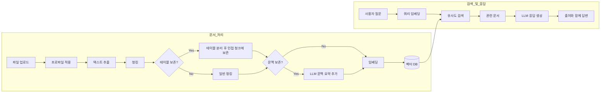
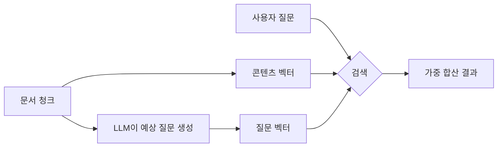

AI에게 질문했을 때 "모르겠습니다"라고 답하거나, 엉뚱한 답변을 하는 경우가 있습니다. 지식기반은 사내 문서를 AI가 직접 참조할 수 있도록 변환하여, **문서 근거 기반의 정확한 답변**을 가능하게 합니다.

### 예시

> "우리 회사 연차 규정이 어떻게 되나요?"

| 상태 | 동작 | 결과 |
|------|------|------|
| 지식기반 없음 | AI의 일반 지식으로 답변 | 부정확하거나 "모르겠습니다" |
| 지식기반 연결 | 인사규정.pdf에서 관련 내용 검색 후 답변 | 정확한 규정 + 출처 표시 |

<Info>
  지식기반별로 **문서 처리 프로파일**을 선택하여 추출 방식과 청킹 전략을 다르게 적용할 수 있습니다. 자세한 내용은 아래 [문서 처리 프로파일 선택](#문서-처리-프로파일-선택) 섹션을 참조하세요.
</Info>

{/* SCREENSHOT: knowledge-list
     화면: 워크스페이스 > 지식기반 목록
     영역: 전체 목록 (지식기반 카드들)
     상태: 2~3개 이상 있는 상태
     하이라이트: 없음 */}
<Frame caption="워크스페이스 > 지식기반에서 생성된 지식기반 목록을 확인할 수 있습니다">
  
</Frame>

---

## RAG 파이프라인

문서가 업로드되면 다음 파이프라인을 거쳐 검색 가능한 상태로 변환됩니다.



| 단계 | 설명 |
|------|------|
| **프로파일 적용** | KB에 설정된 문서 처리 프로파일의 추출/청킹 전략을 적용합니다 |
| **텍스트 추출** | 문서에서 텍스트를 추출합니다 (기본, OCR, LLM Vision 등 프로파일에 따라 결정) |
| **청킹** | 긴 문서를 검색에 적합한 크기로 분할합니다 (고정 크기 또는 시맨틱) |
| **테이블 보존** | 테이블을 분리하지 않고 인접 청크에 통째로 보존합니다 (프로파일 설정에 따라) |
| **문맥 보존** | 각 청크에 전체 문서 맥락 요약을 LLM이 추가합니다 (프로파일 설정에 따라) |
| **임베딩** | 텍스트를 고차원 벡터로 변환합니다 |
| **유사도 검색** | 질문과 가장 유사한 문서 청크를 검색합니다 |
| **LLM 응답 생성** | 검색된 문서를 컨텍스트로 활용하여 답변을 생성합니다 |

---

## 지식기반 생성

<Steps>
  <Step title="새 지식기반 만들기">
    **워크스페이스 > 지식기반**에서 우측 상단의 **+** 버튼을 클릭합니다.

    {/* SCREENSHOT: knowledge-create
         화면: 지식기반 생성 폼
         영역: 이름, 설명, 접근 권한 필드
         상태: 빈 폼 상태
         하이라이트: 없음 */}
    <Frame caption="이름과 설명을 입력하고 접근 권한을 설정합니다">
      
    </Frame>

    | 필드 | 설명 | 예시 |
    |------|------|------|
    | **이름** | 지식기반 이름 (필수) | "인사 규정 2024" |
    | **설명** | 용도 및 내용 설명 (필수) | "인사팀 규정 및 가이드라인" |
    | **접근 권한** | 공개/비공개 및 그룹/조직 단위 지정 | 공개, 또는 특정 그룹/조직에 제한 |
    | **문서 처리 프로파일** | 이 KB에 적용할 추출/청킹 전략 | "기본 추출", "LLM Vision 고정밀" 등 |
  </Step>

  <Step title="문서 업로드">
    생성된 지식기반에 문서를 추가합니다. **내용 추가**(+) 버튼을 클릭하여 업로드 방법을 선택합니다.

    {/* SCREENSHOT: knowledge-detail
         화면: 지식기반 상세 화면 (파일 목록 + 내용 추가 메뉴)
         영역: 전체 화면
         상태: 파일 1~2개 이상 있는 상태 + 내용 추가 드롭다운 열린 상태
         하이라이트: 내용 추가 메뉴 */}
    <Frame caption="내용 추가(+) 버튼으로 파일 업로드, 텍스트 입력, 클라우드 소스를 선택합니다">
      
    </Frame>

    **업로드 방법:**

    | 방법 | 설명 |
    |------|------|
    | **드래그 앤 드롭** | 파일을 업로드 영역으로 끌어다 놓기 |
    | **파일 업로드** | "내용 추가" 메뉴에서 "파일 업로드" 선택 |
    | **디렉토리 업로드** | "내용 추가" 메뉴에서 "Upload directory" 선택 — 폴더 내 모든 파일을 일괄 업로드 |
    | **글 추가** | 텍스트를 직접 작성하여 추가 |
    | **클라우드 스토리지** | Google Drive, OneDrive, SharePoint (관리자가 연동 설정 시 표시) |
  </Step>

  <Step title="처리 대기">
    업로드된 문서는 자동으로 텍스트 추출 → 청킹 → 임베딩 → 인덱싱 과정을 거칩니다.
    처리가 완료되면 실시간 알림이 표시됩니다.

    <Note>
      파일 처리가 10분 이상 걸리면 자동으로 실패 처리됩니다. 이 경우 파일을 삭제 후 다시 업로드하세요.
    </Note>

    **대용량 업로드 시:**
    - 5개 이상 파일 또는 디렉토리 업로드 시 **배치 모드**로 전환됩니다
    - 상단에 진행률 바가 표시되며 (업로드 → 처리 단계별), 실패 건수가 빨간색으로 표기됩니다
    - 동시 3개 파일을 병렬 처리합니다
    - 페이지를 새로고침해도 진행 상태가 복원됩니다
  </Step>

  <Step title="확인 및 검증">
    문서를 클릭하여 추출된 텍스트 내용을 확인하고, 에이전트에 연결하여 검색 품질을 검증합니다. 파일 목록에서 **Summary** 토글을 켜면 AI가 생성한 문서 요약을 확인할 수 있습니다.
  </Step>
</Steps>

### 지원 파일 형식

| 카테고리 | 형식 | 최대 크기 |
|----------|------|----------|
| **문서** | PDF, DOCX, PPTX, TXT, MD | 50MB |
| **스프레드시트** | XLSX, CSV | 20MB |
| **웹** | HTML | - |
| **코드** | PY, JS, TS, JSON, YAML | 10MB |

---

## 동적 필터

동적 필터를 사용하면 지식기반 내 문서를 메타데이터 기준으로 분류하고, 검색 시 자동으로 범위를 제한할 수 있습니다.

<Info>
  동적 필터의 내부 동작 원리, Manual vs AI 비교, 5단계 검색 흐름 등 상세한 내용은 [동적 필터 상세 가이드](/ko/workspace/knowledge-filters)를 참조하세요.
</Info>

### 필터 스키마 정의

지식기반 설정에서 **"필터 추가"** 버튼을 클릭하여 필터 필드를 정의합니다.

{/* SCREENSHOT: knowledge-filter-schema
     화면: 지식기반 설정 > 필터 스키마 정의 영역
     영역: 필터 필드 목록 (이름, 타입, 옵션, 설명, 필수 여부)
     상태: 2~3개 필터 정의된 상태
     하이라이트: 없음 */}
<Frame caption="필터 필드를 정의하여 문서를 메타데이터 기준으로 분류합니다">
  
</Frame>

| 설정 | 설명 | 예시 |
|------|------|------|
| **이름** | 필터 필드 이름 | "부서", "연도" |
| **타입** | 데이터 유형 | 선택값, 컬렉션, 숫자, 날짜 |
| **옵션** | 선택 가능한 값 목록 (선택값/컬렉션 타입) | "재무팀, 인사팀, 개발팀" |
| **설명** | AI가 필터를 이해하기 위한 설명 | "문서가 속한 부서를 필터링합니다" |
| **필수 여부** | 필수 필드 설정 시 미입력 파일에 경고 표시 | 필수 체크 |

### 필터 타입

| 타입 | 설명 | 슬롯 제한 |
|------|------|----------|
| **선택값 (Enum)** | 미리 정의된 옵션 중 단일 선택 | 최대 4개 |
| **컬렉션 (Collection)** | 미리 정의된 옵션 중 복수 선택 | 최대 4개 |
| **숫자 (Number)** | 정수값 필터 | 최대 2개 |
| **날짜 (Date)** | 날짜 범위 필터 | 최대 2개 |
| **문서 유형 (doc_type)** | 청크 본문 기반으로 자동 분류된 문서 유형 (규정/가이드/보고서/양식 등) | 자동 |

<Tip>
  **문서 유형(doc_type)** 필터는 청크 콘텐츠를 LLM이 자동 분류해 부여하는 시스템 필터입니다. 별도 메타데이터 입력 없이도 문서 형식에 따른 검색 스코프를 자동 분리할 수 있습니다 — 같은 KB에 규정 문서와 매뉴얼이 섞여 있어도 에이전트가 질문 성격에 맞는 유형만 골라 검색합니다.
</Tip>

### 파일별 메타데이터 설정

필터 스키마 정의 후, 각 파일에 메타데이터 값을 지정합니다. 파일 목록에서 메타데이터 설정 상태가 색상으로 표시됩니다.

{/* SCREENSHOT: knowledge-metadata
     화면: 지식기반 > 파일 목록 (메타데이터 색상 dot 표시)
     영역: 파일 목록 + 메타데이터 상태 색상 dot
     상태: 다양한 색상 dot이 표시된 상태 (초록, 노랑, 주황, 회색)
     하이라이트: 색상 dot */}
<Frame caption="파일별 메타데이터 설정 상태가 색상으로 표시됩니다">
  
</Frame>

| 색상 | 의미 |
|------|------|
| **초록** | 모든 필터 필드에 값이 설정됨 |
| **노랑** | 일부 필드만 설정됨 |
| **주황** | 필수 필드가 비어 있음 |
| **회색 테두리** | 메타데이터 미설정 |
| **보라 스피너** | AI 추출 진행 중 |

<Note>
  메타데이터 변경 시 벡터 인덱스가 자동으로 업데이트됩니다. 재임베딩 없이 기존 벡터를 유지합니다.
</Note>

### AI 자동 추출

필터 스키마에 **추출 프롬프트**를 설정하면, 파일 업로드 시 LLM이 문서 내용과 파일 제목을 분석하여 메타데이터를 자동으로 추출합니다.

<Steps>
  <Step title="추출 모드 설정">
    필터 스키마에서 **Manual / AI** 토글 버튼을 클릭하여 AI 모드로 전환합니다.
  </Step>
  <Step title="추출 프롬프트 작성">
    각 필터에 추출 프롬프트를 작성합니다.
    예: "파일 제목에서 국가명을 추출하세요"
  </Step>
  <Step title="AI 모델 선택">
    추출에 사용할 LLM 모델을 선택합니다.
  </Step>
  <Step title="추출 실행">
    파일 업로드 시 자동 실행되거나, 수동으로 단일/전체 추출을 실행합니다.
  </Step>
</Steps>

| 추출 방법 | 설명 |
|-----------|------|
| **자동 추출** | 파일 업로드 시 자동 실행 (AI 모드 활성 시) |
| **단일 추출** | 파일 메타데이터 편집 화면에서 추출 버튼 클릭 |
| **전체 추출** | 모든 파일의 메타데이터를 일괄 재추출 |

<Tip>
  추출 프롬프트에서 "파일 제목"을 조건으로 활용할 수 있습니다.
  예: "파일 제목 앞에 [XX] 국가명이 있으면 해당 국가 코드를 추출하세요"
</Tip>

### 검색 시 필터 활용

에이전트에 연결된 지식기반에 동적 필터가 설정되어 있으면, AI가 사용자 질문에서 필터 조건을 자동으로 추론하여 검색 범위를 제한합니다.

```
Q: 재무팀의 2024년 규정을 알려주세요
→ 필터 자동 적용: 부서=재무팀, 연도=2024
→ 해당 조건에 맞는 문서만 검색
```

---

## 도구 설명

도구 설명은 에이전트가 지식기반을 **언제, 어떤 상황에서** 사용해야 하는지 안내하는 AI 전용 설명입니다.

<Accordion title="좋은 도구 설명 예시">
  ```
  회사 인사 규정 및 내부 가이드라인에 대한 질문이 있을 때 사용합니다.
  연차, 복리후생, 출장 정책 등 HR 관련 문의에 참조하세요.
  ```
</Accordion>

도구 설명이 설정되지 않으면 지식기반의 일반 설명이 대신 사용됩니다. AI가 여러 지식기반 중 적절한 것을 선택하도록 구체적인 도구 설명을 작성하는 것을 권장합니다.

**AI 자동 생성:** 도구 설명 입력란 옆의 자동 생성 버튼을 클릭하면, 지식기반 이름, 설명, 파일 목록을 기반으로 AI가 도구 설명을 자동 작성합니다.

---

## 지식기반 관리

### 문서 관리

| 작업 | 방법 |
|------|------|
| **문서 추가** | **내용 추가**(+) 버튼 또는 드래그 앤 드롭 |
| **문서 삭제** | 문서 선택 후 삭제 버튼 |
| **내용 확인** | 문서 클릭 시 추출된 텍스트 미리보기 |
| **검색** | 파일명으로 검색 (서버 사이드, 대규모 KB에서도 빠름) |
| **정렬** | 최신순(기본) / 오래된순 / 이름순 |

파일 목록은 **무한 스크롤**로 50건 단위로 자동 로드됩니다.

**파일 상태 뱃지:**

| 뱃지 | 의미 |
|:-----|:-----|
| **Failed** (빨간) | 처리 실패 — Retry 버튼으로 재시도 |
| **Processing** (주황) | 처리 진행 중 |
| **Summary** (토글) | 처리 완료 + 요약 있음 — 클릭하여 인라인 요약 확인 |

<Note>
  같은 이름의 파일을 다시 업로드하면 **중복 확인 다이얼로그**가 표시됩니다.

  | 선택지 | 동작 |
  |:-------|:-----|
  | **Overwrite** | 기존 파일을 삭제하고 새 파일로 교체 |
  | **Skip** | 중복 파일을 건너뛰고 기존 파일 유지 |
  | **Cancel** | 업로드 취소 |
</Note>

### 재인덱싱

전체 지식기반의 벡터 인덱스를 재구축하려면 **관리자 설정 > 문서** 페이지에서 재인덱싱을 실행합니다. 이 기능은 관리자 전용이며 모든 지식기반을 대상으로 일괄 처리됩니다.

개별 파일의 내용을 수정하고 저장하면 해당 파일만 자동으로 재처리됩니다.

### 채팅에서 사용

<Tabs>
  <Tab title="@ 명령어">
    채팅 중 `@지식기반이름`으로 직접 참조합니다.
    ```
    @인사규정 연차 신청 절차가 어떻게 되나요?
    ```
  </Tab>
  <Tab title="에이전트 연결">
    에이전트 설정에서 지식기반을 연결하면 자동으로 참조합니다. 사용자는 별도 명령 없이 대화하면 됩니다.
  </Tab>
</Tabs>

AI 응답에 포함된 인용 번호를 클릭하면 원문 내용을 확인할 수 있습니다.

---

## 문서 처리 프로파일 선택

<Info>
  **신규 기능** — 지식기반별로 서로 다른 문서 처리 전략(추출 엔진, 청킹 방식, 테이블 보존 등)을 적용할 수 있습니다.
</Info>

관리자가 **관리자 > 설정 > 문서**에서 사전에 정의한 프로파일 중 하나를 선택합니다. 프로파일을 선택하지 않으면 기본(default) 프로파일이 적용됩니다.

{/* 📸 SCREENSHOT NEEDED: knowledge-profile-selector
     화면: 지식기반 편집 화면 — 문서 처리 프로파일 드롭다운
     영역: 프로파일 선택 드롭다운이 열린 상태
     상태: 2~3개 프로파일이 목록에 보이는 상태
     하이라이트: 드롭다운 영역 */}

### 프로파일 활용 예시

| 지식기반 | 추천 프로파일 | 이유 |
|----------|-------------|------|
| 인사 규정 (텍스트 PDF) | 기본 추출 | 단순 텍스트, 추가 비용 없음 |
| 재무보고서 (표 많음) | 테이블 보존 활성 | 표 데이터 검색 정확도 향상 |
| 스캔 문서 (이미지 PDF) | LLM Vision | 이미지 속 텍스트까지 정확하게 추출 |
| 기술 문서 (긴 보고서) | 시맨틱 청킹 + 문맥 보존 | 주제별 분리 + 앞부분 맥락 유지 |

<Tip>
  프로파일은 관리자만 생성할 수 있습니다. 필요한 프로파일이 없으면 관리자에게 요청하세요. 프로파일 설정 방법은 [관리자 > 설정 > 문서](/ko/admin/settings/documents#문서-처리-프로파일)를 참조하세요.
</Tip>

---

## 고급 설정

관리자 설정에서 문서 처리 방식과 검색 파라미터를 조정할 수 있습니다.

<Note>
  아래 설정은 **문서 처리 프로파일이 지정되지 않은 경우**의 전역 기본값입니다. 프로파일이 지정된 KB는 프로파일 설정이 우선 적용됩니다.
</Note>

### 문서 처리 옵션

| 설정 | 설명 | 기본값 |
|------|------|--------|
| **청크 크기** | 문서 분할 단위 (문자 수) | 1000 |
| **청크 오버랩** | 청크 간 중복 문자 수 | 100 |
| **OCR 활성화** | 이미지 내 텍스트 추출 | 활성화 |

### 콘텐츠 추출 엔진

문서에서 텍스트를 추출하는 엔진을 선택할 수 있습니다. 관리자 설정에서 변경합니다.

| 엔진 | 특징 | 적합한 경우 |
|------|------|-----------|
| **기본 (PyPDF/Langchain)** | 별도 설정 불필요 | 일반 텍스트 PDF, DOCX |
| **Tika** | 서버 필요, 다양한 포맷 지원 | 다양한 파일 형식 혼합 |
| **Docling** | 서버 필요 | 레이아웃이 복잡한 문서 |
| **Azure Document Intelligence** | Azure 구독 필요, 고정밀 OCR | 스캔 문서, 표가 많은 PDF |
| **Google Document AI** | GCP 구독 필요 | 이미지 포함 문서 |
| **Mistral OCR** | Mistral API 필요 | PDF OCR |
| **LLM Vision** | Vision LLM 기반, 고정밀 | 복잡한 레이아웃, 차트 포함 문서 |

### 임베딩 엔진

| 엔진 | 특징 |
|------|------|
| **로컬 (SentenceTransformer)** | 외부 전송 없음, 보안 우수 |
| **OpenAI** | 높은 품질, API 비용 발생 |
| **Azure OpenAI** | 기업 환경 최적화 |
| **Ollama** | 로컬 서버, 커스텀 모델 |

### 검색 설정

검색 설정은 **전역 설정**(관리자)과 **KB별 설정** 두 레벨로 관리됩니다.

| 설정 | 기본값 | 설명 |
|------|:------:|------|
| **Top K** | 10 | 벡터 검색에서 가져올 청크 수 |
| **Reranker Top K** | 3 | 리랭킹 후 최종 반환할 청크 수 |
| **Reranker Threshold** | 0.1 | 리랭킹 최소 점수 (낮을수록 더 많이 통과) |

<Tip>
  지식기반별로 검색 설정을 오버라이드할 수 있습니다. 지식기반 편집 화면 > **검색 설정** 아이콘을 클릭하세요. 빈 값으로 두면 전역 관리자 설정이 적용됩니다.
</Tip>

### KB별 문서 요약 설정

지식기반별로 **문서 요약 생성**을 개별 제어할 수 있습니다. 검색 설정 모달의 **"File Summary"** 섹션에서 설정합니다.

| 설정 | 설명 | 기본값 |
|:-----|:-----|:------:|
| **Enable File Summary** | 파일 처리 완료 시 AI 요약 자동 생성 | 켜짐 |
| **Summary Model** | 요약에 사용할 LLM 모델 | Task Model 사용 |

요약이 생성된 파일은 목록에서 **"Summary"** 토글로 인라인 확인할 수 있습니다.

### 질의예시 생성 (Multi-Vector Search)

질의예시 생성을 활성화하면, 문서 청크마다 **"이 내용을 찾기 위해 사용자가 할 법한 질문"**을 LLM이 미리 생성하여 별도 벡터로 저장합니다.



| 상태 | 검색 방식 | 효과 |
|------|----------|------|
| 비활성 | 콘텐츠 벡터만 사용 | 기본 검색 |
| 활성 | 콘텐츠 + 질문 벡터 가중 합산 | 사용자 질문과 유사한 표현으로 검색 정확도 향상 |

<Warning>
  질의예시 생성을 활성화하면 문서 처리 시 LLM 호출이 추가됩니다. 처리 시간과 비용이 증가할 수 있습니다.
</Warning>

<Tip>
  KB별로 질의예시 생성을 개별 설정할 수 있습니다. 검색 설정 모달의 **"Question Generation"** 섹션에서 글로벌 설정과 독립적으로 활성화/비활성화하고, 사용할 LLM 모델을 선택합니다.
</Tip>

---

## 베스트 프랙티스

### 문서 준비

1. **깔끔한 포맷**: 제목, 소제목을 명확히 구분하고 일관된 스타일을 유지하세요
2. **최신 버전 유지**: 정기적으로 문서를 업데이트하고 오래된 문서는 삭제하세요
3. **적절한 크기**: 너무 큰 문서는 주제별로 분리하고, 관련 내용끼리 그룹화하세요

### 지식기반 구성

1. **주제별 분리**: "인사규정", "IT가이드", "제품매뉴얼" 등 주제별로 별도 지식기반을 구성하세요
2. **접근 권한 세분화**: 민감한 정보는 별도로 관리하고 부서별로 접근을 제한하세요
3. **도구 설명 작성**: 에이전트가 적절한 지식기반을 자동 선택하도록 구체적인 도구 설명을 작성하세요

---

## 활용 사례

<AccordionGroup>
  <Accordion title="신입 사원 온보딩" icon="user-plus">
    인사 규정, 업무 매뉴얼, IT 가이드를 지식기반으로 구축하면 신입 사원이 AI에게 질문하며 빠르게 적응할 수 있습니다.

    - 지식기반: "인사규정", "업무매뉴얼", "IT이용가이드"
    - 에이전트에 3개 지식기반 연결
    - 도구 설명으로 각 KB의 용도를 명확히 구분
  </Accordion>

  <Accordion title="고객 지원 자동화" icon="headset">
    제품 매뉴얼, FAQ, 기술 문서를 지식기반으로 구축하여 고객 문의에 정확한 답변을 제공합니다.

    - 동적 필터: 제품명, 버전으로 필터링
    - 에이전트: 고객 지원용 시스템 프롬프트 + 지식기반 연결
    - 인용 출처 표시로 답변 신뢰도 확보
  </Accordion>

  <Accordion title="부서별 규정 관리" icon="building">
    부서별 문서를 동적 필터로 분류하고, 부서에 따라 정확한 규정을 검색합니다.

    - 동적 필터: 부서, 연도, 문서 유형
    - AI 자동 추출로 메타데이터 자동 분류
    - 접근 권한으로 민감 문서 보호
  </Accordion>
</AccordionGroup>

---

## FAQ

<AccordionGroup>
  <Accordion title="지식기반 용량 제한이 있나요?" icon="circle-question">
    기본 설정에서는 파일 수나 용량에 제한이 없습니다. 관리자가 환경 변수를 통해 제한을 설정할 수 있습니다.
  </Accordion>

  <Accordion title="같은 파일을 다시 업로드하면 어떻게 되나요?" icon="circle-question">
    같은 이름의 파일이 감지되면 **중복 확인 다이얼로그**가 표시됩니다. Overwrite(교체), Skip(건너뛰기), Cancel(취소) 중 선택할 수 있습니다.
  </Accordion>

  <Accordion title="PDF 이미지의 텍스트도 인식되나요?" icon="circle-question">
    기본 추출 엔진에서도 OCR을 지원하지만, 스캔 문서나 이미지가 많은 PDF는 **Azure Document Intelligence**나 **Google Document AI** 엔진을 사용하면 더 정확합니다. 관리자에게 추출 엔진 설정을 확인하세요.
  </Accordion>

  <Accordion title="동적 필터의 메타데이터를 변경하면 재임베딩이 필요한가요?" icon="circle-question">
    아니요. 메타데이터 변경은 벡터 인덱스의 필터 필드만 업데이트하며, 기존 벡터는 그대로 유지됩니다. 재임베딩 없이 빠르게 처리됩니다.
  </Accordion>

  <Accordion title="여러 지식기반을 하나의 에이전트에 연결하면 검색 설정은 어떻게 되나요?" icon="circle-question">
    여러 KB를 연결하면 검색 설정은 다음 규칙으로 병합됩니다:
    - **Top K, Reranker Top K**: 각 KB 중 **가장 큰 값** 적용
    - **Reranker Threshold**: 각 KB 중 **가장 낮은 값** 적용 (더 많은 결과 통과)
  </Accordion>

  <Accordion title="문서 처리 프로파일을 변경하면 기존 문서에 영향이 있나요?" icon="circle-question">
    프로파일을 변경해도 이미 처리된 문서의 벡터는 자동으로 재처리되지 않습니다. 변경된 프로파일을 기존 문서에 적용하려면 해당 문서를 삭제 후 다시 업로드하거나, 관리자 설정에서 전체 재인덱싱을 실행하세요.
  </Accordion>

  <Accordion title="LLM Vision이나 문맥 보존 사용 시 비용이 얼마나 드나요?" icon="circle-question">
    - **LLM Vision**: 페이지 수 × 약 2회 LLM 호출 (추출 + 경계 보정)
    - **문맥 보존**: 청크 수 × 1회 LLM 호출

    10페이지 PDF + 20개 청크 기준으로 LLM Vision(19회) + 문맥 보존(20회) = 약 39회 LLM 호출입니다. 대용량 문서를 일괄 업로드하면 비용이 크게 증가할 수 있으므로 중요 문서에 선별적으로 사용하세요.
  </Accordion>
</AccordionGroup>

---

## 관련 페이지

<Columns cols={2}>
  <Card title="동적 필터 상세" icon="filter" href="/ko/workspace/knowledge-filters">
    필터 내부 동작 원리, Manual vs AI 비교, 5단계 검색 흐름
  </Card>
  <Card title="지식 그래프" icon="share-nodes" href="/ko/workspace/knowledge-graph">
    지식기반 + 용어집 + DB를 하나의 그래프로 통합 연결
  </Card>
  <Card title="에이전트" icon="robot" href="/ko/workspace/agents">
    지식기반을 에이전트에 연결하여 활용
  </Card>
  <Card title="용어집" icon="book" href="/ko/workspace/glossary">
    도메인 용어를 정의하여 AI 이해도 향상
  </Card>
</Columns>
