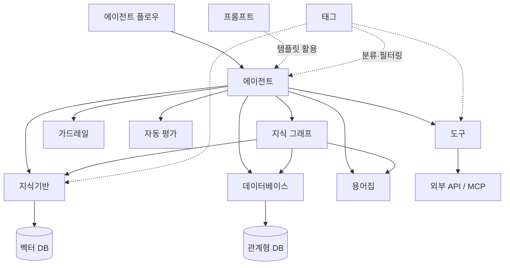

워크스페이스는 AI를 업무에 맞게 구성하고, 팀과 공유하는 공간입니다.
에이전트를 중심으로 지식기반, 데이터베이스, 도구, 가드레일 등을 조합하여 **조직 맞춤형 AI 환경**을 만들 수 있습니다.

<Frame caption="워크스페이스 메인 화면">
  
</Frame>

---

## 핵심 기능

<Columns cols={3}>
  <Card title="에이전트" icon="robot" href="/ko/workspace/agents">
    지식기반 + 도구 + 가드레일을 결합한 맞춤형 AI 어시스턴트를 생성하고 관리합니다.
  </Card>
  <Card title="지식기반" icon="book" href="/ko/workspace/knowledge">
    사내 문서를 업로드하고 RAG 파이프라인으로 벡터 검색을 수행합니다.
  </Card>
  <Card title="데이터베이스" icon="database" href="/ko/workspace/database">
    자연어로 데이터베이스를 조회합니다. SQL 없이 데이터를 분석하세요.
  </Card>
</Columns>

<Columns cols={3}>
  <Card title="에이전트 플로우" icon="diagram-project" href="/ko/workspace/flows">
    여러 에이전트를 시각적으로 연결하여 멀티 스텝 워크플로우를 구성합니다.
  </Card>
  <Card title="가드레일" icon="shield-halved" href="/ko/workspace/guardrails">
    PII 감지, 콘텐츠 필터링, 금지어 차단 등 AI 입출력 보안 정책을 설정합니다.
  </Card>
  <Card title="도구" icon="wrench" href="/ko/workspace/tools">
    OpenAPI 서버 또는 MCP 서버를 연결하여 에이전트가 외부 시스템과 상호작용합니다.
  </Card>
</Columns>

<Columns cols={3}>
  <Card title="프롬프트" icon="message" href="/ko/workspace/prompts">
    자주 사용하는 프롬프트를 템플릿으로 저장하고 팀과 공유합니다. `/` 명령어로 빠르게 호출할 수 있습니다.
  </Card>
  <Card title="용어집" icon="spell-check" href="/ko/workspace/glossary">
    도메인 전문 용어를 등록하여 AI가 업계 용어, 약어, 사내 용어를 정확히 이해하도록 합니다.
  </Card>
  <Card title="지식 그래프" icon="share-nodes" href="/ko/workspace/knowledge-graph">
    용어집·데이터베이스·문서를 하나의 그래프로 연결하여 에이전트의 이해력을 높입니다.
  </Card>
  <Card title="태그" icon="tags" href="/ko/workspace/tags">
    워크스페이스 리소스에 태그를 붙여 분류하고 필터링합니다.
  </Card>
</Columns>

---

## 기능 간 연결 구조

워크스페이스의 핵심은 **에이전트**입니다. 에이전트는 다른 워크스페이스 기능들을 조합하여 동작합니다.

| 연결 | 역할 |
|------|------|
| **에이전트 + 지식기반** | 사내 문서 기반 RAG 답변 생성 |
| **에이전트 + 데이터베이스** | 자연어 → SQL 변환으로 데이터 조회 |
| **에이전트 + 지식 그래프** | 용어집·DB·문서를 통합 연결 — 비즈니스 용어를 데이터로 매핑 |
| **에이전트 + 도구** | 외부 API 호출 (티켓 생성, 메일 발송 등) |
| **에이전트 + 가드레일** | 입출력 보안 검증 (PII 마스킹, 콘텐츠 필터) |
| **에이전트 + 용어집** | 전문 용어 자동 인식 및 정확한 해석 |
| **플로우 + 에이전트** | 여러 에이전트를 순차/병렬로 실행하는 워크플로우 |

---

## 접근 권한

모든 워크스페이스 리소스는 동일한 접근 권한 체계를 따릅니다.

| 옵션 | 설명 |
|------|------|
| **공개 (Public)** | 모든 사용자가 사용 가능 |
| **비공개 (Private)** | 선택한 그룹 또는 조직 단위의 구성원만 사용 가능. 미지정 시 생성자만 접근 |

각 리소스는 **읽기**와 **쓰기** 권한을 별도로 관리할 수 있습니다. 예를 들어, 특정 그룹에 읽기 권한만 부여하면 해당 그룹은 에이전트를 사용할 수 있지만 설정을 수정할 수는 없습니다.

<Tip>
  관리자는 **관리자 설정 > 일반**에서 일반 사용자의 워크스페이스 리소스 생성 권한을 기능별로 제어할 수 있습니다.
</Tip>

---

## 시작하기

<Columns cols={2}>
  <Card title="에이전트 만들기" icon="robot" href="/ko/workspace/agents">
    기반 모델, 시스템 프롬프트, 지식기반을 연결하여 맞춤형 AI를 생성합니다
  </Card>
  <Card title="지식기반 구축" icon="book" href="/ko/workspace/knowledge">
    사내 문서를 업로드하고 RAG 검색을 설정합니다
  </Card>
  <Card title="데이터베이스 연결" icon="database" href="/ko/workspace/database">
    업무 DB를 연결하고 자연어 조회를 활성화합니다
  </Card>
  <Card title="채팅에서 활용" icon="comments" href="/ko/chat/overview">
    생성한 에이전트를 선택하고 대화를 시작합니다
  </Card>
</Columns>
