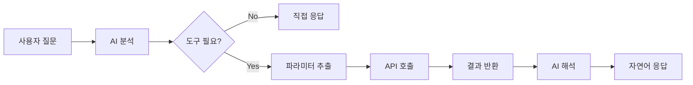

도구 연결은 AI가 외부 시스템의 기능을 호출(Function Calling)할 수 있게 해주는 기능입니다.
OpenAPI 스펙 기반 REST API 또는 MCP(Model Context Protocol) 서버를 연결하면, AI가 대화 중 적절한 시점에 자동으로 도구를 호출합니다.



---

## 도구란?

도구는 AI의 능력을 외부 시스템으로 확장하는 인터페이스입니다. AI가 학습 데이터에 없는 실시간 정보를 조회하거나, 외부 시스템에 작업을 요청할 수 있습니다.

### 활용 예시

| 연결 대상 | 할 수 있는 일 |
|----------|--------------|
| **CRM 시스템** | 고객 정보 조회, 영업 기회 등록 |
| **티켓 시스템** | 이슈 생성, 상태 업데이트 |
| **HR 시스템** | 휴가 신청, 직원 정보 조회 |
| **날씨/주가 API** | 실시간 외부 데이터 제공 |
| **사내 데이터 API** | 매출, 재고 등 비즈니스 데이터 조회 |

### 지원 프로토콜

<Columns cols={2}>
  <Card title="OpenAPI" icon="plug">
    REST API 표준 스펙(구 Swagger). 대부분의 웹 서비스가 제공하는 범용 프로토콜입니다.
  </Card>
  <Card title="MCP" icon="link">
    Model Context Protocol. AI 전용 도구 서버 프로토콜로, 더 안전하고 효율적인 통합을 지원합니다.
  </Card>
</Columns>

---

## 도구 목록

**워크스페이스 > 도구**에서 등록된 모든 도구 연결을 확인합니다.

<Frame caption="워크스페이스 > 도구에서 등록된 도구 연결을 관리합니다">
  
</Frame>

목록에서 각 도구는 다음 정보를 표시합니다:

| 항목 | 설명 |
|------|------|
| **이름** | 도구 표시 이름 |
| **설명** | 도구 용도 설명 |
| **작성자** | 도구를 생성한 사용자 |
| **수정 시간** | 마지막 수정 시점 (상대 시간) |

목록 상단에는 검색창이 있어 이름이나 설명으로 도구를 검색할 수 있습니다.
각 도구 카드의 메뉴(`...`)에서는 **삭제**가 가능합니다.

---

## 도구 생성

도구 생성은 두 단계로 이루어집니다: 기본 정보 입력(CreateTool) 후 상세 페이지(ToolDetail)에서 연결을 구성합니다.

<Steps>
  <Step title="새 도구 만들기">
    **워크스페이스 > 도구** 목록 우측 상단의 **+** 버튼을 클릭합니다.

    생성 폼에 다음 정보를 입력합니다.

    <Frame caption="도구 이름, 설명, 접근 권한을 설정합니다">
      
    </Frame>

    | 필드 라벨 | 설명 | 예시 |
    |----------|------|------|
    | **이 도구는 무엇을 하나요?** (이름) | 도구 표시 이름 | "고객 관리 API" |
    | **이 도구를 어떻게 사용할 수 있나요?** (설명) | 도구 용도 설명 | "CRM 시스템 고객 정보 조회 및 관리" |
    | **접근 권한** | 공개 또는 특정 그룹/사용자에게 제한 | 공개, 또는 특정 그룹/사용자 지정 |

    <Note>접근 권한은 공개(Public)와 비공개(특정 그룹/사용자 지정)로 나뉩니다. 비공개 시 읽기(Read)와 쓰기(Write) 권한을 그룹/사용자별로 세분화할 수 있습니다.</Note>

    **도구 만들기** 버튼을 클릭하면 도구가 생성되고 상세 설정 페이지로 자동 이동합니다.
  </Step>

  <Step title="상세 페이지에서 연결 구성">
    생성 후 자동으로 이동한 상세 페이지(`/workspace/tools/{id}`)에서 실제 연결을 설정합니다.
    상세 페이지의 구성은 아래 [OpenAPI 도구 연결](#openapi-도구-연결) 및 [MCP 도구 연결](#mcp-도구-연결) 섹션을 참고하세요.
  </Step>
</Steps>

---

## OpenAPI 도구 연결

OpenAPI(구 Swagger) 스펙을 제공하는 REST API를 연결하는 방법입니다.
도구 상세 페이지에서 아래 설정을 진행합니다.

<Frame caption="도구 상세 페이지에서 연결 타입, URL, 인증, Tool Description을 설정합니다">
  
</Frame>

### 연결 설정 필드

| 필드 | 설명 | 기본값 |
|------|------|--------|
| **Connection Type** | OpenAPI 또는 MCP 선택 드롭다운 | OpenAPI |
| **API Base URL** | OpenAPI 서버의 기본 URL | — |
| **OpenAPI Spec Path** | OpenAPI 스펙 파일 경로 | `openapi.json` |
| **Auth Type** | 인증 방식 선택 | Bearer Token |
| **API Key** | Bearer Token 방식일 때 토큰 값 | — |
| **Enabled** | 연결 활성화/비활성화 토글 | 활성화 |

<Tabs>
  <Tab title="Bearer Token 인증">
    API Key 필드에 Bearer 토큰 값을 입력합니다. API 호출 시 `Authorization: Bearer <token>` 헤더로 전송됩니다.

    ```
    API Base URL: https://api.example.com
    OpenAPI Spec Path: openapi.json
    Auth Type: Bearer Token
    API Key: sk-xxxxxxxxxxxxxxxx
    ```
  </Tab>
  <Tab title="Session 인증">
    현재 로그인한 사용자의 세션 인증 정보를 그대로 사용합니다. 별도의 API 키 입력이 필요 없습니다.
    사내 API 서버에서 Cloosphere와 동일한 인증 체계를 사용하는 경우에 적합합니다.
  </Tab>
</Tabs>

### 연결 테스트 및 기능 확인

설정 완료 후 **연결 테스트(Test Connection)** 버튼을 클릭합니다.

연결 성공 시 우측 **사용 가능한 기능(Available Functions)** 패널에 API 엔드포인트 목록이 자동으로 표시됩니다.
각 기능 항목에는 HTTP 메서드(GET, POST 등), 이름, 설명, 경로가 표시되며, 마우스를 올리면 파라미터 상세 정보를 확인할 수 있습니다.

<Frame caption="연결 성공 시 사용 가능한 API 엔드포인트 목록이 자동 표시됩니다">
  
</Frame>

---

## MCP 도구 연결

MCP(Model Context Protocol)는 AI 모델과 외부 도구 간의 통신을 위한 전용 프로토콜입니다.
도구 상세 페이지에서 **Connection Type**을 **MCP**로 변경한 후 아래 설정을 진행합니다.

<Frame caption="Connection Type을 MCP로 변경하고 서버 URL과 인증을 설정합니다">
  
</Frame>

### 연결 설정 필드

| 필드 | 설명 | 기본값 |
|------|------|--------|
| **Connection Type** | MCP 선택 | — |
| **MCP Server URL** | MCP 서버 주소 (SSE 엔드포인트) | — |
| **Auth Type** | 인증 방식 (None / Bearer Token / API Key) | None |
| **Token / API Key** | 인증 방식에 따른 인증 값 | — |
| **Additional Headers** | 추가 HTTP 헤더 (선택) | — |
| **Enabled** | 연결 활성화/비활성화 토글 | 활성화 |

### MCP 인증 방식

<Tabs>
  <Tab title="None">
    인증 없이 MCP 서버에 연결합니다. 로컬 또는 내부 네트워크의 MCP 서버에 적합합니다.
  </Tab>
  <Tab title="Bearer Token">
    Bearer 토큰을 사용한 인증입니다. 토큰 값을 입력하면 요청 시 `Authorization: Bearer <token>` 헤더로 전송됩니다.
  </Tab>
  <Tab title="API Key">
    API 키를 사용한 인증입니다. API 키 값을 입력하면 서버 요구사항에 따라 인증 헤더로 전송됩니다.
  </Tab>
</Tabs>

### 추가 헤더 설정

MCP 서버가 커스텀 헤더를 요구하는 경우 **Additional Headers** 필드에 입력합니다. `키: 값` 형태로 한 줄에 하나씩 작성합니다.

```
X-Custom-Header: value
X-Another-Header: another-value
```

### 연결 테스트

**연결 테스트(Test Connection)** 버튼을 클릭하면 MCP 서버에 연결하여 제공하는 도구 목록을 조회합니다.
연결 성공 시 우측 **사용 가능한 기능** 패널에 MCP 도구 목록이 표시됩니다.

---

## Tool Description (에이전트용 설명)

도구 상세 페이지 상단에는 **Tool Description** 필드가 있습니다. 이 필드는 에이전트가 어떤 상황에서 이 도구 서버를 사용해야 하는지 판단하는 데 사용됩니다.

- 직접 설명을 작성하거나, **AI** 버튼을 클릭하여 연결된 기능 목록을 기반으로 자동 생성할 수 있습니다
- AI 생성 시 사용할 모델을 드롭다운에서 선택할 수 있습니다 (기본: 시스템 기본 모델)
- 연결 테스트 후 기능 목록이 로드된 상태에서만 AI 생성이 가능합니다

<Tip>
  Tool Description을 잘 작성하면 에이전트가 적절한 시점에 도구를 선택하는 정확도가 높아집니다.
  예: "프로젝트 이슈 관리, 메시지 전송, API 통합이 필요할 때 사용합니다."
</Tip>

---

## 도구 활용

### 에이전트에 도구 연결

도구를 에이전트에 연결하면 AI가 대화 중 자동으로 적절한 시점에 도구를 호출합니다.

1. **워크스페이스 > 에이전트**에서 에이전트 편집 화면을 엽니다
2. **도구** 섹션에서 연결할 도구를 선택합니다
3. 저장합니다

### 채팅에서 도구 호출 과정

AI가 사용자 질문을 분석하여 도구가 필요한지 판단하고, 필요한 경우 자동으로 호출합니다.

```
사용자: 고객 ID 12345의 정보를 조회해줘

AI: [CRM API 호출 중...]

고객 정보를 조회했습니다:

| 항목 | 값 |
|------|-----|
| 이름 | 홍길동 |
| 이메일 | hong@example.com |
| 등급 | VIP |
| 최근 구매일 | 2024-01-15 |
```

---

## 도구 관리

### 편집

도구 목록에서 카드를 클릭하면 상세 페이지로 이동하여 연결 설정, 이름, 설명, Tool Description 등을 수정할 수 있습니다.
상세 페이지 우측 상단의 **Save** 버튼으로 변경 사항을 저장합니다.

### 삭제

도구 목록에서 카드 우측의 메뉴(`...`)를 클릭하고 **삭제**를 선택합니다.
삭제 확인 다이얼로그에서 확인하면 도구가 영구 삭제됩니다.

### 접근 권한 변경

상세 페이지 우측 상단의 **Access** 버튼을 클릭하여 접근 권한을 변경할 수 있습니다.
읽기(Read)와 쓰기(Write) 권한을 그룹/사용자별로 지정하거나, 공개(Public)로 설정할 수 있습니다.

---

## 보안 고려사항

| 보안 기능 | 설명 |
|----------|------|
| **암호화 통신** | 모든 API 호출은 TLS로 암호화 |
| **자격 증명 저장** | API 키는 데이터베이스에 JSON 형태로 저장됩니다 |
| **접근 제어** | 읽기/쓰기 권한별 도구 사용 제한 |

<Warning>
  API 키는 평문으로 저장되므로 정기적으로 순환(rotate)하세요.
  사설 네트워크 내 API만 연결하고, 필요시 IP 화이트리스트 또는 VPN/Private Endpoint를 활용하세요.
  데이터베이스 접근 권한을 적절히 제한하여 자격 증명을 보호하세요.
</Warning>

---

## 트러블슈팅

<AccordionGroup>
  <Accordion title="연결 실패" icon="triangle-exclamation">
    | 원인 | 해결 방법 |
    |------|----------|
    | URL 오류 | API Base URL 및 OpenAPI Spec Path를 재확인합니다 |
    | 인증 실패 | API 키/토큰 유효성을 확인합니다 |
    | 네트워크 | 방화벽/프록시 설정을 확인합니다 |
    | CORS | 서버 측 CORS 설정을 확인합니다 |
  </Accordion>

  <Accordion title="API 호출 실패" icon="triangle-exclamation">
    | 원인 | 해결 방법 |
    |------|----------|
    | 권한 부족 | API 권한(scope)을 확인합니다 |
    | Rate Limit | 호출 빈도를 조절합니다 |
    | 서버 오류 | 외부 서비스 상태를 확인합니다 |
  </Accordion>

  <Accordion title="MCP 서버 연결 실패" icon="triangle-exclamation">
    | 원인 | 해결 방법 |
    |------|----------|
    | URL 형식 | SSE 엔드포인트 URL 형식을 확인합니다 (예: `https://mcp.example.com/sse`) |
    | 인증 방식 불일치 | 서버가 요구하는 인증 방식(None/Bearer Token/API Key)과 설정이 일치하는지 확인합니다 |
    | 연결 비활성화 | Enabled 토글이 활성화 상태인지 확인합니다 |
  </Accordion>
</AccordionGroup>

---

## FAQ

<AccordionGroup>
  <Accordion title="어떤 API든 연결할 수 있나요?" icon="circle-question">
    OpenAPI(Swagger) 스펙을 제공하는 API는 모두 연결 가능합니다.
    스펙이 없는 경우 MCP 서버를 직접 구축하거나, OpenAPI 스펙을 별도로 작성해야 합니다.
  </Accordion>

  <Accordion title="API 호출 비용이 발생하나요?" icon="circle-question">
    외부 API 사용 시 해당 서비스의 과금 정책이 적용됩니다.
    Cloosphere 자체에서는 도구 호출에 대한 추가 비용이 없습니다.
  </Accordion>

  <Accordion title="민감한 데이터도 안전한가요?" icon="circle-question">
    모든 통신은 TLS로 암호화되며, 접근 권한을 세밀하게 설정하여 사용을 제한할 수 있습니다.
    가드레일을 함께 사용하면 민감 정보 유출을 추가로 방지할 수 있습니다.
  </Accordion>

  <Accordion title="OpenAPI와 MCP 중 어떤 것을 사용해야 하나요?" icon="circle-question">
    기존에 OpenAPI 스펙을 제공하는 REST API가 있다면 OpenAPI를 선택하세요.
    AI 전용 도구 서버를 새로 구축하거나, MCP 호환 서버를 이미 보유하고 있다면 MCP를 선택하세요.
  </Accordion>
</AccordionGroup>

---

## 다음 단계

<Columns cols={3}>
  <Card title="에이전트에 도구 연결" icon="robot" href="/ko/workspace/agents">
    도구를 에이전트에 연결하여 AI 능력을 확장
  </Card>
  <Card title="관리자 도구 서버" icon="gear" href="/ko/admin/settings/tools">
    전역 도구 서버 설정 (관리자)
  </Card>
  <Card title="트레이싱" icon="chart-line" href="/ko/monitoring/tracing">
    도구 호출 과정을 단계별 추적
  </Card>
</Columns>
