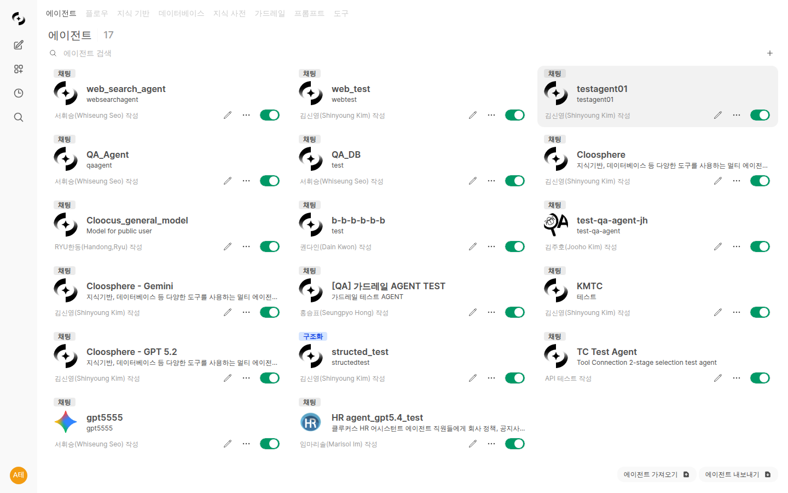

# Cloosphere - Enterprise AI Platform

<p align="center">
  
</p>

> **An All-in-One Platform for Enterprise AI Innovation**
>
> Cloosphere is an enterprise-grade AI platform that enables organizations to leverage diverse AI models safely and efficiently.

---

## Why Cloosphere?

### 🔒 Enterprise-Grade Security
- **Private Network Environment**: All data is processed exclusively within your corporate network
- **Role-Based Access Control**: Fine-grained permission management aligned with your organizational structure
- **Complete Audit Logging**: Transparent tracking of all user activities

### 🚀 Maximize Productivity
- **Custom AI Agents**: Configure specialized AI assistants tailored to each department and task
- **Knowledge Base Integration**: Instantly connect internal documents and databases to AI
- **Tool Integration**: One-click integration with existing business systems

### 💰 Cost Efficiency
- **Usage Tracking**: Monitor costs by department and user
- **Multi-Model Support**: Choose the optimal model for each task
- **On-Premises Option**: Run on your own servers without cloud costs

---

## Key Features

| Feature | Description |
|---------|-------------|
| [💬 AI Chat](./chat.md) | Natural conversations with advanced AI models |
| [🤖 Agents](./workspace/agents.md) | Configure task-specific AI assistants |
| [🔄 Flows](./workspace/flows.md) | Multi-agent orchestration with visual workflows |
| [📚 Knowledge Base](./workspace/knowledge.md) | RAG system powered by internal documents |
| [🔧 Tool Connections](./workspace/tools.md) | External API and system integration |
| [📝 Prompt Management](./workspace/prompts.md) | Shared prompt templates for teams |
| [📖 Glossary](./workspace/glossary.md) | Internal terminology management |
| [🗄️ Database Connection](./workspace/database.md) | Query databases using natural language |
| [👥 User Management](./admin/users.md) | Organization/group-based permission management |
| [⚙️ System Settings](./admin/settings.md) | AI model and system configuration |
| [📊 Monitoring](./admin/monitoring.md) | Usage, audit logs, guardrail logs |
| [🔍 Tracing](./admin/tracing.md) | End-to-end AI request tracking and debugging |

---

## Screen Previews

### Main Chat Screen


### Agent Management


### Admin Dashboard


---

## Quick Start

### Step 1: Log In
Sign in easily with your corporate account (Microsoft Entra ID).

### Step 2: Select a Model
Choose an AI model that fits your needs.

### Step 3: Start a Conversation
Type your question and start chatting with AI.

➡️ [View Detailed Guide](./getting-started.md)

---

## Documentation Structure

```
📁 docs/customers/
├── 📄 README.md (this document)
├── 📄 getting-started.md      # Getting Started Guide
├── 📄 chat.md                 # Chat Features
├── 📁 workspace/              # Workspace
│   ├── 📄 agents.md           # Agents
│   ├── 📄 flows.md            # Flows (Workflow Builder)
│   ├── 📄 knowledge.md        # Knowledge Base
│   ├── 📄 tools.md            # Tool Connections
│   ├── 📄 guardrails.md       # Guardrails
│   ├── 📄 prompts.md          # Prompts
│   ├── 📄 database.md         # Database
│   └── 📄 glossary.md         # Glossary
├── 📁 admin/                  # Admin
│   ├── 📄 users.md            # User Management
│   ├── 📄 settings.md         # System Settings
│   └── 📄 monitoring.md       # Monitoring
└── 📁 images/                 # Screenshots
```

---

## Supported Browsers

| Browser | Supported Version |
|---------|-------------------|
| Chrome | 90+ |
| Edge | 90+ |
| Firefox | 88+ |
| Safari | 14+ |

---

## Contact

- **Technical Support**: support@cloocus.com
- **Sales Inquiries**: sales@cloocus.com

---

<p align="center">
  <strong>Cloosphere</strong> by Cloocus<br/>
  Empowering Enterprise AI
</p>
