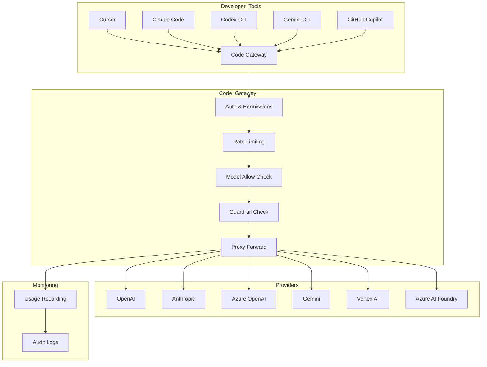
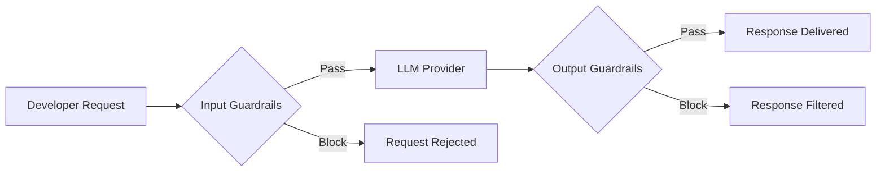

# Code Gateway

> Enterprise proxy gateway for AI coding tools (Cursor, Claude Code, Codex CLI, Gemini CLI, GitHub Copilot). Centrally manage API requests from developers' AI coding tools through Cloosphere, applying guardrails, usage tracking, and audit logging.



---

## Overview

Code Gateway proxies LLM API requests from AI coding tools through Cloosphere. Developers point their tools (Cursor, Claude Code, etc.) to the Cloosphere endpoint and use their Cloosphere API key. Admin-configured policies are automatically applied to all requests.

### Key Features

| Feature | Description |
|---------|-------------|
| **Centralized Management** | Consolidate multiple AI providers under one gateway |
| **Guardrails** | PII detection, content filtering on input/output |
| **Usage Tracking** | Token usage by user, model, and provider |
| **Rate Limiting** | Per-user request limits per minute |
| **Model Control** | Restrict access via allowed model lists |
| **Repository Tracking** | Git repository metadata collection for auditing |
| **Blocking Policies** | Block specific repositories and file patterns |

### Supported Providers

| Provider Type | Description | Auth Method |
|---------------|-------------|-------------|
| **OpenAI** | OpenAI API and compatible endpoints | Bearer token |
| **Anthropic** | Anthropic API (Claude) | x-api-key header |
| **Azure OpenAI** | Azure OpenAI Service | api-key header |
| **Gemini** | Google Gemini API | API key (query parameter) |
| **Vertex AI** | Vertex AI (service account auth) | GCP OAuth2 |
| **Azure AI Foundry** | Azure AI Foundry | Bearer token |

---

## Admin Setup

Configure the gateway under **Admin > Settings > Code Gateway**.

<!-- Screenshot: Code Gateway settings main screen
     Filename: images/admin-code-gateway-main.png
-->

### Enabling Code Gateway

1. Toggle **Enable Code Gateway** to ON.
2. Once enabled, you can add providers and configure policies.

> **Note:** Code Gateway is accessible only to users with the `features.code_gateway` permission. Admins always have access.

### Adding Providers

Providers represent the actual LLM API endpoints. You can register multiple providers simultaneously.

<!-- Screenshot: Provider configuration screen
     Filename: images/admin-code-gateway-provider.png
-->

**Provider settings:**

| Setting | Description | Required |
|---------|-------------|----------|
| **Provider ID** | Unique identifier (used in URL path, e.g., `my-openai`) | Yes |
| **Type** | `openai`, `anthropic`, `azure_openai`, `gemini`, `vertex_ai`, `azure_ai_foundry` | Yes |
| **Enable** | Enable/disable provider | Yes |
| **API URL** | Provider API endpoint URL | Yes (except Vertex AI) |
| **API Key** | Provider authentication key | Yes (except Vertex AI) |
| **API Version** | API version (Azure OpenAI only) | Azure only |
| **Model IDs** | Allowed models for this provider (empty = all allowed) | No |
| **Deployment Map** | Model-to-deployment name mapping (Azure OpenAI only) | No |

#### OpenAI / OpenAI-Compatible Provider

```
Type: openai
API URL: https://api.openai.com/v1
API Key: sk-...
```

#### Anthropic

```
Type: anthropic
API URL: https://api.anthropic.com
API Key: sk-ant-...
```

#### Azure OpenAI

```
Type: azure_openai
API URL: https://{resource-name}.openai.azure.com/
API Key: Key from Azure
API Version: 2024-12-01-preview
```

> **Note:** When you configure a Deployment Map for Azure OpenAI, model names are automatically mapped to deployment names. Example: `{"gpt-4o": "my-gpt4o-deployment"}`

#### Gemini

```
Type: gemini
API URL: https://generativelanguage.googleapis.com
API Key: Key from Google AI Studio
```

#### Vertex AI

Vertex AI uses GCP service account authentication.

| Setting | Description |
|---------|-------------|
| **Project ID** | GCP project ID |
| **Location** | Region (default: `us-central1`, `global` supported) |
| **Service Account Key** | GCP service account JSON key |
| **Use Global GCP Key** | Fall back to system-wide GCP key |

#### Azure AI Foundry

```
Type: azure_ai_foundry
API URL: https://{project-name}.{region}.models.ai.azure.com/
API Key: Key from AI Foundry
```

### Guardrails Configuration

Apply guardrails to requests passing through Code Gateway for enhanced security.

<!-- Screenshot: Guardrails settings section
     Filename: images/admin-code-gateway-guardrails.png
-->

| Setting | Description |
|---------|-------------|
| **Follow Global Guardrails** | Apply system-wide guardrail settings to Code Gateway |
| **Additional Guardrails** | Select additional guardrails specific to Code Gateway |

When guardrails are enabled:
- **Input guardrails**: Inspect developer prompts for PII, sensitive information, etc.
- **Output guardrails**: Filter inappropriate content from LLM responses (streaming is automatically disabled for inspection)

### Rate Limiting

Limit the number of requests per user per minute.

| Setting | Description | Default |
|---------|-------------|---------|
| **Rate Limit** | Maximum requests per user per minute (0 = unlimited) | 0 |

> **Note:** Rate limiting is managed in-memory and resets on server restart.

### Allowed Models

Restrict available models at the global level.

| Setting | Description |
|---------|-------------|
| **Allowed Models** | List of permitted model IDs (empty = all allowed) |

> Provider-level model restrictions are managed separately under each provider's **Model IDs** setting. Both global and provider-level allowed models are enforced.

### Blocked File Patterns

Block or warn when requests contain specific file patterns.

| Setting | Description |
|---------|-------------|
| **Blocked File Patterns** | List of file path patterns to block (glob format) |
| **Blocked File Action** | `block` (reject request) or `warn` (log warning only) |

**Example patterns:**
- `*.env` -- environment variable files
- `*credentials*` -- credential files
- `*.pem` -- certificate files

### Blocked Repositories and Metadata Requirements

Block requests from specific Git repositories, or require repository metadata with every request.

| Setting | Description |
|---------|-------------|
| **Blocked Repos** | List of Git repository URL patterns to block |
| **Require Repo Metadata** | Require repository metadata with requests |
| **Missing Metadata Action** | `allow` (permit), `warn` (log warning), `block` (reject) |

---

## Client Setup

Developers need the following to connect their AI coding tools to Code Gateway:

- **Gateway URL**: `{CLOOSPHERE_URL}/api/v1/code-gateway/{provider_id}`
- **API Key**: Personal API key issued from Cloosphere (**Admin > Settings > General** -- API keys must be enabled)

### Cursor Setup

Cursor uses the OpenAI-compatible API.

**Configuration:**

1. Open Cursor **Settings > Models**.
2. Enter your Cloosphere API key in **OpenAI API Key**.
3. Enter the gateway URL in **Override OpenAI Base URL**:
   ```
   {CLOOSPHERE_URL}/api/v1/code-gateway/{provider_id}/v1
   ```
4. Select the model to use.

<!-- Screenshot: Cursor settings screen
     Filename: images/code-gateway-cursor-settings.png
-->

#### Cursor Hook (Metadata Collection)

Installing the Cursor Hook automatically collects Git repository information (remote URL, branch) and records it in audit logs.

**Automatic install (recommended):**

```bash
# Download and run the setup script
curl -s {CLOOSPHERE_URL}/api/v1/code-gateway/cursor-setup-script | bash
```

**PowerShell:**
```powershell
Invoke-Expression (Invoke-WebRequest -Uri "{CLOOSPHERE_URL}/api/v1/code-gateway/cursor-setup-script?os=powershell").Content
```

**Manual install:**

1. Create the file `~/.cursor/hooks/cloosphere-meta.sh`.
2. Register hook events in `~/.cursor/hooks.json`:

```json
{
  "version": 1,
  "hooks": {
    "sessionStart": [
      { "command": "hooks/cloosphere-meta.sh", "type": "command", "timeout": 5 }
    ],
    "beforeSubmitPrompt": [
      { "command": "hooks/cloosphere-meta.sh", "type": "command", "timeout": 5 }
    ],
    "postToolUse": [
      { "command": "hooks/cloosphere-meta.sh", "type": "command", "timeout": 5 }
    ]
  }
}
```

The hook collects Git repository metadata on `sessionStart`, `beforeSubmitPrompt`, and `postToolUse` events.

**Uninstall:**
```bash
curl -s {CLOOSPHERE_URL}/api/v1/code-gateway/cursor-uninstall-script | bash
```

### Claude Code Setup

Claude Code uses the Anthropic API.

**Automatic install (recommended):**

```bash
export CLOOSPHERE_API_KEY="<your-cloosphere-api-key>"
export CLOOSPHERE_GATEWAY_URL="{CLOOSPHERE_URL}/api/v1/code-gateway/{provider_id}"

# Download and run the setup script
curl -s {CLOOSPHERE_URL}/api/v1/code-gateway/setup-script | bash
```

**PowerShell:**
```powershell
$env:CLOOSPHERE_API_KEY = "<your-cloosphere-api-key>"
$env:CLOOSPHERE_GATEWAY_URL = "{CLOOSPHERE_URL}/api/v1/code-gateway/{provider_id}"

Invoke-Expression (Invoke-WebRequest -Uri "{CLOOSPHERE_URL}/api/v1/code-gateway/setup-script?os=powershell").Content
```

The setup script performs the following:
1. Installs the helper script (`~/cloosphere-helper.sh`) -- auto-attaches Git metadata to the API key
2. Configures `~/.claude/settings.json` -- sets `ANTHROPIC_BASE_URL` and `apiKeyHelper`

**Manual setup:**

Add the following to `~/.claude/settings.json`:

```json
{
  "env": {
    "CLOOSPHERE_API_KEY": "<your-cloosphere-api-key>",
    "ANTHROPIC_BASE_URL": "{CLOOSPHERE_URL}/api/v1/code-gateway/{provider_id}"
  },
  "apiKeyHelper": "/home/user/cloosphere-helper.sh"
}
```

**Uninstall:**
```bash
curl -s {CLOOSPHERE_URL}/api/v1/code-gateway/claude-uninstall-script | bash
```

### Codex CLI Setup

Codex CLI uses the OpenAI Responses API.

**Automatic install (recommended):**

```bash
export CLOOSPHERE_API_KEY="<your-cloosphere-api-key>"
export CLOOSPHERE_GATEWAY_URL="{CLOOSPHERE_URL}/api/v1/code-gateway/{provider_id}"

# Download and run the setup script
curl -s {CLOOSPHERE_URL}/api/v1/code-gateway/codex-setup-script | bash
```

The setup script performs the following:
1. Installs the metadata helper script (`~/cloosphere-codex-meta.sh`)
2. Adds a Cloosphere provider to `~/.codex/config.toml`
3. Adds a `codex` wrapper function to the shell profile (auto metadata collection)

**Manual setup:**

Add the following to `~/.codex/config.toml`:

```toml
model = "gpt-5.3-codex"
model_provider = "cloosphere"

[model_providers.cloosphere]
name = "Cloosphere Gateway"
base_url = "{CLOOSPHERE_URL}/api/v1/code-gateway/{provider_id}/v1"
env_key = "CLOOSPHERE_API_KEY"
env_http_headers = { "X-Cloosphere-Meta" = "CLOOSPHERE_META" }
```

Set the environment variable:
```bash
export CLOOSPHERE_API_KEY="<your-cloosphere-api-key>"
```

**Uninstall:**
```bash
curl -s {CLOOSPHERE_URL}/api/v1/code-gateway/codex-uninstall-script | bash
```

### Gemini CLI Setup

Gemini CLI uses the Google Gemini API.

**Automatic install (recommended):**

```bash
export CLOOSPHERE_API_KEY="<your-cloosphere-api-key>"
export CLOOSPHERE_GATEWAY_URL="{CLOOSPHERE_URL}/api/v1/code-gateway/{provider_id}"

# Download and run the setup script
curl -s {CLOOSPHERE_URL}/api/v1/code-gateway/gemini-setup-script | bash
```

The setup script performs the following:
1. Installs the hook script (`~/.gemini/hooks/cloosphere-meta.sh`)
2. Registers hook events in `~/.gemini/settings.json` (`SessionStart`, `BeforeAgent`)
3. Adds `GEMINI_API_KEY` and `GOOGLE_GEMINI_BASE_URL` environment variables to the shell profile

**Manual setup:**

Set the environment variables:
```bash
export GEMINI_API_KEY="<your-cloosphere-api-key>"
export GOOGLE_GEMINI_BASE_URL="{CLOOSPHERE_URL}/api/v1/code-gateway/{provider_id}"
```

**Uninstall:**
```bash
curl -s {CLOOSPHERE_URL}/api/v1/code-gateway/gemini-uninstall-script | bash
```

### GitHub Copilot Setup

GitHub Copilot can be connected through an OpenAI-compatible provider. Configure the proxy URL to point to Code Gateway in your IDE settings.

---

## Usage Tracking and Monitoring

All API requests through Code Gateway are automatically tracked for usage.

### Usage Logs

View Code Gateway usage under **Admin > Monitoring > Usage**.

<!-- Screenshot: Code Gateway usage logs
     Filename: images/admin-code-gateway-usage.png
-->

Recorded information:

| Field | Description |
|-------|-------------|
| **User** | User who made the request |
| **Model** | AI model used |
| **Provider** | Provider ID used |
| **Client** | Detected client type (Cursor, Claude Code, etc.) |
| **Token Count** | Input/output token usage |
| **Repository** | Git repository URL (when metadata is collected) |
| **Branch** | Git branch name |
| **Timestamp** | Time of the request |

### Usage Statistics API

Admins can query statistics via API:

```
GET /api/v1/code-gateway/usage-logs          -- Usage log list
GET /api/v1/code-gateway/usage-logs/stats     -- Aggregated statistics
GET /api/v1/code-gateway/usage-logs/filters/models  -- Model list for filters
GET /api/v1/code-gateway/usage-logs/filters/users   -- User list for filters
```

### Audit Logs

Code Gateway configuration changes are recorded in audit logs. View them under **Admin > Monitoring > Audit Logs**.

---

## Security

### Authentication

Code Gateway supports multiple authentication methods to accommodate each AI coding tool:

| Auth Method | Used By |
|-------------|---------|
| `Authorization: Bearer {API_KEY}` | Cursor, Codex CLI |
| `x-api-key: {API_KEY}` | Claude Code |
| `x-goog-api-key: {API_KEY}` | Gemini CLI |
| `key={API_KEY}` (query parameter) | General purpose |

### Guardrail Security Flow



When guardrails are applied:
- **Input**: Prompts are inspected for PII (Personally Identifiable Information), sensitive data, and inappropriate content.
- **Output**: LLM responses undergo the same inspection. When output guardrails are active, streaming responses are buffered in full before inspection.

### Repository Metadata Collection

Metadata collected via hooks/helper scripts:

| Field | Description |
|-------|-------------|
| **repo_url** | Git remote repository URL |
| **repo_urls** | Full list of remote URLs when multiple remotes exist |
| **branch** | Current working branch |
| **working_dir** | Current working directory (Claude Code/Codex CLI) |

Metadata is transmitted via:
1. **Token encoding**: `{API_KEY}::{base64(JSON)}` format appended to the API key
2. **X-Cloosphere-Meta header**: base64-encoded JSON (Codex CLI)
3. **In-message tag**: `[CLOOSPHERE_REPO]` tag (Cursor Hook, Gemini Hook)

Metadata is automatically extracted and stripped during proxying, so it is never sent to the upstream LLM.

---

## Troubleshooting

| Issue | Cause | Solution |
|-------|-------|----------|
| "Code Gateway is disabled" | Gateway not enabled | Enable Code Gateway in admin settings |
| "Code Gateway access not permitted" | Insufficient user permissions | Grant `features.code_gateway` permission |
| "Provider not found" | Invalid provider ID | Check the provider ID in the URL |
| "Provider is disabled" | Provider not enabled | Enable the provider in admin settings |
| "Model not allowed" | Model not in allowed list | Add the model to the allowed models list |
| "Rate limit exceeded" | Exceeded per-minute request limit | Wait and retry, or increase the rate limit |
| Connection failure | Incorrect provider API URL/key | Verify provider configuration |
