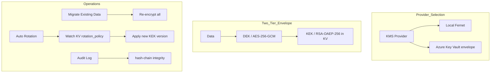

# Encryption (KMS)

> Protect sensitive data stored in system settings -- API keys, secrets, credentials, DbSphere connections, tool connection keys, and more -- using a KMS (Key Management System). Choose between Local Fernet and Azure Key Vault envelope encryption based on your environment.



---

## Overview

Cloosphere system settings include sensitive values such as external service credentials, OAuth secrets, and database connection strings. These values are encrypted by the KMS before being stored in the database, and the encryption keys are managed by the KMS provider rather than environment variables.

Envelope encryption uses a two-tier structure:

| Tier | Role |
|------|------|
| **DEK (Data Encryption Key)** | A single-use key that encrypts the actual data with AES-256-GCM |
| **KEK (Key Encryption Key)** | Wraps the DEK itself with RSA-OAEP-256. The KEK never leaves Key Vault and is only used inside it |

A fresh DEK is generated for each write and stored alongside the data; the KEK unwraps it at decrypt time. This structure means rotating the KEK only requires re-wrapping envelopes, not re-encrypting all data.

### Supported Providers

| Provider | Description |
|----------|-------------|
| **Local (Fernet)** | Self-managed Fernet using `WEBUI_SECRET_KEY`. No external dependency. Default |
| **Azure Key Vault (envelope)** | AES-256-GCM data encryption + RSA-OAEP-256 KEK in Azure Key Vault |

---

## Provider Selection

Choose your provider under **Admin > Settings > Encryption**.

<!-- Screenshot: Encryption tab main view (provider selection)
     Filename: images/admin/encryption-provider.png
-->

| Field | Description |
|-------|-------------|
| **KMS Provider** | Local (Fernet) or Azure Key Vault (envelope) |

> **Note:** Switching providers does not automatically migrate existing data. Legacy ciphertexts continue to decrypt via fallback. To re-encrypt everything under the new provider immediately, run [Migrate Existing Data](#migrate-existing-data).

### Local (Fernet)

Self-managed Fernet encryption that uses the `WEBUI_SECRET_KEY` environment variable as the key. Has no external dependency, suitable for single-instance or PoC environments.

> **Caution:** Changing `WEBUI_SECRET_KEY` will make existing encrypted values impossible to decrypt. For production, prefer key rotation via an envelope provider.

### Azure Key Vault (envelope)

Recommended provider for enterprise production. Because the KEK is held by Azure Key Vault, the key never reaches the application server, and every wrap/unwrap call can be tracked through RBAC and Key Vault audit logs.

---

## Azure Key Vault Configuration

Selecting **Azure Key Vault (envelope)** reveals additional input fields.

<!-- Screenshot: Azure Key Vault settings form (KEK URI, Service Principal)
     Filename: images/admin/encryption-azure-kv.png
-->

### KEK URI

| Field | Description |
|-------|-------------|
| **KEK URI (default tier)** | Versioned Key Vault key URI in the format `https://<vault>.vault.azure.net/keys/<name>/<version>`. Wraps Confidential and Internal classifications |
| **Restricted KEK URI (optional)** | Separate KEK for Restricted (PII, financial) classifications. Leave blank to share the default KEK above. The same Service Principal is reused |

> **Requirement:** The Service Principal (or fallback credential) must have the **"Key Vault Crypto User"** role on the vault for wrap/unwrap calls to succeed.

### Service Principal (optional)

Use a dedicated Service Principal when the Key Vault lives in a different tenant from your Microsoft OAuth app.

| Field | Description |
|-------|-------------|
| **Tenant ID** | Azure AD Directory (tenant) ID |
| **Client ID** | Application (client) ID of the registered app |
| **Client Secret** | Client secret value (masked when stored) |

When all three fields are blank, credentials are resolved in the following order:

1. `MICROSOFT_CLIENT_ID` / `MICROSOFT_CLIENT_TENANT_ID` / `MICROSOFT_CLIENT_SECRET` environment variables
2. `DefaultAzureCredential` (Managed Identity, Azure CLI, environment variables, etc.)

### Test Connection and Save

| Action | Description |
|--------|-------------|
| **Test Connection** | Runs a health_check (encrypt-decrypt round trip) on both KEKs. Shows success/failure detail |
| **Save** | Automatically runs another health_check just before persisting. If it fails, the config is not changed -- prevents an operator from accidentally overwriting a working config with a broken KEK URI |

Once Save succeeds, new envelopes are wrapped with the new KEK. Existing data remains wrapped with the prior KEK; to immediately unify everything under the new KEK, run [Migrate Existing Data](#migrate-existing-data). When the KEK URI changes, a migration confirm dialog appears automatically right after Save.

---

## Migrate Existing Data

Re-encrypts existing plaintext or legacy-Fernet-encrypted secrets under the currently configured provider.

<!-- Screenshot: Migrate Existing Data section with result cards
     Filename: images/admin/encryption-migrate.png
-->

### Scope

| Item | Description |
|------|-------------|
| **Config sensitive paths** | Sensitive PersistentConfig paths such as `OPENAI_API_KEYS`, OAuth secrets, notification channel credentials |
| **DbSphere connections** | Database passwords and connection strings |
| **Tool connection keys** | API keys and header secrets in tool connections |
| **User API keys** | API key tokens issued by users |
| **License tokens** | Registered license keys and feature keys |

### Idempotency

Migration is **idempotent**. Envelopes already wrapped under the current provider are skipped automatically; only unprocessed entries are re-encrypted. Re-running is safe, so if the operation fails midway, simply run it again.

After execution, result cards show per-scope `Migrated / Skipped / Failed` counts. If any Failed appears, check the backend log for the reason.

---

## KEK Rotation

There are two paths to rotate the KEK in production.

### Auto Rotation

When Azure Key Vault's `rotation_policy` creates a new KEK version, Cloosphere's scheduler detects it and re-encrypts every envelope under the new version.

<!-- Screenshot: Auto rotation settings and per-tier result cards
     Filename: images/admin/encryption-auto-rotation.png
-->

| Setting | Description |
|---------|-------------|
| **Enable auto rotation** | Off by default. Turn on after running a Dry-run check |
| **Dry-run mode** | Logs would-rotate decisions to the audit log without touching live config. Recommended for first activation |
| **Check interval (hours)** | Minimum 1. The scheduler checks at most once per interval; 24 = daily |

### Manual Check / Result View

| Button | Action |
|--------|--------|
| **Save** | Persist auto rotation settings |
| **Dry-run check** | Run a single dry-run immediately. Records which tiers would rotate to the audit log only |
| **Check Now** | Run a single real rotation check immediately. If a new KEK version exists, envelopes are re-encrypted |

The last-check timestamp and per-tier result cards are displayed.

| Status | Meaning |
|--------|---------|
| **Up to date** | Current KEK version matches the latest in KV. No rotation needed |
| **Rotated** | New version detected and envelopes re-encrypted (`from_version → to_version` shown) |
| **Would rotate (dry-run)** | Dry-run found a new version. No actual rotation occurred |
| **Error** | KV lookup or wrap failed. Error reason is shown |

### Manual Rotation (KEK Replacement)

To replace the KEK with an entirely different key (rather than rotating versions), edit the KEK URI in [Azure Key Vault Configuration](#azure-key-vault-configuration) and Save. A **"Migrate envelopes to the new KEK?"** dialog appears immediately after; selecting **Migrate** re-encrypts every envelope under the new KEK.

> **Operations note:** The old KEK must remain present in KV (disabled is fine) for migration to succeed. Always finish migration before purging the old KEK.

---

## Per-Classification KEK

Data can be wrapped with different KEKs based on classification.

| Classification | KEK Used |
|----------------|----------|
| **Confidential / Internal** | Default KEK (`KEK URI (default tier)`) |
| **Restricted (PII, financial)** | Restricted KEK URI (when configured) -- falls back to default KEK when not set |

Maintaining a separate Restricted KEK enables the following scenarios:

- **Crypto-shred:** When PII data must be destroyed, disabling/deleting only the Restricted KEK in KV makes PII envelopes undecryptable. Other secrets (connections, tool keys) are unaffected
- **Permission separation:** Apply tighter RBAC to the Restricted KEK to limit PII access to a smaller group
- **Compliance:** Meets per-classification key separation requirements (GDPR, financial regulations, etc.)

---

## Audit Log

Every KMS operation is recorded in a tamper-evident hash-chain.

<!-- Screenshot: Audit Log quick status at the bottom of Encryption tab (recent 5 + Verify Integrity)
     Filename: images/admin/encryption-audit-quick.png
-->

| Operation | Description |
|-----------|-------------|
| **wrap** | Wrap a DEK with the KEK |
| **unwrap** | Unwrap a wrapped DEK with the KEK |
| **rotate** | KEK rotation (auto or manual) |
| **health_check** | Connection test or pre-save validation |
| **provider_change** | KMS provider change |
| **migrate** | Data migration execution |
| **audit_export** | Audit log CSV export |

### Quick Status

The bottom of the Encryption tab shows a **recent 5 + Verify Integrity** quick status. The full filterable/paginated table with CSV export lives under the **Monitoring → KMS Audit** tab (see the KMS Audit section in the [Monitoring guide](./monitoring.md)).

### Integrity Verification

Click **Verify Integrity** to validate every row in the chain sequentially. If any row has been tampered with, the id and reason of the first break are surfaced.

```
Chain OK (1234 rows checked)
Chain broken at id=42: hash mismatch
```

---

## Operational Notes

### Multi-Worker Environment

| Item | Behavior |
|------|----------|
| **Config change propagation** | When KMS settings change, all workers reload via Redis pub/sub immediately -- no restart required |
| **Auto rotation scheduler** | Runs on a single instance only (uses a distributed lock). Rotation never executes more than once regardless of worker count |

### Protecting KMS's Own Credentials

Credentials needed to access the KMS itself, such as `KMS_AZURE_CLIENT_SECRET`, are **always encrypted with Local Fernet**. If the KMS tried to unwrap its own secret, a bootstrap deadlock would occur. This behavior is automatic and requires no operator intervention.

### Caution When Discarding KEKs

| Scenario | Recommended Procedure |
|----------|----------------------|
| **KEK replacement** | Register the new KEK → migrate → disable the old KEK (delete only after a grace period) |
| **KEK rotation (auto)** | KV `rotation_policy` creates a new version → auto rotation refreshes envelopes. KV automatically retains the old version |
| **PII KEK crypto-shred** | Disable/delete only the Restricted KEK. Other envelopes are unaffected |

> **Common rule:** The old KEK must remain in KV (disabled is fine) so historical ciphertext can still be decrypted. Never purge a KEK before confirming migration is complete.

---

## FAQ

**Q: What happens to existing data when I switch the KMS provider?**
> Right after switching, existing ciphertexts continue to decrypt via fallback. Only new writes are encrypted under the new provider. To unify everything immediately, run **Migrate Existing Data**.

**Q: I replaced the KEK -- can I delete the old one from KV?**
> Not until migration is fully complete. The old KEK must remain available (disabled is fine) so old envelopes can be unwrapped. Sequence: complete migration → monitor for a period → then purge.

**Q: How can I validate auto rotation before turning it on?**
> Enable Dry-run mode and click **Dry-run check**. The audit log records "would rotate" decisions without performing actual rotation. Once you confirm only the intended tiers are targeted, disable dry-run and run live.

**Q: What if audit log integrity verification fails?**
> Someone has directly tampered with audit rows in the database. Capture the id and reason of the first break and start a security incident investigation.

**Q: How are the KMS credentials themselves protected?**
> Bootstrap secrets like `KMS_AZURE_CLIENT_SECRET` are always encrypted with Local Fernet only. This prevents the deadlock that would occur if the KMS tried to unwrap its own secret.

---

## Next Steps

- [Monitoring -- KMS Audit Log](./monitoring.md)
- [System Settings -- Data Retention](./settings.md)
- [Working with Audit Logs](./monitoring.md)
