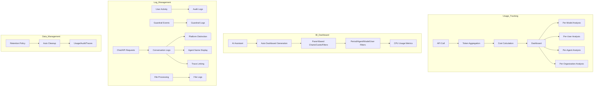

# Monitoring

> Track AI usage in real time and transparently audit all user activity. Achieve data-driven decision-making and security compliance simultaneously.

---

## Monitoring Overview

View usage, logs, and conversation history under **Admin > Monitoring**.

<!-- Screenshot: Monitoring main screen
     - Tabs: Audit Logs, Guardrail Logs, Conversation Logs, File Logs, Usage
     Filename: images/admin-monitoring-main.png
-->

### Tab Layout

| Tab | Function |
|----|------|
| **Dashboard** | BI dashboard -- panel-based charts, cards, filters, AI auto-generation |
| **Audit Logs** | User activity records |
| **KMS Audit** | KMS operation hash-chain log (wrap/unwrap/rotate, etc.) |
| **Guardrail Logs** | Guardrail detection and blocking records |
| **Conversation Logs** | Unified chat and Code Gateway usage logs |
| **File Logs** | File upload and processing history |
| **Usage** | Token usage, cost, and statistics |

---

## BI Dashboard

Create and manage panel-based BI dashboards under **Monitoring > Dashboard**. Combine chart, card, and filter panels to get a comprehensive view of your operations at a glance.

<!-- Screenshot: BI dashboard main screen
     Filename: images/admin-bi-dashboard.png
-->

### Panel Types

Dashboards are composed of individual panels. Each panel provides independent data visualization.

| Panel Type | Description |
|----------|------|
| **Chart** | Various chart types for data visualization (see chart types below) |
| **Card** | Summary cards showing key metrics at a glance |
| **Filter** | Period and condition filters applied across the entire dashboard |

#### Supported Chart Types

| Chart Type | Description | Use Case |
|----------|------|----------|
| **Line** | Shows trends over time | Daily token usage trend |
| **Bar** | Compares values across items | Usage count by model |
| **Grouped Bar** | Groups multiple series for comparison | Cost comparison by model and period |
| **Pie** | Shows proportional distribution | Usage ratio by agent |
| **Scatter** | Shows correlation between two variables | Response time vs token count |
| **Histogram** | Shows distribution of numeric data | Response time distribution |
| **Heatmap** | Shows value distribution in a 2D matrix | Usage by hour and day of week |

<!-- Screenshot: Panel type examples (chart, card, filter)
     Filename: images/admin-bi-dashboard-panels.png
-->

### Filtering

Filter data with various conditions across the dashboard.

| Filter | Description |
|------|------|
| **Period Filter** | Date range selection |
| **Agent** | Filter by specific agent |
| **Model** | Filter by specific model |
| **User** | Filter by specific user |

Filter selections undergo secondary validation to ensure only valid data is displayed.

### CPU Usage Metrics

Add CPU usage panels to the dashboard to monitor system resource status.

<!-- Screenshot: CPU usage panel
     Filename: images/admin-bi-dashboard-cpu.png
-->

| Metric | Description |
|------|------|
| **CPU Usage** | Current CPU utilization percentage |
| **Trend Chart** | CPU usage changes over time |

### AI Auto Dashboard Generation

Describe the dashboard you want in natural language and AI will automatically configure the panels.

<!-- Screenshot: AI dashboard generation agent
     Filename: images/admin-bi-dashboard-ai-generate.png
-->

**How to Use:**
1. Click the **"Generate with AI"** button
2. Describe the desired dashboard in natural language (e.g., "Show me token usage and cost by model for the last 7 days")
3. AI automatically generates the panel configuration
4. Manually adjust as needed

### AI Assistant -- Multi-Turn Conversational Builder

Build dashboards incrementally through conversation with the AI Assistant. Instead of a single prompt, engage in multiple exchanges to add and modify panels.

<!-- Screenshot: AI assistant multi-turn conversation screen
     Filename: images/admin-bi-dashboard-ai-assistant.png
-->

**Key Features:**
- Conversational dashboard builder -- add panels through dialogue, e.g., "Also add a cost chart by user"
- Modify existing dashboards -- "Change the period to 30 days"
- Request panel deletion and rearrangement
- DB connection test before dashboard generation

### DB Connection Test

The AI Assistant automatically tests the DB connection before generating a dashboard. Dashboards are only created when the connection is healthy, preventing errors proactively.

---

## Usage

### Dashboard Overview

<!-- Screenshot: Usage dashboard full view
     - Top: Key metric cards
     - Center: Charts
     - Bottom: Detail tables
     Filename: images/admin-usage-dashboard.png
-->

### Key Metrics

| Metric | Description |
|------|------|
| **Total Tokens** | All tokens used within the period |
| **Total Requests** | Number of API calls |
| **Total Cost** | Estimated cost (based on configured rates) |
| **Active Users** | Currently connected users |

<!-- Screenshot: Four key metric cards
     Filename: images/admin-usage-metrics.png
-->

### Usage Trend Chart

Visualize usage changes over time.

<!-- Screenshot: Usage trend line chart
     Filename: images/admin-usage-trend.png
-->

**Period Selection:**
- Last 7 days
- Last 30 days
- Custom period

### Usage by Model

See how much each AI model is being used.

<!-- Screenshot: Usage by model bar chart
     Filename: images/admin-usage-by-model.png
-->

| Analysis Item |
|----------|
| Tokens per model |
| Requests per model |
| Cost per model |

### Usage by Agent

Usage breakdown by workspace agent.

<!-- Screenshot: Usage by agent
     Filename: images/admin-usage-by-agent.png
-->

**Available Insights:**
- Which agents are used most frequently
- Cost efficiency per agent
- User distribution per agent

### Usage by User

View individual user usage.

<!-- Screenshot: Usage by user table
     Filename: images/admin-usage-by-user.png
-->

| Column | Description |
|------|------|
| **User** | Name, email |
| **Tokens** | Tokens used |
| **Requests** | Request count |
| **Cost** | Estimated cost |

### Usage by Group

Aggregate usage by permission group.

<!-- Screenshot: Usage by group table
     Filename: images/admin-usage-by-group.png
-->

### Usage by Organization

View usage by organizational unit (department).

<!-- Screenshot: Usage by organization table
     Filename: images/admin-usage-by-org.png
-->

**Example Use Cases:**
- AI budget allocation by department
- Adoption comparison across departments
- Cost sharing basis

### Usage by Type

Classify what tasks tokens are being used for.

<!-- Screenshot: Usage by type pie chart
     Filename: images/admin-usage-by-type.png
-->

| Type | Description |
|------|------|
| **CHAT** | General chat |
| **EMBEDDING** | Document embedding |
| **TITLE_GENERATION** | Title generation |
| **TAGS_GENERATION** | Tag generation |
| **QUERY_GENERATION** | Search query generation |
| **TOOL_CALL** | Tool invocation |
| **IMAGE_GENERATION** | Image generation |
| **IMAGE_PROMPT_GENERATION** | Image prompt generation |

### Daily Usage Limits

Set daily token usage limits per user, group, or organization.

<!-- Screenshot: Daily usage limit settings
     Filename: images/admin-usage-limit.png
-->

**Hierarchy:**
The **most generous value** across the 4-level hierarchy (global → user → group → organization) is applied.

| Setting | Description |
|------|------|
| **Global Limit** | Default limit set in admin settings |
| **Per-User Limit** | Individual limit per user |
| **Per-Group Limit** | Limit per permission group |
| **Per-Organization Limit** | Limit per organizational unit |

**Exceeded Behavior:**

| Mode | Description |
|------|------|
| **Warn** | Show toast notification only, allow requests |
| **Block** | Block additional requests when limit is exceeded |

**Graduated Warnings:**
- 80% reached: Caution toast
- 95% reached: Warning toast
- 100% reached: Request denied in block mode

### Filtering

Filter data with various conditions.

<!-- Screenshot: Filter options
     Filename: images/admin-usage-filters.png
-->

| Filter | Options |
|------|------|
| **Period** | Date range |
| **Model** | Specific model |
| **User** | Specific user |
| **Group** | Specific group |
| **Organization** | Specific department |

#### Cascading Filters

Usage filters operate in a **cascading** manner. When an upper-level filter is selected, lower-level filter options are automatically refreshed so that only valid combinations are selectable.

**Examples:**
- Selecting a period shows only users and models active during that period in the dropdowns
- Selecting a model shows only users and groups that used that model in the filter options

> This feature applies across Usage, Guardrail Logs, and Audit Logs.

### Export

Download usage data as CSV/JSON.

<!-- Screenshot: Export button
     Filename: images/admin-usage-export.png
-->

**Use Cases:**
- Executive report preparation
- Cost analysis
- External BI tool integration

---

## Conversation Logs

Administrators can view all users' chat and Code Gateway usage logs in a unified view.

<!-- Screenshot: Conversation logs main screen
     Filename: images/admin-conversation-logs.png
-->

### Key Statistics

| Metric | Description |
|------|------|
| **Total Requests** | Total requests in period |
| **Total Tokens** | Input + output token total |
| **Unique Users** | Active users in period |
| **Unique Models** | Number of models used |

### Log Information

| Field | Description |
|------|------|
| **Timestamp** | Request time |
| **User** | Requesting user |
| **Model** | AI model used |
| **Platform** | API or Web platform distinction |
| **Source** | Chat or Code Gateway |
| **Agent** | Agent name used for the request |
| **Input Preview** | User input summary |
| **Output Preview** | AI response summary |
| **Tokens** | Input/output token count |

<!-- Screenshot: Conversation logs platform and agent display
     Filename: images/admin-conversation-logs-platform.png
-->

### Platform Distinction

View the source platform for each request in conversation logs.

| Platform | Badge Color | Description |
|----------|-------------|-------------|
| **Web** | Gray | Chat requests through the web UI |
| **API** | Yellow | Direct calls using an API key |
| **Widget (Embed Widget)** | Purple | Requests originating from an embed widget — hover the badge to see the widget name |
| **Cursor** | Purple | Coding requests from the Cursor editor |
| **Claude Code** | Orange | Coding requests from Claude Code |
| **Codex CLI** | Green | Coding requests from Codex CLI |
| **Gemini CLI** | Blue | Coding requests from Gemini CLI |

> **Embed widget traffic isolation:** Conversations from embed widgets are tracked separately as **Widget** rather than rolled up into Web traffic. This enables widget-level usage analysis and per-host-site adoption metrics.

### Trace Button (Trace Linking)

Click the **"Trace"** button on each conversation log entry to view the full processing pipeline for that request in the **Evaluations > Tracing** screen.

<!-- Screenshot: Conversation log trace button
     Filename: images/admin-conversation-logs-trace.png
-->

### Full Request Body Display

View the full Request Body in the log detail view. Inspect the complete request content in JSON format for debugging and auditing purposes.

<!-- Screenshot: Request body detail view
     Filename: images/admin-conversation-logs-request-body.png
-->

### Filter Options

| Filter | Options |
|------|------|
| **Period** | Date range (default: last 7 days) |
| **Source Type** | Chat / Code Gateway |
| **Platform** | Web / API / Coding Tool |
| **Model** | Search by model |
| **User** | Search by user |
| **Agent** | Search by agent |

### Detail View

Click a log entry to view the full input/output content and Request Body.

---

## File Logs

Track file upload and processing history. View file processing status across knowledge bases, projects, and chats.

<!-- Screenshot: File logs main screen
     Filename: images/admin-file-logs.png
-->

### Log Information

| Field | Description |
|------|------|
| **Filename** | Uploaded file name |
| **Category** | File type (PDF, DOCX, etc.) |
| **Status** | Processing status (success/failed/processing) |
| **Source** | Origin (chat/knowledge/project) |
| **User** | Uploading user |
| **Timestamp** | Upload time |

### Filter Options

| Filter | Options |
|------|------|
| **Category** | Filter by file type |
| **Status** | Success / Failed / Processing |
| **Source** | Chat / Knowledge / Project |

### Detail View

Click a file log entry to view processing details (parsing results, vectorization status, error messages, etc.).

---

## Guardrail Logs

Records all events detected and blocked by guardrails connected to agents.

<!-- Screenshot: Guardrail log list
     Filename: images/admin-guardrail-logs.png
-->

### Recorded Events

| Type | Description |
|------|------|
| **PII Detection** | Detection of personal information such as social security numbers, credit card numbers, etc. |
| **Blocked Words** | Detection of messages containing prohibited terms |
| **Custom Patterns** | User-defined regex pattern detection |
| **LLM Judge** | LLM-based content risk assessment blocking |

### Log Information

| Field | Description |
|------|------|
| **Timestamp** | Event occurrence time |
| **User** | User who entered the input |
| **Agent** | Agent the guardrail was applied to |
| **Guardrail Type** | Detection method |
| **Detected Content** | Original input text |
| **Result** | Blocked, masked, or log only |

### Filter Options

| Filter | Options |
|------|------|
| **Period** | Date range selection |
| **Detection Pattern** | PII / Blocked Words / Custom Patterns / LLM Judge |
| **Source** | Chat / Code Gateway |
| **User** | Search by specific user |
| **Chat ID** | Search by specific chat |
| **Action** | Blocked / Masked / Log Only |

### Cascading Filters

Guardrail log filters also operate in a cascading manner. When an upper-level filter is selected, lower-level filter options are dynamically refreshed.

### Detail View and Tracing Integration

Click a log entry to view detected content in a detail modal.
Click the **"View Tracing"** button to view the full processing pipeline for that message in the **Evaluations > Tracing** screen.

---

## Audit Logs

### What Are Audit Logs?

Records all significant activities occurring in the system.

<!-- Screenshot: Audit log list
     Filename: images/admin-audit-logs.png
-->

### Recorded Activities

| Category | Example Activities |
|----------|----------|
| **Authentication** | Login, logout, failed login |
| **Users** | Create, modify, delete, **role change** (admin <-> user <-> pending) |
| **Chats** | Create, delete, share |
| **Workspace** | Agent/knowledge base CRUD |
| **Settings** | System setting changes (with before/after values) |
| **Permissions** | Access permission changes |

> **User Role Change Tracking:** When a user's role is changed, both the before and after values are recorded in audit logs. You can identify **who (actor) / when (timestamp) / whose (target user) / to what (new role)** the change was made, enabling full history tracking of privilege changes.

### Log Information

| Field | Description |
|------|------|
| **Timestamp** | Occurrence time |
| **User** | Who performed the activity |
| **Action** | Operation performed |
| **Resource Type** | Target resource type |
| **Resource ID** | Target resource identifier |
| **Changes** | Before/after values |
| **IP Address** | Request origin |

### Log Query

<!-- Screenshot: Audit log filtering UI
     Filename: images/admin-audit-filters.png
-->

**Filter Options:**

| Filter | Description |
|------|------|
| **Period** | 1 hour, 6 hours, 1 day, 7 days, 30 days, All |
| **Resource Type** | user, chat, model, knowledge, etc. |
| **Action** | create, update, delete, login, etc. |
| **User** | Search by specific user |

#### Cascading Filters

Audit log filters also operate in a cascading manner. When an upper-level filter is selected, lower-level filter options are dynamically refreshed.

### Log Detail View

Click a log entry to view detailed information.

<!-- Screenshot: Audit log detail modal
     Filename: images/admin-audit-detail.png
-->

**Displayed Information:**
- Full request information
- Before/after value comparison
- Related metadata

### Export

Audit logs can be exported as CSV.

<!-- Screenshot: Audit log export
     Filename: images/admin-audit-export.png
-->

**Use Cases:**
- Security audits
- Compliance reporting
- Incident investigation

---

## KMS Audit

A tamper-evident hash-chain audit log of every KMS (Key Management System) operation. Every call -- key rotation, envelope wrap/unwrap, data migration, and more -- is tracked.

> KMS configuration and the quick status view (recent 5 + Verify Integrity) live under **Admin > Settings > Encryption**. See the [Encryption (KMS) guide](./encryption.md) for details.

<!-- Screenshot: KMS Audit full viewer (filters + table)
     Filename: images/admin/monitoring-kms-audit.png
-->

### Location

The full viewer is available under **Admin > Monitoring > KMS Audit** tab.

### Recorded Information

| Field | Description |
|-------|-------------|
| **id** | Audit row identifier (sequence in the chain) |
| **Time (UTC)** | Operation timestamp |
| **Operation** | wrap / unwrap / rotate / health_check / provider_change / migrate / audit_export |
| **Result** | OK or FAIL |
| **Actor** | Performer (`actor_type:actor_id` format, e.g., `user:abc12345`) |
| **Config Path** | Affected PersistentConfig path (when applicable) |
| **IP** | Request origin IP |
| **Error** | Error code on failure |

### Filters

| Filter | Options |
|--------|---------|
| **Operation** | All operations / wrap / unwrap / rotate / health_check / provider_change / migrate / audit_export |
| **Result** | Any result / Success only / Failure only |

### Integrity Verification

Click **Verify Integrity** to validate every row in the chain by hash, sequentially.

| Result | Meaning |
|--------|---------|
| **Chain OK ({{count}} rows checked)** | All row hashes are valid. No tampering |
| **Chain broken at id={{id}}: {{reason}}** | Chain breaks starting at that id. Begin a security incident investigation |

> A broken chain means someone directly tampered with audit rows in the database. Investigate immediately.

### CSV Export

Audit logs can be exported as CSV. The **Export reason (recorded in audit chain)** field is required to enable export -- the export action itself is recorded in the chain as `audit_export` (e.g., for quarterly compliance review or incident investigation).

| Field | Description |
|-------|-------------|
| **Export reason** | Required. E.g., "quarterly compliance review". Recorded in the audit chain |
| **Export CSV** | Downloads the current filtered result set as CSV |

---

## Code Gateway Monitoring

View AI coding tool usage and guardrail logs separately under **Admin > Code Gateway**.

<!-- Screenshot: Code Gateway monitoring screen
     Filename: images/admin-code-gateway-monitoring.png
-->

### Usage Logs

Track token usage for API calls through Code Gateway by user and model.

| Metric | Description |
|------|------|
| **Total Requests** | Code Gateway API call count |
| **Total Tokens** | Input + output token total |
| **Unique Users** | Active user count |
| **Unique Models** | Number of models used |

**Filter Options:**

| Filter | Options |
|------|------|
| **Period** | Date range |
| **User** | Specific user |
| **Model** | Specific model |

### Guardrail Logs

Records detection and blocking events from guardrails integrated with Code Gateway. View file pattern blocking, content filtering, and other enforcement events.

---

## Data Retention Policy

Configure automatic deletion policies for log data under **Admin > Settings > Data Retention**.

<!-- Screenshot: Data retention settings screen
     Filename: images/admin-data-retention.png
-->

### Managed Data Types

| Data Type | Description |
|------------|------|
| **Usage Logs** | Token usage records |
| **Audit Logs** | User activity records |
| **Guardrail Logs** | Guardrail detection records |
| **Traces** | AI request processing tracking |
| **Trace Analysis** | LLM analysis reports |
| **Auto Evaluations** | Agent response quality evaluations |

### Settings

| Item | Description |
|------|------|
| **Retention Period (days)** | Set retention days per data type |
| **Current Row Count** | Shows current data count per table |
| **Enable Toggle** | Enable/disable auto cleanup per data type |

### Execute Cleanup

Click the **"Execute Cleanup"** button to immediately delete data exceeding the configured retention period.

> **Warning:** Deleted data cannot be recovered. Export necessary data before executing cleanup.

---

## Monitoring Use Cases

### Case 1: Monthly AI Cost Analysis

**Goal:** Identify AI usage costs by department

**Method:**
1. Go to the Usage tab
2. Set period: Current month
3. Review usage by organization
4. Export as CSV
5. Prepare executive report

<!-- Screenshot: Department cost analysis report example
     Filename: images/admin-usage-report-example.png
-->

### Case 2: Security Incident Investigation

**Goal:** Track suspicious activity

**Method:**
1. Go to the Audit Logs tab
2. Set period: Time of incident
3. Filter by related user/resource
4. Review activity history
5. Export logs (evidence preservation)

### Case 3: Agent Efficiency Evaluation

**Goal:** Analyze which agents are most effective

**Method:**
1. Go to the Usage tab
2. Review usage by agent
3. Compare usage frequency vs. token consumption
4. Improve or remove inefficient agents

### Case 4: Anomalous Usage Detection

**Goal:** Discover abnormal usage patterns

**Analysis Points:**
- Sudden usage spikes
- Heavy usage during non-business hours
- Excessive usage by a specific user
- Daily usage limit warning review

### Case 5: AI Coding Tool Management

**Goal:** Track AI coding tool usage through Code Gateway

**Method:**
1. Go to Code Gateway > Usage Logs
2. Review token usage by user and model
3. Check guardrail logs for blocked events
4. Adjust rate limits or model allow lists as needed

### Case 6: Operational Overview with AI Dashboard

**Goal:** Create a custom monitoring dashboard using natural language

**Method:**
1. Go to Monitoring > Dashboard
2. Click the **"Generate with AI"** button
3. Enter "Show me usage by agent and CPU utilization for the last 30 days"
4. AI automatically generates the panel configuration
5. Converse with the AI Assistant to add or modify panels
6. Save the completed dashboard

### Case 7: Conversation Audit

**Goal:** Review a specific user's AI usage history

**Method:**
1. Go to the Conversation Logs tab
2. Filter by target user
3. Review input/output previews
4. View full conversation in detail view

---

## Best Practices

### Regular Monitoring

| Frequency | Check Items |
|------|----------|
| **Daily** | Check for anomalous usage, review usage limit warnings |
| **Weekly** | Review usage trends, check guardrail logs |
| **Monthly** | Cost analysis, report preparation, review data retention policy |
| **Quarterly** | Overall adoption evaluation, adjust usage limits |

### Alert Configuration

Set up alerts for important events:
- Repeated login failures
- Permission changes
- Bulk data deletion
- Usage limit exceeded

### Data Retention

Establish a data retention policy:
- Configure per-type retention periods under **Admin > Settings > Data Retention**
- Minimum 1-year retention recommended (per compliance requirements)
- Export necessary data before cleanup execution
- Regular backups

### Cost Optimization

Optimize costs based on usage data:
- Disable underutilized models
- Recommend switching to more efficient models
- Review per-department usage limits
- Prevent unexpected costs with daily usage limits

---

## FAQ

**Q: How long is usage data retained?**
> By default, it is retained indefinitely. Configure per-type retention periods and enable auto cleanup under **Admin > Settings > Data Retention**.

**Q: Can I view chat content through audit logs?**
> Audit logs only contain activity records. Use the **Conversation Logs** tab to view chat content.

**Q: Is the cost calculation accurate?**
> Costs are calculated based on configured per-token rates. Actual billed amounts may differ, so use it as a reference.

**Q: Can I view usage for a specific user only?**
> Yes, use the user filter to query a specific user.

**Q: Is usage updated in real time?**
> Yes, the dashboard updates in real time.

**Q: Where can I check Code Gateway usage?**
> Under **Admin > Code Gateway > Usage Logs**, or filter by Code Gateway source in **Conversation Logs**.

**Q: What happens when a daily usage limit is exceeded?**
> In warn mode, only a toast notification is shown. In block mode, additional requests are blocked when the limit is exceeded. Users can send an inquiry to administrators from the sidebar.

**Q: How do I create a BI dashboard?**
> Under **Monitoring > Dashboard**, you can add panels manually or click the **"Generate with AI"** button to auto-generate a dashboard using natural language. You can also build dashboards incrementally through multi-turn conversation with the AI Assistant.

**Q: Can I distinguish between API and Web requests in conversation logs?**
> Yes, conversation logs display a platform field that distinguishes between Web, API, and coding tools (e.g., Cursor).

**Q: What are cascading filters?**
> A feature where selecting an upper-level filter automatically refreshes the options of lower-level filters. Available in Usage, Guardrail Logs, and Audit Logs.

**Q: Where can I check CPU usage?**
> Add a CPU usage panel in **Monitoring > Dashboard** to monitor it.

---

## Next Steps

- [Evaluations & Tracing](./tracing.md)
- [Notification Settings](./notifications.md)
- [User Permission Management](./users.md)
- [System Settings](./settings.md)
