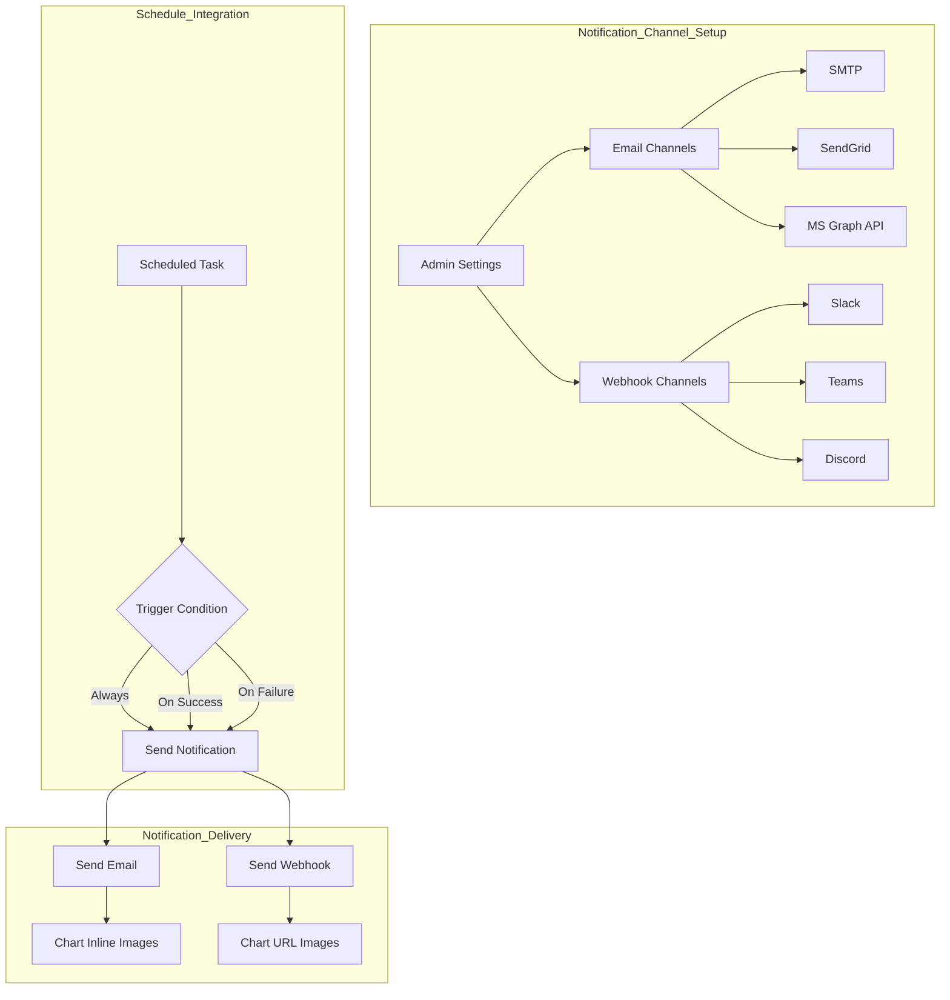

# Notification Settings

> Set up email and webhook notification channels to automatically deliver scheduled task results to your team. Supports SMTP, SendGrid, Slack, Teams, Discord, and more.

---

## Notification Overview

The notification system works with administrators pre-configuring channels, and users selecting those channels when creating scheduled tasks.

<!-- Screenshot: Notification settings main screen
     - Email channel list, webhook channel list
     Filename: images/admin-notifications-overview.png
-->

### Multi-Channel Architecture

| Type | Description |
|------|-------------|
| **Email Channels** | Email delivery via SMTP, SendGrid, or MS Graph API |
| **Webhook Channels** | Integration with external services like Slack, Teams, Discord |
| **Microsoft Teams Bot** | Two-way conversation with Cloosphere agents from inside Teams |

> **Note:** Once administrators configure channels, users can select them when creating scheduled tasks. The Teams bot is a conversational channel rather than a notification channel and is enabled separately.

---

## Email Channel Setup

Add email channels under **Admin > Settings > Notifications**.

<!-- Screenshot: Email channel add modal
     - Channel name, engine selection, SMTP/SendGrid settings
     Filename: images/admin-notifications-email-modal.png
-->

### Adding a Channel

Click the **"+ Add Email Channel"** button.

| Field | Description |
|-------|-------------|
| **Channel Name** | Identifier name (e.g., "Default", "Marketing Team") |
| **Engine** | Choose SMTP, SendGrid, or MS Graph API |

### SMTP Configuration

Connect to an internal mail server or external SMTP service.

<!-- Screenshot: SMTP settings form
     Filename: images/admin-notifications-smtp.png
-->

| Setting | Description | Example |
|---------|-------------|---------|
| **Server** | SMTP server address | smtp.gmail.com |
| **Port** | SMTP port | 587 (TLS) / 465 (SSL) |
| **Username** | Authentication account | noreply@company.com |
| **Password** | Authentication password | ●●●●●●●● |
| **Use TLS** | Enable TLS encryption | Enabled (port 587) |
| **Use SSL** | Enable SSL encryption | Enabled (port 465) |
| **From Address** | Email sender address | noreply@company.com |
| **From Name** | Email sender name | Cloosphere |

> **Note:** TLS and SSL cannot be used simultaneously. Typically, use TLS with port 587 and SSL with port 465.

### MS Graph API Configuration

Send emails via Azure AD (Microsoft Entra ID) authentication using Microsoft 365. If your organization uses Microsoft 365, you can configure email notifications without a separate SMTP server.

<!-- Screenshot: MS Graph API settings form
     - Azure AD authentication fields
     Filename: images/admin-notifications-msgraph.png
-->

| Setting | Description |
|---------|-------------|
| **Tenant ID** | Azure AD tenant ID |
| **Client ID** | Application (client) ID from Azure AD app registration |
| **Client Secret** | Client secret value from Azure AD app registration |
| **From Address** | Microsoft 365 user email address |
| **From Name** | Email sender name |

**Azure AD App Registration Requirements:**
- Requires the `Mail.Send` permission for Microsoft Graph API
- Configure either application permission or delegated permission
- Admin consent is required

> **Note:** MS Graph API uses the OAuth 2.0 client credentials flow, so it can send emails even in environments where SMTP authentication is disabled.

### SendGrid Configuration

Email delivery using the SendGrid API.

<!-- Screenshot: SendGrid settings form
     Filename: images/admin-notifications-sendgrid.png
-->

| Setting | Description |
|---------|-------------|
| **API Key** | SendGrid API key |
| **From Address** | Verified sender email |
| **From Name** | Email sender name |

### Connection Test

Click **"Test Connection"** to verify the mail server connection.

<!-- Screenshot: Connection test success message
     Filename: images/admin-notifications-email-test-connection.png
-->

| Result | Description |
|--------|-------------|
| **Success** | Server connection and authentication are working |
| **Authentication Failed** | Verify username and password |
| **Connection Failed** | Check server address, port, and firewall settings |
| **Timeout** | Verify network connectivity |

### Send Test Email

Click **"Send Test Email"** to send an actual email and verify proper operation.

<!-- Screenshot: Test email send form
     - Recipient email input
     Filename: images/admin-notifications-email-test-send.png
-->

1. Enter recipient email address
2. Click **"Send"**
3. Verify receipt

---

## Webhook Channel Setup

Integrate with external messaging services to send notifications.

<!-- Screenshot: Webhook channel add modal
     - Channel name, provider selection, URL input
     Filename: images/admin-notifications-webhook-modal.png
-->

### Adding a Channel

Click the **"+ Add Webhook Channel"** button.

| Field | Description |
|-------|-------------|
| **Channel Name** | Identifier name (e.g., "Dev Team Slack") |
| **Provider** | Slack / Teams / Discord / Google Chat |
| **Webhook URL** | Incoming webhook URL from the provider |

### Slack Webhook Setup

<!-- Screenshot: Slack webhook URL example
     Filename: images/admin-notifications-slack.png
-->

**How to create a webhook URL:**
1. Go to your Slack app management page and enable **Incoming Webhooks**
2. Click **Add New Webhook to Workspace**
3. Select a channel and click **Allow**
4. Copy the generated webhook URL (`https://hooks.slack.com/services/...`)

**Notification format:** Header block + Fields (Prompt, Completed At) + Section (Result) + Chart images

### Microsoft Teams Webhook Setup

<!-- Screenshot: Teams webhook URL example
     Filename: images/admin-notifications-teams.png
-->

**How to create a webhook URL:**
1. In the Teams channel, go to **Connectors** or **Workflows** settings
2. Add an **Incoming Webhook**
3. Set a name and click **Create**
4. Copy the generated webhook URL (`https://...webhook.office.com/...`)

**Notification format:** Adaptive Card 1.5 — TextBlock (title, result) + FactSet (info) + Table (auto-converted from markdown tables) + Chart images

### Discord Webhook Setup

<!-- Screenshot: Discord webhook URL example
     Filename: images/admin-notifications-discord.png
-->

**How to create a webhook URL:**
1. Go to Discord channel settings > **Integrations** > **Webhooks**
2. Click **New Webhook**
3. Set a name and click **Copy Webhook URL** (`https://discord.com/api/webhooks/...`)

**Notification format:** Embed — Title + Fields (Prompt, Status, Completed At) + Description (Result) + Chart image (first only)

### Google Chat Webhook Setup

<!-- Screenshot: Google Chat webhook URL example
     Filename: images/admin-notifications-googlechat.png
-->

**How to create a webhook URL:**
1. In the Google Chat space, go to **Apps & integrations** > **Add webhooks**
2. Enter a name and click **Save**
3. Copy the generated webhook URL (`https://chat.googleapis.com/v1/spaces/...`)

**Notification format:** Card V2 — Title, execution result, chart image, detail link button

### Test Webhook

Click the **"Test"** button to send a test message in the selected provider's format.

<!-- Screenshot: Webhook test success message
     Filename: images/admin-notifications-webhook-test.png
-->

---

## Microsoft Teams Bot

Configure an official bot under **Admin > Settings > Notifications > Teams Bot** that lets users talk to Cloosphere agents directly from Microsoft Teams. Unlike the one-way webhook channels above, this is a two-way conversation: users send messages in Teams, agents respond, and the full history is persisted inside Cloosphere.

<!-- Screenshot: Teams bot configuration screen
     - Azure Bot authentication, default agent, branding, manifest download
     Filename: images/admin-notifications-teams-bot.png
-->

### Benefits

- Employees use your internal AI agents without leaving Teams
- Conversations are stored in Cloosphere for audit and analytics
- Assign different agents to different teams (e.g., HR agent, IT agent)
- Multilingual responses

### Prerequisites

1. An Azure subscription with permission to create an Azure Bot
2. Permission to register applications in Microsoft Entra ID
3. Permission to upload custom apps in the Teams Admin Center
4. An existing Cloosphere agent or model

### Setup Steps

**Step 1: Register a bot app in Azure**

Create an Azure Bot (or Entra ID app registration) in the Azure Portal and note the following values.

| Item | Description |
|------|-------------|
| **App ID** | Client ID (GUID) of the Azure Bot / Entra app |
| **App Password** | Client secret issued from the Entra app registration |
| **Tenant ID** | Azure AD tenant ID (GUID). Use `common` for multi-tenant bots |

**Step 2: Enter credentials in Cloosphere**

Under **Admin > Settings > Notifications > Teams Bot**, toggle **"Enable Teams Bot"** on and fill in the following fields.

| Field | Description |
|-------|-------------|
| **App ID** | Client ID of the Azure Bot app |
| **App Password** | Client secret from the app registration |
| **Tenant ID** | The tenant GUID for single-tenant, or `common` for multi-tenant |
| **Default Agent** | The agent or model that responds by default in Teams |

> **Note:** Users can switch away from the default agent in Teams with the `/agent` command.

**Step 3: Register the Messaging Endpoint**

Copy the **Messaging Endpoint** URL that Cloosphere displays on the settings screen and paste it into **Azure Bot Configuration > Messaging endpoint** in the Azure Portal.

**Step 4: Enable the Teams channel**

In the Azure Bot **Channels** menu, add the **Microsoft Teams** channel.

**Step 5: Build and upload the Teams manifest**

In the **Branding** section, fill in the information that will be exposed through the Teams app listing.

| Item | Description |
|------|-------------|
| **Bot Name** | Display name shown in Teams (max 30 characters) |
| **Developer / Company Name** | Publisher name shown on the Teams app detail page |
| **Short Description** | One-line summary (max 80 characters) |
| **Full Description** | Long description for the app detail page |
| **Developer Website URL** | Used to derive privacy and terms URLs |
| **Color Icon** | 192×192 PNG/JPEG |
| **Outline Icon** | 32×32 transparent PNG (white silhouette) |
| **Accent Color** | Brand color used in Teams cards and headers (HEX, e.g., `#171717`) |

Click **"Download Teams Manifest"** to download a `manifest.zip` populated with your current settings. Upload it via Teams Admin Center or the Teams client's **Apps > Upload a custom app**, and your users can start chatting with the bot.

> **Tip:** You only need to re-download the manifest when the App ID, branding information, or deployment scopes change. Agent or prompt changes do not require re-upload.

**Step 6: Decide the deployment scope (Bot Scopes)**

In the **Deployment** section of the settings, choose which Teams surfaces the bot should appear on. The manifest is generated based on this choice, and **enabling Group chat / Team channel scopes adds RSC permissions to the manifest**, which require admin consent in the Teams Admin Center.

| Scope | Description |
|-------|-------------|
| **Personal (1:1 chat)** | One-on-one private conversations between a user and the bot. No extra permissions required, safest |
| **Team (channel @mention)** | Invoked in a Teams channel via `@bot`. Requires channel-message RSC permission |
| **Group chat** | Use the bot inside multi-party group chats. Requires group-chat RSC permission |

Multiple scopes can be enabled together. The **Default Group Capability** option only appears when more than one scope is enabled — it pins the default surface (team / groupchat / meetings) when the app is installed at team or org level. Set it to **Auto** to let Teams decide.

> **Note:** Whenever the deployment scope changes, regenerate and re-upload the manifest. For already-installed apps, update the package via the Teams Admin Center.

### Multi-Worker Session Synchronization

When Cloosphere runs with multiple workers (web/Gunicorn processes), the Teams bot's user-ID mapping, conversation context, and OAuth tokens are **shared via Redis**. So if a follow-up message lands on a different worker, it still resolves to the same Cloosphere user and chat history. Operators don't need to do anything beyond ensuring Redis is connected; there is no separate toggle in the UI.

### User Experience

- Users chat with the bot in a 1:1 conversation or @-mention it in a team channel
- The default agent responds automatically
- Conversations are stored like any other Cloosphere chat and appear in monitoring / audit logs

### Troubleshooting

| Symptom | What to Check |
|---------|---------------|
| **Bot does not respond** | Verify that the Azure Bot Messaging endpoint exactly matches the URL shown by Cloosphere |
| **Authentication errors** | Re-check App ID / App Password / Tenant ID. Verify the secret has not expired |
| **Manifest upload fails** | Make sure the Teams Admin Center policy allows uploading custom apps |
| **"Default agent is required" warning** | Select an agent or model in **Default Agent** before saving |

---

## Schedule Notification Integration

After administrators configure channels, users set up notifications when creating or editing scheduled tasks.

<!-- Screenshot: Schedule form notification settings area
     Filename: images/admin-notifications-schedule-delivery.png
-->

### Notification Configuration

| Setting | Description |
|---------|-------------|
| **Channel Type** | Email / Webhook (pre-configured) / Direct URL |
| **Channel Selection** | Select from admin-registered channel list |
| **Trigger Condition** | Always / On Success Only / On Failure Only |

### Trigger Conditions

| Condition | Description | Use Case |
|-----------|-------------|----------|
| **Always** | Notify on both success and failure | Critical schedules |
| **On Success Only** | Notify only on successful completion | Regular reports |
| **On Failure Only** | Notify only on errors | Failure detection |

### Multiple Notifications

Multiple notifications can be configured for a single schedule.

**Example configuration:**
- Notification 1: Email → Team Lead → Always
- Notification 2: Slack Webhook → Dev Team Channel → On Failure Only
- Notification 3: Teams Webhook → Management Channel → On Success Only

---

## Chart Image Delivery

Charts generated by database (DbSphere) agents are converted to PNG images via Plotly-based server-side rendering.

<!-- Screenshot: Email notification with chart example
     Filename: images/admin-notifications-chart-email.png
-->

### Delivery by Channel

| Channel | Method | Description |
|---------|--------|-------------|
| **Email** | Inline Base64 | Images embedded directly in the body |
| **Slack** | Image URL | Displayed as image blocks |
| **Teams** | Adaptive Card Image | Image elements within the card |
| **Discord** | Embed Image | First chart only |

> **Note:** Chart images are automatically extracted before notification delivery and sent as separate images. Chart markers are removed from the notification body for clean text delivery.

---

## Troubleshooting

### Email Issues

| Symptom | What to Check |
|---------|---------------|
| **Connection Failed** | Verify server address and port. Check if SMTP port is allowed in the firewall |
| **Authentication Failed** | Verify username/password. Google requires app-specific passwords |
| **Email Not Received** | Check recipient's spam folder. Verify SPF/DKIM settings for the sender domain |
| **TLS Error** | Verify TLS/SSL setting and port combination (587-TLS, 465-SSL) |
| **SendGrid Error** | Check API key permissions. Verify sender address is authenticated |

### Webhook Issues

| Symptom | What to Check |
|---------|---------------|
| **Delivery Failed** | Verify webhook URL validity. Check if URL has expired |
| **Message Not Displayed** | Check target channel/app permissions. Verify bot has channel access |
| **Timeout** | Verify network connectivity. Check if outbound HTTPS requests are allowed in the firewall |
| **Format Broken** | Verify provider setting (correct selection of Slack/Teams/Discord) |

### General Issues

| Symptom | What to Check |
|---------|---------------|
| **No Notifications** | Check schedule notification settings. Verify trigger conditions are correct |
| **No Chart Images** | Verify the agent is connected to DbSphere |
| **Template Variables Not Replaced** | Verify `{{variable_name}}` format is correct |

---

## External API Authentication (Trusted Audiences)

The Notifications settings page also surfaces a **Trusted Audiences** section. It registers a whitelist of audiences (client IDs) for which Cloosphere accepts external SSO ID tokens (Microsoft Entra / Google) directly on its API endpoints — letting host systems call the API with their own SSO tokens.

<!-- Screenshot: Trusted Audiences section at the bottom of the Notifications settings
     Filename: images/admin-notifications-trusted-audiences.png
-->

For registration steps and behavior, see [User Management — External IDP ID Token Passthrough Authentication](./users.md#external-idp-id-token-passthrough-authentication-trusted-audiences).

---

## SR (Service Request) System

Manage service requests and integrate them with notifications through the SR system.

<!-- Screenshot: SR system settings screen
     Filename: images/admin-notifications-sr-system.png
-->

### What Is the SR System?

SR (Service Request) is a system for systematically receiving, tracking, and processing user service requests. It integrates with notification channels to automatically send alerts to relevant parties when request status changes.

### Key Features

| Feature | Description |
|---------|-------------|
| **Request Submission** | Users create service requests and route them to administrators |
| **Status Tracking** | Track request processing status in real time (Received, In Progress, Completed, Rejected) |
| **Notification Integration** | Automatically send notifications via email/webhook channels on status changes |
| **History Management** | Record and view all requests and processing history |

### Notification Integration Setup

Connect notification channels to events generated by the SR system.

| Event | Description | Notification Target |
|-------|-------------|-------------------|
| **Request Created** | A new service request has been submitted | Administrators/Assignees |
| **Status Changed** | The request status has been updated | Requester |
| **Comment Added** | A new comment was added to the request | Related parties |
| **Processing Complete** | The service request has been completed | Requester |

> **Note:** SR system notifications reuse the email and webhook channels configured by administrators. You can leverage existing notification infrastructure without setting up separate channels.

---

## Next Steps

- [Creating Scheduled Tasks](../schedules.md)
- [System Settings](./settings.md)
- [User Management](./users.md)
- [Monitoring](./monitoring.md)
