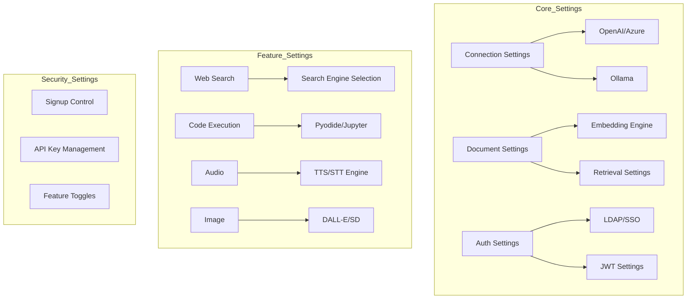

# System Settings

> Manage all Cloosphere system configurations in one place, from AI model connections to security settings. Build a secure and efficient AI platform with optimal settings for your enterprise environment.



---

## Settings Overview

Manage system-wide settings under **Admin > Settings**.

<!-- Screenshot: Settings main screen (tab list)
     Filename: images/admin-settings-main.png
-->

### Settings Tab Layout

| Tab | Function |
|----|------|
| **General** | Authentication, feature toggles |
| **Connections** | AI model connections |
| **Models** | Model management |
| **Documents** | RAG settings |
| **Search Engine** | Vector DB settings |
| **Web Search** | Web search engine |
| **Code Execution** | Code interpreter |
| **Interface** | UI settings |
| **Audio** | TTS/STT settings |
| **Image** | Image generation |
| **Pipelines** | Pipeline management |
| **Tools** | Tool servers |
| **Notifications** | Notification channel settings |
| **Data Retention** | Log auto-cleanup and worker queue management |
| **Branding** | Logo and favicon customization |
| **License** | License key registration and management |

---

## General Settings

### Authentication Settings

<!-- Screenshot: General > Authentication settings section
     Filename: images/admin-settings-auth.png
-->

| Setting | Description | Recommended |
|---------|-------------|-------------|
| **Allow Signup** | New user self-registration | Disabled (when using SSO) |
| **Enable Onboarding** | Whether to show the onboarding landing page to unauthenticated visitors | Enable only on public/marketing instances |
| **Default Role** | Role for new users | Pending (approve after review) |
| **Enable API Keys** | Allow API key authentication | Enable only when needed |
| **JWT Expiration** | Session validity period | 8 hours recommended |

> **Onboarding toggle:** Located right below "Allow Signup", the **Enable Onboarding** switch controls whether first-time visitors see the onboarding (landing) page. Internal/private instances usually leave this off; turn it on only for external marketing or demo deployments.

### LDAP Settings

Configure unified authentication by integrating with a corporate LDAP server.

<!-- Screenshot: Full LDAP settings
     Filename: images/admin-settings-ldap.png
-->

| Setting | Description |
|------|------|
| **Server Host** | LDAP server address |
| **Port** | Connection port (389/636) |
| **Application DN** | Bind account DN |
| **Password** | Bind account password |
| **Search Base** | User search base |
| **Email Attribute** | Email mapping attribute |
| **Username Attribute** | Username mapping attribute |
| **Use TLS** | Encrypted communication |

### Usage Limit

Set daily token usage limits to manage AI costs.

<!-- Screenshot: Usage limit settings section
     Filename: images/admin-settings-usage-limit.png
-->

| Setting | Description | Default |
|---------|-------------|---------|
| **Enable Usage Limit** | Toggle usage limit feature ON/OFF | Disabled |
| **Default Daily Token Limit** | Default limit applied to all users without individual limits | 0 (unlimited) |
| **Exceed Action** | How to handle limit exceedance | Warn |

**Exceed Action options:**
- **Warn**: Shows a warning message but allows usage (for monitoring)
- **Block**: Prevents further requests (returns HTTP 429)

> **Note:** Admin role users are exempt from usage limit checks.

**Hierarchical limit settings:**

Usage limits can be set at 4 levels (global, user, group, organization), and the **most generous (highest) value** among all settings is applied.

| Level | Setting Location | Description |
|-------|-----------------|-------------|
| **Global Default** | Admin > Settings > General | Applied to all users by default |
| **Per User** | Admin > Users > Edit User | Applied to specific users only |
| **Group** | Admin > Users > Groups > Edit Group | Applied to all users in the group |
| **Organization** | Admin > Users > Organizations > Select Team | Applied to all users in the org unit |

**Progressive warnings:**

Warnings are automatically displayed when sending messages based on usage percentage.

| Usage | Behavior |
|-------|----------|
| 80%+ | Warning toast displayed |
| 95%+ | Error toast ("Limit will be reached soon") |
| 100%+ (warn mode) | Error toast ("Contact admin") |
| 100%+ (block mode) | Request blocked ("Try again tomorrow") |

### Feature Toggles

<!-- Screenshot: Feature toggles section
     Filename: images/admin-settings-features.png
-->

| Feature | Description |
|------|------|
| **Community Sharing** | OpenWebUI community sharing |
| **Message Rating** | Response rating feature |
| **Channels** | Team chat channel feature |
| **Webhook** | External webhook integration |

---

## Connection Settings

Configure connections to AI model providers.

### OpenAI Connection

<!-- Screenshot: OpenAI connection settings
     Filename: images/admin-settings-openai.png
-->

**Setup:**
1. **API Base URL**: OpenAI or compatible API address
2. **API Key**: Enter API key
3. **Test Connection**: Verify connectivity

**Azure OpenAI Connection:**
```
URL: https://{resource-name}.openai.azure.com/
API Key: Key issued from Azure
```

**AI Foundry Connection:**
```
URL: https://{project-name}.{region}.models.ai.azure.com/
API Key: Key issued from AI Foundry
```

**Benefits:**
- Connect to various OpenAI-compatible services (Azure OpenAI, AI Foundry, etc.)
- Configure multiple connections simultaneously (load balancing)
- Connect to APIs within private networks

### Ollama Connection

Connect to local or on-premises Ollama instances.

<!-- Screenshot: Ollama connection settings
     Filename: images/admin-settings-ollama.png
-->

**Setup:**
1. **Base URL**: Ollama server address
2. Multiple servers can be added (load balancing)

**Benefits:**
- Complete data privacy
- No external network required
- Cost savings

### Direct Connection

Allow users to connect directly with their own API keys.

<!-- Screenshot: Direct connection toggle
     Filename: images/admin-settings-direct.png
-->

---

## Model Settings

Manage models available through connected APIs.

### Model List

<!-- Screenshot: Model list screen
     Filename: images/admin-settings-models.png
-->

| Field | Description |
|------|------|
| **Model Name** | Displayed model name |
| **ID** | API model ID |
| **Enabled** | Availability status |
| **Hidden** | Hidden from list |

### Enable/Disable Models

Restrict usage to specific models only.

<!-- Screenshot: Model enable toggle
     Filename: images/admin-settings-model-toggle.png
-->

### Arena Model Settings

> **Change Notice:** Arena model settings have been moved to **Admin > Evaluations > Arena**. Model pool configuration, matching rules, and other arena settings are now managed in the Evaluations section.

### Default Model per Use Case

You can assign a default model for each use case. When users do not explicitly select a model, the default model configured for that use case is automatically applied.

<!-- Screenshot: Default model per use case settings
     Filename: images/admin-settings-default-models.png
-->

| Use Case | Description |
|----------|-------------|
| **Chat Default Model** | Default model for general chat conversations |
| **Search Query Generation** | Model used for automatic RAG search query generation |
| **Title/Tag Generation** | Model for auto-generating chat titles and tags (task model in Interface settings) |

> **Note:** Default models per use case are configured globally by administrators. Users can still manually select a different model during chat.

### Import/Export Models

Back up and restore model settings as JSON.

---

## Document Settings (RAG)

Knowledge base and RAG system settings.

### Document Processing Profiles

A profile system is provided to select the optimal processing method based on document type and purpose.

<!-- Screenshot: Document processing profile settings
     Filename: images/admin-settings-doc-profiles.png
-->

| Profile | Description | Suitable Documents |
|---------|-------------|--------------------|
| **Default** | Text extraction + fixed-size chunking | General text documents |
| **LLM Vision Extraction** | Uses LLM vision models to extract text from images/complex layouts | Scanned documents, complex tables, infographics |
| **Semantic Chunking** | Automatically splits documents by semantic units | Long reports, technical documents |
| **Contextual Chunking** | Adds full document context to each chunk for improved search accuracy | FAQs, manuals |

**Profile application:**
- Set a global default profile
- Assign individual profiles per knowledge base
- Select a profile during file upload

> 💡 **Tip**: LLM Vision extraction is especially effective for PDFs with images or scanned documents. Note that additional LLM call costs apply.

### Content Extraction

Configure the engine for extracting text from documents.

<!-- Screenshot: Content extraction settings
     Filename: images/admin-settings-extraction.png
-->

| Engine | Features |
|------|------|
| **Default** | Built-in extractor |
| **Tika** | Apache Tika server |
| **Docling** | Advanced document processing |
| **Document Intelligence** | Azure AI service |
| **Document AI** | Google Cloud Document AI (Layout Parser) — complex layouts (tables, forms, multi-column) |
| **Mistral OCR** | Mistral OCR |

### Embedding Settings

Configure how documents are converted to vectors.

<!-- Screenshot: Embedding settings
     Filename: images/admin-settings-embedding.png
-->

| Setting | Description |
|------|------|
| **Embedding Engine** | Embedding service to use |
| **Embedding Model** | Model selection |
| **Batch Size** | Number of documents per batch |

**Supported Engines:**
- SentenceTransformers (local)
- OpenAI
- Azure OpenAI
- Ollama
- Gemini
- Vertex AI

### Retrieval Settings

<!-- Screenshot: Retrieval settings
     Filename: images/admin-settings-retrieval.png
-->

| Setting | Description | Recommended |
|------|------|------|
| **Top K** | Number of search results | 5 |
| **Relevance Threshold** | Minimum similarity | 0.0 |
| **Hybrid Search** | Keyword + semantic search | Enabled |
| **Reranking** | Result reordering | Enabled |

### File Upload Limits

<!-- Screenshot: Upload limit settings
     Filename: images/admin-settings-upload.png
-->

| Setting | Description |
|------|------|
| **Max File Size** | Maximum size per file |
| **Max File Count** | Number of files per upload |

### Cloud Storage

<!-- Screenshot: Cloud storage toggle
     Filename: images/admin-settings-cloud.png
-->

| Storage | Setting |
|----------|------|
| **Google Drive** | Enable/Disable |
| **OneDrive** | Enable/Disable |
| **SharePoint** | Enable/Disable |

---

## Search Engine Settings

Vector database settings.

<!-- Screenshot: Search engine settings
     Filename: images/admin-settings-search-engine.png
-->

### Supported Engines

| Engine | Features |
|------|------|
| **Chroma** | Lightweight, local use |
| **pgvector** | PostgreSQL extension (halfvec support) |
| **Milvus** | Large-scale distributed processing |
| **Azure AI Search** | Azure managed service |
| **Elasticsearch** | Hybrid search |

### Search Settings

Configure search result count and reranker for the search engine.

| Setting | Description | Recommended |
|---------|-------------|-------------|
| **Top K** | Number of search results | 10 |
| **Reranker Top K** | Results after reranking | 3 |
| **Reranker Threshold** | Minimum relevance score after reranking (0–1). Results below this threshold are filtered out. | 0.0 (no filtering) |

---

## Web Search Settings

Configure AI to perform web searches.

### Search Engine Selection

<!-- Screenshot: Web search engine selection
     Filename: images/admin-settings-web-search.png
-->

**Supported Search Engines:**
- SearXNG
- Google PSE
- Brave Search
- DuckDuckGo
- Bing
- Tavily
- 15+ other engines

### Search Settings

<!-- Screenshot: Web search detail settings
     Filename: images/admin-settings-web-search-detail.png
-->

| Setting | Description |
|------|------|
| **Result Count** | Number of search results |
| **Concurrent Requests** | Parallel search count |
| **Domain Filter** | Allowed/blocked domains |

### Web Loader

Engine for fetching web page content.

| Engine | Features |
|------|------|
| **Default** | Simple HTTP request |
| **Playwright** | JavaScript rendering |
| **Firecrawl** | Advanced web crawling |
| **Tavily** | AI-optimized extraction |

---

## Code Execution Settings

Configure AI to execute code.

<!-- Screenshot: Code execution settings
     Filename: images/admin-settings-code.png
-->

### Execution Engines

| Engine | Features | Security |
|------|------|------|
| **Pyodide** | In-browser execution | Safe |
| **Jupyter** | Server execution | Caution required |

### Jupyter Settings

| Setting | Description |
|------|------|
| **Server URL** | Jupyter server address |
| **Token** | Authentication token |
| **Timeout** | Execution time limit |

---

## Interface Settings

Auto-generation and UI-related settings.

<!-- Screenshot: Interface settings
     Filename: images/admin-settings-interface.png
-->

### Task Model

| Setting | Description |
|------|------|
| **Task Model** | Model for title/tag generation |
| **External Model** | Use a separate API |

### Auto-Generation

| Feature | Description |
|------|------|
| **Title Generation** | Auto-generate chat titles |
| **Tag Generation** | Auto-generate chat tags |
| **Autocomplete** | Input autocomplete |
| **Search Query Generation** | Auto-generate RAG search queries |

### Prompt Suggestions

Configure default prompt suggestions.

<!-- Screenshot: Prompt suggestion settings
     Filename: images/admin-settings-suggestions.png
-->

### Banner

Configure system announcement banners.

<!-- Screenshot: Banner settings
     Filename: images/admin-settings-banner.png
-->

---

## Audio Settings

Voice input/output settings.

<!-- Screenshot: Audio settings
     Filename: images/admin-settings-audio.png
-->

### TTS (Text-to-Speech)

| Setting | Options |
|------|------|
| **Engine** | System, OpenAI, Azure, Google Cloud TTS, Gemini TTS |
| **Model** | Per-engine model |
| **Voice** | Voice selection |

### STT (Speech-to-Text)

| Setting | Options |
|------|------|
| **Engine** | System, OpenAI, Azure, Deepgram, Google Cloud STT |
| **Model** | Whisper model, etc. |

### Avatar

Display an avatar with AI responses.

<!-- Screenshot: Avatar settings
     Filename: images/admin-settings-avatar.png
-->

---

## Image Settings

AI image generation settings.

<!-- Screenshot: Image settings
     Filename: images/admin-settings-images.png
-->

### Supported Engines

| Engine | Features |
|------|------|
| **DALL-E** | OpenAI image generation |
| **Azure OpenAI** | Azure gpt-image-1 -- quality, format, and background options |
| **Vertex AI** | Google Gemini image generation (OAuth2 token caching) |
| **Automatic1111** | Stable Diffusion WebUI |
| **ComfyUI** | Node-based image generation |

### Azure OpenAI Image Settings

| Setting | Description | Options |
|------|------|------|
| **Quality** | Image quality | standard / hd |
| **Output Format** | Output format | url / b64_json |
| **Background** | Background handling | auto / transparent / opaque |

> Default image size is **1024x1024**.

### Model Management

Configure available image models.

---

## Pipeline Settings

Manage custom processing pipelines.

<!-- Screenshot: Pipeline settings
     Filename: images/admin-settings-pipelines.png
-->

### Pipeline Management

| Feature | Description |
|------|------|
| **Installed Pipelines** | Currently active pipelines |
| **Download** | Install from registry |
| **Upload** | Install custom pipelines |
| **Valves Settings** | Per-pipeline configuration |

---

## Tool Server Settings

Manage global tool server connections.

<!-- Screenshot: Tool server settings
     Filename: images/admin-settings-tools.png
-->

---

## Code Gateway Settings

Manage policies for AI coding tools (Cursor, Codex CLI, Gemini CLI, Claude Code, etc.) accessing LLM APIs.

<!-- Screenshot: Code Gateway settings page
     Filename: images/admin-settings-code-gateway.png
-->

### Global Guardrail Integration

Global guardrails can also be applied to requests through Code Gateway.

| Setting | Description |
|---------|-------------|
| **Follow Global Guardrail** | When the `follow_global_guardrail` toggle is enabled, system-wide guardrails (input/output filtering) are equally applied to Code Gateway requests |

### Multi-Client Support

Various AI coding tools are supported.

| Client | Support Status |
|--------|---------------|
| **Claude Code** | One-click setup supported |
| **Cursor** | Hook metadata collection supported |
| **Codex CLI** | API-compatible support |
| **Gemini CLI** | API-compatible support |
| **Other OpenAI-compatible tools** | Integration via API Base URL configuration |

### Cursor Hook Metadata Collection

Automatically collects project metadata from Cursor editor requests.

<!-- Screenshot: Cursor Hook metadata settings
     Filename: images/admin-settings-code-gateway-cursor.png
-->

**Collected items:**
- Repository name and path
- Branch information
- Project language/framework
- User identification information

### Output Guardrails

Output guardrails can be applied to AI responses through Code Gateway.

| Setting | Description |
|---------|-------------|
| **Code Output Filtering** | Prevents code generation containing sensitive information (API keys, credentials, etc.) |
| **License Compliance Check** | Checks license compatibility of generated code |

### Repository Tracking

Track which project (git repository) AI coding tool requests originate from.

| Setting | Description |
|---------|-------------|
| **Blocked Repositories (Blocked Repos)** | Block access from specific repository patterns |
| **Require Metadata (require_repo_metadata)** | Reject requests that do not include repository information |

> 💡 Repository information is automatically transmitted via the API key or request headers.

### Claude Code Support

One-click setup is available for Claude Code users. Installation commands can be found in the Developer Guide tab.

**Setup:**
1. Go to Code Gateway settings and select the **Developer Guide** tab
2. Choose your OS (Linux/macOS or Windows)
3. Paste the displayed install command into your terminal
4. Helper scripts and authentication are automatically configured

---

## Notification Settings

Configure system notification channels.

<!-- Screenshot: Notification settings screen
     Filename: images/admin-settings-notifications.png
-->

### Notification Channels

| Channel | Description |
|---------|-------------|
| **Webhook** | Send notifications to external URLs (Slack, Teams, etc.) |
| **MS Graph API Email** | Send email notifications via Microsoft Graph API |

### MS Graph API Email Settings

Send email notifications via Graph API in Microsoft 365 environments.

<!-- Screenshot: MS Graph API email settings
     Filename: images/admin-settings-notifications-msgraph.png
-->

| Setting | Description |
|---------|-------------|
| **Tenant ID** | Azure AD tenant ID |
| **Client ID** | Registered app client ID |
| **Client Secret** | Client secret |
| **Sender Email** | Email address to send notifications from |

**Notification targets:**
- Notify admins when usage limit thresholds are reached
- Notify admins when user inquiries are submitted
- Notify on system errors

> **Note:** To use MS Graph API email, you need an app registration in Azure AD with the `Mail.Send` permission granted.

---

## Data Retention

Manage automatic log cleanup policies and background worker queue tools under **Admin > Settings > Data Retention**.

<!-- Screenshot: Data retention tab main screen
     Filename: images/admin-data-retention.png
-->

> For the full workflow of per-type retention periods (Usage / Audit / Guardrail / Trace, etc.), see the [Monitoring guide -- Data Retention Policy](./monitoring.md). This section focuses on the settings-tab UI items.

### Auto Cleanup

| Item | Description |
|------|-------------|
| **Enable Auto Cleanup** | Automatically deletes logs exceeding their retention period each day |
| **Cleanup Time** | Hour of day the auto cleanup runs (00:00 -- 23:00) |

### Retention Settings

Enter retention days for each log type. **0 = permanent storage**.

| Type | Description |
|------|-------------|
| **Usage Logs** | Token usage records |
| **Audit Logs** | User activity records |
| **Guardrail Logs** | Guardrail detection records |
| **Traces** | AI request processing trace |
| **Trace Analysis** | LLM analysis reports |
| **Auto Evaluations** | Agent response auto evaluations |

Each type displays its current row count so you can review the impact before cleanup.

### Manual Cleanup

Click **Run Cleanup Now** to save the current settings and immediately delete records exceeding their retention period.

> **Caution:** Deleted data cannot be recovered. Export to CSV first if you need a backup.

### Worker Auto Cleanup

Automatically cleans up zombie consumers and stuck messages in the Redis-Streams-backed background worker queue. Active workers and in-progress jobs are never affected.

<!-- Screenshot: Worker auto cleanup settings (zombie idle threshold, stuck idle threshold, cleanup interval)
     Filename: images/admin/data-retention-worker-cleanup.png
-->

| Item | Description | Recommended |
|------|-------------|-------------|
| **Worker Auto Cleanup** | Toggle to enable auto cleanup of zombie/stuck messages | Enable in production |
| **Zombie consumer idle threshold (hours)** | Delete only consumers idle longer than this AND with 0 pending | 1 |
| **Stuck message idle threshold (hours)** | Force-ack pending messages older than this. Set longer than your longest job | 1 |
| **Cleanup interval (minutes)** | How often the auto cleanup runs | 60 |

#### Zombie vs Stuck

| Type | Meaning |
|------|---------|
| **Zombie consumer** | A worker process has exited but its Redis Streams consumer registration remains -- safe to delete only when pending = 0 |
| **Stuck message** | A message that was consumed but not ack'd before the idle threshold elapsed -- gets force-ack'd; the actual job will NOT run (permanently lost) |

> **Operations tip:** Set the stuck-message idle threshold comfortably longer than your longest job (e.g., large file processing, embedding batches). If too short, in-progress jobs will be force-ack'd and lost.

Active workers, in-progress jobs, and healthy queue messages are unaffected, so this can be safely enabled in production.

---

## Branding Settings

Customize the platform appearance to match your corporate identity.

> **License Required:** Available on Professional tier and above.

<!-- Screenshot: Branding settings screen
     Filename: images/admin-settings-branding.png
-->

| Item | Description |
|------|------|
| **Favicon** | Browser tab icon (.png, .ico supported) |
| **Logo** | Sidebar and login screen logo |
| **Splash Image** | App initial loading screen background image |

**Setup:**
1. Go to the Branding tab
2. Click **"Upload"** for each item
3. Select image file
4. Save (applied immediately)

**Reset:**
Use the delete button on the right side of each item to restore the default Cloosphere images.

---

## License Settings

Manage license keys that unlock Cloosphere features.

<!-- Screenshot: License settings screen
     Filename: images/admin-settings-license.png
-->

### Tier Structure

| Tier | Included Features |
|------|----------|
| **Basic** | Basic chat, Agents (basic), User management |
| **Standard** | Basic + Audit logs, Glossary, Guardrails, Image generation, KbSphere, Tools |
| **Professional** | Standard + Flows, Branding, DbSphere, Auto evaluations, Tracing |

### Key Types

| Type | Description |
|------|------|
| **License Key** | Specifies tier, includes max user count and expiration date |
| **Feature Key** | Enables specific modules independently of tier |

### License Registration

1. Obtain a license key from Cloocus
2. Go to **Admin > Settings > License**
3. Enter the key and click **"Register"**
4. Verify status (expiration date, tier, max user count)

> **Note:** If the `ENABLE_LICENSE_ENFORCEMENT` environment variable is set to `false` (default), all features are available without a license. Set it to `true` when feature control is needed in enterprise environments.

---

## Multi-Worker Operations

Cloosphere can run as a single process, with multiple Gunicorn / Uvicorn workers, or across several container instances. Operators should understand the following behaviors when running in this mode.

### Automatic Propagation of PersistentConfig / OAuth Settings

System settings stored in the database (values managed by PersistentConfig) and OAuth provider settings are **propagated to every worker via a Redis pub/sub channel**. Updating a setting from the admin UI on one worker is reflected on all other workers immediately, with no restart required.

| Item | Behavior |
|------|----------|
| **Change detection** | Workers subscribe to the Redis channel at startup and receive every PersistentConfig change |
| **Effective time** | All workers pick up the new value as soon as it is published (no restart) |
| **OAuth providers** | The OAuth manager also subscribes to the same channel, so provider changes are synchronized across workers |

> **Operations tip:** Nothing extra needs to be done. As long as Redis is reachable, propagation is automatic, and the admin UI will not appear to be out of sync between workers.

### Idempotent Migrations + Fail-Loud Policy

Database schema migrations are written to be **idempotent**, so they can be re-run safely even on a "zombie" schema (where a previous migration left partial artifacts). When an unexpected error occurs during migration, a **fail-loud policy** halts execution and logs the error immediately — the service will not silently boot on a corrupted schema.

| Item | Behavior |
|------|----------|
| **Re-run safety** | Applying the same migration multiple times causes no damage (already-applied changes are skipped automatically) |
| **Partial-apply recovery** | If a previous migration left only some changes applied, the next run completes the missing pieces |
| **Fail-loud** | Unexpected errors surface immediately rather than being swallowed — services do not start with a broken schema |

The operator command is unchanged:

```bash
cd backend && alembic upgrade head
```

> **Migration authoring rules:** Alembic `--autogenerate` is forbidden, and every DDL statement must be guarded by an inspector check (does the column / index already exist?) so that the migration is idempotent. Custom migrations must follow the same rule.

---

## Settings Backup and Restore

### Export Settings

Save current settings as a JSON file.

### Import Settings

Restore settings from a backup.

---

## Best Practices

### Security Settings

1. **Disable Signup**: Block self-registration in SSO environments
2. **Use Pending Role**: Review and approve new users
3. **Set JWT Expiration**: Configure appropriate session duration

### AI Model Settings

1. **Prefer Azure OpenAI**: Secure connection for enterprise environments
2. **Restrict Models**: Enable only necessary models
3. **Load Balancing**: Configure multiple connections

### RAG Settings

1. **Enable Hybrid Search**: More accurate search results
2. **Enable Reranking**: Improve result quality
3. **Appropriate Top K**: Too many results increase noise

---

## FAQ

**Q: Do settings changes take effect immediately?**
> Most changes apply immediately. Some settings may require a service restart.

**Q: I can't access the system after a bad configuration change.**
> You can restore default settings via environment variables or modify the database directly. Contact your IT administrator.

**Q: Is there a risk of API key exposure?**
> API keys are stored encrypted and cannot be viewed again from the UI.

### Config Sensitive Data Encryption

Sensitive data in system settings (API keys, secrets, credentials, etc.) is automatically encrypted before storage.

| Protection | Description |
|------------|-------------|
| **Encryption at Rest** | AES encryption applied when saving to the database |
| **API Masking** | Sensitive fields are masked in REST API responses (e.g., `sk-****...****9d`) |
| **Log Exclusion** | Sensitive data is automatically excluded from audit logs and system logs |

> **Note:** The `WEBUI_SECRET_KEY` environment variable is used as the encryption key. Changing this key will make it impossible to decrypt previously encrypted settings, so proceed with caution.

---

## Next Steps

- [User Management](./users.md)
- [Usage Monitoring](./monitoring.md)
