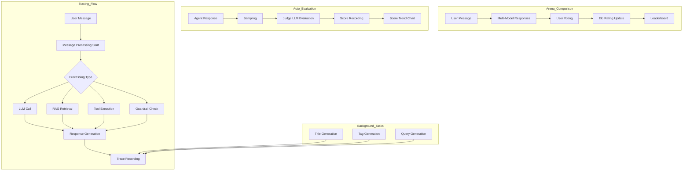

# Evaluations & Tracing

> Automatically evaluate AI response quality, compare models, and trace the entire request processing pipeline step by step.



---

## Tab Structure

The **Admin > Evaluations** screen consists of the following 5 sub-tabs:

| Tab | Description |
|------|------|
| **Arena** | Arena model comparison configuration |
| **Leaderboard** | Elo-based model rankings |
| **Feedbacks** | User feedback history |
| **Auto Evaluations** | Automated evaluation results and charts |
| **Tracing** | Request processing tracing and analysis |

---

## Arena

Configure model comparison features under **Admin > Evaluations > Arena**.

The Arena allows users to compare responses from multiple models to the same question and vote on which model performed better. Voting results are aggregated using the Elo rating system and reflected in the Leaderboard.

> The arena model settings, previously located under **Admin > Settings**, have been moved to the **Admin > Evaluations > Arena** tab.

### Enabling Arena Models

| Item | Description |
|------|------|
| **Arena Models switch** | Enable/disable the arena models feature |

> Message Rating must be enabled to use this feature.

### Managing Arena Models

When enabled, you can add and manage custom models for the arena.

| Action | Description |
|------|------|
| **Add model** | Create a new arena model using the + button |
| **Edit model** | Click the settings icon on an existing model |
| **Delete model** | Delete from the edit modal |

### Arena Model Settings

| Field | Description |
|------|------|
| **Name** | Arena model display name |
| **ID** | Unique identifier (cannot be changed after creation) |
| **Profile Image** | Model avatar image |
| **Description** | Model description |
| **Access Control** | Access permissions for specific groups/organizations |
| **Model List** | Select actual models to include/exclude (leave empty to include all) |
| **Filter Mode** | Include or Exclude |

If no arena models are added, all models registered in the system will be used in the arena.

---

## Leaderboard

View model rankings under **Admin > Evaluations > Leaderboard**.

The leaderboard uses the Elo rating system based on user feedback (voting) data to calculate model rankings.

### Leaderboard Table

| Column | Description |
|------|------|
| **RK** | Rank (by rating) |
| **Model** | Model name and avatar |
| **Rating** | Elo rating score (initial value 1000) |
| **Won** | Number of wins (hover to see win rate %) |
| **Lost** | Number of losses (hover to see loss rate %) |

> Models with no voting data display "-" for their rank.

### Topic Search

Enter a keyword in the search field to re-rank models based on similarity to that topic. This lets you see which model excels in specific subject areas.

- An in-browser embedding model loads when the search field is focused
- Cosine similarity is calculated between each feedback's tags and the search query
- Feedbacks with higher similarity receive greater weight in the Elo recalculation

---

## Feedbacks

View user feedback history under **Admin > Evaluations > Feedbacks**.

Browse evaluation data (win/draw/loss) that users have left on model responses in chats, displayed in a table format.

### Feedback Table

| Column | Description |
|------|------|
| **User** | Avatar of the user who left feedback |
| **Models** | Evaluated model and compared models |
| **Result** | Won / Draw / Lost badge |
| **Updated At** | Feedback time (relative time) |
| **Actions** | View Trace link, delete menu |

### Feedback Detail Modal

Click a feedback row to view detailed information:

| Field | Description |
|------|------|
| **ID** | Feedback unique identifier |
| **Message ID / Chat ID** | Related message and chat identifiers |
| **User** | Feedback user name and avatar |
| **Result** | Evaluation result (Won/Draw/Lost) |
| **Evaluated Model** | Model being evaluated |
| **Compared Models** | List of compared models |
| **Reason** | Reason for selection |
| **Comment** | User comment |
| **Tags** | Related tags |
| **View Trace** | Navigate directly to the related trace |

### Export and Sharing

| Feature | Description |
|------|------|
| **Export** | Download all feedbacks as a JSON file |
| **Share to Community** | Share evaluation data to the community leaderboard (excluding private information) |

> When sharing, chat logs are not included. Only evaluation results, model IDs, tags, and metadata are transmitted.

---

## Auto Evaluation Results

View per-agent response quality scores under **Admin > Evaluations > Auto Evaluations**.

When auto evaluation is enabled in the agent settings, a judge LLM asynchronously evaluates response quality after each response and records the results.

<!-- Screenshot: Auto evaluation results screen
     Filename: images/admin-auto-evaluation.png
-->

### Filter Options

| Filter | Description |
|------|------|
| **Date Range** | Select evaluation period (Last 1 day/7 days/30 days/All/Custom) |
| **Model** | Filter by specific model (multi-select) |
| **Evaluation Type** | Retrieval Quality / Faithfulness / Response Quality (multi-select) |
| **Status** | Pending / Completed / Failed (multi-select) |

### Score Trend Chart

Visualize average score trends by date using a Plotly line chart.

- **All types selected**: Average score line per model
- **Specific type selected**: Breakdown lines per model + type

You can change the chart time granularity:

| Granularity | Description |
|------|------|
| **Hour** | Hourly aggregation |
| **Day** | Daily aggregation (default) |
| **Week** | Weekly aggregation |
| **Month** | Monthly aggregation |

By default, the optimal granularity is automatically selected based on the data range. Chart data refreshes automatically when filters change.

### Evaluation Types

| Type | Description |
|------|------|
| **Retrieval Quality** | Relevance of retrieved documents to the question |
| **Faithfulness** | Whether the answer is based on retrieved content (no hallucinations) |
| **Response Quality** | Overall usefulness and accuracy |

### Evaluation Detail Modal

Click an individual evaluation item in the table to view detailed information:

| Field | Description |
|------|------|
| **Status** | Evaluation status (Completed/Pending/Failed) |
| **Score** | Evaluation score (displayed as percentage, color-coded) |
| **Type** | Evaluation type |
| **Created** | Evaluation timestamp |
| **Evaluated Model** | Target model being evaluated |
| **Judge Model** | Judge LLM model |
| **Error** | Error message on failure |
| **Evaluation Reasoning** | Judge LLM's evaluation rationale |
| **User Query** | Original user question |
| **Assistant Response** | AI response content |
| **Retrieved Contexts** | List of retrieved documents (source, content) |
| **Additional Details** | Additional details (JSON) |

### Export

Use the export button at the top to download all auto evaluation data:

| Format | Description |
|------|------|
| **CSV** | Export as CSV file |
| **JSON** | Export as JSON file |

> For how to configure auto evaluation in agents, see: [Agents Documentation](../workspace/agents.md)

---

## What Is Tracing?

**Tracing** is a feature that tracks and records the entire process of handling an AI request. Similar to LangSmith, it visualizes each processing step (Run) in a tree structure, providing transparent insight into complex AI workflow execution flows.

**Key Features:**
- Track the full processing pipeline per message
- Detailed information on each step: LLM calls, tool executions, RAG retrievals, etc.
- View input/output data
- Measure token usage and latency
- Identify error locations

---

## Accessing the Tracing Screen

Access it via the **Admin > Evaluations > Tracing** tab.

<!-- Screenshot: Tracing main screen
     - Search filters
     - Message card list
     Filename: images/admin-tracing-main.png
-->

---

## Chat/Message Search

To query traces, first enter a **Chat ID** or **Message ID**.

<!-- Screenshot: Search input area
     Filename: images/admin-tracing-search.png
-->

### Search Options

| Search Type | Description |
|----------|------|
| **Chat ID** | View all traces for a specific chat |
| **Message ID** | View traces for a specific message only |

### Filter Options

| Filter | Options |
|------|------|
| **Period** | Last 1 day, 7 days, 30 days, All |
| **Status** | Success, Error, Running, Pending |
| **Type** | Chain, LLM, Tool, Retrieval, Web Search, Guardrail, Embedding |

---

## Trace Detail View

Click a message card in the search results to view detailed trace information.

<!-- Screenshot: Trace detail modal
     - Left: Runs tree
     - Right: Selected Run detail information
     Filename: images/admin-tracing-detail.png
-->

### Trace Detail Header

The detail modal header displays the following information:

| Item | Description |
|------|------|
| **Trace Detail** | Modal title |
| **Agent/Model Name** | The name of the top-level Run (agent name or model name) is displayed as a badge |
| **View Report** | Displayed when an existing analysis report is available |
| **Copy Trace** | Copies the entire trace data to clipboard as text |
| **Analyze Trace** | Start trace analysis |

### Message Card

Each message card displays the following information:

| Field | Description |
|------|------|
| **User Message** | Original input message (max 2 lines) |
| **Message ID** | Message identifier (abbreviated) |
| **Time** | Request time |
| **Total Latency** | Total processing time |
| **Trace Badges** | Status badges for each trace type |

### Runs Tree Structure

The left panel displays processing steps in a tree structure:

```
[CH] Response               2.34s  ●
  ├─ [LM] GPT-4             1.89s  ●
  ├─ [RG] KnowledgeBase     0.32s  ●
  └─ [TL] web_search        0.13s  ●
```

**Run Type Labels:**

| Abbr | Type | Color | Description |
|-----|------|------|------|
| **CH** | Chain | Purple | Composite operation (message processing) |
| **LM** | LLM | Blue | LLM API call |
| **TL** | Tool | Green | Tool execution |
| **RG** | Retrieval | Orange | RAG document retrieval |
| **WB** | Web Search | Teal | Web search |
| **GD** | Guardrail | Red | Guardrail check |
| **EM** | Embedding | Yellow | Embedding generation |
| **IM** | Image | Pink | Image generation |
| **ACT** | Action | Purple | Tool + sub-task group |

**Status Indicators:**

| Icon | Status |
|-------|------|
| (green) | Success |
| (red) | Error |
| (yellow) | Running |
| (gray) | Pending |

### Viewing Inputs/Outputs

The right panel shows detailed information for the selected Run:

<!-- Screenshot: Run detail information panel
     Filename: images/admin-tracing-run-detail.png
-->

| Section | Description |
|------|------|
| **Status** | Status, latency, model ID |
| **Inputs** | Input data |
| **Outputs** | Output data |
| **Error** | Error message (on error) |
| **Token Usage** | Token usage (LLM type) |

### View Modes

Inputs and Outputs can be viewed in three formats:

| Mode | Description |
|------|------|
| **Tree** | Hierarchical tree structure display (default) |
| **JSON** | Raw JSON format display |
| **Text** | Plain text display |

---

## Search and Navigation

You can search text within the Outputs area.

<!-- Screenshot: Outputs search feature
     Filename: images/admin-tracing-search-output.png
-->

### Search Highlighting

When you enter a search term, matching text is highlighted in yellow.

### Navigation

| Shortcut | Action |
|--------|------|
| **Enter** | Go to next match |
| **Shift + Enter** | Go to previous match |

The match count is displayed next to the search field in `1/5` format.

---

## Trace Types

### Main Response Traces

The AI response generation process for a user message.

| Type | Description |
|------|------|
| **Response** | Full response generation (Chain) |
| **LLM** | LLM API call |
| **RAG** | Knowledge base retrieval |
| **Tool** | Tool execution |
| **Search** | Web search |
| **Guard** | Guardrail check |

### Background Task Traces

Background tasks for chat auxiliary features.

| Type | Description |
|------|------|
| **Title** | Auto-generate chat title |
| **Tag** | Auto-generate chat tags |
| **Query** | RAG search query generation |
| **Emoji** | Chat emoji generation |
| **Autocomplete** | Autocomplete suggestions |
| **Function** | Function call determination |

---

## Trace Analysis Report

A feature that uses an LLM to analyze trace data and automatically identify root causes of issues.

<!-- Screenshot: Trace analysis report modal
     - Report content (markdown rendered)
     - Copy/download buttons
     Filename: images/admin-tracing-analysis-report.png
-->

### Starting Analysis

Click the **"Trace Analysis"** button at the top of the trace detail modal.

<!-- Screenshot: Trace analysis button and input form
     - Analysis model selection dropdown
     - Issue description input area
     Filename: images/admin-tracing-analysis-form.png
-->

| Input Field | Description | Required |
|----------|------|------|
| **Analysis Model** | Select the LLM model to use for analysis | Required |
| **Issue Description** | Describe the observed issue (e.g., "The answer was X but should have been Y") | Optional |

Click **"Start Analysis"** to begin background LLM analysis. The report is displayed automatically upon completion.

### Report Structure

The analysis report consists of the following sections:

| Section | Description |
|------|------|
| **Executive Summary** | Summary of analysis results (2-3 sentences) |
| **Trace Overview** | Trace ID, status, total latency, token count, Run count, error count |
| **Root Cause Analysis** | Primary causes and contributing factors |
| **Phase 1 Analysis: Tool Selection and Execution** | Whether correct tools were invoked, missing tools identified |
| **Phase 2 Analysis: Final Answer Generation** | Answer appropriateness relative to collected data |
| **Prompt and System Configuration Issues** | System prompt, format prompt-related issues |
| **Knowledge Base (RAG) Issues** | KB search result-related issues (if applicable) |
| **Database (NL-to-SQL) Issues** | DB query-related issues (if applicable) |
| **Glossary Issues** | Glossary application-related issues (if applicable) |
| **Guardrail Issues** | Guardrail interference (if applicable) |
| **Error Analysis** | Analysis of Runs with errors (if applicable) |
| **Improvement Recommendations** | Immediate actions, configuration changes, data improvements, architecture suggestions |

### Copying Trace Data

Click the **"Copy Trace"** button in the trace detail modal header to copy the entire trace structure (Trace ID, Chat ID, status, total latency, total tokens, and each Run's name/type/inputs/outputs/model information) to the clipboard as text. You can paste this data into external tools or other LLMs for analysis.

### Report Copy and Download

The following features are available at the top of the report modal:

| Feature | Description |
|------|------|
| **Copy** | Copy full report text to clipboard |
| **Download** | Download as a markdown file (.md) |

### Viewing Existing Reports

If a previous analysis report exists, a **"View Report"** button is displayed on the trace detail modal. Click it to immediately view the most recent analysis result without re-running the analysis.

---

## Use Cases

### Case 1: Response Quality Debugging

**Goal:** Identify the cause when AI responses differ from expectations

**Method:**
1. Copy the Chat ID from the relevant chat
2. Search in Tracing
3. View the trace for the target message
4. Check the prompt passed in the LLM Run's Inputs
5. Check the retrieved documents in the RAG Run's Outputs

### Case 2: Latency Analysis

**Goal:** Identify the cause of slow responses

**Method:**
1. Query the trace for the slow response
2. Check latency for each Run
3. Identify the longest-running step
4. Optimize that step (e.g., adjust number of RAG retrieval documents)

### Case 3: Tool Execution Error Tracking

**Goal:** Identify the cause of tool call failures

**Method:**
1. Filter for traces with Error status
2. Select the Tool Run where the error occurred
3. Check the error message in the Error section
4. Review the parameters passed in Inputs

### Case 4: Token Usage Analysis

**Goal:** Check token consumption for a specific request

**Method:**
1. Query the trace for the target message
2. Check Token Usage for each LLM Run
3. Review the total token count at the top for overall consumption

---

## FAQ

**Q: Are all chats traced?**
> Yes, all AI requests processed by the system are automatically traced.

**Q: How long is trace data retained?**
> By default, it is retained indefinitely. Administrators can clean up old data via the `/api/traces/cleanup` API.

**Q: Can regular users view tracing?**
> Regular users can only view their own traces. Administrators can view traces for all users.

**Q: Does tracing affect performance?**
> Tracing is processed asynchronously, minimizing impact on response speed.

**Q: Can I view the trace for a specific message directly?**
> Use the "View Tracing" option in the message options menu on the chat screen to navigate directly to the trace view.

---

## Next Steps

- [Monitoring](./monitoring.md)
- [User Management](./users.md)
- [System Settings](./settings.md)
