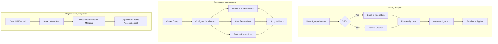

# User Management

> Achieve both security and efficiency with systematic user and permission management tailored to your organizational structure. Integration with Microsoft Entra ID lets you leverage your existing organizational hierarchy as-is.



---

## User Management Overview

Manage all users and groups under **Admin > Users**.

<!-- Screenshot: User management main screen
     - Tabs: User List, Groups, Organizations
     Filename: images/admin-users-main.png
-->

### Tab Layout

| Tab | Function |
|----|------|
| **User List** | Individual user management |
| **Groups & Permissions** | Permission group management |
| **Organizations** | Organization unit synchronization |
| **Inquiries** | User inquiry management |

---

## User List

### Viewing Users

<!-- Screenshot: User list table
     - Name, Email, Role, Status, Last Activity
     Filename: images/admin-users-list.png
-->

| Column | Description |
|------|------|
| **Name** | User display name |
| **Email** | Login email |
| **Role** | admin, user, pending |
| **Last Activity** | Most recent access time |
| **Joined** | Account creation date |

### Search and Filter

- **Search**: Search by name or email
- **Sort**: By name, join date, or recent activity
- **Filter**: Filter by role

<!-- Screenshot: Search and filter UI
     Filename: images/admin-users-search.png
-->

### User Roles

| Role | Description | Permissions |
|------|------|------|
| **Admin** | Administrator | Access to all features |
| **User** | Regular user | Chat and workspace access |
| **Pending** | Awaiting approval | No access until approved |

### Super Admin (SA) Designation

You can designate specific administrators as **Super Admin (SA)** to grant the highest level of privileges.

<!-- Screenshot: Super Admin designation UI
     Filename: images/admin-users-superadmin.png
-->

**Super Admin characteristics:**
- Full access to all settings and user management
- Can modify other administrators' permissions
- Access to core system settings (license, authentication, etc.)
- Configured via the **"Designate as Super Admin"** toggle in the user edit screen

> **Caution:** Grant Super Admin status to a minimal number of personnel only. Unlike regular Admins, Super Admins have unrestricted access to the entire system.

### Adding Users

Click the **"+ Add User"** button.

<!-- Screenshot: Add user modal
     Filename: images/admin-users-add.png
-->

| Field | Description |
|------|------|
| **Email** | User email |
| **Name** | Display name |
| **Password** | Initial password |
| **Role** | Role to assign |

### Editing Users

Click a **user's name or profile image** in the list to open the edit modal.

<!-- Screenshot: Edit user modal
     Filename: images/admin-users-edit.png
-->

**Editable fields:**
- Name
- Role
- Profile image
- Password reset
- Super Admin (SA) designation
- Daily token limit (when usage limit is enabled) -- setting to 0 means unlimited; the **most generous (highest) value** across global/user/group/organization levels is applied
- **Group membership** — View and manage the user's group assignments at the bottom of the modal by clicking group chips to add/remove

#### Group Management (within Edit Modal)

The user's **group memberships** are displayed as chips at the bottom of the edit modal.

- **Green chip**: Currently a member of the group
- Click a chip to **toggle** membership (add/remove)
- Changes are applied immediately upon save

> **Tip:** To quickly change groups for multiple users, click each user's name in succession and adjust groups directly in the edit modal.

### Deleting Users

**Warning:** Deleting a user also deletes their chat history.

<!-- Screenshot: Delete confirmation dialog
     Filename: images/admin-users-delete.png
-->

### Viewing User Chats

Administrators can review a user's chat history.

<!-- Screenshot: User chat list modal
     Filename: images/admin-users-chats.png
-->

---

## Group Management

Groups bundle users together for batch permission management.

### Why Groups Are Needed

| Individual Management | Group Management |
|----------|----------|
| Set permissions per user | Set once per group |
| Modify each user on changes | Change only group settings |
| Difficult to manage | Systematic management |

### Group List

<!-- Screenshot: Group list screen
     Filename: images/admin-groups-list.png
-->

### Creating Groups

Click the **"+ New Group"** button.

<!-- Screenshot: Group creation form
     Filename: images/admin-groups-create.png
-->

| Field | Description | Example |
|------|------|------|
| **Name** | Group name | "Marketing Team" |
| **Description** | Group description | "User group for marketing department" |

### Group Permission Settings

Fine-grained permissions can be configured per group. Each permission is broken down into **4 levels**.

<!-- Screenshot: Group permission settings screen (4-level segment buttons)
     Filename: images/admin-groups-permissions.png
-->

#### Permission Levels

All workspace and admin permissions are configured using the following 4 levels:

| Level | Description |
|------|------|
| **None** | No access to the feature |
| **Access** | Can view list only (no read/write) |
| **Read** | Can view list + view details |
| **Write** | Can view + create/edit/delete |

> **Note:** Permissions previously set as ON/OFF are automatically converted (OFF -> None, ON -> Write).

#### Workspace Permissions

| Permission | None | Access | Read | Write |
|------|------|------|------|------|
| **Agents** | No access | View list only | View agent details | Create/edit agents |
| **Knowledge Bases** | No access | View list only | View knowledge base details | Create/edit knowledge bases |
| **Prompts** | No access | View list only | View prompt details | Create/edit prompts |
| **Tools** | No access | View list only | View tool connection details | Create/edit tool connections |
| **Databases** | No access | View list only | View DB connection details | Create/edit DB connections |
| **Glossaries** | No access | View list only | View glossary details | Create/edit glossaries |
| **Guardrails** | No access | View list only | View guardrail details | Create/edit guardrails |
| **Agent Flows** | No access | View list only | View flow details | Create/edit flows |

#### Admin Permissions

Access to admin area features is also configured using the same 4 levels.

| Permission | None | Access | Read | Write |
|------|------|------|------|------|
| **User Management** | No access | View user list | View user details | Create/edit/delete users |
| **System Settings** | No access | View settings list | View setting values | Modify settings |
| **Evaluations** | No access | View evaluation list | View evaluation details | Modify evaluation settings |
| **Monitoring** | No access | View monitoring | View detailed data | Manage data |
| **Functions** | No access | View function list | View function details | Create/edit/delete functions |

#### Sharing Permissions

| Permission | Description |
|------|------|
| **Agent Sharing** | Share agents with other users |
| **Knowledge Base Sharing** | Share knowledge bases |
| **Prompt Sharing** | Share prompts |

#### Chat Permissions

| Permission | Description |
|------|------|
| **File Upload** | Attach files to chats |
| **Delete Chat** | Delete own chats |
| **Edit Message** | Edit messages |
| **Voice Input** | Use STT |
| **Voice Output** | Use TTS |
| **Voice Call** | Voice conversation feature |
| **Multi Model** | Use multiple models simultaneously |
| **Temporary Chat** | Chats that are not saved |

#### Feature Permissions

| Permission | Description |
|------|------|
| **Direct Tool Server** | Connect personal tool servers |
| **Web Search** | Use web search |
| **Image Generation** | AI image generation |
| **Code Execution** | Use code interpreter |

### Group-Level Guardrail Settings

You can configure separate guardrail policies per group. Set these in the **"Guardrails"** tab of the group edit screen.

<!-- Screenshot: Group guardrail settings screen
     Filename: images/admin-groups-guardrails.png
-->

**Configuration items:**
- Input guardrails (user message filtering)
- Output guardrails (AI response filtering)
- PII detection rules
- Custom content filters

> **Note:** Group guardrails are applied in addition to global guardrail settings. Only rules stricter than the global settings can be added.

### Adding Users to Groups

<!-- Screenshot: Group member management screen
     Filename: images/admin-groups-members.png
-->

1. Enter the group edit screen
2. Select the "Members" tab
3. Click "Add User"
4. Select the users to add

### Assigning Organizational Units to a Group

In the **"Organizations"** tab of the group edit modal, you can assign organizational units (OUs) to the group. Manage organizational structure (departments) and group permissions together for accurate alignment with enterprise organizational hierarchies.

<!-- Screenshot: Organizations tab in group edit modal
     Filename: images/admin-groups-organizations.png
-->

**How to configure:**
1. Open the group edit screen
2. Select the **"Organizations"** tab
3. Check the organizational units you want to assign
4. Save

**Behavior:**
- An organizational unit can be assigned to **only one group**. OUs already assigned to other groups are hidden from the list.
- Selected units are marked with an **"Assigned"** badge and sorted to the top.
- Once an OU is assigned, users belonging to that OU inherit the group's permissions.

> **Tip:** Create a department-based group (e.g., "Marketing Team") and link the corresponding OU. When organization sync adds or removes members from the department, the group membership is automatically reflected.

### Group Usage Limits

Set a **Daily Token Limit** in the General tab of group editing. Setting it to 0 means unlimited, and the limit applies to all users in the group.

> **Note:** When a user has limits set at multiple levels (global, user, group, organization), the **most generous (highest) value** is applied.

### Default Permissions

Configure default permissions for users who are not assigned to any group.

<!-- Screenshot: Default permissions section
     Filename: images/admin-groups-default.png
-->

---

## Organization Management

Synchronize organizational structure with Microsoft Entra ID (Azure AD), Google Workspace, or Keycloak.

### Organization Sync Providers

| Provider | Description |
|----------|-------------|
| **Microsoft Entra ID** | Azure AD-based organization sync (default) |
| **Google Workspace** | Google Admin Directory-based organization/group sync |
| **Keycloak** | Keycloak Organization-based sync |
| **JSON** | Manual registration via JSON data |

> **Keycloak Integration:** You can sync department structures with Cloosphere using Keycloak's Organization feature. Set up the organizational structure in the Keycloak admin console, then sync from Cloosphere for automatic reflection.

### OIDC Universal Department Mapping

You can automatically map user department information from any OIDC (OpenID Connect) compatible IdP.

<!-- Screenshot: OIDC department mapping settings
     Filename: images/admin-org-oidc-mapping.png
-->

| Setting | Description |
|---------|-------------|
| **Department Claim** | Claim name to retrieve department info from the OIDC token (e.g., `department`, `org`) |
| **Auto Organization Assignment** | Automatically assign users to organizational units based on claim values at login |

> **Note:** Department mapping is available with any IdP that supports the OIDC standard, beyond Entra ID and Keycloak.

### Benefits of Organization Integration

| Feature | Benefit |
|------|------|
| **Auto Sync** | Automatically reflects user additions/removals |
| **Org Structure** | Automatic department information sync |
| **Unified Permissions** | AD group-based permission management |
| **SSO** | Simple login with corporate accounts |

### Organizational Unit (OU) Management

<!-- Screenshot: Organizational unit tree screen
     Filename: images/admin-org-tree.png
-->

Organizational units are displayed in a tree structure:

```
Cloocus (Company)
├── Engineering Division
│   ├── Backend Team
│   ├── Frontend Team
│   └── DevOps Team
├── Sales Division
│   ├── Domestic Sales Team
│   └── International Sales Team
└── Corporate Services Division
    ├── HR Team
    └── Finance Team
```

**Organizational Unit / Group Tab Separation:**

When the provider supplies both OUs and Groups (e.g., Google Workspace, Keycloak), a **[All / Organizational Unit / Group]** tab bar automatically appears above the list so you can filter by type. Each tab shows the count of items in that type.

<!-- Screenshot: Organizational Unit / Group type tabs
     Filename: images/admin-org-type-tabs.png
-->

### Organization Sync

Click the **"Sync"** button to open the sync modal. After selecting a data source (provider), check the items you want to import and click **"Sync"** to fetch the latest organization information.

<!-- Screenshot: Organization sync modal (provider selection + options)
     Filename: images/admin-org-sync.png
-->

**Sync modal layout:**

| Item | Description |
|------|-------------|
| **Data Source** | Choose one of JSON, Microsoft Entra ID, Google Workspace, or Keycloak |
| **Items to Import** | Provider-specific options (e.g., Organizational Units / Groups / Departments) |
| **Progress** | Displayed in real time; the number of synced organizations and units is shown in a toast on completion |

**Synced content:**
- Department structure (Organizational Units / OUs)
- User department assignments
- Groups (if selected) — imported groups are also registered as organizational units
- Member details (name, email, job title, manager, etc.)

> **Safeguard:** Even if the sync returns an empty response, existing organization data is **not** wiped out. There is no risk of losing existing data due to invalid credentials or transient network errors.

### Google Workspace Organization Sync

Automatically import organizational units (OUs), groups, and member details from Google Workspace via the Google Admin Directory API.

<!-- Screenshot: Google Workspace sync options (Organizational Units / Groups checkboxes)
     Filename: images/admin-org-sync-google.png
-->

**Key Features:**
- Syncs the full OU hierarchy — including child and grandchild OUs
- Optionally imports Google Groups as organizational units
- Stores member details together (name, email, job title)
- External-domain members are automatically skipped; only workspace members are reflected
- Operates reliably on large organizations via parallel processing and exponential backoff retries

**Google-side Prerequisites:**

| Item | Description |
|------|-------------|
| **Google Workspace Admin Account** | Super Admin role required |
| **Admin Directory API** | Enable it in a Google Cloud project |
| **Service Account** | Configure Domain-wide Delegation |
| **API Scopes** | `admin.directory.user.readonly`, `group.readonly`, `orgunit.readonly`, etc. |

> Credentials (service account key, impersonation admin email) are configured first under **Admin > Settings > Authentication > Google**.

**Sync UI:**

When you select **Google Workspace** as the data source in the sync modal, the following options are displayed.

| Option | Description |
|--------|-------------|
| **Organizational Unit (OU)** | Imports the Google Workspace OU hierarchy |
| **Group** | Imports Google Groups as organizational units |

Check the **items to import** and click **"Sync"** to view progress in real time. You can check both options to import OUs and Groups in a single sync run.

### Organization Usage Limits

Set a **Daily Token Limit** in the team detail panel. Setting it to 0 means unlimited, and the limit applies to all users in that organizational unit.

### Organization-Level Guardrail Settings

You can configure guardrail policies individually per organizational unit (team/department). Select the target organization in the tree, then click the **shield icon (🛡️) button** to open the guardrail settings modal.

<!-- Screenshot: Organization guardrail settings modal (shield icon button)
     Filename: images/admin-org-guardrails.png
-->

**Setup:**
1. Select the target organizational unit in the tree
2. Click the **shield icon (🛡️)** button in the detail panel
3. Configure policies in the guardrail settings modal
4. Save

**Configuration items:**
- Input/output guardrail rules
- PII detection level
- Content filter policies

> **Note:** Organization guardrails are applied in addition to global guardrails and group guardrails. All guardrails from every level a user belongs to are cumulatively applied.

### Viewing Organizational Unit Permissions

See at a glance what resources an organizational unit has access to. Click the **"View Permissions"** button (key icon) on a unit row to display assigned permissions grouped by category.

<!-- Screenshot: Organizational unit permissions modal
     Filename: images/admin-org-permissions.png
-->

**Displayed Categories:**

| Category | Description |
|----------|-------------|
| **Knowledge** | Knowledge bases the unit can access |
| **Tools** | Accessible tools |
| **Prompts** | Accessible prompts |
| **Models** | Accessible models |
| **Database** | Accessible DB connections |
| **Guardrails** | Guardrails applied to this organizational unit |
| **Glossary** | Accessible glossaries |

Each item shows its **Write / Read** level as a badge. Permissions inherited from a parent organizational unit are marked with an **"Inherited"** badge.

### Organization-Based Access Control

You can set organization unit-based access permissions on resources (agents, knowledge bases, etc.).

<!-- Screenshot: Organization selection in access control
     Filename: images/admin-org-access.png
-->

**Examples:**
- "HR Policy" knowledge base -> HR team only
- "Sales Agent" -> Sales division only
- "Company-Wide Announcements" -> Entire organization

---

## Inquiry Management

Manage and respond to inquiries submitted by users.

### Submitting an Inquiry (User)

Regular users can send inquiries by clicking **"Contact Admin"** in the sidebar menu.

<!-- Screenshot: User inquiry modal
     Filename: images/admin-inquiry-user.png
-->

**Inquiry types:**

| Type | Subtypes | Description |
|------|----------|-------------|
| **Usage Limit** | Limit increase request, Limit check | Token limit related |
| **Feature** | Chat, Agent, Knowledge, Database, Tool | Feature usage related |
| **Bug** | Chat error, Agent error, Upload error, Other | Error reports |
| **Account** | Permission request, Account issue | Account/permission related |
| **Other** | Improvement suggestion, Other | Other inquiries |

### Managing Inquiries (Admin)

Manage all inquiries under **Admin > Users > Inquiries** tab.

<!-- Screenshot: Admin inquiry kanban board
     Filename: images/admin-inquiry-kanban.png
-->

**View modes:**
- **Kanban view**: Drag and drop to change status across columns (Open, In Progress, Resolved, Closed)
- **List view**: View all inquiries in a row-based layout

**Status flow:**

```
Open → In Progress → Resolved → (User) Closed
```

| Status | Description |
|--------|-------------|
| **Open** | Newly submitted inquiry |
| **In Progress** | Admin is reviewing |
| **Resolved** | Admin has responded |
| **Closed** | User has confirmed the response and closed |

> **Note:** If an admin directly changes status to "Closed", users cannot see the response. It's recommended to set status to "Resolved" and let users close it after reviewing.

### Checking Responses (User)

Users can check admin responses in the **"My Inquiries"** tab of the inquiry modal. A **green badge** appears on the sidebar menu when there are unread responses.

---

## Security Settings

### Authentication Settings

Manage authentication settings under **Admin > Settings > General**.

<!-- Screenshot: Authentication settings section
     Filename: images/admin-auth-settings.png
-->

| Setting | Description |
|------|------|
| **Allow Signup** | Whether to allow new user self-registration |
| **Default Role** | Default role for new users |
| **JWT Expiration** | Login session validity period |

### LDAP Settings

Integrate with a corporate LDAP server for authentication.

<!-- Screenshot: LDAP settings screen
     Filename: images/admin-ldap.png
-->

| Setting | Description |
|------|------|
| **LDAP Server** | Server address |
| **Port** | Connection port |
| **Bind DN** | Bind account |
| **Search Base** | Search base |
| **Filter** | User filter |

### API Key Management

API key-based authentication settings.

<!-- Screenshot: API key settings
     Filename: images/admin-api-key.png
-->

### External IDP ID Token Passthrough Authentication (Trusted Audiences)

Host systems (e.g., internal portals) can call Cloosphere APIs by passing an **ID token issued by their own SSO** (Microsoft Entra ID, Google) directly via `Authorization: Bearer <id_token>`. There is no need for a separate Cloosphere JWT exchange — the host's user context flows straight through to the Cloosphere API.

Register the trusted IDP audiences under **Admin > Settings > Notifications (Trusted Audiences section)**. Tokens whose audience is not registered are rejected.

<!-- Screenshot: Trusted Audiences list screen
     Filename: images/admin-trusted-audiences-list.png
-->

#### Registering a Trusted Audience

Click **"+ Add Trusted Audience"** to register an IDP and audience (client ID) that may be used to authenticate.

| Field | Description |
|-------|-------------|
| **IDP** | Identity provider issuing the ID tokens (Microsoft Entra / Google) |
| **Label** | Admin-friendly identifier (e.g., "Customer Portal Prod") |
| **Audience (aud)** | Entra application (client) ID, or Google OAuth client ID |
| **Tenant ID** | (Entra only) Specific tenant GUID. Leave empty to allow any tenant |
| **Issuer (optional override)** | Custom issuer URL. Leave empty to auto-compute from IDP + tenant |
| **Enabled** | Whether tokens for this audience are accepted |
| **Auto-provision unknown users** | Auto-create a Cloosphere account if the token's email is not yet in Cloosphere |
| **Default Role (auto-provision)** | Initial role assigned to auto-provisioned users (user / admin) |

<!-- Screenshot: Trusted Audience add/edit form
     Filename: images/admin-trusted-audience-form.png
-->

#### How It Works

1. The host system authenticates the user via its own SSO flow and obtains an ID token
2. When calling Cloosphere APIs, the host sends the token as-is in `Authorization: Bearer <id_token>`
3. Cloosphere validates the token's `iss` and `aud` against the Trusted Audiences list
4. On success, the token's email is mapped to a Cloosphere user
   - If no matching user exists and **auto-provision** is on, a new account is created
   - If auto-provision is off and there is no matching user, 401 is returned

> **Note:** Unlike embed-widget SSO token exchange, this flow does **not** swap the token for a Cloosphere JWT. The IDP token is verified on every request. This is best for backend-to-backend scenarios where an external system calls Cloosphere APIs on behalf of its own users.

> **Security:** Protected by audience whitelist. Tokens issued for unregistered clients are rejected, so register only the client IDs of trusted host applications in production.

---

## User Activity Tracking

### Access History

View the last access time per user.

### Chat History

Administrators can review user chat history when needed.

### Usage

View per-user usage under **Admin > Monitoring**.

<!-- Screenshot: Per-user usage table
     Filename: images/admin-users-usage.png
-->

---

## Best Practices

### Role Management

1. **Minimize Admins**: Only assign admin to necessary personnel
2. **Use Pending**: Review and approve new signups
3. **Regular Review**: Clean up departed employee accounts

### Group Design

1. **Department-Based**: Create groups per department
2. **Role-Based**: Create groups by job title/role
3. **Project-Based**: Create groups per project team

### Permission Design

1. **Principle of Least Privilege**: Grant only necessary permissions
2. **Groups First**: Use group permissions over individual permissions
3. **Regular Audits**: Periodically review permission settings

---

## FAQ

**Q: A user forgot their password.**
> An administrator can reset the password from the user edit screen. If SSO is enabled, contact your IT department.

**Q: How do I restrict a specific agent to certain users?**
> Specify the users or groups in the agent's access permission settings.

**Q: How should departed employee accounts be handled?**
> Delete the account or set the role to "Pending" to deactivate it.

**Q: Organization sync is not working.**
> Verify the Azure AD connection settings and contact your IT administrator to ensure the required permissions are granted. For Google Workspace, verify that Domain-wide Delegation is correctly configured for the service account and that the Admin Directory API is enabled.

**Q: Can an organizational unit be assigned to multiple groups?**
> No. Each organizational unit can be assigned to only one group. OUs already assigned to another group are hidden from the list in the group edit modal's "Organizations" tab.

---

## Next Steps

- [System Settings](./settings.md)
- [Usage Monitoring](./monitoring.md)
