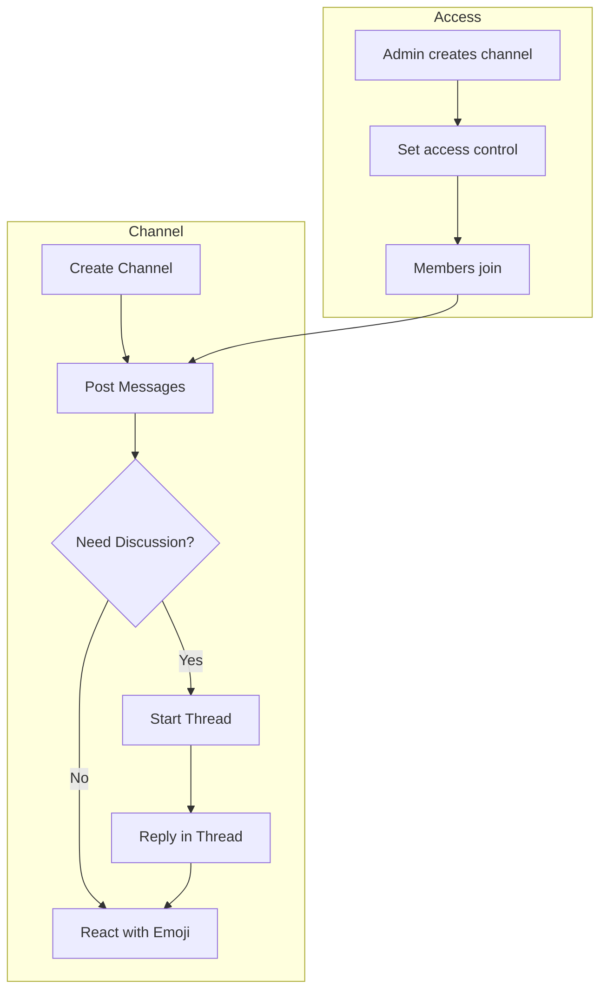

# Channels

> Channels are team messaging spaces for real-time collaboration -- think of them as dedicated rooms where your team can discuss topics, share files, and keep conversations organized with threads and emoji reactions.

---

## Channel Screen Layout

<!-- Screenshot: Channel main view with sidebar, message list, and input area
     Filename: images/channels-main-view.png
-->

| Area | Function |
|------|----------|
| **Sidebar** | Channel list, switch between channels |
| **Channel Header** | Channel name, navigation |
| **Message Area** | Conversation messages displayed in chronological order |
| **Input Area** | Message input, file attachment, screen capture, voice recording |
| **Thread Panel** | Thread replies displayed in a side panel (desktop) or modal (mobile) |

---

## What Are Channels?

Channels provide a **team messaging** experience similar to Slack or Microsoft Teams -- but integrated directly into Cloosphere. While **Chat** is designed for 1-on-1 conversations with AI models, **Channels** are designed for human-to-human collaboration.

Each channel is a persistent conversation space where team members can:

- Post messages visible to all channel members
- Reply to specific messages in **threads** to keep discussions focused
- React to messages with **emoji reactions**
- Share files, images, and screenshots
- Receive **real-time updates** via Socket.IO (no page refresh needed)

---

## Creating a Channel

> Only administrators can create channels.

1. Navigate to the **Channels** section in the sidebar
2. Click the **"+"** or **"New Channel"** button
3. Fill in the channel details:

| Field | Description |
|-------|-------------|
| **Name** | Channel name (automatically converted to lowercase) |
| **Description** | Optional description of the channel's purpose |
| **Access Control** | Set which groups or users can access the channel |

<!-- Screenshot: Create channel form
     Filename: images/channels-create-form.png
-->

4. Click **"Create"** to finish

> **Tip**: Use descriptive channel names like `project-alpha`, `design-review`, or `announcements` so team members can quickly find the right channel.

---

## Posting Messages

### Writing and Sending

Type your message in the input area at the bottom of the channel and press **Enter** to send.

<!-- Screenshot: Message input area with file attachment options
     Filename: images/channels-message-input.png
-->

**Formatting support:**
- **Markdown**: `**bold**`, `*italic*`, `` `code` ``
- **New line**: `Shift + Enter`
- **Send**: `Enter` or the send button

### Attaching Files

You can attach files to your messages using several methods:

| Method | Description |
|--------|-------------|
| **Drag and Drop** | Drag files directly into the channel window |
| **File Selection** | Click the + button and select "Upload File" |
| **Screen Capture** | Click the + button and select "Capture Screen" |
| **Image Paste** | Paste images directly from your clipboard |

Images are automatically compressed before upload for faster delivery.

<!-- Screenshot: Message with attached file and image
     Filename: images/channels-file-attachment.png
-->

### Voice Recording

Click the **microphone button** to record and send a voice message. The recording is automatically transcribed and attached to your message.

---

## Message Actions

Hover over any message to reveal the action toolbar.

<!-- Screenshot: Message hover actions toolbar
     Filename: images/channels-message-actions.png
-->

| Action | Description |
|--------|-------------|
| **React** | Add an emoji reaction to the message |
| **Reply** | Open a thread to reply to this specific message |
| **Edit** | Edit your own message (owner only) |
| **Delete** | Delete your own message, or any message if you are an admin |

### Editing a Message

1. Hover over your message and click the **edit** icon
2. The message content becomes an editable text area
3. Make your changes
4. Press **Cmd+Enter** (or **Ctrl+Enter**) to save, or **Escape** to cancel

> Only the message author can edit their own messages.

### Deleting a Message

1. Hover over the message and click the **delete** icon
2. Confirm the deletion

Admins can delete any message in the channel for moderation purposes. Regular users can only delete their own messages.

---

## Message Threads

Threads keep related discussions organized without cluttering the main channel view.

### Starting a Thread

1. Hover over a message and click the **reply** icon
2. A thread panel opens on the right side (desktop) or as a modal (mobile)
3. Type your reply and press **Enter**

<!-- Screenshot: Thread panel open with replies
     Filename: images/channels-thread-panel.png
-->

### Viewing Threads

Messages with replies show a **"View Replies"** indicator with the reply count. Click it to open the thread.

| Element | Description |
|---------|-------------|
| **Reply Count** | Number of replies in the thread |
| **Latest Reply** | Timestamp of the most recent reply |
| **Thread Panel** | Dedicated space for thread messages |

### Thread Behavior

- Thread replies are **not shown** in the main channel message list -- they only appear inside the thread panel
- The original message appears at the bottom of the thread as context
- Each thread has its own message input
- Real-time updates work within threads just like in the main channel

---

## Emoji Reactions

Reactions let you respond to messages quickly without sending a new message.

### Adding a Reaction

1. Hover over a message and click the **emoji** icon
2. Browse or **search** for an emoji in the reaction picker
3. Click an emoji to add it

<!-- Screenshot: Emoji reaction picker
     Filename: images/channels-reaction-picker.png
-->

### Reaction Display

- Reactions appear as badges below the message showing the emoji and count
- Your own reactions are **highlighted** so you can see which ones you have added
- Click an existing reaction badge to add your reaction to the same emoji, or click again to remove it

| Action | How |
|--------|-----|
| **Add reaction** | Click emoji icon on hover, or click an existing reaction badge |
| **Remove reaction** | Click a reaction badge that you have already reacted with |

---

## Channel Members and Access Control

Channels use Cloosphere's standard **access control** system to manage who can read and write messages.

### Access Levels

| Role | Permissions |
|------|-------------|
| **Admin** | Full access to all channels; can create, edit, and delete channels; can delete any message |
| **Member (with access)** | Can view messages, post messages, react, and reply in threads |
| **No access** | Cannot see the channel |

### Managing Access

Administrators can control channel access through the **access_control** settings when creating or editing a channel. Access can be granted to:

- Specific **users**
- Entire **groups** or **organizations**

<!-- Screenshot: Channel access control settings
     Filename: images/channels-access-control.png
-->

---

## Real-Time Features

Channels are powered by **Socket.IO** for real-time updates. All connected members see changes instantly without refreshing.

### Live Updates

| Event | What Happens |
|-------|--------------|
| **New message** | Appears immediately in the channel |
| **Message edit** | Updated content reflects in real time |
| **Message delete** | Message is removed from the view |
| **New reply** | Thread reply count updates automatically |
| **Reaction added/removed** | Reaction badges update instantly |

### Typing Indicator

When another member is typing, you will see a typing indicator below the message list. The indicator disappears automatically after 5 seconds of inactivity.

### Notifications

If you are not currently viewing a channel, you can receive **webhook notifications** for new messages. Configure your notification webhook URL in **Settings > Notifications**.

---

## Channel vs Chat -- When to Use Which

| | Chat | Channel |
|---|------|---------|
| **Purpose** | AI-powered conversations | Team collaboration |
| **Participants** | You + AI model(s) | Multiple team members |
| **AI Integration** | Full AI features (model selection, web search, code execution, knowledge base) | No AI -- human-to-human messaging only |
| **Threads** | Not available | Supported for organized discussions |
| **Reactions** | Not available | Emoji reactions on any message |
| **Persistence** | Per-user conversation history | Shared team conversation history |
| **Best for** | Asking questions, generating content, analyzing data | Team discussions, announcements, project coordination |

**Use Chat when** you need AI assistance -- writing, analysis, code generation, or knowledge base queries.

**Use Channels when** you need to collaborate with teammates -- share updates, discuss decisions, or coordinate work.

---

## Keyboard Shortcuts

| Shortcut | Function |
|----------|----------|
| `Enter` | Send message |
| `Shift + Enter` | New line |
| `Cmd/Ctrl + Enter` | Save edited message |
| `Escape` | Cancel editing / Close thread panel |

---

## Next Steps

- [Chat Features](./chat.md) -- Learn about AI-powered conversations
- [Agents](./workspace/agents.md) -- Automate tasks with AI agents
- [Knowledge Base](./workspace/knowledge.md) -- Build a knowledge base for your team
