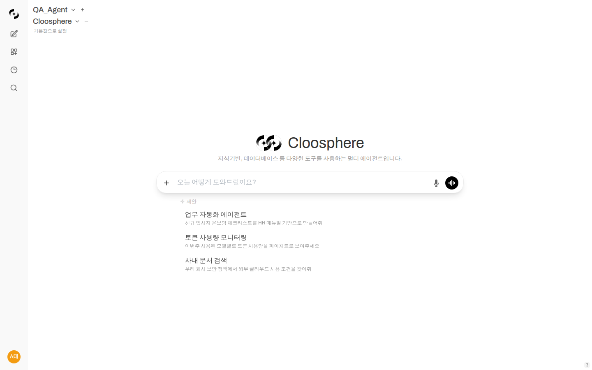
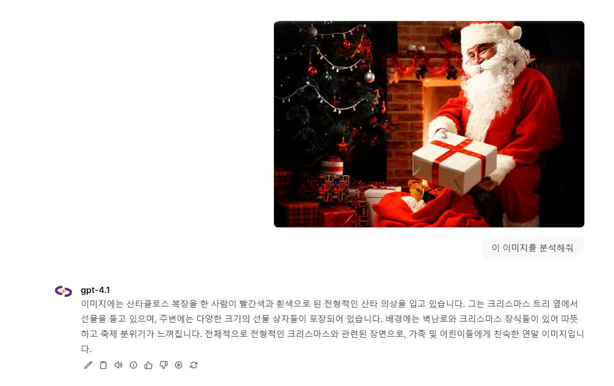
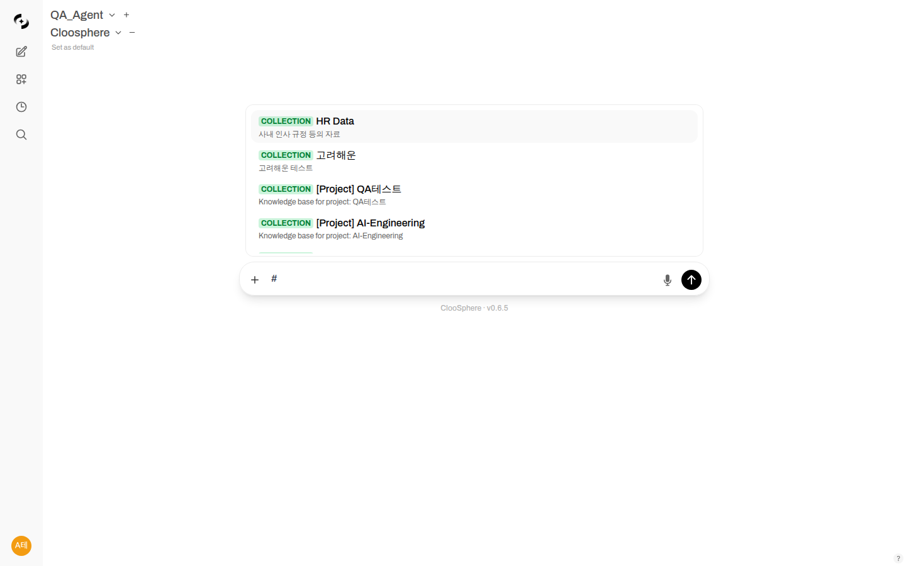
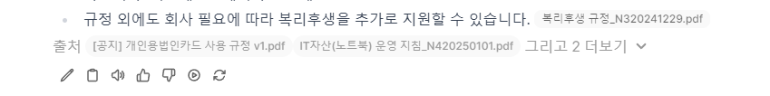
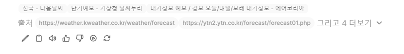
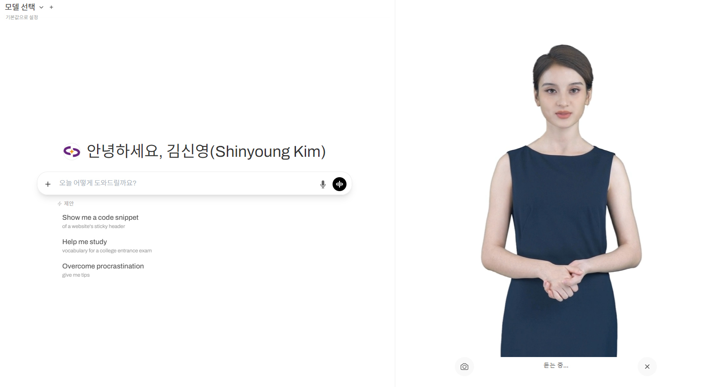
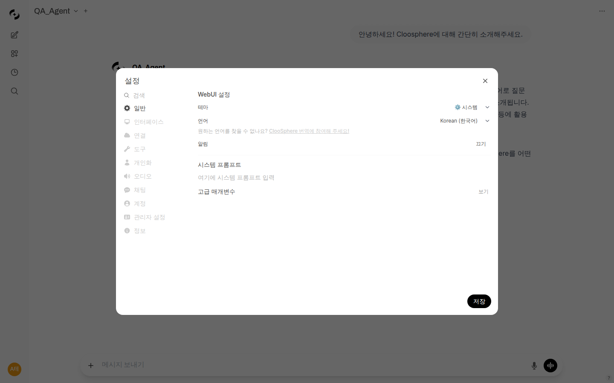

# Chat Features

> Cloosphere's chat goes beyond simple conversation -- it is a comprehensive AI workspace that supports file analysis, code execution, web search, and voice conversations.

```mermaid
flowchart TB
    subgraph Input
        A[Text Input] --> E[Send Message]
        B[File Attachment] --> E
        C[Voice Input] --> E
        D[@ Commands] --> E
    end

    subgraph AI_Processing
        E --> F{Web Search Needed?}
        F -->|Yes| G[Web Search]
        F -->|No| H[LLM Processing]
        G --> H
        H --> I{Knowledge Base?}
        I -->|Yes| J[Document Search]
        I -->|No| K[Generate Response]
        J --> K
    end

    subgraph Output
        K --> L[Display Response]
        L --> M[Citations]
        L --> N[Code Execution]
        L --> O[TTS Playback]
    end
```

---

## Chat Screen Layout


| Area | Function |
|------|----------|
| **Sidebar** | Chat list, search, tag filters, workspace access |
| **Chat Header** | Model selection, chat menu, sharing options |
| **Message Area** | Conversation display, response controls |
| **Input Area** | Message input, file attachment, voice input |
| **Control Panel** | Model parameters, conversation flow visualization |

---

## Model Selection and Management

### Model Selector

The model selection dropdown provides **type-based categorization** and **sorting** features.

<!-- Screenshot: Model selector type categorization UI
     Filename: images/chat-model-selector-types.png
-->

| Type | Description |
|------|-------------|
| **Agents** | Pre-configured AI agents (with tools, knowledge base integrations) |
| **Models** | Base LLM models (GPT-4o, Claude, etc.) |

**Sorting options:**
- Alphabetical
- Recently used
- Favorites first

> 💡 **Tip**: When agents and models are mixed in one list, use the type filter to quickly find the item you need.

### Default Model Settings

You can set your frequently used model as the default.

1. Open the model selection dropdown
2. Select your desired model
3. Click **"Set as Default"**


### Multi-Model Conversations

You can receive responses from multiple models simultaneously for a single question.

1. Click the **"+"** button in the model selector
2. Select additional models
3. Send your question


**Use cases:**
- Compare responses from different models
- Cross-validate before making important decisions
- Select and merge the best responses

---

## Message Input

### Text Input

Freely type your questions or requests in the input field.

**Formatting support:**
- **Markdown**: `**bold**`, `*italic*`, `` `code` ``
- **New line**: `Shift + Enter`
- **Send**: `Enter` or the send button

### File Attachment

You can attach files using various methods.

| Method | Description |
|--------|-------------|
| **Drag and Drop** | Drag files into the chat window |
| **File Selection** | + button → Upload file |
| **Image Capture** | + button → Screen capture |
| **URL Input** | + button → Import content from URL |
| **Cloud Integration** | Google Drive, OneDrive, SharePoint |

**Supported file formats:**

| Category | Formats |
|----------|---------|
| Documents | PDF, DOCX, PPTX, TXT, MD, HTML |
| Spreadsheets | XLSX, CSV |
| Images | PNG, JPG, GIF, WebP |
| Code | PY, JS, TS, Java, C++, etc. |
| Data | JSON, XML, YAML |

### Image Analysis

When you attach an image, the AI analyzes and describes its contents.


**Use cases:**
- Extract data from charts/graphs
- OCR on document images
- UI design feedback
- Error screen analysis

### Voice Input

Click the microphone button to input via voice.


1. 🎤 Click the **microphone button**
2. Speak your message
3. Automatic speech-to-text conversion
4. Edit if needed, then send

---

## Command System

Use commands starting with `@` to quickly invoke features.

### @model-name - Specify Model

Ask a specific model directly.

```
@gpt-4o Review this code
```

### /prompt - Use Template

Load a saved prompt template.

```
/compose-email Email to client about project delay notification
```

### #knowledge-base - Reference Documents

Generate answers referencing documents from a specific knowledge base.

```
#HR-Policy What is the procedure for requesting annual leave?
```


---

## Using AI Responses

### Response Toolbar

Various tools are provided below each AI response.


| Button | Function |
|--------|----------|
| ✏️ **Edit** | Edit the response |
| 📋 **Copy** | Copy the entire response |
| 🔊 **Audio** | Read response via TTS |
| ℹ️ **Info** | View token usage |
| 👍👎 **Rate** | Provide response quality feedback |
| ▶️ **Continue** | Continue generating the response |
| 🔄 **Regenerate** | Request a new response |

### Code Execution

You can run AI-generated Python code directly and view the results.

**Supported features:**
- Python code execution
- Data visualization (matplotlib, plotly)
- File creation and download
- View execution results

### Artifact Viewer

You can preview HTML, CSS, and JavaScript generated by AI.

1. Ask the AI to generate a web page or component
2. Click the **"Preview"** button in the response
3. Review the result and copy the code

### Citations and Sources

Responses that reference a knowledge base or web search display their sources.


- Click the numbered badges to view the original text
- Transparently shows which documents the information was retrieved from
- Enables verification of information reliability

### Follow-Up Question Suggestions

After the AI finishes a response, **a few natural follow-up questions are automatically suggested**. Click a suggestion to drop it straight into the input box and send it, so the conversation keeps flowing and you can dig deeper without having to think about what to ask next.

<!-- Screenshot: Follow-up question suggestion buttons below an AI response
     Filename: images/chat-followup-questions.png
-->

> 💡 **Tip:** Administrators can toggle follow-up question suggestions globally in Interface settings, and the feature can also be turned off per agent or per chat.

---

## Web Search

The AI searches the web in real time to provide the latest information.



**How it works:**
1. Recognizes questions that require up-to-date information
2. Automatically performs a web search
3. Generates answers based on search results
4. Provides source links

**Use cases:**
- "What is the current S&P 500 index?"
- "What are the latest AI trends?"
- "Find recent news about this company"

---

## Conversation Management

### Chat Search

Quickly find conversations using the search input at the top of the sidebar.

**Search methods:**
- **Title search**: Search by keywords in conversation titles
- **Content search**: Search by message content within conversations
- **Tag search**: Filter conversations by tag using the `tag:tagname` format

> 💡 **Tip**: Use the `Ctrl + K` shortcut to quickly access the search bar.

### Chat Folders

Organize conversations into folders for systematic management.

**Creating folders:**
1. Click the **"New Folder"** button in the sidebar
2. Enter a folder name
3. Create sub-folders as needed (nested folders are supported)

**Moving conversations to folders:**
1. Right-click or click the menu button on a conversation item
2. Select **"Move to Folder"**
3. Choose the target folder

**Folder management:**
- Rename folders
- Move folders (change parent folder)
- Collapse/expand folders
- Delete folders

> 💡 **Tip**: Create folders by project or work type to easily manage dozens of conversations.

### Pinned Chats

Pin important conversations to the top of the sidebar.

1. Click the menu button on a conversation item
2. Select **"Pin"**
3. Pinned conversations appear in the **Pinned** section at the top of the sidebar

To unpin, select **"Unpin"** from the same menu. Pinned conversations are always displayed at the top, separately from folder-organized conversations.

### Organizing with Tags

Add tags to conversations to categorize them.

**Adding tags:**
1. Click the menu button on a conversation item
2. Select **"Add Tag"**
3. Enter a tag name (select an existing tag or create a new one)

**Filtering by tags:**
- Click a tag in the sidebar to show only conversations with that tag
- Enter `tag:tagname` in the search bar to filter

**Automatic tag cleanup:**
- When the last conversation linked to a tag is deleted, the tag is automatically removed

**Recommended tag examples:**
- 📊 Data Analysis
- 📝 Reports
- 💻 Coding
- 📧 Email
- 🔍 Research

### Chat Archiving

Archive conversations that are no longer actively used but you want to keep.

**Archiving vs. Deleting:**

| Action | Description | Recoverable |
|--------|-------------|-------------|
| **Archive** | Hides the conversation from the sidebar and moves it to the archive list | Can be restored anytime |
| **Delete** | Permanently removes the conversation | Cannot be recovered |

**How to archive:**
1. Click the menu button on a conversation item
2. Select **"Archive"**
3. The conversation disappears from the sidebar and moves to the archive list

**Viewing archived conversations:**
- Check the **"Archived Chats"** menu at the bottom of the sidebar
- Click **"Unarchive"** to restore an archived conversation

**Bulk archiving:**
- Use the **"Archive All Chats"** feature to archive all conversations at once

> 💡 **Tip**: Archive old conversations instead of deleting them. You can always look them up later when you need a reference.

### Temporary Chats

Start one-off conversations that are not saved.

**Enabling temporary chat:**
1. Toggle **"Temporary Chat"** at the bottom of the model selector
2. The URL gains a `?temporary-chat=true` parameter
3. Subsequent conversations are not saved to the chat list

**Characteristics of temporary chats:**
- Conversation history is not saved to the server
- Does not appear in the sidebar chat list
- Message rating (like/dislike) is disabled
- Memory extraction is not performed
- Conversation content is lost when you close the browser or start a new chat

**Use cases:**
- One-off questions involving sensitive information
- Quick testing or experimentation
- Conversations you do not want recorded

> 💡 **Tip**: Administrators can configure temporary chat permissions. Depending on organizational policy, temporary chats can be enforced or disabled.

### Sharing Conversations

You can share conversation content with colleagues.

1. Click **"Share"** in the chat menu
2. Generate a share link
3. Send the link to your colleague
4. They can view the conversation via the link

---

## Voice Conversation (Voice Call)

Have real-time voice conversations with AI.

### Starting a Voice Call

1. Click the **phone button** next to the input field
2. Allow microphone permissions
3. Start speaking with AI

**Benefits:**
- Hands-free operation
- Natural conversation
- Real-time responses

### AI Avatar

AI responses are delivered through a lifelike avatar character with synchronized voice. Powered by Azure AI Speech, the high-quality avatar provides an experience that feels like talking to a real person.



**Key features:**

| Feature | Description |
|---------|-------------|
| **Real-time Lip Sync** | Natural mouth movements synchronized with speech |
| **Multiple Characters** | Choose from various avatar characters |
| **Facial Animations** | Natural expressions matching the conversation |
| **HD Rendering** | High-definition video quality |

**Use cases:**
- 🎓 **Education/Training**: Interactive learning content
- 🏢 **Kiosks**: Unattended information systems
- 💼 **Presentations**: AI presenter capabilities
- 🎧 **Accessibility**: For users who need visual feedback

**How to use the avatar:**
1. Start voice call mode
2. Enable the avatar in settings
3. Select your preferred avatar character
4. The avatar responds as you chat with AI

> 💡 **Tip**: The avatar feature integrates with Azure AI Speech services to deliver natural voice and video.

---

## Memory System

Cloosphere provides a memory system that automatically extracts and remembers important information from conversations. Through memory, the AI remembers your preferences, work context, tech stack, and more, delivering increasingly personalized responses over time.

<!-- Screenshot: Memory management UI
     Filename: images/chat-memory-management.png
-->

### Memory Types

| Type | Description | Example |
|------|-------------|---------|
| **Long-term Memory** | User information retained across conversations | "I primarily use Python and TypeScript" |
| **Short-term Memory** | Information referenced within the current session | "This project is React-based" |

### Automatic Memory Extraction

The AI automatically detects and stores user preferences, work styles, project information, and more during conversations. Automatically extracted memories are marked with an **Auto** badge to distinguish them from manually added memories.

**Auto-extraction targets:**
- User preferences and styles
- Project and tech stack information
- Work-related rules and conventions
- Repeatedly mentioned requirements

**Extraction process:**
1. After a conversation completes, the memory extraction pipeline runs in the background
2. The AI analyzes the conversation content to identify facts worth remembering
3. Only information that meets the confidence threshold is saved as memory (administrators can configure the confidence threshold)
4. A debounce mechanism (5 minutes) prevents duplicate extraction from the same conversation

> 💡 **Tip**: Memory extraction is not performed in temporary chats.

### Profile Consolidation

Over time, accumulated memories undergo automatic **Profile Consolidation**. This is the process of consolidating individual facts into a structured profile document.

**Consolidation trigger conditions:**
- **24 hours** have passed since the last consolidation, and **5 or more new facts** have been accumulated

**Consolidation process:**
1. All individual memory facts are collected
2. The AI cleans up duplicate or outdated information
3. A profile document organized by category is generated:
   - **Role & Work** -- job function, responsibilities
   - **Tech Preferences** -- languages, frameworks, tools
   - **Current Projects** -- what is currently being worked on
   - **Constraints & Requirements** -- work rules, conventions
   - **Communication Style** -- preferred response format
4. The consolidated profile is used as AI context in all subsequent conversations

### How Memory Enhances Conversations

The memory system uses **semantic search** backed by a vector database to automatically find and apply relevant past information to the current conversation.

**Examples:**
- "Write a report" → automatically applies previously stored report format preferences
- "Design an API" → reflects the user's preferred language and framework
- "Review this code" → provides feedback considering the team's coding conventions

### Memory Management

View and manage saved memories under **Settings > Personalization > Memory**.

<!-- Screenshot: Memory list and edit UI
     Filename: images/chat-memory-list.png
-->

**Management features:**

| Feature | Description |
|---------|-------------|
| **View list** | View all saved memories in chronological order. Auto/Manual badges indicate the source |
| **Add manually** | Directly add memories to tell the AI information to remember |
| **Edit individual** | Modify the content of existing memories |
| **Delete individual** | Selectively delete incorrectly saved memories |
| **Reset all** | Delete all memories at once and start fresh |
| **Enable/disable** | Toggle the memory feature on or off |

> 💡 **Tip**: If any incorrectly saved memories exist, delete them individually to maintain AI response quality. Profile consolidation will automatically clean up as memories accumulate, but obviously incorrect information should be removed manually.

---

## Human-in-the-Loop Interactive Wizard

When handling complex requests, the AI can ask users for additional information through an interactive wizard.

<!-- Screenshot: Human-in-the-Loop wizard example
     Filename: images/chat-hitl-wizard.png
-->

### How It Works

1. User sends a complex request
2. AI determines additional information is needed
3. Displays an **interactive wizard** with follow-up questions
4. User responds via selections or text input
5. AI generates the final response based on the collected information

### Wizard Elements

| Element | Description |
|---------|-------------|
| **Selection Buttons** | Choose from predefined options |
| **Text Input** | Free-form additional information entry |
| **Confirm/Cancel** | Proceed with or skip the wizard |

**Use cases:**
- Agent confirming tables/columns before a database query
- Collecting details (format, scope, audience) for report generation
- Clarifying intent for ambiguous requests

> 💡 **Tip**: Skipping the wizard causes the AI to proceed with defaults. Respond to the wizard for more accurate results.

---

## Personal Settings

Customize your chat environment from the settings modal.



### Interface Settings

- **Theme**: Light/Dark/System
- **Language**: English, 한국어, 日本語
- **Widescreen**: Wide screen mode

### Audio Settings

- **STT Engine**: Select speech recognition engine
- **TTS Engine**: Select speech synthesis engine
- **Voice**: Choose your preferred voice

### Personalization

- **Memory**: Store information for AI to remember (see Memory System above)
- **Context**: Background information applied to all conversations

---

## Keyboard Shortcuts

| Shortcut | Function |
|----------|----------|
| `Enter` | Send message |
| `Shift + Enter` | New line |
| `Ctrl + /` | Toggle sidebar |
| `Ctrl + N` | New chat |
| `Ctrl + K` | Search |
| `Esc` | Close modal |

---

## Next Steps

- 🤖 [Automate Tasks with Agents](./workspace/agents.md)
- 📚 [Build a Knowledge Base](./workspace/knowledge.md)
- 📝 [Create Prompt Templates](./workspace/prompts.md)
