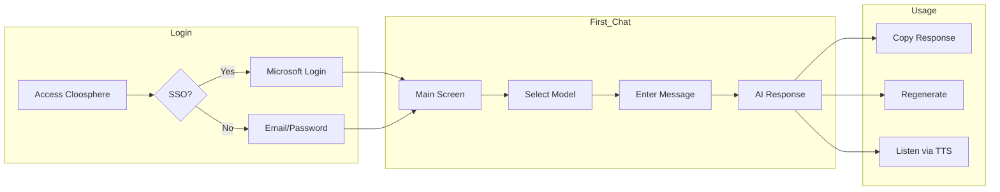
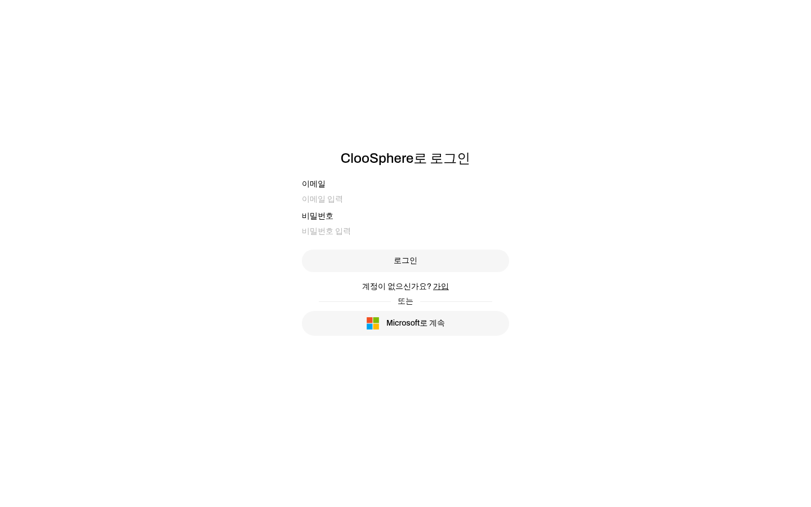
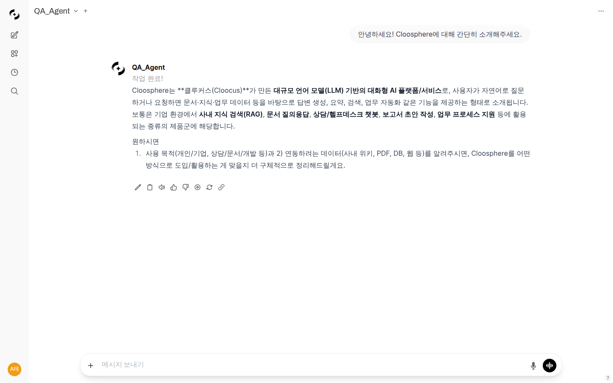
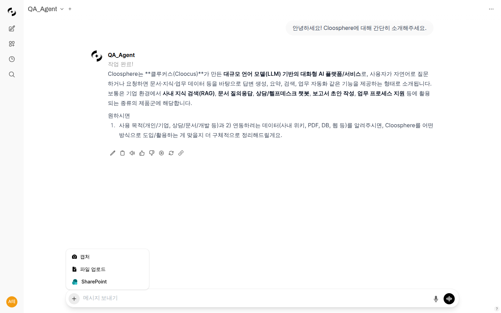
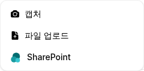
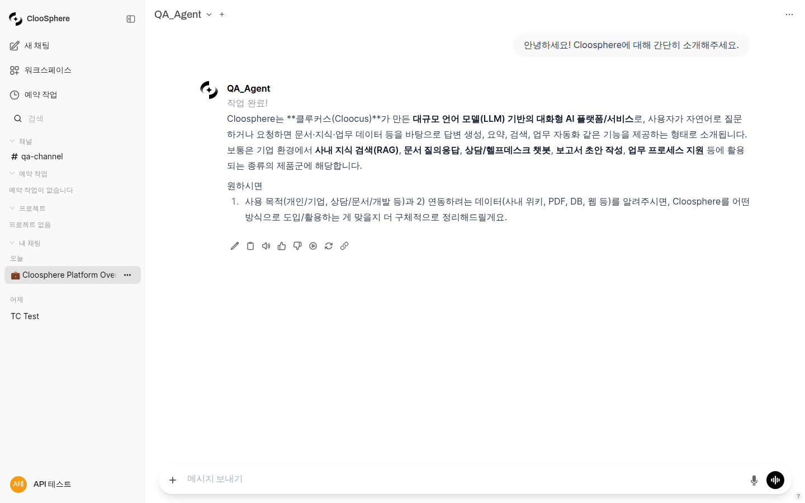

# Getting Started Guide

> New to Cloosphere? Follow this guide to start chatting with AI in just 5 minutes.



---

## Login

Cloosphere supports various SSO (Single Sign-On) authentication methods.

### Supported Authentication Methods

| Authentication Method | Status | Description |
|----------------------|--------|-------------|
| **Microsoft Entra ID** | ✅ Supported | Azure AD-based corporate accounts |
| **Google Workspace** | 🚧 Coming Soon | Google corporate accounts |
| **OIDC/OAuth 2.0** | 🚧 Coming Soon | Other IdP integrations |

### Sign In with Microsoft Account (SSO)

If your organization uses Microsoft Entra ID (Azure AD), you can sign in easily with your corporate account.

1. Enter the Cloosphere URL in your browser
2. Click the **"Sign in with Microsoft"** button
3. Enter your corporate account credentials
4. You will be automatically redirected to the main screen

**Benefits:**
- No separate account creation required
- No need to manage a separate password
- Corporate security policies automatically applied
- Organization information automatically synced

### Standard Login

If SSO is not available:

1. Enter your email and password
2. Click the **"Sign In"** button


---

## Exploring the Main Screen

After logging in, the main chat screen appears.


### ① Sidebar (Left)

| Area | Description |
|------|-------------|
| **New Chat** | Start a new conversation |
| **Chat List** | Previous conversation history |
| **Workspace** | Manage agents, knowledge bases, etc. |
| **Admin** | System settings (admins only) |

### ② Chat Area (Center)

The main area where conversation content is displayed.
- User messages: right-aligned
- AI responses: left-aligned

### ③ Model Selection (Top)

Select the AI model to use. Each model has different characteristics:

| Model Type | Features | Recommended Use |
|------------|----------|-----------------|
| **GPT-4o** | Latest high-performance model | Complex analysis, code writing |
| **GPT-4o-mini** | Fast and cost-effective | General conversation, simple questions |
| **Claude** | Excellent at processing long documents | Document summarization, report writing |

### ④ Input Field (Bottom)

Where you type your questions or requests.

---

## Starting Your First Conversation

### 1. Select a Model

Choose your desired model from the model selection dropdown at the top.


### 2. Enter a Message

Type your question in the input field at the bottom.

**Example questions:**
- "Draft a quarterly sales report template"
- "Show me Python code to read an Excel file"
- "Translate this email into formal business language"

### 3. Send

Press **Enter** or click the **send button**.

### 4. View the Response

The AI generates a response in real time. Text is streamed as the response is being generated.


---

## Attaching Files

Cloosphere allows you to share various file formats with AI.

### Supported File Formats

| Format | Extensions | Use Cases |
|--------|-----------|-----------|
| **Documents** | PDF, DOCX, TXT, MD | Document summarization, content analysis |
| **Spreadsheets** | XLSX, CSV | Data analysis, chart creation |
| **Images** | PNG, JPG, GIF | Image analysis, OCR |
| **Code** | PY, JS, etc. | Code review, bug detection |

### How to Attach Files


**Method 1: Drag and Drop**
Drag files directly into the chat window.

**Method 2: Attachment Button**
Click the **+** button to the left of the input field.

**Method 3: Cloud Storage**
Connect to SharePoint, Google Drive (coming soon), and more to import files directly.



### Asking Questions with Files

```
Summarize the key points of the attached PDF document in 3 lines
```

```
Analyze the sales data in this Excel file and show it as a chart
```

---

## Managing Conversations

### Continuing a Conversation

The AI remembers previous messages, allowing you to ask follow-up questions.

```
[First question] Write a web crawler in Python
[Follow-up] Add error handling to this code
[Follow-up] Also add the ability to save results to a CSV file
```

### Starting a New Conversation

Click the **"New Chat"** button in the sidebar to start a new conversation.
Previous conversations are saved in the sidebar list.

### Searching Conversations

You can search through previous conversations using the search bar at the top of the sidebar.



### Organizing Conversations

- **Pin**: Pin important conversations to the top
- **Tags**: Categorize conversations by topic
- **Delete**: Remove unnecessary conversations

---

## Using Responses

### Copy

Click the **Copy** button below the AI response to copy the content to your clipboard.

### Copy Code

Use the **Copy** button in the upper-right corner of a code block to copy just the code.

### Regenerate

If you are not satisfied with the response, click the **Regenerate** button.
You can receive an answer from a different perspective.

### Listen via TTS

Click the **Speaker** button to have the AI read the response aloud.


---

## Useful Tips

### Getting Better Answers

1. **Be specific with your questions**
   - ❌ "Write a report"
   - ✅ "Write a Q1 2024 marketing performance report. Make it 2 pages long and include key KPIs and areas for improvement"

2. **Provide context**
   - ❌ "Fix this"
   - ✅ "This Python code is throwing a TypeError. Find the cause and fix it"

3. **Specify the desired format**
   - "Organize it in a table"
   - "List them in numbered order"
   - "Write it in markdown format"

### Keyboard Shortcuts

| Shortcut | Function |
|----------|----------|
| `Enter` | Send message |
| `Shift + Enter` | New line |
| `Ctrl + /` | Toggle sidebar |
| `Ctrl + N` | New chat |

---

## Need Help? — Guide Q&A

Click the **? button** in the page header to open the **Guide Q&A panel**. An AI assistant answers your questions based on the guide documentation.

<!-- Screenshot: Guide Q&A panel
     Filename: images/guide-qa-panel.png
-->

**Key features:**
- Guide-based Q&A — Ask questions like "How do I create an agent?" and get answers sourced from the relevant guide
- Multi-turn conversation — Continue the conversation with follow-up questions
- Model selection — Change the AI model from the top of the panel

**Example questions:**
- "How do I add documents to a knowledge base?"
- "What are guardrails?"
- "How do I connect a dashboard to a scheduled task?"

> **Tip:** The ? button is located in the header across all pages — Chat, Workspace, Admin, etc.

---

## Next Steps

Now that you have learned the basics, explore more powerful features:

- 📚 [Connect Internal Documents with Knowledge Base](./workspace/knowledge.md)
- 🤖 [Create Your Own Agent](./workspace/agents.md)
- 🔧 [Connect External Tools](./workspace/tools.md)

---

## Having Issues?

- Can't log in? → Ask your IT administrator to verify your account permissions
- Slow responses? → Try switching to a different model
- Other inquiries → support@cloocus.com
