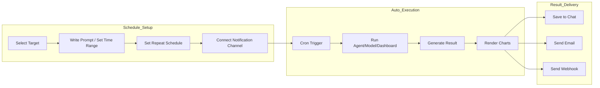

# Scheduled Tasks

> Automate repetitive AI tasks. Use the cron scheduler to run agents, models, and flows at specified times, and receive results automatically via email or webhook.



---

## What Are Scheduled Tasks?

Scheduled tasks automatically send prompts to AI agents or models at specified times, save the results, and deliver them via notifications.

<!-- Screenshot: Scheduled tasks overview
     - Full schedule list screen
     Filename: images/schedule-overview.png
-->

**Use cases:**
- Generate daily sales reports every morning at 9 AM
- Run weekly data analysis every Monday
- Check system status hourly and send alerts on anomalies

---

## Schedule List

View all schedules under **Workspace > Scheduled Tasks**.

<!-- Screenshot: Schedule list screen
     - Schedules displayed as cards
     - Search bar, create button, active/inactive toggles
     Filename: images/schedule-list.png
-->

### List Features

| Feature | Description |
|---------|-------------|
| **Search** | Search by name, description, or prompt |
| **Active/Inactive Toggle** | Instantly enable or disable a schedule |
| **Run Now** | Execute immediately without waiting for the next cycle |
| **Delete** | Delete schedule and all execution history |

---

## Creating a Schedule

Click the **"+ New Schedule"** button to create a schedule.

### Step 1: Basic Information

<!-- Screenshot: Schedule creation form - basic info
     - Name, description input fields
     Filename: images/schedule-create-basic.png
-->

| Field | Description | Example |
|-------|-------------|---------|
| **Name** | Schedule name | "Daily Sales Report" |
| **Description** | Purpose description (optional) | "Daily sales data analysis at 9 AM" |

### Step 2: Select Target

Choose the agent, flow, or model to execute.

<!-- Screenshot: Target selection dropdown
     - Agent/Flow/Model categories
     Filename: images/schedule-target-select.png
-->

| Target Type | Description |
|-------------|-------------|
| **Dashboard** | Export a BI dashboard as HTML (with time range preset) |
| **Agent** | AI agent with connected knowledge bases, databases, etc. |
| **Flow** | Multi-step workflow |
| **Model** | Base LLM model (direct prompt delivery) |

> **Tip:** When you select a dashboard, a **time range preset** appears instead of a prompt. For agents/flows/models, you enter a prompt as usual.

### Step 3-A: Set Time Range (Dashboard Target)

When a dashboard is selected, a **time range preset** dropdown replaces the prompt input. The date range is automatically calculated relative to the execution time and applied to all dashboard panels.

<!-- Screenshot: Dashboard time range preset selection
     Filename: images/schedule-dashboard-time-range.png
-->

| Time Range Preset | Description | Example (if today is Apr 6) |
|-------------------|-------------|----------------------------|
| **Yesterday** | Previous day only | Apr 5 – Apr 5 |
| **Today** | Current day only | Apr 6 – Apr 6 |
| **Last 7 Days** | Past 7 days including today | Mar 31 – Apr 6 |
| **Last 30 Days** | Past 30 days including today | Mar 7 – Apr 6 |
| **Last Week** | Previous Mon–Sun | Mar 30 – Apr 5 |
| **This Week** | Current Mon–Today | Apr 6 – Apr 6 |
| **Last Month** | Previous month (1st–last day) | Mar 1 – Mar 31 |
| **This Month** | Current month (1st–Today) | Apr 1 – Apr 6 |

**How it works:**
- Date filters (`$st`, `$ed`) in each panel's SQL are automatically replaced with the selected range
- All panels are executed sequentially and the results are compiled into a self-contained HTML file
- The generated HTML includes Plotly charts and can be opened without any server

### Step 3-B: Write Prompt (Agent/Flow/Model Target)

Enter the prompt to be sent on each execution.

<!-- Screenshot: Prompt input area
     Filename: images/schedule-prompt.png
-->

**Writing tips:**
- Specify the desired output format clearly
- If the agent has structured output (JSON Schema) configured, result fields can be used in notification templates

**Example:**
```
Analyze today's sales data and create a report including the day-over-day change rate and key contributing factors.
Visualize with charts and summarize the top 3 key insights.
```

### Step 4: Repeat Schedule (Cron Editor)

Set the execution frequency using the intuitive cron editor.

<!-- Screenshot: Cron editor UI
     - Repeat mode selection, time settings
     Filename: images/schedule-cron-editor.png
-->

#### Repeat Modes

| Mode | Description | Example |
|------|-------------|---------|
| **Interval** | Execute every N minutes (1, 2, 3, 5, 10, 15, 20, 30) | Every 10 minutes |
| **Hourly** | Execute at a specific minute each hour | At minute 30 of every hour |
| **Daily** | Execute at a specified time each day | Every day at 9:00 AM |
| **Weekly** | Execute on selected days at a specified time | Mon-Fri at 9:00 AM |
| **Monthly** | Execute on a specific day at a specified time | 1st of every month at 8:00 AM |
| **Custom** | Enter cron expression directly | `0 9 * * 1-5` |

#### Cron Expression Guide (Custom Mode)

In custom mode, you enter cron expressions directly. A cron expression consists of **5 fields**.

```
┌─────────── Minute (0-59)
│ ┌─────────── Hour (0-23)
│ │ ┌─────────── Day of month (1-31)
│ │ │ ┌─────────── Month (1-12)
│ │ │ │ ┌─────────── Day of week (0-6, 0=Sunday)
│ │ │ │ │
* * * * *
```

**Special characters:**

| Character | Meaning | Example |
|-----------|---------|---------|
| `*` | Any value | `* * * * *` = every minute |
| `,` | Multiple values | `0 9,18 * * *` = 9 AM, 6 PM |
| `-` | Range | `0 9 * * 1-5` = Mon to Fri |
| `/` | Step/interval | `*/10 * * * *` = every 10 min |

**Day of week numbers:**

| Number | Day |
|--------|-----|
| 0 | Sunday |
| 1 | Monday |
| 2 | Tuesday |
| 3 | Wednesday |
| 4 | Thursday |
| 5 | Friday |
| 6 | Saturday |

**Common examples:**

| Cron Expression | Description |
|-----------------|-------------|
| `0 9 * * *` | Every day at 9:00 AM |
| `0 9 * * 1-5` | Weekdays (Mon-Fri) at 9:00 AM |
| `0 9,18 * * *` | Every day at 9:00 AM and 6:00 PM |
| `30 8 * * 1` | Every Monday at 8:30 AM |
| `0 0 1 * *` | 1st of every month at midnight |
| `0 0 1,15 * *` | 1st and 15th of every month at midnight |
| `*/30 * * * *` | Every 30 minutes |
| `0 */2 * * *` | Every 2 hours on the hour |
| `0 9 * * 1,3,5` | Mon, Wed, Fri at 9:00 AM |
| `0 22 * * 0` | Every Sunday at 10:00 PM |

> **Tip:** Use Interval/Hourly/Daily/Weekly/Monthly modes for auto-generated cron expressions. Only use Custom mode for complex schedules.

#### Timezone and Period

| Setting | Description |
|---------|-------------|
| **Timezone** | Time zone for execution times (default: browser timezone) |
| **Start Date** | Schedule start date (optional) |
| **End Date** | Schedule end date (optional, indefinite if not set) |

### Step 5: Notification Settings

Configure channels to receive execution results. Multiple notifications can be added.

<!-- Screenshot: Notification settings UI
     - Channel selection, trigger conditions, template input
     Filename: images/schedule-delivery.png
-->

| Setting | Description |
|---------|-------------|
| **Channel Type** | Email / Webhook (pre-configured) / Direct URL |
| **Channel Selection** | Select admin-configured email or webhook channel |
| **Trigger** | Always / On Success Only / On Failure Only |
| **Title Template** | Notification title (template variables available) |
| **Email Recipients** | List of email addresses (email channel only) |
| **Subject/Body Template** | Email subject and body (email channel only) |
| **Message Template** | Webhook message (webhook channel only, optional) |

> **Tip:** Add multiple notifications to a single schedule to route by condition — for example, send email on success and Slack on failure.

### Step 6: Access Control

Set read/write permissions for the schedule by group, user, or organization.

<!-- Screenshot: Access control settings - Visibility toggle + AccessControlModal
     Filename: images/schedule-access-control.png
-->

| Option | Description |
|--------|-------------|
| **Public** | Visible to all signed-in users (`access_control: null`) |
| **Private** | Only the owner and admins can view/edit (`access_control: {}`) |
| **Group/User Assignment** | Grant read or write access to specific groups, users, or organizations |

#### Allowed Actions by Permission Level

| Permission | Allowed Actions |
|------------|-----------------|
| **Read** sharee | View schedule details · view execution history · view result chat (read-only) · copy to your own schedule |
| **Write** sharee | All of the above + edit · delete · toggle active/inactive · **Run Now** |
| **Owner / Admin** | All of the above + copy-share to other users · post follow-up messages in the result chat |

> **Tip:** Copy-sharing a schedule (creating a new copy for another user) is restricted to the owner and admins to prevent permission propagation. The copy button is disabled even for write sharees.

#### Execution Always Runs in the Owner's Context

When a write sharee clicks **Run Now**, the schedule still **executes under the owner's context (`schedule.user_id`)**. That means:

- Permissions for connected agents, dashboards, tools, knowledge bases, and databases are all evaluated **as the owner**
- Write sharees only receive a trigger handle — no privilege escalation occurs
- The user who triggered a manual run is recorded in the execution history as `triggered_by_user_id` for audit purposes (empty for the scheduler's automatic runs)
- During agent execution, glossaries are also re-filtered against the owner's read permission, so any private glossaries the owner cannot access are automatically blocked

> **Caution:** The output a sharee sees still reflects the **owner's data and resources**. Carefully review result visibility before sharing schedules that are connected to sensitive databases or knowledge bases.

#### Follow-up Messages in the Result Chat Are Owner-Only

The chat that accumulates schedule results allows **only the owner to post follow-up messages**.

- Read/write sharees and non-owner admins see the chat in **read-only mode**
- Instead of an input box, a banner appears: _"This chat is a scheduled task log shared with read-only access. Messaging is disabled."_
- Why: the worker accumulates chat history under the owner's context, so additional messages from non-owners would contaminate the owner's data and history

<!-- Screenshot: Shared schedule result chat (read-only banner)
     Filename: images/schedule-chat-readonly.png
-->

---

## Managing Schedules

### Enable/Disable

Use the toggle switch in the list to instantly enable or disable a schedule. When disabled, no further executions are scheduled.

### Run Now

Click the **"Run"** button to execute immediately without waiting for the next cycle. Useful for manual testing or checking results. Only users with execution rights (owner, admin, or write sharees) can trigger a run; the execution context is always pinned to the owner regardless of who triggered it.

### Edit

Click a schedule card to access its detail page where all settings can be modified. The next execution time is automatically recalculated on save. Requires **write** permission.

### Delete

Deleting a schedule also removes all associated execution history. Requires **write** permission.

---

## Execution History

View the most recent 50 executions on the schedule detail page.

<!-- Screenshot: Execution history table
     - Status badges, execution time, duration, error messages
     Filename: images/schedule-task-history.png
-->

### Statuses

| Status | Color | Description |
|--------|-------|-------------|
| **Pending** | Yellow | Waiting to execute |
| **Running** | Blue | Currently executing |
| **Completed** | Green | Successfully completed |
| **Failed** | Red | Error occurred |

### History Details

| Field | Description |
|-------|-------------|
| **Execution Time** | Scheduled execution time |
| **Duration** | Time from start to completion |
| **Retry Count** | Automatic retry count on error (max 2) |
| **Error Message** | Failure reason (on failure) |
| **View Chat** | Navigate to the chat with saved results |

### Automatic Retries

Timeout errors, server errors (5xx), and rate limit errors are automatically retried up to 2 times. Tasks running for more than 10 minutes are automatically recovered.

### History Retention

Completed and failed execution records are automatically deleted after 30 days.

---

## Chat Storage

All execution results are saved to a dedicated chat.

<!-- Screenshot: Schedule result chat screen
     - Chat with user prompt and AI response saved
     Filename: images/schedule-chat-result.png
-->

**How it works:**
- A new chat is created on the first execution
- Subsequent results accumulate in the same chat
- Chat title is set from the notification title template (default: `[Scheduled Task] Schedule Name`)
- Click the **"View Chat"** link in execution history to navigate directly

---

## Chart Images

Charts generated by database (DbSphere) agents are converted to images via server-side rendering and included in notifications.

<!-- Screenshot: Example chart image in email
     Filename: images/schedule-chart-email.png
-->

**Supported chart types:**
- Bar chart, Line chart, Pie chart, Scatter plot
- Heatmap, Histogram, Grouped bar chart

**Delivery methods:**

| Channel | Method |
|---------|--------|
| **Email** | Embedded as inline images in the body |
| **Slack** | Displayed via image URL |
| **Teams** | Included in Adaptive Card as image |
| **Discord** | Included in embed (first image) |

---

## Dashboard Export

Dashboard-targeted schedules generate and deliver results differently from agent/model schedules.

### Execution Result

- **All panel SQLs are executed** with the selected time range preset applied
- Results are compiled into a **self-contained HTML file** with Plotly charts
- If the dashboard has a share link configured, the result message includes the share URL

### Notification Delivery

| Channel | Method |
|---------|--------|
| **Email** | Dashboard HTML included as an **attachment** (`DashboardName.html`) |
| **Slack** | Card with "📊 View Dashboard" button + "View in Chat" button |
| **Teams** | Adaptive Card with dashboard link + chat link buttons |
| **Discord** | Embed with dashboard URL |

> **Tip:** Pre-create a dashboard share link so notification cards automatically include a shortcut button. Check share settings under Monitoring > Dashboards.

### Use Case Examples

```
Daily at 9 AM → "Yesterday" range → Send yesterday's sales dashboard HTML via email
Every Monday → "Last Week" range → Deliver weekly report dashboard via Slack
1st of month → "Last Month" range → Send monthly report dashboard via Teams
```

---

## Template Variables

Variables available for notification title, body, and message templates.

| Variable | Description | Example |
|----------|-------------|---------|
| `{{schedule_name}}` | Schedule name | Daily Sales Report |
| `{{prompt}}` | Executed prompt | Analyze today's sales data... |
| `{{result}}` | Full execution result | (complete AI response) |
| `{{status}}` | Execution status | completed / failed |
| `{{completed_at}}` | Completion time | 2025-02-27 09:00:45 |
| `{{dashboard_url}}` | Dashboard share URL (dashboard target only) | https://cloosphere.com/dashboard/abc123 |
| `{{time_range}}` | Time range preset (dashboard target only) | yesterday |
| `{{target_type}}` | Target type | dashboard / agent / flow / model |

### Accessing Structured Output

If the target agent has a JSON Schema response format configured, you can access individual fields using dot notation.

```
{{result.title}}           → title field from result JSON
{{result.data.count}}      → nested field access
{{result.metrics.revenue}} → revenue data access
```

> **Tip:** In the notification settings UI, structured output fields are automatically detected and displayed as buttons. Click to auto-insert into templates.

**Template examples:**

Email subject:
```
[{{schedule_name}}] {{status}} - {{completed_at}}
```

Email body:
```
Schedule "{{schedule_name}}" execution completed.

Prompt: {{prompt}}

Result:
{{result}}
```

---

## FAQ

**Q: My schedule is not executing.**
> Verify that the schedule is active and the start/end dates are configured correctly. Also check that you have access to the target agent/model.

**Q: How do I handle users in different time zones?**
> Each schedule can have its own timezone setting. For example: Seoul office uses Asia/Seoul, New York office uses America/New_York.

**Q: I can't see execution results in the chat.**
> The execution may have failed. Check the status and error message in the execution history.

**Q: Where do I configure notification channels?**
> Email and webhook channels are pre-configured by administrators under **Admin > Settings > Notifications**. Direct URL mode can be entered directly in the schedule without pre-configuration.

**Q: I don't know cron expressions.**
> Select Interval/Hourly/Daily/Weekly/Monthly modes to auto-generate cron expressions. If you need custom mode, refer to the [Cron Expression Guide](#cron-expression-guide-custom-mode) section above.

**Q: How do I connect a dashboard to a scheduled task?**
> When creating a schedule, select a dashboard from the **[Dashboards]** category in the target dropdown. When a dashboard is selected, you can set a time range preset (Yesterday, Last 7 Days, etc.) instead of a prompt. At execution time, the dashboard is exported as HTML with the selected time range and attached to notifications.

**Q: I don't see a shortcut button in my dashboard notification.**
> The dashboard must have a share link configured. Go to **Monitoring > Dashboards** and enable sharing for the dashboard first.

**Q: I don't see a message input in a result chat that was shared with me.**
> This is by design. Only the schedule owner can post follow-up messages in the result chat — sharees (including admins) view it read-only. The worker accumulates chat history under the owner's context, so allowing other users to interject would contaminate the owner's data and history.

**Q: If a write sharee clicks Run Now, does the schedule run with their permissions?**
> No. They only delegate the trigger; the actual execution always runs under the owner's context. Permissions for connected agents, dashboards, databases, knowledge bases, and glossaries are all evaluated as the owner. The user who triggered the manual run is recorded separately in the `triggered_by_user_id` field of the execution history.

---

## Next Steps

- [Notification Settings (Admin)](admin/notifications.md)
- [Creating Agents](workspace/agents.md)
- [Creating Flows](workspace/flows.md)
- [Database Connection](workspace/database.md)
