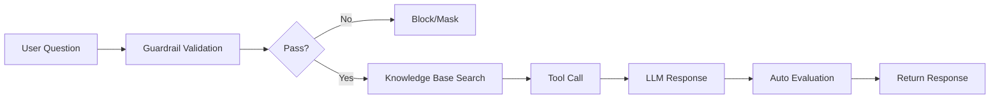

# Agents

> Agents are custom AI assistants optimized for specific tasks. Maximize productivity by configuring specialized AI for each department, such as marketing, development, and customer support.



---

## What Is an Agent?

An agent is a custom AI created by combining **knowledge**, **tools**, and **instructions** with a base AI model.

<!-- Screenshot: Agent concept diagram
     - Base Model + Knowledge Base + Tools + Task Prompt = Agent
     Filename: images/agent-concept.png
-->

**Examples:**
- **HR Assistant**: HR policy knowledge + annual leave calculator tool + HR-specific instructions
- **Code Reviewer**: GPT-4 + coding guidelines + code analysis tools
- **Customer Support Bot**: Claude + FAQ knowledge base + ticket system integration

### Agent vs Base Model

| Aspect | Base Model | Agent |
|--------|-----------|-------|
| **Knowledge** | Training data only | Internal documents connected |
| **Tools** | Basic features only | External system integrations |
| **Response Style** | General purpose | Task-specific |
| **Consistency** | Variable | Follows guidelines |

---

## Agent List

You can view all agents under Workspace > Agents.

<!-- Screenshot: Agent list screen
     - Agents displayed as cards
     - Search bar, create button
     Filename: images/agents-list-full.png
-->

### Agent Card

| Element | Description |
|---------|-------------|
| **Profile Image** | Agent icon |
| **Name** | Agent name |
| **Description** | Purpose and feature description |
| **Base Model** | LLM model used |
| **Tags** | Classification tags |

### Agent Search

You can find agents by name or description using the search bar at the top.

---

## Creating an Agent

### Step 1: Enter Basic Information

Click **Workspace > Agents > "+ New Agent"**

<!-- Screenshot: Agent creation screen - Basic info
     - Name, description, profile image input
     Filename: images/agent-create-basic.png
-->

| Field | Description | Example |
|-------|-------------|---------|
| **Name** | Agent display name | "Marketing Assistant" |
| **Description** | Agent purpose description | "Supports marketing content creation and analysis" |
| **Profile Image** | Icon image | Marketing-related image |
| **Tags** | Classification tags | Marketing, Content |

### Step 2: Select Base Model

Select the AI model the agent will use.

### Step 3: Write Prompts

Define the agent's role, personality, and response rules. You can configure two prompts in the agent creation screen.

| Field | Description |
|-------|-------------|
| **Task Prompt** | Defines the agent's role, personality, constraints, and specific task instructions. This serves as the "system prompt" for the agent. |
| **Response Format Prompt** | Specifies the response format and structure (markdown, tables, etc.). Allows you to manage response formatting separately from the task instructions. |

#### AI Prompt Auto-Generation

If writing prompts from scratch is difficult, use the **AI auto-generation** feature. Click the **auto-generate button** next to each prompt field, and AI will analyze the agent's name, description, and connected resources (knowledge bases, databases) to automatically write appropriate prompts.

| Item | Description |
|------|-------------|
| **Auto-generation targets** | Task prompt, response format prompt |
| **Analyzed info** | Agent name, description, connected resources |
| **Model selection** | Admins can designate the model used for AI auto-writing |

> **Tip:** Use AI-generated prompts as a starting point and fine-tune the details for faster, higher-quality agent setup.

**Good task prompt example:**

```markdown
You are a marketing assistant for Cloocus.

## Role
- Support marketing content creation
- Draft social media posts
- Analyze marketing data

## Response Rules
- Always respond in a professional but friendly tone
- Provide data-driven insights
- Follow brand guidelines

## Constraints
- Do not disparage competitors
- Do not use unverified statistics
```

### Step 3-1: Prompt Suggestions (Optional)

Configure **conversation starter suggestions** displayed to users when they select this agent in the chat screen.

| Option | Description |
|--------|-------------|
| **Default** | Uses system default suggestion prompts |
| **Custom** | Set custom suggestion prompts tailored to the agent |

**Tips:**
- Providing example questions relevant to the agent's purpose helps users start conversations quickly
- e.g., "Summarize this month's sales", "Draft a social media post"

### Step 4: Connect Knowledge Base

Connect documents that the agent will reference.

**How to connect:**
1. Click **"+ Add"** in the "Knowledge Base" section
2. Select the knowledge base to connect
3. Multiple selections are possible

**Benefits:**
- The agent references connected documents when answering
- Provides accurate internal information
- Can cite sources

### Step 4-1: Connect Glossary (Optional)

Connect a glossary to the agent so it can automatically look up domain-specific terms during conversations, producing more accurate responses.

**How to connect:**
1. Click **"+ Add"** in the "Glossary" section
2. Select the glossary to connect
3. Multiple selections are possible

**Benefits:**
- The agent accurately understands industry and internal terminology
- Abbreviations and synonyms are automatically recognized
- Consistent terminology improves response quality

> See [Glossary documentation](./glossary.md) for how to create a glossary.

### Step 5: Connect Tools (Optional)

Connect tools that integrate with external systems.

**Connectable tools:**
- API servers (OpenAPI)
- MCP servers

### Step 6: Feature Settings

Enable advanced features that the agent can use.

> **Note:** All feature toggles default to **disabled**. Users must manually enable them from the chat input menu (+ button) to use the features.

| Feature | Description |
|---------|-------------|
| **Web Search** | Agent retrieves the latest information via real-time web search |
| **Image Generation** | Agent generates images with AI during conversation (connection selectable) |
| **Code Interpreter** | Agent executes Python code for calculations and analysis |

#### Image Generation Connection Selection

When "Image Generation" is enabled, a checkbox list of image generation connections configured by the admin is displayed.

<!-- Screenshot: Image generation connection selection checkbox list
     - Engine badge (Azure OpenAI, OpenAI, etc.) + connection name
     Filename: images/agent-image-connections.png
-->

| Setting | Description |
|---------|-------------|
| **Connection Selection** | Select the image generation connections to use with this agent |
| **If None Selected** | All connections configured by the admin are available |

Users click "Image Generation" from the **"+" menu** in the chat input area, then select one of the connections allowed for the agent. Detailed information such as engine, model, and size for each connection is shown in a tooltip.

#### Web Search Detailed Settings

When "Web Search" is enabled, additional settings are displayed.

| Setting | Description | Example |
|---------|-------------|---------|
| **Number of Results** | Number of documents to retrieve from search | 5 |
| **Domain Filter** | Comma-separated list of allowed domains | `company.com, docs.example.com` |

#### Code Interpreter Usage

When the code interpreter is enabled on an agent, users enable it by toggling "Code Interpreter" from the **"+" menu** in the chat input area. Both the agent and user must have it enabled for the feature to work -- a dual-gate mechanism.

### Step 7: Set Access Permissions

Configure who can use this agent.

| Option | Description |
|--------|-------------|
| **Public** | Available to all users |
| **Private** | Available to the owner only |
| **Group-specific** | Available to specific groups only |
| **Organization-specific** | Available to specific departments only |

### Step 8: Set Guardrails (Optional)

Connect security guardrails to the agent to protect sensitive information.

<!-- Screenshot: Guardrail selection screen
     Filename: images/agent-guardrail-select.png
-->

**Guardrail features:**
- Automatic PII detection and masking
- Custom pattern filtering
- Prohibited word blocking
- LLM-based content validation

> For more details, see the [Guardrails documentation](./guardrails.md).

### Step 9: Set Auto Evaluation (Optional)

Automatically monitor the quality of agent responses.

<!-- Screenshot: Auto evaluation settings screen
     Filename: images/agent-auto-evaluation.png
-->

| Setting | Description |
|---------|-------------|
| **Enable** | Turn auto evaluation on/off |
| **Sampling Rate** | Percentage of responses to evaluate (1%~100%) |
| **Evaluation Type** | Select items to evaluate |
| **Judge Model** | Select the LLM to use for evaluation |

**Evaluation types:**

| Type | Description |
|------|-------------|
| **Retrieval Quality** | Evaluates the relevance of documents retrieved from the knowledge base |
| **Faithfulness** | Evaluates whether the response is faithful to retrieved content and free of hallucinations |
| **Response Quality** | Evaluates overall quality, usefulness, and accuracy of the response |

**Recommended settings:**
- New agents: Start with a 10-20% sampling rate
- After stabilization: Adjust to 5-10%
- Critical agents: Enable all evaluation types

### Step 10: Save

Click the **"Save"** button to create the agent.


<!-- Screenshot: Full screen
     Filename: images/agent-access-control.png
-->

---

## Missing Tool Description Warning (1.0.2)

If any resource attached to an agent (knowledge base / database / glossary / knowledge graph / tool / guardrail) has an **empty Tool Description**, an amber warning banner is shown at the bottom of that resource section.

<!-- Screenshot: Amber warning banner under a resource section in the agent editor
     - "Tool description is missing" + list of items missing a description
     Filename: images/agents-missing-description-warning.png
-->

| Item | Behavior |
|------|----------|
| **When checked** | Each section fetches the full list on agent editor mount and cross-checks against the selected items |
| **Where shown** | Bottom of every resource section (Knowledge Base, DbSphere, Glossary, KG, Tools, Guardrails) |
| **Message** | "Tool description is missing — these items may prevent the LLM from using them correctly" + the missing names |

> 💡 In a unified-agent setup the LLM picks among multiple tools **based on each tool's description**. An empty description means the LLM may pick the wrong tool or skip it entirely, so fix the missing entries as soon as the banner appears.

---

## Follow-Up Suggestion Task (1.0.2)

Right after an assistant response, the agent can now propose 3-5 likely follow-up questions, rendered as a vertical button list under the message. Users can pick one with a single click to continue the conversation.

<!-- Screenshot: Follow-up suggestion buttons under an assistant response
     Filename: images/agents-followup-suggestions.png
-->

### Enabling

Toggle this in **Admin → Settings → Interface tab**.

| Item | Description |
|------|-------------|
| **Follow-Up Generation toggle** | Turn the feature on / off (default OFF — every turn would otherwise trigger an extra LLM call) |
| **Follow-Up Generation Prompt** | Customize the prompt used to generate follow-up questions |
| **Model used** | Inherits the Task model configuration like other tasks |

> 💡 In the same 1.0.2 cleanup, several unused upstream task toggles and prompts (Retrieval Query / Web Search Query / Image Prompt, etc.) were removed, making the Task settings screen noticeably leaner.

---

## Response Language Detection Fallback (operations note)

To reduce cases where the agent answered in English even when the user wrote in Korean (or vice versa) on short / ambiguous prompts, **`langdetect`-based fallback detection** was added in 1.0.2. There is no UI toggle — the agent simply replies in the user's language more reliably for borderline inputs.

---

## Using Agents

### Selecting in Chat

Select the agent you created from the model selector at the top of the chat screen.

<!-- Screenshot: Selecting an agent in model selector
     - Agent shown in the list
     Filename: images/select-agent-in-chat.png
-->

### Calling with @ Command

You can call a specific agent during a chat using `@AgentName`.

```
@MarketingAssistant Write 5 promotional social media posts for this month
```

---

## Workspace Common Features

> The features below apply not only to agents but to all workspace items, including tools, prompts, knowledge bases, databases, glossaries, and guardrails.

### Tag System

Add tags to workspace items to categorize and manage them.

<!-- Screenshot: Tag add/manage UI
     Filename: images/workspace-common-tags.png
-->

- Add or remove tags from the item edit screen
- Filter by tags in the list view to quickly find items
- Multiple tags can be assigned to a single item

### Tag Management Page

Manage all tags in bulk under **Workspace > Tag Management**.

<!-- Screenshot: Tag management page
     Filename: images/workspace-common-tag-management.png
-->

- Rename or delete tags
- Clean up unused tags
- View usage statistics per tag

### Clone/Export/Import

Clone workspace items or export/import them as JSON files.

<!-- Screenshot: Clone/Export/Import buttons
     Filename: images/workspace-common-clone-export-import.png
-->

| Feature | Description |
|---------|-------------|
| **Clone** | Copy an existing item to create a new one |
| **Export** | Download item settings as a JSON file |
| **Import** | Load item settings from a JSON file |

**Use cases:**
- Share configurations across teams
- Backup and restore
- Migrate between environments (development to production)

### My Items / All Filter Chips

Use the filter chips at the top of the list view to show only items you created or all items.

<!-- Screenshot: My Items / All filter chips
     Filename: images/workspace-common-filter-chips.png
-->

| Filter | Description |
|--------|-------------|
| **My Items** | Show only items created by you |
| **All** | Show all accessible items |

### Agent Usage Check on Resource Deletion

When deleting a workspace item (tool, knowledge base, glossary, guardrail, etc.), if the resource is connected to any agents, the delete confirmation dialog displays the list of connected agents.

<!-- Screenshot: Resource deletion agent connection check dialog
     Filename: images/workspace-common-delete-agent-check.png
-->

> **Warning:** Deleting a resource connected to agents may affect those agents' functionality. Always check the connection status before deleting.

### Write Permission Control

When a user does not have write permission for a workspace item:

<!-- Screenshot: UI state when write permission is absent
     Filename: images/workspace-common-write-permission.png
-->

- **Save button disabled**: The save button is disabled on the edit screen
- **New button hidden**: The create new item button is not displayed on the list screen
- Items can still be viewed in read-only mode

### Unified Edit Page Header Buttons

All workspace item edit pages have a consistent set of action buttons at the top.

<!-- Screenshot: Unified edit page header button layout
     Filename: images/workspace-common-edit-header-buttons.png
-->

- **Save**: Save changes
- **More menu**: Access additional actions such as clone, export, and delete

---

## Agent Management

### Edit

Edit from the **Edit** button on the agent card or the more options menu.

<!-- Screenshot: Agent edit screen
     Filename: images/agent-edit.png
-->

### Clone

Copy an existing agent to create a new one.

1. Click **"Clone"** from the agent menu
2. Modify only the parts you need
3. Save with a new name

**Use cases:**
- Quickly create similar agents
- Version management

### Export/Import

You can export and import agent settings as JSON files.

<!-- Screenshot: Export/Import buttons
     Filename: images/agent-export-import.png
-->

**Use cases:**
- Share agents across teams
- Backup and restore
- Migrate between environments (development to production)

### Hide/Show

You can hide agents you no longer use from the list.

### Delete

Delete agents that are no longer needed.
**Warning:** Deleted agents cannot be recovered.

---

## Agent Use Cases

### Case 1: HR Assistant

**Configuration:**
- Base model: GPT-4o-mini
- Knowledge base: HR policies, benefits guide
- Task prompt: HR expert role

**Usage example:**
```
Q: How do I request annual leave?
A: Here is the procedure for requesting annual leave:
1. Access the HR portal
2. Select the leave request menu
3. Enter the leave type and dates
4. Submit for manager approval

[Source: HR Policy, Article 15]
```

### Case 2: Technical Documentation Bot

**Configuration:**
- Base model: Claude 3.5 Sonnet
- Knowledge base: Technical style guide, API docs
- Task prompt: Technical documentation expert

**Usage example:**
```
Q: Write documentation for the getUserById function
A: ## getUserById(id: string): Promise<User>

Retrieves user information by user ID.

### Parameters
| Name | Type | Description |
|------|------|-------------|
| id | string | The unique ID of the user to look up |

### Returns
`Promise<User>` - User object

### Example
\```typescript
const user = await getUserById('user-123');
console.log(user.name);
\```
```

### Case 3: Data Analysis Assistant

**Configuration:**
- Base model: GPT-4o
- Tools: Database connection (DbSphere)
- Knowledge base: Data dictionary

**Usage example:**
```
Q: Show me the top 5 best-selling products this month
A: Here are this month's top 5 products by sales:

| Rank | Product | Units Sold | Revenue |
|------|---------|------------|---------|
| 1 | Product A | 1,234 | $123,400 |
| 2 | Product B | 987 | $98,700 |
...

[Data source: sales_orders table, 2024-01-01 ~ 2024-01-31]
```

---

## Best Practices

### Writing Effective Task Prompts

1. **Define the role clearly**
   ```
   You are a content specialist for the Cloocus marketing team.
   ```

2. **Provide specific instructions**
   ```
   - Keep all responses concise, under 2000 characters
   - Always cite data sources
   - Maintain a professional yet approachable tone
   ```

3. **Set constraints**
   ```
   - Do not disparage competitors
   - Do not expose personal information
   - Do not provide unverified information
   ```

### Knowledge Base Connection Tips

- **Connect only relevant documents**: Too many documents can actually reduce accuracy
- **Keep documents up to date**: Delete or update outdated information
- **Manage document quality**: Well-organized documents produce better answers

### Access Permission Management

- **Grant access only to those who need it**: Apply the principle of least privilege for security
- **Use groups/organizations**: Prefer group-level management over individual users
- **Regular review**: Periodically review permission settings

---

## FAQ

**Q: What is the difference between an agent and a base model?**
> An agent is a base model enhanced with knowledge, tools, and instructions optimized for specific tasks.

**Q: Can I connect multiple knowledge bases to one agent?**
> Yes, you can connect multiple knowledge bases. The agent will reference all connected documents.

**Q: Is agent usage tracked?**
> Yes, you can view per-agent usage in the monitoring dashboard.

**Q: I enabled web search/image generation/code interpreter but it does not work.**
> Even if a feature is allowed in the agent settings, users must manually toggle it on from the **"+" menu** in the chat input area. Features are disabled by default.

**Q: How does image generation work?**
> The agent determines when to request image generation via LLM tool calls, then uses the configured image generation engine (Azure OpenAI, Vertex AI, DALL-E, etc.) to generate images.

---

## Next Steps

- [Build a Knowledge Base](./knowledge.md)
- [Connect Tools](./tools.md)
- [Set Up Guardrails](./guardrails.md)
- [Create a Glossary](./glossary.md)
