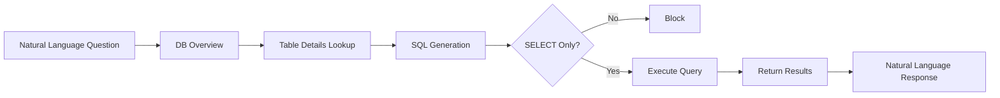

# Database Connection (DbSphere)

> Query your database using natural language. Even without knowing SQL, just ask "Show me this month's revenue" and the AI will find the data and respond. DbSphere enables faster data-driven decision-making.



---

## What Is DbSphere?

DbSphere is a feature that converts natural language into SQL to query databases.

<!-- Screenshot: DbSphere concept diagram
     - User question -> AI -> SQL generation -> DB query -> Return results -> Natural language response
     File: images/dbsphere-concept.png
-->

### Key Features

| Feature | Description |
|---------|-------------|
| **Natural Language Queries** | Query data in plain language without SQL |
| **Multi-DB Support** | MySQL, PostgreSQL, MSSQL, Oracle, and more |
| **Safe Queries** | Only read-only queries are executed |
| **Schema Awareness** | Understands table structures and generates appropriate queries |
| **Progressive Context Retrieval** | Selectively retrieves only necessary information to save tokens |

### AI Query Flow

DbSphere operates efficiently by collecting information in three stages:

1. **DB Overview** — Identifies the full list of available tables in the connected database
2. **Table Details Lookup** — Retrieves column structures, business documentation, and SQL examples for tables relevant to the question
3. **SQL Execution** — Generates and executes accurate SQL based on the collected context

> 💡 By progressively retrieving only the needed table information, token usage is minimized even in large databases with many tables.

### Usage Example

```
User: Show me the top 5 best-selling products this month

AI: Here are the top 5 products by sales this month:

| Rank | Product | Units Sold | Revenue |
|------|---------|-----------|---------|
| 1 | Wireless Earbuds Pro | 1,523 | $228,450 |
| 2 | Smartwatch X | 1,287 | $193,050 |
| 3 | Bluetooth Speaker | 1,156 | $92,480 |
| 4 | Noise-Canceling Headphones | 892 | $178,400 |
| 5 | Power Bank 20000mAh | 834 | $33,360 |

Total units sold: 5,692 | Total revenue: $725,740
```

---

## Supported Databases

<!-- Screenshot: Supported DB logos
     File: images/dbsphere-supported-dbs.png
-->

| Database | Version | Description |
|----------|---------|-------------|
| **MySQL** | 5.7+ | Most widely used RDBMS |
| **PostgreSQL** | 10+ | Advanced features, JSON support |
| **Microsoft SQL Server** | 2016+ | Enterprise environments |
| **Oracle** | 12c+ | Large-scale enterprise |
| **SQLite** | 3.x | Lightweight database |
| **Snowflake** | - | Cloud data warehouse |
| **Databricks** | - | Lakehouse platform |
| **Google BigQuery** | - | Serverless cloud data warehouse |

---

## Database Connection

### Step 1: Create a New Connection

Click **Workspace > Database > "+ New Connection"**

<!-- Screenshot: Database connection creation form
     File: images/dbsphere-create.png
-->

### Step 2: Enter Connection Information

| Field | Description | Example |
|-------|-------------|---------|
| **Name** | Connection display name | "Sales Analytics DB" |
| **Description** | Database purpose | "Sales team revenue data" |
| **DB Type** | Database type | MySQL |

### Step 3: Enter Access Credentials

<!-- Screenshot: DB access credentials input form
     File: images/dbsphere-connection-form.png
-->

| Field | Description |
|-------|-------------|
| **Host** | DB server address |
| **Port** | Connection port |
| **Database Name** | Database to connect to |
| **Username** | DB account |
| **Password** | DB password |

### Step 3-Alt: BigQuery Access Credentials

BigQuery does not use host/port/password. Instead, it authenticates with a Google Cloud service account key. Selecting **BigQuery** as the DB type shows the following fields.

| Field | Description |
|-------|-------------|
| **Project ID** | Google Cloud project ID that owns the dataset (e.g., `my-gcp-project`) |
| **Dataset ID** | Dataset to query (e.g., `analytics`). If empty, the default in the service account JSON is used |
| **Service Account JSON** | Service account key (JSON) issued by Google Cloud IAM. Paste the JSON directly or upload a `.json` key file |

**Preparing the service account:**

1. In Google Cloud Console > IAM & Admin > Service Accounts, create a dedicated account for AI access
2. Grant the **BigQuery Data Viewer** and **BigQuery Job User** roles on the target dataset(s)
3. Generate a key via **Add Key > Create new key > JSON** and download the file
4. Paste the JSON content into the Cloosphere form or attach it via **"Upload JSON key file"**

> **Tip:** BigQuery performance and scan cost depend on partitions, clustering, and dataset location. AI-generated SQL uses Standard SQL syntax and is aware of partition filters.

### Step 4: Test Connection

Click the **"Test Connection"** button to verify the connection.

<!-- Screenshot: Connection test success screen
     File: images/dbsphere-test-success.png
-->

> 💡 The connection test not only verifies DB connectivity but also checks whether **schema extraction is possible**. If schema extraction fails, a warning message is displayed with guidance to review your permission settings.

### Step 5: Select Tables

After a successful connection, select the tables that the AI will reference.

<!-- Screenshot: Table selection screen
     - Table list (checkboxes)
     - Selected table information display
     File: images/dbsphere-table-select.png
-->

**Selection Criteria:**
- Select only the tables the AI needs to query
- Exclude tables containing sensitive information
- Select related tables together (for JOIN capability)

### Step 6: Add Schema Descriptions (Optional)

Adding descriptions for tables and columns helps the AI generate more accurate queries.

<!-- Screenshot: Schema description input
     File: images/dbsphere-schema-description.png
-->

**Example:**
```
Table: orders
Description: Order history table
Columns:
- order_id: Unique order number
- customer_id: Customer ID (references customers table)
- order_date: Order date/time
- total_amount: Total order amount (USD)
- status: Order status (pending/confirmed/shipped/delivered)
```

### Step 7: Tool Description (Optional)

Write a **tool description** that guides agents on when and how to use this database.

**AI Auto-Generation:** Click the **auto-generate button** next to the tool description field, and AI will analyze the connected table structures and column information to automatically write an appropriate description.

**Example:**
```
This database contains order, customer, and inventory data for the sales team.
Use it for sales analysis, customer lookups, and inventory status checks.
The orders and customers tables can be JOINed to query purchase history by customer.
```

> **Tip:** The more accurate the tool description, the better a unified agent can select the appropriate database from multiple tools.

### Step 8: Set Access Permissions

<!-- Screenshot: Access permission settings
     File: images/dbsphere-access-control.png
-->

---

## Querying Databases

### Connect to an Agent

1. Navigate to the agent edit screen
2. Add a connection in the "Database" section
3. Save

<!-- Screenshot: Connecting DB to agent
     File: images/dbsphere-agent-connect.png
-->

### Use in Chat

Chat with an agent that has a database connected.

```
User: What is the revenue growth rate this quarter compared to last quarter?

AI: I've analyzed the quarterly revenue:

Quarterly Revenue Comparison
| Quarter | Revenue | Quarter-over-Quarter |
|---------|---------|---------------------|
| 2023 Q4 | $1.25M | - |
| 2024 Q1 | $1.42M | +13.6% |

This quarter's revenue grew 13.6% compared to the previous quarter.

Key growth factors:
1. New customer acquisition (+23%)
2. Existing customer repurchase rate increase (+8%)
3. Average order value increase (+5%)
```

---

## Example Questions

### Revenue Analysis

```
- What is this month's revenue?
- Show me the daily revenue trend for last week
- Tell me the top 10 customers by revenue
- What is the revenue breakdown by product category?
```

### Customer Analysis

```
- How many new customers signed up this month?
- Show me the VIP customer list
- Which customers haven't purchased in the last 3 months?
- What is the customer distribution by region?
```

### Inventory Management

```
- Show me products with less than 10 units in stock
- What products are scheduled for arrival this week?
- What are the top 5 products with the lowest inventory turnover rate?
```

### HR Management

```
- Show me the headcount by department
- How many hires/departures were there this month?
- What is the average tenure?
```

---

## Data Visualization

The AI can visualize data as charts.

<!-- Screenshot: Response with charts
     - Bar graphs, pie charts, etc.
     File: images/dbsphere-chart.png
-->

```
User: Show me the monthly revenue trend as a chart

AI: [Chart generated]

2024 Monthly Revenue Trend

[Bar chart image]

Key insights:
- March revenue surged 25% compared to the previous month
- Summer season (Jun-Aug) averaged 15% revenue increase
- Annual growth trend maintained
```

---

## Multi DB Runner

Extract and manage schemas from multiple databases at once.

<!-- Screenshot: Multi DB Runner screen
     File: images/dbsphere-multi-db-runner.png
-->

### Full DB Schema Extraction

Running the **"Multi DB Runner"** extracts schema information from all connected databases in bulk.

- Automatically collects table structures, column information, and data types across all connected databases
- Review extraction results at a glance and selectively enable only the tables you need
- Re-extract when schema changes occur to keep information up to date

> 💡 In large-scale environments with multiple databases, you can process everything at once instead of managing schemas individually.

---

## Memory Management

DbSphere learns from user questions and generated SQL patterns to produce increasingly accurate queries. The memory management UI lets you view and manage these learned patterns directly.

<!-- Screenshot: Memory management UI
     File: images/dbsphere-memory-management.png
-->

### Key Features

| Feature | Description |
|---------|-------------|
| **View Memory List** | View learned SQL patterns for each DbSphere connection |
| **Delete Memory** | Remove incorrectly learned patterns or unnecessary memories |
| **Edit Memory** | Modify learned SQL patterns to improve accuracy |

### Use Cases

- Delete or modify a memory when the AI repeatedly generates incorrect queries
- Manually add SQL patterns that match specific business logic to improve AI accuracy
- Clear all memories when you want to reset a DbSphere connection

---

## Chart Type Selector

When visualizing query results, you can choose the chart type directly.

<!-- Screenshot: Chart type selector UI
     File: images/dbsphere-chart-type-selector.png
-->

### Supported Chart Types

| Chart Type | Best For |
|------------|----------|
| **Bar Chart** | Category comparisons |
| **Line Chart** | Time series trends |
| **Pie Chart** | Proportions and composition |
| **Area Chart** | Cumulative trends |
| **Table** | Detailed data review |

### How to Use

1. After the AI returns query results, a **chart type selector** appears in the results area
2. Click the desired chart type to instantly re-visualize the same data in the selected format
3. Switching chart types does not re-run the query, so transitions are fast

---

## SQL Result Viewer

View the execution results of AI-generated SQL directly via the **"View Results"** button.

<!-- Screenshot: SQL result view button and results panel
     File: images/dbsphere-sql-result-view.png
-->

- A **"View Results"** button appears on SQL blocks within the AI response
- Clicking it displays the SQL execution results in a table format
- Compare the raw data directly with the AI's summary to verify accuracy

---

## SQL Query Preview

AI-generated SQL queries are displayed in a formatted preview for easy reading.

<!-- Screenshot: SQL query preview UI
     File: images/dbsphere-sql-preview.png
-->

- SQL syntax highlighting for improved readability
- Auto-applied indentation and line breaks
- Copy button to quickly copy the query to your clipboard

---

## Enhanced Agent Prompts

DbSphere's agent uses enhanced prompts for more accurate and reliable query execution.

### Mandatory SQL Execution

The AI now always executes generated SQL. Previously, SQL might be generated without execution, but now all generated SQL is automatically executed to provide responses based on actual data.

### Automatic Error Retry

When a SQL execution error occurs, the AI automatically analyzes the cause and retries with a corrected query.

- Automatically fixes common SQL errors such as column name errors and table reference errors
- Retries within a maximum retry limit to improve success rates
- The retry process is transparently displayed to the user

---

## Deletion Safety Check

When deleting a database connection, the system automatically checks whether the connection is currently in use by any agent.

<!-- Screenshot: Delete confirmation dialog showing agent usage
     File: images/dbsphere-delete-check.png
-->

- **If in use**: A list of agents referencing the connection is displayed, and deletion is blocked
- **If not in use**: The connection is deleted normally after confirmation

> 💡 This prevents accidentally deleting a database connection that agents depend on, which would cause those agents to stop working.

---

## Security

### Read-Only

DbSphere executes **SELECT queries only**.
- INSERT, UPDATE, DELETE are not allowed
- DROP, ALTER, and other DDL statements are not allowed
- Only data retrieval is possible

### Credential Protection

- Passwords are stored encrypted
- Connection information is securely managed
- DB access is restricted by permission level

### Audit Logs

All DB queries are recorded in the audit log.

<!-- Screenshot: DB query audit log
     File: images/dbsphere-audit-log.png
-->

---

## Best Practices

### Database Account Setup

1. **Create a dedicated account**: Use an AI-dedicated read-only account
2. **Least privilege**: Grant SELECT permissions only on required tables
3. **Query limits**: Set timeouts and result row limits

### Table Selection

1. **Only what's needed**: Avoid connecting all tables
2. **Exclude sensitive data**: Exclude tables with personal information or passwords
3. **Include related tables**: Select tables that need JOINs together

### Schema Descriptions

1. **Clear descriptions**: Describe tables/columns in plain language
2. **Business terminology**: Use business terms rather than technical jargon
3. **Specify relationships**: Explain relationships between tables

---

## Troubleshooting

### Connection Failure

| Cause | Solution |
|-------|----------|
| Network | Check firewall, VPN |
| Authentication | Verify account/password |
| Permissions | Check DB permissions |

### Query Errors

| Cause | Solution |
|-------|----------|
| Table not selected | Add related tables |
| Insufficient descriptions | Enhance schema descriptions |
| Complex question | Simplify the question |

### Slow Response

| Cause | Solution |
|-------|----------|
| Large dataset | Add conditions (date range, etc.) |
| Complex query | Split the question |

---

## FAQ

**Q: Can the data be modified?**
> No, DbSphere is read-only. Only data retrieval is possible.

**Q: Can I connect any database?**
> Only databases on the supported list can be connected. Contact your administrator if you need support for additional databases.

**Q: Can I see the executed SQL?**
> Yes, you can view the generated SQL in developer mode.

**Q: Can multiple tables be JOINed?**
> Yes, select all related tables and describe their relationships, and the AI will generate appropriate JOIN queries.

---

## Next Steps

- [Connect a database to an agent](./agents.md)
- [Define business terms with a glossary](./glossary.md)
- [Connect external APIs](./tools.md)
