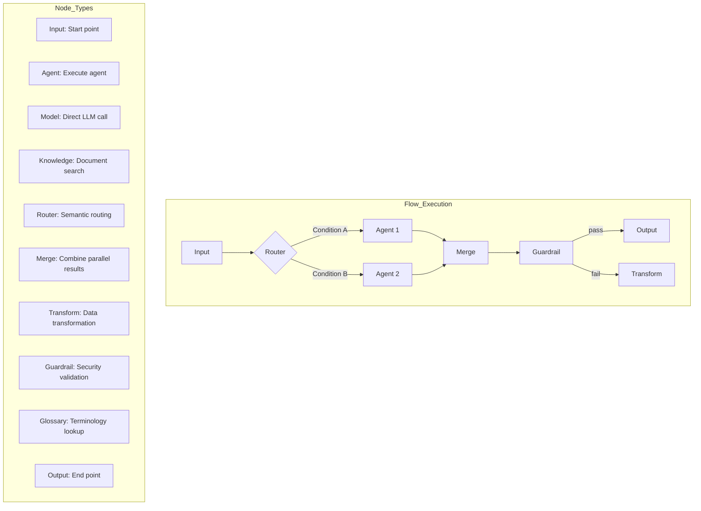

# Flows

> Flows let you visually connect multiple agents and resources to automate complex workflows. Build multi-agent orchestrations effortlessly with drag and drop, or generate flows automatically from natural language using the AI conversational builder.



---

## What Is a Flow?

A flow is a **visual workflow builder** where you connect nodes to construct AI pipelines, similar to n8n or Dify.

**Examples:**
- **Document Analysis Flow**: Input -> Document Summary Agent -> Key Extraction Agent -> Output
- **Customer Support Flow**: Input -> Intent Classification -> FAQ Agent / Technical Support Agent -> Output
- **Data Report Flow**: Input -> DB Query Agent -> Analysis Agent -> Report Generation -> Output

### Flow vs Single Agent

| Aspect | Single Agent | Flow |
|--------|-------------|------|
| **Complexity** | Simple Q&A | Multi-step processing |
| **Connections** | Standalone execution | Inter-agent connections |
| **Branching** | Not possible | Conditional branching supported |
| **Reusability** | Individual calls | Pipeline reuse |

---

## Flow List

You can view all flows under **Workspace > Flows**.

<!-- Screenshot: Flow list screen
     - Flows displayed as cards
     - Search bar, create button
     Filename: images/flows-list.png
-->

### Flow Card

| Element | Description |
|---------|-------------|
| **Name** | Flow name |
| **Description** | Flow purpose description |
| **Node Count** | Number of nodes included |
| **Status** | Active/Inactive |

---

## Creating a Flow

There are two ways to create a flow: build one manually, or use the AI conversational builder to generate one from natural language.

### Method 1: Manual Creation

#### Step 1: Create a New Flow

Click **Workspace > Flows > "+ New Flow"**

<!-- Screenshot: Flow create button
     Filename: images/flow-create-button.png
-->

#### Step 2: Enter Basic Information

| Field | Description | Example |
|-------|-------------|---------|
| **Name** | Flow name | "Document Analysis Flow" |
| **Description** | Flow purpose | "Summarizes documents and extracts key content" |

#### Step 3: Place Nodes

Drag desired nodes from the left **Node Palette** onto the canvas.

<!-- Screenshot: Node palette and canvas
     - Left: Node list
     - Center: Nodes placed on canvas
     Filename: images/flow-canvas.png
-->

#### Step 4: Connect Nodes

Drag from a node's **output handle** (right dot) and connect it to another node's **input handle** (left dot).

Clicking an edge (connection line) reveals a **delete button**, making it easy to remove unwanted connections.

<!-- Screenshot: Edge selection with delete UI
     Filename: images/flow-edge-delete.png
-->

#### Step 5: Configure Nodes

Clicking a node opens the **settings panel** on the right.

<!-- Screenshot: Node settings panel
     Filename: images/flow-node-config.png
-->

#### Step 6: Save

Click the **Save** button at the top to save the flow.

### Method 2: AI Conversational Flow Builder

The AI conversational builder (FlowBuilderAgent) lets you generate flows automatically just by describing what you need in natural language.

#### Using the AI Builder

1. Open the **AI Assistant panel** at the bottom of the flow editor
2. Select the LLM model to use from the **model selection dropdown**
3. Describe the flow you want in natural language

<!-- Screenshot: AI assistant panel with model selection dropdown
     Filename: images/flow-ai-assistant-panel.png
-->

**Input example:**
```
"When a user question comes in, first search the FAQ knowledge base.
If the search results are sufficient, respond directly.
If not, query the database for additional data, then respond."
```

#### Multi-turn Conversational Builder

The AI builder supports **multi-turn conversations**. You don't need to create the perfect flow in one shot -- continue the conversation to iteratively refine and expand it.

- Request adding or removing nodes from the initially generated flow
- Change conditional branches or add new paths
- Adjust specific node settings through conversation

**Conversation example:**
```
User: "Create a customer support flow"
AI: (generates a basic flow)
User: "Add a guardrail node to filter sensitive information"
AI: (adds a guardrail node)
User: "Add a branch so guardrail failures send a warning message"
AI: (adds pass/fail branching)
```

<!-- Screenshot: Multi-turn conversation progressively building a flow
     Filename: images/flow-ai-multiturn.png
-->

---

## Node Types

### Basic Nodes

| Node | Icon | Description |
|------|------|-------------|
| **Input** | 📥 | Flow start point. Receives user input |
| **Output** | 📤 | Flow end point. Returns the final result |

### Processing Nodes

| Node | Icon | Description |
|------|------|-------------|
| **Agent** | 🤖 | Executes an agent (including KBSphere and DBSphere) |
| **Model** | 🧠 | Calls an LLM model directly |
| **Knowledge** | 📚 | Searches documents from a knowledge base |
| **Tool** | 🔧 | Executes an external tool |

### Control Nodes

| Node | Icon | Description |
|------|------|-------------|
| **Condition** | 🔀 | Branches based on conditions |
| **Router** | 🔀 | LLM-based semantic routing to multiple paths |
| **Merge** | 🔄 | Combines results from parallel node executions |
| **Transform** | ✏️ | Transforms data (Jinja2 templates) |
| **Guardrail** | 🛡️ | Applies a guardrail (with pass/fail branching) |
| **Glossary** | 📖 | Looks up terms from a glossary and adds them to context |

---

## Node Details

### Input Node

The starting point of a flow. Every flow must begin with one Input node.

- **Input**: None
- **Output**: User input text

### Output Node

The end point of a flow. Returns the previous node's result to the user.

- **Input**: Text
- **Output**: None (displayed to the user)

### Agent Node

Executes a registered agent. Supports agents in **Enhanced RAG (KBSphere)** or **Database (DBSphere)** mode.

**Configuration options:**

| Option | Description |
|--------|-------------|
| **Agent Selection** | Agent to execute |
| **Temperature** | Response diversity (0.0 ~ 1.0) |

> **Tip**: Using a KBSphere agent will return knowledge base search results (sources) along with the response.

### Model Node

Calls an LLM model directly without an agent.

**Configuration options:**

| Option | Description |
|--------|-------------|
| **Model Selection** | LLM model to use |
| **System Prompt** | Instructions to pass to the model |
| **Temperature** | Response diversity |
| **Max Tokens** | Response length limit |

### Knowledge Node

Searches for related documents from a knowledge base.

**Configuration options:**

| Option | Description |
|--------|-------------|
| **Knowledge Base** | Knowledge base to search |
| **Search Threshold** | Minimum relevance score |

### Condition Node

Branches the flow based on conditions.

**Configuration options:**

| Option | Description |
|--------|-------------|
| **Condition Type** | contains, equals, starts_with, etc. |
| **Comparison Value** | Text to compare against |

**Output handles:**
- **True**: When the condition is met
- **False**: When the condition is not met

### Router Node

Performs LLM-based semantic routing. While the Condition node uses simple string comparisons, the Router node uses an LLM to analyze the meaning of the input and route it to the appropriate path.

**Configuration options:**

| Option | Description |
|--------|-------------|
| **Routing Paths** | List of paths with descriptions for each |
| **Model** | LLM model used for routing decisions |

**Output handles:**
- An output handle is created for each configured path

**Example:**
```
Path 1: "Technical inquiry" - Technical questions or error-related inquiries
Path 2: "Billing inquiry" - Pricing, payment, subscription-related inquiries
Path 3: "General inquiry" - Other general inquiries
```

### Merge Node

Combines results from multiple nodes after fan-out parallel execution. Use this when paths branched by a Router or Condition need to converge.

**Configuration options:**

| Option | Description |
|--------|-------------|
| **Merge Strategy** | concat (sequential combination), summarize (summary), custom (custom template) |

> **Note**: In the fan-out pattern, LangGraph's Send pattern is used to execute multiple nodes in parallel. The Merge node waits for all results to arrive before combining them.

### Glossary Node

Looks up relevant terms from a registered glossary and adds them to the context for subsequent nodes. Improves response quality in flows where domain-specific terminology is important.

**Configuration options:**

| Option | Description |
|--------|-------------|
| **Glossary Selection** | Glossary to look up |
| **Max Terms** | Maximum number of terms to return |

### Transform Node

Transforms data using Jinja2 templates.

**Example template:**
```jinja2
Summarization request: {{ input }}

Please summarize the above content in 3 lines.
```

**Available variables:**
- `{{ input }}`: Current input text
- `{{ documents }}`: List of retrieved documents
- `{{ variables }}`: Flow variables

### Guardrail Node (Pass/Fail Branching)

Applies a guardrail to validate inputs or outputs. In V2, **pass/fail branching** is supported, allowing the flow to proceed along different paths based on validation results.

**Output handles:**
- **pass**: When guardrail validation passes
- **fail**: When guardrail validation fails (PII detected, content filter violation, etc.)

**Example:**
```
[Agent Response] -> [Guardrail: PII Check]
                      +-- pass -> [Output: Normal Response]
                      +-- fail -> [Transform: Mask Sensitive Info] -> [Output]
```

---

## Variables System

Define and use variables that are shared across the entire flow. Variables allow you to pass data between nodes or dynamically set values at flow execution time.

### Defining Variables

Click the **Variables** button at the top of the flow editor to manage variables.

<!-- Screenshot: Variables management panel
     Filename: images/flow-variables-panel.png
-->

| Option | Description |
|--------|-------------|
| **Variable Name** | Variable name (letters, numbers, underscores) |
| **Default Value** | Default value for the variable |
| **Description** | Description of the variable's purpose |

### Referencing Variables

Reference variables in Transform nodes or system prompts using the `{{ variables.variable_name }}` format.

```jinja2
Customer name: {{ variables.customer_name }}
Language: {{ variables.language }}

Please translate {{ input }} into {{ variables.language }}.
```

---

## Running a Flow

### Running from Chat

1. Start a new chat
2. Select a **Flow** from the model selector
3. Enter a message and send

<!-- Screenshot: Selecting a flow in the model selector
     Filename: images/flow-select-chat.png
-->

### Execution Flow

```
User Input
    |
[Input Node]
    |
[Processing Nodes] -> Sequential/Parallel execution
    |
[Output Node]
    |
Response to User
```

### Fan-out Parallel Execution

Execute multiple nodes simultaneously to increase processing speed. This is implemented using LangGraph's Send pattern.

```
                    +-> [Agent: Summary] ----+
[Input] -> [Router] -+-> [Agent: Sentiment] --+-> [Merge] -> [Output]
                    +-> [Agent: Keywords] ---+
```

In fan-out execution, each parallel path runs independently. The Merge node collects and combines all results once every path has completed.

### Execution Status

During flow execution, the status of each step is displayed:
- **Running**: Node currently being processed
- **Completed**: Node that has finished processing
- **Waiting**: Waiting for other nodes to complete in parallel execution
- **Sources**: Retrieved document sources (when using KBSphere)

### Human-in-the-Loop Interactive Wizard

When user confirmation or input is needed at a specific node, use the **Human-in-the-Loop** feature. Flow execution pauses at that node and an interactive wizard is displayed to the user.

**Supported interactions:**
- **Approve/Reject**: User reviews agent results before proceeding
- **Select**: User chooses from multiple options
- **Input**: User provides additional information directly

<!-- Screenshot: Human-in-the-Loop wizard screen
     Filename: images/flow-human-in-the-loop.png
-->

**Example:**
```
[Input] -> [Agent: Order Processing] -> [Human: Order Confirmation] -> [Agent: Payment] -> [Output]
                                            |
                                      User reviews order
                                      details and approves/rejects
```

---

## Flow Execution Traces

A trace system is provided for detailed tracking of flow execution. You can inspect each node's inputs and outputs, execution time, token usage, and more.

### Viewing Traces

After flow execution completes, click the **View Trace** button in the chat screen.

<!-- Screenshot: Flow execution trace screen
     Filename: images/flow-execution-trace.png
-->

### Trace Information

| Item | Description |
|------|-------------|
| **Per-node I/O** | Input received and output produced by each node |
| **Execution Time** | Processing time for each node |
| **Token Usage** | Number of tokens used in LLM calls |
| **Error Details** | Detailed error information for failed nodes |

---

## Flow Examples

### Example 1: Simple Summarization Flow

```
[Input] -> [Model: GPT-4] -> [Output]
              |
         System Prompt:
         "Summarize the input in 3 lines"
```

### Example 2: Knowledge-Based Q&A Flow

```
[Input] -> [Agent: FAQ Agent] -> [Output]
               |
          KBSphere mode
          FAQ Knowledge Base connected
```

### Example 3: Conditional Branching Flow

```
                    +-- True --> [Agent: Tech Support] --+
[Input] -> [Condition] --------------------------------> [Output]
                    +-- False -> [Agent: General Inquiry] -+

          Condition: Contains "error" or "bug"
```

---

## Editor Features

### Undo/Redo

Use **Ctrl+Z** (Undo) and **Ctrl+Shift+Z** (Redo) in the flow editor to revert or re-apply editing actions. This is built on LangGraph checkpoints for reliable operation.

### Edge (Connection) Management

- **Click** an edge to select it and reveal a **delete button**
- Remove the connection using the **Delete** key or the delete button
- Drag an edge to reconnect it to a different node

### Execution Retry

When a node fails during execution, a **Retry** button appears on that node. You can re-execute from the failed node without restarting the entire flow.

---

## Frequently Asked Questions

### Q: Which agents can be used in a flow?

All agents registered in the workspace can be used. Standard mode, KBSphere (Enhanced RAG), and DBSphere (Database) modes are all supported.

### Q: What happens if an error occurs during flow execution?

The flow stops at the node where the error occurred and an error message is displayed. Check the node configuration and try again.

### Q: What is the execution order of a flow?

Nodes are executed in the order they are connected. Execution starts from the Input node and proceeds along connected nodes until it reaches the Output node.

### Q: Can I connect multiple agents in a single flow?

Yes, you can connect multiple agents sequentially or branch them based on conditions. Using the fan-out pattern, you can also run multiple agents in parallel and combine the results with a Merge node.

### Q: Can I manually edit a flow created by the AI builder?

Yes, flows generated by the AI conversational builder are identical to regular flows. You can add/remove nodes or change connections on the canvas. You can also continue refining the flow through further conversations with the AI builder.

### Q: What is the difference between a Router node and a Condition node?

The Condition node branches using rule-based string comparisons like contains and equals. The Router node uses an LLM to analyze the semantic meaning of the input before routing, making it suitable for cases that require natural language understanding such as intent classification.

### Q: Where can I view flow execution traces?

After flow execution completes, you can view traces via the View Trace button in the chat screen. Administrators can also browse the full execution history from the Monitoring > Traces menu.

### Q: When should I use Human-in-the-Loop?

Use it for steps that require user confirmation, such as payment approvals, critical data changes, or sensitive decisions. The flow pauses at that node and displays a confirmation wizard to the user.

---

## Next Steps

- [Create an Agent](./agents.md) - Configure agents to use in flows
- [Connect a Knowledge Base](./knowledge.md) - Upload documents for RAG
- [Set Up Guardrails](./guardrails.md) - Configure filters for safe responses
