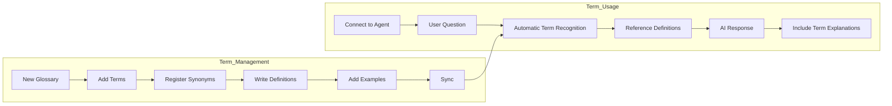
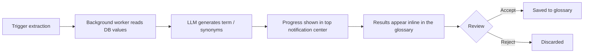

# Glossary

> Systematically manage your company's technical terms, abbreviations, and business rules. AI will accurately understand your organization's terminology and provide consistent answers.



---

## What Is a Glossary?

A glossary is a system that manages the technical terms used within your organization and their definitions.

<!-- Screenshot: Glossary concept diagram
     - Term definition -> Synonyms -> Examples -> AI references
     File: images/glossary-concept.png
-->

### Why Do You Need a Glossary?

| Problem | After Using a Glossary |
|---------|----------------------|
| "What is MRR?" -> AI doesn't know | "MRR is Monthly Recurring Revenue" |
| Different terms used across departments | Standardized terminology provided |
| Difficult onboarding for new employees | Instant term lookup available |
| Inconsistent AI responses | Consistent answers using defined terms |

### Key Features

- **Term Definitions**: Clear descriptions and examples
- **Synonym Support**: Link multiple expressions to a single term
- **Automatic Lookup**: AI automatically references relevant terms during conversations
- **Categories**: Classify, filter, and individually manage terms by domain (1.0.1)
- **Automatic DB Value Extraction**: Pull terms from database dimension values as a background job (improved in 1.0.1)
- **Pagination & Single-Entry CRUD**: Navigate large glossaries quickly and edit one term at a time (1.0.1)

---

## Glossary List

View all glossaries under **Workspace > Glossary**. Starting in 1.0.1, the list screen is **unified with the other workspace resources** (Knowledge Base, Knowledge Graph) — the same tag-based filter tabs and shared-info chips apply. Glossaries with missing tool descriptions are highlighted by a **warning banner** at the top.

<!-- Screenshot: Glossary list screen
     File: images/glossary-list.png
-->

---

## Creating a Glossary

### Step 1: Create a New Glossary

Click the **"+ New Glossary"** button.

<!-- Screenshot: Glossary creation form
     File: images/glossary-create.png
-->

| Field | Description | Example |
|-------|-------------|---------|
| **Name** | Glossary name | "Marketing Terms" |
| **Description** | Glossary description | "Marketing team terminology and KPI definitions" |

### Step 2: Set Access Permissions

<!-- Screenshot: Access permission settings
     File: images/glossary-access.png
-->

---

## Glossary Detail View

Click a glossary to navigate to its detail page. The detail view is designed with a UI optimized for term management.

<!-- Screenshot: Glossary detail view (redesigned)
     - Term list panel + Term detail panel layout
     File: images/glossary-detail-redesign.png
-->

### Layout

| Area | Description |
|------|-------------|
| **Left Term List** | A panel for searching and browsing registered terms |
| **Right Term Detail** | An area for editing the selected term's definition, synonyms, and examples |
| **Top Toolbar** | Main action buttons for adding terms, importing, exporting, syncing, etc. |

### Key Improvements

- **Split View**: View the list and details simultaneously for faster editing
- **Instant Search**: Real-time filtering from the search bar at the top of the term list
- **Inline Editing**: Edit and save directly in the term detail panel
- **Category Sidebar (1.0.1)**: Filter terms by category from the left side, and add / rename / delete categories themselves
- **Pagination (1.0.1)**: Server-side pagination keeps the list fast even for thousands of terms
- **Reindex Menu (1.0.1)**: Manually rebuild the search index from the top menu when something looks off

---

## Adding Terms

### Adding a Single Term

Click **"+ Add Term"** on the glossary detail page.

<!-- Screenshot: Add term form
     File: images/glossary-add-term.png
-->

| Field | Description | Example |
|-------|-------------|---------|
| **Term** | The term to define | MRR |
| **Synonyms** | Alternative expressions | Monthly Recurring Revenue |
| **Definition** | Term description | Recurring subscription revenue generated each month |
| **Example** | Usage example | "This month's MRR is $1M" |

### Tips for Writing Term Entries

**Good definition example:**

```markdown
## MRR (Monthly Recurring Revenue)

### Definition
Refers to recurring subscription-based revenue generated each month.
It reflects net recurring revenue after accounting for new contracts, upgrades, downgrades, and cancellations.

### Calculation Method
MRR = (Monthly subscription fee x Number of active subscribers)

### Related Metrics
- ARR (Annual Recurring Revenue) = MRR x 12
- Net MRR = New MRR + Expansion MRR - Contraction MRR - Churn MRR

### Examples
- "This month's MRR grew 5% compared to last month"
- "MRR increased by $200K due to new customer acquisition"
```

### Bulk Import

You can import multiple terms at once using a JSON file.

<!-- Screenshot: Import button and file format guide
     File: images/glossary-import.png
-->

**JSON Format:**
```json
[
  {
    "term": "MRR",
    "synonyms": ["Monthly Recurring Revenue"],
    "definition": "Recurring subscription revenue generated each month",
    "example": "This month's MRR is $1M"
  },
  {
    "term": "CAC",
    "synonyms": ["Customer Acquisition Cost"],
    "definition": "The cost of acquiring a single new customer",
    "example": "We reduced CAC by 20% through marketing optimization"
  }
]
```

---

## Term Management

### Viewing the Term List

<!-- Screenshot: Term list (with search and filters)
     File: images/glossary-terms-list.png
-->

- **Search**: Search by term name or definition content
- **Sort**: By name, recently modified
- **Filter**: Filter by category

### Editing a Term

Click a term to modify its content. Starting in 1.0.1, individual entries support **direct add / edit / delete (single-entry CRUD)** so you can fix just the term you need without waiting for a full sync.

### Deleting a Term

Click the delete button in the term list.

> **Warning:** When deleting a glossary, if the glossary is connected to any agents, the delete confirmation dialog will display the list of connected agents. Deleting a glossary connected to agents may affect those agents' term reference capabilities, so be sure to check the connection status before deleting.

<!-- Screenshot: Glossary delete confirmation with agent usage check
     - Connected agent list displayed
     File: images/glossary-delete-agent-check.png
-->

### Export

You can export all terms as a JSON file.

<!-- Screenshot: Export button
     File: images/glossary-export.png
-->

### Sync

After modifying terms, click the **"Sync"** button to update the search engine.

<!-- Screenshot: Sync button
     File: images/glossary-sync.png
-->

### Reindex (1.0.1)

If search results look wrong even after syncing, use **"Reindex"** in the top menu to rebuild the search index manually. Helpful after swapping the embedding model or after a large-scale cleanup.

---

## Category Management (1.0.1)

You can create **categories** inside a glossary to group terms into meaningful units.

- **Create / rename / delete categories** from the left-side category sidebar
- **Category filter** to view and edit only the terms in a given category
- **Per-category metadata** — each category stores its own extraction source (DbSphere · table · column) and custom extraction instructions
- **"Uncategorized" group** — terms without a category are shown together as a distinct group

---

## Automatic Term Extraction from DB Values (improved in 1.0.1)

You can extract candidate terms from database dimension columns and feed them into the glossary. In 1.0.1 this flow is fully moved to a **background job**.

### Flow



### Highlights

- **Background pipeline** — Built on a Redis-backed queue, so long-running extractions never block the main service.
- **Inline review** — Results appear directly in the term list, and you can accept · edit · reject without opening a separate modal.
- **Live progress** — Extraction progress is surfaced in the top notification center, with a completion toast.
- **Better synonym quality** — The LLM generates synonyms with improved accuracy, so lookalike expressions map cleanly.

### Per-Category Extraction Instructions

You can attach **custom extraction instructions** to each category.

- Store per-category prompts such as "write definitions grounded in case law for this category"
- Adjust tone, preferred sources, or forbidden phrasing per category
- When you re-run extraction for the same category, its instructions are automatically applied

### Extraction Source Selection

Choose where in the source text the extractor should pull from.

| Option | Description |
|--------|-------------|
| **Title only** | Use only titles / headers |
| **Full body** | Extract from the entire body |
| **First N characters** | Use only the first N characters (for long bodies with summary-style openings) |
| **Last N characters** | Use only the last N characters (for conclusion or summary sections) |

Tune the source option to match your document structure.

---

## Governance UX (1.0.2)

Each glossary card and list entry now shows **ownership, share scope, and edit rights** at a glance, so you can tell which glossaries are yours, which are company-wide, and which are read-only shares. The permission model itself (`access_control` with read / write tiers) was already expressive enough — 1.0.2 only fills in the **UX gap**.

<!-- Screenshot: Glossary card with scope label / Owner badge / Editable badge + top filter chips
     Filename: images/glossary-governance-cards.png
-->

### Governance Metadata on Cards

| Indicator | Meaning |
|-----------|---------|
| **Scope label** | "Company-wide" / "My Group" / "Shared" — the share scope of this glossary in one word |
| **Owner badge** | Shown for glossaries you created |
| **Editable badge** | Shown when you are admin / owner / a write share |

> Security: Names of groups you do not belong to are masked as "Shared" rather than leaking the real group name.

### Top Filter Chips

The list page adds the following filter chips at the top.

| Chip | Shows |
|------|-------|
| **All** | All glossaries you can access |
| **Company-wide** | Glossaries shared with everyone |
| **My Group** | Glossaries shared with a group you belong to |
| **My** | Glossaries you authored |

### Read-Share Detail Entry + Copy Button

Starting in 1.0.2, **read-only shares can now open the glossary detail page** (edit / delete / extract buttons remain disabled). The detail header also gets a **"Copy to scope"** button, letting you clone the glossary into another group or scope.

<!-- Screenshot: "Copy to scope" button in glossary detail header + CopyGlossaryModal
     Filename: images/glossary-copy-modal.png
-->

| Item | Policy |
|------|--------|
| **Who can Copy** | admin / owner / write shares (read shares are blocked) |
| **Target group validation** | Copy is only allowed into groups you are a member of (admin exception) |
| **Result** | entry IDs are re-issued, `meta.copied_from` is recorded, and the search index is rebuilt automatically |

> 🛡️ A read-only share can open the detail page, copy the glossary into their own group, and edit freely from there — giving them a personalized fork without requiring elevated permissions.

---

## Using the Glossary

### Connect to an Agent

1. Navigate to the agent edit screen
2. Select a glossary to connect in the "Glossary" section
3. Save

<!-- Screenshot: Connecting glossary to agent
     File: images/glossary-agent-connect.png
-->

### One-Click Sync to Knowledge Graph (1.0.1)

From the glossary detail page you can **sync a single glossary directly to a Knowledge Graph**.

- **Single-glossary sync** — Push this glossary into the KG without waiting for a full KG rebuild.
- **Referenced DB schema is pulled in automatically** — DbSphere · table · column info linked to each category comes along, so terms and columns map automatically.
- **Toast-based progress** — Sync progress is shown via notifications, and large node counts are processed in pages for stability.

### Use in Chat

When chatting with an agent that has a glossary connected, the AI automatically references relevant terms.

**Example Conversation:**

```
User: What is MRR?

AI: MRR (Monthly Recurring Revenue) refers to monthly recurring revenue.

Definition
Recurring subscription-based revenue generated each month.
It reflects net recurring revenue after accounting for new contracts, upgrades, downgrades, and cancellations.

Calculation Method
MRR = Monthly subscription fee x Number of active subscribers

Related Metrics
- ARR (Annual Recurring Revenue) = MRR x 12
- Net MRR Growth: MRR net growth rate

Example
"This month's MRR grew 5% compared to last month"

[Source: Marketing Terms]
```

### Automatic Term Recognition

The AI automatically recognizes terms during conversations and references their definitions.

```
User: What should the LTV to CAC ratio be for a healthy business?

AI: Generally, an LTV/CAC ratio of 3:1 or higher is considered healthy.

Term Definitions
- **CAC (Customer Acquisition Cost)**: The cost of acquiring a customer
- **LTV (Customer Lifetime Value)**: The total value a customer brings over their lifetime

Recommended Ratios
| Ratio | Status |
|-------|--------|
| < 1:1 | At risk (cost > revenue) |
| 1:1 - 3:1 | Needs improvement |
| 3:1+ | Healthy |
| 5:1+ | Excellent |

Note
If the ratio is too high (e.g., 10:1), you may be missing growth opportunities.
Consider increasing marketing investment for faster growth.
```

---

## Glossary Examples

### Marketing Terms

| Term | Synonyms | Definition |
|------|----------|------------|
| MRR | Monthly Recurring Revenue | Monthly recurring revenue |
| CAC | Customer Acquisition Cost | Cost to acquire a new customer |
| LTV | Customer Lifetime Value, CLV | Total value a customer brings over their lifetime |
| ARPU | Average Revenue Per User | Average revenue per user |
| Churn Rate | Attrition Rate | Customer attrition percentage |
| NPS | Net Promoter Score | Customer recommendation intent metric |

### IT Terms

| Term | Synonyms | Definition |
|------|----------|------------|
| API | Application Programming Interface | Application programming interface |
| CI/CD | Continuous Integration/Deployment | Continuous integration and deployment |
| SLA | Service Level Agreement | Service quality guarantee contract |
| MSA | Microservices Architecture | Microservices architecture |
| K8s | Kubernetes | Container orchestration platform |

### HR Terms

| Term | Synonyms | Definition |
|------|----------|------------|
| OKR | Objectives and Key Results | Objectives and key results framework |
| KPI | Key Performance Indicator | Key performance indicator |
| 1:1 | One-on-One | Regular meeting with a manager |
| PIP | Performance Improvement Plan | Performance improvement program |
| Base Salary | Annual Salary, Base Pay | Annual total compensation |

### Finance Terms

| Term | Synonyms | Definition |
|------|----------|------------|
| EBITDA | Earnings Before Interest, Taxes, Depreciation & Amortization | Earnings before interest, taxes, depreciation, and amortization |
| ROI | Return on Investment | Return relative to investment |
| P&L | Profit and Loss Statement, Income Statement | Revenue and expense statement |
| CAPEX | Capital Expenditure | Capital expenditures |
| OPEX | Operating Expenditure | Operating expenses |

---

## Best Practices

### Writing Term Definitions

1. **Be concise**: Explain the core concept in 1-2 sentences
2. **Include examples**: Add real usage examples
3. **Link related terms**: Explain associated concepts together
4. **Keep current**: Update definitions when they change

### Synonym Management

- Register commonly used variations
- Include both abbreviated and full forms
- Register acronyms and their expansions

### Glossary Organization

- **Separate by domain**: Marketing, IT, Finance, etc.
- **Set access permissions**: Share only relevant glossaries per department
- **Regular reviews**: Update terms quarterly

---

## FAQ

**Q: Can the AI understand terms without a glossary?**
> It can understand common terms, but may not accurately know company-specific terminology or the latest trend terms.

**Q: Can I connect multiple glossaries to a single agent?**
> Yes, you can connect multiple glossaries.

**Q: How many synonyms can I register?**
> There is no limit. The more variations you register, the better the AI understands.

**Q: What is the difference between a knowledge base and a glossary?**
> - **Knowledge Base**: Stores and searches entire document contents
> - **Glossary**: Stores only individual terms and definitions, for quick reference

---

## Next Steps

- [Connect a glossary to an agent](./agents.md)
- [Connect documents with knowledge bases](./knowledge.md)
- [Connect a database](./database.md)
