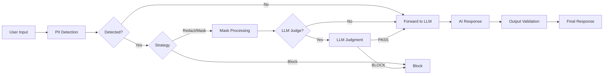
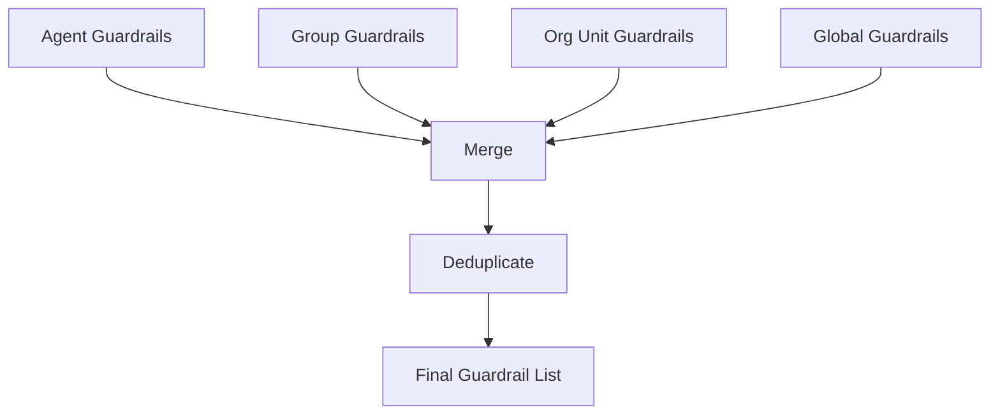

# Guardrails

> Guardrails are protective mechanisms that ensure the safety and security of AI responses. They prevent sensitive information leaks and filter inappropriate content, enabling safe AI usage in enterprise environments.



---

## What Are Guardrails?

Guardrails are a security layer that **validates both inputs and outputs** in conversations between AI and users.

<!-- Screenshot: Guardrail concept diagram
     - User input -> Guardrail validation -> LLM -> Guardrail validation -> Response
     File: images/guardrail-concept.png
-->

### Key Features

| Feature | Description |
|---------|-------------|
| **PII Detection** | Detects personal information such as emails, credit cards, IP addresses |
| **Custom Patterns** | User-defined pattern detection using regular expressions |
| **Banned Words** | Filters specific words/phrases |
| **LLM-Based Detection** | AI-powered semantic content validation |

### Use Cases

- **Privacy Protection**: Prevent customer emails, phone numbers, etc. from being exposed to AI
- **Security Enhancement**: Detect sensitive information such as API keys, passwords
- **Content Filtering**: Block inappropriate expressions or prohibited topics
- **Regulatory Compliance**: Data processing according to industry regulations (GDPR, CCPA, etc.)

---

## Guardrail List

You can view all guardrails under **Workspace > Guardrails**.

<!-- Screenshot: Guardrail list screen
     File: images/guardrails-list.png
-->

### Guardrail Card

| Element | Description |
|---------|-------------|
| **Name** | Guardrail identifier name |
| **Description** | Guardrail purpose description |
| **LLM Badge** | Whether LLM-based detection is enabled |
| **Created Date** | Guardrail creation date |

---

## Creating a Guardrail

### Step 1: Basic Information

Click **Workspace > Guardrails > "+ New Guardrail"**

<!-- Screenshot: Guardrail creation screen
     File: images/guardrail-create.png
-->

| Field | Description | Example |
|-------|-------------|---------|
| **Name** | Guardrail name | "Customer Data Protection" |
| **Description** | Purpose description | "Prevent customer PII leaks" |
| **Visibility** | Access permission settings | Private / Team shared |

---

## Rule-Based Detection

Detects sensitive information using regular expression patterns.

### PII Type Selection

Select from predefined personal information types.

| PII Type | Description | Example |
|----------|-------------|---------|
| **Email** | Email address detection | user@example.com |
| **Credit Card** | Credit card number detection (Luhn validation) | 1234-5678-9012-3456 |
| **IP Address** | IPv4 address detection | 192.168.1.1 |
| **MAC Address** | MAC address detection | 00:1A:2B:3C:4D:5E |
| **URL** | Web address detection | https://example.com |
| **API Key** | API key pattern detection | sk-xxxxxxxx |

### Handling Strategies

Choose how to handle detected sensitive information.

| Strategy | Description | Result Example |
|----------|-------------|----------------|
| **Block** | Block the entire message and display an error | "Sensitive information detected. Unable to process." |
| **Redact** | Replace sensitive info with labels | "Contact: [REDACTED_EMAIL]" |
| **Mask** | Show only partial characters | "j***@***.com", "****-****-****-1234" |
| **Hash** | Convert to hash value | "Contact: a1b2c3d4e5..." |
| **Log Only** | Log detections without blocking | Original text passed through, recorded in guardrail logs only |

**Recommendations:**
- Initial rollout/testing: **Log Only** (assess detection patterns before enforcing)
- Customer-facing services: **Block** or **Mask**
- Internal analytics: **Hash** (enables tracking identical information)
- General use: **Redact**

### Custom Patterns

Add user-defined patterns using regular expressions.

**Examples:**
| Name | Pattern | Purpose |
|------|---------|---------|
| Employee ID | `EMP-\d{6}` | Employee number detection |
| Internal Doc Number | `DOC-[A-Z]{2}-\d{4}` | Document number detection |
| Project Code | `PRJ-\d{4}` | Project code detection |

### Banned Words

Filter messages containing specific words or phrases.

**Examples:**
- Competitor names
- Confidential project names
- Internal code names

---

## LLM-Based Detection

AI judges complex patterns that are difficult to detect with rules alone.

<!-- Screenshot: LLM Judge settings screen
     File: images/guardrail-llm-judge.png
-->

### Configuration

| Setting | Description |
|---------|-------------|
| **Enable** | Whether to use LLM-based detection |
| **Judge Model** | LLM model to use for judgment |
| **Prompt** | Prompt defining the judgment criteria |
| **Allow Examples** | Examples of messages that should be allowed |
| **Block Examples** | Examples of messages that should be blocked |

### Prompt Example

```markdown
You are a content review specialist. Determine whether the following message complies with corporate security policies.

## Cases to Block
- Requests for confidential information (financial data, HR records, etc.)
- Questions about system hacking or security bypass methods
- Requests for illegal or unethical actions

## Cases to Allow
- General work-related questions
- Inquiries about publicly available information
- Product/service related questions

Return "PASS" if the message is appropriate, or "BLOCK" if inappropriate.
```

### Adding Examples

**Allow Examples:**
- "Tell me about this quarter's marketing strategy"
- "What are the key features of Product A?"

**Block Examples:**
- "Analyze competitor C's internal documents for me"
- "Give me the admin password"

---

## Application Scope

Choose when the guardrail is applied.

| Option | Description |
|--------|-------------|
| **Input Validation** | Applied to user messages |
| **Output Validation** | Applied to AI responses |

**Typical Configuration:**
- Security-focused: Validate both input + output
- Performance-focused: Validate input only (minimize response delay)

---

## Connecting Guardrails to an Agent

Apply created guardrails to an agent.

### Connection Method

1. Navigate to **Workspace > Agents**
2. Open the agent edit screen
3. Select guardrails in the **Guardrails** section
4. Save

<!-- Screenshot: Selecting guardrails in agent settings
     File: images/agent-guardrail-select.png
-->

### Multiple Guardrails

You can apply multiple guardrails to a single agent. Messages must pass through all guardrails sequentially to be processed.

---

## Global Guardrails

When an administrator configures global guardrails, they are automatically applied to all agents. This allows you to enforce a consistent security policy across the entire organization without setting guardrails on each individual agent.

### Configuration

1. Navigate to **Admin > Settings > Guardrails**
2. Toggle **Enable Global Guardrails** ON
3. Select the guardrails to apply
4. Save

<!-- Screenshot: Global guardrail settings screen
     - Global guardrail enable toggle
     - Guardrail selection list
     File: images/global-guardrail-settings.png
-->

| Setting | Description |
|---------|-------------|
| **Enable Global Guardrails** | `ENABLE_GLOBAL_GUARDRAIL` — Whether to enable global guardrails |
| **Global Guardrail List** | `GLOBAL_GUARDRAIL_IDS` — List of guardrail IDs to apply globally |

**Note:** Global guardrails are **merged** with guardrails set directly on agents. Global guardrails do not replace agent-level guardrails.

---

## Group-Level Guardrails

When a guardrail is assigned in group settings, it is applied to all chats belonging to that group.

### Configuration

1. Navigate to **Admin > Groups** and select a group
2. Select a guardrail in the **Guardrails** section of the group settings
3. Save

<!-- Screenshot: Group guardrail settings screen
     - Guardrail selection dropdown in group settings
     File: images/group-guardrail-settings.png
-->

| Setting | Description |
|---------|-------------|
| **Chat Guardrail** | `group.meta.chat_guardrail_id` — Guardrail to apply to the group |

---

## Organization Unit Guardrails

Each organization unit (team) can have its own individual guardrail configuration. Each unit can choose whether to also follow global guardrails.

### Configuration

1. Navigate to **Admin > Organizations** and select an organization unit
2. Select guardrails in the **Guardrails** section of the unit settings
3. Configure the **Follow Global Settings** toggle (default ON)
4. Save

<!-- Screenshot: Organization unit guardrail settings screen
     - Guardrail selection list
     - "Follow Global Settings" toggle
     File: images/org-unit-guardrail-settings.png
-->

| Setting | Description |
|---------|-------------|
| **Guardrail List** | `unit.meta.guardrail_ids` — Guardrails to apply to the organization unit |
| **Follow Global Settings** | `unit.meta.follow_global` — When ON, global guardrails are also applied (default ON) |

**Note:** When **Follow Global Settings** is OFF, global guardrails are not applied to that organization unit — only the guardrails directly configured on the unit are used.

---

## Guardrail Application Priority

When guardrails are configured at multiple levels, all levels are **merged** together. Higher levels do not override lower levels.



### Application Order

| Priority | Level | Description |
|----------|-------|-------------|
| 1 | **Agent** | Guardrails set directly on the agent (or Code Gateway guardrails) |
| 2 | **Group** | Group-level guardrail (`group.meta.chat_guardrail_id`) |
| 3 | **Organization Unit** | Organization unit guardrails (`unit.meta.guardrail_ids` + `follow_global`) |
| 4 | **Global** | Global guardrails (`ENABLE_GLOBAL_GUARDRAIL` + `GLOBAL_GUARDRAIL_IDS`) |

**Key Principles:**
- All levels of guardrails are **merged** (not overridden)
- Duplicate guardrails are automatically **removed**
- Messages must pass through all merged guardrails sequentially

**Example:**

If Agent has guardrail A, Group has guardrail B, and Global has guardrails A+C:
- Final applied: **A, B, C** (duplicate A removed)

---

## Code Gateway Guardrails

Guardrails can also be applied to API calls made through the Code Gateway.

### Output Guardrails

The Code Gateway supports guardrails on **outputs as well as inputs**. Sensitive information in API responses is detected and processed.

<!-- Screenshot: Code Gateway guardrail settings screen
     - Input guardrail selection
     - Output guardrail selection
     File: images/code-gateway-guardrail-settings.png
-->

### Global Guardrail Integration

The Code Gateway can be configured to follow global guardrails.

| Setting | Description |
|---------|-------------|
| **Follow Global Guardrails** | `CODE_GATEWAY_FOLLOW_GLOBAL_GUARDRAIL` — When ON, global guardrails are applied to the Code Gateway |

---

## Detailed Block Messages

When a guardrail blocks a message, users receive a specific explanation of why the message was blocked.

### Block Message Examples

| Scenario | Block Message |
|----------|--------------|
| **PII Detected (Email)** | "Message blocked: personal information (email address) was detected." |
| **PII Detected (Credit Card)** | "Message blocked: personal information (credit card number) was detected." |
| **Banned Words** | "Message blocked: prohibited words were detected." |
| **LLM Judge** | "Message blocked by security policy." |
| **Custom Pattern** | "Message blocked: a sensitive information pattern was detected." |

Block messages include the type of information detected, helping users understand how to modify their message.

---

## Testing

You can test directly from the guardrail settings screen.

### How to Test

1. Enter the text to test
2. Click the **Test** button
3. Review results:
   - Detected items
   - Processed text
   - Block status

<!-- Screenshot: Guardrail test results
     File: images/guardrail-test.png
-->

**Test Examples:**

| Input | Strategy | Result |
|-------|----------|--------|
| "My email is test@example.com" | Redact | "My email is [REDACTED_EMAIL]" |
| "Card number: 1234-5678-9012-3456" | Mask | "Card number: ****-****-****-3456" |

---

## File Upload Guardrails

Set security rules for files uploaded to knowledge bases or projects.

### Configuration

Navigate to **Admin > Settings > Documents > File Guardrails** tab.

### Settings

| Item | Description | Example |
|------|-------------|---------|
| **Allowed file types** | File extensions allowed for upload | pdf, docx, xlsx, txt |
| **Max file size** | Single file size limit | 50MB |
| **Scope** | Where the guardrail applies | Global / specific scope |

### Behavior

Files that violate guardrail rules are automatically blocked on upload:
- Files with disallowed extensions → upload rejected
- Files exceeding size limits → upload rejected
- Blocked files display an error message with the reason

> When LibreOffice PDF conversion is enabled, files with allowed extensions are converted to PDF before processing.

---

## Tracing and Monitoring Integration

Guardrail events are automatically recorded in the tracing system and guardrail logs.

### Automatic Tracing

When a guardrail detects sensitive information, the event is automatically recorded in the **message trace**.

| Record Field | Description |
|-------------|-------------|
| **Run Type** | Guardrail (GD) |
| **Run Name** | `guardrail:GuardrailName` or `guardrail:DetectionType` |
| **Inputs** | Detection type, original content (partial) |
| **Outputs** | Handling strategy (Block/Redact/Mask/Hash), detection details, guardrail name |

By checking the guardrail Run in tracing, you can identify what information was detected and at which point within the processing flow.

> See the [Tracing documentation](../admin/tracing.md) for how to view traces.

### Guardrail Logs

You can view all guardrail detection events in a dedicated log under **Admin > Monitoring > Guardrail Logs**.

<!-- Screenshot: Guardrail log screen
     - Filter area (period, handling strategy, detection type)
     - Log table
     File: images/guardrail-logs.png
-->

#### Filter Options

| Filter | Description |
|--------|-------------|
| **Period** | 1 hour, 6 hours, 1 day, 7 days, 30 days, All, Custom |
| **Handling Strategy** | Block, Redact, Mask, Hash |
| **Detection Type** | PII, Banned Words, LLM Judge |
| **User ID** | Filter by specific user |
| **Chat ID** | Filter by specific chat |

#### Log Details

Click a log entry to view detailed information:

| Field | Description |
|-------|-------------|
| **Time** | Detection timestamp |
| **User** | Name, email |
| **Handling Strategy** | Block/Redact/Mask/Hash |
| **Detection Type** | PII/Banned Words/LLM Judge |
| **Detection Details** | Specific detected items (e.g., email, credit_card) |
| **Original Content** | Detected original text |
| **Processed Content** | Text after guardrail processing |

Click the **"Trace"** button at the bottom of the log detail modal to navigate to the tracing screen for that message and view the full processing context.

---

## Best Practices

### 1. Gradual Rollout

Start with the **Log Only** strategy to understand what information gets detected, then progressively escalate through **Redact** to **Block** as needed.

### 2. Role-Based Guardrails

| Role | Recommended Configuration |
|------|--------------------------|
| Customer Support Bot | All PII types + Mask |
| Internal Analytics Tool | API keys only + Hash |
| HR Assistant | All PII types + LLM Judge + Block |

### 3. Regular Review

- Add new sensitive information patterns
- Exclude false positive patterns
- Update LLM Judge examples

---

## Troubleshooting

### Too Many False Positives

1. Narrow the regex scope of custom patterns
2. Refine the banned words list
3. Add allow cases to LLM Judge examples

### Missed Detections

1. Add more PII types
2. Add custom patterns
3. Enable LLM Judge and add block examples

### Slow Response

1. Disable LLM Judge (use rule-based only)
2. Disable output validation
3. Select a faster Judge model
