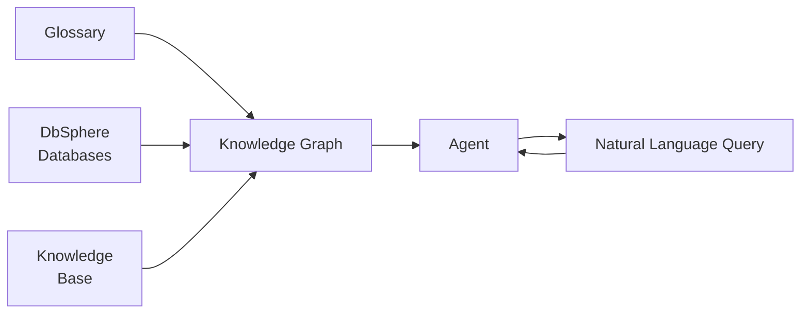
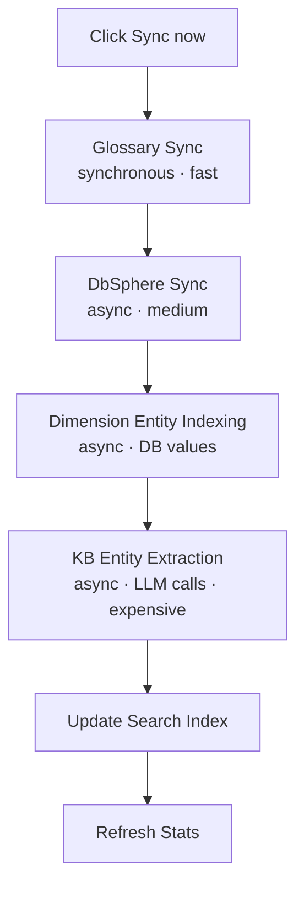
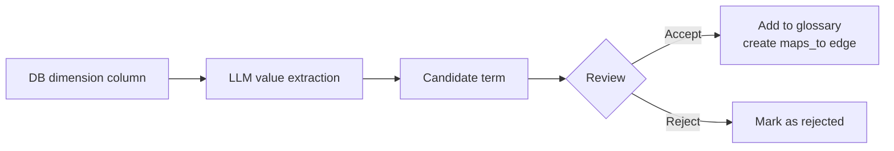

# Knowledge Graph

> Connect business terms, database schemas, and documents into a single meaningful graph. Your AI agents can understand complex questions like "monthly revenue from VIP customers at the Gangnam branch" and answer them with real data.



---

## What is a Knowledge Graph?

A Knowledge Graph (KG) is a unified knowledge structure that connects **Glossary, DbSphere (databases), and Knowledge Base** into a single graph. It lets AI agents automatically understand which database column a business term maps to, and which document context it relates to.

### Three Sources, One Graph

| Source | Contents | Role in KG |
|--------|----------|-----------|
| **Glossary** | Business term definitions (VIP, MRR, Gangnam branch, etc.) | `term` / `concept` nodes + synonym/category edges |
| **DbSphere (Database)** | Table/column schemas + FK relationships | `table` / `column` nodes + `belongs_to` / `foreign_key` edges |
| **Knowledge Base** | Policies, strategies, manuals, etc. | `doc_entity` nodes + LLM-extracted relation edges |

### Document Structure in the Graph (restructured in 1.0.2)

In 1.0.2 the document hierarchy of the graph is simplified. **Chunks are no longer materialized as their own nodes** — instead, extracted entities are attributed (provenance) directly to the document node.

```
Knowledge Base (container) ── contains_document ──> Document ── extracted_from / mentioned_in ──> doc_entity
                                                       │
                                                       └── has_doc_type ──> doc_type (KB filter label)
```

- **Container node** — Each knowledge base becomes a node, so you can tell which KB owns which documents.
- **Document node** — Every source document exists as its own node and can be referenced directly in the KG.
- **Chunks contribute provenance, not nodes** — Per-chunk extraction still runs, but the resulting provenance is rolled up to the document node. The graph stays lighter and visualization / browsing become much simpler.
- **Edges** — `contains_document` is the KB → document ownership edge; `extracted_from` / `mentioned_in` express where an entity came from. (The previous `contains_chunk` edges are removed by migration.)

> ⚠️ 1.0.2 migration: existing `chunk` nodes and chunk-targeted `mentioned_in` / `contains_chunk` edges are deleted automatically. Visualization, the node list, and the edge catalog all stop showing chunk options.

### Document Type = KB Filter's Doc Type (1.0.2)

Whether a document is a contract, policy, manual, or report is **no longer a separate KG node type**. Starting in 1.0.2 it lives in the **KB filter's `doc_type` slot**.

- **Promoted to KB Filter > Doc Type** — Add a `type=doc_type` slot in the KB's `filter_schema` to lock the labels the LLM / rules can use (see the [Knowledge Base guide](./knowledge.md) for details).
- **Multiple document types per document** — A single document can belong to more than one type (the `has_doc_type` edge is multi-valued), e.g. "contract + manual".
- **Chunk-content-aware classification** — The previous filename-only classifier failed when one file mixed multiple sections. From 1.0.2, chunk content (first portion) is inspected and the section is inferred per chunk.
- **Edge catalog scope** — In the edge catalog, each edge type can be scoped to specific `doc_type` labels, so domain patterns like "precaution chunk → precaution edge" stay clean.

> Note: KG sync prefers the `doc_type` values stored in the KB filter (`file_metadata`); KBs without that slot fall back to filename-based classification.

### The Problem KG Solves

Using Glossary, DbSphere, and Knowledge Base in isolation leaves your agent **unable to connect their meaning**.

| If you only use... | Limitation |
|------|------------|
| Glossary | Knows what "VIP customer" means, but not which table it's in |
| DbSphere | Knows the schema, but doesn't know that "VIP" means `tier='VIP'` |
| Knowledge Base | Finds document content, but can't link it to actual data |
| **KG** | **Connects term → column/filter → related documents in one step** |

### Example

```
User: What are the top 3 products purchased by VIP customers at the Gangnam branch?

Agent behavior:
  1. kg_resolve_term("VIP customer")
     → finds mapping: users.tier = 'VIP'
  2. kg_resolve_term("Gangnam branch")
     → finds mapping: stores.region = 'Gangnam'
  3. kg_find_related_tables("users")
     → discovers orders, products are joinable
  4. Generates and runs SQL

Response: Top 3 products for VIP customers in Gangnam:
  1. Wireless Earbuds Pro — 1,523 purchases
  2. Smartwatch X — 1,287 purchases
  3. Noise-Cancelling Headphones — 892 purchases
```

---

## Creating a Knowledge Graph

### Step 1: Create a New KG

**Workspace > Knowledge Graph > "+ New Knowledge Graph"** opens a **dedicated creation page**. (In prior versions this was an inline modal; starting in 1.0.1 it is a separate page.)

<!-- Screenshot: KG list page with create button
     File: images/kg-list.png
-->

### Step 2: Set Name and Description

| Field | Description | Example |
|-------|-------------|---------|
| **Name** | KG identifier | "Enterprise Knowledge Graph" |
| **Description** | Purpose | "Unified analytics for sales, customers, and products" |

### Step 3: Pick Resources to Connect

Right on the creation page you can **check the glossaries, DbSphere connections, and knowledge bases** you want to link. Your KG starts pre-connected instead of requiring you to attach each resource afterwards.

---

## Connecting Resources

On the KG detail page, connect each of the three sources.

<!-- Screenshot: KG detail page (stats + sections)
     File: images/kg-detail.png
-->

### Connect Glossary

In the **Glossary section**, click **"+ Add Glossary"** and select glossaries to use.

| What happens after connecting |
|-------------------------------|
| Each glossary entry becomes a `term` node |
| Synonyms are connected via `synonym_of` edges |
| Categories become `concept` nodes linked by `broader_than` edges |

### Connect Database

In the **Database section**, click **"+ Add Database"** and select a DbSphere connection.

| What happens after connecting |
|-------------------------------|
| Each table becomes a `table` node |
| Each column becomes a `column` node |
| Columns link to tables via `belongs_to` edges |
| Foreign keys become `foreign_key` edges |

> 💡 Schema extraction **reuses DbSphere sync results**, so make sure to run the schema sync in DbSphere first.

### Connect Knowledge Base

In the **Knowledge Base section**, click **"+ Add KB"** and select a knowledge base.

| What happens after connecting |
|-------------------------------|
| KB document chunks are processed by an LLM to extract entities and relations |
| Extracted entities become `doc_entity` nodes |
| Relations between entities (`produces`, `owned_by`, `located_in`, `has_risk`, etc.) become edges |

> ⚠️ KB entity extraction **uses LLM calls that incur cost**. Connect only the KBs you need, and enable `auto_extract_llm` with care.

---

## Synchronization

After connecting resources, you need to run a **sync** to populate nodes and edges.

### Run Sync

Click the **"Sync now"** button at the top of the KG detail page, or run per-section syncs for fine-grained control.

<!-- Screenshot: Sync running banner
     File: images/kg-sync-banner.png
-->

### Sync Order



### Progress Tracking

When a sync starts, a **progress banner** appears with:
- Current processing stage
- Progress (completed / total)
- Error messages if any step fails
- A **Cancel** button to abort mid-way

### Global Progress (1.0.1)

Starting in 1.0.1, KG sync progress is also surfaced in the top **notification center**.

- Progress persists even if you leave the KG page, so you can check status from anywhere in the app.
- When a background job finishes, you get a completion notification; on failure you can retry or abort from the same place.
- Multiple resource syncs (glossary · DbSphere · knowledge base) run side by side with separate progress indicators.

---

## KG Detail Page Layout

### Stats Cards

| Item | Meaning |
|------|---------|
| **Nodes** | Total node count in the graph |
| **Edges** | Total edge count in the graph |
| **Last synced** | Most recent sync timestamp |

<!-- Screenshot: Three stats cards
     File: images/kg-stats-cards.png
-->

### Graph Visualization

An interactive Cytoscape-based graph lets you visually explore nodes and edges.

- Drag to move nodes
- Scroll to zoom
- Click nodes for details

<!-- Screenshot: Graph visualization area
     File: images/kg-graph-view.png
-->

### Fullscreen View (1.0.1)

Large graphs with many nodes can now be switched into a **fullscreen mode** for more comfortable exploration.

- Toggle fullscreen from the view controls
- A left list panel lets you jump straight to any node that may be hard to find visually
- All existing interactions (drag, zoom, click) work exactly the same inside fullscreen

### Node / Edge Lists

You can filter and search nodes by type. In addition to the visual view, 1.0.1 adds **list (tabular) views** for both nodes and edges so you can scan everything at a glance.

| Node Type | Meaning |
|-----------|---------|
| `term` | Business term from Glossary |
| `concept` | Category of terms |
| `table` | Database table |
| `column` | Database column |
| `document` | Individual document in a knowledge base |
| `doc_entity` | Entity extracted from KB document |
| `doc_type` | Document type (contract / policy / manual, etc.) |

> Starting in 1.0.2 the `chunk` node type is gone. It is removed from visualization color palettes / legends / focus-area dropdowns / node list badges, and edge labels that targeted chunks have been cleaned up.

### Edge Catalog Modal (1.0.1, expanded in 1.0.2)

A dedicated **edge catalog** modal lets you organize edge (relation) types in one place.

- **Category-based management** — Group edge types by category (e.g. structural, semantic, referential).
- **Per-category scope & default seed** — Presets are domain-agnostic (no built-in bias toward specific fields like pharma or law), so they generalize across tenants.
- **Cross-category badge** — Edges that link nodes from different categories are marked with a visual badge for quick recognition.
- **Per-edge LLM model** — Choose a different extraction model per edge type.
- **ConfirmDialog guardrails** — Irreversible actions (like deletion) require explicit confirmation.
- **Doc-Type Scope column (1.0.2)** — Each edge type now has a selector that pins it to one or more `doc_type` labels. Connected KBs surface the union of their `allowed_values` as a guidance panel, and KBs without a `doc_type` slot show a separate hint.
- **Edge recommendation — broad axes + forced category mapping (1.0.2)** — The LLM-driven edge proposer first checks domain-agnostic broad axes (definition / purpose / method / constraint / composition / management / quantitative), and category mapping is enforced by code rather than by the LLM. Forbidden mismatches drop to zero and cross-category coverage stabilizes.

### Edge Recommendation Pipeline (1.0.2)

The **AI Suggest** button in the edge catalog runs through a redesigned three-step pipeline.

| Step | What it does |
|------|--------------|
| **INTRA** | Within a category, suggests edges aligned with broad axes first |
| **CROSS** | Discovers cross-category edges in a balanced way |
| **MERGE** | Self-checks broad-axis coverage — if proposals cluster on a narrow axis, they are generalized to fill broad axes |

> Net effect: recommendations no longer get pulled by domain-specific vocabulary. The same seven broad axes show up consistently across KBs.

---

## Agent Integration

The real power of KG shines when **connected to an agent**.

### Connect KG to an Agent

In the agent editor, open the **Knowledge Graph** section and select the KG to use.

- The **Glossary, DbSphere, and Knowledge Base** linked to the KG are automatically inherited by the agent.
- The agent gains access to the full KG toolset without additional setup.

<!-- Screenshot: KG section in agent editor
     File: images/kg-agent-connection.png
-->

### KG Tools

Tools available to agents. In 1.0.2, **Graph-RAG has been redesigned** — the toolset is expanded and the prompt is leaner. The KG agent also consults DbSphere memory (schema / SQL examples) for more accurate answers.

| Tool | Purpose |
|------|---------|
| **kg_resolve_term** | Convert business term → column/filter ("VIP customer" → `tier='VIP'`) |
| **kg_explore_context** | Traverse N-hop neighbors from a seed node. From 1.0.2, container / hierarchy edges (`contains_*`) are filtered out of the traversal, so only domain-meaning edges are followed |
| **kg_search_concepts** | Semantic search over nodes (top-k + neighbor expansion) |
| **kg_find_related_tables** | Return tables that are joinable with a given table |
| **kg_neighbors** | Fetch direct neighbors of a specific node |
| **kg_fetch_data** (1.0.2) | Pull data rows from the database grounded in KG context — narrows file-id candidates by entities found in `user_question` / SQL results, and falls back to document search if SQL returns nothing |
| **kg_fetch_document** (1.0.2) | Collect candidate documents from the graph first (seed node + optional `doc_type` filter), then fetch their content directly from the vector store. An optional `edge_types` parameter lets you narrow candidates by catalog edges |
| **kg_cypher** (1.0.3) | Read-only AGE Cypher escape hatch — run a Cypher query you compose yourself when the other tools cannot answer the question (see the section below) |

> The 1.0.2 cleanup removed the chunk-only paths (`_resolve_chunk_nodes_to_text`, `chunk_node_ids` parameter, etc.) and consolidated everything around a single file-id path.

### kg_cypher Tool — Read-only Cypher Escape Hatch (1.0.3)

For graph queries that the existing seven KG tools cannot express, an escape-hatch tool lets the **agent author and run its own Cypher**.

- **Read-only enforcement** — A safety layer permits only `MATCH`. Mutating clauses (`CREATE / MERGE / DELETE / SET / REMOVE / DROP / DETACH / CALL`), `apoc.*` calls, and multi-statement submissions are all rejected.
- **Auto LIMIT** — `LIMIT 100` is auto-injected when `RETURN` lacks a limit (override up to 500 via `max_rows`). Pure aggregate `RETURN` clauses (`count / sum / avg / min / max / collect`) are left untouched, and the statement timeout is 5 seconds.
- **LLM judge** — An LLM scores whether the result actually answers the question (`confidence`). `(question, Cypher)` pairs that pass `confidence ≥ 0.7` are auto-saved as `cypher_example` memories and surface as few-shot context on future calls.
- **AGE pitfall guidance** — The tool description bundles AGE-specific guardrails (no edge alternation `[:A|B]`, **`ORDER BY` cannot reference `RETURN` aliases**, etc.) to improve first-attempt accuracy.
- **Fed into final_answer context** — `kg_cypher` results are promoted to the final_answer KG context the same way `kg_resolve_term` / `kg_fetch_document` outputs are.
- **Negative learning** — When a Cypher fails with an AGE error and a follow-up attempt in the same turn succeeds, the `(bad Cypher, error, fix Cypher)` triple is saved as a `cypher_negative` memory and used as a learning signal in subsequent calls.

When to use:
- Set intersection between two `doc_entity` slots, multi-hop traversal, anti-joins, label-pattern aggregations, and other queries the standard tools cannot express.
- Operators debugging the KG structure (run it directly from the Tool Tester).

### KG Semantic Memory — Five Types (1.0.3)

The KG agent now consults a semantic memory layer on every call. All five types live in a single index (`kg_memory`) keyed by `collection=kg_id` + an `entity_type` discriminator, with built-in dedup and drift handling so memory does not grow unbounded.

| Memory Type | entity_type | Contents | Dedup / Drift |
|-------------|-------------|----------|----------------|
| **Cypher Example** | `cypher_example` | `(question, successful Cypher)` pairs that passed the LLM judge | When a candidate question similarity ≥ 0.92 and Cypher token Jaccard ≥ 0.8 hits, no new row is inserted — instead `hit_count++` and `last_used` are bumped. Search ranks by `0.6*sim + 0.25*confidence + 0.15*log(1+hit_count)`, so frequently used queries naturally float to the top |
| **KG Schema Doc** | `kg_schema_doc` | LLM-generated natural-language descriptions of node / edge types | Dedup via SHA1 of (sample labels, property keys, degree stats) stored as `source_hash` — if the input is unchanged, the LLM call itself is skipped |
| **KG Domain Doc** | `kg_domain_doc` | KG-level business rules / conventions / AGE caveats (admin curated + system-seeded). Categorized by `doc_type` into `rule` / `convention` / `caveat` | Author and doc_type let admins isolate their edits |
| **Cypher Pattern** | `cypher_pattern` | Reusable traversal templates — promoted from clusters of `cypher_example` rows that share a slot-bearing structure | Promotion trace (`promoted_from_examples`) is preserved |
| **Cypher Negative** | `cypher_negative` | First-try Cypher that failed + error excerpt + the fix that worked | Memories whose referenced node / edge types disappear after a KG sync are flagged `stale=True` (`mark_stale_by_referenced_types`) |

> All five memories share a single `search_all_context` entry point that runs them in parallel and bundles the hits as `semantic_context` in the `kg_cypher` response. The agent uses that bundle as few-shot context for its next attempt.

### KG Schema Doc Extraction (kg_schema_doc, 1.0.3)

The KG runs an LLM extractor that writes a natural-language description for every node / edge type into `kg_schema_doc` memory. Operators get a more readable graph schema, and the agent infers schema semantics more accurately.

- **Trigger** — Runs automatically right after KG sync finalize. Admins can also force a re-extraction.
- **Sampling** — Up to 8 sample labels per type, plus the most common property keys and degree stats, are passed to the LLM.
- **Dedup** — Identical `source_hash` skips the LLM call entirely, so cost does not balloon.
- **Drift** — Node / edge types that disappear after a sync have their schema docs flagged `stale=True` automatically.

### KB Chunk Extraction Fixes (1.0.3)

- **AGE-empty bug fix** — Entities extracted from KB chunks were populating the SQL `KGNode` table but were never written to AGE. The fix ensures `doc_entity` nodes are now written to AGE as well, so visualization and traversal stay consistent.
- **Per-file source separation** — `kg_fetch_document` / `kg_fetch_data` previously emitted multiple chunks as a single source event. Sources are now split per `metadata.source` (file_id), the LLM context's `[N]` labels are assigned per file, and chunks are shown as `(chunk j, score=...)` sub-labels.

### KG-only Agent Isolation (1.0.1)

When an agent has **only a KG connected**, the standalone KbSphere and DbSphere tools are not exposed.

- Glossaries, DbSphere connections, and knowledge bases attached to that KG are accessible **only through the KG tools**.
- As a result, the agent follows a consistent "understand meaning via the graph first, then fetch data / documents precisely" workflow.
- If you want independent KbSphere or DbSphere tool usage, connect those resources to the agent explicitly as well.

### Tool Tester

The **Tool Tester** section on the KG detail page lets you invoke tools directly (without an agent). This is useful for verifying sync results and tool outputs.

<!-- Screenshot: Tool tester section
     File: images/kg-tool-tester.png
-->

---

## Candidate Term Review

You can review **candidate terms** automatically extracted from database dimension values and add them to your glossary.

### Candidate Flow



### Review Screen

The **Candidate Terms section** shows pending candidates for review.

| Field | Description |
|-------|-------------|
| **Suggested label** | LLM-proposed term |
| **Confidence** | Confidence score (0–1) |
| **Reasoning** | Why this term was suggested |
| **Source column** | Which DB column it was extracted from |

When you **Accept**, you select a target glossary; the system automatically adds an entry to the glossary and creates a `maps_to` edge in the KG.

---

## Knowledge Link

Knowledge Link automatically matches **database dimension values** (e.g., product IDs, supplier codes) with **documents in a knowledge base**.

### Examples

- Match product names in the master table with KB product description documents
- Match supplier codes with ESG risk assessment documents
- Match patient IDs with clinical records

### Setup

**Knowledge Link section > "+ Add Knowledge Link"**

1. **Source (data)**
   - Select DbSphere connection
   - Select table
   - Label column (e.g., `product_name`)
   - Key column (e.g., `product_id`)

2. **Target (documents)**
   - Select one or more knowledge bases to match against

3. **Matching model**
   - Choose the LLM to use for matching

Save and click **"Sync now"** to run the match. This creates `dimension_entity → doc_entity` edges (HAS_FEATURE).

<!-- Screenshot: Knowledge link modal (KB / DbSphere checkboxes)
     File: images/kg-link-modal.png
-->

### KB / DbSphere Checkbox Selection (1.0.2)

Before 1.0.2, every KB and DbSphere referenced by the chosen glossary was attached to the link automatically — there was no way to pick just a subset. Starting in 1.0.2 the modal lets you **explicitly check the KBs and DbSphere connections** to include.

| Item | Behavior |
|------|----------|
| **KB candidates** | All accessible KBs whose `meta.filter_schema` references the selected glossary |
| **DbSphere candidates** | DbSphere connections registered in the glossary's `extraction_sources` |
| **Storage** | Saved per link as `link.config.dbsphere_ids` — empty / unset means "fall back to all" at sync time |
| **Auto recompute of `kg.data.sources`** | Link create / delete / sync hooks recompute `kg.data.sources = {glossaries, knowledge_bases, dbspheres}`, so you always see a consistent picture of which resources the KG depends on |

> 💡 If the modal finds no KB or DbSphere candidates, an inline hint tells you which glossary / filter to set up first.

### Phase 2 Fan-Out + Bulk Upsert (operations note, 1.0.2)

KB matching during KG sync (Phase 2) is split into a **per-KB fan-out** in 1.0.2 instead of running in a single worker loop.

- A parent job (`process_kg_link_match_phase_task`) spawns child jobs (`process_kg_link_match_kb_task`); progress is counted as each child finishes
- Node / edge upserts use `bulk_upsert_nodes` / `bulk_upsert_edges` (single-statement batches) for noticeably shorter sync times on large KBs
- If a KB has files but the resulting `doc_entity_map` is empty, the backend emits a `kg-link-sync-warning` socket event so silent failures cannot get buried

---

## FAQ

### How is KG different from Glossary?

Glossary only stores **term definitions**. KG connects those terms to **database columns and document entities**, so agents can actually use them to query data and reason over documents.

### How is KG different from DbSphere?

DbSphere generates SQL from **schemas**. KG adds **business terminology and document context** on top, so expressions that aren't in the schema (like "VIP customer") can still be understood.

### Sync is taking too long

- **Glossary / DbSphere sync**: fast (seconds to minutes)
- **Knowledge Base entity extraction**: can take minutes to hours depending on document count and LLM speed

You can cancel from the progress banner. State is saved per chunk, so the next sync resumes from where it left off.

### Sync failed. What now?

- Check the error message in the progress banner.
- **DbSphere error**: Make sure DbSphere schema sync succeeded first.
- **KB extraction error**: Verify your LLM model (TASK_MODEL) and API key are configured.

### I'm worried about LLM costs

Only **KB auto entity extraction** uses LLM calls. You can control costs by:

- Disabling `auto_extract_llm` when connecting a KB
- Only connecting KBs you actually need
- For large KBs, running extraction manually in batches
