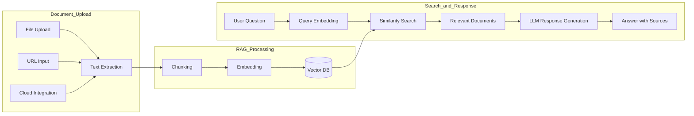

# Knowledge Base

> Connect internal documents, manuals, and guidelines to your AI for accurate and trustworthy answers. The knowledge base is the core feature that enables AI to learn and leverage your organization's knowledge.



---

## What Is a Knowledge Base?

A knowledge base is a system that converts documents into a format that AI can understand and stores them.

<!-- Screenshot: Knowledge base concept diagram
     - Document upload -> Chunking -> Embedding -> Vector DB -> Search -> AI response
     Filename: images/knowledge-concept.png
-->

### RAG (Retrieval-Augmented Generation) Technology

**How it works:**
1. User enters a question
2. Related documents are automatically retrieved
3. Retrieved content is passed to the AI
4. AI generates an answer based on the documents

**Benefits:**
- Accurate answers based on internal information
- Credibility through source citations
- Ability to reflect the latest documents
- Reduced AI hallucination

---

## Knowledge Base List

View all knowledge bases under **Workspace > Knowledge Base**.

<!-- Screenshot: Knowledge base list screen
     - Knowledge bases displayed as cards/list
     - Search bar, create button
     Filename: images/knowledge-list.png
-->

### Knowledge Base Types

| Type | Icon | Description |
|------|------|-------------|
| **Collection** | 📚 | Manage multiple documents as a group |
| **Single Document** | 📄 | Manage individual files |

---

## Creating a Knowledge Base

### Step 1: Create a New Knowledge Base

Click the **"+ New Knowledge Base"** button.

<!-- Screenshot: Knowledge base creation form
     - Name, description input fields
     Filename: images/knowledge-create-form.png
-->

| Field | Description | Example |
|-------|-------------|---------|
| **Name** | Knowledge base name | "HR Policy 2024" |
| **Description** | Purpose and content description | "HR policies and guidelines" |

### Step 2: Upload Documents

Add documents to the created knowledge base.

<!-- Screenshot: Document upload screen
     - Drag and drop area
     - List of uploaded files
     Filename: images/knowledge-upload.png
-->

**Upload methods:**
- **Drag and Drop**: Drag files into the upload area
- **File Selection**: Click the "Add File" button
- **URL**: Enter a web page URL
- **Text**: Enter text directly

### Supported File Formats

| Category | Formats | Max Size |
|----------|---------|----------|
| **Documents** | PDF, DOCX, PPTX, TXT, MD | 50MB |
| **Spreadsheets** | XLSX, CSV | 20MB |
| **Web** | HTML, URL | - |
| **Code** | PY, JS, TS, JSON, YAML | 10MB |

### Step 3: Wait for Processing

Uploaded documents are processed automatically.

<!-- Screenshot: Document processing status display
     - Progress bar or processing icon
     Filename: images/knowledge-processing.png
-->

**Processing steps:**
1. **Text Extraction**: Extract text from documents (including OCR)
2. **Chunking**: Split into appropriately sized segments
3. **Embedding**: Convert to vectors
4. **Indexing**: Store for searchability

#### Reliable Large-Scale File Processing

File processing is handled by a queue-based worker so the main service stays responsive even with bulk uploads.

- **Automatic Retry**: Transient errors are automatically retried for stable operation.
- **Failed File Visibility**: Files that fail processing are clearly displayed and can be retried directly from the UI.
- **Same-Filename Auto Replacement**: Re-uploading a file with the same name automatically replaces the existing file (preventing duplicate entries).
- **Processing Status Cards**: A unified card view shows in-progress / completed / failed states at a glance.

<!-- Screenshot: File processing status cards (in-progress / completed / failed)
     Filename: images/knowledge-processing-status.png
-->

### Step 4: Set Access Permissions

Configure who can use this knowledge base.

<!-- Screenshot: Access permission settings modal
     Filename: images/knowledge-access-control.png
-->

| Option | Description |
|--------|-------------|
| **Public** | Available to all users |
| **Private** | Available to the owner only |
| **Group-specific** | Available to specific groups only |
| **Organization-specific** | Available to specific departments only |

---

## Managing Knowledge Bases

### Viewing Document List

Click on a knowledge base to view the list of included documents.

<!-- Screenshot: Knowledge base detail - Document list
     - Left: File tree
     - Right: Selected document content
     Filename: images/knowledge-detail.png
-->

### Adding/Deleting Documents

| Action | Method |
|--------|--------|
| **Add** | "+ Add" button or drag and drop |
| **Delete** | Select document -> Delete button |
| **Replace** | Re-upload with the same filename |

### Document Search

You can find documents by filename using the search bar at the top.

<!-- Screenshot: Document search feature
     Filename: images/knowledge-search.png
-->

### Viewing Document Content

Click on a document to view the extracted text content.

<!-- Screenshot: Document content preview
     Filename: images/knowledge-preview.png
-->

### Sync

Re-sync the vector DB after document changes.

<!-- Screenshot: Sync button
     Filename: images/knowledge-sync.png
-->

### Dynamic Filters

Dynamic filters allow you to narrow the search scope by filtering documents within a knowledge base based on metadata.

<!-- Screenshot: Dynamic filter settings screen
     - Filter schema definition area
     - Filter type selection (text/number/date)
     Filename: images/knowledge-dynamic-filter.png
-->

#### Defining Filter Schema

Define a filter schema in the knowledge base settings. Click the **"+ Add Filter"** button to add filter fields.

| Setting | Description | Example |
|---------|-------------|---------|
| **Name** | Filter field name | "Department", "Year" |
| **Type** | Data type selection | Text (enum), Number, Date |
| **Options** | List of selectable values (text type only) | "Finance, HR, Engineering" |
| **Description** | Description for AI to understand the filter | "Filters documents by their department" |

**Filter types:**

| Type | Description | Slot Limit |
|------|-------------|------------|
| **Text (Enum)** | Single select from predefined options | Max 4 |
| **Collection** | Multi-select from predefined options | Max 4 |
| **Number** | Integer value filter | Max 2 |
| **Date** | Date range filter | Max 2 |

**Required fields:**

Each filter can be marked as "Required". Required filters show a `*` indicator in the input form, and files with missing required values display an orange status indicator.

> **Tip:** Use the AI auto-generate button for filter descriptions -- it automatically writes descriptions based on the filter name and options.

#### Setting Per-File Metadata

After defining the filter schema, assign metadata values to each file.

<!-- Screenshot: File metadata input form
     - Metadata status indicator in file list (green dot: set, empty circle: not set)
     - 4-column grid input form
     Filename: images/knowledge-file-metadata.png
-->

1. Select a file from the file list
2. Enter values for each filter field in the metadata input form
3. Click the save button

Metadata status is indicated by a 4-level color system in the file list:

| Color | Meaning |
|-------|---------|
| **Green** | All filter fields have values |
| **Yellow** | Some fields are set |
| **Orange** | Required fields are missing |
| **Gray outline** | No metadata set |
| **Purple spinner** | AI extraction in progress |

> **Note:** When metadata is changed, the vector index is automatically updated while retaining existing vectors without re-embedding.

#### AI Auto-Extraction

When you configure an **extraction prompt** in the filter schema, the LLM will automatically analyze the document content and file title to extract metadata upon file upload.

**Setup:**

1. Set the **extraction mode** to "AI" in the filter schema
2. Write an **extraction prompt** for each filter (e.g., "Extract the country name from the file title")
3. Select the **AI model** for extraction
4. Metadata is automatically extracted when files are uploaded

**Extraction methods:**

| Method | Description |
|--------|-------------|
| **Auto-extract** | Runs automatically on file upload (when AI mode is active) |
| **Single extract** | Click the extract button in the file metadata editor |
| **Bulk extract** | Re-extract metadata for all files at once |

> **Tip:** You can use "file title" as a condition in extraction prompts. Example: "If the file title starts with [XX] country name, extract the corresponding country code"

#### Using Filters in Search

When a knowledge base with dynamic filters is connected to an agent, the AI automatically infers filter conditions from the user's question to narrow the search scope.

**Example:**
```
Q: Show me the Finance department's 2024 policies
-> Filters auto-applied: Department=Finance, Year=2024
-> Only documents matching those conditions are searched
```

### Tool Description

The tool description is an AI-specific description that guides the agent on **when and in what context** to use the knowledge base.

<!-- Screenshot: Tool description input area and AI auto-generate button
     Filename: images/knowledge-tool-description.png
-->

| Item | Description |
|------|-------------|
| **Tool Description** | Text that tells the agent the conditions for using this KB |
| **AI Auto-Generate** | AI automatically writes a tool description based on the KB name, description, and file list |

**Good tool description example:**
```
Use this when there are questions about company HR policies and internal guidelines.
Refer to this for inquiries about annual leave, benefits, travel expenses, and other HR-related topics.
```

> **Tip:** If no tool description is set, the knowledge base's general description is used instead. It is recommended to write a specific tool description so the AI can select the appropriate KB.

---

## Using Knowledge Bases

### Using in Chat

**Method 1: @ Command**
```
@HRPolicy What is the procedure for requesting annual leave?
```

**Method 2: Connect to an Agent**
Connect a knowledge base in the agent settings for automatic referencing.

<!-- Screenshot: Knowledge base response in chat (with citations)
     Filename: images/knowledge-in-chat.png
-->

### Checking Citations

Click on citation numbers displayed in the AI response to view the original text.

<!-- Screenshot: Original text popup when clicking a citation
     Filename: images/knowledge-citation-popup.png
-->

---

## Cloud Storage Integration

You can import documents directly from external cloud storage.

### Google Drive

<!-- Screenshot: Google Drive integration screen
     Filename: images/knowledge-google-drive.png
-->

1. Click "Import from Google Drive"
2. Connect your Google account
3. Select and import files

### OneDrive

<!-- Screenshot: OneDrive integration screen
     Filename: images/knowledge-onedrive.png
-->

1. Click "Import from OneDrive"
2. Connect your Microsoft account
3. Select and import files

### SharePoint

You can connect documents directly from your organization's SharePoint.

<!-- Screenshot: SharePoint browser
     Filename: images/knowledge-sharepoint.png
-->

**Benefits:**
- Direct integration with internal document systems
- Real-time latest version maintenance
- Unified permission management

---

## Advanced Settings

### Document Processing Options

You can adjust document processing methods in the admin settings.

<!-- Screenshot: Admin > Settings > Document Processing
     Filename: images/knowledge-admin-settings.png
-->

| Setting | Description | Default |
|---------|-------------|---------|
| **Chunk Size** | Document splitting unit | 1500 characters |
| **Chunk Overlap** | Overlap between chunks | 100 characters |
| **OCR Enabled** | Image text extraction | Enabled |

### Embedding Engine

| Engine | Features |
|--------|----------|
| **Local** | No external data transfer, excellent security |
| **OpenAI** | High quality, API costs apply |
| **Azure OpenAI** | Optimized for enterprise environments |

### Search Settings

| Setting | Description |
|---------|-------------|
| **Top K** | Number of search results |
| **Relevance Threshold** | Minimum similarity score |
| **Hybrid Search** | Combined keyword + semantic search |
| **Reranking** | Reorder search results |

---

## Use Cases

### Case 1: New Employee Onboarding

**Knowledge base contents:**
- Company introduction materials
- HR policies
- IT system usage guide
- Department-specific work manuals

**Usage:**
```
Q: How do I submit a travel expense report?
A: Here is the travel expense reporting procedure:

1. Access the ERP system
2. Select the expense report menu
3. Enter travel details and attach receipts
4. Submit for manager approval

The reporting deadline is the 25th of each month, and corporate card transactions require a separate report.

[Source: ExpenseReportGuide.pdf, page 3]
```

### Case 2: Customer Support

**Knowledge base contents:**
- Product manuals
- FAQ documents
- Troubleshooting guides
- Past ticket records

**Usage:**
```
Q: How do I factory reset Product A?
A: How to factory reset Product A:

1. Press and hold the power button for 10 seconds
2. Wait until the LED blinks red
3. Release the button
4. The device will reboot automatically

Note: A factory reset will delete all saved settings.

[Source: ProductA_UserManual.pdf, page 45]
```

### Case 3: Legal/Regulatory Review

**Knowledge base contents:**
- Internal regulations handbook
- Contract templates
- Legal guidelines
- Compliance checklists

**Usage:**
```
Q: What are the mandatory disclosures when collecting personal data?
A: Mandatory disclosures for personal data collection:

1. Purpose of collecting and using personal data
2. Items of personal data being collected
3. Retention and usage period of personal data
4. Right to refuse consent and any disadvantages of refusal
5. Whether personal data will be provided to third parties

[Source: DataPrivacyGuidelines.pdf, Article 12]
```

---

## Best Practices

### Document Preparation Tips

1. **Clean formatting**
   - Clearly distinguish headings and subheadings
   - Include a table of contents
   - Maintain a consistent style

2. **Keep up to date**
   - Regularly update documents
   - Delete outdated documents

3. **Appropriate size**
   - Split documents that are too large
   - Group related content together

### Knowledge Base Organization Tips

1. **Separate by topic**
   - "HR Policies", "IT Guide", "Product Manuals", etc.

2. **Granular access permissions**
   - Manage sensitive information separately
   - Restrict access by department

3. **Regular audits**
   - Review content monthly
   - Clean up unnecessary documents

---

## New Features (Since March 2025)

### Background Batch Parallel Processing

Multiple files can now be processed in parallel during document extraction. Real-time progress for each file is displayed via Socket.IO.

<!-- Screenshot: Batch processing progress display
     - Real-time progress bars via Socket.IO
     - Multiple files processing simultaneously
     Filename: images/knowledge-batch-processing.png
-->

**Key features:**
- Extract multiple files simultaneously, reducing overall processing time
- Monitor per-file progress in real-time with progress bars
- Processing runs in the background so you can continue other work

### Checkbox-Based Selective Extraction

Select individual files using checkboxes in the file list, then run extraction only on the selected files. This allows you to extract only the files you need rather than processing everything.

<!-- Screenshot: Checkbox selection and extraction UI
     - Checkboxes on the left side of the file list
     - Extract button for selected files
     Filename: images/knowledge-checkbox-extract.png
-->

**How to use:**
1. Select the checkboxes next to the files you want to extract
2. Click the **"Extract"** button at the top
3. Extraction begins only for the selected files

### Per-Knowledge-Base Search Setting Overrides

Each knowledge base can now have its own individual search settings. Instead of relying on global search settings, you can configure optimal search parameters tailored to each knowledge base's characteristics.

<!-- Screenshot: Per-knowledge-base search settings override screen
     - Top K, relevance threshold, and other individual setting fields
     Filename: images/knowledge-search-override.png
-->

| Setting | Description |
|---------|-------------|
| **Top K** | Number of search results to return for this knowledge base |
| **Relevance Threshold** | Minimum similarity score for this knowledge base |
| **Hybrid Search** | Whether to combine keyword + semantic search |
| **Reranking** | Whether to reorder search results |

> **Note:** When individual settings are not configured, the global (admin) search settings are applied.

### Improved Extraction Error Messages

When an error occurs during document extraction, the toast notification now displays the specific filename. This makes it easy to identify which file caused the issue and resolve problems quickly.

### Document Processing Profile System

A profile system has been added for fine-grained control over document processing. It supports LLM Vision-based extraction and advanced chunking strategies.

<!-- Screenshot: Document processing profile settings
     - LLM Vision extraction option
     - Semantic / Contextual Chunking selection
     Filename: images/knowledge-processing-profile.png
-->

| Option | Description |
|--------|-------------|
| **LLM Vision Extraction** | Uses the LLM's vision capabilities to extract text from documents containing images, charts, and tables |
| **Semantic Chunking** | Splits documents by semantic units for improved search quality |
| **Contextual Chunking** | Includes contextual information in chunks for more accurate search results |

> **Tip:** Use LLM Vision extraction for image-heavy PDFs or scanned documents, and Semantic or Contextual Chunking for lengthy reports.

### Agent Usage Check on Deletion

When deleting a knowledge base, the system automatically checks whether any agents reference it. If connected agents are found, a warning message is displayed along with the list of affected agents, preventing accidental deletion.

<!-- Screenshot: Knowledge base deletion confirmation dialog
     - List of connected agents displayed
     Filename: images/knowledge-delete-agent-check.png
-->

---

## Added in 1.0.2

### Glossary-Type KB Filter

In addition to the existing Text (Enum) / Collection / Number / Date / Doc Type filters, a **Glossary** filter type was added in 1.0.2. You can plug a glossary directly into a KB filter and use it to narrow down search by domain vocabulary.

<!-- Screenshot: Glossary filter type with GlossarySelector + synonyms / AI toggles
     Filename: images/knowledge-filter-glossary-type.png
-->

| Option | Description |
|--------|-------------|
| **Glossary selection** | Pick one or more glossaries to match against |
| **Include synonyms** | Use registered synonyms in addition to the term itself |
| **AI extraction mode** | Small glossaries use text matching; large ones use an LLM with the `search_glossary` tool |
| **Extraction model** | Pick the LLM used in AI mode |

Extraction results are stored in file metadata just like other filter slots, and are automatically used as filter conditions during search.

### Doc Type Filter

Document type classification (contract / policy / manual / report, etc.) — which used to live as a separate node type inside the Knowledge Graph — is **promoted to a KB filter type** named `doc_type` starting in 1.0.2.

<!-- Screenshot: Doc Type filter settings (rules mode + AI model selector + multi-allow toggle)
     Filename: images/knowledge-filter-doc-type.png
-->

- **Rules mode** — Match against an ordered list of regexes over filename + first portion of body
- **AI mode** — Have an LLM extract the document type label
- **Allowed values** — Lock the label list so noisy or off-domain values cannot leak in
- **Multi-allow** — A single document can belong to more than one type at once (e.g. "contract + manual")

> 💡 KBs connected to a KG reuse this Doc Type filter directly as the edge catalog scope inside the graph. See the [Knowledge Graph guide](./knowledge-graph.md) for details.

### Redis-Queue-Backed Extraction Pipeline

Filter extraction (Glossary, Doc Type, AI mode, etc.) is fully backed by a **Redis-queue background pipeline** in 1.0.2.

- Auto-chained on file upload — extraction runs end-to-end without manual triggering
- Main service stays responsive even with a 12-worker prefork deployment
- Progress / completion / failure notifications all flow into the top-right notification center (see "Background Job Notification Center" below)

### Extraction Progress / Re-Extract / Batch Delete (UX overhaul)

Common batch-job pain points (most notably the dreaded "stuck at 0/76" feeling) were addressed in 1.0.2.

<!-- Screenshot: File list with Extract / Re-extract / Batch delete buttons + ToastHistory progress
     Filename: images/knowledge-batch-actions.png
-->

| Item | Change |
|------|--------|
| **Extract All progress** | Backend now emits the batch-complete event (`extraction:complete`) exactly once. The UI no longer freezes at 0/N — it always closes cleanly with the correct count |
| **Re-extract dialog** | When a file already has extracted metadata, a ConfirmDialog asks "Overwrite / Only un-extracted / Cancel" |
| **Batch delete** | Select multiple files via checkbox and delete them in one batch (handled by `knowledge_file_delete_worker`) |
| **Toast dedupe** | Repeated notifications for the same file no longer inflate the progress counter — file_id-level dedupe is applied in both the page and the global ToastHistory dispatcher |
| **One toast in / one toast out** | Batch jobs emit only a single start and a single completion toast; per-file progress is aggregated inside the notification center |

### Directory Upload Stabilization

Dragging a whole folder (directory) into a KB used to cause UI flicker, toast floods, and a native `window.confirm` popup. All three were cleaned up.

- Batch-mode guards suppress per-file refresh / toast during a batch upload
- Native `window.confirm` is replaced with a custom ConfirmDialog modal (with navigation guard)
- A pre-upload "Upload N files?" confirmation modal was added

### Background Job Notification Center

In 1.0.2, progress / completion / failure notifications for KB filter extraction, file upload, directory upload, re-extraction, and batch delete are unified into the **top-right notification center (ToastHistory)**.

<!-- Screenshot: KB extraction / upload progress in the notification center
     - progress bar + "current/total · label" caption
     - click navigates to the KB page
     Filename: images/knowledge-toast-history.png
-->

- Progress persists when you leave or refresh the page
- Click an entry to jump straight to the KB / job page
- DbSphere schema extraction, glossary extraction, and KG sync also surface in the same notification center

---

## FAQ

**Q: Is there a capacity limit for knowledge bases?**
> By default, up to 100 files and 500MB total per knowledge base are supported. Contact your administrator if you need more.

**Q: Is text in PDF images also recognized?**
> Yes, if OCR is enabled, text within images is also extracted.

**Q: Are changes automatically reflected when documents are updated?**
> No, you need to click the "Sync" button after document changes.

**Q: Are documents in other languages supported?**
> Yes, multilingual documents are fully supported.

---

## Next Steps

- [Connect a Knowledge Base to an Agent](./agents.md)
- [Manage Specialized Terms with Glossary](./glossary.md)
- [Connect a Database](./database.md)
