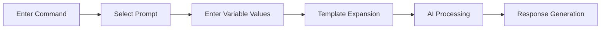

# Prompt Management (Prompts)

> Save frequently used question formats and instructions as templates and share them with your team. Prompt management lets you quickly get consistent, high-quality AI responses.



---

## What Are Prompts?

Prompts are templates for questions or instructions sent to AI.

<!-- Screenshot: Before and after comparison of prompt usage
     - Left: Regular question
     - Right: Using a prompt (more structured response)
     File: images/prompts-comparison.png
-->

### Benefits of Using Prompts

| Benefit | Description |
|---------|-------------|
| **Time Savings** | No need to type lengthy instructions every time |
| **Consistency** | Generate results in a uniform format |
| **Team Collaboration** | Share effective prompts with team members |
| **Quality Improvement** | Better responses from proven prompts |

---

## Prompt List

View all prompts under **Workspace > Prompts**.

<!-- Screenshot: Prompt list screen
     - Prompt cards listed
     - Command, title, description displayed
     File: images/prompts-list.png
-->

### Prompt Information

| Field | Description | Example |
|-------|-------------|---------|
| **Command** | Shortcut used to invoke the prompt | `/write-email` |
| **Title** | Prompt name | "Business Email Composer" |
| **Content** | Actual prompt template | "Please compose..." |

---

## Creating a Prompt

### Step 1: Create a New Prompt

Click the **"+ New Prompt"** button.

<!-- Screenshot: Prompt creation form
     File: images/prompts-create.png
-->

### Step 2: Enter Basic Information

| Field | Description | Example |
|-------|-------------|---------|
| **Command** | Shortcut command starting with `/` | `write-email` |
| **Title** | Prompt display name | "Business Email Composer" |

### Step 3: Write Prompt Content

Write the prompt template.

<!-- Screenshot: Prompt content editor
     File: images/prompts-editor.png
-->

**Basic Template Example:**

```markdown
Please write a professional business email based on the following information.

## Writing Rules
- Polite and professional tone
- Clear and concise sentences
- Include appropriate greeting and closing

## Email Details
- Recipient: [Recipient's title/name]
- Purpose: [Email purpose]
- Key content: [Content to convey]
```

### Using Variables

Use `{{variable_name}}` to accept dynamic values.

```markdown
Please write an email to {{recipient}} regarding {{purpose}}.

Content: {{content}}
```

**Usage:**
```
/write-email recipient=Mr. Johnson purpose=sharing project progress content=development expected to be completed this week
```

### Step 4: Save

Click the **"Save"** button.

---

## Using Prompts

### Method 1: `/` Command

Type `/` in the chat input to display the prompt list.

<!-- Screenshot: Prompt autocomplete after typing /
     File: images/prompts-autocomplete.png
-->

```
/write-email Request meeting schedule coordination with the client
```

### Method 2: @ Command

You can also invoke prompts with `@`.

```
@write-email Project delay notification email
```

### Method 3: Direct Selection

Click the **Prompt** button next to the input field to select.

<!-- Screenshot: Prompt selection button and popup
     File: images/prompts-select-button.png
-->

---

## Prompt Examples

### Email Composition

**Command:** `/email`

```markdown
Please write a professional business email based on the following information.

## Requirements
- Maintain a polite and professional tone
- Clearly convey the key message
- Include appropriate greeting and closing
- Specify next steps (Action Items) when necessary

## Email Content
{{content}}
```

**Usage:**
```
/email Request the client to reschedule next week's meeting to Tuesday at 2 PM
```

### Report Writing

**Command:** `/report`

```markdown
Please write a structured report on the following topic.

## Report Structure
1. Executive Summary
2. Current Status Analysis
3. Issues and Root Causes
4. Improvement Recommendations
5. Action Plan
6. Expected Outcomes

## Writing Rules
- Data-driven and evidence-based writing
- Concise and clear sentences
- Use of tables and charts recommended

## Topic
{{topic}}
```

### Meeting Minutes

**Command:** `/minutes`

```markdown
Please organize the following meeting content.

## Minutes Format
### Meeting Information
- Date/Time:
- Attendees:
- Agenda:

### Discussion Points
(Summary of key discussion items)

### Decisions Made
(Agreed-upon decisions)

### Action Items
| Assignee | Task | Deadline |
|----------|------|----------|

### Next Meeting
- Date/Time:
- Agenda:

## Meeting Content
{{content}}
```

### Code Review

**Command:** `/code-review`

```markdown
Please review the following code and suggest improvements.

## Review Criteria
1. **Readability**: Is the code easy to understand?
2. **Efficiency**: Are there opportunities for performance improvement?
3. **Security**: Are there any security vulnerabilities?
4. **Best Practices**: Does it follow conventions?
5. **Error Handling**: Are exceptions handled properly?

## Output Format
- Explain areas needing improvement with code references
- Provide corrected code examples
- Indicate priority (High/Medium/Low)

## Code
{{code}}
```

### Translation

**Command:** `/translate`

```markdown
Please translate the following text into {{target_lang}}.

## Translation Rules
- Preserve the meaning and nuance of the original
- Use natural expressions
- Handle technical terms appropriately
- Consider cultural context

## Source Text
{{text}}
```

### Summary

**Command:** `/summarize`

```markdown
Please summarize the following content.

## Summary Format
1. **One-line Summary**: Core content in 1 sentence
2. **Key Points**: 3-5 bullet points
3. **Detailed Summary**: Approximately 200 words

## Content
{{content}}
```

### Data Analysis

**Command:** `/analyze`

```markdown
Please analyze the following data and derive insights.

## Analysis Perspectives
1. Current status assessment
2. Trend/pattern discovery
3. Outlier identification
4. Root cause analysis
5. Action item recommendations

## Output Format
- Key findings (bullet points)
- Visualization suggestions (if applicable)
- Additional analysis recommendations

## Data
{{data}}
```

---

## Prompt Management

### Editing

Click the **Edit** button in the prompt list.

<!-- Screenshot: Prompt edit screen
     File: images/prompts-edit.png
-->

### Cloning

Copy an existing prompt to create a new version.

1. Click **"Clone"** from the prompt menu
2. Modify the command and content
3. Save

### Export/Import

You can export and import prompts as JSON files.

<!-- Screenshot: Export/Import buttons
     File: images/prompts-export.png
-->

**Use Cases:**
- Share prompts with team members
- Backup and restore
- Migrate to another environment

### Deleting

Delete prompts that are no longer needed.

---

## Tips for Writing Effective Prompts

### 1. Define a Role

Assign a clear role to the AI.

```markdown
You are a marketing expert with 10 years of experience.
```

### 2. Give Specific Instructions

Describe the desired output in detail.

```markdown
## Requirements
- Write approximately 500 words
- Professional yet friendly tone
- Include 3 key messages
```

### 3. Specify Output Format

Explicitly state the desired format.

```markdown
## Output Format
| Field | Content |
|-------|---------|
| Title | ... |
| Body  | ... |
```

### 4. Provide Examples

Show examples of the desired output.

```markdown
## Example
Input: "Project meeting"
Output: "Project A Phase 2 Progress Update Meeting"
```

### 5. State Constraints

Specify what to avoid.

```markdown
## Restrictions
- Minimize technical jargon
- No profanity
- No personal information
```

---

## Sharing Team Prompts

### Public Prompts

Prompts created by administrators are available to all users.

<!-- Screenshot: Public prompt display (distinguished by icon)
     File: images/prompts-public.png
-->

### Access Permission Settings

You can make prompts available only to specific groups or organizations.

| Option | Description |
|--------|-------------|
| **Public** | All users |
| **Group-specific** | Specific groups only |
| **Private** | Creator only |

---

## FAQ

**Q: Can I include files in a prompt?**
> You cannot include files in the prompt itself, but you can attach files when using the prompt.

**Q: Can I edit someone else's prompt?**
> No, you need to clone someone else's prompt to create your own version.

**Q: Can I use any language for prompt commands?**
> Yes, you can use commands in any language such as `/email`, `/report`, etc.

---

## Next Steps

- [Leverage prompts in agents](./agents.md)
- [Improve answer quality with knowledge bases](./knowledge.md)
- [Use advanced chat features](../chat.md)
