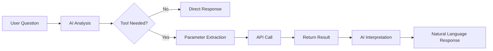

# Tool Connections (Tools)

> Connect external systems and APIs to your AI to enable real-time data retrieval, task automation, and system integration. Tool connections let you extend AI capabilities infinitely.



---

## What Are Tool Connections?

Tool connections allow AI to call functions from external systems.

<!-- Screenshot: Tool connection concept diagram
     - AI <-> Tool Connection <-> External Systems (CRM, ERP, APIs, etc.)
     Filename: images/tools-concept.png
-->

### Usage Examples

| Connection Target | What You Can Do |
|-------------------|-----------------|
| **CRM System** | Look up customer information, create sales opportunities |
| **Ticket System** | Create issues, update status |
| **HR System** | Submit leave requests, look up employee information |
| **Weather API** | Provide real-time weather information |
| **Stock API** | Look up real-time stock prices |

### Supported Protocols

| Protocol | Description | Use Case |
|----------|-------------|----------|
| **OpenAPI** | REST API standard spec | Most web services |
| **MCP** | Model Context Protocol | AI-specific tool servers |

---

## Tool List

View all tool connections under **Workspace > Tools**.

<!-- Screenshot: Tool list screen
     - Connected tools displayed as cards
     - Connection status indicators (green/red)
     Filename: images/tools-list.png
-->

### Connection Status

| Status | Icon | Meaning |
|--------|------|---------|
| **Connected** | 🟢 | Operating normally |
| **Connection Failed** | 🔴 | No server response |
| **Authentication Expired** | 🟡 | Re-authentication required |

---

## OpenAPI Tool Connection

### What Is OpenAPI?

OpenAPI (formerly Swagger) is a spec that defines REST APIs in a standardized format.
Most modern API services provide an OpenAPI spec.

### Connection Method

#### Step 1: Create a New Tool

Click the **"+ New Tool"** button.

<!-- Screenshot: Tool creation form
     Filename: images/tools-create.png
-->

| Field | Description | Example |
|-------|-------------|---------|
| **Name** | Tool display name | "Customer Management API" |
| **Description** | Tool purpose description | "CRM system integration" |

#### Step 2: Enter OpenAPI Spec URL

Enter the URL of the OpenAPI JSON/YAML file.

<!-- Screenshot: OpenAPI URL input field
     Filename: images/tools-openapi-url.png
-->

**URL examples:**
```
https://api.example.com/openapi.json
https://petstore.swagger.io/v2/swagger.json
```

#### Step 3: Configure Authentication

Set up the API authentication method.

<!-- Screenshot: Authentication settings options
     Filename: images/tools-auth-config.png
-->

| Auth Method | Configuration |
|-------------|---------------|
| **API Key** | Header name + API key value |
| **Bearer Token** | Token value |
| **Basic Auth** | Username + password |
| **OAuth 2.0** | Client ID/Secret |

#### Step 4: Test Connection

Click the **"Test Connection"** button to verify the connection status.

<!-- Screenshot: Successful connection test screen
     Filename: images/tools-test-success.png
-->

#### Step 5: Review Available Functions

On successful connection, a list of available API endpoints is displayed.

<!-- Screenshot: API function list
     - Each function's name, description, parameters
     Filename: images/tools-functions-list.png
-->

**Displayed information:**
- Function name
- Description
- Required parameters
- Return data format

#### Step 6: Set Access Permissions

<!-- Screenshot: Tool access permission settings
     Filename: images/tools-access-control.png
-->

---

## MCP Tool Connection

### What Is MCP?

MCP (Model Context Protocol) is a protocol for communication between AI models and external tools.
It supports safer and more efficient AI tool integration.

### MCP Connection Setup

#### Step 1: Enter MCP Server Information

<!-- Screenshot: MCP connection settings form
     Filename: images/tools-mcp-config.png
-->

| Field | Description |
|-------|-------------|
| **Server URL** | MCP server address |
| **Environment Variables** | Required environment settings |

#### Step 2: Verify Connection

<!-- Screenshot: MCP connection success and tool list
     Filename: images/tools-mcp-connected.png
-->

### MCP Tool Authentication — OAuth / SSO (1.0.3)

In addition to the existing auth modes (`None` / `Bearer Token` / `API Key`), MCP tool connections now support **OAuth 2.0 (User SSO)**. Authentication is separated into a single OAuth option plus a provider field, so the admin picks the auth method and provider independently in the tool connection form.

<!-- Screenshot: MCP auth type dropdown (Provider field shown when OAuth 2.0 (User SSO) is selected)
     Filename: images/tools-mcp-oauth.png
-->

| Auth Type | Description |
|-----------|-------------|
| **None** | No authentication |
| **Bearer Token** | A single token is injected into the Authorization header |
| **API Key** | A single key paired with a header name |
| **OAuth 2.0 (User SSO)** | The SSO token the user obtained when signing in to Cloosphere is passed straight to the MCP server |

Selecting OAuth 2.0 (User SSO) reveals a **Provider** dropdown:

| Provider | Token Used |
|----------|------------|
| **Microsoft** | Microsoft Graph delegated permissions (Mail / Calendar / Files / Contacts / Tasks / Notes, etc.) |
| **Google** | Google OAuth (Gmail / Drive / Calendar, etc.) |

- On every call, **the user's own SSO access token** is dynamically injected into the Authorization header.
- No key is stored on the connection itself — the tool only works for users who are signed in via the matching provider.
- Tokens close to expiry are automatically refreshed using the stored refresh_token.
- Users can review and disconnect their own SSO links from **Settings > Connections > Connected Accounts**.

> 💡 If an admin registers an external MCP server (e.g. `ms-365-mcp`) as a tool connection, internal mail / calendar / document tools can be exposed safely on a per-user SSO basis — no shared keys required.

### MCP Tool Whitelist (1.0.3)

You can now choose **which of the tools exposed by an MCP server are visible to users**. This is a governance lever that prevents unintended tools from leaking to the LLM.

<!-- Screenshot: Tool detail page Available Functions panel with per-tool checkbox toggles
     Filename: images/tools-mcp-whitelist.png
-->

- **Auto fetch** — After registering the server, clicking `Test Connection` lists the discovered tools in the **Available Functions** panel.
- **Checkbox toggle** — Click each tool row to enable / disable it. Disabled tools are not exposed to the LLM, so agents cannot invoke them.
- **Storage** — The whitelist is persisted as `connection.enabled_tools`. **An empty array means "all enabled"** (it is normalized to that form whenever every tool is checked).
- **Example** — When registering a mail MCP server, enable only the read-side tools and disable send / delete to keep tighter authorization boundaries.

---

## Using Tools

### Connecting to an Agent

When a tool is connected to an agent, the AI automatically calls the tool at the appropriate time.

<!-- Screenshot: Tool connection in agent settings
     Filename: images/tools-agent-connect.png
-->

### Using in Chat

```
User: Look up customer ID 12345's information

AI: [Calling CRM API...]

Here is the customer information:

| Field | Value |
|-------|-------|
| Name | John Smith |
| Email | john@example.com |
| Tier | VIP |
| Last Purchase | 2024-01-15 |

Would you like to check any additional information?
```

<!-- Screenshot: Chat with tool call results displayed
     Filename: images/tools-in-chat.png
-->

### Tool Call Process

<!-- Screenshot: Tool call process visualization
     1. User question
     2. AI determines tool necessity
     3. Tool call
     4. Result returned
     5. AI interprets result and responds
     Filename: images/tools-flow.png
-->

When multiple tool servers are connected to an agent, the AI selects tools in two stages:

1. **Server Discovery**: Reviews the list of connected tool servers and their capabilities
2. **Tool Selection**: Selects the appropriate server for the question and retrieves its available tools
3. **Parameter Extraction**: Extracts required values from the question
4. **Tool Execution**: Calls the selected tool and receives the result
5. **Result Interpretation**: Converts the response to natural language

> 💡 Even with many tool servers connected, the AI first identifies the server list, then selectively invokes only the needed tools — avoiding unnecessary API calls.

---

## Workspace Common Features

> All workspace items, including tools, agents, prompts, knowledge bases, databases, glossaries, and guardrails, share the following common features. For full details, see [Workspace Common Features in the Agents documentation](./agents.md#workspace-common-features).

- **Tag System**: Add tags to items for categorization and filtering
- **Tag Management Page**: Bulk tag management (rename, delete, view usage)
- **Clone/Export/Import**: Clone items, export/import as JSON
- **My Items / All Filter Chips**: Filter the list to show only items you created
- **Agent Usage Check on Resource Deletion**: Confirmation when deleting resources connected to agents
- **Write Permission Control**: Save button disabled and New button hidden when write permission is absent
- **Unified Edit Page Header Buttons**: Consistent layout with Save, more menu, etc.

---

## Tool Management

### Edit

Modify tool settings.

<!-- Screenshot: Tool edit screen
     Filename: images/tools-edit.png
-->

### Clone

Copy an existing tool to create a new one.

### Export/Import

You can export and import tool settings as JSON.

**Use cases:**
- Share tool configurations across teams
- Migrate between environments
- Backup

### Delete

Delete tools that are no longer in use.

> **Warning:** When deleting a tool, if the tool is connected to any agents, the delete confirmation dialog will display the list of connected agents. Check the connection status before deleting.

---

## Sharing Permission Model (1.0.2)

Tool sharing follows the same `access_control` model as other workspace resources (Glossary, KB, etc.) — **two tiers, read and write**. In 1.0.2 the UI is made **consistent with that policy** end-to-end.

<!-- Screenshot: Tool card / detail page showing button visibility for read shares, write shares, and owner
     Filename: images/tools-share-permissions.png
-->

| Permission | UI Behavior |
|------------|-------------|
| **Owner / admin** | All menus visible (edit, delete, more menu) |
| **Write share** | Card more-menu and edit / delete visible (passes `canManageTool()`) |
| **Read share** | Clicking the card **opens the detail page**, but edit / save / delete / shift+delete are all disabled |

### Simplified Card Click Guard

If a tool appears in the list response, that already means the backend read check passed — so the **card click always opens the detail page**. The `canWrite` guard inside the detail page safely disables editing / saving / deletion controls.

### Edit Route Fix

The non-existent `/workspace/tools/edit?id=X` route is replaced everywhere with the real edit page `/workspace/tools/{id}` (`ToolDetail.svelte`).

---

## Operations Notes

### `stream=false` Requests Now Route Through UnifiedAgent (1.0.2)

Chat-completion requests with `stream=false` are routed through the **UnifiedAgent** in 1.0.2, the same as streaming requests. Previously some external integrations (synchronous SDK callers, for example) skipped tool activation under non-streaming mode; now tools, guardrails, and tracing apply consistently across all call paths.

---

## Security Considerations

### Secure Tool Connections

Cloosphere's tool connections provide enterprise-grade security.

<!-- Screenshot: Security settings options
     Filename: images/tools-security.png
-->

| Security Feature | Description |
|-----------------|-------------|
| **Encrypted Communication** | All API calls are TLS encrypted |
| **Credential Protection** | API keys stored encrypted |
| **Access Control** | Tool usage restricted by permissions |
| **Audit Logs** | All tool calls are logged |

### API Key Management

- API keys are securely stored with encryption
- Keys cannot be viewed again after initial entry
- Regular key rotation is recommended

### Network Security

- Only connect to APIs within a private network when possible
- Set up IP whitelisting as needed
- Utilize VPN/Private Endpoints

---

## Use Cases

### Case 1: CRM Integration

**Connection:** Salesforce API

**Usage:**
```
User: Show me this month's new customers

AI: Here are this month's new customers:

| Customer | Industry | Contract Date | Account Manager |
|----------|----------|---------------|-----------------|
| Company A | IT | 2024-01-05 | Alice Johnson |
| Company B | Manufacturing | 2024-01-12 | Bob Williams |
| Company C | Finance | 2024-01-20 | Carol Davis |

A total of 3 companies signed new contracts this month.
```

### Case 2: Ticket System Integration

**Connection:** Jira API

**Usage:**
```
User: Show me the high-priority unresolved issues in Project A

AI: Here are the high-priority unresolved issues in Project A:

1. **PROJ-123**: Fix login error
   - Assigned to: Dev Team - Alice
   - Due: 2024-01-25

2. **PROJ-145**: Improve payment module performance
   - Assigned to: Dev Team - Bob
   - Due: 2024-01-28

Would you like to update the issue status?
```

### Case 3: Data Retrieval

**Connection:** Internal Data API

**Usage:**
```
User: Show me last week's daily revenue trend

AI: Here is last week's daily revenue trend:

Daily Revenue (in thousands)
Mon: ████████ 45
Tue: ██████████ 52
Wed: ███████████ 58
Thu: █████████ 48
Fri: ████████████ 62

Average: $53K
Week over week: +8.2% increase
```

### Case 4: Weather Information

**Connection:** Weather API

**Usage:**
```
User: What is the weather like tomorrow in New York?

AI: Here is tomorrow's weather for New York:

Sunny
High 59°F / Low 37°F
Wind: Northwest 7 mph
Humidity: 45%

Great weather for going out. However, mornings and evenings will be chilly,
so it is a good idea to bring a jacket.
```

---

## Direct Connections (For Users)

If allowed by the administrator, individual users can connect their own tools.

<!-- Screenshot: User Settings > Tools > Connections
     Filename: images/tools-user-connection.png
-->

**Settings location:** Settings > Tools > Connections

**Limitations:**
- Available to the owner only
- May require administrator approval

---

## Troubleshooting

### Connection Failures

| Cause | Solution |
|-------|----------|
| URL error | Verify the OpenAPI spec URL |
| Authentication failure | Re-check the API key/token |
| Network | Check firewall/proxy settings |
| CORS | Check server-side CORS configuration |

### API Call Failures

| Cause | Solution |
|-------|----------|
| Insufficient permissions | Verify API permissions |
| Rate Limit | Reduce call frequency |
| Server error | Check external service status |

---

## FAQ

**Q: Can I connect any API?**
> Any API that provides an OpenAPI (Swagger) spec can be connected. If no spec is available, you will need to build an MCP server.

**Q: Are there costs for API calls?**
> The billing policy of the external service applies when using external APIs. There are no additional charges from Cloosphere itself.

**Q: Is sensitive data safe?**
> All communication is encrypted, and credentials are stored securely. You can also configure fine-grained access permissions.

---

## Next Steps

- [Connect Tools to an Agent](./agents.md)
- [Connect a Database Directly](./database.md)
- [Use the Glossary](./glossary.md)
