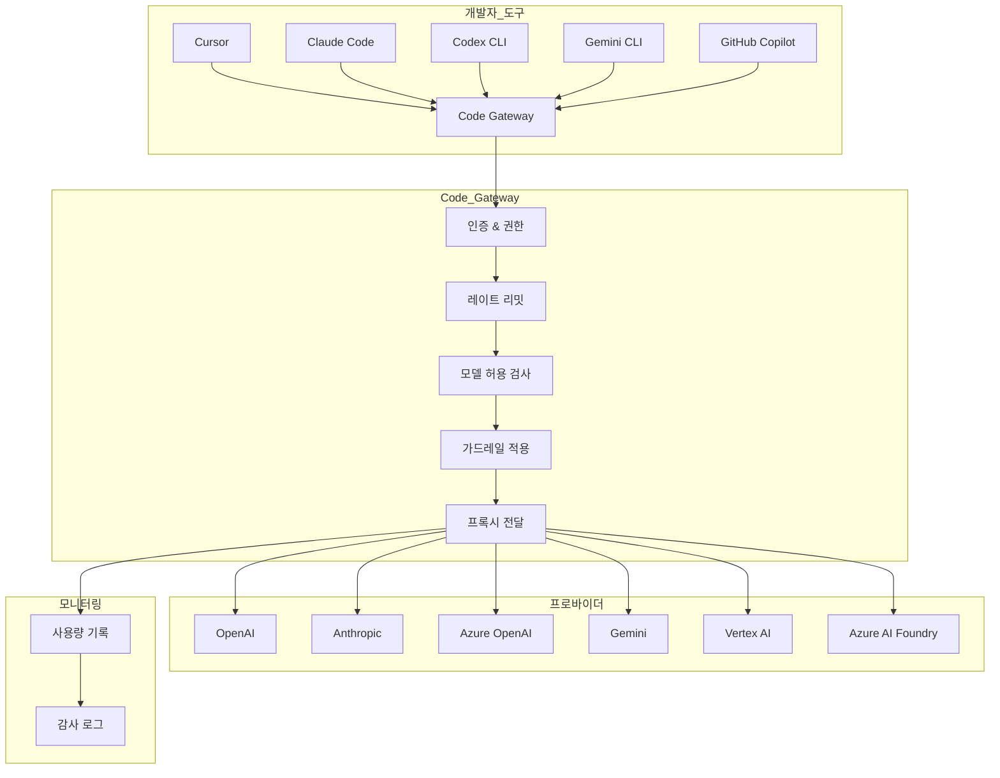
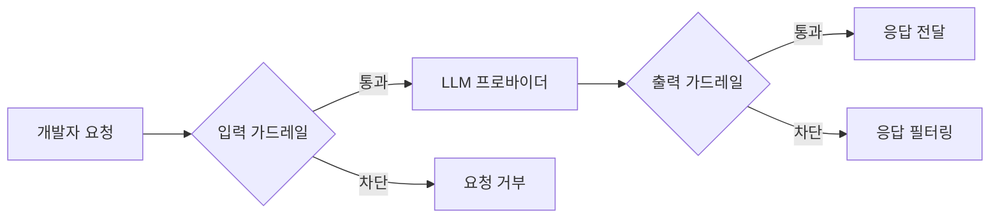

# Code Gateway

> AI 코딩 도구(Cursor, Claude Code, Codex CLI, Gemini CLI, GitHub Copilot)를 위한 엔터프라이즈 프록시 게이트웨이입니다. 개발자들이 사용하는 AI 코딩 도구의 API 요청을 Cloosphere를 통해 중앙에서 관리하고, 가드레일/사용량 추적/감사 로그를 적용할 수 있습니다.



---

## 개요

Code Gateway는 AI 코딩 도구의 LLM API 요청을 Cloosphere를 통해 프록시하는 기능입니다. 개발자는 기존 도구(Cursor, Claude Code 등)의 API 엔드포인트를 Cloosphere로 지정하고 Cloosphere API 키를 사용하면, 관리자가 설정한 정책이 자동으로 적용됩니다.

### 주요 기능

| 기능 | 설명 |
|------|------|
| **중앙 집중 관리** | 여러 AI 프로바이더를 하나의 게이트웨이로 통합 |
| **가드레일** | PII 감지, 콘텐츠 필터 등 입력/출력 보안 검사 |
| **사용량 추적** | 사용자별/모델별/프로바이더별 토큰 사용량 기록 |
| **레이트 리밋** | 사용자당 분당 요청 수 제한 |
| **모델 제어** | 허용 모델 목록으로 접근 제한 |
| **리포지토리 추적** | Git 리포지토리 메타데이터 수집을 통한 감사 |
| **차단 정책** | 특정 리포지토리, 파일 패턴 차단 |

### 지원 프로바이더

| 프로바이더 유형 | 설명 | 인증 방식 |
|----------------|------|-----------|
| **OpenAI** | OpenAI API 및 호환 엔드포인트 | Bearer 토큰 |
| **Anthropic** | Anthropic API (Claude) | x-api-key 헤더 |
| **Azure OpenAI** | Azure OpenAI Service | api-key 헤더 |
| **Gemini** | Google Gemini API | API 키 (쿼리 파라미터) |
| **Vertex AI** | Vertex AI (서비스 계정 인증) | GCP OAuth2 |
| **Azure AI Foundry** | Azure AI Foundry | Bearer 토큰 |

---

## 관리자 설정

**관리자 > 설정 > Code Gateway**에서 게이트웨이를 구성합니다.

<!-- 스크린샷: Code Gateway 설정 메인 화면
     파일명: images/admin-code-gateway-main.png
-->

### Code Gateway 활성화

1. **Code Gateway 활성화** 토글을 켭니다.
2. 활성화 후 프로바이더를 추가하고 정책을 설정할 수 있습니다.

> **참고:** Code Gateway는 `features.code_gateway` 권한이 있는 사용자만 사용할 수 있습니다. 관리자는 항상 접근 가능합니다.

### 프로바이더 추가

프로바이더는 실제 LLM API 엔드포인트를 의미합니다. 여러 프로바이더를 동시에 등록할 수 있습니다.

<!-- 스크린샷: 프로바이더 추가 화면
     파일명: images/admin-code-gateway-provider.png
-->

**프로바이더 설정 항목:**

| 설정 | 설명 | 필수 |
|------|------|------|
| **프로바이더 ID** | 고유 식별자 (URL 경로에 사용됨, 예: `my-openai`) | 예 |
| **유형** | `openai`, `anthropic`, `azure_openai`, `gemini`, `vertex_ai`, `azure_ai_foundry` | 예 |
| **활성화** | 프로바이더 활성화/비활성화 | 예 |
| **API URL** | 프로바이더 API 엔드포인트 URL | 예 (Vertex AI 제외) |
| **API Key** | 프로바이더 인증 키 | 예 (Vertex AI 제외) |
| **API Version** | API 버전 (Azure OpenAI 전용) | Azure만 |
| **모델 ID 목록** | 이 프로바이더에서 허용할 모델 목록 (빈 값 = 전체 허용) | 아니오 |
| **Deployment Map** | 모델명-배포명 매핑 (Azure OpenAI 전용) | 아니오 |

#### OpenAI / OpenAI 호환 프로바이더

```
유형: openai
API URL: https://api.openai.com/v1
API Key: sk-...
```

#### Anthropic

```
유형: anthropic
API URL: https://api.anthropic.com
API Key: sk-ant-...
```

#### Azure OpenAI

```
유형: azure_openai
API URL: https://{리소스명}.openai.azure.com/
API Key: Azure에서 발급된 키
API Version: 2024-12-01-preview
```

> **참고:** Azure OpenAI에서 Deployment Map을 설정하면 모델명을 배포명으로 자동 매핑합니다. 예: `{"gpt-4o": "my-gpt4o-deployment"}`

#### Gemini

```
유형: gemini
API URL: https://generativelanguage.googleapis.com
API Key: Google AI Studio에서 발급된 키
```

#### Vertex AI

Vertex AI는 GCP 서비스 계정을 사용하여 인증합니다.

| 설정 | 설명 |
|------|------|
| **Project ID** | GCP 프로젝트 ID |
| **Location** | 리전 (기본: `us-central1`, `global` 지원) |
| **Service Account Key** | GCP 서비스 계정 JSON 키 |
| **글로벌 GCP 키 사용** | 시스템 전역 GCP 키 폴백 |

#### Azure AI Foundry

```
유형: azure_ai_foundry
API URL: https://{프로젝트명}.{리전}.models.ai.azure.com/
API Key: AI Foundry에서 발급된 키
```

### 가드레일 설정

Code Gateway를 통과하는 요청에 가드레일을 적용하여 보안을 강화할 수 있습니다.

<!-- 스크린샷: 가드레일 설정 섹션
     파일명: images/admin-code-gateway-guardrails.png
-->

| 설정 | 설명 |
|------|------|
| **글로벌 가드레일 따르기** | 시스템 전역 가드레일 설정을 Code Gateway에도 적용 |
| **추가 가드레일** | Code Gateway 전용으로 추가 가드레일 선택 |

가드레일이 활성화되면:
- **입력 가드레일**: 개발자가 보내는 프롬프트에서 PII, 민감 정보 등을 검사
- **출력 가드레일**: LLM 응답에서 부적절한 콘텐츠를 필터링 (스트리밍 자동 비활성화 후 검사)

### 레이트 리밋

사용자당 분당 요청 수를 제한합니다.

| 설정 | 설명 | 기본값 |
|------|------|--------|
| **레이트 리밋** | 사용자당 분당 최대 요청 수 (0 = 무제한) | 0 |

> **참고:** 레이트 리밋은 인메모리로 관리되며, 서버 재시작 시 리셋됩니다.

### 허용 모델

전역 수준에서 사용 가능한 모델을 제한합니다.

| 설정 | 설명 |
|------|------|
| **허용 모델** | 사용 가능한 모델 ID 목록 (빈 값 = 전체 허용) |

> 프로바이더별 모델 제한은 프로바이더 설정의 **모델 ID 목록**에서 별도로 관리됩니다. 전역 허용 모델과 프로바이더별 허용 모델이 모두 적용됩니다.

### 차단 파일 패턴

특정 파일 패턴이 포함된 요청을 차단하거나 경고할 수 있습니다.

| 설정 | 설명 |
|------|------|
| **차단 파일 패턴** | 차단할 파일 경로 패턴 목록 (glob 형식) |
| **차단 액션** | `block` (요청 차단) 또는 `warn` (경고만 기록) |

**예시 패턴:**
- `*.env` -- 환경 변수 파일
- `*credentials*` -- 인증 정보 파일
- `*.pem` -- 인증서 파일

### 차단 리포지토리 및 메타데이터 요구

특정 Git 리포지토리에서의 요청을 차단하거나, 리포지토리 메타데이터 제공을 필수로 요구할 수 있습니다.

| 설정 | 설명 |
|------|------|
| **차단 리포지토리** | 차단할 Git 리포지토리 URL 패턴 목록 |
| **리포지토리 메타데이터 필수** | 리포지토리 메타데이터 제공을 요구 |
| **메타데이터 누락 액션** | `allow` (허용), `warn` (경고), `block` (차단) |

---

## 클라이언트 설정

개발자는 자신의 AI 코딩 도구를 Code Gateway에 연결하기 위해 아래 정보가 필요합니다:

- **게이트웨이 URL**: `{CLOOSPHERE_URL}/api/v1/code-gateway/{프로바이더_ID}`
- **API 키**: Cloosphere에서 발급된 개인 API 키 (**관리자 > 설정 > 일반**에서 API 키 활성화 필요)

### Cursor 설정

Cursor는 OpenAI 호환 API를 사용합니다.

**설정 방법:**

1. Cursor의 **Settings > Models** 메뉴를 엽니다.
2. **OpenAI API Key**에 Cloosphere API 키를 입력합니다.
3. **Override OpenAI Base URL**에 게이트웨이 URL을 입력합니다:
   ```
   {CLOOSPHERE_URL}/api/v1/code-gateway/{프로바이더_ID}/v1
   ```
4. 사용할 모델을 선택합니다.

<!-- 스크린샷: Cursor 설정 화면
     파일명: images/code-gateway-cursor-settings.png
-->

#### Cursor Hook (메타데이터 수집)

Cursor Hook을 설치하면 Git 리포지토리 정보(원격 URL, 브랜치)가 자동으로 수집되어 감사 로그에 기록됩니다.

**자동 설치 (권장):**

```bash
# 셋업 스크립트 다운로드 및 실행
curl -s {CLOOSPHERE_URL}/api/v1/code-gateway/cursor-setup-script | bash
```

**PowerShell:**
```powershell
Invoke-Expression (Invoke-WebRequest -Uri "{CLOOSPHERE_URL}/api/v1/code-gateway/cursor-setup-script?os=powershell").Content
```

**수동 설치:**

1. `~/.cursor/hooks/cloosphere-meta.sh` 파일을 생성합니다.
2. `~/.cursor/hooks.json`에 hook 이벤트를 등록합니다:

```json
{
  "version": 1,
  "hooks": {
    "sessionStart": [
      { "command": "hooks/cloosphere-meta.sh", "type": "command", "timeout": 5 }
    ],
    "beforeSubmitPrompt": [
      { "command": "hooks/cloosphere-meta.sh", "type": "command", "timeout": 5 }
    ],
    "postToolUse": [
      { "command": "hooks/cloosphere-meta.sh", "type": "command", "timeout": 5 }
    ]
  }
}
```

Hook은 `sessionStart`, `beforeSubmitPrompt`, `postToolUse` 이벤트에서 Git 리포지토리 메타데이터를 수집합니다.

**제거:**
```bash
curl -s {CLOOSPHERE_URL}/api/v1/code-gateway/cursor-uninstall-script | bash
```

### Claude Code 설정

Claude Code는 Anthropic API를 사용합니다.

**자동 설치 (권장):**

```bash
export CLOOSPHERE_API_KEY="<Cloosphere API 키>"
export CLOOSPHERE_GATEWAY_URL="{CLOOSPHERE_URL}/api/v1/code-gateway/{프로바이더_ID}"

# 셋업 스크립트 다운로드 및 실행
curl -s {CLOOSPHERE_URL}/api/v1/code-gateway/setup-script | bash
```

**PowerShell:**
```powershell
$env:CLOOSPHERE_API_KEY = "<Cloosphere API 키>"
$env:CLOOSPHERE_GATEWAY_URL = "{CLOOSPHERE_URL}/api/v1/code-gateway/{프로바이더_ID}"

Invoke-Expression (Invoke-WebRequest -Uri "{CLOOSPHERE_URL}/api/v1/code-gateway/setup-script?os=powershell").Content
```

셋업 스크립트는 다음 작업을 수행합니다:
1. 헬퍼 스크립트 설치 (`~/cloosphere-helper.sh`) -- Git 메타데이터를 API 키에 자동 첨부
2. `~/.claude/settings.json` 구성 -- `ANTHROPIC_BASE_URL`과 `apiKeyHelper` 설정

**수동 설정:**

`~/.claude/settings.json`에 다음을 추가합니다:

```json
{
  "env": {
    "CLOOSPHERE_API_KEY": "<Cloosphere API 키>",
    "ANTHROPIC_BASE_URL": "{CLOOSPHERE_URL}/api/v1/code-gateway/{프로바이더_ID}"
  },
  "apiKeyHelper": "/home/사용자/cloosphere-helper.sh"
}
```

**제거:**
```bash
curl -s {CLOOSPHERE_URL}/api/v1/code-gateway/claude-uninstall-script | bash
```

### Codex CLI 설정

Codex CLI는 OpenAI Responses API를 사용합니다.

**자동 설치 (권장):**

```bash
export CLOOSPHERE_API_KEY="<Cloosphere API 키>"
export CLOOSPHERE_GATEWAY_URL="{CLOOSPHERE_URL}/api/v1/code-gateway/{프로바이더_ID}"

# 셋업 스크립트 다운로드 및 실행
curl -s {CLOOSPHERE_URL}/api/v1/code-gateway/codex-setup-script | bash
```

셋업 스크립트는 다음 작업을 수행합니다:
1. 메타데이터 헬퍼 스크립트 설치 (`~/cloosphere-codex-meta.sh`)
2. `~/.codex/config.toml`에 Cloosphere 프로바이더 추가
3. 셸 프로필에 `codex` wrapper 함수 추가 (자동 메타데이터 수집)

**수동 설정:**

`~/.codex/config.toml`에 다음을 추가합니다:

```toml
model = "gpt-5.3-codex"
model_provider = "cloosphere"

[model_providers.cloosphere]
name = "Cloosphere Gateway"
base_url = "{CLOOSPHERE_URL}/api/v1/code-gateway/{프로바이더_ID}/v1"
env_key = "CLOOSPHERE_API_KEY"
env_http_headers = { "X-Cloosphere-Meta" = "CLOOSPHERE_META" }
```

환경 변수를 설정합니다:
```bash
export CLOOSPHERE_API_KEY="<Cloosphere API 키>"
```

**제거:**
```bash
curl -s {CLOOSPHERE_URL}/api/v1/code-gateway/codex-uninstall-script | bash
```

### Gemini CLI 설정

Gemini CLI는 Google Gemini API를 사용합니다.

**자동 설치 (권장):**

```bash
export CLOOSPHERE_API_KEY="<Cloosphere API 키>"
export CLOOSPHERE_GATEWAY_URL="{CLOOSPHERE_URL}/api/v1/code-gateway/{프로바이더_ID}"

# 셋업 스크립트 다운로드 및 실행
curl -s {CLOOSPHERE_URL}/api/v1/code-gateway/gemini-setup-script | bash
```

셋업 스크립트는 다음 작업을 수행합니다:
1. Hook 스크립트 설치 (`~/.gemini/hooks/cloosphere-meta.sh`)
2. `~/.gemini/settings.json`에 hook 이벤트 등록 (`SessionStart`, `BeforeAgent`)
3. 셸 프로필에 `GEMINI_API_KEY` 및 `GOOGLE_GEMINI_BASE_URL` 환경 변수 추가

**수동 설정:**

환경 변수를 설정합니다:
```bash
export GEMINI_API_KEY="<Cloosphere API 키>"
export GOOGLE_GEMINI_BASE_URL="{CLOOSPHERE_URL}/api/v1/code-gateway/{프로바이더_ID}"
```

**제거:**
```bash
curl -s {CLOOSPHERE_URL}/api/v1/code-gateway/gemini-uninstall-script | bash
```

### GitHub Copilot 설정

GitHub Copilot은 OpenAI 호환 프로바이더를 통해 연결할 수 있습니다. IDE 설정에서 프록시 URL을 Code Gateway로 지정합니다.

---

## 사용량 추적 및 모니터링

Code Gateway를 통한 모든 API 요청은 자동으로 사용량이 기록됩니다.

### 사용량 로그

**관리자 > 모니터링 > 사용량**에서 Code Gateway 사용량을 확인할 수 있습니다.

<!-- 스크린샷: Code Gateway 사용량 로그
     파일명: images/admin-code-gateway-usage.png
-->

기록되는 정보:

| 항목 | 설명 |
|------|------|
| **사용자** | 요청을 보낸 사용자 |
| **모델** | 사용된 AI 모델 |
| **프로바이더** | 사용된 프로바이더 ID |
| **클라이언트** | 감지된 클라이언트 유형 (Cursor, Claude Code 등) |
| **토큰 수** | 입력/출력 토큰 사용량 |
| **리포지토리** | Git 리포지토리 URL (메타데이터 수집 시) |
| **브랜치** | Git 브랜치명 |
| **시간** | 요청 시각 |

### 사용량 통계 API

관리자는 API를 통해 통계를 조회할 수 있습니다:

```
GET /api/v1/code-gateway/usage-logs          -- 사용량 로그 목록
GET /api/v1/code-gateway/usage-logs/stats     -- 집계 통계
GET /api/v1/code-gateway/usage-logs/filters/models  -- 필터용 모델 목록
GET /api/v1/code-gateway/usage-logs/filters/users   -- 필터용 사용자 목록
```

### 감사 로그

Code Gateway 설정 변경은 감사 로그에 기록됩니다. **관리자 > 모니터링 > 감사 로그**에서 확인할 수 있습니다.

---

## 보안

### 인증 체계

Code Gateway는 다양한 인증 방식을 지원하여 각 AI 코딩 도구의 인증 방식에 대응합니다:

| 인증 방식 | 사용 도구 |
|-----------|-----------|
| `Authorization: Bearer {API키}` | Cursor, Codex CLI |
| `x-api-key: {API키}` | Claude Code |
| `x-goog-api-key: {API키}` | Gemini CLI |
| `key={API키}` (쿼리 파라미터) | 범용 |

### 가드레일 보안 흐름



가드레일이 적용되면:
- **입력**: 프롬프트에서 PII(개인식별정보), 민감 데이터, 부적절한 콘텐츠를 검사합니다.
- **출력**: LLM 응답에 대해 동일한 검사를 수행합니다. 출력 가드레일이 활성화된 경우 스트리밍 응답도 전체 응답을 버퍼링한 후 검사합니다.

### 리포지토리 메타데이터 수집

Hook/헬퍼 스크립트를 통해 수집되는 메타데이터:

| 항목 | 설명 |
|------|------|
| **repo_url** | Git 원격 리포지토리 URL |
| **repo_urls** | 여러 리모트가 있는 경우 전체 URL 목록 |
| **branch** | 현재 작업 브랜치 |
| **working_dir** | 현재 작업 디렉토리 (Claude Code/Codex CLI) |

메타데이터는 다음 방식으로 전달됩니다:
1. **토큰 인코딩**: `{API키}::{base64(JSON)}` 형식으로 API 키에 첨부
2. **X-Cloosphere-Meta 헤더**: base64 인코딩된 JSON (Codex CLI)
3. **메시지 내 태그**: `[CLOOSPHERE_REPO]` 태그 (Cursor Hook, Gemini Hook)

메타데이터는 프록시 과정에서 자동으로 추출 및 제거되어 upstream LLM에는 전달되지 않습니다.

---

## 문제 해결

| 문제 | 원인 | 해결 방법 |
|------|------|-----------|
| "Code Gateway is disabled" | 게이트웨이 비활성화 | 관리자 설정에서 Code Gateway 활성화 |
| "Code Gateway access not permitted" | 사용자 권한 부족 | `features.code_gateway` 권한 부여 |
| "Provider not found" | 잘못된 프로바이더 ID | URL의 프로바이더 ID 확인 |
| "Provider is disabled" | 프로바이더 비활성화 | 관리자 설정에서 프로바이더 활성화 |
| "Model not allowed" | 모델 허용 목록에 없음 | 허용 모델 목록에 모델 추가 |
| "Rate limit exceeded" | 분당 요청 수 초과 | 잠시 후 재시도 또는 레이트 리밋 상향 |
| 연결 실패 | 프로바이더 API URL/키 오류 | 프로바이더 설정 확인 |
