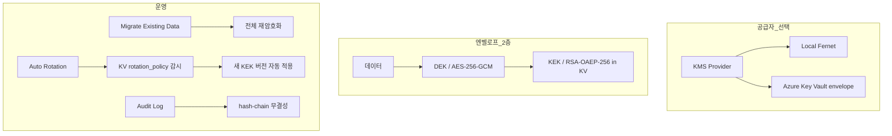

# 암호화 (KMS)

> 시스템 설정에 저장된 민감 데이터(API 키, 시크릿, 자격 증명, DbSphere 연결, 도구 연결 키 등)를 KMS(Key Management System) 로 안전하게 보호합니다. 로컬 Fernet 또는 Azure Key Vault 엔벨로프 암호화 중 환경에 맞는 공급자를 선택할 수 있습니다.



---

## 개요

Cloosphere 의 시스템 설정에는 외부 서비스 자격 증명, OAuth 시크릿, DB 연결 문자열 등 민감한 값이 다수 포함됩니다. 이 값들은 DB에 저장되기 전에 KMS 가 암호화하며, 암호화 키는 환경 변수가 아닌 KMS 공급자가 관리합니다.

엔벨로프 암호화는 2층 구조입니다.

| 계층 | 역할 |
|------|------|
| **DEK (Data Encryption Key)** | 실제 데이터를 AES-256-GCM 으로 암호화하는 1회용 키 |
| **KEK (Key Encryption Key)** | DEK 자체를 RSA-OAEP-256 으로 wrap. KEK 는 절대 외부로 노출되지 않고 Key Vault 안에서만 사용됨 |

DEK 는 매번 새로 생성되어 데이터와 함께 저장되고, 복호화 시점에 KEK 가 unwrap 합니다. 이 구조 덕분에 KEK 를 회전해도 모든 데이터를 다시 암호화할 필요 없이 envelope 만 다시 wrap 하면 됩니다.

### 지원 공급자

| 공급자 | 설명 |
|--------|------|
| **로컬 (Fernet)** | `WEBUI_SECRET_KEY` 기반 자체 Fernet. 외부 의존성 없음. 기본값 |
| **Azure Key Vault (엔벨로프)** | AES-256-GCM 데이터 암호화 + RSA-OAEP-256 KEK in Azure Key Vault |

---

## 공급자 선택

**관리자 > 설정 > 암호화** 탭에서 공급자를 선택합니다.

<!-- 스크린샷: 암호화 탭 메인 화면 (공급자 선택)
     파일명: images/admin/encryption-provider.png
-->

| 항목 | 설명 |
|------|------|
| **KMS 공급자** | 로컬 (Fernet) 또는 Azure Key Vault (엔벨로프) |

> **참고:** 공급자를 전환해도 기존 데이터는 자동으로 마이그레이션되지 않습니다. 레거시 암호문은 fallback 으로 계속 복호화되며, 새 공급자로 즉시 재암호화하려면 아래 [데이터 마이그레이션](#데이터-마이그레이션) 을 실행합니다.

### 로컬 (Fernet)

`WEBUI_SECRET_KEY` 환경 변수를 키로 사용하는 자체 Fernet 암호화입니다. 별도 의존성이 없어 단일 인스턴스 또는 PoC 환경에 적합합니다.

> **주의:** `WEBUI_SECRET_KEY` 를 변경하면 기존 암호화된 값을 복호화할 수 없으므로, 운영 환경에서는 키 회전 또는 envelope 기반 공급자를 권장합니다.

### Azure Key Vault (엔벨로프)

엔터프라이즈 운영 환경 권장 공급자입니다. KEK 를 Azure Key Vault 가 보관하므로 키 자체가 애플리케이션 서버에 노출되지 않으며, RBAC 와 KV 감사 로그로 모든 암호화/복호화 호출을 추적할 수 있습니다.

---

## Azure Key Vault 설정

공급자를 **Azure Key Vault (엔벨로프)** 로 변경하면 추가 입력 폼이 표시됩니다.

<!-- 스크린샷: Azure Key Vault 설정 폼 (KEK URI, Service Principal)
     파일명: images/admin/encryption-azure-kv.png
-->

### KEK URI

| 필드 | 설명 |
|------|------|
| **KEK URI (기본 티어)** | 버전이 박힌 Key Vault 키 URI. 형식: `https://<vault>.vault.azure.net/keys/<name>/<version>`. Confidential 및 Internal 분류 데이터를 wrap |
| **Restricted KEK URI (선택)** | Restricted (PII, 금융) 분류 전용 KEK. 비워두면 기본 KEK 공유. 동일한 Service Principal 재사용 |

> **요건:** 서비스 주체(또는 fallback credential) 에 해당 vault 에 대한 **"Key Vault Crypto User"** 역할이 부여되어 있어야 wrap/unwrap 호출이 가능합니다.

### 서비스 주체 (선택)

Key Vault 가 Microsoft OAuth 앱과 다른 테넌트에 있을 때 전용 서비스 주체를 사용합니다.

| 필드 | 설명 |
|------|------|
| **테넌트 ID** | Azure AD Directory (tenant) ID |
| **클라이언트 ID** | 등록된 앱의 Application (client) ID |
| **클라이언트 시크릿** | 클라이언트 시크릿 값 (저장 시 마스킹 처리) |

세 필드를 비워두면 다음 순서로 자격 증명을 폴백합니다.

1. `MICROSOFT_CLIENT_ID` / `MICROSOFT_CLIENT_TENANT_ID` / `MICROSOFT_CLIENT_SECRET` 환경 변수
2. `DefaultAzureCredential` (Managed Identity, Azure CLI, 환경 변수 등)

### 연결 테스트 및 저장

| 동작 | 설명 |
|------|------|
| **연결 테스트** | 두 KEK 모두 health_check (encrypt-decrypt 라운드트립). 성공/실패 detail 표시 |
| **저장** | 저장 직전 자동으로 health_check 가 한 번 더 실행됨. 실패하면 config 변경이 적용되지 않음 — 잘못된 KEK URI 로 운영 설정을 덮어쓰는 사고 방지 |

저장이 성공하면 새 envelope 부터 새 KEK 로 wrap 됩니다. 기존 데이터는 이전 KEK 로 wrap 된 상태이므로, 즉시 새 KEK 로 통일하려면 [데이터 마이그레이션](#데이터-마이그레이션) 을 실행하세요. KEK URI 가 변경된 경우 저장 직후 자동으로 마이그레이션 다이얼로그가 표시됩니다.

---

## 데이터 마이그레이션

기존 평문 또는 레거시 Fernet 으로 암호화된 시크릿을 현재 설정된 공급자로 일괄 재암호화합니다.

<!-- 스크린샷: 데이터 마이그레이션 섹션과 결과 카드
     파일명: images/admin/encryption-migrate.png
-->

### 영향 범위

| 항목 | 설명 |
|------|------|
| **Config sensitive 경로** | `OPENAI_API_KEYS`, OAuth 시크릿, 알림 채널 자격 증명 등 PersistentConfig 의 민감 경로 |
| **DbSphere 연결** | 데이터베이스 비밀번호, 연결 문자열 |
| **도구 연결 키** | Tool connection 의 API 키 / 헤더 시크릿 |
| **사용자 API 키** | 사용자가 발급한 API 키 토큰 |
| **라이선스 토큰** | 등록된 라이선스 키 / 기능 키 |

### 멱등성

마이그레이션은 **멱등** 합니다. 이미 현재 공급자로 wrap 된 envelope 은 자동으로 skip 되고, 처리되지 않은 항목만 재암호화됩니다. 재실행해도 안전하므로 중간에 실패해도 다시 실행하면 됩니다.

실행 후 결과 카드에 scope 별 `Migrated / Skipped / Failed` 카운트가 표시됩니다. Failed 가 있으면 백엔드 로그에서 사유를 확인하세요.

---

## KEK 회전

운영 중 KEK 를 회전하는 두 가지 경로가 있습니다.

### 자동 회전

Azure Key Vault 의 `rotation_policy` 가 새 KEK 버전을 만들면, Cloosphere 스케줄러가 이를 감지해 모든 envelope 을 새 버전으로 재암호화합니다.

<!-- 스크린샷: 자동 회전 설정과 per-tier 결과 카드
     파일명: images/admin/encryption-auto-rotation.png
-->

| 설정 | 설명 |
|------|------|
| **자동 회전 활성화** | 기본 꺼짐. Dry-run 으로 검증 후 활성화 |
| **Dry-run 모드** | 실제 회전 없이 "would rotate" 결정만 감사 로그에 기록. 첫 활성화 시 권장 |
| **검사 간격 (시간)** | 최소 1. 스케줄러가 간격당 최대 1회 검사 (24 = 매일) |

### 수동 검사 / 결과 확인

| 버튼 | 동작 |
|------|------|
| **저장** | 자동 회전 설정 저장 |
| **Dry-run 검사** | 즉시 1회 dry-run 실행. 어떤 티어가 회전 대상인지만 감사 로그에 기록 |
| **지금 검사** | 즉시 1회 실제 회전 검사 실행. 새 KEK 버전이 있으면 envelope 재암호화 |

마지막 검사 시각과 per-tier 결과 카드가 표시됩니다.

| 상태 | 의미 |
|------|------|
| **최신 (Up to date)** | 현재 KEK 버전이 KV 최신 버전과 동일. 회전 불필요 |
| **회전 완료 (Rotated)** | 새 버전 발견 후 envelope 재암호화 완료 (`from_version → to_version` 표시) |
| **회전 예정 (Would rotate, dry-run)** | dry-run 에서 새 버전을 발견. 실제 회전은 하지 않음 |
| **오류 (Error)** | KV 조회/wrap 실패. 에러 사유 표시 |

### 수동 회전 (KEK 교체)

자동 회전이 아니라 KEK 자체를 다른 키로 교체하려면 [Azure Key Vault 설정](#azure-key-vault-설정) 에서 KEK URI 를 변경하고 저장합니다. 저장 직후 표시되는 **"새 KEK 로 envelope 을 마이그레이션할까요?"** 다이얼로그에서 **마이그레이션** 을 선택하면 모든 envelope 이 새 KEK 로 재암호화됩니다.

> **운영 메모:** 옛 KEK 가 KV 에서 disabled 상태라도 살아있어야 마이그레이션이 가능합니다. 옛 KEK 를 삭제(purge) 하기 전에 반드시 마이그레이션을 완료하세요.

---

## 분류별 KEK

데이터는 분류(classification) 에 따라 다른 KEK 로 wrap 할 수 있습니다.

| 분류 | wrap 사용 KEK |
|------|--------------|
| **Confidential / Internal** | 기본 KEK (`KEK URI (기본 티어)`) |
| **Restricted (PII, 금융)** | Restricted KEK URI (설정된 경우) — 미설정 시 기본 KEK 사용 |

별도 Restricted KEK 를 두면 다음 시나리오에 유리합니다.

- **Crypto-shred:** PII 데이터 폐기가 필요할 때 Restricted KEK 만 KV 에서 disable/delete 하면 PII envelope 만 복호화 불가능 상태가 됩니다. 다른 시크릿(연결, 도구 키 등) 은 영향을 받지 않음
- **권한 분리:** Restricted KEK 에만 별도 RBAC 를 부여해 PII 접근 권한을 별도 그룹으로 제한
- **컴플라이언스:** 분류 단위 키 분리 요구사항(GDPR, 금융 규제 등) 충족

---

## 감사 로그

모든 KMS 작업은 변조 감지용 hash-chain 으로 기록됩니다.

<!-- 스크린샷: 암호화 탭 하단 Audit Log quick status (최근 5개 + Verify Integrity)
     파일명: images/admin/encryption-audit-quick.png
-->

| 기록 작업 | 설명 |
|-----------|------|
| **wrap** | DEK 를 KEK 로 wrap |
| **unwrap** | wrap 된 DEK 를 KEK 로 unwrap |
| **rotate** | KEK 회전 (자동/수동) |
| **health_check** | 연결 테스트 또는 저장 사전 검증 |
| **provider_change** | KMS 공급자 변경 |
| **migrate** | 데이터 마이그레이션 실행 |
| **audit_export** | 감사 로그 CSV 내보내기 |

### Quick Status

암호화 탭 하단에는 **최근 5개 + 무결성 검증** 의 quick status 가 표시됩니다. 전체 필터링/페이지네이션/CSV 내보내기는 **모니터링 → KMS 감사** 탭의 풀 뷰어에서 사용합니다 (자세한 내용은 [모니터링 가이드](./monitoring.md) 의 KMS 감사 섹션 참조).

### 무결성 검증

**무결성 검증** 버튼을 클릭하면 chain 의 모든 행을 순차 검증합니다. 어떤 행이라도 변조되면 첫 단절 지점의 id 와 사유가 표시됩니다.

```
Chain OK (1234 rows checked)
Chain broken at id=42: hash mismatch
```

---

## 운영 메모

### 멀티워커 환경

| 항목 | 동작 |
|------|------|
| **설정 변경 전파** | KMS 설정 변경 시 Redis pub/sub 으로 모든 워커가 즉시 reload. 별도 재시작 불필요 |
| **자동 회전 스케줄러** | 단일 인스턴스에서만 실행 (분산 락 사용). 워커 수와 무관하게 회전이 중복 실행되지 않음 |

### KMS 자체 자격 증명 보호

`KMS_AZURE_CLIENT_SECRET` 같이 KMS 자체에 접근하기 위한 자격 증명은 **항상 로컬 Fernet 으로 암호화**됩니다. KMS 가 자기 자신의 시크릿을 unwrap 하려고 하면 부트스트랩 시점에 deadlock 이 발생하기 때문입니다. 이 동작은 자동이므로 운영자가 별도로 신경쓸 필요는 없습니다.

### KEK 폐기 시 주의

| 시나리오 | 권장 절차 |
|----------|-----------|
| **KEK 교체** | 새 KEK 등록 → 마이그레이션 → 옛 KEK disable (delete 는 일정 기간 후) |
| **KEK 회전 (자동)** | KV `rotation_policy` 가 새 버전 생성 → 자동 회전이 envelope 갱신. 옛 버전은 KV 가 자동 보관 |
| **PII KEK crypto-shred** | Restricted KEK 만 disable/delete. 다른 envelope 은 영향 없음 |

> **공통 원칙:** 옛 KEK 가 disabled 상태라도 KV 에 살아있어야 과거 ciphertext 를 복호화할 수 있습니다. 마이그레이션 완료 확인 전에는 KEK 를 purge 하지 마세요.

---

## FAQ

**Q: KMS 공급자를 전환하면 기존 데이터는 어떻게 되나요?**
> 전환 직후에는 기존 암호문이 fallback 으로 계속 복호화됩니다. 새로 쓰는 값만 새 공급자로 암호화됩니다. 즉시 전체를 새 공급자로 통일하려면 **데이터 마이그레이션** 을 실행하세요.

**Q: KEK 를 교체했는데 옛 KEK 를 KV 에서 삭제해도 되나요?**
> 마이그레이션이 완전히 끝나기 전에는 안 됩니다. 옛 KEK 가 살아있어야 (disabled 라도) 과거 envelope 을 unwrap 할 수 있습니다. 마이그레이션 완료 → 일정 기간 모니터링 → 그 후 purge 순으로 진행하세요.

**Q: 자동 회전을 켜기 전에 검증할 방법이 있나요?**
> Dry-run 모드를 켜고 **Dry-run 검사** 를 실행하면 실제 회전 없이 "would rotate" 결정만 감사 로그에 기록됩니다. 의도한 티어만 회전 대상인지 확인 후 dry-run 을 끄고 실 운영하세요.

**Q: 감사 로그 무결성 검증이 실패하면?**
> 누군가 DB 의 audit row 를 직접 변조했음을 의미합니다. 첫 단절 지점의 id 와 사유를 확보하고 보안 사고 조사를 시작하세요.

**Q: KMS 자격 증명 자체는 어떻게 보호되나요?**
> `KMS_AZURE_CLIENT_SECRET` 등 KMS 부트스트랩에 필요한 시크릿은 항상 로컬 Fernet 으로만 암호화됩니다. KMS 가 자기 자신의 시크릿을 unwrap 하려는 deadlock 을 방지하기 위함입니다.

---

## 다음 단계

- [모니터링 — KMS 감사 로그](./monitoring.md)
- [시스템 설정 — 데이터 보존](./settings.md)
- [감사 로그 활용](./monitoring.md)
