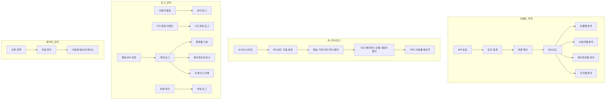
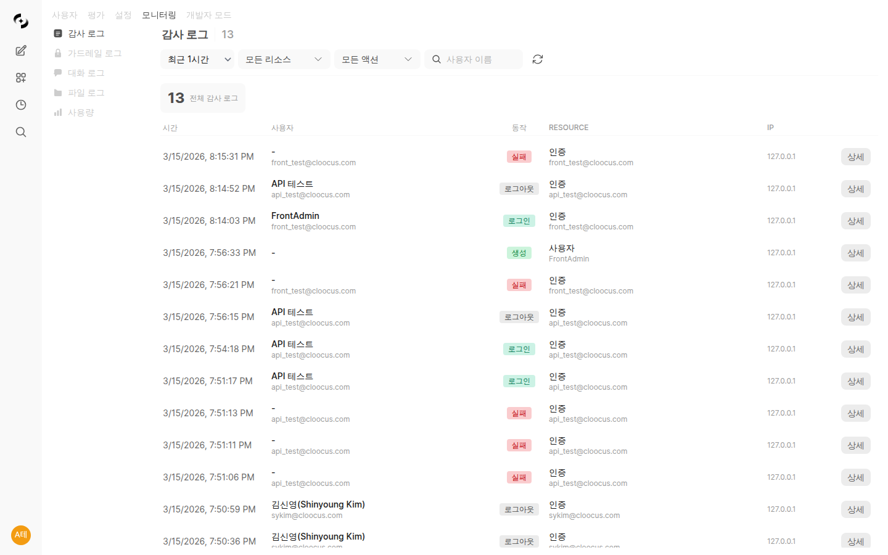
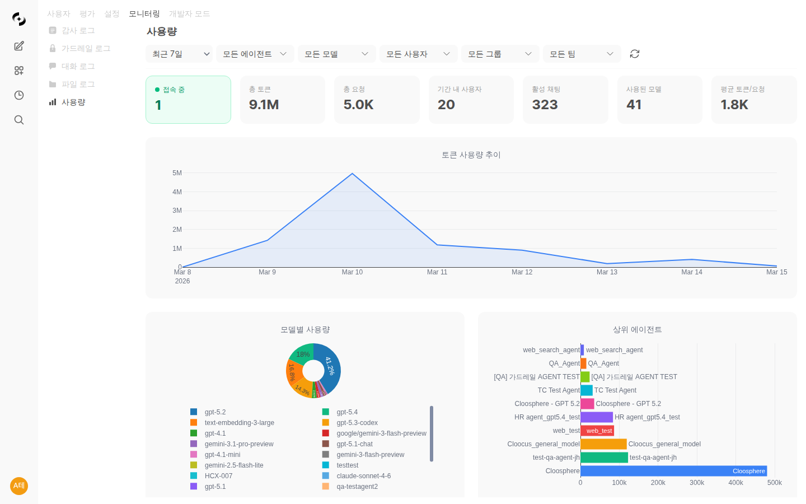

# 모니터링

> AI 사용량을 실시간으로 추적하고, 모든 사용자 활동을 투명하게 감사하세요. 데이터 기반의 의사결정과 보안 컴플라이언스를 동시에 달성할 수 있습니다.

---

## 모니터링 개요

**관리자 > 모니터링**에서 사용량, 로그, 대화 기록을 확인합니다.

### 탭 구성

| 탭 | 기능 |
|----|------|
| **대시보드 (Dashboard)** | BI 대시보드 — 패널 기반 차트·카드·필터, AI 자동 생성 |
| **감사 로그 (Audit Logs)** | 사용자 활동 기록 |
| **KMS 감사 (KMS Audit)** | KMS 작업 hash-chain 로그 (wrap/unwrap/rotate 등) |
| **가드레일 로그 (Guardrail Logs)** | 가드레일 감지·차단 기록 |
| **대화 로그 (Conversation Logs)** | 채팅 및 Code Gateway 사용 내역 통합 조회 |
| **파일 로그 (File Logs)** | 파일 업로드·처리 이력 |
| **사용량 (Usage)** | 토큰 사용량, 비용, 통계 |

---

## BI 대시보드 (Dashboard)

**모니터링 > 대시보드** 메뉴에서 패널 기반 BI 대시보드를 생성·관리할 수 있습니다. 차트, 카드, 필터 패널을 조합하여 운영 현황을 한눈에 파악하세요.

<!-- 스크린샷: BI 대시보드 메인 화면
     파일명: images/admin-bi-dashboard.png
-->

### 패널 구성

대시보드는 개별 패널로 구성됩니다. 각 패널은 독립적인 데이터 시각화를 제공합니다.

| 패널 유형 | 설명 |
|----------|------|
| **차트 (Chart)** | 다양한 차트 유형으로 데이터 시각화 (아래 차트 유형 표 참고) |
| **카드 (Card)** | 핵심 수치를 한눈에 보여주는 요약 카드 |
| **필터 (Filter)** | 대시보드 전체에 적용되는 기간·조건 필터 |

#### 지원 차트 유형

| 차트 유형 | 설명 | 활용 예시 |
|----------|------|----------|
| **라인 (Line)** | 시간에 따른 추이 표시 | 일별 토큰 사용량 추이 |
| **바 (Bar)** | 항목별 비교 | 모델별 사용 횟수 |
| **그룹 바 (Grouped Bar)** | 여러 시리즈를 그룹으로 묶어 비교 | 모델별·기간별 비용 비교 |
| **파이 (Pie)** | 비율 분포 | 에이전트별 사용 비율 |
| **산점도 (Scatter)** | 두 변수 간 상관관계 | 응답시간 vs 토큰 수 |
| **히스토그램 (Histogram)** | 수치 데이터의 분포 | 응답 시간 분포 |
| **히트맵 (Heatmap)** | 2차원 매트릭스 형태의 값 분포 | 시간대별·요일별 사용량 |

<!-- 스크린샷: 패널 유형 예시 (차트, 카드, 필터)
     파일명: images/admin-bi-dashboard-panels.png
-->

### 필터링

대시보드에서 다양한 조건으로 데이터를 필터링할 수 있습니다.

| 필터 | 설명 |
|------|------|
| **기간 필터** | 날짜 범위 선택 |
| **에이전트** | 특정 에이전트별 필터링 |
| **모델** | 특정 모델별 필터링 |
| **사용자** | 특정 사용자별 필터링 |

필터 선택 시 2차 검증을 통해 유효한 데이터만 표시됩니다.

### CPU 사용률 메트릭

대시보드에 CPU 사용률 패널을 추가하여 시스템 리소스 현황을 모니터링할 수 있습니다.

<!-- 스크린샷: CPU 사용률 패널
     파일명: images/admin-bi-dashboard-cpu.png
-->

| 지표 | 설명 |
|------|------|
| **CPU 사용률** | 현재 CPU 사용 비율 |
| **추이 차트** | 시간대별 CPU 사용률 변화 |

### AI 대시보드 자동 생성

자연어로 원하는 대시보드를 설명하면 AI가 자동으로 패널을 구성합니다.

<!-- 스크린샷: AI 대시보드 생성 에이전트
     파일명: images/admin-bi-dashboard-ai-generate.png
-->

**사용 방법:**
1. **"AI로 생성"** 버튼 클릭
2. 원하는 대시보드를 자연어로 설명 (예: "최근 7일간 모델별 토큰 사용량과 비용을 보여줘")
3. AI가 패널 구성을 자동 생성
4. 필요시 수동 조정

### AI 어시스턴트 — 멀티턴 대화형 빌더

AI 어시스턴트와 대화하며 대시보드를 점진적으로 구성할 수 있습니다. 한 번의 프롬프트로 끝나지 않고, 여러 차례 대화를 주고받으며 패널을 추가·수정합니다.

<!-- 스크린샷: AI 어시스턴트 멀티턴 대화 화면
     파일명: images/admin-bi-dashboard-ai-assistant.png
-->

**주요 기능:**
- 대화형 대시보드 빌더 — "사용자별 비용 차트도 추가해줘"처럼 대화로 패널 추가
- 기존 대시보드 수정 — "기간을 30일로 변경해줘"
- 패널 삭제·재배치 요청
- DB 연결 테스트 후 대시보드 생성 지원

### DB 연결 테스트

AI 어시스턴트가 대시보드를 생성하기 전에 DB 연결 상태를 자동으로 테스트합니다. 연결이 정상인 경우에만 대시보드를 생성하여 오류를 사전에 방지합니다.

---

## 사용량 (Usage)

### 대시보드 개요

### 주요 지표

| 지표 | 설명 |
|------|------|
| **총 토큰** | 기간 내 사용된 전체 토큰 |
| **총 요청** | API 호출 횟수 |
| **총 비용** | 예상 비용 (설정된 단가 기준) |
| **활성 사용자** | 현재 접속 중인 사용자 |

<!-- 스크린샷: 주요 지표 카드 4개
     파일명: images/admin-usage-metrics.png
-->

### 사용량 추이 차트

시간별 사용량 변화를 시각화합니다.

<!-- 스크린샷: 사용량 추이 라인 차트
     파일명: images/admin-usage-trend.png
-->

**기간 선택:**
- 최근 7일
- 최근 30일
- 사용자 지정 기간

### 모델별 사용량

어떤 AI 모델이 얼마나 사용되는지 확인합니다.

<!-- 스크린샷: 모델별 사용량 막대 차트
     파일명: images/admin-usage-by-model.png
-->

| 분석 항목 |
|----------|
| 모델별 토큰 사용량 |
| 모델별 요청 수 |
| 모델별 비용 |

### 에이전트별 사용량

워크스페이스 에이전트별 사용 현황입니다.

<!-- 스크린샷: 에이전트별 사용량
     파일명: images/admin-usage-by-agent.png
-->

**분석 가능 정보:**
- 어떤 에이전트가 가장 많이 사용되는가
- 에이전트별 비용 효율성
- 에이전트별 사용자 분포

### 사용자별 사용량

개별 사용자의 사용량을 확인합니다.

<!-- 스크린샷: 사용자별 사용량 테이블
     파일명: images/admin-usage-by-user.png
-->

| 컬럼 | 설명 |
|------|------|
| **사용자** | 이름, 이메일 |
| **토큰** | 사용 토큰 수 |
| **요청** | 요청 횟수 |
| **비용** | 예상 비용 |

### 그룹별 사용량

권한 그룹별 사용량을 집계합니다.

<!-- 스크린샷: 그룹별 사용량 테이블
     파일명: images/admin-usage-by-group.png
-->

### 조직별 사용량

조직 단위(부서)별 사용량을 확인합니다.

<!-- 스크린샷: 조직별 사용량 테이블
     파일명: images/admin-usage-by-org.png
-->

**활용 예시:**
- 부서별 AI 예산 배분
- 부서별 활용도 비교
- 비용 분담 근거

### 사용 유형별 분류

어떤 작업에 토큰이 사용되는지 분류합니다.

<!-- 스크린샷: 사용 유형별 파이 차트
     파일명: images/admin-usage-by-type.png
-->

| 유형 | 설명 |
|------|------|
| **CHAT** | 일반 채팅 |
| **EMBEDDING** | 문서 임베딩 |
| **TITLE_GENERATION** | 제목 생성 |
| **TAGS_GENERATION** | 태그 생성 |
| **QUERY_GENERATION** | 검색 쿼리 생성 |
| **TOOL_CALL** | 도구 호출 |
| **IMAGE_GENERATION** | 이미지 생성 |
| **IMAGE_PROMPT_GENERATION** | 이미지 프롬프트 생성 |

### 일별 사용량 제한

사용자, 그룹, 조직 단위로 일별 토큰 사용량 한도를 설정할 수 있습니다.

<!-- 스크린샷: 일별 사용량 제한 설정
     파일명: images/admin-usage-limit.png
-->

**계층 구조:**
4단계 계층(전역 → 사용자 → 그룹 → 조직) 중 **가장 관대한 값**이 적용됩니다.

| 설정 | 설명 |
|------|------|
| **전역 한도** | 관리자 설정에서 기본 한도 지정 |
| **사용자별 한도** | 개별 사용자에게 별도 한도 지정 |
| **그룹별 한도** | 권한 그룹에 한도 지정 |
| **조직별 한도** | 조직 단위로 한도 지정 |

**초과 시 동작:**

| 모드 | 설명 |
|------|------|
| **경고 (Warn)** | 토스트 알림만 표시, 요청은 허용 |
| **차단 (Block)** | 한도 초과 시 추가 요청 차단 |

**단계별 경고:**
- 80% 도달: 주의 토스트
- 95% 도달: 경고 토스트
- 100% 도달: 차단 모드에서 요청 거부

### 필터링

다양한 조건으로 데이터를 필터링합니다.

<!-- 스크린샷: 필터 옵션
     파일명: images/admin-usage-filters.png
-->

| 필터 | 옵션 |
|------|------|
| **기간** | 날짜 범위 |
| **모델** | 특정 모델 |
| **사용자** | 특정 사용자 |
| **그룹** | 특정 그룹 |
| **조직** | 특정 부서 |

#### Cascading 필터

사용량 필터는 **Cascading 방식**으로 동작합니다. 상위 필터를 선택하면 하위 필터의 옵션이 자동으로 갱신되어 유효한 조합만 선택할 수 있습니다.

**예시:**
- 기간을 선택하면 해당 기간에 활동한 사용자·모델만 드롭다운에 표시
- 모델을 선택하면 해당 모델을 사용한 사용자·그룹만 필터 옵션에 표시

> 이 기능은 사용량, 가드레일 로그, 감사 로그에 공통으로 적용됩니다.

### 내보내기

사용량 데이터를 CSV/JSON으로 다운로드합니다.

<!-- 스크린샷: 내보내기 버튼
     파일명: images/admin-usage-export.png
-->

**활용:**
- 경영진 보고서 작성
- 비용 분석
- 외부 BI 도구 연동

---

## 대화 로그 (Conversation Logs)

관리자가 모든 사용자의 채팅 및 Code Gateway 사용 내역을 통합 조회할 수 있습니다.

<!-- 스크린샷: 대화 로그 메인 화면
     파일명: images/admin-conversation-logs.png
-->

### 주요 통계

| 지표 | 설명 |
|------|------|
| **총 요청** | 기간 내 전체 요청 수 |
| **총 토큰** | 입력+출력 토큰 합계 |
| **고유 사용자** | 기간 내 활동 사용자 수 |
| **고유 모델** | 사용된 모델 수 |

### 로그 정보

| 필드 | 설명 |
|------|------|
| **타임스탬프** | 요청 시간 |
| **사용자** | 요청한 사용자 |
| **모델** | 사용된 AI 모델 |
| **플랫폼** | API 또는 Web 플랫폼 구분 표시 |
| **소스** | 채팅(Chat) 또는 Code Gateway |
| **에이전트** | 사용된 에이전트명 표시 |
| **입력 미리보기** | 사용자 입력 요약 |
| **출력 미리보기** | AI 응답 요약 |
| **토큰** | 입력/출력 토큰 수 |

<!-- 스크린샷: 대화 로그 플랫폼·에이전트 표시
     파일명: images/admin-conversation-logs-platform.png
-->

### 플랫폼 구분

대화 로그에서 요청의 출처 플랫폼을 확인할 수 있습니다.

| 플랫폼 | 배지 색상 | 설명 |
|--------|----------|------|
| **Web** | 회색 | 웹 UI를 통한 채팅 요청 |
| **API** | 노란색 | API 키를 사용한 직접 호출 |
| **Widget (임베드 위젯)** | 보라색 | 임베드 위젯에서 발생한 요청 — 배지에 마우스 올리면 위젯 이름 표시 |
| **Cursor** | 보라색 | Cursor 에디터의 코딩 요청 |
| **Claude Code** | 주황색 | Claude Code 코딩 요청 |
| **Codex CLI** | 초록색 | Codex CLI 코딩 요청 |
| **Gemini CLI** | 파란색 | Gemini CLI 코딩 요청 |

> **임베드 위젯 트래픽 분리:** 임베드 위젯에서 들어오는 채팅은 일반 Web 트래픽과 분리되어 **Widget** 으로 별도 집계됩니다. 위젯별 사용 패턴 분석, 호스트 사이트별 채택률 측정 등에 활용할 수 있습니다.

### 추적 버튼 (트레이스 연결)

각 대화 로그 항목에서 **"추적"** 버튼을 클릭하면 해당 요청의 전체 처리 과정을 **평가 > 트레이싱** 화면에서 확인할 수 있습니다.

<!-- 스크린샷: 대화 로그 추적 버튼
     파일명: images/admin-conversation-logs-trace.png
-->

### 전체 Request Body 표시

로그 상세 보기에서 전체 Request Body를 확인할 수 있습니다. API 호출의 전체 요청 내용을 JSON 형태로 조회하여 디버깅 및 감사에 활용할 수 있습니다.

<!-- 스크린샷: Request Body 상세 보기
     파일명: images/admin-conversation-logs-request-body.png
-->

### 필터 옵션

| 필터 | 옵션 |
|------|------|
| **기간** | 날짜 범위 (기본: 최근 7일) |
| **소스 유형** | Chat / Code Gateway |
| **플랫폼** | Web / API / 코딩 도구 |
| **모델** | 특정 모델 검색 |
| **사용자** | 특정 사용자 검색 |
| **에이전트** | 특정 에이전트 검색 |

### 상세 보기

로그 항목 클릭 시 전체 입력/출력 내용과 Request Body를 확인할 수 있습니다.

---

## 파일 로그 (File Logs)

파일 업로드 및 처리 이력을 추적합니다. 지식 기반, 프로젝트, 채팅에서의 파일 처리 상태를 확인할 수 있습니다.

<!-- 스크린샷: 파일 로그 메인 화면
     파일명: images/admin-file-logs.png
-->

### 로그 정보

| 필드 | 설명 |
|------|------|
| **파일명** | 업로드된 파일 이름 |
| **카테고리** | 파일 유형 (PDF, DOCX 등) |
| **상태** | 처리 상태 (성공/실패/처리중) |
| **소스** | 출처 (채팅/지식기반/프로젝트) |
| **사용자** | 업로드한 사용자 |
| **타임스탬프** | 업로드 시간 |

### 필터 옵션

| 필터 | 옵션 |
|------|------|
| **카테고리** | 파일 유형별 필터 |
| **상태** | 성공 / 실패 / 처리중 |
| **소스** | 채팅 / 지식기반 / 프로젝트 |

### 상세 보기

파일 로그 항목 클릭 시 처리 세부 정보(파싱 결과, 벡터화 상태, 오류 메시지 등)를 확인할 수 있습니다.

---

## 가드레일 로그 (Guardrail Logs)

에이전트에 연결된 가드레일이 감지·차단한 모든 이벤트를 기록합니다.

<!-- 스크린샷: 가드레일 로그 목록
     파일명: images/admin-guardrail-logs.png
-->

### 기록되는 이벤트

| 유형 | 설명 |
|------|------|
| **PII 탐지** | 주민등록번호, 신용카드 번호 등 개인정보 감지 |
| **차단 단어** | 금지어 포함 메시지 감지 |
| **커스텀 패턴** | 사용자 정의 정규식 패턴 감지 |
| **LLM Judge** | LLM 기반 콘텐츠 위험도 판단 차단 |

### 로그 정보

| 필드 | 설명 |
|------|------|
| **타임스탬프** | 이벤트 발생 시간 |
| **사용자** | 입력한 사용자 |
| **에이전트** | 적용된 에이전트 |
| **가드레일 유형** | 감지 방식 |
| **감지 내용** | 원본 입력 텍스트 |
| **처리 결과** | 차단, 마스킹, 또는 로그만 기록 |

### 필터 옵션

| 필터 | 옵션 |
|------|------|
| **기간** | 날짜 범위 선택 |
| **감지 패턴** | PII / 차단단어 / 커스텀 패턴 / LLM Judge |
| **소스** | 채팅 / Code Gateway |
| **사용자** | 특정 사용자 검색 |
| **Chat ID** | 특정 채팅 검색 |
| **액션** | 차단 / 마스킹 / 로그만 |

### Cascading 필터

가드레일 로그 필터도 Cascading 방식으로 동작합니다. 상위 필터를 선택하면 하위 필터의 옵션이 동적으로 갱신됩니다.

### 상세 보기 및 트레이싱 연동

로그 항목 클릭 시 상세 모달에서 감지된 내용을 확인할 수 있습니다.
**"트레이싱 보기"** 버튼을 클릭하면 해당 메시지의 전체 처리 과정을 **평가 > 트레이싱** 화면에서 확인할 수 있습니다.

---

## 감사 로그 (Audit Logs)

### 감사 로그란?

시스템에서 발생하는 모든 주요 활동을 기록합니다.

<!-- 스크린샷: 감사 로그 목록
     파일명: images/admin-audit-logs.png
-->

### 기록되는 활동

| 카테고리 | 활동 예시 |
|----------|----------|
| **인증** | 로그인, 로그아웃, 로그인 실패 |
| **사용자** | 생성, 수정, 삭제, **역할 변경** (admin ↔ user ↔ pending) |
| **채팅** | 생성, 삭제, 공유 |
| **워크스페이스** | 에이전트/지식베이스 CRUD |
| **설정** | 시스템 설정 변경 (변경 전/후 값 포함) |
| **권한** | 접근 권한 변경 |

> **사용자 역할 변경 추적:** 사용자 역할이 변경되면 변경 전/후 값과 함께 감사 로그에 기록됩니다. **누가(수행자) · 언제(타임스탬프) · 누구의(대상 사용자) · 무엇으로(역할)** 바꿨는지 모두 확인할 수 있어 권한 변경 이력 추적이 가능합니다.

### 로그 정보

| 필드 | 설명 |
|------|------|
| **타임스탬프** | 발생 시간 |
| **사용자** | 활동 수행자 |
| **액션** | 수행된 작업 |
| **리소스 유형** | 대상 리소스 종류 |
| **리소스 ID** | 대상 리소스 식별자 |
| **변경 내용** | 변경 전후 값 |
| **IP 주소** | 요청 출처 |

### 로그 조회

<!-- 스크린샷: 감사 로그 필터링 UI
     파일명: images/admin-audit-filters.png
-->

**필터 옵션:**

| 필터 | 설명 |
|------|------|
| **기간** | 1시간, 6시간, 1일, 7일, 30일, 전체 |
| **리소스 유형** | user, chat, model, knowledge 등 |
| **액션** | create, update, delete, login 등 |
| **사용자** | 특정 사용자 검색 |

#### Cascading 필터

감사 로그 필터도 Cascading 방식으로 동작합니다. 상위 필터를 선택하면 하위 필터의 옵션이 동적으로 갱신됩니다.

### 로그 상세 보기

로그 항목을 클릭하면 상세 정보를 확인할 수 있습니다.

<!-- 스크린샷: 감사 로그 상세 모달
     파일명: images/admin-audit-detail.png
-->

**표시 정보:**
- 전체 요청 정보
- 변경 전/후 값 비교
- 관련 메타데이터

### 내보내기

감사 로그를 CSV로 내보낼 수 있습니다.

<!-- 스크린샷: 감사 로그 내보내기
     파일명: images/admin-audit-export.png
-->

**활용:**
- 보안 감사
- 컴플라이언스 보고
- 사고 조사

---

## KMS 감사 (KMS Audit)

KMS(Key Management System) 의 모든 작업을 hash-chain 으로 기록하는 변조 감지용 감사 로그입니다. 암호화 키 회전, envelope wrap/unwrap, 데이터 마이그레이션 같은 모든 호출이 추적됩니다.

> KMS 자체 설정과 quick status (최근 5개 + 무결성 검증) 는 **관리자 > 설정 > 암호화** 탭에 있습니다. 자세한 내용은 [암호화 (KMS) 가이드](./encryption.md) 참조.

<!-- 스크린샷: KMS 감사 풀 뷰어 (필터 + 테이블)
     파일명: images/admin/monitoring-kms-audit.png
-->

### 위치

**관리자 > 모니터링 > KMS 감사** 탭에서 풀 뷰어를 사용할 수 있습니다.

### 기록 정보

| 필드 | 설명 |
|------|------|
| **id** | 감사 로그 행 식별자 (chain 의 순서) |
| **Time (UTC)** | 작업 발생 시각 |
| **Operation** | wrap / unwrap / rotate / health_check / provider_change / migrate / audit_export |
| **Result** | OK 또는 FAIL |
| **Actor** | 수행 주체 (`actor_type:actor_id` 형식, 예: `user:abc12345`) |
| **Config Path** | 영향을 받은 PersistentConfig 경로 (해당하는 경우) |
| **IP** | 요청 출처 IP |
| **Error** | 실패 시 에러 코드 |

### 필터

| 필터 | 옵션 |
|------|------|
| **Operation** | 모든 작업 / wrap / unwrap / rotate / health_check / provider_change / migrate / audit_export |
| **Result** | 모든 결과 / 성공만 / 실패만 |

### 무결성 검증

**무결성 검증 (Verify Integrity)** 버튼을 클릭하면 chain 의 모든 행을 순차적으로 hash 검증합니다.

| 결과 | 의미 |
|------|------|
| **Chain OK ({{count}} rows checked)** | 모든 행의 hash 가 정상. 변조 없음 |
| **Chain broken at id={{id}}: {{reason}}** | 해당 id 부터 chain 이 깨짐. 보안 사고 조사 시작 |

> chain 이 깨졌다면 누군가 DB 의 audit row 를 직접 변조했음을 의미합니다. 즉시 조사하세요.

### CSV 내보내기

감사 로그를 CSV 로 내보낼 수 있습니다. **내보내기 사유 (recorded in audit chain)** 필드에 사유를 입력해야 활성화됩니다 — export 행위 자체도 `audit_export` 로 chain 에 기록됩니다 (분기별 컴플라이언스 검토, 사고 조사 등).

| 필드 | 설명 |
|------|------|
| **내보내기 사유** | 필수. 예: "분기별 컴플라이언스 검토". 감사 chain 에 기록됨 |
| **CSV 내보내기** | 현재 필터가 적용된 결과를 CSV 로 다운로드 |

---

## Code Gateway 모니터링

**관리자 > Code Gateway**에서 AI 코딩 도구의 사용량과 가드레일 로그를 별도로 확인할 수 있습니다.

<!-- 스크린샷: Code Gateway 모니터링 화면
     파일명: images/admin-code-gateway-monitoring.png
-->

### 사용량 로그 (Usage Logs)

Code Gateway를 통한 API 호출의 토큰 사용량을 사용자별·모델별로 추적합니다.

| 지표 | 설명 |
|------|------|
| **총 요청** | Code Gateway API 호출 횟수 |
| **총 토큰** | 입력+출력 토큰 합계 |
| **고유 사용자** | 활동 사용자 수 |
| **고유 모델** | 사용된 모델 수 |

**필터 옵션:**

| 필터 | 옵션 |
|------|------|
| **기간** | 날짜 범위 |
| **사용자** | 특정 사용자 |
| **모델** | 특정 모델 |

### 가드레일 로그

Code Gateway에 연동된 가드레일의 감지·차단 이벤트를 기록합니다. 파일 패턴 차단, 콘텐츠 필터링 등의 이벤트를 확인할 수 있습니다.

---

## 데이터 보존 정책 (Data Retention)

**관리자 > 설정 > 데이터 보존**에서 로그 데이터의 자동 삭제 정책을 설정할 수 있습니다.

<!-- 스크린샷: 데이터 보존 정책 설정 화면
     파일명: images/admin-data-retention.png
-->

### 관리 대상

| 데이터 유형 | 설명 |
|------------|------|
| **사용량 로그** | 토큰 사용 기록 |
| **감사 로그** | 사용자 활동 기록 |
| **가드레일 로그** | 가드레일 감지 기록 |
| **트레이스** | AI 요청 처리 추적 기록 |
| **트레이스 분석** | LLM 분석 리포트 |
| **자동 평가** | 에이전트 응답 품질 평가 기록 |

### 설정 항목

| 항목 | 설명 |
|------|------|
| **보존 기간 (일)** | 데이터 유형별 보관 일수 설정 |
| **현재 행 수** | 각 테이블의 현재 데이터 건수 표시 |
| **활성화 토글** | 데이터 유형별 자동 정리 활성화/비활성화 |

### 정리 실행

**"정리 실행"** 버튼을 클릭하면 설정된 보존 기간을 초과한 데이터가 즉시 삭제됩니다.

> **주의:** 삭제된 데이터는 복구할 수 없습니다. 필요한 데이터는 내보내기 후 정리를 실행하세요.

---

## 모니터링 활용 사례

### 사례 1: 월별 AI 비용 분석

**목표:** 부서별 AI 사용 비용 파악

**방법:**
1. 사용량 탭 접속
2. 기간: 이번 달
3. 조직별 사용량 확인
4. CSV 내보내기
5. 경영진 보고서 작성

<!-- 스크린샷: 부서별 비용 분석 리포트 예시
     파일명: images/admin-usage-report-example.png
-->

### 사례 2: 보안 사고 조사

**목표:** 의심스러운 활동 추적

**방법:**
1. 감사 로그 탭 접속
2. 기간: 사고 발생 시점
3. 관련 사용자/리소스 필터링
4. 활동 이력 확인
5. 로그 내보내기 (증거 보존)

### 사례 3: 에이전트 효율성 평가

**목표:** 어떤 에이전트가 가장 효과적인지 분석

**방법:**
1. 사용량 탭 접속
2. 에이전트별 사용량 확인
3. 사용 빈도 vs 토큰 사용량 비교
4. 비효율적인 에이전트 개선 또는 제거

### 사례 4: 이상 사용 탐지

**목표:** 비정상적인 사용 패턴 발견

**분석 포인트:**
- 갑작스러운 사용량 급증
- 비업무 시간 대량 사용
- 특정 사용자의 과도한 사용
- 일별 사용량 제한 경고 확인

### 사례 5: AI 코딩 도구 관리

**목표:** Code Gateway를 통한 AI 코딩 도구 사용량 파악

**방법:**
1. Code Gateway > 사용량 로그 접속
2. 사용자별·모델별 토큰 사용량 확인
3. 가드레일 로그에서 차단 이벤트 확인
4. 필요시 레이트 리밋 또는 모델 허용 목록 조정

### 사례 6: AI 대시보드로 운영 현황 파악

**목표:** 자연어로 맞춤형 모니터링 대시보드 생성

**방법:**
1. 모니터링 > 대시보드 접속
2. **"AI로 생성"** 버튼 클릭
3. "최근 30일간 에이전트별 사용량과 CPU 사용률을 보여줘" 입력
4. AI가 패널 구성을 자동 생성
5. AI 어시스턴트와 대화하며 패널 추가·수정
6. 완성된 대시보드 저장

### 사례 7: 대화 내용 감사

**목표:** 특정 사용자의 AI 사용 내역 확인

**방법:**
1. 대화 로그 탭 접속
2. 사용자 필터로 대상 지정
3. 입력/출력 미리보기로 내용 확인
4. 상세 보기에서 전체 대화 확인

---

## 베스트 프랙티스

### 정기 모니터링

| 주기 | 점검 항목 |
|------|----------|
| **일간** | 이상 사용 확인, 사용량 제한 경고 검토 |
| **주간** | 사용량 추이 검토, 가드레일 로그 확인 |
| **월간** | 비용 분석, 보고서 작성, 데이터 보존 정책 검토 |
| **분기** | 전체 활용도 평가, 사용량 제한 조정 |

### 알림 설정

중요 이벤트에 대한 알림을 구성합니다:
- 로그인 실패 반복
- 권한 변경
- 대량 데이터 삭제
- 사용량 한도 초과

### 데이터 보존

데이터 보존 정책을 수립합니다:
- **관리자 > 설정 > 데이터 보존**에서 유형별 보존 기간 설정
- 최소 1년 보관 권장 (컴플라이언스 요건에 따라)
- 정리 실행 전 필요 데이터 내보내기
- 정기적 백업

### 비용 최적화

사용량 데이터 기반 비용 최적화:
- 저활용 모델 비활성화
- 효율적인 모델로 전환 권장
- 부서별 사용량 한도 설정 검토
- 일별 사용량 제한으로 예기치 않은 비용 방지

---

## FAQ

**Q: 사용량 데이터는 얼마나 보관되나요?**
> 기본적으로 영구 보관됩니다. **관리자 > 설정 > 데이터 보존**에서 유형별 보존 기간을 설정하고 자동 정리를 활성화할 수 있습니다.

**Q: 감사 로그로 채팅 내용을 볼 수 있나요?**
> 감사 로그는 활동 기록만 포함합니다. 채팅 내용은 **대화 로그** 탭에서 확인하세요.

**Q: 비용 계산은 정확한가요?**
> 설정된 토큰당 단가를 기준으로 계산됩니다. 실제 청구 금액과 다를 수 있으니 참고용으로 사용하세요.

**Q: 특정 사용자의 사용량만 볼 수 있나요?**
> 네, 사용자 필터를 사용하여 특정 사용자만 조회할 수 있습니다.

**Q: 실시간으로 사용량이 업데이트되나요?**
> 네, 대시보드는 실시간으로 업데이트됩니다.

**Q: Code Gateway 사용량은 어디서 확인하나요?**
> **관리자 > Code Gateway > 사용량 로그**에서 확인하거나, **대화 로그**에서 소스를 Code Gateway로 필터링하여 확인할 수 있습니다.

**Q: 일별 사용량 제한을 초과하면 어떻게 되나요?**
> 경고 모드에서는 토스트 알림만 표시됩니다. 차단 모드에서는 한도 초과 시 추가 요청이 차단되며, 사이드바에서 관리자에게 문의를 보낼 수 있습니다.

**Q: BI 대시보드는 어떻게 만드나요?**
> **모니터링 > 대시보드**에서 직접 패널을 추가하거나, **"AI로 생성"** 버튼을 클릭하여 자연어로 대시보드를 자동 생성할 수 있습니다. AI 어시스턴트와 멀티턴 대화를 통해 점진적으로 구성할 수도 있습니다.

**Q: 대화 로그에서 API와 Web 요청을 구분할 수 있나요?**
> 네, 대화 로그에 플랫폼 필드가 표시되어 Web, API, 코딩 도구(Cursor 등)를 구분할 수 있습니다.

**Q: Cascading 필터란 무엇인가요?**
> 상위 필터를 선택하면 하위 필터의 옵션이 자동으로 갱신되는 기능입니다. 사용량, 가드레일 로그, 감사 로그에서 사용할 수 있습니다.

**Q: CPU 사용률은 어디서 확인하나요?**
> **모니터링 > 대시보드**에서 CPU 사용률 패널을 추가하여 확인할 수 있습니다.

---

## 다음 단계

- 📈 [평가 & 트레이싱](./tracing.md)
- 🔔 [알림 설정](./notifications.md)
- 👥 [사용자 권한 관리](./users.md)
- ⚙️ [시스템 설정](./settings.md)
