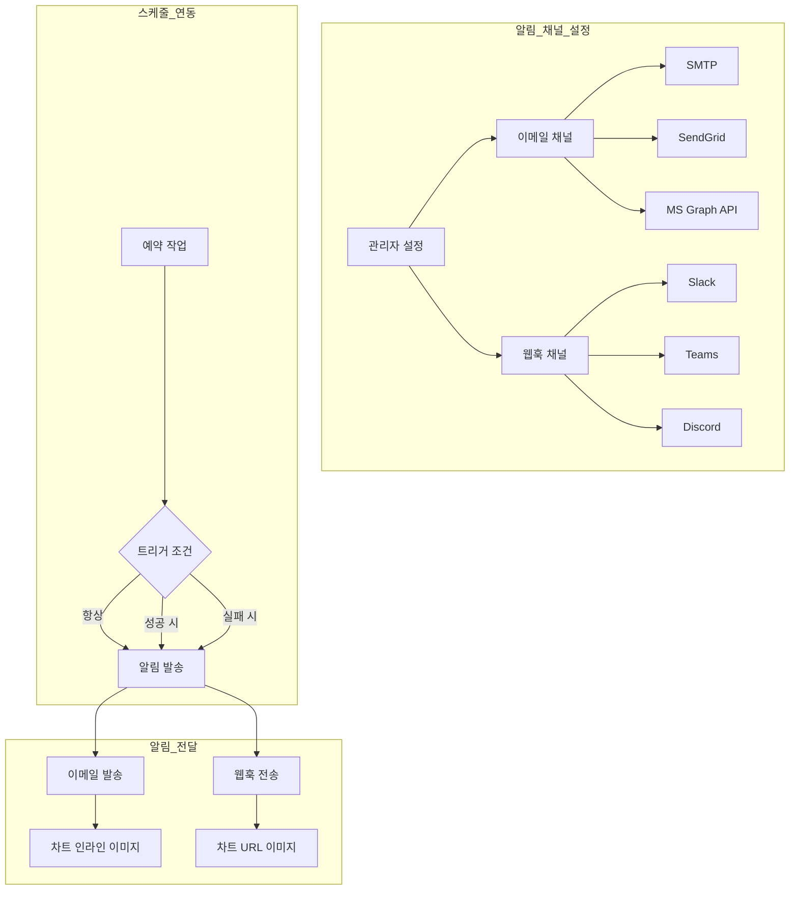

# 알림 설정

> 이메일과 웹훅 알림 채널을 설정하여 예약 작업 결과를 자동으로 팀에 전달하세요. SMTP, SendGrid, Slack, Teams, Discord 등 다양한 채널을 지원합니다.

---

## 알림 개요

알림 시스템은 관리자가 사전에 채널을 설정하고, 사용자가 예약 작업에서 채널을 선택하여 사용하는 구조입니다.

### 다중 채널 구조

| 구분 | 설명 |
|------|------|
| **이메일 채널** | SMTP, SendGrid 또는 MS Graph API 기반 이메일 발송 |
| **웹훅 채널** | Slack, Teams, Discord 등 외부 서비스 연동 |
| **Microsoft Teams 봇** | Teams 채팅에서 Cloosphere 에이전트와 양방향으로 대화 |

> **참고:** 관리자가 채널을 설정하면, 사용자가 예약 작업 생성 시 해당 채널을 선택할 수 있습니다. Teams 봇은 알림이 아닌 대화형 채널로, 별도 활성화가 필요합니다.

---

## 이메일 채널 설정

**관리자 > 설정 > 알림**에서 이메일 채널을 추가합니다.

<!-- 스크린샷: 이메일 채널 추가 모달
     - 채널 이름, 엔진 선택, SMTP/SendGrid 설정
     파일명: images/admin-notifications-email-modal.png
-->

### 채널 추가

**"+ 이메일 채널 추가"** 버튼을 클릭합니다.

| 필드 | 설명 |
|------|------|
| **채널 이름** | 식별 이름 (예: "기본", "마케팅팀") |
| **엔진** | SMTP, SendGrid 또는 MS Graph API 선택 |

### SMTP 설정

사내 메일 서버 또는 외부 SMTP 서비스를 연결합니다.

<!-- 스크린샷: SMTP 설정 폼
     파일명: images/admin-notifications-smtp.png
-->

| 설정 | 설명 | 예시 |
|------|------|------|
| **서버** | SMTP 서버 주소 | smtp.gmail.com |
| **포트** | SMTP 포트 | 587 (TLS) / 465 (SSL) |
| **사용자명** | 인증 계정 | noreply@company.com |
| **비밀번호** | 인증 비밀번호 | ●●●●●●●● |
| **TLS 사용** | TLS 암호화 활성화 | 활성화 (포트 587) |
| **SSL 사용** | SSL 암호화 활성화 | 활성화 (포트 465) |
| **발신자 주소** | 이메일 From 주소 | noreply@company.com |
| **발신자 이름** | 이메일 From 이름 | Cloosphere |

> **참고:** TLS와 SSL은 동시에 사용할 수 없습니다. 일반적으로 포트 587에는 TLS, 포트 465에는 SSL을 사용합니다.

### MS Graph API 설정

Azure AD(Microsoft Entra ID) 인증 기반으로 Microsoft 365 이메일을 발송합니다. 조직에서 Microsoft 365를 사용하는 경우 별도의 SMTP 서버 없이 이메일 알림을 구성할 수 있습니다.

<!-- 스크린샷: MS Graph API 설정 폼
     - Azure AD 인증 정보 입력 필드
     파일명: images/admin-notifications-msgraph.png
-->

| 설정 | 설명 |
|------|------|
| **테넌트 ID** | Azure AD 테넌트 ID |
| **클라이언트 ID** | Azure AD 앱 등록의 애플리케이션(클라이언트) ID |
| **클라이언트 시크릿** | Azure AD 앱 등록의 클라이언트 시크릿 값 |
| **발신자 주소** | Microsoft 365 사용자 이메일 주소 |
| **발신자 이름** | 이메일 From 이름 |

**Azure AD 앱 등록 요구사항:**
- Microsoft Graph API의 `Mail.Send` 권한이 필요합니다
- 애플리케이션 권한(Application permission) 또는 위임된 권한(Delegated permission)을 설정하세요
- 관리자 동의(Admin consent)가 필요합니다

> **참고:** MS Graph API는 OAuth 2.0 클라이언트 자격 증명 흐름을 사용하므로, SMTP 인증이 비활성화된 환경에서도 이메일을 발송할 수 있습니다.

### SendGrid 설정

SendGrid API를 사용한 이메일 발송입니다.

<!-- 스크린샷: SendGrid 설정 폼
     파일명: images/admin-notifications-sendgrid.png
-->

| 설정 | 설명 |
|------|------|
| **API 키** | SendGrid API 키 |
| **발신자 주소** | 인증된 발신자 이메일 |
| **발신자 이름** | 이메일 From 이름 |

### 연결 테스트

**"연결 테스트"** 버튼을 클릭하면 메일 서버 연결을 확인합니다.

<!-- 스크린샷: 연결 테스트 성공 메시지
     파일명: images/admin-notifications-email-test-connection.png
-->

| 결과 | 설명 |
|------|------|
| **성공** | 서버 연결, 인증 모두 정상 |
| **인증 실패** | 사용자명/비밀번호 확인 필요 |
| **연결 실패** | 서버 주소, 포트, 방화벽 확인 필요 |
| **타임아웃** | 네트워크 연결 확인 필요 |

### 테스트 이메일 발송

**"테스트 이메일 발송"** 버튼으로 실제 이메일을 보내 정상 동작을 확인합니다.

<!-- 스크린샷: 테스트 이메일 발송 폼
     - 수신자 이메일 입력
     파일명: images/admin-notifications-email-test-send.png
-->

1. 수신자 이메일 주소 입력
2. **"발송"** 클릭
3. 수신 확인

---

## 웹훅 채널 설정

외부 메시징 서비스와 연동하여 알림을 전송합니다.

<!-- 스크린샷: 웹훅 채널 추가 모달
     - 채널 이름, 제공자 선택, URL 입력
     파일명: images/admin-notifications-webhook-modal.png
-->

### 채널 추가

**"+ 웹훅 채널 추가"** 버튼을 클릭합니다.

| 필드 | 설명 |
|------|------|
| **채널 이름** | 식별 이름 (예: "개발팀 Slack") |
| **제공자** | Slack / Teams / Discord / Google Chat |
| **웹훅 URL** | 제공자에서 발급받은 수신 웹훅 URL |

### Slack 웹훅 설정

<!-- 스크린샷: Slack 웹훅 URL 예시
     파일명: images/admin-notifications-slack.png
-->

**웹훅 URL 생성 방법:**
1. Slack 앱 관리 페이지에서 **Incoming Webhooks** 활성화
2. **Add New Webhook to Workspace** 클릭
3. 채널 선택 후 **Allow**
4. 생성된 웹훅 URL 복사 (`https://hooks.slack.com/services/...`)

**알림 형식:** Header 블록 + Fields (프롬프트, 완료 시간) + Section (결과) + 차트 이미지

### Microsoft Teams 웹훅 설정

<!-- 스크린샷: Teams 웹훅 URL 예시
     파일명: images/admin-notifications-teams.png
-->

**웹훅 URL 생성 방법:**
1. Teams 채널에서 **커넥터** 또는 **워크플로우** 설정
2. **Incoming Webhook** 추가
3. 이름 지정 후 **만들기**
4. 생성된 웹훅 URL 복사 (`https://...webhook.office.com/...`)

**알림 형식:** Adaptive Card 1.5 — TextBlock (제목, 결과) + FactSet (정보) + Table (마크다운 표 자동 변환) + 차트 이미지

### Discord 웹훅 설정

<!-- 스크린샷: Discord 웹훅 URL 예시
     파일명: images/admin-notifications-discord.png
-->

**웹훅 URL 생성 방법:**
1. Discord 채널 설정 > **연동** > **웹후크**
2. **새 웹후크** 클릭
3. 이름 설정 후 **웹후크 URL 복사** (`https://discord.com/api/webhooks/...`)

**알림 형식:** Embed — Title + Fields (프롬프트, 상태, 완료 시간) + Description (결과) + 차트 이미지 (첫 번째)

### Google Chat 웹훅 설정

<!-- 스크린샷: Google Chat 웹훅 URL 예시
     파일명: images/admin-notifications-googlechat.png
-->

**웹훅 URL 생성 방법:**
1. Google Chat 스페이스에서 **앱 및 통합** > **웹훅 추가**
2. 웹훅 이름 입력 후 **저장**
3. 생성된 웹훅 URL 복사 (`https://chat.googleapis.com/v1/spaces/...`)

**알림 형식:** Card V2 — 제목, 실행 결과, 차트 이미지, 상세 링크 버튼

### 테스트 웹훅

**"테스트"** 버튼을 클릭하면 선택한 제공자 형식에 맞는 테스트 메시지를 전송합니다.

<!-- 스크린샷: 웹훅 테스트 성공 메시지
     파일명: images/admin-notifications-webhook-test.png
-->

---

## Microsoft Teams 봇

**관리자 > 설정 > 알림 > Teams 봇** 탭에서 Microsoft Teams 채팅 안에서 Cloosphere 에이전트와 직접 대화할 수 있는 공식 봇을 설정합니다. 웹훅 방식의 단방향 알림과 달리, 사용자가 Teams 채팅에서 질문을 보내면 Cloosphere 에이전트가 응답하고 대화 이력이 Cloosphere에 그대로 저장됩니다.

<!-- 스크린샷: Teams 봇 설정 화면
     - Azure Bot 인증, 기본 에이전트, 브랜딩, 매니페스트 다운로드
     파일명: images/admin-notifications-teams-bot.png
-->

### 이점

- 직원이 Teams를 벗어나지 않고도 사내 AI 에이전트를 활용
- 대화 이력이 Cloosphere에 저장되어 감사·분석 가능
- 에이전트별 용도 분리 (예: HR 에이전트, IT 에이전트를 서로 다른 팀에 배치)
- 다국어 응답 지원

### 준비물

1. Azure 구독 (Azure Bot 서비스 생성 가능한 권한)
2. Microsoft Entra ID에 앱 등록 권한
3. Teams Admin Center에서 커스텀 앱을 업로드할 수 있는 권한
4. 이미 생성된 Cloosphere 에이전트 또는 모델

### 설정 절차

**1단계: Azure에서 Bot 앱 등록**

Azure Portal에서 Azure Bot(또는 Entra ID 앱 등록)을 생성하고 다음 정보를 준비합니다.

| 항목 | 설명 |
|------|------|
| **App ID** | Azure Bot / Entra 앱의 클라이언트 ID (GUID) |
| **App Password** | Entra 앱 등록에서 발급한 클라이언트 시크릿 |
| **Tenant ID** | Azure AD 테넌트 ID (GUID). 멀티 테넌트 봇은 `common` 사용 |

**2단계: Cloosphere에서 인증 정보 입력**

**관리자 > 설정 > 알림 > Teams 봇** 탭에서 **"Teams 봇 활성화"** 를 켜고 다음 값을 입력합니다.

| 필드 | 설명 |
|------|------|
| **App ID** | Azure Bot 앱의 클라이언트 ID |
| **App Password** | 앱 등록의 클라이언트 시크릿 |
| **Tenant ID** | 단일 테넌트면 테넌트 GUID, 멀티 테넌트면 `common` |
| **기본 에이전트** | Teams에서 기본으로 응답할 에이전트/모델 선택 |

> **참고:** 사용자는 Teams 대화에서 `/agent` 명령으로 기본 에이전트 외 다른 에이전트로 전환할 수 있습니다.

**3단계: Messaging Endpoint 등록**

설정 화면의 **Messaging Endpoint** 필드에 Cloosphere가 자동으로 표시하는 URL을 복사해, Azure Portal의 **Azure Bot 구성 > Messaging endpoint** 에 그대로 붙여 넣습니다.

**4단계: Teams 채널 활성화**

Azure Bot의 **채널(Channels)** 메뉴에서 **Microsoft Teams** 채널을 추가합니다.

**5단계: Teams 매니페스트 생성 및 업로드**

Cloosphere의 **브랜딩** 섹션에서 Teams 앱으로 노출될 정보를 입력합니다.

| 항목 | 설명 |
|------|------|
| **Bot Name** | Teams에 표시되는 봇 이름 (최대 30자) |
| **Developer / Company Name** | Teams 앱 상세 페이지에 표시되는 게시자 이름 |
| **Short Description** | 한 줄 요약 (최대 80자) |
| **Full Description** | 상세 설명 |
| **Developer Website URL** | 개인정보 / 이용약관 URL 유도에 사용 |
| **Color Icon** | 192×192 PNG/JPEG 아이콘 |
| **Outline Icon** | 32×32 투명 PNG (흰색 실루엣) |
| **Accent Color** | Teams 카드와 헤더에 사용되는 브랜드 색상 (HEX, 예: `#171717`) |

**"Download Teams Manifest"** 버튼을 클릭하면 현재 설정이 반영된 `manifest.zip`이 다운로드됩니다. 이 파일을 Teams Admin Center 또는 Teams 클라이언트의 **앱 > 사용자 지정 앱 업로드**로 업로드하면 사내 사용자가 봇과 대화를 시작할 수 있습니다.

> **팁:** 매니페스트를 새로 다운로드해야 하는 경우는 App ID, 브랜딩 정보, 또는 배포 범위(Scopes)가 변경됐을 때뿐입니다. 에이전트나 프롬프트 변경은 재업로드가 필요하지 않습니다.

**6단계: 배포 범위 (Bot Scopes) 결정**

설정 화면의 **배포(Deployment) 섹션**에서 봇이 어떤 Teams 표면에 노출될지 선택합니다. 매니페스트가 이 선택에 따라 자동으로 생성되며, **그룹 채팅 / 팀 채널을 사용하면 추가 RSC 권한이 매니페스트에 포함**되어 Teams Admin Center 에서 관리자 동의가 필요합니다.

| 범위 | 설명 |
|------|------|
| **개인 (1:1 chat)** | 사용자와 봇 간 1:1 개인 대화. 추가 권한 없이 가장 안전 |
| **팀 (channel @mention)** | Teams 채널에서 `@봇` 으로 호출. 채널 메시지 RSC 권한 필요 |
| **그룹 채팅** | 다인 그룹 대화에서 봇 활용. 그룹 채팅 RSC 권한 필요 |

여러 범위를 동시에 체크할 수 있으며, 두 개 이상의 범위를 선택했을 때만 **기본 설치 위치(Default Group Capability)** 옵션이 표시됩니다. 이는 팀/조직 단위로 설치될 때 어떤 표면(team / groupchat / meetings) 이 기본으로 고정될지를 결정하며, **자동(Auto)** 으로 두면 Teams 가 알아서 선택합니다.

> **참고:** 배포 범위를 변경하면 매니페스트를 재생성해 다시 업로드해야 합니다. 이미 설치된 봇의 경우 Teams Admin Center에서 앱을 업데이트하세요.

### 멀티워커 환경 세션 동기화

Cloosphere가 여러 워커(웹/Gunicorn 프로세스) 로 운영될 때, Teams 봇의 사용자 ID 매핑·대화 컨텍스트·OAuth 토큰은 **Redis 에 공유 저장**됩니다. 따라서 사용자가 보낸 다음 메시지가 다른 워커에 도달해도 동일한 Cloosphere 사용자·대화 이력으로 이어집니다. 운영자는 Redis 가 정상적으로 연결된 환경에서만 별도 작업 없이 사용할 수 있으며, 설정 화면에서 별도 토글은 노출되지 않습니다.

### 사용자 경험

- 사용자가 Teams에서 봇과 1:1 채팅 또는 팀 채널에서 @멘션으로 호출
- 기본 에이전트가 자동으로 응답
- 대화 이력은 Cloosphere의 일반 채팅과 동일하게 저장되며 모니터링/감사 로그에서 확인 가능

### 트러블슈팅

| 증상 | 확인 사항 |
|------|----------|
| **봇이 응답하지 않음** | Azure Bot의 Messaging endpoint가 Cloosphere가 표시한 URL과 정확히 일치하는지 확인 |
| **인증 오류** | App ID / App Password / Tenant ID 재확인. 시크릿 만료 여부 확인 |
| **매니페스트 업로드 실패** | Teams Admin Center에서 "사용자 지정 앱 업로드" 정책이 허용되어 있는지 확인 |
| **기본 에이전트가 비어 있음 경고** | 설정 저장 전 **기본 에이전트** 항목에서 에이전트/모델을 반드시 선택 |

---

## 스케줄 알림 연동

관리자가 채널을 설정한 후, 사용자는 예약 작업 생성/편집 시 알림을 구성합니다.

<!-- 스크린샷: 스케줄 폼의 알림 설정 영역
     파일명: images/admin-notifications-schedule-delivery.png
-->

### 알림 구성

| 설정 | 설명 |
|------|------|
| **채널 유형** | 이메일 / 웹훅(사전 설정) / 직접 URL |
| **채널 선택** | 관리자가 등록한 채널 목록에서 선택 |
| **트리거 조건** | 항상 / 성공 시만 / 실패 시만 |

### 트리거 조건

| 조건 | 설명 | 사용 사례 |
|------|------|----------|
| **항상** | 성공/실패 모두 알림 | 중요 스케줄 |
| **성공 시만** | 정상 완료 시에만 알림 | 정기 보고서 |
| **실패 시만** | 오류 발생 시에만 알림 | 장애 감지 |

### 다중 알림

하나의 스케줄에 여러 알림을 설정할 수 있습니다.

**예시 구성:**
- 알림 1: 이메일 → 팀장 → 항상
- 알림 2: Slack 웹훅 → 개발팀 채널 → 실패 시만
- 알림 3: Teams 웹훅 → 경영진 채널 → 성공 시만

---

## 차트 이미지 전달

데이터베이스(DbSphere) 에이전트가 생성한 차트는 Plotly 기반 서버사이드 렌더링으로 PNG 이미지로 변환됩니다.

<!-- 스크린샷: 차트가 포함된 이메일 알림 예시
     파일명: images/admin-notifications-chart-email.png
-->

### 채널별 전달 방식

| 채널 | 방식 | 설명 |
|------|------|------|
| **이메일** | 인라인 Base64 | 본문에 이미지가 직접 포함됨 |
| **Slack** | 이미지 URL | 이미지 블록으로 표시 |
| **Teams** | Adaptive Card 이미지 | 카드 내 이미지 요소 |
| **Discord** | Embed 이미지 | 첫 번째 차트만 포함 |

> **참고:** 차트 이미지는 알림 발송 전에 자동으로 추출되어 별도 이미지로 전달됩니다. 알림 본문에서는 차트 마커가 제거되어 깔끔한 텍스트가 전달됩니다.

---

## 트러블슈팅

### 이메일 문제

| 증상 | 확인 사항 |
|------|----------|
| **연결 실패** | 서버 주소, 포트 확인. 방화벽에서 SMTP 포트 허용 여부 확인 |
| **인증 실패** | 사용자명/비밀번호 확인. Google은 앱 비밀번호 사용 필요 |
| **이메일 미수신** | 수신자 스팸함 확인. 발신자 주소 도메인의 SPF/DKIM 설정 확인 |
| **TLS 오류** | TLS/SSL 설정과 포트 조합 확인 (587-TLS, 465-SSL) |
| **SendGrid 오류** | API 키 권한 확인. 발신자 주소가 인증되었는지 확인 |

### 웹훅 문제

| 증상 | 확인 사항 |
|------|----------|
| **전송 실패** | 웹훅 URL 유효성 확인. URL이 만료되지 않았는지 확인 |
| **메시지 미표시** | 대상 채널/앱의 권한 확인. 봇이 채널에 접근 가능한지 확인 |
| **타임아웃** | 네트워크 연결 확인. 방화벽에서 외부 HTTPS 요청 허용 여부 확인 |
| **형식 깨짐** | 제공자 설정 확인 (Slack/Teams/Discord 중 올바른 항목 선택) |

### 일반 문제

| 증상 | 확인 사항 |
|------|----------|
| **알림이 오지 않음** | 스케줄의 알림 설정 확인. 트리거 조건이 올바른지 확인 |
| **차트 이미지 없음** | 에이전트가 DbSphere와 연결되어 있는지 확인 |
| **템플릿 변수 미치환** | `{{변수명}}` 형식이 올바른지 확인 |

---

## 외부 API 인증 (Trusted Audiences)

알림 설정 페이지 하단에는 **Trusted Audiences** 섹션이 함께 노출됩니다. 이는 외부 시스템이 자체 SSO 로 발급받은 ID 토큰(Microsoft Entra / Google) 을 그대로 Cloosphere API 호출에 사용할 수 있도록 허용 가능한 audience 를 화이트리스트로 등록하는 기능입니다.

<!-- 스크린샷: 알림 설정 화면 하단의 Trusted Audiences 섹션
     파일명: images/admin-notifications-trusted-audiences.png
-->

세부 등록 방법과 동작 방식은 [사용자 관리 — 외부 IDP ID 토큰 패스스루 인증](./users.md#외부-idp-id-토큰-패스스루-인증-trusted-audiences) 섹션을 참고하세요.

---

## SR(Service Request) 시스템

SR 시스템을 통해 서비스 요청을 관리하고 알림과 연동할 수 있습니다.

<!-- 스크린샷: SR 시스템 설정 화면
     파일명: images/admin-notifications-sr-system.png
-->

### SR 시스템이란?

SR(Service Request)은 사용자의 서비스 요청을 체계적으로 접수, 추적, 처리하기 위한 시스템입니다. 알림 채널과 연동하여 요청 상태 변경 시 자동으로 관련자에게 알림을 발송합니다.

### 주요 기능

| 기능 | 설명 |
|------|------|
| **요청 접수** | 사용자가 서비스 요청을 생성하고 관리자에게 전달 |
| **상태 추적** | 요청의 처리 상태를 실시간으로 추적 (접수, 처리중, 완료, 반려) |
| **알림 연동** | 상태 변경 시 이메일/웹훅 채널을 통해 자동 알림 발송 |
| **이력 관리** | 모든 요청과 처리 이력을 기록 및 조회 |

### 알림 연동 설정

SR 시스템에서 발생하는 이벤트에 대해 알림 채널을 연결합니다.

| 이벤트 | 설명 | 알림 대상 |
|--------|------|----------|
| **요청 생성** | 새로운 서비스 요청이 접수됨 | 관리자/담당자 |
| **상태 변경** | 요청 상태가 변경됨 | 요청자 |
| **댓글 추가** | 요청에 새 댓글이 작성됨 | 관련자 |
| **처리 완료** | 서비스 요청이 완료됨 | 요청자 |

> **참고:** SR 시스템의 알림은 관리자가 설정한 이메일 및 웹훅 채널을 그대로 활용합니다. 별도의 채널 설정 없이 기존 알림 인프라를 재사용할 수 있습니다.

---

## 다음 단계

- [예약 작업 만들기](../schedules.md)
- [시스템 설정](./settings.md)
- [사용자 관리](./users.md)
- [모니터링](./monitoring.md)
