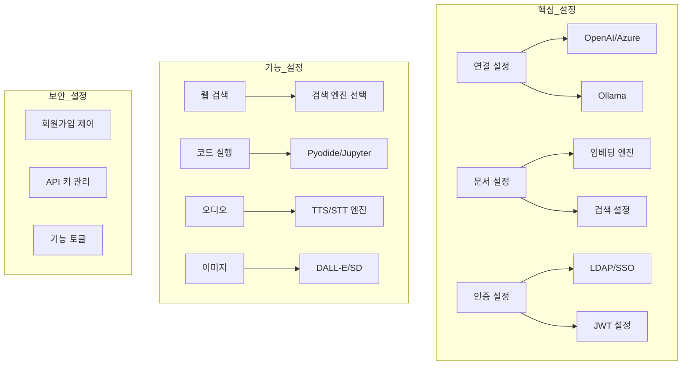
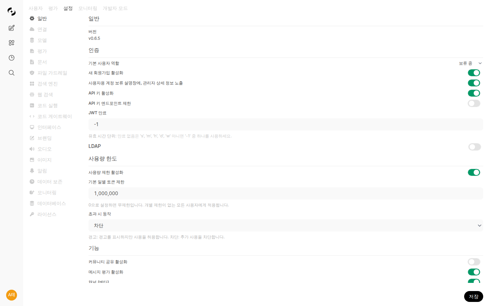
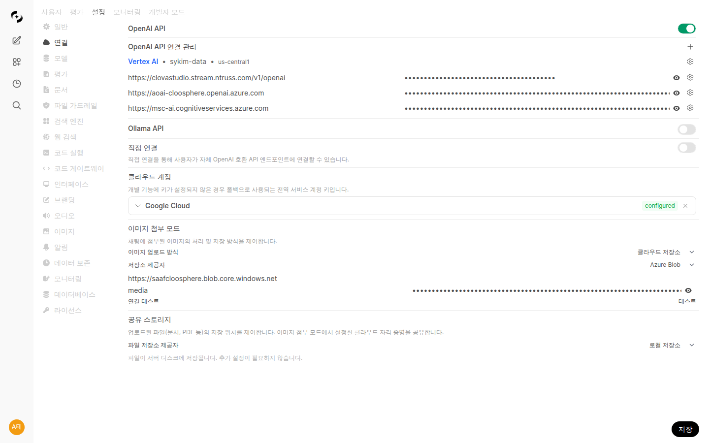
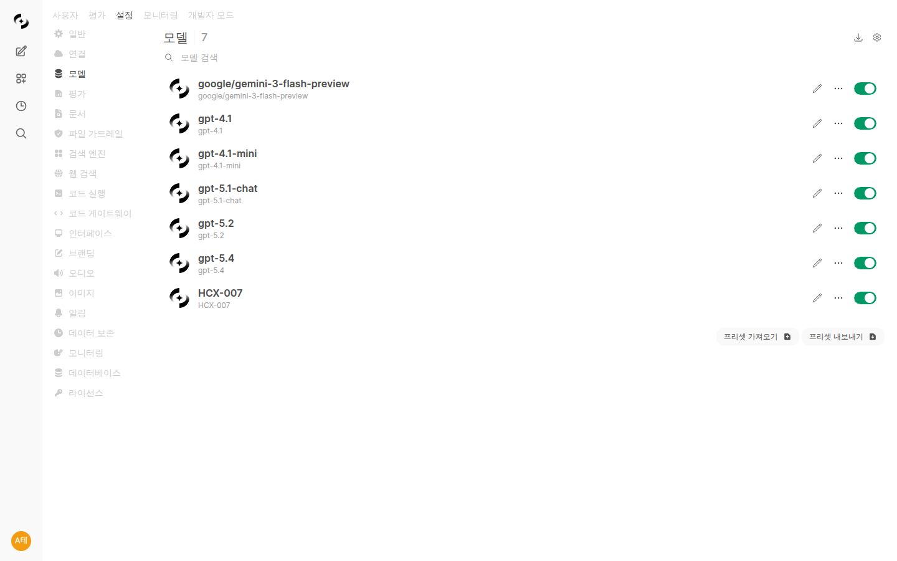

# 시스템 설정

> AI 모델 연결부터 보안 설정까지, Cloosphere의 모든 시스템 구성을 한 곳에서 관리하세요. 기업 환경에 맞는 최적의 설정으로 안전하고 효율적인 AI 플랫폼을 구축할 수 있습니다.



---

## 설정 개요

**관리자 > 설정**에서 시스템 전체 설정을 관리합니다.



### 설정 탭 구성

| 탭 | 기능 |
|----|------|
| **일반** | 인증, 기능 토글 |
| **연결** | AI 모델 연결 |
| **모델** | 모델 관리 |
| **문서** | RAG 설정 |
| **검색 엔진** | 벡터 DB 설정 |
| **웹 검색** | 웹 검색 엔진 |
| **코드 실행** | 코드 인터프리터 |
| **인터페이스** | UI 설정 |
| **오디오** | TTS/STT 설정 |
| **이미지** | 이미지 생성 |
| **파이프라인** | 파이프라인 관리 |
| **도구** | 도구 서버 |
| **알림** | 알림 채널 설정 |
| **데이터 보존** | 로그 자동 정리, 워커 큐 관리 |
| **브랜딩** | 로고·파비콘 커스터마이징 |
| **라이선스** | 라이선스 키 등록 및 관리 |

---

## 일반 설정

### 인증 설정

<!-- 스크린샷: 일반 > 인증 설정 섹션
     파일명: images/admin-settings-auth.png
-->

| 설정 | 설명 | 권장 |
|------|------|------|
| **회원가입 허용** | 새 사용자 자체 가입 | 비활성화 (SSO 사용 시) |
| **온보딩 활성화** | 비로그인 방문자에게 온보딩 랜딩 페이지를 표시할지 여부 | 마케팅용 공개 인스턴스에서만 활성화 |
| **기본 역할** | 신규 사용자 역할 | Pending (검토 후 승인) |
| **API 키 활성화** | API 키 인증 허용 | 필요시에만 활성화 |
| **JWT 만료 시간** | 세션 유효 기간 | 8시간 권장 |

> **온보딩 토글:** "회원가입 허용" 바로 아래에 위치한 **온보딩 활성화** 스위치는 첫 방문자에게 노출될 온보딩(랜딩) 페이지 표시 여부를 제어합니다. 사내용 비공개 인스턴스는 보통 비활성화로 두고, 외부 마케팅 / 데모 페이지로 사용할 때만 켭니다.

### LDAP 설정

기업 LDAP 서버와 연동하여 통합 인증을 구성합니다.

<!-- 스크린샷: LDAP 설정 전체
     파일명: images/admin-settings-ldap.png
-->

| 설정 | 설명 |
|------|------|
| **서버 호스트** | LDAP 서버 주소 |
| **포트** | 연결 포트 (389/636) |
| **Application DN** | 바인드 계정 DN |
| **비밀번호** | 바인드 계정 암호 |
| **Search Base** | 사용자 검색 기준 |
| **이메일 속성** | 이메일 매핑 속성 |
| **사용자명 속성** | 사용자명 매핑 속성 |
| **TLS 사용** | 암호화 통신 |

### 사용량 제한

일별 토큰 사용량 한도를 설정하여 AI 비용을 관리합니다.

<!-- 스크린샷: 사용량 제한 설정 섹션
     파일명: images/admin-settings-usage-limit.png
-->

| 설정 | 설명 | 기본값 |
|------|------|--------|
| **사용량 제한 활성화** | 사용량 제한 기능 전체 ON/OFF | 비활성화 |
| **기본 일별 토큰 제한** | 개별 제한이 없는 모든 사용자에게 적용되는 기본값 | 0 (무제한) |
| **초과 동작** | 한도 초과 시 처리 방식 | 경고 |

**초과 동작 옵션:**
- **경고 (Warn)**: 경고 메시지를 표시하지만 사용을 허용합니다 (모니터링 용도)
- **차단 (Block)**: 추가 요청을 차단합니다 (HTTP 429 반환)

> **참고:** 관리자(Admin) 역할 사용자는 제한 체크에서 제외됩니다.

**계층별 제한 설정:**

사용량 제한은 전역, 사용자, 그룹, 조직 4단계로 설정할 수 있으며, 모든 설정값 중 **가장 관대한(높은) 값**이 적용됩니다.

| 계층 | 설정 위치 | 설명 |
|------|----------|------|
| **전역 기본값** | 관리자 > 설정 > 일반 | 모든 사용자에게 기본 적용 |
| **사용자 개별** | 관리자 > 사용자 > 사용자 편집 | 특정 사용자에게만 적용 |
| **그룹** | 관리자 > 사용자 > 그룹 > 그룹 편집 | 그룹 내 모든 사용자에 적용 |
| **조직** | 관리자 > 사용자 > 조직 > 팀 선택 | 조직 단위 내 모든 사용자에 적용 |

**단계적 경고:**

사용량 비율에 따라 채팅 입력 시 자동으로 경고가 표시됩니다.

| 사용량 | 동작 |
|--------|------|
| 80% 이상 | 경고 토스트 표시 |
| 95% 이상 | 오류 토스트 ("곧 한도 도달") |
| 100% 이상 (경고 모드) | 오류 토스트 ("관리자에게 문의") |
| 100% 이상 (차단 모드) | 요청 차단 ("내일 다시 시도") |

### 기능 토글

<!-- 스크린샷: 기능 토글 섹션
     파일명: images/admin-settings-features.png
-->

| 기능 | 설명 |
|------|------|
| **커뮤니티 공유** | OpenWebUI 커뮤니티 공유 |
| **메시지 평가** | 응답 평가 기능 |
| **채널** | 팀 채팅 채널 기능 |
| **Webhook** | 외부 웹훅 연동 |

---

## 연결 설정

AI 모델 제공자와의 연결을 구성합니다.

### OpenAI 연결



**설정 방법:**
1. **API Base URL**: OpenAI 또는 호환 API 주소
2. **API Key**: API 키 입력
3. **연결 테스트**: 연결 확인

**Azure OpenAI 연결:**
```
URL: https://{리소스명}.openai.azure.com/
API Key: Azure에서 발급받은 키
```

**AI Foundry 연결:**
```
URL: https://{프로젝트명}.{리전}.models.ai.azure.com/
API Key: AI Foundry에서 발급받은 키
```

**장점:**
- 다양한 OpenAI 호환 서비스 연결 가능 (Azure OpenAI, AI Foundry 등)
- 여러 연결 동시 구성 (부하 분산)
- 사설 네트워크 내 API 연결

### Ollama 연결

로컬 또는 사내 서버의 Ollama 인스턴스와 연결합니다.

<!-- 스크린샷: Ollama 연결 설정
     파일명: images/admin-settings-ollama.png
-->

**설정 방법:**
1. **Base URL**: Ollama 서버 주소
2. 여러 서버 추가 가능 (부하 분산)

**장점:**
- 완전한 데이터 프라이버시
- 외부 네트워크 불필요
- 비용 절감

### 직접 연결 허용

사용자가 개인 API 키로 직접 연결하도록 허용합니다.

<!-- 스크린샷: 직접 연결 토글
     파일명: images/admin-settings-direct.png
-->

---

## 모델 설정

연결된 API에서 사용할 모델을 관리합니다.

### 모델 목록



| 항목 | 설명 |
|------|------|
| **모델명** | 표시되는 모델 이름 |
| **ID** | API에서 사용하는 ID |
| **활성화** | 사용 가능 여부 |
| **숨김** | 목록에서 숨김 |

### 모델 활성화/비활성화

특정 모델만 사용하도록 제한할 수 있습니다.

<!-- 스크린샷: 모델 활성화 토글
     파일명: images/admin-settings-model-toggle.png
-->

### 아레나 모델 설정

> **변경 사항:** 아레나 모델 설정은 **관리자 > 평가 > 아레나**로 이동되었습니다. 아레나에서 사용할 모델 풀 구성, 매칭 규칙 등의 설정은 평가 섹션에서 관리합니다.

### 용도별 기본 모델 설정

각 사용 용도(Use Case)별로 기본 모델을 지정할 수 있습니다. 사용자가 별도로 모델을 선택하지 않으면, 해당 용도에 설정된 기본 모델이 자동으로 사용됩니다.

<!-- 스크린샷: 용도별 기본 모델 설정
     파일명: images/admin-settings-default-models.png
-->

| 용도 | 설명 |
|------|------|
| **채팅 기본 모델** | 일반 채팅에서 사용하는 기본 모델 |
| **검색 쿼리 생성** | RAG 검색 쿼리 자동 생성에 사용할 모델 |
| **제목/태그 생성** | 채팅 제목 및 태그 자동 생성 모델 (인터페이스 설정의 작업 모델) |

> **참고:** 용도별 기본 모델은 관리자가 전역으로 설정하며, 사용자는 채팅 시 수동으로 다른 모델을 선택할 수 있습니다.

### 모델 가져오기/내보내기

모델 설정을 JSON으로 백업하고 복원합니다.

---

## 문서 설정 (RAG)

지식베이스 및 RAG 시스템 설정입니다.

### 문서 처리 프로파일

문서 유형과 용도에 따라 최적의 처리 방식을 선택할 수 있는 프로파일 시스템을 제공합니다.

<!-- 스크린샷: 문서 처리 프로파일 설정
     파일명: images/admin-settings-doc-profiles.png
-->

| 프로파일 | 설명 | 적합한 문서 |
|----------|------|------------|
| **기본 (Default)** | 텍스트 추출 + 고정 크기 청킹 | 일반 텍스트 문서 |
| **LLM Vision 추출** | LLM 비전 모델을 사용하여 이미지/복잡한 레이아웃에서 텍스트 추출 | 스캔 문서, 복잡한 표, 인포그래픽 |
| **Semantic Chunking** | 의미 단위로 문서를 자동 분할 | 긴 보고서, 기술 문서 |
| **Contextual Chunking** | 각 청크에 문서 전체 컨텍스트를 추가하여 검색 정확도 향상 | FAQ, 매뉴얼 |

**프로파일 적용:**
- 전역 기본 프로파일 설정 가능
- 지식베이스별 개별 프로파일 지정 가능
- 파일 업로드 시 프로파일 선택 가능

> 💡 **Tip**: LLM Vision 추출은 이미지가 포함된 PDF나 스캔 문서에서 특히 효과적입니다. 단, LLM 호출 비용이 추가로 발생합니다.

### 콘텐츠 추출

문서에서 텍스트를 추출하는 엔진을 설정합니다.

<!-- 스크린샷: 콘텐츠 추출 설정
     파일명: images/admin-settings-extraction.png
-->

| 엔진 | 특징 |
|------|------|
| **기본** | 내장 추출기 |
| **Tika** | Apache Tika 서버 |
| **Docling** | 고급 문서 처리 |
| **Document Intelligence** | Azure AI 서비스 |
| **Document AI** | Google Cloud Document AI (Layout Parser) — 복잡한 레이아웃(표, 양식, 다단) 추출 |
| **Mistral OCR** | Mistral OCR |

### 임베딩 설정

문서를 벡터로 변환하는 설정입니다.

<!-- 스크린샷: 임베딩 설정
     파일명: images/admin-settings-embedding.png
-->

| 설정 | 설명 |
|------|------|
| **임베딩 엔진** | 사용할 임베딩 서비스 |
| **임베딩 모델** | 모델 선택 |
| **배치 크기** | 한 번에 처리할 문서 수 |

**지원 엔진:**
- SentenceTransformers (로컬)
- OpenAI
- Azure OpenAI
- Ollama
- Gemini
- Vertex AI

### 검색 설정

<!-- 스크린샷: 검색 설정
     파일명: images/admin-settings-retrieval.png
-->

| 설정 | 설명 | 권장 |
|------|------|------|
| **Top K** | 검색 결과 개수 | 5 |
| **관련도 임계값** | 최소 유사도 | 0.0 |
| **하이브리드 검색** | 키워드+의미 검색 | 활성화 |
| **리랭킹** | 결과 재정렬 | 활성화 |

### 파일 업로드 제한

<!-- 스크린샷: 업로드 제한 설정
     파일명: images/admin-settings-upload.png
-->

| 설정 | 설명 |
|------|------|
| **최대 파일 크기** | 단일 파일 최대 크기 |
| **최대 파일 수** | 한 번에 업로드 개수 |

### 클라우드 스토리지

<!-- 스크린샷: 클라우드 스토리지 토글
     파일명: images/admin-settings-cloud.png
-->

| 스토리지 | 설정 |
|----------|------|
| **Google Drive** | 활성화/비활성화 |
| **OneDrive** | 활성화/비활성화 |
| **SharePoint** | 활성화/비활성화 |

---

## 검색 엔진 설정

벡터 데이터베이스 설정입니다.

<!-- 스크린샷: 검색 엔진 설정
     파일명: images/admin-settings-search-engine.png
-->

### 지원 엔진

| 엔진 | 특징 |
|------|------|
| **Chroma** | 경량, 로컬 사용 |
| **pgvector** | PostgreSQL 확장 (halfvec 지원) |
| **Milvus** | 대규모 분산 처리 |
| **Azure AI Search** | Azure 관리형 서비스 |
| **Elasticsearch** | 하이브리드 검색 |

### 검색 설정

검색 엔진의 검색 결과 개수와 리랭커를 설정합니다.

| 설정 | 설명 | 권장 |
|------|------|------|
| **Top K** | 검색 결과 개수 | 10 |
| **Reranker Top K** | 리랭커 적용 후 결과 개수 | 3 |
| **리랭커 임계값** | 리랭커 적용 후 최소 관련성 점수 (0~1). 임계값 미만의 결과는 필터링됩니다. | 0.0 (필터링 없음) |

---

## 웹 검색 설정

AI가 웹 검색을 수행할 수 있도록 설정합니다.

### 검색 엔진 선택

<!-- 스크린샷: 웹 검색 엔진 선택
     파일명: images/admin-settings-web-search.png
-->

**지원 검색 엔진:**
- SearXNG
- Google PSE
- Brave Search
- DuckDuckGo
- Bing
- Tavily
- 기타 15+ 엔진

### 검색 설정

<!-- 스크린샷: 웹 검색 세부 설정
     파일명: images/admin-settings-web-search-detail.png
-->

| 설정 | 설명 |
|------|------|
| **결과 수** | 검색 결과 개수 |
| **동시 요청** | 병렬 검색 수 |
| **도메인 필터** | 허용/차단 도메인 |

### 웹 로더

웹 페이지 콘텐츠를 가져오는 엔진입니다.

| 엔진 | 특징 |
|------|------|
| **기본** | 단순 HTTP 요청 |
| **Playwright** | JavaScript 렌더링 |
| **Firecrawl** | 고급 웹 크롤링 |
| **Tavily** | AI 최적화 추출 |

---

## 코드 실행 설정

AI가 코드를 실행할 수 있도록 설정합니다.

<!-- 스크린샷: 코드 실행 설정
     파일명: images/admin-settings-code.png
-->

### 실행 엔진

| 엔진 | 특징 | 보안 |
|------|------|------|
| **Pyodide** | 브라우저 내 실행 | 안전 |
| **Jupyter** | 서버 실행 | 주의 필요 |

### Jupyter 설정

| 설정 | 설명 |
|------|------|
| **서버 URL** | Jupyter 서버 주소 |
| **토큰** | 인증 토큰 |
| **타임아웃** | 실행 제한 시간 |

---

## 인터페이스 설정

자동 생성 및 UI 관련 설정입니다.

<!-- 스크린샷: 인터페이스 설정
     파일명: images/admin-settings-interface.png
-->

### 작업 모델

| 설정 | 설명 |
|------|------|
| **작업 모델** | 제목/태그 생성용 모델 |
| **외부 모델** | 별도 API 사용 |

### 자동 생성

| 기능 | 설명 |
|------|------|
| **제목 생성** | 채팅 제목 자동 생성 |
| **태그 생성** | 채팅 태그 자동 생성 |
| **자동완성** | 입력 자동완성 |
| **검색 쿼리 생성** | RAG 검색 쿼리 자동 생성 |

### 프롬프트 제안

기본 프롬프트 제안을 설정합니다.

<!-- 스크린샷: 프롬프트 제안 설정
     파일명: images/admin-settings-suggestions.png
-->

### 배너

시스템 공지 배너를 설정합니다.

<!-- 스크린샷: 배너 설정
     파일명: images/admin-settings-banner.png
-->

---

## 오디오 설정

음성 입출력 관련 설정입니다.

<!-- 스크린샷: 오디오 설정
     파일명: images/admin-settings-audio.png
-->

### TTS (Text-to-Speech)

| 설정 | 옵션 |
|------|------|
| **엔진** | 시스템, OpenAI, Azure, Google Cloud TTS, Gemini TTS |
| **모델** | 엔진별 모델 |
| **음성** | 음성 선택 |

### STT (Speech-to-Text)

| 설정 | 옵션 |
|------|------|
| **엔진** | 시스템, OpenAI, Azure, Deepgram, Google Cloud STT |
| **모델** | Whisper 모델 등 |

### 아바타

AI 응답에 아바타를 표시합니다.

<!-- 스크린샷: 아바타 설정
     파일명: images/admin-settings-avatar.png
-->

---

## 이미지 설정

AI 이미지 생성 관련 설정입니다.

<!-- 스크린샷: 이미지 설정
     파일명: images/admin-settings-images.png
-->

### 지원 엔진

| 엔진 | 특징 |
|------|------|
| **DALL-E** | OpenAI 이미지 생성 |
| **Azure OpenAI** | Azure gpt-image-1 — quality·format·background 옵션 지원 |
| **Vertex AI** | Google Gemini 이미지 생성 (OAuth2 토큰 캐싱) |
| **Automatic1111** | Stable Diffusion WebUI |
| **ComfyUI** | 노드 기반 이미지 생성 |

### Azure OpenAI 이미지 설정

| 설정 | 설명 | 옵션 |
|------|------|------|
| **Quality** | 이미지 품질 | standard / hd |
| **Output Format** | 출력 형식 | url / b64_json |
| **Background** | 배경 처리 | auto / transparent / opaque |

> 기본 이미지 크기는 **1024×1024**입니다.

### 모델 관리

사용 가능한 이미지 모델을 설정합니다.

---

## 파이프라인 설정

커스텀 처리 파이프라인을 관리합니다.

<!-- 스크린샷: 파이프라인 설정
     파일명: images/admin-settings-pipelines.png
-->

### 파이프라인 관리

| 기능 | 설명 |
|------|------|
| **설치된 파이프라인** | 현재 활성 파이프라인 |
| **다운로드** | 레지스트리에서 설치 |
| **업로드** | 커스텀 파이프라인 설치 |
| **Valves 설정** | 파이프라인별 설정 |

---

## 도구 서버 설정

글로벌 도구 서버 연결을 관리합니다.

<!-- 스크린샷: 도구 서버 설정
     파일명: images/admin-settings-tools.png
-->

---

## Code Gateway 설정

AI 코딩 도구(Cursor, Codex CLI, Gemini CLI, Claude Code 등)가 LLM API를 사용할 때의 정책을 관리합니다.

<!-- 스크린샷: Code Gateway 설정 화면
     파일명: images/admin-settings-code-gateway.png
-->

### 전역 가드레일 연동

Code Gateway를 통한 요청에도 전역 가드레일을 적용할 수 있습니다.

| 설정 | 설명 |
|------|------|
| **전역 가드레일 따름** | `follow_global_guardrail` 토글을 활성화하면, Code Gateway 요청에도 시스템 전역 가드레일(입력/출력 필터링)이 동일하게 적용됩니다 |

### 멀티 클라이언트 지원

다양한 AI 코딩 도구를 지원합니다.

| 클라이언트 | 지원 현황 |
|------------|----------|
| **Claude Code** | 원클릭 설정 지원 |
| **Cursor** | Hook 메타데이터 수집 지원 |
| **Codex CLI** | API 호환 지원 |
| **Gemini CLI** | API 호환 지원 |
| **기타 OpenAI 호환 도구** | API Base URL 설정으로 연동 |

### Cursor Hook 메타데이터 수집

Cursor 에디터에서 요청 시 프로젝트 메타데이터를 자동 수집합니다.

<!-- 스크린샷: Cursor Hook 메타데이터 설정
     파일명: images/admin-settings-code-gateway-cursor.png
-->

**수집 항목:**
- 리포지토리 이름 및 경로
- 브랜치 정보
- 프로젝트 언어/프레임워크
- 사용자 식별 정보

### 출력 가드레일

Code Gateway를 통한 AI 응답에 출력 가드레일을 적용할 수 있습니다.

| 설정 | 설명 |
|------|------|
| **코드 출력 필터링** | 민감한 정보(API 키, 자격 증명 등)가 포함된 코드 생성을 방지 |
| **라이선스 준수 검사** | 생성된 코드의 라이선스 호환성 검사 |

### 리포지토리 추적

AI 코딩 도구가 어떤 프로젝트(git 리포지토리)에서 요청을 보내는지 추적할 수 있습니다.

| 설정 | 설명 |
|------|------|
| **차단 리포지토리 (Blocked Repos)** | 특정 리포지토리 패턴의 접근을 차단합니다 |
| **메타데이터 필수 (require_repo_metadata)** | 리포지토리 정보가 없는 요청을 거부합니다 |

> 💡 리포지토리 정보는 API 키 또는 요청 헤더를 통해 자동 전달됩니다.

### Claude Code 지원

Claude Code 사용자를 위한 원클릭 설정을 지원합니다. 개발자 가이드 탭에서 설치 명령어를 확인할 수 있습니다.

**설정 방법:**
1. Code Gateway 설정에서 **개발자 가이드** 탭 선택
2. OS 선택 (Linux/macOS 또는 Windows)
3. 표시된 설치 명령어를 터미널에 붙여넣기
4. helper 스크립트와 인증 설정이 자동 구성됩니다

---

## 알림 설정

시스템 알림 채널을 구성합니다.

<!-- 스크린샷: 알림 설정 화면
     파일명: images/admin-settings-notifications.png
-->

### 알림 채널

| 채널 | 설명 |
|------|------|
| **Webhook** | 외부 URL로 알림 전송 (Slack, Teams 등) |
| **MS Graph API 이메일** | Microsoft Graph API를 통한 이메일 알림 전송 |

### MS Graph API 이메일 설정

Microsoft 365 환경에서 Graph API를 통해 이메일 알림을 전송합니다.

<!-- 스크린샷: MS Graph API 이메일 설정
     파일명: images/admin-settings-notifications-msgraph.png
-->

| 설정 | 설명 |
|------|------|
| **Tenant ID** | Azure AD 테넌트 ID |
| **Client ID** | 등록된 앱의 클라이언트 ID |
| **Client Secret** | 클라이언트 시크릿 |
| **발신자 이메일** | 알림을 보낼 이메일 주소 |

**알림 대상:**
- 사용량 제한 임계값 도달 시 관리자에게 알림
- 사용자 문의 접수 시 관리자에게 알림
- 시스템 오류 발생 시 알림

> **참고:** MS Graph API 이메일을 사용하려면 Azure AD에서 `Mail.Send` 권한이 부여된 앱 등록이 필요합니다.

---

## 데이터 보존 (Data Retention)

**관리자 > 설정 > 데이터 보존** 탭에서 로그 데이터의 자동 정리 정책과 백그라운드 워커 큐 운영 도구를 관리합니다.

<!-- 스크린샷: 데이터 보존 탭 메인 화면
     파일명: images/admin-data-retention.png
-->

> 로그 유형별 보존 기간 (Usage / Audit / Guardrail / Trace 등) 의 상세 사용 흐름은 [모니터링 가이드 — 데이터 보존 정책](./monitoring.md) 을 참조하세요. 이 섹션에서는 설정 탭에서 직접 다루는 항목 위주로 설명합니다.

### 자동 정리 (Auto Cleanup)

| 항목 | 설명 |
|------|------|
| **자동 정리 활성화** | 보존 기간을 초과한 로그를 매일 자동 삭제 |
| **정리 시간** | 자동 정리가 실행되는 시각 (00:00 ~ 23:00) |

### 보존 기간 설정 (Retention Settings)

각 로그 유형마다 보존 일수를 입력합니다. **0 = 영구 보관**.

| 유형 | 설명 |
|------|------|
| **Usage Logs** | 토큰 사용 기록 |
| **Audit Logs** | 사용자 활동 기록 |
| **Guardrail Logs** | 가드레일 감지 기록 |
| **Traces** | AI 요청 처리 추적 |
| **Trace Analysis** | LLM 분석 리포트 |
| **Auto Evaluations** | 에이전트 응답 자동 평가 |

각 유형 옆에는 현재 row 수가 표시되어 정리 전 영향 범위를 확인할 수 있습니다.

### 수동 정리 (Manual Cleanup)

**지금 정리 실행** 버튼을 클릭하면 설정값을 저장한 직후 보존 기간 초과 데이터가 즉시 삭제됩니다.

> **주의:** 삭제된 데이터는 복구 불가능합니다. 필요 시 사전에 CSV 내보내기로 백업하세요.

### 워커 큐 자동 정리 (Worker Auto Cleanup)

Redis Streams 기반 백그라운드 워커 큐에서 발생할 수 있는 좀비 컨슈머와 stuck 메시지를 자동으로 정리합니다. 활성 워커나 진행 중인 작업에는 영향을 주지 않습니다.

<!-- 스크린샷: 워커 자동 정리 설정 (좀비 idle 임계값, stuck idle 임계값, 정리 주기)
     파일명: images/admin/data-retention-worker-cleanup.png
-->

| 항목 | 설명 | 권장 |
|------|------|------|
| **워커 자동 정리** | 좀비/stuck 메시지 자동 정리 활성화 토글 | 운영 환경에서 활성화 |
| **좀비 컨슈머 idle 임계값 (시간)** | 이 시간 이상 idle 상태이면서 pending 이 0 인 컨슈머만 삭제 | 1 |
| **Stuck 메시지 idle 임계값 (시간)** | 이 시간 이상 pending 된 메시지를 강제 ack 처리. 가장 긴 작업 시간보다 길게 설정 | 1 |
| **정리 실행 주기 (분)** | 자동 정리가 실행되는 주기 | 60 |

#### 좀비 vs stuck

| 유형 | 의미 |
|------|------|
| **좀비 컨슈머 (zombie)** | 워커 프로세스는 종료됐지만 Redis Streams 의 consumer registration 이 남아있는 상태 — pending 메시지 0 인 경우만 안전하게 삭제 |
| **Stuck 메시지 (stuck)** | 컨슈머가 consume 했지만 ack 하지 못한 채 idle 임계값을 넘긴 메시지 — 강제 ack 처리되며 실제 작업은 실행되지 않음 (영구 손실) |

> **운영 팁:** Stuck 메시지의 idle 임계값은 가장 오래 걸리는 작업(예: 대용량 파일 처리, 임베딩 배치) 보다 충분히 길게 잡으세요. 너무 짧으면 정상 동작 중인 작업이 강제 ack 되어 손실됩니다.

작업 중인 워커, 진행 중인 작업, 정상 큐 메시지에는 영향이 없으므로 운영 환경에서 안전하게 활성화할 수 있습니다.

---

## 브랜딩 설정

기업 아이덴티티에 맞게 플랫폼 외관을 커스터마이징합니다.

> **라이선스 필요:** Professional 티어 이상에서 사용 가능합니다.

<!-- 스크린샷: 브랜딩 설정 화면
     파일명: images/admin-settings-branding.png
-->

| 항목 | 설명 |
|------|------|
| **파비콘 (Favicon)** | 브라우저 탭 아이콘 (.png, .ico 지원) |
| **로고 (Logo)** | 사이드바 및 로그인 화면 로고 |
| **스플래시 이미지** | 앱 초기 로딩 화면 배경 이미지 |

**설정 방법:**
1. 브랜딩 탭 접속
2. 각 항목에서 **"업로드"** 클릭
3. 이미지 파일 선택
4. 저장 (즉시 반영)

**초기화:**
각 항목 우측 삭제 버튼으로 기본 Cloosphere 이미지로 복원할 수 있습니다.

---

## 라이선스 설정

Cloosphere의 기능 잠금을 해제하는 라이선스 키를 관리합니다.

<!-- 스크린샷: 라이선스 설정 화면
     파일명: images/admin-settings-license.png
-->

### 티어 구성

| 티어 | 포함 기능 |
|------|----------|
| **Basic** | 기본 채팅, 에이전트(기본), 사용자 관리 |
| **Standard** | Basic + 감사 로그, 용어집, 가드레일, 이미지 생성, KbSphere, 도구 |
| **Professional** | Standard + 플로우, 브랜딩, DbSphere, 자동 평가, 트레이싱 |

### 키 유형

| 유형 | 설명 |
|------|------|
| **라이선스 키** | 티어를 지정하며 최대 사용자 수와 만료일 포함 |
| **기능 키** | 특정 모듈을 티어와 무관하게 개별 활성화 |

### 라이선스 등록

1. Cloocus로부터 라이선스 키 발급
2. **관리자 > 설정 > 라이선스** 접속
3. 키 입력 후 **"등록"** 클릭
4. 상태 확인 (만료일, 티어, 최대 사용자 수)

> **참고:** `ENABLE_LICENSE_ENFORCEMENT` 환경 변수가 `false`(기본값)이면 라이선스 없이 모든 기능을 사용할 수 있습니다. 기업 환경에서 기능 제어가 필요한 경우 `true`로 설정하세요.

---

## 멀티워커 환경 운영

Cloosphere 는 단일 프로세스뿐 아니라 멀티 워커(Gunicorn / Uvicorn 워커, 또는 여러 컨테이너 인스턴스)로 운영할 수 있습니다. 이 모드에서 운영자가 알아두어야 할 동작은 다음과 같습니다.

### PersistentConfig / OAuth 설정 자동 전파

DB에 저장되는 시스템 설정(PersistentConfig 객체로 관리되는 값들)과 OAuth 공급자 설정은 **Redis pub/sub 채널로 모든 워커에 즉시 전파**됩니다. 한 워커에서 관리자 화면으로 설정을 변경하면 다른 워커들도 별도 재시작 없이 동일한 값을 사용합니다.

| 항목 | 동작 |
|------|------|
| **변경 감지** | 워커는 시작 시 Redis 구독 채널에 등록되며, 모든 PersistentConfig 변경을 수신 |
| **반영 시점** | 변경 직후 모든 워커에서 즉시 반영 (재시작 불필요) |
| **OAuth Provider** | OAuth 인증 매니저도 동일 채널을 구독하여 멀티 워커 간 공급자 변경이 동기화됨 |

> **운영 팁:** 별도 작업이 필요하지 않습니다. Redis 가 정상 연결되어 있는 한 자동으로 동작하며, 멀티 워커 환경에서 설정 화면이 워커별로 다르게 보이는 문제는 발생하지 않습니다.

### 마이그레이션 idempotent + Fail-Loud 정책

데이터베이스 스키마 마이그레이션은 **idempotent (멱등)** 으로 작성되어 있어, 좀비 스키마(부분적으로 적용된 마이그레이션 흔적이 남은 상태)에서도 안전하게 재실행할 수 있습니다. 마이그레이션 중 알 수 없는 오류가 발생하면 **fail-loud 정책**에 따라 즉시 중단·로그 출력되어, 운영자가 인지하지 못한 채 손상된 스키마로 서비스가 계속 기동되는 일을 방지합니다.

| 항목 | 동작 |
|------|------|
| **재실행 안전성** | 같은 마이그레이션을 여러 번 적용해도 손상 없음 (이미 적용된 변경은 자동 skip) |
| **부분 적용 복구** | 이전에 실패한 마이그레이션이 일부만 적용된 경우에도 다음 실행에서 누락분만 보강 |
| **Fail-Loud** | 예상치 못한 오류는 무시하지 않고 즉시 노출 — 손상 상태로 기동되지 않음 |

운영 명령은 동일합니다.

```bash
cd backend && alembic upgrade head
```

> **DB 마이그레이션 시 주의:** Alembic `--autogenerate` 사용은 금지되어 있고, 모든 DDL 은 inspector 가드(컬럼/인덱스 존재 여부 확인)로 idempotent 하게 작성됩니다. 자체 마이그레이션 추가 시에도 동일 규칙을 따라야 합니다.

---

## 설정 백업 및 복원

### 설정 내보내기

현재 설정을 JSON 파일로 저장합니다.

### 설정 가져오기

백업된 설정을 복원합니다.

---

## 베스트 프랙티스

### 보안 설정

1. **회원가입 비활성화**: SSO 환경에서는 자체 가입 차단
2. **Pending 역할 사용**: 신규 사용자 검토 후 승인
3. **JWT 만료 설정**: 적절한 세션 시간 설정

### AI 모델 설정

1. **Azure OpenAI 우선**: 기업 환경에서 안전한 연결
2. **모델 제한**: 필요한 모델만 활성화
3. **부하 분산**: 여러 연결 구성

### RAG 설정

1. **하이브리드 검색 활성화**: 더 정확한 검색
2. **리랭킹 활성화**: 결과 품질 향상
3. **적절한 Top K**: 너무 많으면 노이즈 증가

---

## FAQ

**Q: 설정 변경 후 바로 적용되나요?**
> 대부분 즉시 적용됩니다. 일부 설정은 서비스 재시작이 필요할 수 있습니다.

**Q: 잘못된 설정으로 접속이 안 돼요.**
> 환경 변수로 기본 설정을 복구하거나, 데이터베이스에서 직접 수정할 수 있습니다. IT 관리자에게 문의하세요.

**Q: API 키가 노출될 위험은 없나요?**
> API 키는 암호화되어 저장되며, UI에서 다시 확인할 수 없습니다.

### Config 민감 데이터 암호화

시스템 설정에 포함된 민감한 데이터(API 키, 시크릿, 자격 증명 등)는 자동으로 암호화되어 저장됩니다.

| 보호 항목 | 설명 |
|-----------|------|
| **저장 시 암호화** | DB에 저장될 때 AES 암호화 적용 |
| **API 마스킹** | REST API 응답에서 민감 필드를 마스킹 처리 (예: `sk-****...****9d`) |
| **로그 제외** | 감사 로그 및 시스템 로그에서 민감 데이터 자동 제외 |

> **참고:** `WEBUI_SECRET_KEY` 환경 변수가 암호화 키로 사용됩니다. 이 키를 변경하면 기존 암호화된 설정값을 복호화할 수 없으므로 주의하세요.

---

## 다음 단계

- 👥 [사용자 관리](./users.md)
- 📊 [사용량 모니터링](./monitoring.md)
