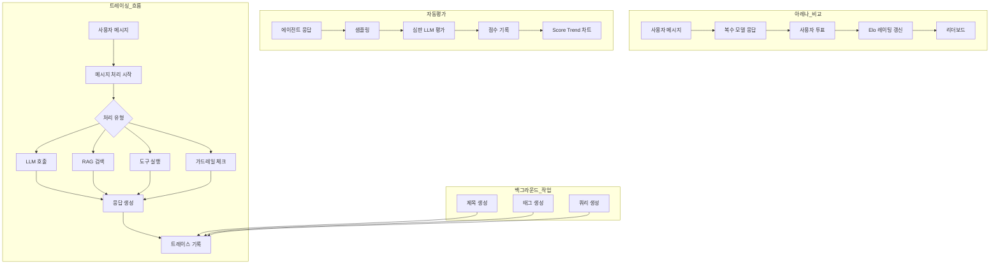

# 평가 & 트레이싱

> AI 응답 품질을 자동으로 평가하고, 모델을 비교하며, 요청의 전체 처리 과정을 단계별로 추적하세요.



---

## 탭 구성

**관리자 > 평가** 화면은 다음 5개의 서브 탭으로 구성됩니다:

| 탭 | 설명 |
|------|------|
| **Arena** | 아레나 모델 비교 설정 |
| **Leaderboard** | Elo 기반 모델 순위표 |
| **Feedbacks** | 사용자 피드백 이력 |
| **Auto Evaluations** | 자동 평가 결과 및 차트 |
| **Tracing** | 요청 처리 추적 및 분석 |

---

## Arena (아레나)

**관리자 > 평가 > Arena**에서 모델 비교 기능을 설정합니다.

아레나는 사용자가 동일한 질문에 대해 여러 모델의 응답을 비교하고, 어떤 모델이 더 나은지 투표할 수 있는 기능입니다. 투표 결과는 Elo 레이팅 시스템으로 집계되어 리더보드에 반영됩니다.

> 이전에는 **관리자 > 설정**에 있던 아레나 모델 설정이 **관리자 > 평가 > Arena** 탭으로 이동되었습니다.

### 아레나 모델 활성화

| 항목 | 설명 |
|------|------|
| **Arena Models 스위치** | 아레나 모델 기능 활성화/비활성화 |

> 메시지 평가(Message Rating) 기능이 활성화되어 있어야 이 기능을 사용할 수 있습니다.

### 아레나 모델 관리

활성화하면 아레나에 사용할 커스텀 모델을 추가하고 관리할 수 있습니다.

| 기능 | 설명 |
|------|------|
| **모델 추가** | + 버튼으로 새 아레나 모델 생성 |
| **모델 편집** | 기존 모델의 설정 아이콘 클릭 |
| **모델 삭제** | 편집 모달에서 삭제 |

### 아레나 모델 설정 항목

| 항목 | 설명 |
|------|------|
| **이름** | 아레나 모델 표시 이름 |
| **ID** | 고유 식별자 (생성 후 변경 불가) |
| **프로필 이미지** | 모델 아바타 이미지 |
| **설명** | 모델 설명 |
| **접근 제어** | 특정 그룹/조직에 대한 접근 권한 설정 |
| **모델 목록** | 포함/제외할 실제 모델 선택 (비워두면 전체 모델 포함) |
| **필터 모드** | Include(포함) 또는 Exclude(제외) |

아레나 모델을 추가하지 않으면 시스템에 등록된 모든 모델이 아레나에 사용됩니다.

---

## Leaderboard (리더보드)

**관리자 > 평가 > Leaderboard**에서 모델별 순위를 확인합니다.

리더보드는 사용자의 피드백(투표) 데이터를 기반으로 Elo 레이팅 시스템을 사용하여 모델 순위를 산출합니다.

### 리더보드 테이블

| 열 | 설명 |
|------|------|
| **RK** | 순위 (레이팅 기준) |
| **Model** | 모델 이름 및 아바타 |
| **Rating** | Elo 레이팅 점수 (초기값 1000) |
| **Won** | 승리 횟수 (호버 시 승률% 표시) |
| **Lost** | 패배 횟수 (호버 시 패배율% 표시) |

> 투표 데이터가 없는 모델은 순위에 "-"로 표시됩니다.

### 토픽 검색

검색창에 키워드를 입력하면 해당 토픽과의 유사도를 기반으로 모델 순위가 재정렬됩니다. 이를 통해 특정 주제에서 어떤 모델이 더 뛰어난지 확인할 수 있습니다.

- 검색어 입력 시 브라우저 내 임베딩 모델이 로드됩니다
- 각 피드백의 태그와 검색어 사이의 코사인 유사도가 계산됩니다
- 유사도가 높은 피드백에 더 큰 가중치가 부여되어 Elo가 재산출됩니다

---

## Feedbacks (피드백)

**관리자 > 평가 > Feedbacks**에서 사용자의 피드백 이력을 확인합니다.

사용자가 채팅에서 모델 응답에 대해 남긴 평가(승/무/패) 데이터를 테이블 형태로 조회할 수 있습니다.

### 피드백 테이블

| 열 | 설명 |
|------|------|
| **User** | 피드백을 남긴 사용자 아바타 |
| **Models** | 평가된 모델 및 비교 대상 모델 |
| **Result** | Won(승) / Draw(무) / Lost(패) 배지 |
| **Updated At** | 피드백 시간 (상대 시간) |
| **Actions** | 트레이스 보기 링크, 삭제 메뉴 |

### 피드백 상세 모달

피드백 행을 클릭하면 상세 정보를 확인할 수 있습니다:

| 항목 | 설명 |
|------|------|
| **ID** | 피드백 고유 식별자 |
| **Message ID / Chat ID** | 관련 메시지 및 채팅 식별자 |
| **User** | 피드백 사용자 이름 및 아바타 |
| **Result** | 평가 결과 (Won/Draw/Lost) |
| **Evaluated Model** | 평가 대상 모델 |
| **Compared Models** | 비교 대상 모델 목록 |
| **Reason** | 선택 이유 |
| **Comment** | 사용자 코멘트 |
| **Tags** | 관련 태그 |
| **View Trace** | 해당 트레이스로 바로 이동 |

### 내보내기 및 공유

| 기능 | 설명 |
|------|------|
| **Export** | 전체 피드백을 JSON 파일로 다운로드 |
| **Share to Community** | 개인정보를 제외하고 평가 데이터를 커뮤니티 리더보드에 공유 |

> 공유 시 채팅 로그는 포함되지 않으며, 평가 결과, 모델 ID, 태그, 메타데이터만 전송됩니다.

---

## 자동 평가 결과 (Auto Evaluations)

**관리자 > 평가 > Auto Evaluations**에서 에이전트별 응답 품질 점수를 확인합니다.

에이전트 설정에서 자동 평가를 활성화한 경우, 응답 후 비동기로 심판 LLM이 품질을 평가하고 결과를 기록합니다.


### 필터 옵션

| 필터 | 설명 |
|------|------|
| **날짜 범위** | 평가 기간 선택 (최근 1일/7일/30일/전체/커스텀) |
| **모델** | 특정 모델로 필터 (복수 선택 가능) |
| **평가 유형** | 검색 품질 / 충실성 / 응답 품질 (복수 선택 가능) |
| **상태** | Pending / Completed / Failed (복수 선택 가능) |

### Score Trend 차트

날짜별 평균 점수 추이를 Plotly 라인 차트로 시각화합니다.

- **모든 유형 선택 시**: 모델별 평균 점수 라인
- **특정 유형 선택 시**: 모델+유형별 세분화 라인

차트 시간 단위를 변경할 수 있습니다:

| 단위 | 설명 |
|------|------|
| **Hour** | 시간별 집계 |
| **Day** | 일별 집계 (기본값) |
| **Week** | 주별 집계 |
| **Month** | 월별 집계 |

기본적으로 데이터 범위에 따라 자동으로 최적의 단위가 선택됩니다. 필터 변경 시 차트 데이터가 자동으로 갱신됩니다.

### 평가 유형

| 유형 | 설명 |
|------|------|
| **검색 품질 (Retrieval Quality)** | 검색된 문서의 질문 관련성 |
| **충실성 (Faithfulness)** | 검색 내용 기반 답변 여부 (환각 없음) |
| **응답 품질 (Response Quality)** | 전반적인 유용성·정확성 |

### 평가 상세 모달

테이블에서 개별 평가 항목을 클릭하면 상세 정보를 확인할 수 있습니다:

| 항목 | 설명 |
|------|------|
| **Status** | 평가 상태 (Completed/Pending/Failed) |
| **Score** | 평가 점수 (백분율 표시, 색상 구분) |
| **Type** | 평가 유형 |
| **Created** | 평가 시각 |
| **Evaluated Model** | 평가 대상 모델 |
| **Judge Model** | 심판 LLM 모델 |
| **Error** | 실패 시 오류 메시지 |
| **Evaluation Reasoning** | 심판 LLM의 평가 근거 |
| **User Query** | 원본 사용자 질문 |
| **Assistant Response** | AI 응답 내용 |
| **Retrieved Contexts** | 검색된 문서 목록 (소스, 내용) |
| **Additional Details** | 추가 세부 정보 (JSON) |

### 내보내기

상단의 내보내기 버튼으로 전체 자동 평가 데이터를 다운로드할 수 있습니다:

| 형식 | 설명 |
|------|------|
| **CSV** | CSV 파일로 내보내기 |
| **JSON** | JSON 파일로 내보내기 |

> 에이전트에서 자동 평가 설정하는 방법: [에이전트 문서](../workspace/agents.md)

---

## 트레이싱이란?

**트레이싱(Tracing)**은 AI 요청이 처리되는 전 과정을 추적하고 기록하는 기능입니다. LangSmith와 유사한 방식으로 각 처리 단계(Run)를 트리 구조로 시각화하여, 복잡한 AI 워크플로우의 실행 흐름을 투명하게 파악할 수 있습니다.

**주요 기능:**
- 메시지별 전체 처리 과정 추적
- LLM 호출, 도구 실행, RAG 검색 등 각 단계 상세 정보
- 입력/출력 데이터 확인
- 토큰 사용량 및 지연 시간 측정
- 오류 발생 지점 파악

---

## 트레이싱 화면 접근

**관리자 > 평가 > 트레이싱** 탭에서 접근할 수 있습니다.

<!-- 스크린샷: 트레이싱 메인 화면
     - 검색 필터
     - 메시지 카드 목록
     파일명: images/admin-tracing-main.png
-->

---

## 채팅/메시지 검색

트레이스를 조회하려면 먼저 **Chat ID** 또는 **Message ID**를 입력해야 합니다.

<!-- 스크린샷: 검색 입력 영역
     파일명: images/admin-tracing-search.png
-->

### 검색 옵션

| 검색 타입 | 설명 |
|----------|------|
| **Chat ID** | 특정 채팅의 모든 트레이스 조회 |
| **Message ID** | 특정 메시지의 트레이스만 조회 |

### 필터 옵션

| 필터 | 옵션 |
|------|------|
| **기간** | 최근 1일, 7일, 30일, 전체 |
| **상태** | Success, Error, Running, Pending |
| **유형** | Chain, LLM, Tool, Retrieval, Web Search, Guardrail, Embedding |

---

## 트레이스 상세 조회

검색 결과에서 메시지 카드를 클릭하면 상세 트레이스 정보를 확인할 수 있습니다.

<!-- 스크린샷: 트레이스 상세 모달
     - 좌측: Runs 트리
     - 우측: 선택된 Run 상세 정보
     파일명: images/admin-tracing-detail.png
-->

### 트레이스 상세 헤더

상세 모달의 헤더에는 다음 정보가 표시됩니다:

| 항목 | 설명 |
|------|------|
| **Trace Detail** | 모달 제목 |
| **에이전트/모델 이름** | 최상위 Run의 이름 (에이전트명 또는 모델명) 이 배지로 표시됩니다 |
| **View Report** | 기존 분석 리포트가 있는 경우 표시 |
| **Copy Trace** | 트레이스 전체 데이터를 클립보드에 텍스트로 복사 |
| **Analyze Trace** | 트레이스 분석 시작 |

### 메시지 카드

각 메시지 카드에는 다음 정보가 표시됩니다:

| 항목 | 설명 |
|------|------|
| **사용자 메시지** | 원본 입력 메시지 (최대 2줄) |
| **Message ID** | 메시지 식별자 (축약 표시) |
| **시간** | 요청 시간 |
| **총 지연시간** | 전체 처리 시간 |
| **트레이스 배지** | 각 트레이스 유형별 상태 표시 |

### Runs 트리 구조

좌측 패널에서는 처리 단계가 트리 구조로 표시됩니다:

```
[CH] Response               2.34s  ●
  ├─ [LM] GPT-4             1.89s  ●
  ├─ [RG] KnowledgeBase     0.32s  ●
  └─ [TL] web_search        0.13s  ●
```

**Run 타입 표시:**

| 약어 | 타입 | 색상 | 설명 |
|-----|------|------|------|
| **CH** | Chain | 보라색 | 복합 작업 (메시지 처리) |
| **LM** | LLM | 파란색 | LLM API 호출 |
| **TL** | Tool | 초록색 | 도구 실행 |
| **RG** | Retrieval | 주황색 | RAG 문서 검색 |
| **WB** | Web Search | 청록색 | 웹 검색 |
| **GD** | Guardrail | 빨간색 | 가드레일 체크 |
| **EM** | Embedding | 노란색 | 임베딩 생성 |
| **IM** | Image | 분홍색 | 이미지 생성 |
| **ACT** | Action | 보라색 | Tool + 하위 작업 그룹 |

**상태 표시:**

| 아이콘 | 상태 |
|-------|------|
| ● (초록) | Success |
| ● (빨강) | Error |
| ◐ (노랑) | Running |
| ○ (회색) | Pending |

### Inputs/Outputs 확인

우측 패널에서 선택한 Run의 상세 정보를 확인할 수 있습니다:

<!-- 스크린샷: Run 상세 정보 패널
     파일명: images/admin-tracing-run-detail.png
-->

| 섹션 | 설명 |
|------|------|
| **Status** | 상태, 지연시간, 모델 ID |
| **Inputs** | 입력 데이터 |
| **Outputs** | 출력 데이터 |
| **Error** | 오류 메시지 (오류 시) |
| **Token Usage** | 토큰 사용량 (LLM 타입) |

### 뷰 모드

Inputs와 Outputs는 세 가지 형식으로 볼 수 있습니다:

| 모드 | 설명 |
|------|------|
| **Tree** | 계층적 트리 구조로 표시 (기본) |
| **JSON** | 원본 JSON 형식으로 표시 |
| **Text** | 평문 텍스트로 표시 |

---

## 검색 및 이동

Outputs 영역에서 텍스트를 검색할 수 있습니다.

<!-- 스크린샷: Outputs 검색 기능
     파일명: images/admin-tracing-search-output.png
-->

### 검색어 하이라이트

검색어를 입력하면 매칭되는 텍스트가 노란색으로 하이라이트됩니다.

### 이동 기능

| 단축키 | 동작 |
|--------|------|
| **Enter** | 다음 매치로 이동 |
| **Shift + Enter** | 이전 매치로 이동 |

매치 개수는 검색창 옆에 `1/5` 형식으로 표시됩니다.

---

## 트레이스 유형

### 메인 응답 트레이스

사용자 메시지에 대한 AI 응답 생성 과정입니다.

| 유형 | 설명 |
|------|------|
| **Response** | 전체 응답 생성 (Chain) |
| **LLM** | LLM API 호출 |
| **RAG** | 지식베이스 검색 |
| **Tool** | 도구 실행 |
| **Search** | 웹 검색 |
| **Guard** | 가드레일 체크 |

### 백그라운드 작업 트레이스

채팅 보조 기능을 위한 백그라운드 작업입니다.

| 유형 | 설명 |
|------|------|
| **Title** | 채팅 제목 자동 생성 |
| **Tag** | 채팅 태그 자동 생성 |
| **Query** | RAG 검색 쿼리 생성 |
| **Emoji** | 채팅 이모지 생성 |
| **Autocomplete** | 자동완성 제안 |
| **Function** | 함수 호출 판단 |

---

## 트레이스 분석 리포트

트레이스 데이터를 LLM으로 분석하여 문제의 근본 원인을 자동으로 파악하는 기능입니다.

<!-- 스크린샷: 트레이스 분석 리포트 모달
     - 리포트 내용 (마크다운 렌더링)
     - 복사/다운로드 버튼
     파일명: images/admin-tracing-analysis-report.png
-->

### 분석 시작

트레이스 상세 모달 상단의 **"트레이스 분석"** 버튼을 클릭합니다.

<!-- 스크린샷: 트레이스 분석 버튼 및 입력 폼
     - 분석 모델 선택 드롭다운
     - 문제 설명 입력 영역
     파일명: images/admin-tracing-analysis-form.png
-->

| 입력 항목 | 설명 | 필수 |
|----------|------|------|
| **분석 모델** | 분석에 사용할 LLM 모델 선택 | 필수 |
| **문제 설명** | 관찰된 문제 상황 기술 (예: "답변이 X였는데 Y여야 합니다") | 선택 |

**"분석 시작"** 버튼을 클릭하면 백그라운드에서 LLM 분석이 진행되며, 완료 시 자동으로 리포트가 표시됩니다.

### 리포트 구조

분석 리포트는 다음 섹션으로 구성됩니다:

| 섹션 | 설명 |
|------|------|
| **요약 (Executive Summary)** | 분석 결과 요약 (2~3문장) |
| **트레이스 개요** | Trace ID, 상태, 총 지연시간, 토큰 수, Run 수, 오류 수 |
| **근본 원인 분석** | 주요 원인 및 기여 요인 |
| **Phase 1 분석: 도구 선택 및 실행** | 올바른 도구 호출 여부, 누락된 도구 확인 |
| **Phase 2 분석: 최종 답변 생성** | 수집된 데이터 대비 답변 적절성 |
| **프롬프트 및 시스템 설정 이슈** | 시스템 프롬프트, 포맷 프롬프트 관련 문제 |
| **지식베이스(RAG) 이슈** | KB 검색 결과 관련 문제 (해당 시) |
| **데이터베이스(NL-to-SQL) 이슈** | DB 쿼리 관련 문제 (해당 시) |
| **용어집 이슈** | 용어집 적용 관련 문제 (해당 시) |
| **가드레일 이슈** | 가드레일 간섭 여부 (해당 시) |
| **오류 분석** | 에러 발생 Run 분석 (해당 시) |
| **개선 권장사항** | 즉시 조치, 설정 변경, 데이터 개선, 아키텍처 제안 |

### 트레이스 데이터 복사

트레이스 상세 모달 헤더의 **"Copy Trace"** 버튼을 클릭하면, 트레이스 전체 구조(Trace ID, Chat ID, 상태, 총 지연시간, 총 토큰 수, 각 Run의 이름/유형/입출력/모델 정보)가 텍스트 형식으로 클립보드에 복사됩니다. 이 데이터를 외부 도구나 다른 LLM에 붙여넣어 분석에 활용할 수 있습니다.

### 리포트 복사 및 다운로드

리포트 모달 상단에서 다음 기능을 사용할 수 있습니다:

| 기능 | 설명 |
|------|------|
| **복사** | 리포트 전체 텍스트를 클립보드에 복사 |
| **다운로드** | 마크다운 파일(.md)로 다운로드 |

### 기존 리포트 조회

이전에 분석한 리포트가 있는 경우, 트레이스 상세 모달에 **"리포트 보기"** 버튼이 표시됩니다. 클릭하면 가장 최근 분석 결과를 재분석 없이 바로 확인할 수 있습니다.

---

## 활용 사례

### 사례 1: 응답 품질 디버깅

**목표:** AI 응답이 예상과 다른 경우 원인 파악

**방법:**
1. 해당 채팅의 Chat ID 복사
2. 트레이싱에서 검색
3. 해당 메시지의 트레이스 확인
4. LLM Run의 Inputs에서 전달된 프롬프트 확인
5. RAG Run의 Outputs에서 검색된 문서 확인

### 사례 2: 지연 시간 분석

**목표:** 응답이 느린 원인 파악

**방법:**
1. 느린 응답의 트레이스 조회
2. 각 Run의 지연 시간 확인
3. 가장 오래 걸린 단계 식별
4. 해당 단계 최적화 (예: RAG 검색 문서 수 조정)

### 사례 3: 도구 실행 오류 추적

**목표:** 도구 호출 실패 원인 파악

**방법:**
1. Error 상태의 트레이스 필터링
2. 오류가 발생한 Tool Run 선택
3. Error 섹션에서 오류 메시지 확인
4. Inputs에서 전달된 파라미터 확인

### 사례 4: 토큰 사용량 분석

**목표:** 특정 요청의 토큰 소비량 확인

**방법:**
1. 해당 메시지의 트레이스 조회
2. 각 LLM Run의 Token Usage 확인
3. 상단의 총 토큰 수로 전체 소비량 확인

---

## FAQ

**Q: 모든 채팅이 트레이싱되나요?**
> 네, 시스템에서 처리되는 모든 AI 요청은 자동으로 트레이싱됩니다.

**Q: 트레이스 데이터는 얼마나 보관되나요?**
> 기본적으로 영구 보관됩니다. 관리자는 `/api/traces/cleanup` API를 통해 오래된 데이터를 정리할 수 있습니다.

**Q: 일반 사용자도 트레이싱을 볼 수 있나요?**
> 일반 사용자는 자신의 트레이스만 조회할 수 있습니다. 관리자는 모든 사용자의 트레이스를 조회할 수 있습니다.

**Q: 트레이싱이 성능에 영향을 미치나요?**
> 트레이싱은 비동기로 처리되어 응답 속도에 미치는 영향이 최소화됩니다.

**Q: 특정 메시지의 트레이스를 직접 확인할 수 있나요?**
> 채팅 화면에서 메시지 옵션 메뉴의 "트레이싱 보기" 기능을 사용하면 해당 트레이스 화면으로 바로 이동합니다.

---

## 다음 단계

- 📊 [모니터링](./monitoring.md)
- 👥 [사용자 관리](./users.md)
- ⚙️ [시스템 설정](./settings.md)
