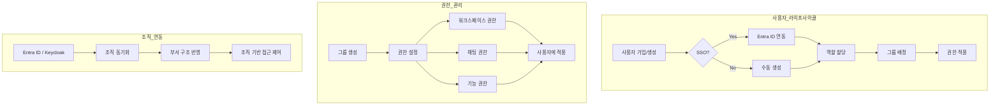
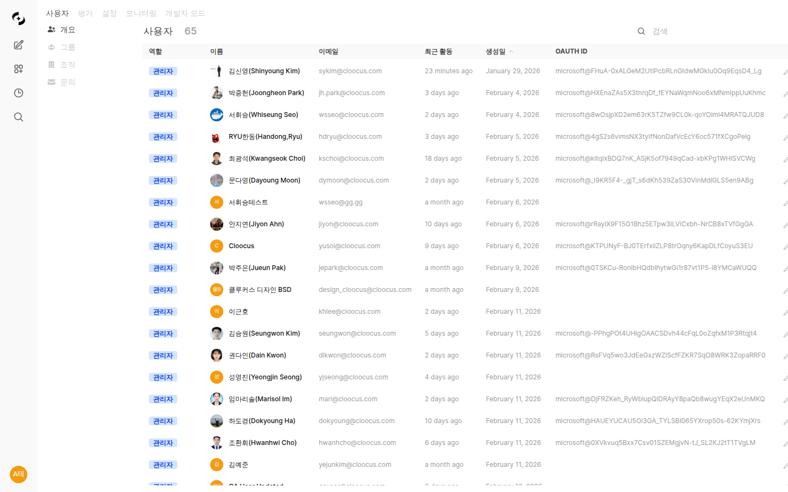

# 사용자 관리

> 조직 구조에 맞는 체계적인 사용자 및 권한 관리로 보안과 효율성을 동시에 확보하세요. Microsoft Entra ID 연동으로 기존 조직 체계를 그대로 활용할 수 있습니다.



---

## 사용자 관리 개요

**관리자 > 사용자**에서 모든 사용자와 그룹을 관리합니다.



### 탭 구성

| 탭 | 기능 |
|----|------|
| **사용자 목록** | 개별 사용자 관리 |
| **그룹 및 권한** | 권한 그룹 관리 |
| **조직** | 조직 단위 동기화 |
| **문의** | 사용자 문의 관리 |

---

## 사용자 목록

### 사용자 조회


| 컬럼 | 설명 |
|------|------|
| **이름** | 사용자 표시 이름 |
| **이메일** | 로그인 이메일 |
| **역할** | admin, user, pending |
| **마지막 활동** | 최근 접속 시간 |
| **가입일** | 계정 생성일 |

### 검색 및 필터

- **검색**: 이름 또는 이메일로 검색
- **정렬**: 이름, 가입일, 최근 활동순
- **필터**: 역할별 필터링

<!-- 스크린샷: 검색 및 필터 UI
     파일명: images/admin-users-search.png
-->

### 사용자 역할

| 역할 | 설명 | 권한 |
|------|------|------|
| **Admin** | 관리자 | 모든 기능 접근 |
| **User** | 일반 사용자 | 채팅 및 워크스페이스 사용 |
| **Pending** | 승인 대기 | 승인 전까지 접근 불가 |

### 슈퍼어드민(SA) 지정

특정 관리자를 **슈퍼어드민(Super Admin)**으로 지정하여 최상위 권한을 부여할 수 있습니다.

<!-- 스크린샷: 슈퍼어드민 지정 UI
     파일명: images/admin-users-superadmin.png
-->

**슈퍼어드민의 특징:**
- 모든 설정 및 사용자 관리 권한 보유
- 다른 관리자의 권한을 변경 가능
- 시스템 핵심 설정(라이선스, 인증 등) 접근 가능
- 사용자 편집 화면에서 **"슈퍼어드민으로 지정"** 토글로 설정

> **주의:** 슈퍼어드민은 최소한의 인원에게만 부여하세요. 일반 Admin과 달리 시스템 전체에 대한 무제한 접근 권한을 가집니다.

### 사용자 추가

**"+ 사용자 추가"** 버튼을 클릭합니다.

<!-- 스크린샷: 사용자 추가 모달
     파일명: images/admin-users-add.png
-->

| 필드 | 설명 |
|------|------|
| **이메일** | 사용자 이메일 |
| **이름** | 표시 이름 |
| **비밀번호** | 초기 비밀번호 |
| **역할** | 부여할 역할 |

### 사용자 편집

사용자 목록에서 **사용자 이름 또는 프로필 이미지를 클릭**하면 수정 모달이 열립니다.

<!-- 스크린샷: 사용자 편집 모달
     파일명: images/admin-users-edit.png
-->

**수정 가능 항목:**
- 이름
- 역할
- 프로필 이미지
- 비밀번호 초기화
- 슈퍼어드민(SA) 지정
- 일별 토큰 제한 (사용량 제한 활성화 시) — 0으로 설정 시 무제한, 전역/사용자/그룹/조직 4단계 중 **가장 관대한(높은) 값**이 최종 적용됩니다
- **소속 그룹 관리** — 모달 하단에서 해당 사용자가 속한 그룹을 조회하고, 그룹 칩을 클릭하여 추가/제거할 수 있습니다

#### 그룹 관리 (수정 모달 내)

수정 모달 하단에 사용자의 **소속 그룹 목록**이 칩(chip) 형태로 표시됩니다.

- **초록색 칩**: 현재 소속된 그룹
- 칩을 클릭하면 그룹 소속을 **토글**(추가/제거)할 수 있습니다
- 변경 사항은 저장 시 즉시 반영됩니다

> **💡 팁:** 여러 사용자의 그룹을 빠르게 변경하려면, 사용자 이름을 차례로 클릭하여 수정 모달에서 바로 그룹을 조정하세요.

### 사용자 삭제

**주의:** 삭제된 사용자의 채팅 기록도 함께 삭제됩니다.

<!-- 스크린샷: 삭제 확인 다이얼로그
     파일명: images/admin-users-delete.png
-->

### 사용자 채팅 보기

관리자는 사용자의 채팅 기록을 확인할 수 있습니다.

<!-- 스크린샷: 사용자 채팅 목록 모달
     파일명: images/admin-users-chats.png
-->

---

## 그룹 관리

그룹은 사용자들을 묶어 권한을 일괄 관리하는 단위입니다.

### 그룹이 필요한 이유

| 개별 관리 | 그룹 관리 |
|----------|----------|
| 사용자마다 권한 설정 | 그룹에 한 번 설정 |
| 변경 시 일일이 수정 | 그룹 설정만 변경 |
| 관리 어려움 | 체계적 관리 |

### 그룹 목록

<!-- 스크린샷: 그룹 목록 화면
     파일명: images/admin-groups-list.png
-->

### 그룹 생성

**"+ 새 그룹"** 버튼을 클릭합니다.

<!-- 스크린샷: 그룹 생성 폼
     파일명: images/admin-groups-create.png
-->

| 필드 | 설명 | 예시 |
|------|------|------|
| **이름** | 그룹 이름 | "마케팅팀" |
| **설명** | 그룹 설명 | "마케팅 부서 사용자 그룹" |

### 그룹 권한 설정

그룹별로 세밀한 권한을 설정할 수 있습니다. 각 권한은 **4단계 레벨**로 세분화되어 있습니다.

<!-- 스크린샷: 그룹 권한 설정 화면 (4단계 세그먼트 버튼)
     파일명: images/admin-groups-permissions.png
-->

#### 권한 레벨

모든 워크스페이스 및 관리자 권한은 다음 4단계로 설정합니다:

| 레벨 | 설명 |
|------|------|
| **없음 (None)** | 해당 기능에 접근 불가 |
| **접근 (Access)** | 목록 조회 가능 (읽기/쓰기 불가) |
| **읽기 (Read)** | 목록 조회 + 상세 내용 확인 가능 |
| **쓰기 (Write)** | 조회 + 생성/편집/삭제 가능 |

> **💡 참고:** 기존에 ON/OFF로 설정된 권한은 자동으로 변환됩니다 (OFF → 없음, ON → 쓰기).

#### 워크스페이스 권한

| 권한 | 없음 | 접근 | 읽기 | 쓰기 |
|------|------|------|------|------|
| **에이전트** | 접근 불가 | 목록만 조회 | 에이전트 상세 확인 | 에이전트 생성/편집 |
| **지식베이스** | 접근 불가 | 목록만 조회 | 지식베이스 상세 확인 | 지식베이스 생성/편집 |
| **프롬프트** | 접근 불가 | 목록만 조회 | 프롬프트 상세 확인 | 프롬프트 생성/편집 |
| **도구** | 접근 불가 | 목록만 조회 | 도구 연결 상세 확인 | 도구 연결 생성/편집 |
| **데이터베이스** | 접근 불가 | 목록만 조회 | DB 연결 상세 확인 | DB 연결 생성/편집 |
| **용어집** | 접근 불가 | 목록만 조회 | 용어집 상세 확인 | 용어집 생성/편집 |
| **가드레일** | 접근 불가 | 목록만 조회 | 가드레일 상세 확인 | 가드레일 생성/편집 |
| **에이전트 플로우** | 접근 불가 | 목록만 조회 | 플로우 상세 확인 | 플로우 생성/편집 |

#### 관리자 권한

관리자 영역 기능에 대한 접근 권한도 동일한 4단계 레벨로 설정합니다.

| 권한 | 없음 | 접근 | 읽기 | 쓰기 |
|------|------|------|------|------|
| **사용자 관리** | 접근 불가 | 사용자 목록 조회 | 사용자 상세 확인 | 사용자 생성/편집/삭제 |
| **시스템 설정** | 접근 불가 | 설정 목록 조회 | 설정 값 확인 | 설정 변경 |
| **평가** | 접근 불가 | 평가 목록 조회 | 평가 상세 확인 | 평가 설정 변경 |
| **모니터링** | 접근 불가 | 모니터링 조회 | 상세 데이터 확인 | 데이터 관리 |
| **함수** | 접근 불가 | 함수 목록 조회 | 함수 상세 확인 | 함수 생성/편집/삭제 |

#### 공유 권한

| 권한 | 설명 |
|------|------|
| **에이전트 공유** | 에이전트를 다른 사용자와 공유 |
| **지식베이스 공유** | 지식베이스 공유 |
| **프롬프트 공유** | 프롬프트 공유 |

#### 채팅 권한

| 권한 | 설명 |
|------|------|
| **파일 업로드** | 채팅에 파일 첨부 |
| **채팅 삭제** | 자신의 채팅 삭제 |
| **메시지 편집** | 메시지 수정 |
| **음성 입력** | STT 사용 |
| **음성 출력** | TTS 사용 |
| **음성 통화** | 음성 대화 기능 |
| **멀티 모델** | 여러 모델 동시 사용 |
| **임시 채팅** | 저장 안 되는 채팅 |

#### 기능 권한

| 권한 | 설명 |
|------|------|
| **직접 도구 서버** | 개인 도구 서버 연결 |
| **웹 검색** | 웹 검색 기능 사용 |
| **이미지 생성** | AI 이미지 생성 |
| **코드 실행** | 코드 인터프리터 사용 |

### 그룹 레벨 가드레일 설정

그룹별로 별도의 가드레일 정책을 설정할 수 있습니다. 그룹 편집 화면의 **"가드레일"** 탭에서 설정합니다.

<!-- 스크린샷: 그룹 가드레일 설정 화면
     파일명: images/admin-groups-guardrails.png
-->

**설정 항목:**
- 입력 가드레일 (사용자 메시지 필터링)
- 출력 가드레일 (AI 응답 필터링)
- PII 감지 규칙
- 커스텀 콘텐츠 필터

> **참고:** 그룹 가드레일은 전역 가드레일 설정에 추가로 적용됩니다. 전역 설정보다 더 엄격한 규칙만 추가할 수 있습니다.

### 그룹에 사용자 추가

<!-- 스크린샷: 그룹 멤버 관리 화면
     파일명: images/admin-groups-members.png
-->

1. 그룹 편집 화면 진입
2. "멤버" 탭 선택
3. "사용자 추가" 클릭
4. 추가할 사용자 선택

### 그룹에 조직 단위 할당

그룹 편집 모달의 **"조직" 탭**에서 해당 그룹에 조직 단위(Org Unit)를 할당할 수 있습니다. 조직 구조(부서)와 그룹 권한을 함께 관리하여 대기업 조직 체계에 정확히 대응할 수 있습니다.

<!-- 스크린샷: 그룹 편집 모달의 조직 탭
     파일명: images/admin-groups-organizations.png
-->

**설정 방법:**
1. 그룹 편집 화면 진입
2. **"조직"** 탭 선택
3. 목록에서 할당할 조직 단위를 체크
4. 저장

**동작 방식:**
- 하나의 조직 단위는 **한 그룹에만** 할당됩니다. 이미 다른 그룹에 할당된 조직 단위는 목록에서 숨겨집니다.
- 선택된 조직 단위는 **"할당됨(Assigned)"** 배지로 표시되며, 상단에 우선 정렬됩니다.
- 조직 단위를 할당하면, 그 조직 단위에 속한 사용자들이 그룹 권한을 자연스럽게 상속받습니다.

> **💡 팁:** 부서 기반 그룹(예: "마케팅팀")을 만들고 해당 부서의 조직 단위를 연결하면, 조직 동기화로 부서원이 추가/제거될 때 그룹 멤버십도 자동으로 반영됩니다.

### 그룹별 사용량 제한

그룹 편집의 General 탭에서 **일별 토큰 제한**을 설정할 수 있습니다. 0으로 설정하면 무제한이며, 그룹 내 모든 사용자에 적용됩니다.

> **참고:** 사용자가 여러 계층(전역, 사용자, 그룹, 조직)에서 제한이 설정된 경우 **가장 관대한(높은) 값**이 적용됩니다.

### 기본 권한 설정

그룹에 속하지 않은 사용자의 기본 권한을 설정합니다.

<!-- 스크린샷: 기본 권한 설정 섹션
     파일명: images/admin-groups-default.png
-->

---

## 조직 관리

Microsoft Entra ID(Azure AD), Google Workspace, Keycloak과 연동하여 조직 구조를 동기화합니다.

### 조직 동기화 Provider

| Provider | 설명 |
|----------|------|
| **Microsoft Entra ID** | Azure AD 기반 조직 동기화 (기본) |
| **Google Workspace** | Google Admin Directory 기반 조직/그룹 동기화 |
| **Keycloak** | Keycloak 조직(Organization) 기반 동기화 |
| **JSON** | JSON 데이터로 수동 등록 |

> **Keycloak 연동:** Keycloak의 Organization 기능을 사용하여 부서 구조를 Cloosphere와 동기화할 수 있습니다. Keycloak 관리자 콘솔에서 조직 구조를 설정한 후, Cloosphere에서 동기화하면 자동으로 반영됩니다.

### OIDC 범용 부서 매핑

OIDC(OpenID Connect) 호환 IdP에서 사용자의 부서 정보를 자동으로 매핑할 수 있습니다.

<!-- 스크린샷: OIDC 부서 매핑 설정
     파일명: images/admin-org-oidc-mapping.png
-->

| 설정 | 설명 |
|------|------|
| **부서 Claim** | OIDC 토큰에서 부서 정보를 가져올 클레임 이름 (예: `department`, `org`) |
| **자동 조직 배정** | 로그인 시 클레임 값에 따라 자동으로 조직 단위에 배정 |

> **참고:** Entra ID, Keycloak 외에도 OIDC 표준을 지원하는 모든 IdP에서 부서 매핑을 사용할 수 있습니다.

### 조직 연동의 장점

| 기능 | 장점 |
|------|------|
| **자동 동기화** | 사용자 추가/삭제 자동 반영 |
| **조직 구조** | 부서 정보 자동 연동 |
| **권한 일원화** | AD 그룹 기반 권한 관리 |
| **SSO** | 회사 계정으로 간편 로그인 |

### 조직 단위 (OU) 관리

<!-- 스크린샷: 조직 단위 트리 화면
     파일명: images/admin-org-tree.png
-->

조직 단위는 트리 구조로 표시됩니다:

```
🏢 Cloocus (회사)
├── 📁 개발본부
│   ├── 📁 백엔드팀
│   ├── 📁 프론트엔드팀
│   └── 📁 DevOps팀
├── 📁 영업본부
│   ├── 📁 국내영업팀
│   └── 📁 해외영업팀
└── 📁 경영지원본부
    ├── 📁 인사팀
    └── 📁 재무팀
```

**조직 단위 / 그룹 탭 분리:**

Provider가 OU와 Group을 함께 제공하는 경우(Google Workspace, Keycloak 등), 목록 상단에 **[전체 / 조직 단위 / 그룹]** 탭이 자동으로 나타나 유형별로 구분 조회할 수 있습니다. 각 탭에는 해당 유형의 항목 수가 표시됩니다.

<!-- 스크린샷: 조직 단위 / 그룹 탭 분리
     파일명: images/admin-org-type-tabs.png
-->

### 조직 동기화

**"동기화"** 버튼을 클릭하면 동기화 모달이 열립니다. 데이터 소스(Provider)를 선택한 후, 가져올 대상을 체크하고 **"동기화"** 를 실행하면 최신 조직 정보가 반영됩니다.

<!-- 스크린샷: 조직 동기화 모달 (Provider 선택 + 옵션)
     파일명: images/admin-org-sync.png
-->

**동기화 모달 구성:**

| 항목 | 설명 |
|------|------|
| **데이터 소스** | JSON, Microsoft Entra ID, Google Workspace, Keycloak 중 택일 |
| **가져올 항목** | Provider별로 다른 옵션 (예: 조직 단위 / 그룹 / 부서) |
| **진행 상황** | 동기화 중 실시간으로 표시되며, 완료 시 조직·단위 수가 토스트로 안내 |

**동기화 내용:**
- 부서 구조 (조직 단위 / Org Unit)
- 사용자 소속 부서
- 그룹(선택 시) — 가져온 그룹도 조직 단위로 등록됨
- 매니저·직책 등 멤버 상세 정보

> **안전장치:** 동기화 시 빈 응답이 오더라도 기존 조직 데이터를 통째로 삭제하지 않습니다. 잘못된 자격 증명이나 일시적 네트워크 오류로 기존 데이터가 사라질 위험이 없습니다.

### Google Workspace 조직 동기화

Google Admin Directory API를 통해 Google Workspace의 조직 단위(OU), 그룹, 멤버 상세 정보를 자동으로 가져옵니다.

<!-- 스크린샷: Google Workspace 동기화 옵션 (조직 단위 / 그룹 체크박스)
     파일명: images/admin-org-sync-google.png
-->

**주요 특징:**
- 조직 단위(OU) 계층 전체를 동기화 — 하위 OU, 손자 OU까지 포함
- Google Groups를 조직 단위로 가져오기(선택 가능)
- 멤버 상세 정보(이름·이메일·직책) 함께 저장
- 외부 도메인 멤버는 자동 스킵되어, 워크스페이스 내부 멤버만 반영됨
- 대규모 조직에서도 병렬 처리와 지수 백오프 재시도로 안정적으로 동작

**Google 측 사전 준비:**

| 항목 | 설명 |
|------|------|
| **Google Workspace 관리자 계정** | Super Admin 권한 필요 |
| **Admin Directory API** | Google Cloud 프로젝트에서 활성화 |
| **서비스 계정** | 도메인 전체 위임(Domain-wide Delegation) 설정 필요 |
| **API 스코프** | `admin.directory.user.readonly`, `group.readonly`, `orgunit.readonly` 등 |

> 자격 증명(서비스 계정 키, 대행 관리자 이메일)은 **관리자 > 설정 > 인증 > Google** 섹션에서 먼저 구성합니다.

**동기화 UI:**

동기화 모달에서 데이터 소스로 **Google Workspace**를 선택하면 다음 옵션이 표시됩니다.

| 옵션 | 설명 |
|------|------|
| **조직 단위 (OU)** | Google Workspace의 조직 단위 계층 구조를 가져옵니다 |
| **그룹 (Group)** | Google Groups를 조직 단위로 가져옵니다 |

**가져올 대상**을 체크한 후 **"동기화"** 버튼을 클릭하면 진행 상황이 실시간으로 표시됩니다. 두 항목을 동시에 체크하여 한 번의 동기화로 OU 와 Group 을 함께 가져올 수 있습니다.

### 조직별 사용량 제한

조직 단위(팀) 상세 패널에서 **일별 토큰 제한**을 설정할 수 있습니다. 0으로 설정하면 무제한이며, 해당 조직 단위 내 모든 사용자에 적용됩니다.

### 조직 단위별 가드레일 설정

조직 단위(팀/부서)별로 가드레일 정책을 개별 설정할 수 있습니다. 조직 트리에서 해당 조직을 선택한 후 **방패 아이콘(🛡️) 버튼**을 클릭하여 가드레일 설정 모달을 엽니다.

<!-- 스크린샷: 조직 가드레일 설정 모달 (방패 아이콘 버튼)
     파일명: images/admin-org-guardrails.png
-->

**설정 방법:**
1. 조직 트리에서 대상 조직 단위 선택
2. 상세 패널의 **방패 아이콘(🛡️)** 버튼 클릭
3. 가드레일 설정 모달에서 정책 구성
4. 저장

**설정 항목:**
- 입력/출력 가드레일 규칙
- PII 감지 수준
- 콘텐츠 필터 정책

> **참고:** 조직 가드레일은 전역 가드레일 + 그룹 가드레일에 추가로 적용됩니다. 사용자에게는 소속된 모든 계층의 가드레일이 누적 적용됩니다.

### 조직 단위 권한 보기

조직 단위가 어떤 리소스에 접근 권한을 가지고 있는지 한눈에 확인할 수 있습니다. 조직 단위 행의 **"권한 보기"** 버튼(열쇠 아이콘)을 클릭하면 할당된 권한이 카테고리별로 표시됩니다.

<!-- 스크린샷: 조직 단위 권한 보기 모달
     파일명: images/admin-org-permissions.png
-->

**표시 카테고리:**

| 카테고리 | 설명 |
|----------|------|
| **지식베이스 (Knowledge)** | 접근 가능한 지식베이스 목록 |
| **도구 (Tools)** | 접근 가능한 도구 |
| **프롬프트 (Prompts)** | 접근 가능한 프롬프트 |
| **모델 (Models)** | 접근 가능한 모델 |
| **데이터베이스 (Database)** | 접근 가능한 DB 연결 |
| **가드레일 (Guardrails)** | 해당 조직 단위에 적용되는 가드레일 |
| **용어집 (Glossary)** | 접근 가능한 용어집 |

각 항목에는 **쓰기(Write)/읽기(Read)** 수준이 배지로 표시되며, 상위 조직 단위에서 상속받은 권한은 **"상속(Inherited)"** 배지로 구분됩니다.

### 조직 기반 접근 제어

리소스(에이전트, 지식베이스 등)에 조직 단위 기반 접근 권한을 설정할 수 있습니다.

<!-- 스크린샷: 접근 제어에서 조직 선택
     파일명: images/admin-org-access.png
-->

**예시:**
- "인사규정" 지식베이스 → 인사팀만 접근
- "영업 에이전트" → 영업본부만 접근
- "전사 공지" → 전체 조직 접근

---

## 문의 관리

관리자가 사용자로부터 접수된 문의를 관리하고 답변하는 기능입니다.

### 사용자 문의 보내기

일반 사용자는 사이드바 하단 메뉴에서 **"관리자에게 문의"**를 클릭하여 문의를 보낼 수 있습니다.

<!-- 스크린샷: 사용자 문의 모달
     파일명: images/admin-inquiry-user.png
-->

**문의 타입:**

| 타입 | 서브타입 | 설명 |
|------|----------|------|
| **사용량 제한** | 한도 증가 요청, 한도 확인 | 토큰 제한 관련 문의 |
| **기능** | 채팅, 에이전트, 지식베이스, 데이터베이스, 도구 | 기능 사용 관련 문의 |
| **버그** | 채팅 오류, 에이전트 오류, 업로드 오류, 기타 | 오류 신고 |
| **계정** | 권한 요청, 계정 문제 | 계정/권한 관련 |
| **기타** | 개선 제안, 기타 | 기타 문의 |

### 관리자 문의 관리

**관리자 > 사용자 > 문의** 탭에서 모든 문의를 관리합니다.

<!-- 스크린샷: 관리자 문의 칸반 보드
     파일명: images/admin-inquiry-kanban.png
-->

**뷰 모드:**
- **칸반 뷰**: 상태별 열(Open, In Progress, Resolved, Closed)에서 드래그앤드롭으로 상태 변경
- **리스트 뷰**: 전체 문의를 행 단위로 조회

**상태 흐름:**

```
Open → In Progress → Resolved → (사용자가) Closed
```

| 상태 | 설명 |
|------|------|
| **Open** | 새로 접수된 문의 |
| **In Progress** | 관리자가 검토 중 |
| **Resolved** | 관리자가 답변 완료 |
| **Closed** | 사용자가 답변을 확인하고 닫음 |

> **참고:** 관리자가 직접 "Closed"로 변경하면 사용자가 결과를 확인할 수 없으므로, "Resolved"로 설정하여 사용자가 확인 후 직접 닫도록 하는 것을 권장합니다.

### 답변 확인

사용자는 문의 모달의 **"내 문의"** 탭에서 관리자 답변을 확인할 수 있습니다. 미확인 답변이 있으면 사이드바 메뉴에 **녹색 배지**가 표시됩니다.

---

## 보안 설정

### 인증 설정

**관리자 > 설정 > 일반**에서 인증 관련 설정을 관리합니다.

<!-- 스크린샷: 인증 설정 섹션
     파일명: images/admin-auth-settings.png
-->

| 설정 | 설명 |
|------|------|
| **회원가입 허용** | 새 사용자 자체 가입 허용 여부 |
| **기본 역할** | 신규 사용자 기본 역할 |
| **JWT 만료** | 로그인 세션 유효 기간 |

### LDAP 설정

기업 LDAP 서버와 연동하여 인증할 수 있습니다.

<!-- 스크린샷: LDAP 설정 화면
     파일명: images/admin-ldap.png
-->

| 설정 | 설명 |
|------|------|
| **LDAP 서버** | 서버 주소 |
| **포트** | 연결 포트 |
| **Bind DN** | 바인드 계정 |
| **Search Base** | 검색 기준 |
| **필터** | 사용자 필터 |

### API 키 관리

API 키 기반 인증 설정입니다.

<!-- 스크린샷: API 키 설정
     파일명: images/admin-api-key.png
-->

### 외부 IDP ID 토큰 패스스루 인증 (Trusted Audiences)

호스트 시스템(예: 사내 포털)이 자체 SSO(Microsoft Entra ID, Google)로 발급받은 **ID 토큰을 그대로** Cloosphere API 의 `Authorization: Bearer <id_token>` 헤더로 전달해 인증할 수 있습니다. 별도의 Cloosphere JWT 발급 절차 없이, 호스트 시스템의 사용자 컨텍스트로 즉시 API 를 호출할 수 있습니다.

**관리자 > 설정 > 알림 (Trusted Audiences 섹션)** 에서 신뢰할 수 있는 IDP audience 를 등록합니다. 등록되지 않은 audience 의 토큰은 거부됩니다.

<!-- 스크린샷: Trusted Audiences 목록 화면
     파일명: images/admin-trusted-audiences-list.png
-->

#### Trusted Audience 등록

**"+ Trusted Audience 추가"** 버튼을 클릭하여 인증을 허용할 IDP 와 audience(client_id) 를 등록합니다.

| 필드 | 설명 |
|------|------|
| **IDP** | 토큰을 발급한 신원 공급자 (Microsoft Entra / Google) |
| **Label** | 관리자용 식별 이름 (예: "사내 포털 Prod") |
| **Audience (aud)** | Entra application(client) ID 또는 Google OAuth client ID |
| **Tenant ID** | (Entra 만 해당) 특정 테넌트 GUID. 비우면 모든 테넌트 허용 |
| **Issuer (선택적 override)** | Issuer URL 직접 지정. 비우면 IDP + tenant 로 자동 계산 |
| **활성화** | 이 audience 의 토큰 수락 여부 |
| **알 수 없는 사용자 자동 가입** | 토큰의 이메일이 Cloosphere 에 없으면 자동으로 사용자 생성 |
| **자동 생성 시 부여할 역할** | 자동 가입된 사용자의 초기 역할 (user / admin) |

<!-- 스크린샷: Trusted Audience 추가/편집 폼
     파일명: images/admin-trusted-audience-form.png
-->

#### 동작 방식

1. 호스트 시스템이 자체 SSO 흐름으로 사용자를 인증하고 ID 토큰을 발급받음
2. 호스트가 Cloosphere API 호출 시 `Authorization: Bearer <id_token>` 헤더에 토큰을 그대로 첨부
3. Cloosphere 가 토큰의 `iss`, `aud` 를 Trusted Audiences 목록과 대조하여 검증
4. 검증 통과 시 토큰의 이메일을 기준으로 Cloosphere 사용자에 매핑
   - 매핑되는 사용자가 없고 **자동 가입**이 켜져 있으면 새 계정 생성
   - 자동 가입이 꺼져 있고 사용자가 없으면 401 반환

> **참고:** 임베드 위젯의 SSO 토큰 교환과 달리, 이 방식은 토큰을 Cloosphere JWT 로 교환하지 **않고** 매 요청마다 IDP 토큰을 직접 검증합니다. 외부 백엔드 시스템이 Cloosphere API 를 자기 사용자 컨텍스트로 호출할 때 적합합니다.

> **보안:** Audience 화이트리스트로 보호됩니다. 등록되지 않은 클라이언트가 발급한 토큰은 거부되므로, 운영 환경에서는 반드시 신뢰할 수 있는 호스트 애플리케이션의 client ID 만 등록하세요.

---

## 사용자 활동 확인

### 접속 기록

사용자별 마지막 접속 시간을 확인할 수 있습니다.

### 채팅 기록

관리자는 필요시 사용자의 채팅 기록을 확인할 수 있습니다.

### 사용량

**관리자 > 모니터링**에서 사용자별 사용량을 확인할 수 있습니다.

<!-- 스크린샷: 사용자별 사용량 테이블
     파일명: images/admin-users-usage.png
-->

---

## 베스트 프랙티스

### 역할 관리

1. **Admin 최소화**: 관리자는 필요한 인원만
2. **Pending 활용**: 신규 가입 시 검토 후 승인
3. **정기 검토**: 퇴사자 계정 정리

### 그룹 설계

1. **부서 기반**: 부서별 그룹 생성
2. **역할 기반**: 직급/역할별 그룹 생성
3. **프로젝트 기반**: 프로젝트팀 그룹 생성

### 권한 설계

1. **최소 권한 원칙**: 필요한 권한만 부여
2. **그룹 우선**: 개별 권한보다 그룹 권한 활용
3. **정기 감사**: 권한 설정 주기적 검토

---

## FAQ

**Q: 사용자가 비밀번호를 잊어버렸어요.**
> 관리자가 사용자 편집에서 비밀번호를 초기화할 수 있습니다. SSO 사용 시 회사 IT 부서에 문의하세요.

**Q: 특정 사용자만 특정 에이전트를 사용하게 하려면?**
> 에이전트의 접근 권한 설정에서 특정 사용자 또는 그룹을 지정하세요.

**Q: 퇴사자 계정은 어떻게 처리하나요?**
> 계정을 삭제하거나 역할을 "Pending"으로 변경하여 비활성화하세요.

**Q: 조직 동기화가 안 돼요.**
> Azure AD 연결 설정을 확인하고, 필요한 권한이 부여되었는지 IT 관리자에게 문의하세요. Google Workspace의 경우 서비스 계정의 도메인 전체 위임이 올바르게 설정되었는지, Admin Directory API가 활성화되었는지 확인하세요.

**Q: 하나의 조직 단위를 여러 그룹에 할당할 수 있나요?**
> 아니요. 하나의 조직 단위는 한 그룹에만 할당됩니다. 이미 다른 그룹에 할당된 조직 단위는 그룹 편집 모달의 "조직" 탭 목록에서 표시되지 않습니다.

---

## 다음 단계

- ⚙️ [시스템 설정 관리](./settings.md)
- 📊 [사용량 모니터링](./monitoring.md)
