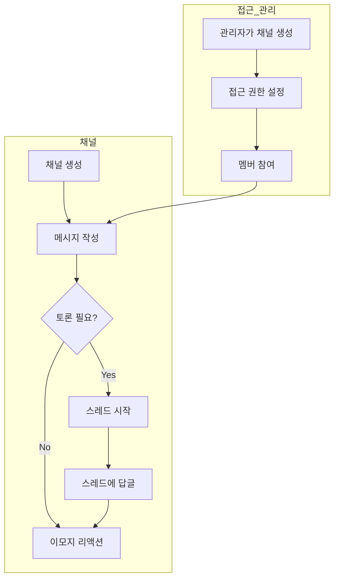

# 채널

> 채널은 팀 메시징을 위한 실시간 협업 공간입니다 -- 특정 주제에 대해 토론하고, 파일을 공유하며, 스레드와 이모지 리액션으로 대화를 체계적으로 관리할 수 있는 전용 공간입니다.

---

## 채널 화면 구성

<!-- 스크린샷: 사이드바, 메시지 목록, 입력 영역이 포함된 채널 메인 화면
     파일명: images/channels-main-view.png
-->

| 영역 | 기능 |
|------|------|
| **사이드바** | 채널 목록, 채널 간 전환 |
| **채널 헤더** | 채널 이름, 네비게이션 |
| **메시지 영역** | 시간순으로 표시되는 대화 메시지 |
| **입력 영역** | 메시지 입력, 파일 첨부, 화면 캡처, 음성 녹음 |
| **스레드 패널** | 스레드 답글이 사이드 패널(데스크탑) 또는 모달(모바일)로 표시 |

---

## 채널이란?

채널은 Slack이나 Microsoft Teams와 유사한 **팀 메시징** 환경을 Cloosphere 안에서 바로 사용할 수 있도록 제공합니다. **채팅**이 AI 모델과의 1:1 대화를 위한 것이라면, **채널**은 사람 간의 협업을 위해 설계되었습니다.

각 채널은 팀원들이 함께 사용하는 영구적인 대화 공간으로, 다음과 같은 기능을 제공합니다:

- 채널 멤버 전원이 볼 수 있는 메시지 작성
- 특정 메시지에 대한 **스레드** 답글로 주제별 토론 정리
- **이모지 리액션**으로 메시지에 빠르게 반응
- 파일, 이미지, 스크린샷 공유
- Socket.IO 기반 **실시간 업데이트** (페이지 새로고침 불필요)

---

## 채널 생성

> 채널은 관리자만 생성할 수 있습니다.

1. 사이드바에서 **채널** 섹션으로 이동합니다
2. **"+"** 또는 **"새 채널"** 버튼을 클릭합니다
3. 채널 정보를 입력합니다:

| 항목 | 설명 |
|------|------|
| **이름** | 채널 이름 (자동으로 소문자로 변환) |
| **설명** | 채널의 목적에 대한 선택적 설명 |
| **접근 제어** | 채널에 접근할 수 있는 그룹 또는 사용자 설정 |

<!-- 스크린샷: 채널 생성 폼
     파일명: images/channels-create-form.png
-->

4. **"생성"** 을 클릭하여 완료합니다

> **팁**: `project-alpha`, `design-review`, `announcements` 같이 설명적인 채널 이름을 사용하면 팀원들이 적합한 채널을 빠르게 찾을 수 있습니다.

---

## 메시지 작성

### 메시지 입력 및 전송

채널 하단의 입력 영역에 메시지를 입력하고 **Enter** 키를 눌러 전송합니다.

<!-- 스크린샷: 파일 첨부 옵션이 포함된 메시지 입력 영역
     파일명: images/channels-message-input.png
-->

**서식 지원:**
- **마크다운**: `**굵게**`, `*기울임*`, `` `코드` ``
- **줄바꿈**: `Shift + Enter`
- **전송**: `Enter` 또는 전송 버튼

### 파일 첨부

다양한 방법으로 메시지에 파일을 첨부할 수 있습니다:

| 방법 | 설명 |
|------|------|
| **드래그 앤 드롭** | 파일을 채널 창으로 직접 끌어다 놓기 |
| **파일 선택** | + 버튼 클릭 후 "파일 업로드" 선택 |
| **화면 캡처** | + 버튼 클릭 후 "화면 캡처" 선택 |
| **이미지 붙여넣기** | 클립보드에서 이미지를 바로 붙여넣기 |

이미지는 빠른 전송을 위해 업로드 전 자동으로 압축됩니다.

<!-- 스크린샷: 파일과 이미지가 첨부된 메시지
     파일명: images/channels-file-attachment.png
-->

### 음성 녹음

**마이크 버튼**을 클릭하여 음성 메시지를 녹음하고 전송할 수 있습니다. 녹음 내용은 자동으로 텍스트로 변환되어 메시지에 첨부됩니다.

---

## 메시지 액션

메시지 위에 마우스를 올리면 액션 툴바가 나타납니다.

<!-- 스크린샷: 메시지 호버 시 액션 툴바
     파일명: images/channels-message-actions.png
-->

| 액션 | 설명 |
|------|------|
| **리액션** | 메시지에 이모지 리액션 추가 |
| **답글** | 해당 메시지에 대한 스레드 열기 |
| **편집** | 자신의 메시지 편집 (작성자만 가능) |
| **삭제** | 자신의 메시지 삭제, 관리자는 모든 메시지 삭제 가능 |

### 메시지 편집

1. 메시지 위에 마우스를 올리고 **편집** 아이콘을 클릭합니다
2. 메시지 내용이 편집 가능한 텍스트 영역으로 변경됩니다
3. 내용을 수정합니다
4. **Cmd+Enter** (또는 **Ctrl+Enter**)로 저장하거나, **Escape**로 취소합니다

> 메시지 작성자만 자신의 메시지를 편집할 수 있습니다.

### 메시지 삭제

1. 메시지 위에 마우스를 올리고 **삭제** 아이콘을 클릭합니다
2. 삭제를 확인합니다

관리자는 채널 관리 목적으로 모든 메시지를 삭제할 수 있습니다. 일반 사용자는 자신의 메시지만 삭제할 수 있습니다.

---

## 메시지 스레드

스레드는 관련 토론을 정리하여 메인 채널 화면이 복잡해지는 것을 방지합니다.

### 스레드 시작

1. 메시지 위에 마우스를 올리고 **답글** 아이콘을 클릭합니다
2. 오른쪽에 스레드 패널이 열립니다 (데스크탑) 또는 모달로 표시됩니다 (모바일)
3. 답글을 입력하고 **Enter**를 누릅니다

<!-- 스크린샷: 답글이 있는 스레드 패널
     파일명: images/channels-thread-panel.png
-->

### 스레드 보기

답글이 있는 메시지에는 답글 수와 함께 **"답글 보기"** 표시가 나타납니다. 클릭하면 스레드가 열립니다.

| 요소 | 설명 |
|------|------|
| **답글 수** | 스레드 내 답글 개수 |
| **최근 답글** | 가장 최근 답글의 타임스탬프 |
| **스레드 패널** | 스레드 메시지 전용 공간 |

### 스레드 동작 방식

- 스레드 답글은 메인 채널 메시지 목록에 **표시되지 않으며** -- 스레드 패널 내에서만 확인 가능합니다
- 원본 메시지가 스레드 하단에 맥락으로 표시됩니다
- 각 스레드에는 별도의 메시지 입력 영역이 있습니다
- 메인 채널과 동일하게 스레드 내에서도 실시간 업데이트가 작동합니다

---

## 이모지 리액션

리액션을 사용하면 새 메시지를 보내지 않고도 메시지에 빠르게 반응할 수 있습니다.

### 리액션 추가

1. 메시지 위에 마우스를 올리고 **이모지** 아이콘을 클릭합니다
2. 리액션 선택기에서 이모지를 탐색하거나 **검색**합니다
3. 이모지를 클릭하여 추가합니다

<!-- 스크린샷: 이모지 리액션 선택기
     파일명: images/channels-reaction-picker.png
-->

### 리액션 표시

- 리액션은 메시지 아래에 이모지와 카운트가 포함된 배지로 표시됩니다
- 자신의 리액션은 **강조 표시**되어 어떤 리액션을 남겼는지 확인할 수 있습니다
- 기존 리액션 배지를 클릭하면 같은 이모지에 리액션을 추가하거나, 다시 클릭하면 제거할 수 있습니다

| 동작 | 방법 |
|------|------|
| **리액션 추가** | 호버 시 이모지 아이콘 클릭 또는 기존 리액션 배지 클릭 |
| **리액션 제거** | 이미 반응한 리액션 배지를 다시 클릭 |

---

## 채널 멤버 및 접근 제어

채널은 Cloosphere의 표준 **접근 제어** 시스템을 사용하여 메시지 읽기/쓰기 권한을 관리합니다.

### 접근 수준

| 역할 | 권한 |
|------|------|
| **관리자** | 모든 채널 전체 접근; 채널 생성, 수정, 삭제 가능; 모든 메시지 삭제 가능 |
| **멤버 (접근 권한 있음)** | 메시지 조회, 작성, 리액션, 스레드 답글 가능 |
| **접근 권한 없음** | 채널을 볼 수 없음 |

### 접근 권한 관리

관리자는 채널 생성 또는 수정 시 **access_control** 설정을 통해 채널 접근을 제어할 수 있습니다. 다음 대상에게 접근 권한을 부여할 수 있습니다:

- 특정 **사용자**
- **그룹** 또는 **조직** 전체

<!-- 스크린샷: 채널 접근 제어 설정
     파일명: images/channels-access-control.png
-->

---

## 실시간 기능

채널은 **Socket.IO** 기반의 실시간 업데이트를 제공합니다. 연결된 모든 멤버가 새로고침 없이 즉시 변경 사항을 확인할 수 있습니다.

### 실시간 업데이트

| 이벤트 | 동작 |
|--------|------|
| **새 메시지** | 채널에 즉시 표시 |
| **메시지 편집** | 변경된 내용이 실시간으로 반영 |
| **메시지 삭제** | 화면에서 즉시 제거 |
| **새 답글** | 스레드 답글 수 자동 업데이트 |
| **리액션 추가/제거** | 리액션 배지 즉시 업데이트 |

### 타이핑 인디케이터

다른 멤버가 메시지를 입력 중일 때 메시지 목록 아래에 타이핑 인디케이터가 표시됩니다. 5초간 입력이 없으면 자동으로 사라집니다.

### 알림

현재 채널을 보고 있지 않을 때 새 메시지에 대한 **웹훅 알림**을 받을 수 있습니다. **설정 > 알림**에서 알림 웹훅 URL을 설정하세요.

---

## 채널 vs 채팅 -- 언제 무엇을 사용할까

| | 채팅 | 채널 |
|---|------|------|
| **목적** | AI 기반 대화 | 팀 협업 |
| **참여자** | 나 + AI 모델 | 여러 팀원 |
| **AI 연동** | 전체 AI 기능 (모델 선택, 웹 검색, 코드 실행, 지식 베이스) | AI 없음 -- 사람 간 메시징 전용 |
| **스레드** | 미지원 | 체계적인 토론을 위한 스레드 지원 |
| **리액션** | 미지원 | 모든 메시지에 이모지 리액션 가능 |
| **기록 방식** | 사용자별 대화 기록 | 공유 팀 대화 기록 |
| **적합한 용도** | 질문, 콘텐츠 생성, 데이터 분석 | 팀 토론, 공지, 프로젝트 조율 |

**채팅을 사용하세요** -- AI의 도움이 필요할 때: 글쓰기, 분석, 코드 생성, 지식 베이스 질의 등

**채널을 사용하세요** -- 팀원과 협업이 필요할 때: 업데이트 공유, 의사결정 논의, 업무 조율 등

---

## 키보드 단축키

| 단축키 | 기능 |
|--------|------|
| `Enter` | 메시지 전송 |
| `Shift + Enter` | 줄바꿈 |
| `Cmd/Ctrl + Enter` | 편집된 메시지 저장 |
| `Escape` | 편집 취소 / 스레드 패널 닫기 |

---

## 다음 단계

- [채팅 기능](./chat.md) -- AI 기반 대화 알아보기
- [에이전트](./workspace/agents.md) -- AI 에이전트로 작업 자동화
- [지식 베이스](./workspace/knowledge.md) -- 팀을 위한 지식 베이스 구축
